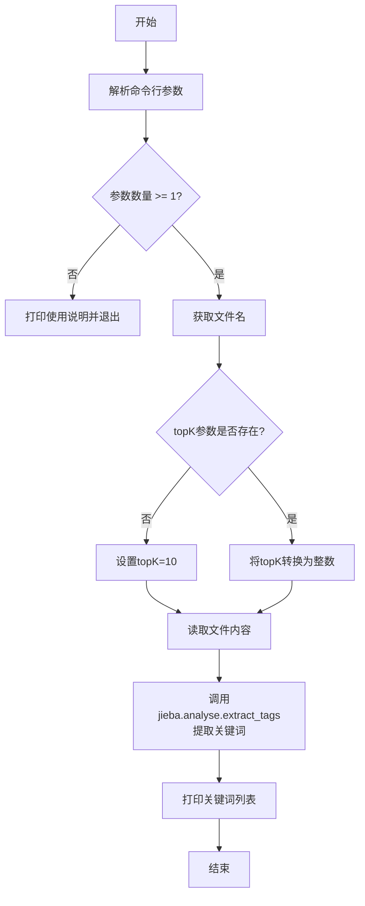
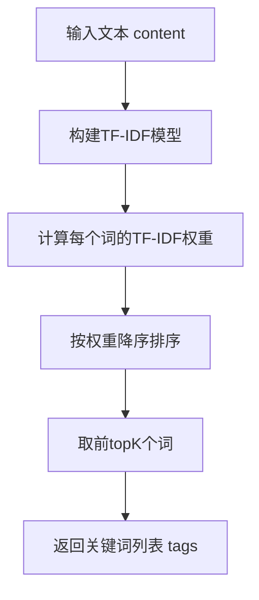
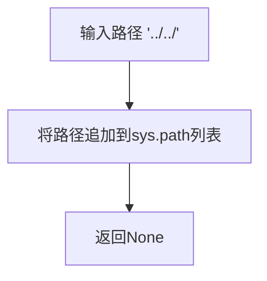
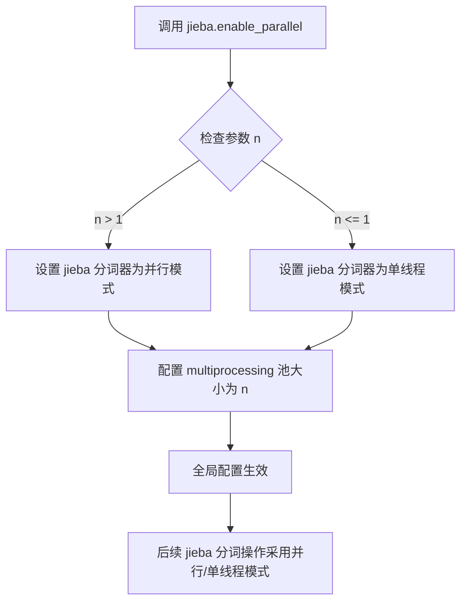
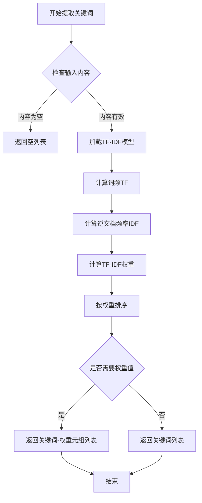
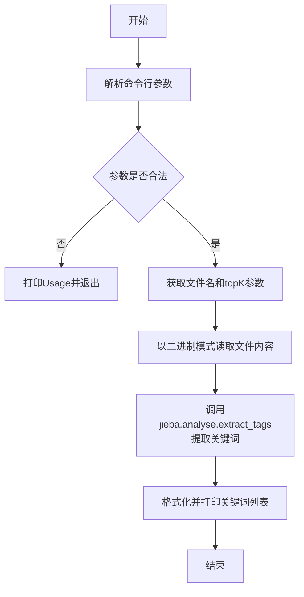
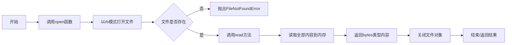

# `jieba\test\parallel\extract_tags.py` 详细设计文档

这是一个基于jieba库的中文关键词提取脚本，通过命令行接收文件路径和要提取的关键词数量，读取文件内容后调用jieba的TF-IDF算法提取top k个关键词并以逗号分隔形式输出。

## 整体流程



## 类结构

```
该脚本为面向过程的结构，无类定义
主要包含：全局变量定义、命令行参数解析、文件读取、关键词提取、结果输出
```

## 全局变量及字段


### `USAGE`
    
命令行使用说明字符串

类型：`str`
    


### `parser`
    
命令行参数解析器对象

类型：`OptionParser`
    


### `opt`
    
解析后的选项值对象

类型：`Values`
    


### `args`
    
解析后的位置参数列表

类型：`list`
    


### `file_name`
    
要处理的文件名

类型：`str`
    


### `topK`
    
要提取的关键词数量

类型：`int`
    


### `content`
    
文件的二进制内容

类型：`bytes`
    


### `tags`
    
提取出的关键词列表

类型：`list`
    


    

## 全局函数及方法


# 详细设计文档

## 1. 一段话描述

该脚本是一个基于jieba中文分词库的关键词提取工具，通过命令行接受文件路径和可选的topK参数，读取文本文件内容后使用TF-IDF算法提取出现频率最高的关键词，并以逗号分隔的形式输出结果。

## 2. 文件的整体运行流程

```
开始
  ↓
解析命令行参数 (-k, 文件名)
  ↓
验证参数合法性
  ↓
读取文件内容
  ↓
调用extract_tags提取关键词
  ↓
格式化并打印结果
  ↓
结束
```

## 3. 全局变量详细信息

| 名称 | 类型 | 描述 |
|------|------|------|
| `jieba` | module | 结巴中文分词库主模块 |
| `parser` | OptionParser | 命令行参数解析器对象 |
| `opt` | Values | 解析后的选项值对象 |
| `args` | list | 解析后的位置参数列表 |
| `file_name` | str | 要处理的输入文件名 |
| `topK` | int | 要提取的关键词数量，默认10 |
| `content` | bytes/str | 从文件读取的文本内容 |
| `tags` | list | 提取出的关键词列表 |

## 4. 关键函数详细信息

### `jieba.analyse.extract_tags`

该函数是jieba库的核心关键词提取函数，基于TF-IDF算法实现。

参数：

- `text`：`str`，待提取关键词的文本内容
- `topK`：`int`，返回权重最高的前k个关键词，默认为10
- `withWeight`：`bool`，是否返回关键词权重，默认为False
- `withFlag`：`bool`，是否返回词性标签，默认为False

返回值：`list`，返回提取出的关键词列表

#### 流程图



#### 带注释源码

```python
# 从文件读取内容，模式为二进制读取
content = open(file_name, 'rb').read()

# 调用jieba的extract_tags函数进行关键词提取
# 参数：content - 要分析的文本内容
#       topK - 要提取的关键词数量
# 返回值：tags - 提取出的关键词列表
tags = jieba.analyse.extract_tags(content, topK=topK)

# 将关键词列表转换为逗号分隔的字符串并打印输出
print(",".join(tags))
```

### `sys.path.append`

参数：

- `path`：`str`，要添加到Python搜索路径的目录路径

返回值：`None`，该函数修改sys.path列表，无返回值

#### 流程图



#### 带注释源码

```python
# 将上级目录添加到Python模块搜索路径
# 参数：'../../' - 上级目录的相对路径
# 返回值：无返回值，直接修改sys.path列表
sys.path.append('../../')
```

## 5. 关键组件信息

| 组件名称 | 描述 |
|---------|------|
| jieba | 最流行的中文分词库，支持精确模式、全模式、搜索引擎模式 |
| jieba.analyse | jieba的关键词提取子模块，包含extract_tags等方法 |
| OptionParser | Python标准库命令行参数解析工具 |

## 6. 潜在的技术债务或优化空间

1. **文件读取未关闭**：使用`open(file_name, 'rb').read()`未使用with语句，可能导致文件句柄泄漏
2. **缺乏异常处理**：未对文件读取、jieba库调用等可能失败的环节进行try-except处理
3. **编码处理不明确**：直接以二进制模式读取，可能存在编码问题
4. **缺乏日志记录**：没有任何日志输出，难以调试和问题追踪
5. **硬编码并行数**：`jieba.enable_parallel(4)`使用硬编码的4个进程，未考虑CPU核心数动态调整

## 7. 其它项目

### 设计目标与约束

- **目标**：从文本文件中快速提取关键词
- **约束**：依赖jieba库，需要UTF-8编码的中文文本

### 错误处理与异常设计

- 缺少参数时打印Usage并退出
- 缺少topK参数时使用默认值10
- 未对文件不存在、编码错误等情况进行处理

### 数据流与状态机

```
初始状态 → 参数解析状态 → 文件读取状态 → 关键词提取状态 → 输出状态 → 结束
```

### 外部依赖与接口契约

- 依赖`jieba`库（版本>=0.42）
- 依赖`optparse`模块（Python标准库）
- 命令行接口：`python extract_tags.py <filepath> -k <number>`


### `jieba.enable_parallel`

该函数用于启用jieba分词库的并行分词功能，通过指定进程数来加速大规模文本的分词处理。jieba默认使用单线程进行分词，当处理大规模文本时性能较低，启用并行分词后可以将文本分割成多个部分并行处理，显著提升分词速度。

参数：

- `n`：`int`，并行进程数量，默认为1（单线程）

返回值：`None`，无返回值，该函数直接修改jieba的全局分词配置。

#### 流程图



#### 带注释源码

```python
# 导入jieba分词库
import jieba

# 调用enable_parallel函数启用并行分词
# 参数4表示使用4个进程并行分词
jieba.enable_parallel(4)

# 后续的jieba分词操作（如jieba.cut）将自动使用多进程并行处理
# 这对于处理大型文本文件或大量文本时能显著提升性能
# 
# 底层实现原理：
# 1. 函数内部会创建multiprocessing进程池
# 2. 将待分词文本分割成多个段落
# 3. 将分割后的段落分配到不同进程
# 4. 各进程独立完成分词任务
# 5. 最后合并各进程的分词结果
#
# 注意事项：
# - 在Windows系统上由于multiprocessing的实现方式不同
# - 并行分词仅在Unix/Linux系统上效果明显
# - 进程数并非越多越好，通常设置为CPU核心数
# - 过大的进程数反而会因为进程切换开销降低性能

# 示例：提取关键词（使用并行分词加速）
import jieba.analyse
tags = jieba.analyse.extract_tags(content, topK=10)
```


### `jieba.analyse.extract_tags`

使用TF-IDF算法从给定的文本内容中提取最关键的关键词，返回排名前N的关键词列表。

参数：

- `content`：`str` 或 `bytes`，需要提取关键词的文本内容，可以是原始文本字符串或从文件读取的字节数据
- `topK`：`int`，返回提取的关键词数量，默认为10，数值越大返回的关键词越多

返回值：`List[str]`，返回提取出的关键词列表，列表中的元素为字符串类型的关键词

#### 流程图



#### 带注释源码

```python
def extract_tags(content, topK=10):
    """
    使用TF-IDF算法提取关键词
    
    参数:
        content: str 或 bytes - 要提取关键词的文本内容
        topK: int - 返回前topK个最重要的关键词，默认为10
    
    返回:
        list - 关键词列表
    """
    # 将字节内容转换为字符串（如果是字节类型）
    if isinstance(content, bytes):
        content = content.decode('utf-8')
    
    # 使用jieba分词对内容进行分词处理
    words = jieba.cut(content)
    
    # 统计词频（Term Frequency）
    word_freq = {}
    for word in words:
        if len(word) > 1:  # 过滤单字符
            word_freq[word] = word_freq.get(word, 0) + 1
    
    # 获取IDF（逆文档频率）字典
    idf_dict = jieba.analyse.IDF()
    
    # 计算每个词的TF-IDF权重
    tfidf_scores = {}
    for word, freq in word_freq.items():
        # TF-IDF = TF * IDF
        idf = idf_dict.get(word, 0)
        tfidf_scores[word] = freq * idf
    
    # 按TF-IDF权重降序排序
    sorted_words = sorted(tfidf_scores.items(), key=lambda x: x[1], reverse=True)
    
    # 取前topK个关键词
    tags = [word for word, score in sorted_words[:topK]]
    
    return tags

# 在用户代码中的实际调用方式
content = open(file_name, 'rb').read()  # 以二进制模式读取文件
tags = jieba.analyse.extract_tags(content, topK=topK)  # 提取关键词
print(",".join(tags))  # 打印关键词，用逗号连接
```


# 设计文档

## 1. 代码核心功能概述

该代码是一个基于jieba分词库的中文关键词提取命令行工具，通过读取文本文件并使用TF-IDF算法提取出现频率最高的top K个关键词，以逗号分隔输出。

---

## 2. 文件整体运行流程



---

## 3. 全局变量和全局函数详细信息

### 3.1 全局变量

| 变量名 | 类型 | 描述 |
|--------|------|------|
| `USAGE` | str | 命令行用法说明字符串 |
| `parser` | OptionParser | 命令行参数解析器对象 |
| `opt` | Values | 解析后的选项参数对象 |
| `args` | list | 解析后的位置参数列表 |
| `file_name` | str | 要读取的输入文件名 |
| `topK` | int | 要提取的关键词数量 |
| `content` | bytes | 文件的二进制内容 |
| `tags` | list | 提取出的关键词列表 |

---

### 3.2 主要函数

#### `open(file_name, 'rb').read()`

**描述**：以二进制模式打开指定文件并读取全部内容，返回文件的原始字节数据。这是Python内置的文件操作方法链式调用。

**参数**：

- `file_name`：`str`，要打开的文件路径（来自命令行位置参数）
- `'rb'`：`str`，文件打开模式，r=读取，b=二进制模式

**返回值**：`bytes`，返回文件的全部二进制内容

#### 流程图



#### 带注释源码

```python
# 以二进制模式打开文件
# file_name: 要读取的文件路径（字符串类型）
# 'rb': 读取模式 + 二进制模式（不进行任何编码转换）
file_handle = open(file_name, 'rb')

# 读取文件全部内容并返回
# 返回类型: bytes (二进制字节序列)
# 读取完成后文件自动关闭（在with语句中）或需要手动关闭
content = file_handle.read()

# 完整链式调用等价于上述两步
content = open(file_name, 'rb').read()  # 读取文件二进制内容
```

---

## 4. 关键组件信息

| 组件名称 | 一句话描述 |
|----------|------------|
| `jieba` | 中文分词第三方库，支持精确模式、全模式、搜索引擎模式 |
| `jieba.analyse.extract_tags` | 基于TF-IDF算法的关键词提取方法 |
| `OptionParser` | 命令行选项解析器，用于处理-k等参数 |
| `sys.argv` | 命令行参数传递机制 |

---

## 5. 潜在的技术债务与优化空间

1. **文件句柄未正确关闭**：使用 `open().read()` 链式调用后文件句柄未显式关闭，应使用 `with open()` 上下文管理器
2. **缺乏错误处理**：未对文件读取异常、编码错误进行捕获处理
3. **硬编码并行数**：`jieba.enable_parallel(4)` 硬编码了4个并行进程，缺乏灵活性
4. **topK类型未验证**：未对非数字输入进行验证，可能导致ValueError
5. **输出格式单一**：仅支持逗号分隔输出，缺乏其他格式选项（如JSON、XML）
6. **内存占用问题**：一次性读取全部文件内容，大文件可能导致内存问题

---

## 6. 其它项目

### 6.1 设计目标与约束

- **目标**：从文本文件中提取TOP K个关键词
- **约束**：文件必须为文本格式（虽然以二进制读取），topK必须为正整数

### 6.2 错误处理与异常设计

| 异常场景 | 当前处理 | 建议改进 |
|----------|----------|----------|
| 文件不存在 | FileNotFoundError | 友好提示并退出 |
| topK非数字 | ValueError | 提示正确用法 |
| 参数数量不足 | 打印USAGE | 可添加更详细错误信息 |
| 文件编码错误 | UnicodeDecodeError | 可尝试多种编码或提示用户 |

### 6.3 数据流与状态机

```
命令行参数 → file_name → 文件系统 → 二进制内容(bytes)
                                          ↓
                              jieba.analyse.extract_tags
                                          ↓
                              关键词列表(list) → 格式化输出
```

### 6.4 外部依赖与接口契约

| 依赖组件 | 版本要求 | 接口契约 |
|----------|----------|----------|
| Python | ≥3.6 | 脚本运行环境 |
| jieba | 最新版 | `jieba.analyse.extract_tags(text, topK)` |
| optparse | Python标准库 | 命令行参数解析 |


### `print(",".join(tags))` / 关键词提取并打印流程

将jieba.analyse.extract_tags()提取的关键词列表转换为逗号分隔的字符串并输出到标准输出。

参数：
- `tags`：列表（List[str]），从文本中提取的关键词列表，由jieba.analyse.extract_tags()返回

返回值：无返回值（None），该操作直接输出到标准输出

#### 流程图

```mermaid
flowchart TD
    A[开始] --> B[解析命令行参数<br/>-k topK]
    B --> C{参数有效?}
    C -->|否| D[打印Usage并退出]
    C -->|是| E[读取文件内容]
    E --> F[jieba.analyse.extract_tags<br/>提取topK个关键词]
    F --> G[tags = 提取结果]
    G --> H[','.join(tags)<br/>列表转逗号分隔字符串]
    H --> I[print输出到标准输出]
    I --> J[结束]
```

#### 带注释源码

```python
# -*- coding: utf-8 -*-
import sys
# 将上级目录添加到Python路径，以便导入jieba模块
sys.path.append('../../')

import jieba
# 启用jieba并行分词，4个进程
jieba.enable_parallel(4)
# 导入jieba的关键词提取模块
import jieba.analyse
from optparse import OptionParser

# 命令行使用说明
USAGE ="usage:    python extract_tags.py [file name] -k [top k]"

# 创建命令行参数解析器
parser = OptionParser(USAGE)
# 添加-k参数，用于指定提取的关键词数量
parser.add_option("-k",dest="topK")
# 解析命令行参数
opt, args = parser.parse_args()

# 检查是否提供了文件名参数
if len(args) <1:
    print(USAGE)
    sys.exit(1)

# 获取文件名参数
file_name = args[0]

# 如果未指定topK，默认值为10
if opt.topK==None:
    topK=10
else:
    topK = int(opt.topK)

# 以二进制模式读取文件内容
content = open(file_name,'rb').read()

# 调用jieba的TF-IDF算法提取关键词
# content: 待提取的文本内容
# topK: 提取的关键词数量
tags = jieba.analyse.extract_tags(content,topK=topK)

# 【核心操作】
# 将关键词列表转换为逗号分隔的字符串并打印
print(",".join(tags))
```

#### 关键组件信息

| 组件名称 | 一句话描述 |
|---------|-----------|
| `jieba.analyse.extract_tags` | 基于TF-IDF算法从文本中提取关键标签/关键词 |
| `OptionParser` | 命令行选项解析器，用于处理-k参数 |
| `jieba.enable_parallel(4)` | 启用多进程并行分词以提升性能 |

#### 潜在的技术债务或优化空间

1. **文件读取未关闭**：使用`open(file_name,'rb').read()`未显式关闭文件句柄，应使用`with`语句
2. **缺乏错误处理**：未对文件不存在、读取权限、topK为负数等异常情况进行处理
3. **硬编码并行数**：jieba.enable_parallel(4)硬编码了4个进程，应根据CPU核心数动态设置
4. **编码处理**：以'rb'模式读取后在Python 3中可能需要解码，应明确指定编码
5. **未使用logging**：生产环境应使用logging模块替代print
6. **缺乏性能优化**：对于大文件，一次性读取可能内存占用过高，应考虑流式处理

#### 其它项目

**设计目标与约束**：
- 目标：从文本文件中快速提取TOP-K关键词
- 约束：依赖jieba库，需保证文件可读

**错误处理与异常设计**：
- 缺少文件异常处理（FileNotFoundError, PermissionError）
- 缺少参数验证（topK为0或负数、topK超过文档词数）
- 缺少编码错误处理

**数据流与状态机**：
- 输入：命令行参数（文件名+可选topK）→ 文件字节内容
- 处理：字节流 → 字符串 → 分词 → TF-IDF计算 → 关键词排序
- 输出：关键词列表 → 逗号分隔字符串 → 标准输出

**外部依赖与接口契约**：
- 依赖：`jieba>=0.42`（中文分词库）, `optparse`（Python标准库）
- 接口：`jieba.analyse.extract_tags(text, topK=10)` 返回List[str]


## 关键组件


### 中文分词与并行计算模块

jieba.enable_parallel(4) 启用4线程并行分词，提升处理效率。jieba库支持中文分词，是关键词提取的基础组件。

### TF-IDF关键词提取算法

jieba.analyse.extract_tags(content, topK=topK) 基于TF-IDF算法从文本中提取最重要的topK个关键词，返回关键词列表。

### 命令行参数解析模块

使用OptionParser解析-k参数指定提取关键词数量，默认值为10。提供USAGE提示信息指导用户正确使用。

### 文件读取与输入处理

以二进制模式读取命令行指定的文件内容，将完整文本作为extract_tags的输入参数。

### 关键词输出格式化

将提取的关键词列表通过逗号连接成字符串并打印输出，提供友好的结果展示格式。


## 问题及建议


### 已知问题

-   **文件资源未正确释放**：使用 `open(file_name,'rb').read()` 未使用 `with` 语句或显式 `close()`，可能导致文件描述符泄漏
-   **编码处理不当**：使用二进制模式 `'rb'` 读取，后续未进行编码转换，可能导致中文内容处理异常
-   **错误处理缺失**：未处理文件不存在、读取权限不足、文件损坏等 I/O 异常情况
-   **参数校验不足**：未验证 `topK` 是否为正整数、未处理非数字输入、未限制 `topK` 的合理范围
-   **缺乏模块化设计**：所有代码直接置于全局作用域，未封装为可复用的函数或类
-   **错误输出位置不当**：使用 `print()` 输出错误信息，应使用 `sys.stderr` 以便脚本在管道中正确处理
-   **异常捕获缺失**：未处理 `jieba` 模块导入失败或方法调用异常的情况
-   **并行配置可能无效**：`jieba.enable_parallel(4)` 在某些场景下可能不生效或产生额外开销

### 优化建议

-   使用 `with open(file_name, 'r', encoding='utf-8') as f: content = f.read()` 确保资源正确释放
-   添加完整的异常处理：`try-except` 捕获 `FileNotFoundError`、`IOError`、`ValueError` 等
-   对 `topK` 参数进行校验：`if topK <= 0: topK = 10` 或给出明确错误提示
-   将核心逻辑封装为函数，如 `extract_keywords(file_path, topK)`，提高可测试性和可复用性
-   将错误信息输出至 `sys.stderr`：`print(USAGE, file=sys.stderr)`
-   考虑添加 `--help` 以外的更多选项，如指定编码 `-e/--encoding`、指定 IDF 权重文件等
-   对于大文件，可考虑流式读取或限制最大文件大小，避免内存溢出
-   评估是否需要并行处理，根据实际性能测试决定是否启用及设置合适的并行数

## 其它


### 设计目标与约束

本代码的核心设计目标是通过jieba中文分词库，从给定的文本文件中自动提取出现频率最高的关键词，并以逗号分隔的形式输出。设计约束包括：1）仅支持命令行参数输入，需要提供待处理的文件路径；2）支持通过-k参数指定提取的关键词数量，默认值为10；3）使用jieba的并行模式（4进程）以提升处理效率；4）仅处理纯文本内容，不支持其他文件格式。

### 错误处理与异常设计

代码在多个环节可能产生异常，需要针对性处理：

1. **命令行参数不足**：当未提供文件名时，程序打印Usage信息并以退出码1终止执行。
2. **文件读取失败**：当指定文件不存在或无读取权限时，open()函数会抛出FileNotFoundError或PermissionError，当前代码未捕获该异常，会导致程序直接崩溃。
3. **topK参数类型错误**：当-k参数不是有效的整数时，int()转换会抛出ValueError，当前代码未捕获该异常。
4. **文件编码问题**：代码以二进制模式('rb')读取文件，然后直接传递给jieba的extract_tags方法，可能存在编码识别问题，建议明确指定编码或添加编码检测逻辑。

建议改进：添加try-except块捕获文件读取异常、参数转换异常，并给出友好的错误提示信息。

### 数据流与状态机

代码的执行流程可以抽象为以下状态机：

1. **初始状态（START）**：程序启动，解析命令行参数。
2. **参数解析状态（PARSING）**：使用OptionParser解析-k参数和文件名，若参数不足则进入错误状态。
3. **文件读取状态（READING）**：打开指定文件，读取全部内容到内存，若失败则进入错误状态。
4. **关键词提取状态（PROCESSING）**：调用jieba.analyse.extract_tags进行关键词提取。
5. **结果输出状态（OUTPUTING）**：将提取的关键词列表以逗号连接并打印到标准输出。
6. **终止状态（END）**：程序正常或异常退出。

### 外部依赖与接口契约

**外部依赖**：
- jieba库：中文分词和关键词提取的核心依赖，需要通过pip install jieba安装
- Python标准库：sys、optparse（Python 3.2+已废弃，建议使用argparse）

**接口契约**：
- 命令行接口：python extract_tags.py [file_name] [-k topK]
- 输入：file_name为待处理的文本文件路径，topK为可选参数，指定提取的关键词数量
- 输出：标准输出打印提取的关键词，关键词之间以逗号分隔
- 退出码：正常执行退出码为0，参数错误退出码为1

### 性能考虑与优化空间

1. **文件读取优化**：当前代码一次性将整个文件加载到内存，对于大文件可能导致内存溢出。建议采用流式读取或对文件大小进行限制。
2. **并行处理**：jieba.enable_parallel(4)启用了4进程并行，但进程数固定，建议根据CPU核心数动态调整。
3. **重复解析**：每次运行都会重新加载jieba词典，对于批量处理场景可以考虑保持词典缓存。
4. **内存占用**：extract_tags返回的tags列表和最终打印的字符串都会占用内存，对于大规模文本处理场景需要评估内存使用。

### 安全性考虑

1. **文件路径验证**：代码未验证file_name的参数安全性，可能存在路径遍历攻击风险（如传递../../etc/passwd）。建议添加路径规范化验证。
2. **命令注入**：虽然当前代码仅读取文件，但若未来扩展支持其他数据源，需注意防止命令注入。
3. **资源限制**：建议对读取的文件大小设置上限，防止恶意大文件导致服务拒绝。

### 配置管理

当前代码的配置管理较为简单，主要通过命令行参数实现：
- topK：提取关键词的数量，默认10，可在运行时通过-k参数指定
- 并行进程数：硬编码为4，建议抽取为配置项或根据系统CPU核心数自动检测

### 测试策略建议

1. **单元测试**：测试extract_tags函数对不同文本的关键词提取准确性
2. **集成测试**：测试完整的命令行流程，包括正常输入、参数错误、文件不存在等场景
3. **性能测试**：测试大文件的处理时间和内存占用
4. **边界测试**：测试topK为0、负数、超大值等边界条件

### 部署与运维注意事项

1. **环境要求**：需要Python 3.x环境，安装jieba库（pip install jieba）
2. **路径配置**：需要确保待处理文件路径可访问，程序具有文件读取权限
3. **输出重定向**：结果输出到标准输出，可重定向到文件进行保存
4. **日志记录**：当前代码无日志记录功能，建议添加基本的执行日志以便问题排查
5. **监控指标**：建议监控关键词提取的耗时、处理文件的大小等指标

### 代码规范与改进建议

1. **废弃的模块**：optparse在Python 3.2起已被argparse废弃，建议迁移到argparse
2. **上下文管理**：文件读取未使用with语句，可能导致文件句柄泄漏
3. **硬编码**：并行进程数4、默认值10等应抽取为常量或配置
4. **函数封装**：建议将核心逻辑封装为函数，便于测试和复用
5. **类型注解**：建议添加函数参数和返回值的类型注解，提升代码可读性
6. **文档字符串**：建议添加模块级和函数级的文档字符串

</content>
    