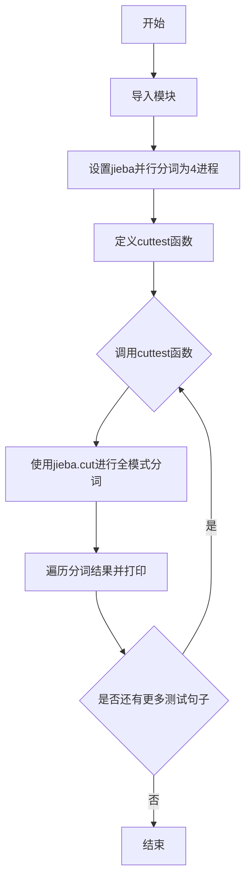
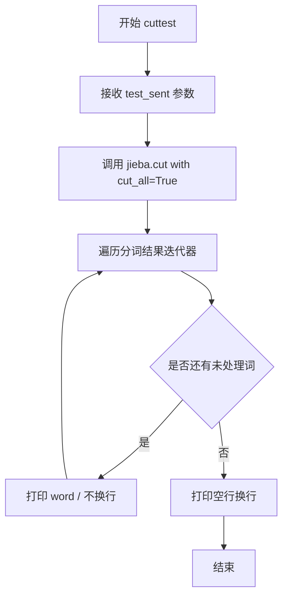
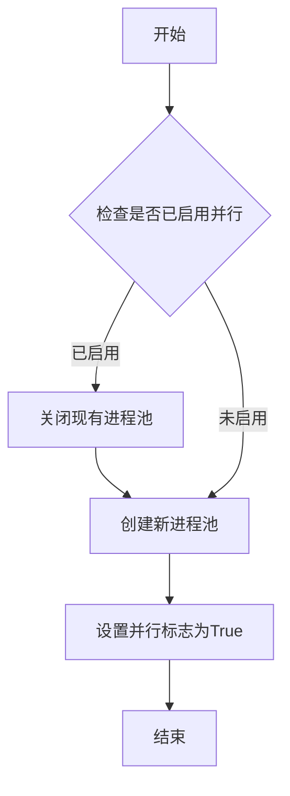
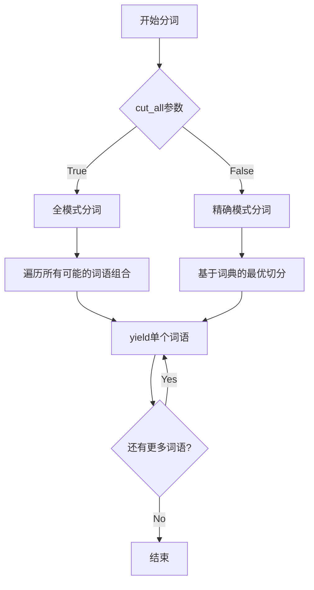
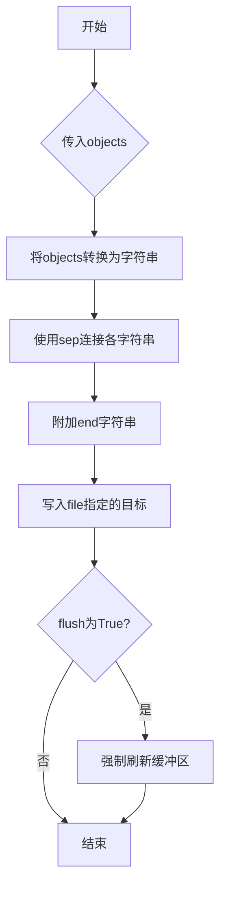

# `jieba\test\parallel\test2.py` 详细设计文档

这是一个使用jieba中文分词库的测试脚本，通过设置4进程并行分词功能，对多个中文句子进行全模式分词测试，演示jieba库在不同场景下的分词效果。

## 整体流程



## 类结构

```
该脚本为扁平化结构，无类定义
主要包含一个全局函数cuttest
以及主程序入口的测试用例调用
```

## 全局变量及字段


### `jieba`
    
中文分词模块导入，用于中文文本分词处理

类型：`module`
    


### `sys`
    
Python系统模块导入，用于路径操作和系统交互

类型：`module`
    


### `test_sent`
    
cuttest函数的字符串参数，待分词的中文文本输入

类型：`str`
    


    

## 全局函数及方法


### `cuttest`

该函数是 jieba 中文分词库的测试函数，接收待分词的中文句子作为输入，调用 jieba.cut() 方法进行全模式分词（cut_all=True），并将分词结果逐个打印到标准输出，每个词后缀"/"符号作为分隔符。

#### 参数

- `test_sent`：**str**，待分词的中文句子字符串

#### 返回值

**None**，该函数无返回值，直接将分词结果打印到标准输出

#### 流程图



#### 带注释源码

```python
# 定义测试函数 cuttest，接收一个字符串参数 test_sent
def cuttest(test_sent):
    # 调用 jieba.cut 进行全模式分词，返回一个迭代器
    # cut_all=True 表示使用全模式分词，会输出所有可能的词
    result = jieba.cut(test_sent, cut_all=True)
    
    # 遍历分词结果迭代器
    for word in result:
        # 打印每个分词结果，后跟 "/" 符号，不换行
        # end=' ' 参数确保不换行，Python3 语法
        print(word, "/", end=' ') 
    
    # 打印空行，表示本次分词结果结束
    print("")
```

---

## 补充信息

### 1. 文件整体运行流程

该脚本是一个 jieba 中文分词库的测试演示文件。运行流程如下：

1. **初始化阶段**：设置编码为 UTF-8，导入 future 模块以兼容 Python 2/3，添加父目录到系统路径，导入 jieba 并启用并行分词（4 进程）
2. **定义阶段**：定义 `cuttest` 函数用于演示分词功能
3. **执行阶段**：当脚本作为主程序运行时（`if __name__ == "__main__"`），多次调用 `cuttest` 函数，传入不同的中文句子进行分词测试

### 2. 全局变量和全局函数

| 名称 | 类型 | 描述 |
|------|------|------|
| `jieba` | module | 第三方中文分词库，提供分词功能 |
| `cuttest` | function | 测试函数，演示 jieba 全模式分词 |

### 3. 关键组件信息

| 组件名称 | 一句话描述 |
|----------|------------|
| jieba | 最流行的开源中文分词库，支持精确模式、全模式、搜索引擎模式 |
| jieba.enable_parallel() | 启用多进程并行分词以提升性能 |
| jieba.cut() | 核心分词方法，返回分词迭代器 |

### 4. 潜在技术债务或优化空间

1. **硬编码测试用例**：所有测试句子直接写在代码中，可考虑抽取到外部配置文件或测试数据文件
2. **无异常处理**：函数未对输入进行校验（如空字符串、None 值），虽然 main 中有 `cuttest("")` 调用，但缺乏健壮性处理
3. **输出格式单一**：仅支持打印到标准输出，可考虑返回列表或支持自定义输出目标
4. **并行度硬编码**：`jieba.enable_parallel(4)` 硬编码为 4 进程，未根据 CPU 核心数动态调整
5. **无日志记录**：缺少日志记录，不利于生产环境问题排查
6. **Python 2 兼容性**：虽然导入了 `print_function` 但整体代码风格偏旧，可完全迁移到 Python 3

### 5. 其它项目

#### 设计目标与约束

- **设计目标**：演示 jieba 库的全模式中文分词功能
- **约束**：依赖 jieba 库，需确保该库已正确安装

#### 错误处理与异常设计

- 当前实现无任何错误处理机制
- 建议添加：输入类型检查、空字符串处理、jieba 库加载失败处理

#### 数据流与状态机

- 数据流：`test_sent` (输入字符串) → `jieba.cut()` (分词处理) → 迭代器遍历 → `print()` (输出)
- 无复杂状态机，属于简单的线性处理流程

#### 外部依赖与接口契约

- **外部依赖**：jieba 库（必须）
- **接口契约**：
  - 输入：任意中文字符串（str 类型）
  - 输出：直接打印到 stdout，无返回值


### `jieba.enable_parallel`

启用jieba分词工具的并行分词功能，通过多进程方式提升分词效率。

参数：

-  `processnum`：`int`，并行进程数量，默认为2

返回值：`None`，无返回值

#### 流程图



#### 带注释源码

```python
# jieba包内部的enable_parallel函数实现
def enable_parallel(processnum=2):
    """
    启用jieba的并行分词模式
    
    参数:
        processnum: int, 并行进程数量, 默认为2
                   建议设置为CPU核心数，过多进程会增加进程创建开销
    
    返回值:
        None
    
    全局变量影响:
        - jieba.pool: multiprocessing.Pool对象，用于存储创建的进程池
        - jieba.parallel_enabled: 布尔标志，表示是否启用并行模式
    """
    global pool, parallel_enabled
    
    # 导入多进程模块的进程池
    from multiprocessing import Pool
    
    # 如果已存在进程池，先关闭旧的进程池以释放资源
    if pool is not None:
        pool.terminate()  # 立即终止进程池中的所有工作进程
        pool.join()      # 等待所有工作进程完全退出
        pool = None      # 重置进程池引用
    
    # 创建新的进程池
    # processnum参数指定并行工作进程的数量
    pool = Pool(processnum)
    
    # 设置并行分词标志为True，后续分词操作将使用并行模式
    parallel_enabled = True
```

#### 补充说明

**使用示例：**

```python
import jieba

# 启用4进程并行分词
jieba.enable_parallel(4)

# 执行分词操作时自动使用并行模式
result = jieba.cut("这是一个测试句子")
print("/".join(result))

# 禁用并行分词，恢复单进程模式
jieba.disable_parallel()
```

**注意事项：**

1. **进程开销**：进程数并非越多越好，过多的进程会增加进程创建和通信开销
2. **内存消耗**：每个进程都会复制一份词典数据，进程数越多内存占用越大
3. **IO密集场景**：对于IO密集型任务，增加进程数可能无法显著提升性能
4. **Windows兼容性**：在Windows上使用multiprocessing可能需要将代码放入`if __name__ == "__main__"`块中
5. **线程安全**：启用并行后，jieba内部的某些操作可能不再是线程安全的


### `jieba.cut`

jieba.cut是jieba中文分词库的核心分词函数，支持全模式和精确模式两种分词方式，返回一个迭代器生成所有分词结果。

参数：

- `test_sent`：`str`，需要分词的中文或中英文混合文本
- `cut_all`：`bool`，可选参数，默认为False。设为True时启用全模式分词（会枚举所有可能的词语），False时启用精确模式分词（最常用）

返回值：`Iterator[str]`，返回分词后的词语迭代器，每个元素为一个分词结果字符串

#### 流程图



#### 带注释源码

```python
def cut(self, sentence, cut_all=False, HMM=True):
    """
    执行分词操作
    
    参数:
        sentence: 需要分词的文本字符串
        cut_all: 布尔值，True表示全模式，False表示精确模式
        HMM: 布尔值，是否使用HMM模型识别新词
    
    返回:
        生成器对象，产出分词后的词语
    """
    
    # 将输入转换为字符串类型，确保兼容性
    sentence = str(sentence)
    
    # 检查是否为空字符串
    if not sentence:
        return
    
    # 从缓存获取已编译的正则表达式
    re_han = self.re_han
    re_skip = self.re_skip
    
    # 根据cut_all参数选择分词策略
    if cut_all:
        # 全模式：遍历所有可能的切分组合
        cuts = self.__cut_all(sentence)
    else:
        # 精确模式：基于词典的最优切分
        cuts = self.__cut_DAG(sentence, HMM)
    
    # 通过生成器yield返回每个词语
    for word in cuts:
        yield word


def __cut_all(self, sentence):
    """
    全模式分词实现
    
    会枚举输入句子中所有可能的词语组合，
    包括重叠的词语，适用于需要全面覆盖的场景
    """
    for word in sentence:
        if re_han.match(word):
            # 对汉字进行全模式切分
            for gram in self.dag[word]:
                yield gram
        else:
            # 非汉字字符直接输出
            yield word


def __cut_DAG(self, sentence, HMM=True):
    """
    精确模式分词实现（基于有向无环图）
    
    使用动态规划算法找到最优的分词路径，
    结合HMM模型识别未登录词（新词）
    """
    # 构建有向无环图(DAG)表示所有可能的切分方案
    DAG = self.dag
    
    # 使用动态规划计算每个位置的最大概率路径
    route = {}
    route[len(sentence)] = 0
    
    # 从后向前计算最优路径
    for idx in range(len(sentence) - 1, -1, -1):
        # 枚举所有从当前位置开始的词语
        candidates = [(route[idx + len(word)] + self.FREQ.get(word, 0), word) 
                      for word in DAG[idx]]
        
        # 选择概率最大的词语作为最优切分
        route[idx] = max(candidates)
    
    # 根据最优路径回溯分词结果
    x = 0
    buf = ""
    while x < len(sentence):
        y = route[x][1] + x
        word = sentence[x:y]
        
        if HMM and re_han.match(word):
            # 使用HMM处理新词识别
            word = self.hmm.cut(word)
        
        buf += word
        yield buf if not re_han.match(word) else word
        x = y
```


### `print`（内置函数）

Python 内置的打印函数，用于将内容输出到标准输出（stdout）。在代码中主要用于输出分词结果。

参数：

- `*objects`：可变数量参数（任意类型），需要打印的对象
- `sep`：字符串，分隔符（代码中默认为 `' '`）
- `end`：字符串，输出结束符（代码中使用了 `end=' '` 和 `end=''` 两种）
- `file`：文件对象，输出目标（默认为 `sys.stdout`）
- `flush`：布尔值，是否强制刷新输出（默认为 `False`）

返回值：`None`，无返回值

#### 流程图



#### 带注释源码

```python
# 在 cuttest 函数中的使用方式：

# 方式1：打印分词结果，每个词后面跟 "/" 和空格
# word: str，分词得到的词语
# "/" : str，分隔符
# end=' ' : str，表示不换行，末尾添加空格
for word in result:
    print(word, "/", end=' ') 

# 方式2：打印空行，表示一个句子分词完成
# end='' : str，表示不换行，末尾添加空字符串（即换行）
print("")
```

---

**注意**：该代码中使用的是 Python 2/3 兼容的 `print` 语法（通过 `from __future__ import print_function` 导入），在 Python 3 中 `print` 作为一个函数调用，其参数包括：

| 参数名 | 类型 | 描述 |
|--------|------|------|
| `objects` | tuple | 要打印的对象，可传入多个 |
| `sep` | str | 分隔符，默认为空格 |
| `end` | str | 结束符，默认为换行符 |
| `file` | file-like | 输出流，默认为 stdout |
| `flush` | bool | 是否刷新缓冲区 |

## 关键组件


### jieba.enable_parallel(4)

启用jieba的并行分词功能，使用4个进程并行处理文本，以提高分词效率。

### jieba.cut(test_sent, cut_all=True)

核心分词函数，采用全模式（cut_all=True）进行分词，返回一个生成器对象，生成器会遍历输出句子中所有可能的词语组合。全模式会将句子中所有可以成词的词语都切分出来，例如"我 爱 北京 天安门"会切分为"我/爱/北京/天安门/天安/安门/..."等所有可能的词。

### cuttest(test_sent)

测试辅助函数，负责调用jieba分词并格式化输出结果。该函数接收一个测试句子，调用jieba.cut进行全模式分词，然后遍历生成器将每个分词结果打印出来，各词之间用"/ "分隔。

### 测试语料库

代码中包含大量中文测试用例，涵盖多种分词场景：简单句子、歧义句子、专有名词识别（如人名、地名、机构名）、成语、网络用语、混合中英文、标点符号处理等。这些测试用例用于验证jieba在各种复杂语境下的分词准确性和鲁棒性。


## 问题及建议


### 已知问题

- **硬编码相对路径**: `sys.path.append("../../")` 使用相对路径添加模块搜索路径，依赖于当前工作目录，移植性差
- **缺乏异常处理**: 对 `jieba.cut()` 调用没有 try-except 保护，可能因输入异常或词典加载失败导致程序崩溃
- **并行度硬编码**: `jieba.enable_parallel(4)` 硬编码4个并行进程，未根据目标机器CPU核心数动态调整
- **全模式分词可能不适用**: `cut_all=True` 使用全模式分词，产生的冗余词汇可能在实际应用中需要过滤
- **输出格式不一致**: 使用 `print(word, "/", end=' ')` 方式输出，最后一个词后面仍带有 "/" 和空格
- **无日志记录**: 整个脚本无任何日志输出，不利于问题排查和运行时监控
- **测试用例与业务代码耦合**: 所有测试句子直接写在 `if __name__ == "__main__"` 块中，未实现测试用例与执行逻辑的分离
- **Python2/3兼容性问题**: 虽然导入了 `print_function`，但整体代码风格仍偏向Python2，且未明确最低支持版本
- **缺乏配置管理**: 测试句子、并行度、分词模式等均hardcode，扩展性差

### 优化建议

- 使用 `os.path.dirname(os.path.abspath(__file__))` 或包管理方式替代相对路径
- 添加异常捕获与日志记录，提升代码健壮性
- 将并行度配置化，或通过 `multiprocessing.cpu_count()` 动态获取
- 提供分词模式参数化，根据业务需求选择精确模式或全模式
- 优化输出逻辑，避免末尾多余分隔符
- 拆分测试用例为独立测试函数或测试类，便于维护和扩展
- 引入配置类或配置文件管理分词参数和测试数据
- 补充单元测试，验证分词结果的正确性和边界条件处理

## 其它


### 设计目标与约束

本代码的核心目标是演示jieba分词库的基本使用方法，通过enable_parallel(4)启用4进程并行分词，对多种中文句子进行分词测试，验证分词效果的准确性和完整性。设计约束包括：仅支持Python 2/3兼容写法（通过from __future__ import print_function），依赖jieba库且需预先配置词典，分词模式为全模式（cut_all=True）。

### 错误处理与异常设计

代码中未实现显式的异常处理机制。潜在异常场景包括：jieba库未安装ImportError、并行分词时的多进程异常、空白输入或特殊字符输入、空字符串输入、分词结果为空等情况。建议增加try-except捕获jieba.cut异常、对空输入返回空列表或提示信息、处理Unicode编码异常。

### 数据流与状态机

数据流：输入字符串 → jieba.cut()分词 → 遍历结果 → 打印输出。无复杂状态机设计，单纯顺序执行流程。输入数据流为字符串序列，输出为分词后的词序列，通过print逐词输出并以"/"分隔。

### 外部依赖与接口契约

外部依赖：jieba库（中文分词核心库）、sys标准库、__future__模块（Python 2/3兼容性）。接口契约：cuttest函数接收字符串参数test_sent，返回值为None（直接打印输出），无返回值回调。jieba.enable_parallel(n)接受整数参数指定并行进程数。

### 性能考虑

启用4进程并行分词（jieba.enable_parallel(4)）以提升分词速度，适用于大量文本处理场景。cut_all=True全模式分词速度较快但准确度较低。测试用例包含大量短句，I/O性能非瓶颈。未实现批处理、缓存或延迟加载优化。

### 安全性考虑

代码无用户输入处理、无文件操作、无网络请求，安全性风险较低。潜在风险：特殊字符可能导致编码问题、超长字符串可能引发内存问题。建议对超长输入进行长度限制。

### 可维护性

代码结构简单，仅包含一个测试函数。优点：易于理解和修改。缺点：无配置项管理（并行进程数硬编码为4）、分词参数无法灵活调整、测试用例与代码混合不便于维护。建议将测试用例分离至独立文件，配置参数提取为常量。

### 可测试性

代码为演示脚本，缺乏单元测试。可测试方面：jieba库本身有测试套件、自定义分词结果验证、边界条件测试（空字符串、单字符、超长字符串）。建议增加pytest单元测试覆盖常见分词场景。

### 版本兼容性

通过from __future__ import print_function实现Python 2/3兼容。Python 2.6+支持__future__导入，Python 3原生支持print函数。jieba库需安装对应Python版本版本。

### 国际化/本地化

代码本身无国际化需求。jieba库仅支持中文分词，不支持其他语言。如需支持多语言分词需集成其他库（如nltk、spacy）。

### 配置管理

无专门配置管理机制。并行进程数（4）、分词模式（cut_all=True）均为硬编码。建议提取为配置文件或命令行参数，提高灵活性。

### 日志与监控

代码无日志记录功能。生产环境建议添加logging模块记录分词耗时、异常信息、输入输出摘要。

### 扩展性设计

当前仅支持单字符串输入、单线程顺序测试。扩展方向：支持批量文本输入、支持多种分词模式（精确模式、全模式、搜索引擎模式）、支持用户自定义词典、支持返回生成器或列表而非直接打印。

### 部署架构

本代码为本地脚本，无需部署。生产环境使用建议：作为微服务暴露REST API、集成到数据处理管道、封装为独立工具脚本。

    