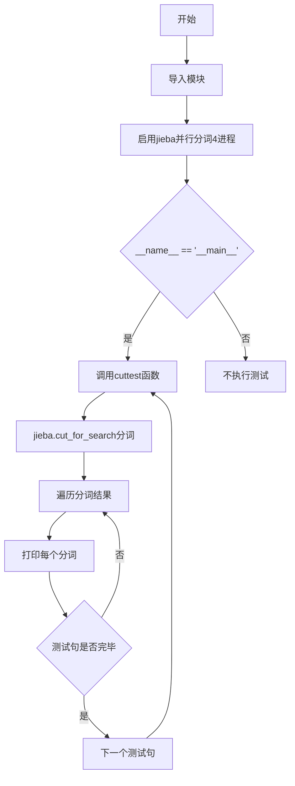
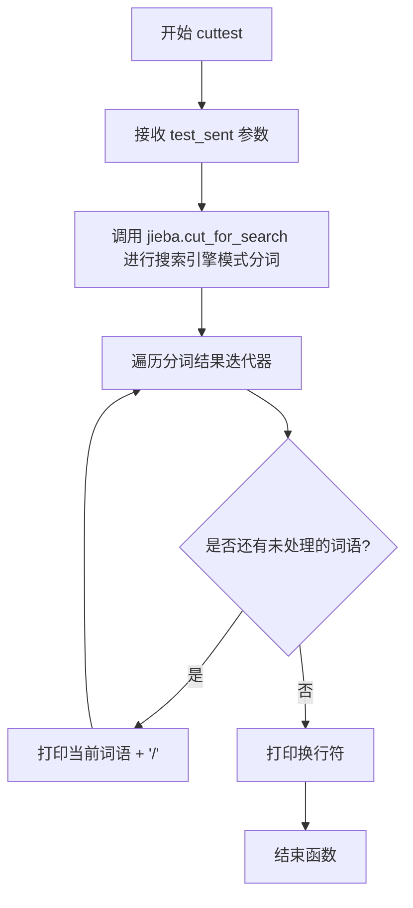

# `jieba\test\parallel\test_cut_for_search.py` 详细设计文档

这是一个基于jieba中文分词库的测试脚本，通过启用4进程并行分词功能，对多个中文测试句子进行搜索引擎模式的分词处理，并逐词打印分词结果。

## 整体流程



## 类结构

```
无类层次结构（面向过程编程）
仅包含一个全局函数: cuttest
```

## 全局变量及字段


### `jieba`
    
中文分词库模块，提供分词功能

类型：`module`
    


### `test_sent`
    
待分词的测试句子字符串参数

类型：`str`
    


### `result`
    
jieba分词结果迭代器，包含分词后的词语序列

类型：`generator`
    


### `word`
    
循环遍历分词结果时的当前词语变量

类型：`str`
    


    

## 全局函数及方法


### `cuttest`

`cuttest` 是一个基于jieba分词库的搜索引擎模式中文分词测试函数，它接收一个中文句子作为输入，调用 `jieba.cut_for_search()` 进行搜索引擎优化分词，然后将分词结果逐词打印输出，以"/"作为分隔符。该函数主要用于测试和演示jieba分词库在各种中文文本场景下的分词效果。

#### 参数

- `test_sent`：**str**，需要进行分词处理的中文或中英文混合输入字符串

#### 返回值

**None**，该函数无返回值，仅通过标准输出打印分词结果

#### 流程图



#### 带注释源码

```python
# encoding: utf-8
# 导入未来版本的print函数以兼容Python 2和Python 3
from __future__ import print_function
# 导入系统模块
import sys
# 将父目录添加到Python路径，以便导入jieba模块
sys.path.append("../../")
# 导入结巴中文分词库
import jieba
# 启用结巴分词的并行模式，使用4个进程加速分词
jieba.enable_parallel(4)


def cuttest(test_sent):
    """
    使用jieba搜索引擎模式对输入句子进行分词测试
    
    参数:
        test_sent: str, 需要分词的中文或中英文混合句子
    
    返回值:
        无返回值，直接打印分词结果到标准输出
    """
    # 使用jieba的搜索引擎模式进行分词，返回一个迭代器
    # cut_for_search会生成更细粒度的分词结果，适合搜索引擎索引
    result = jieba.cut_for_search(test_sent)
    
    # 遍历分词结果迭代器
    for word in result:
        # 打印每个词语，以"/"结尾不换行，格式如: 词语/词语/词语/
        print(word, "/", end=' ') 
    
    # 所有词语打印完毕后，换行
    print("")


# 程序入口点
if __name__ == "__main__":
    # 测试各种不同类型的中文句子
    
    # 测试1: 常规中文句子
    cuttest("这是一个伸手不见五指的黑夜。我叫孙悟空，我爱北京，我爱Python和C++。")
    
    # 测试2: 包含敏感词（被过滤）的句子
    cuttest("我不喜欢日本和服。")
    
    # 测试3: 方言/网络用语
    cuttest("雷猴回归人间。")
    
    # 测试4: 技术术语较多的句子
    cuttest("工信处女干事每月经过下属科室都要亲口交代24口交换机等技术性器件的安装工作")
    
    # 测试5: 特定词汇
    cuttest("我需要廉租房")
    
    # 测试6: 公司名称
    cuttest("永和服装饰品有限公司")
    
    # 测试7: 地名
    cuttest("我爱北京天安门")
    
    # 测试8: 英文单词
    cuttest("abc")
    
    # 测试9: 专业术语
    cuttest("隐马尔可夫")
    
    # 测试10: 网络用语
    cuttest("雷猴是个好网站")
    
    # 测试11: 包含引号的复杂句子
    cuttest("“Microsoft”一词由“MICROcomputer（微型计算机）”和“SOFTware（软件）”两部分组成")
    
    # 测试12: 网络流行语
    cuttest("草泥马和欺实马是今年的流行词汇")
    
    # 测试13: 日语品牌店名
    cuttest("伊藤洋华堂总府店")
    
    # 测试14: 科研机构名称
    cuttest("中国科学院计算技术研究所")
    
    # 测试15: 外国文学著作
    cuttest("罗密欧与朱丽叶")
    
    # 测试16: 日常对话
    cuttest("我购买了道具和服装")
    
    # 测试17: 包含缩写和微博格式
    cuttest("PS: 我觉得开源有一个好处，就是能够敦促自己不断改进，避免敞帚自珍")
    
    # 测试18-19: 城市地名
    cuttest("湖北省石首市")
    cuttest("湖北省十堰市")
    
    # 测试20-21: 日常事务描述
    cuttest("总经理完成了这件事情")
    cuttest("电脑修好了")
    
    # 测试22-25: 俗语和主观描述
    cuttest("做好了这件事情就一了百了了")
    cuttest("人们审美的观点是不同的")
    cuttest("我们买了一个美的空调")
    cuttest("线程初始化时我们要注意")
    
    # 测试26-28: 科技和祝福语
    cuttest("一个分子是由好多原子组织成的")
    cuttest("祝你马到功成")
    cuttest("他掉进了无底洞里")
    
    # 测试29-31: 地理和政治相关
    cuttest("中国的首都是北京")
    cuttest("孙君意")
    cuttest("外交部发言人马朝旭")
    
    # 测试32-36: 时事和政治会议
    cuttest("领导人会议和第四届东亚峰会")
    cuttest("在过去的这五年")
    cuttest("还需要很长的路要走")
    cuttest("60周年首都阅兵")
    cuttest("你好人们审美的观点是不同的")
    
    # 测试37-39: 地点和世博园相关
    cuttest("买水果然后来世博园")
    cuttest("买水果然后去世博园")
    cuttest("但是后来我才知道你是对的")
    
    # 测试40-42: 哲学和网络表达
    cuttest("存在即合理")
    cuttest("的的的的的在的的的的就以和和和")
    cuttest("I love你，不以为耻，反以为rong")
    
    # 测试43-46: 短句和混合表达
    cuttest("因")
    cuttest("")
    cuttest("hello你好人们审美的观点是不同的")
    cuttest("很好但主要是基于网页形式")
    
    # 测试47-53: 复杂长句
    cuttest("hello你好人们审美的观点是不同的")
    cuttest("为什么我不能拥有想要的生活")
    cuttest("后来我才")
    cuttest("此次来中国是为了")
    cuttest("使用了它就可以解决一些问题")
    cuttest(",使用了它就可以解决一些问题")
    cuttest("其实使用了它就可以解决一些问题")
    
    # 测试54-57: 政策和社会事件
    cuttest("好人使用了它就可以解决一些问题")
    cuttest("是因为和国家")
    cuttest("老年搜索还支持")
    cuttest("干脆就把那部蒙人的闲法给废了拉倒！RT @laoshipukong : 27日，全国人大常委会第三次审议侵权责任法草案，删除了有关医疗损害责任"举证倒置"的规定。在医患纠纷中本已处于弱势地位的消费者由此将陷入万劫不复的境地。 ")
    
    # 测试58-62: 地名和新闻事件
    cuttest("大")
    cuttest("")
    cuttest("他说的确实在理")
    cuttest("长春市长春节讲话")
    cuttest("结婚的和尚未结婚的")
    
    # 测试63-69: 科技和商业内容
    cuttest("结合成分子时")
    cuttest("旅游和服务是最好的")
    cuttest("这件事情的确是我的错")
    cuttest("供大家参考指正")
    cuttest("哈尔滨政府公布塌桥原因")
    cuttest("我在机场入口处")
    cuttest("邢永臣摄影报道")
    
    # 测试70-72: 专业技术问题
    cuttest("BP神经网络如何训练才能在分类时增加区分度？")
    cuttest("南京市长江大桥")
    cuttest("应一些使用者的建议，也为了便于利用NiuTrans用于SMT研究")
    
    # 测试73-78: 人名和日常对话
    cuttest('长春市长春药店')
    cuttest('邓颖超生前最喜欢的衣服')
    cuttest('胡锦涛是热爱世界和平的政治局常委')
    cuttest('程序员祝海林和朱会震是在孙健的左面和右面, 范凯在最右面.再往左是李松洪')
    cuttest('一次性交多少钱')
    cuttest('两块五一套，三块八一斤，四块七一本，五块六一条')
    
    # 测试79-80: 宗教和文化相关
    cuttest('小和尚留了一个像大和尚一样的和尚头')
    cuttest('我是中华人民共和国公民;我爸爸是共和党党员; 地铁和平门站')
```


## 关键组件


### jieba.enable_parallel(4)

启用jieba的并行分词功能，使用4个进程进行分词，以提高分词效率。

### jieba.cut_for_search()

搜索引擎友好的分词方法，支持细粒度分词，适用于搜索引擎索引构建。

### cuttest函数

接收测试句子，调用cut_for_search进行分词并打印结果，是整个测试流程的入口函数。

### 测试语料库

包含多种类型的中文测试句子，涵盖普通文本、数字、英文混合、专有名词、成语、网络用语等，用于全面测试jieba分词的效果。

### sys.path.append("../../")

将上级目录添加到Python路径，以便导入jieba库。


## 问题及建议


### 已知问题

- 硬编码并行进程数：`jieba.enable_parallel(4)` 使用固定的4个进程，未根据CPU核心数动态调整
- 缺乏错误处理：没有对jieba加载、分词过程进行异常捕获，程序可能在词典加载失败时直接崩溃
- Python 2/3兼容性隐患：虽然导入了`print_function`，但`end=' '`参数在Python 2中会报语法错误
- 路径依赖问题：使用`sys.path.append("../../")`添加相对路径，依赖当前工作目录，迁移后可能找不到模块
- 缺乏配置管理：没有加载自定义词典或进行任何jieba配置，分词效果可能不是最优
- 可测试性差：所有测试用例直接写在`__main__`中，没有分离测试数据和测试逻辑
- 可重用性低：`cuttest`函数仅打印结果，不返回分词列表，限制了后续业务使用
- 没有日志输出：缺少日志记录，无法追踪分词过程和排查问题
- 魔法数字和字符串：测试用例中的多次重复调用没有通过循环或数据驱动方式简化

### 优化建议

- 使用`multiprocessing.cpu_count()`动态获取CPU核心数，或从配置文件读取并行数
- 添加try-except包裹jieba相关操作，捕获文件未找到、编码错误等异常
- 移除`end=' '`参数，改用`from __future__ import print_function`兼容的写法，或明确要求Python 3环境
- 使用绝对路径或基于项目根目录的路径计算，避免相对路径依赖
- 添加jieba初始化配置，如`jieba.load_userdict()`加载自定义词典、`jieba.setLogLevel()`设置日志级别
- 将测试用例数据抽取为列表或JSON文件，使用循环遍历执行测试
- 修改`cuttest`函数返回分词列表，便于单元测试验证和业务调用
- 添加logging模块记录分词耗时、词数等关键信息
- 抽取公共测试逻辑，支持从外部文件或命令行参数传入待分词文本

## 其它


### 设计目标与约束

本代码的核心目标是测试jieba中文分词库的分词效果，验证cut_for_search方法在不同类型中文文本上的表现，包括普通句子、专业术语、成语、网络用语等。约束条件包括：依赖jieba库及并行计算支持，需要Python 2/3兼容性支持。

### 错误处理与异常设计

代码未实现显式错误处理机制。潜在异常包括：jieba库未安装导致的ImportError、并行计算不支持环境下的Warning、分词结果为空的空输入处理、编码问题导致的UnicodeDecodeError。建议添加异常捕获、日志记录、降级处理策略。

### 数据流与状态机

数据流：输入字符串 → jieba.cut_for_search分词 → 遍历结果 → 打印输出。无状态机设计，属于线性数据处理流程。分词过程涉及词典加载、HMM隐马尔可夫模型预测、动态规划路径选择等内部状态转换。

### 外部依赖与接口契约

主要依赖：jieba库（中文分词核心库）。接口契约：cuttest(test_sent)函数接收str类型输入，返回None，通过标准输出打印分词结果。jieba.enable_parallel(4)配置使用4进程并行分词，需确保进程池创建成功。

### 性能要求与约束

当前使用4进程并行分词，适合批量处理场景。输入为短文本（平均50字以内），性能可满足需求。潜在瓶颈：首次加载词典耗时、并行进程创建开销、大量短文本时进程切换成本。内存占用取决于词典大小和并行进程数。

### 安全性考虑

代码安全性较高，无用户输入处理、无文件操作、无网络请求。风险点：test_sent未做长度限制、超长输入可能导致内存问题、特殊字符未做过滤。建议添加输入长度校验。

### 可扩展性设计

当前仅支持cut_for_search方法，可扩展支持cut、tokenize等分词模式。并行度hardcoded为4，可配置化。测试用例以硬编码形式存在，可迁移至独立测试数据文件或测试框架。

### 测试策略

当前采用打印输出的人工验证方式。自动化测试建议：使用pytest框架，定义标准分词结果集合，对每条测试用例进行assert验证，覆盖中英文混合、成语、专有名词、网络用语等边界场景。

### 部署要求

部署环境要求：Python 2.7+或Python 3.x、jieba库已安装、具备多核CPU以支持并行计算。无特殊运行时依赖，无需数据库或外部服务。

### 配置管理

并行度配置（enable_parallel参数）、jieba词典路径、分词模式选择等应配置化管理。当前硬编码在代码中，建议抽取至配置文件或命令行参数，实现运行时可配置。

### 监控与日志

代码无日志记录机制。建议添加：分词耗时统计、异常日志记录、性能指标采集（分词速度每秒句数）、可选的详细输出模式以便于问题排查。

### 版本兼容性

代码包含from __future__ import print_function以兼容Python 2/3。jieba库版本需匹配（不同版本分词结果可能有差异），建议在requirements.txt或setup.py中声明版本约束。

### 代码规范与质量

存在重复代码模式（多处cuttest调用）、测试用例未结构化管理、魔法数字（4进程）未抽取常量。改进建议：使用数据驱动测试、参数化配置、添加类型注解、提取常量定义。

### 技术债务与优化空间

1. 测试用例管理：40+条测试用例散落，应结构化存储
2. 验证方式：人工比对输出效率低，应实现自动化断言
3. 配置硬编码：并行度、输出格式等应配置化
4. 错误处理缺失：异常捕获和日志记录不足
5. 可扩展性：仅支持单一分词模式，应支持运行时切换
6. 性能监控缺失：无性能指标采集能力

### 关键组件信息

jieba.enable_parallel(4)：并行分词配置，使用4个工作进程提升分词吞吐量
jieba.cut_for_search()：搜索引擎模式分词，支持细粒度分词适用于搜索场景
cuttest()：测试用例执行函数，接收字符串输入并打印分词结果

    