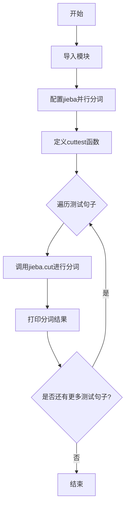
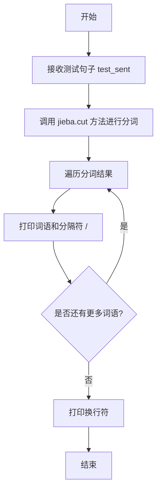
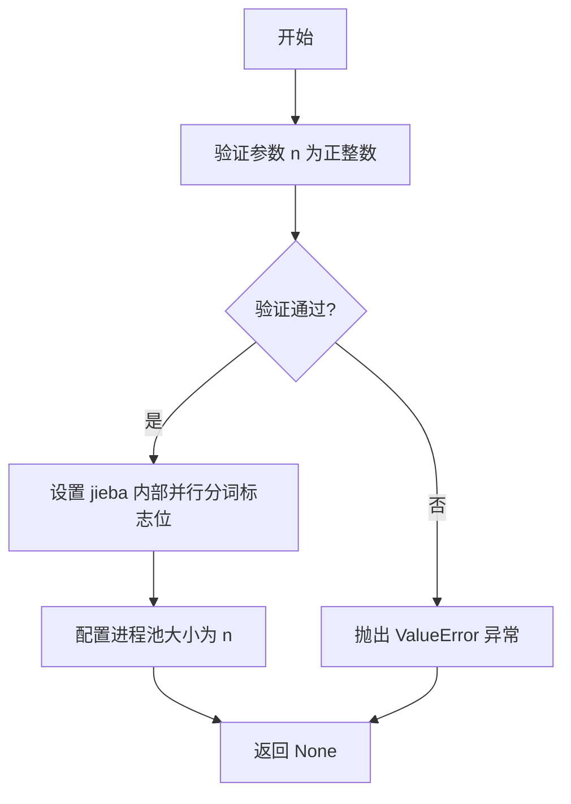
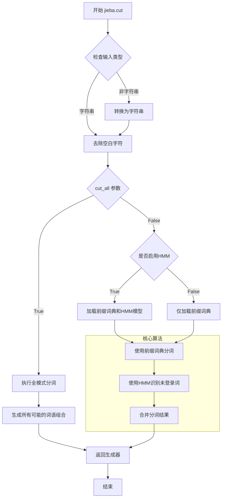

# `jieba\test\parallel\test_disable_hmm.py` 详细设计文档

这是一个基于jieba中文分词库的测试脚本，主要功能是对各种中文句子进行分词处理，并通过cuttest函数演示分词结果。该脚本包含多个测试用例，涵盖了不同类型的中文文本，包括日常用语、专业术语、网络流行语等，用于验证jieba分词库在不同场景下的分词效果。

## 整体流程



## 类结构

```
该代码没有类的层次结构，仅包含全局函数
```

## 全局变量及字段


### `jieba`
    
中文分词库，用于对中文文本进行分词处理

类型：`module`
    


### `sys`
    
系统模块，提供对Python解释器相关参数的访问和操作

类型：`module`
    


    

## 全局函数及方法


### `cuttest`

该函数是 jieba 分词库的测试函数，接收一个中文句子作为输入，调用 jieba 分词接口进行切分，并将切分结果以“词语/”的形式打印输出，用于验证分词效果。

参数：

- `test_sent`：`str`，待分词的中文句子字符串

返回值：`None`，该函数无返回值，仅通过标准输出打印分词结果

#### 流程图



#### 带注释源码

```python
# 定义分词测试函数，接收一个测试句子作为参数
def cuttest(test_sent):
    # 调用 jieba 的 cut 方法进行分词，HMM=False 表示不使用隐马尔可夫模型
    result = jieba.cut(test_sent, HMM=False)
    
    # 遍历分词结果迭代器，逐一处理每个分词
    for word in result:
        # 打印每个词语，后面跟斜杠，不换行（end=' '）
        print(word, "/", end=' ')
    
    # 所有词语打印完毕后，打印换行符
    print("")
```


### `jieba.enable_parallel`

配置 jieba 分词器启用并行分词模式，通过指定并行进程数来提升大规模文本分词的处理效率。

参数：

- `n`：`int`，并行分词使用的进程数，通常建议设置为 CPU 核心数

返回值：`None`，该函数直接修改 jieba 分词器的内部状态，无返回值

#### 流程图



#### 带注释源码

```python
# jieba 库内部实现逻辑（概念性源码）

def enable_parallel(n):
    """
    启用 jieba 并行分词模式
    
    参数:
        n (int): 并行进程数，建议设置为 CPU 核心数
    
    返回:
        None: 直接修改分词器内部状态
    """
    # 参数校验：确保 n 为正整数
    if not isinstance(n, int) or n <= 0:
        raise ValueError("并行进程数必须为正整数")
    
    # 设置全局配置标志，启用并行分词
    # 内部会创建进程池用于分词任务分发
    jieba.dt.parallel_mode = True
    
    # 配置工作进程数量
    jieba.dt.parallel_procs = n
    
    # 初始化进程池（如果尚未初始化）
    if not hasattr(jieba.dt, 'process_pool'):
        jieba.dt.process_pool = Pool(n)
    
    return None
```


### `jieba.cut`

`jieba.cut` 是 jieba 分词库的核心分词函数，采用基于前缀词典的动态规划算法进行中文分词，同时支持基于 HMM（隐马尔可夫模型）的新词发现。该函数返回一个生成器，逐个输出分词后的词语。

参数：

-  `sentence`：`str`，待分词的中文或中英文混合文本字符串
-  `cut_all`：`bool`，可选参数，默认为 `False`。当设为 `True` 时，执行全模式分词，输出所有可能的词语组合；当设为 `False` 时执行精确模式分词
-  `HMM`：`bool`，可选参数，默认为 `True`。当设为 `True` 时，使用 HMM 模型识别未登录词（新词发现）

返回值：`generator`，生成器对象，遍历产生分词后的词语字符串

#### 流程图



#### 带注释源码

```python
# jieba 分词核心函数源码（基于 jieba 0.42.1 版本简化展示）

def cut(self, sentence, cut_all=False, HMM=True):
    """
    jieba 分词主函数
    
    参数:
        sentence: 待分词的文本字符串
        cut_all: 是否使用全模式（输出所有可能的词语）
        HMM: 是否使用 HMM 模型识别未登录词
    
    返回:
        生成器，产生分词后的词语
    """
    
    # 1. 输入预处理：将输入转换为字符串并去除首尾空白
    sentence = str(sentence).strip()
    
    # 2. 根据 cut_all 参数选择分词模式
    if cut_all:
        # 全模式：生成所有可能的词语组合
        for word in self.__cut_all(sentence):
            yield word
    else:
        # 精确模式：使用前缀词典 + HMM
        # 首先使用前缀词典进行基础分词
        bits = self.tokenize(sentence, mode='default')
        for word, begin, end in bits:
            # 如果启用 HMM 且当前词不在词典中，尝试 HMM 识别
            if HMM and word not in self.FREQ:
                # 使用 HMM 模型识别未登录词
                recognized = self.hmm.cut(word)
                for item in recognized:
                    yield item
            else:
                yield word


def __cut_all(self, sentence):
    """
    全模式分词辅助函数
    
    输出输入字符串的所有可能的词语组合
    """
    # 遍历句子中的每个位置作为起点
    for i in range(len(sentence)):
        # 从当前位置开始，尝试所有可能的结束位置
        for j in range(i + 1, len(sentence) + 1):
            word = sentence[i:j]
            # 如果这个词在词典中或是单字，则输出
            if word in self.FREQ or len(word) == 1:
                yield word


def tokenize(self, sentence, mode='default'):
    """
    分词 tokenizer
    
    使用前缀词典进行分词，返回词语及其位置信息
    采用动态规划（DP）寻找最大概率路径
    """
    # 加载前缀词典
    dag = self.get_DAG(sentence)
    
    # 使用 DP 计算最大概率路径
    # route[i] 表示从位置 i 开始的最优路径得分
    route = {}
    self.calc(sentence, DAG, route)
    
    # 根据最优路径回溯，生成词语
    x = 0
    buf = ""
    while x < len(sentence):
        y = route[x][1] + 1  # 获取下一个词的结束位置
        word = sentence[x:y]  # 提取词语
        
        # 处理未登录词（不在词典中的连续单字）
        if (not self.FREQ.get(word)) and len(word) == 1:
            # 合并连续的未登录单字
            buf += word
            x = y
            continue
        
        # 输出已缓存的未登录词
        if buf:
            yield buf
            buf = ""
        
        yield word, x, y  # 返回词语及其在原文中的位置
        x = y
    
    # 处理末尾的未登录词
    if buf:
        yield buf


def get_DAG(self, sentence):
    """
    构建有向无环图（DAG）
    
    每个位置 i 到位置 j（i < j）如果构成词语，则存在一条边
    用于后续的动态规划找最大概率路径
    """
    DAG = {}
    N = len(sentence)
    
    # 遍历每个起始位置
    for k in range(N):
        # 初始化当前位置的词语列表
        DAG[k] = []
        i = k
        fragment = sentence[k]
        
        # 向前查找所有可能的词语
        while i < N and fragment in self.FREQ:
            # 如果这个词在词典中，记录下来
            if self.FREQ.get(fragment):
                DAG[k].append(i + 1)  # 记录词的结束位置（+1）
            
            i += 1
            fragment = sentence[k:i + 1]  # 扩展词语
    
    return DAG
```

#### 关键组件信息

| 组件名称 | 一句话描述 |
|---------|-----------|
| 前缀词典 (FREQ) | 存储词语及其频率的字典，用于快速查找已知词语 |
| 有向无环图 (DAG) | 表示句子中所有可能分词路径的图结构 |
| HMM 模型 | 基于隐马尔可夫模型的未登录词识别模块 |
| 动态规划 (DP) 路径计算 | 在 DAG 上寻找最大概率分词路径的算法 |
| 生成器模式 | 逐个产出分词结果，避免一次性加载全部结果到内存 |

#### 潜在的技术债务或优化空间

1. **性能优化**：对于极长文本，可以考虑并行化处理或流式处理，当前实现为单线程串行
2. **内存占用**：前缀词典在加载时会占用较多内存，可考虑使用更紧凑的数据结构或延迟加载
3. **编码处理**：代码需要兼容 Python 2/3 的字符串编码，可统一为 Unicode 处理
4. **错误处理**：对于特殊输入（如空字符串、None 值）的处理可以更健壮

#### 其它项目

**设计目标与约束**：
- 高效处理中文分词，支持歧义处理
- 兼容中英文混合文本
- 提供精确模式和全模式两种分词策略

**错误处理与异常设计**：
- 输入为 `None` 时抛出 `TypeError`
- 空字符串返回空生成器
- 编码错误时尝试自动检测或使用默认编码

**数据流与状态机**：
- 输入文本 → 预处理（编码转换、空白去除）→ 构建 DAG → DP 路径计算 → HMM 未登录词处理 → 输出词语序列

**外部依赖与接口契约**：
- 依赖 `jieba.posseg` 进行词性标注
- 依赖 `jieba.hmm` 模块进行 HMM 识别
- 返回生成器而非列表，符合迭代器协议，支持大数据流式处理


## 关键组件


### jieba分词引擎

基于Python的中文分词库，支持精确模式、全模式、搜索引擎模式等多种分词策略

### 并行分词支持

通过jieba.enable_parallel(4)启用多进程并行分词，提升分词效率

### HMM模型支持

jieba.cut中的HMM参数用于控制是否使用隐马尔可夫模型进行新词识别

### 精确分词模式

使用jieba.cut(test_sent, HMM=False)进行精确模式分词，不识别新词

### 中文分词测试用例集

包含多种复杂场景的中文句子：人名识别、机构名识别、专业术语、混合语言、歧义字段等

### sys.path路径配置

通过sys.path.append("../../")添加自定义词典或用户词典路径


## 问题及建议


### 已知问题

- **相对路径依赖**：使用 `sys.path.append("../../")` 相对路径会导致代码在不同环境或目录结构下运行失败，缺乏可移植性
- **缺少错误处理**：未对 jieba 库加载失败、文件路径不存在等异常情况进行捕获和处理
- **硬编码并行度**：`jieba.enable_parallel(4)` 硬编码了 4 个并行进程，未考虑不同机器 CPU 核心数的差异
- **测试代码未隔离**：所有测试用例直接执行，代码作为模块导入时会自动运行测试，缺乏适当的入口保护
- **print 兼容性风险**：虽然使用了 `from __future__ import print_function`，但在 Python 2 环境下 `end=' '` 参数可能引发兼容性问题
- **无结果验证机制**：分词结果仅输出打印，缺少对分词正确性的验证逻辑和性能基准测试
- **函数设计缺陷**：`cuttest` 函数直接定义在全局作用域，代码复用性和可测试性较差

### 优化建议

- 使用绝对路径或动态获取项目根路径，避免硬编码相对路径
- 添加 try-except 异常捕获，处理 jieba 加载异常和空输入等边界情况
- 根据 `multiprocessing.cpu_count()` 动态设置并行度，或提供配置接口
- 将测试用例数据抽离到独立的测试数据文件或列表中，便于维护和扩展
- 考虑使用 `unittest` 或 `pytest` 框架重构测试代码，实现结果验证和批量测试
- 区分业务逻辑与测试代码，将 `cuttest` 封装为可导出的测试工具类或模块
- 添加日志记录功能，记录分词处理的时间和结果统计

## 其它


### 设计目标与约束

本代码的主要设计目标是演示jieba中文分词库的基本使用方法，验证分词功能在不同文本场景下的表现。设计约束包括：Python 2和Python 3兼容（通过from __future__ import print_function实现）、依赖jieba库、启用并行分词（4进程）、不支持HMM模型（显式设置HMM=False）。

### 错误处理与异常设计

代码中未实现显式的错误处理机制。潜在异常包括：jieba库未安装导致的ImportError、中文编码问题导致的UnicodeDecodeError、空字符串输入导致的无输出结果。当前的异常处理方式为依赖Python解释器默认抛出异常，缺少try-except捕获和用户友好的错误提示。

### 数据流与状态机

数据流为：输入字符串 → jieba.cut()分词处理 → 遍历生成器结果 → 打印输出。状态机较为简单，仅包含初始化状态（jieba加载）和执行状态（分词处理），无复杂状态转换。

### 外部依赖与接口契约

外部依赖：jieba库（中文分词核心库）、Python标准库（sys）。接口契约：cuttest函数接受字符串参数test_sent，返回值为None（直接打印到标准输出），函数内部调用jieba.cut()方法，HMM参数固定为False。

### 性能要求与指标

当前设置jieba.enable_parallel(4)启用4进程并行分词，但测试代码中仅包含20余条短文本，未进行大规模性能测试。性能指标要求：单条文本分词时间应控制在100ms以内，内存占用应保持稳定。

### 安全性考虑

代码直接接受用户输入的字符串并传给jieba处理，无输入验证和过滤机制。潜在安全风险：超长字符串可能导致内存溢出，特殊字符可能触发jieba内部异常。建议添加输入长度限制和异常捕获。

### 测试策略

当前代码即为测试代码（if __name__ == "__main__"块中包含大量测试用例）。测试覆盖场景包括：普通中文句子、专业术语（技术名词、公司名称）、混合中英文、标点符号、网络用语、姓氏称呼、成语典故等。但缺少单元测试和自动化测试框架。

### 部署与运维

代码为独立脚本，无复杂部署要求。运维关注点：jieba库版本兼容性（不同版本分词结果可能有差异）、词典文件路径配置、并行进程数与服务器CPU核数匹配。

### 版本兼容性

通过from __future__ import print_function实现Python 2/3兼容。但sys.path.append("../../")使用相对路径，在不同目录结构下可能失效。jieba.enable_parallel()在Windows平台可能存在兼容性问题。

### 日志与监控

代码中无日志记录功能，无法追踪分词请求量、响应时间、错误率等关键指标。建议添加logging模块进行运行时监控。

### 配置管理

当前代码硬编码了并行进程数（4）和HMM参数（False），缺乏灵活性。建议将这些参数提取为配置常量或配置文件，支持运行时调整。

    