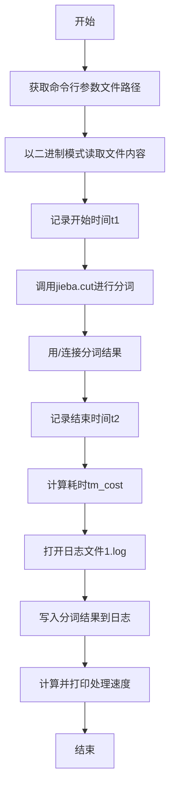
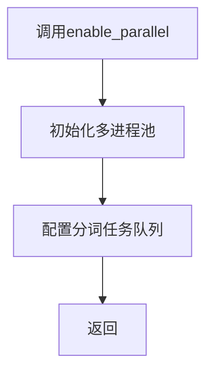
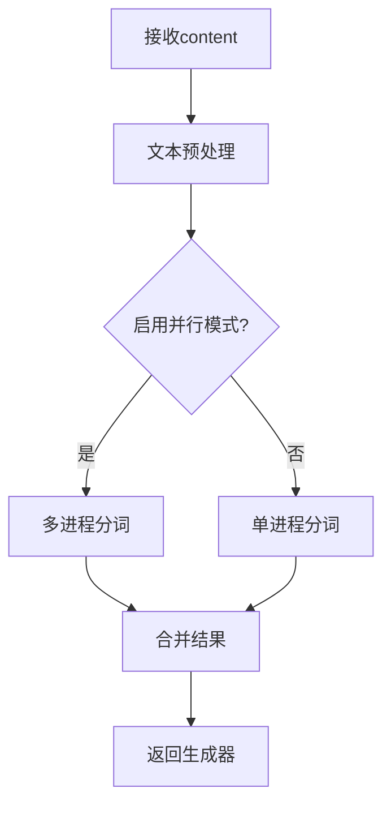

# `jieba\test\parallel\test_file.py` 详细设计文档

该代码使用jieba中文分词库对指定文件内容进行并行分词处理，计算处理速度并将分词结果写入日志文件

## 整体流程



## 类结构

```
该代码为面向过程脚本，无类定义
```

## 全局变量及字段


### `url`
    
命令行传入的文件路径

类型：`str`
    


### `content`
    
读取的二进制文件内容

类型：`bytes`
    


### `words`
    
分词处理后的结果字符串

类型：`str`
    


### `t1`
    
开始时间戳

类型：`float`
    


### `t2`
    
结束时间戳

类型：`float`
    


### `tm_cost`
    
总耗时（秒）

类型：`float`
    


### `log_f`
    
日志文件对象

类型：`file object`
    


    

## 全局函数及方法


## 关键组件


### 1. 代码概述

该代码是一个中文分词性能测试工具，通过调用jieba分词库对指定文件内容进行中文分词处理，启用并行计算加速分词过程，并输出分词速度性能指标。

### 2. 文件整体运行流程

```
开始
  ↓
解析命令行参数获取文件路径
  ↓
启用jieba并行分词模式
  ↓
读取指定文件内容到内存
  ↓
记录开始时间
  ↓
执行分词操作（jieba.cut）
  ↓
将分词结果用"/ "连接成字符串
  ↓
记录结束时间并计算耗时
  ↓
打开日志文件写入分词结果
  ↓
输出分词速度统计
  ↓
结束
```

### 3. 类详细信息

该代码为脚本形式，无面向对象类定义，仅包含全局函数和变量。

### 3.1 全局变量详情

| 名称 | 类型 | 描述 |
|------|------|------|
| url | str | 命令行传入的文件路径参数 |
| content | bytes | 读取的原始文件内容 |
| words | str | 分词处理后的结果字符串，用"/ "连接各分词 |
| t1 | float | 分词操作开始时间戳 |
| t2 | float | 分词操作结束时间戳 |
| tm_cost | float | 分词操作总耗时（秒） |
| log_f | file object | 日志文件写入句柄 |

### 3.2 全局函数详情

#### jieba.enable_parallel()

- **参数**: 无
- **返回值**: None
- **描述**: 启用jieba分词的并行计算模式，利用多核CPU加速分词处理
- **mermaid流程图**: 

- **源码注释**:
```python
# 启用并行分词模式
# 内部实现：创建进程池，将分词任务分配到多个CPU核心并行执行
jieba.enable_parallel()
```

#### jieba.cut(content)

- **参数**: content (bytes/str) - 待分词的文本内容
- **返回值**: generator - 分词结果生成器，每项为一个词语
- **描述**: 对文本进行中文分词，返回分词结果迭代器
- **mermaid流程图**:

- **源码注释**:
```python
# jieba.cut() 执行实际分词
# 参数: content - 原始文本（bytes或str类型）
# 返回: 生成器对象，包含分词后的词语列表
# 内部逻辑: 根据是否启用并行模式选择对应分词算法
words = "/ ".join(jieba.cut(content))
```

### 4. 关键组件信息

### 组件1: jieba分词引擎

中文分词核心库，支持精确模式、全模式、搜索引擎模式等多种分词策略，内部实现包含前缀字典、Trie树结构、HMM隐马尔可夫模型用于新词识别。

### 组件2: 并行分词模块 (jieba.enable_parallel)

通过多进程方式实现分词加速，将大段文本分割后分配到多个CPU核心并行处理，显著提升大规模文本处理性能。

### 组件3: 文本输入处理模块

负责从文件系统读取原始文本内容，支持二进制模式读取，处理文件I/O操作和编码转换。

### 组件4: 性能计时模块

基于time模块实现精确计时，记录分词操作的时间开销，用于计算分词速度和性能评估。

### 组件5: 日志输出模块

将分词结果持久化到文件，同时输出性能指标到标准输出，实现处理结果的可追溯性。

### 5. 潜在技术债务与优化空间

1. **错误处理缺失**: 未对文件读取失败、jieba初始化异常等情况进行处理，程序鲁棒性不足
2. **内存占用问题**: 一次性将整个文件加载到内存(content变量)，大文件场景可能导致内存溢出
3. **编码处理风险**: 固定使用"rb"模式读取，可能导致编码检测不准确，应增加编码自动检测逻辑
4. **资源未及时释放**: log_f文件句柄未显式关闭，虽然程序结束时会自动释放，但不符合最佳实践
5. **CLI参数验证缺失**: 未校验sys.argv[1]参数是否存在，数组越界风险
6. **硬编码问题**: 日志文件名"1.log"硬编码，应支持命令行配置

### 6. 其它项目

#### 设计目标与约束
- 目标：验证jieba分词性能，输出处理速度
- 约束：依赖jieba库，Python 2.x/3.x兼容

#### 错误处理与异常设计
- 文件不存在: 程序崩溃
- 内存不足: 程序崩溃
- 建议增加try-except块捕获FileNotFoundError、MemoryError等异常

#### 数据流与状态机
- 数据流：命令行参数 → 文件读取 → 分词处理 → 结果输出 → 性能统计
- 状态简单，无复杂状态机设计

#### 外部依赖与接口契约
- 依赖: jieba库（中文分词）、sys模块、time模块
- 接口: 命令行传入单个文件路径参数
- 输出: 分词结果写入1.log，性能数据输出到stdout


## 问题及建议


### 已知问题

-   类型错误：jieba.cut()期望字符串参数，但传入的是bytes类型（content），可能导致分词失败或异常。
-   资源泄漏：文件（input和log）未显式关闭，虽然脚本结束会自动关闭，但不符合资源管理最佳实践。
-   缺乏错误处理：没有异常捕获，文件不存在、路径错误或解码失败时脚本会直接崩溃。
-   硬编码输出文件名：日志文件固定为"1.log"，容易覆盖之前结果，且缺乏灵活性。
-   编码假设：假设输入文件为UTF-8编码，但未验证，解码可能出错。
-   性能问题：一次性将整个文件读入内存，对于大文件可能导致内存不足或性能下降。
-   变量命名不当：变量名为url，但实际表示文件路径，容易误导。
-   并行分词配置：启用jieba.enable_parallel()但未考虑文件大小或系统资源，可能在小文件上引入不必要的开销。
-   缺乏注释和文档：代码无注释，难以理解维护意图。
-   依赖管理：sys.path.append("../../")添加路径，可能导致导入不稳定或冲突。

### 优化建议

-   在调用jieba.cut前，将content从bytes解码为字符串（如content.decode('utf-8')），并处理解码异常。
-   使用with语句管理文件操作，确保资源自动释放，例如：with open(url, "rb") as f: content = f.read()。
-   添加命令行参数验证（如检查len(sys.argv) > 1），并使用try-except捕获文件读取、解码、写入等可能的异常。
-   将输出文件名参数化或使用时间戳生成唯一名称，如f"log_{int(time.time())}.log"。
-   尝试自动检测文件编码（如使用chardet库），或在decode时指定errors='ignore'以提高鲁棒性。
-   对于大文件，考虑分块读取或流式处理，如使用生成器逐行读取并分词。
-   修正变量命名为file_path或input_file以反映实际用途。
-   根据文件大小或配置决定是否启用并行分词，避免小文件上的性能损失。
-   添加注释说明关键步骤（如分词、计时、输出），提升代码可读性。
-   优先使用sys.path.insert或虚拟环境管理依赖，减少硬编码路径。


## 其它


### 设计目标与约束

本代码是一个简单的命令行工具，用于对文本文件进行中文分词处理。设计目标是快速对给定文件进行分词并输出处理速度，设计约束包括：输入必须为有效的文件路径、文件必须可读、处理结果输出到固定文件名"1.log"、仅支持UTF-8编码的文本文件。

### 错误处理与异常设计

代码缺乏系统的错误处理机制，存在以下问题：未对命令行参数数量进行校验（若sys.argv[1]不存在会抛出IndexError）、未捕获文件读取异常（文件不存在或权限不足会抛出FileNotFoundError和PermissionError）、未处理空文件情况、分词结果写入失败时程序会崩溃。改进建议：添加参数校验、try-except异常捕获、空文件检查、写入失败处理。

### 数据流与状态机

数据流为：命令行参数(文件路径) → 文件读取(字节流) → jieba分词(中文分词) → 结果拼接(字符串连接) → 文件写入(日志) → 控制台输出(性能指标)。状态机较为简单，主要包含：初始状态 → 读取完成 → 分词完成 → 写入完成 → 结束状态，无复杂的状态转换逻辑。

### 外部依赖与接口契约

主要外部依赖包括：Python标准库(sys、time、os)、jieba中文分词库。接口契约方面：输入接口为命令行第一个参数(文件路径字符串)、输出接口为控制台标准输出(处理速度)和1.log文件(分词结果)。jieba.enable_parallel()依赖多核CPU环境，在单核或受限环境下可能无效。

### 性能考量

当前实现使用了jieba的并行分词功能以提升性能，但存在以下性能瓶颈：文件一次性全部读取到内存，大文件可能导致内存不足；分词结果使用字符串拼接(/连接)，大数据量时效率较低，建议使用列表join；日志写入使用wb模式但写入字符串的utf-8编码，存在编码转换开销；未对大文件进行分块处理。

### 安全性考虑

代码存在安全风险：直接使用命令行参数作为文件路径，可能存在路径遍历攻击风险（虽然此场景为本地工具）；未对读取文件内容进行大小限制，可能导致内存耗尽；日志文件路径固定为"1.log"，存在被恶意覆盖或符号链接攻击的风险。建议添加路径验证、文件大小限制、日志文件安全检查。

### 配置说明

无外部配置文件，所有参数硬编码。关键配置项包括：jieba.enable_parallel()启用多线程分词、日志输出文件名"1.log"固定、分词结果分隔符"/ "、文件编码假设为UTF-8。

### 使用示例

命令行调用：python script.py input.txt
假设当前目录存在input.txt文件，执行后会在当前目录生成1.log文件，包含分词后的文本，并在控制台输出处理速度，例如：speed 1234567 bytes/second

    