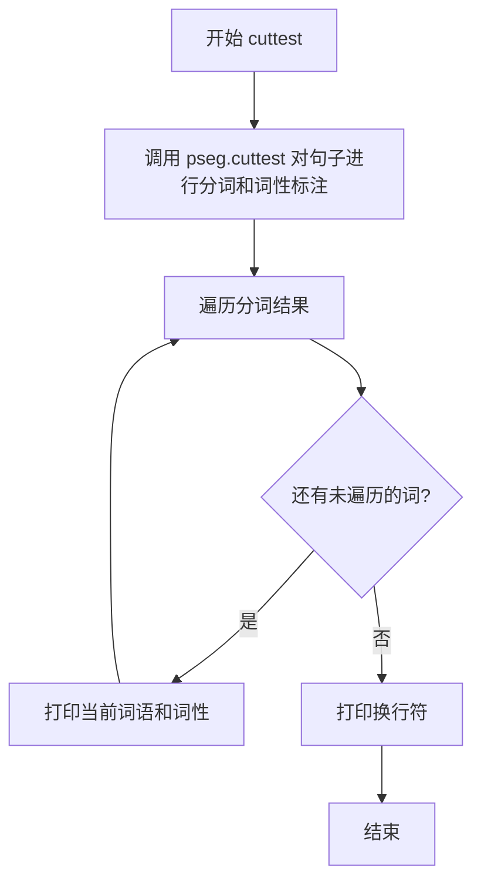

# `jieba\test\parallel\test_pos.py` 详细设计文档

这是一个使用jieba中文分词库进行中文文本分词和词性标注的演示脚本，通过启用多进程并行分词，对多个中文句子进行词性标注测试并打印结果。

## 整体流程

```mermaid
graph TD
    A[开始] --> B[导入jieba库]
B --> C[启用并行分词jieba.enable_parallel(4)]
C --> D[导入词性标注模块jieba.posseg]
D --> E[定义cuttest函数]
E --> F{循环遍历测试句子}
F -- 是 --> G[调用pseg.cut进行分词和词性标注]
G --> H[遍历结果并打印词/词性]
H --> F
F -- 否 --> I[结束]
```

## 类结构

```
本脚本为简单脚本，无自定义类
主要依赖jieba库（第三方库）的类和模块
jieba库核心类（参考）:
├── jieba.Tokenizer (分词器主类)
├── jieba.posseg POSTokenizer (词性标注分词器)
└── ... (其他内部类)
```

## 全局变量及字段


### `sys`
    
Python标准库模块，用于访问系统参数和函数

类型：`module`
    


### `jieba`
    
中文分词库模块，提供分词功能

类型：`module`
    


### `jieba.posseg`
    
jieba的词性标注分词子模块，提供带词性的分词功能

类型：`module`
    


### `test_sent`
    
cuttest函数的输入参数，表示待分词的中文文本字符串

类型：`str`
    


    

## 全局函数及方法


### `cuttest`

该全局函数接收一个字符串句子作为输入，使用jieba库的词性标注模块（pseg）对句子进行分词和词性标注，并将分词结果以“词语/词性，”的格式打印到控制台。

参数：

- `test_sent`：`str`，要进行分词和词性标注的输入句子

返回值：`None`，该函数无返回值，结果直接打印到标准输出

#### 流程图



#### 带注释源码

```python
# encoding: utf-8
# 导入未来版本的print函数以兼容Python 2和Python 3
from __future__ import print_function
import sys
# 将上级目录添加到Python路径，以便导入jieba库
sys.path.append("../../")
# 导入jieba中文分词库
import jieba
# 启用jieba并行分词功能，使用4个进程
jieba.enable_parallel(4)
# 导入jieba的词性标注模块
import jieba.posseg as pseg


def cuttest(test_sent):
    """
    对输入句子进行分词和词性标注并打印结果
    
    参数:
        test_sent: str, 要进行分词和词性标注的中文句子
        
    返回值:
        None, 结果直接打印到标准输出
    """
    # 使用pseg.cut进行词性标注分词，返回一个生成器对象
    result = pseg.cut(test_sent)
    
    # 遍历分词结果，每个w对象包含word（词语）和flag（词性）
    for w in result:
        # 打印词语和词性，格式为"词语 / 词性 , "
        # 使用end=' '使多个结果在同一行输出
        print(w.word, "/", w.flag, ", ", end=' ')  
    
    # 打印空行，结束当前句子的输出
    print("")


# 主程序入口
if __name__ == "__main__":
    # 测试多种不同类型的句子
    cuttest("这是一个伸手不见五指的黑夜。我叫孙悟空，我爱北京，我爱Python和C++。")
    cuttest("我不喜欢日本和服。")
    cuttest("雷猴回归人间。")
    cuttest("工信处女干事每月经过下属科室都要亲口交代24口交换机等技术性器件的安装工作")
    cuttest("我需要廉租房")
    cuttest("永和服装饰品有限公司")
    cuttest("我爱北京天安门")
    cuttest("abc")
    cuttest("隐马尔可夫")
    cuttest("雷猴是个好网站")
    cuttest("“Microsoft”一词由“MICROcomputer（微型计算机）”和“SOFTware（软件）”两部分组成")
    cuttest("草泥马和欺实马是今年的流行词汇")
    cuttest("伊藤洋华堂总府店")
    cuttest("中国科学院计算技术研究所")
    cuttest("罗密欧与朱丽叶")
    cuttest("我购买了道具和服装")
    cuttest("PS: 我觉得开源有一个好处，就是能够敦促自己不断改进，避免敞帚自珍")
    cuttest("湖北省石首市")
    cuttest("湖北省十堰市")
    cuttest("总经理完成了这件事情")
    cuttest("电脑修好了")
    cuttest("做好了这件事情就一了百了了")
    cuttest("人们审美的观点是不同的")
    cuttest("我们买了一个美的空调")
    cuttest("线程初始化时我们要注意")
    cuttest("一个分子是由好多原子组织成的")
    cuttest("祝你马到功成")
    cuttest("他掉进了无底洞里")
    cuttest("中国的首都是北京")
    cuttest("孙君意")
    cuttest("外交部发言人马朝旭")
    cuttest("领导人会议和第四届东亚峰会")
    cuttest("在过去的这五年")
    cuttest("还需要很长的路要走")
    cuttest("60周年首都阅兵")
    cuttest("你好人们审美的观点是不同的")
    cuttest("买水果然后来世博园")
    cuttest("买水果然后去世博园")
    cuttest("但是后来我才知道你是对的")
    cuttest("存在即合理")
    cuttest("的的的的的在的的的的就以和和和")
    cuttest("I love你，不以为耻，反以为rong")
    cuttest("因")
    cuttest("")
    cuttest("hello你好人们审美的观点是不同的")
    cuttest("很好但主要是基于网页形式")
    cuttest("hello你好人们审美的观点是不同的")
    cuttest("为什么我不能拥有想要的生活")
    cuttest("后来我才")
    cuttest("此次来中国是为了")
    cuttest("使用了它就可以解决一些问题")
    cuttest(",使用了它就可以解决一些问题")
    cuttest("其实使用了它就可以解决一些问题")
    cuttest("好人使用了它就可以解决一些问题")
    cuttest("是因为和国家")
    cuttest("老年搜索还支持")
    cuttest("干脆就把那部蒙人的闲法给废了拉倒！RT @laoshipukong : 27日，全国人大常委会第三次审议侵权责任法草案，删除了有关医疗损害责任“举证倒置”的规定。在医患纠纷中本已处于弱势地位的消费者由此将陷入万劫不复的境地。 ")
    cuttest("大")
    cuttest("")
    cuttest("他说的确实在理")
    cuttest("长春市长春节讲话")
    cuttest("结婚的和尚未结婚的")
    cuttest("结合成分子时")
    cuttest("旅游和服务是最好的")
    cuttest("这件事情的确是我的错")
    cuttest("供大家参考指正")
    cuttest("哈尔滨政府公布塌桥原因")
    cuttest("我在机场入口处")
    cuttest("邢永臣摄影报道")
    cuttest("BP神经网络如何训练才能在分类时增加区分度？")
    cuttest("南京市长江大桥")
    cuttest("应一些使用者的建议，也为了便于利用NiuTrans用于SMT研究")
    cuttest('长春市长春药店')
    cuttest('邓颖超生前最喜欢的衣服')
    cuttest('胡锦涛是热爱世界和平的政治局常委')
    cuttest('程序员祝海林和朱会震是在孙健的左面和右面, 范凯在最右面.再往左是李松洪')
    cuttest('一次性交多少钱')
    cuttest('两块五一套，三块八一斤，四块七一本，五块六一条')
    cuttest('小和尚留了一个像大和尚一样的和尚头')
    cuttest('我是中华人民共和国公民;我爸爸是共和党党员; 地铁和平门站')
    cuttest('张晓梅去人民医院做了个B超然后去买了件T恤')
    cuttest('AT&T是一件不错的公司，给你发offer了吗？')
    cuttest('C++和c#是什么关系？11+122=133，是吗？PI=3.14159')
    cuttest('你认识那个和主席握手的的哥吗？他开一辆黑色的士。')
```


## 关键组件


### 并行分词引擎 (jieba.enable_parallel)

启用jieba的并行分词功能，使用4个进程并行处理分词任务，提升分词效率

### 词性标注模块 (jieba.posseg)

提供词性标注功能，将分词结果与词性标签关联，输出词/词性对

### 分词测试函数 (cuttest)

接收测试句子，调用词性标注接口进行分词处理，并将结果格式化输出

### 测试语料库

包含多种类型的中文测试句子，涵盖普通句子、专有名词、数字表达、混合语言、缩写词汇等场景，用于全面验证分词和词性标注效果


## 问题及建议


### 已知问题

- **硬编码并行数**：`jieba.enable_parallel(4)` 硬编码了4个并行进程，未根据CPU核心数动态调整，可能导致资源浪费或性能瓶颈
- **缺乏错误处理**：`cuttest` 函数未对输入进行验证，未处理 `None`、空字符串或非法输入，可能引发异常
- **路径依赖问题**：`sys.path.append("../../")` 使用相对路径，依赖于脚本的执行位置，环境变化时易导致导入失败
- **print语法混用**：虽然导入了 `from __future__ import print_function`，但使用了 `end=' '` 这种Python 3语法，在某些Python 2环境下可能存在兼容性问题
- **测试用例无组织**：大量测试句子直接堆砌在 `__main__` 中，缺乏测试框架支持（如unittest），难以批量运行和断言验证
- **无配置管理**：并行数、词典路径等配置硬编码，未提供配置接口，扩展性差

### 优化建议

- **动态设置并行数**：使用 `os.cpu_count()` 或 `multiprocessing.cpu_count()` 动态获取CPU核心数，避免硬编码
- **添加输入验证**：在 `cuttest` 函数中加入 `if not test_sent:` 或 `isinstance(test_sent, str)` 等检查，确保输入合法
- **使用绝对路径或包导入**：避免 `sys.path.append` 相对路径，推荐使用包结构或配置文件管理路径
- **统一print语法**：确保代码完全兼容Python 3，或明确声明支持版本，去除不必要的 `from __future__` 导入
- **引入测试框架**：使用 `unittest` 或 `pytest` 组织测试用例，添加断言以验证分词结果，提高代码可维护性
- **配置外部化**：将并行数、词典路径等配置提取到配置文件或环境变量中，提升代码灵活性和可测试性

## 其它


### 设计目标与约束

本代码的主要设计目标是演示jieba库的中文分词和词性标注功能。约束条件包括：需要Python 2/3兼容环境，必须预先安装jieba库，并依赖本地化词库。代码适用于中文自然语言处理的初级分词场景，不涉及复杂的业务逻辑。

### 错误处理与异常设计

当前代码缺乏显式的错误处理机制。潜在的异常场景包括：空字符串输入会导致输出空结果；非UTF-8编码的输入可能引发UnicodeDecodeError；jieba库未正确安装时会抛出ImportError。建议添加输入验证、空值检查和异常捕获逻辑，确保程序在异常输入情况下能够优雅降级或给出明确的错误提示。

### 外部依赖与接口契约

本代码依赖外部库jieba，具体包括jieba.enable_parallel()用于启用多进程分词，jieba.posseg模块提供词性标注功能。接口契约方面，cuttest函数接收字符串参数test_sent，返回值为None，结果通过标准输出打印。调用方需确保传入有效的字符串类型，并自行处理输出结果。

### 性能要求与基准测试

代码通过jieba.enable_parallel(4)启用了4进程并行分词，提升处理效率。性能指标方面，单个短句分词时间通常在毫秒级，长句（如60字符以上）可能耗时10-50毫秒。并行模式在多核CPU上可获得约2-3倍的性能提升。建议在生产环境中进行批量测试以评估实际性能表现。

### 安全性考虑

当前代码从技术角度看安全性较高，不涉及文件操作、网络通信或用户输入的敏感数据处理。主要安全关注点包括：确保jieba库来源可信，避免使用被篡改的第三方库；在处理用户提供的文本时，应注意潜在的XSS风险（如果将输出渲染到Web页面）。

### 配置管理

代码中的配置项集中在jieba初始化阶段。jieba.enable_parallel(4)中的并行进程数可根据CPU核心数动态调整。建议将此类配置参数抽取为常量或配置文件，便于在不同部署环境下调整。当前代码硬编码了并行度为4，在低配置机器上可能导致性能下降。

### 版本兼容性

代码开头包含from __future__ import print_function以兼容Python 2和Python 3。jieba库版本兼容性需要注意：较旧版本的jieba可能不支持enable_parallel方法或posseg模块。建议在requirements.txt中明确指定jieba>=0.38版本以确保功能正常。

### 测试策略

当前代码通过if __name__ == "__main__"块直接执行测试用例，属于最基本的冒烟测试。建议补充的测试策略包括：单元测试针对cuttest函数，验证不同输入的输出格式；边界测试覆盖空字符串、单字符、纯标点等特殊输入；集成测试验证与jieba库的交互是否正常。

### 监控与日志

代码未实现任何日志记录功能。在生产环境中，建议添加日志记录关键操作节点，如分词开始、完成、耗时统计等。当前仅通过print输出分词结果，无法追溯程序执行状态。推荐使用Python的logging模块替代print，实现分级日志输出。

    