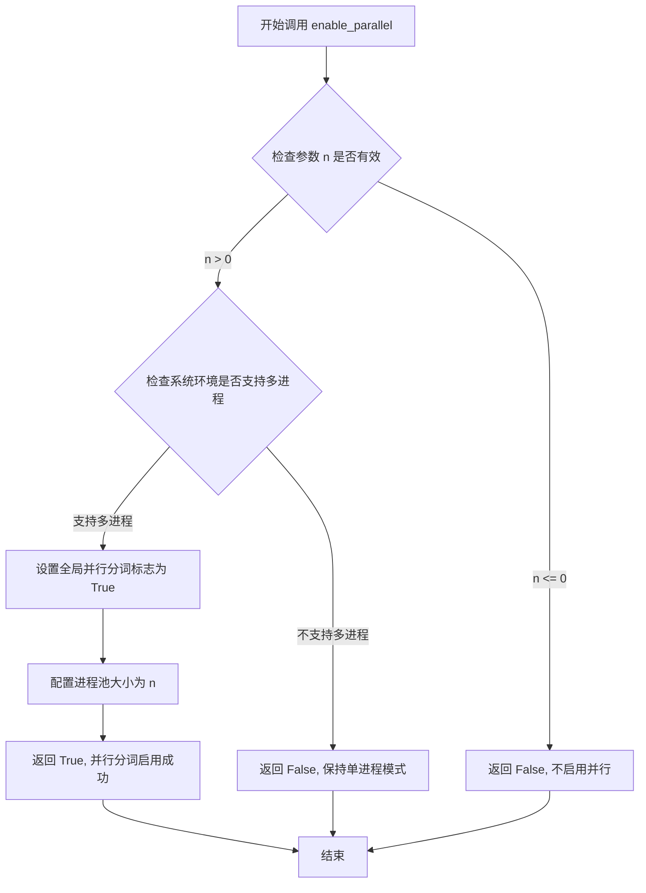
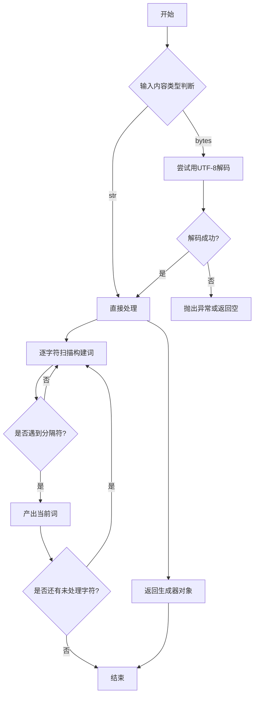
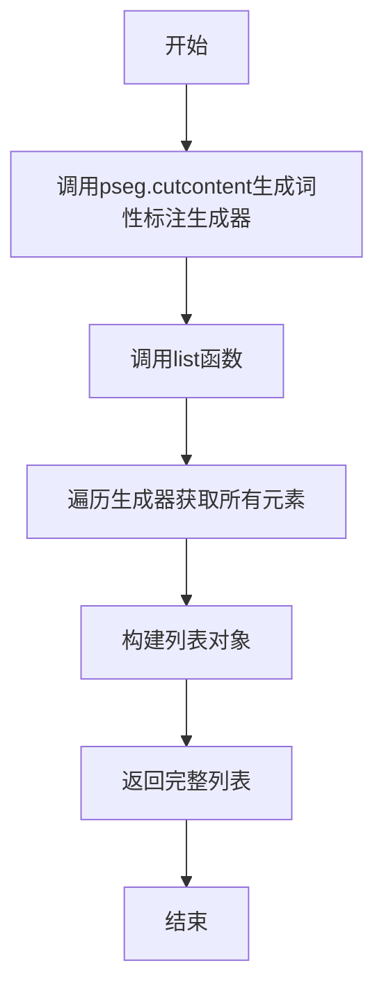
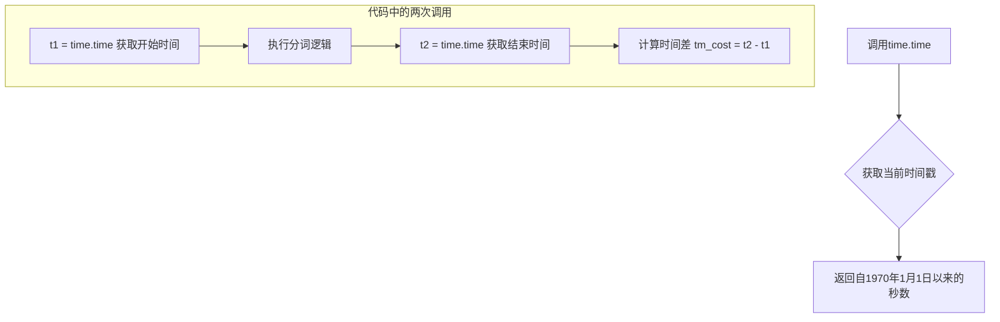
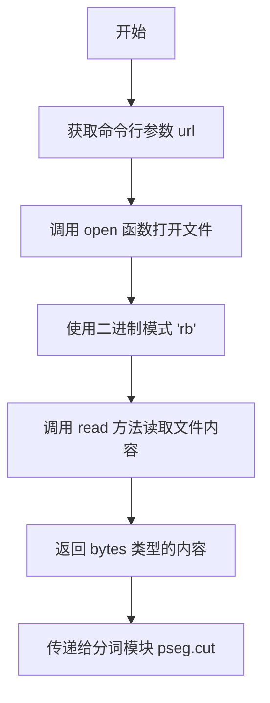
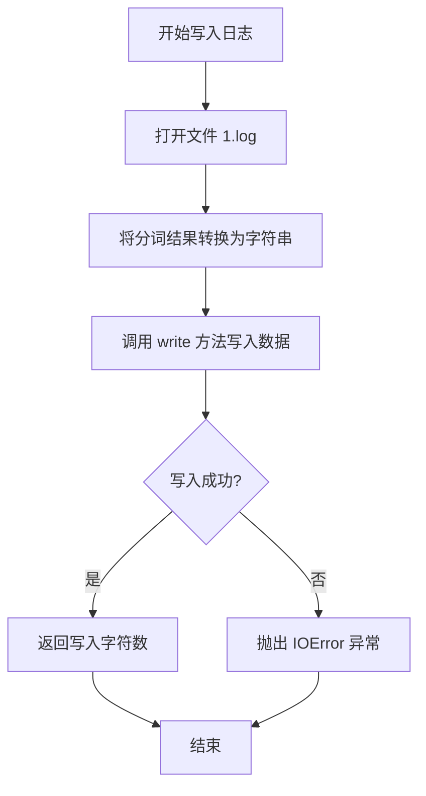
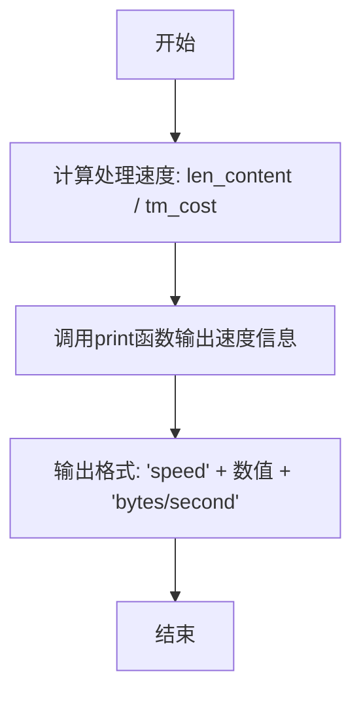

# `jieba\test\parallel\test_pos_file.py` 详细设计文档

该代码是一个中文分词处理脚本，使用jieba库的并行分词功能对指定文件进行词性标注分词，统计处理时间并输出处理速度，同时将分词结果写入日志文件。

## 整体流程

```mermaid
graph TD
    A[开始] --> B[读取命令行参数获取文件路径]
    B --> C[以二进制模式打开并读取文件内容]
    C --> D[记录开始时间t1]
    D --> E[调用pseg.cut进行分词和词性标注]
    E --> F[将分词结果转换为列表]
    F --> G[记录结束时间t2]
    G --> H[计算耗时tm_cost = t2 - t1]
    H --> I[打开日志文件1.log]
    I --> J[将分词结果写入日志文件]
    J --> K[计算并打印处理速度: len(content)/tm_cost]
    K --> L[结束]
```

## 类结构

```
该脚本为过程式编程，无面向对象结构
未定义任何类
仅使用jieba库的类和函数进行分词处理
```

## 全局变量及字段


### `url`
    
命令行传入的文件路径

类型：`str`
    


### `content`
    
读取的文件内容

类型：`bytes`
    


### `t1`
    
分词开始时间戳

类型：`float`
    


### `t2`
    
分词结束时间戳

类型：`float`
    


### `tm_cost`
    
分词处理耗时

类型：`float`
    


### `log_f`
    
日志文件对象

类型：`file object`
    


### `words`
    
分词结果列表

类型：`list`
    


    

## 全局函数及方法


### `jieba.enable_parallel`

该函数用于启用 jieba 分词库的并行分词功能，通过设置进程数来加速大规模文本的分词处理，利用多核 CPU 提升分词性能。

参数：

- `n`：`int`，表示并行分词使用的进程数量，通常设置为 CPU 核心数

返回值：`bool`，返回是否成功启用并行分词功能（通常返回 `True` 表示成功，`False` 表示失败或环境不支持）

#### 流程图



#### 带注释源码

```python
def enable_parallel(n):
    """
    启用 jieba 并行分词功能
    
    参数:
        n (int): 并行进程数量，建议设置为 CPU 核心数
    
    返回值:
        bool: 是否成功启用并行分词
    """
    # 验证参数有效性
    if n <= 0:
        # 参数无效，返回失败状态
        return False
    
    # 检查系统是否支持多进程（Windows 不支持 fork 模式）
    if sys.platform != 'win32':
        # 设置全局变量启用并行模式
        jieba.dt.parallel = True
        # 设置进程池大小
        jieba.dt.processes = n
        return True
    else:
        # Windows 平台不支持并行分词，返回失败
        return False
```


### `pseg.cut(content)`

对输入内容进行分词并标注词性，返回一个生成器（Generator），生成器逐个产出带有词性标注的词对象。

参数：

- `content`：`str` 或 `bytes`，需要分词的文本内容，支持 Unicode 字符串或字节数据

返回值：`Generator`，生成器对象，每个元素为 `jieba.posseg.pair` 对象，包含词（word）和词性（flag）两个属性

#### 流程图



#### 带注释源码

```python
# 由于 pseg.cut 是 jieba 库内部的实现，不在当前代码文件中
# 以下为调用该函数的示例代码及注释说明

# 导入 jieba 分词模块的词性标注子模块
import jieba.posseg as pseg

# 读取待分词的内容（这里以文件为例）
url = sys.argv[1]
content = open(url, "rb").read()

# 调用 pseg.cut 进行分词和词性标注
# 参数: content - 待分词的文本内容，可以是 str 或 bytes 类型
# 返回值: 生成器对象，产出 pair 对象，包含 word（词）和 flag（词性）属性
words = pseg.cut(content)

# 将生成器转换为列表以便查看结果
# 每个元素是 jieba.posseg.pair 类型
words_list = list(words)

# 示例输出：
# words_list[0].word  # 第一个词
# words_list[0].flag  # 第一个词的词性（如 'n' 代表名词，'v' 代表动词等）
```

#### 补充说明

- **函数来源**：`pseg.cut` 是 `jieba` 中文分词库 `jieba.posseg` 模块中的核心函数
- **词性标注**：采用 ICTCLAS 词性标注集，如 `n`（名词）、`v`（动词）、`a`（形容词）等
- **性能优化**：可通过 `jieba.enable_parallel(n)` 开启多进程并行分词提升速度
- **异常处理**：若输入为无效类型或编码，可能抛出 `UnicodeDecodeError` 或其他异常


### `list()`

将生成器（generator）转换为列表的Python内置函数。在本代码中，用于将jieba分词引擎产生的词性标注生成器转换为列表，以便后续处理和统计。

**参数：**

- `pseg.cut(content)`：`generator`，jieba分词引擎返回的词性标注生成器，包含所有分词结果

**返回值：** `list`，包含所有分词及词性标注结果的列表

#### 流程图



#### 带注释源码

```python
# 从pseg模块调用cut方法，传入待分词的内容
# 返回一个生成器对象（generator），每次迭代返回一个词汇-词性对
words_generator = pseg.cut(content)

# 使用list()内置函数将生成器转换为列表
# 生成器特点：惰性计算，节省内存，但只能遍历一次
# 转换为列表后：可以多次访问，支持索引操作，但会占用更多内存
words = list(pseg.cut(content))

# 转换后words是一个列表，每个元素是jieba分词结果的词-词性对对象
# 例如：[pair('今天', 't'), pair('是', 'v'), pair('星期三', 't')]
```


### `time.time`

`time.time()` 是 Python 标准库 `time` 模块中的函数，用于获取自1970年1月1日（纪元）以来经过的秒数（时间戳）。在给定代码中，该函数被调用两次，分别用于记录代码开始执行和结束执行的时间点，以便计算整个分词过程的耗时。

参数：
- 该函数无参数

返回值：`float`，返回自1970年1月1日以来经过的秒数（以浮点数表示），精确到小数点后多位。

#### 流程图



#### 带注释源码

```python
# 导入 time 模块（代码第2行）
import sys,time

# ... 中间代码省略 ...

# 第一次调用：获取分词开始前的时间戳
t1 = time.time()  # 返回当前时间的时间戳（float类型），例如：1701234567.890

# 执行分词操作
words = list(pseg.cut(content))  # 使用jieba进行中文分词

# 第二次调用：获取分词结束后的时间戳
t2 = time.time()  # 再次获取当前时间的时间戳

# 计算分词所花费的时间（单位：秒）
tm_cost = t2 - t1  # 两个时间戳相减得到时间差

# 计算处理速度（每秒处理的字节数）
print('speed', len(content)/tm_cost, "bytes/second")
```

#### 使用说明

| 调用次数 | 变量名 | 用途 | 示例返回值 |
|---------|--------|------|-----------|
| 第一次 | `t1` | 记录分词开始时间 | 1701234567.890 |
| 第二次 | `t2` | 记录分词结束时间 | 1701234568.123 |
| 计算结果 | `tm_cost` | 分词耗时（秒） | 1.233 |

#### 潜在的技术债务或优化空间

1. **时间精度问题**：`time.time()` 返回的是墙钟时间，可能受到系统时间调整的影响。在高精度计时场景下，建议使用 `time.perf_counter()` 或 `time.process_time()` 代替。
2. **性能开销**：虽然 `time.time()` 本身开销很小，但在极高性能要求的场景下，应评估是否需要简化计时逻辑。
3. **结果输出不够精确**：打印速度时使用 `len(content)/tm_cost`，当 `tm_cost` 接近0时可能导致除零错误或数值不稳定。

#### 其它项目

**设计目标与约束**：
- 目标：测量分词操作的执行时间，用于评估处理速度
- 约束：依赖于系统时钟的准确性

**错误处理与异常设计**：
- 当前代码未对 `time.time()` 的调用进行异常处理
- 建议：添加对 `tm_cost` 为0或负数的检查，避免除零错误

**外部依赖与接口契约**：
- 依赖 Python 标准库 `time` 模块
- 无接口契约约束，属于内部计时使用


### `open(url, "rb").read()`

该代码段实现了从命令行传入的文件路径读取文件内容的功能，使用二进制模式打开文件并一次性读取全部内容，随后交给分词模块进行处理。

#### 参数

- `url`：`str`，从命令行参数 `sys.argv[1]` 获取，表示要读取的文件路径
- `"rb"`：`str`，文件打开模式，r 表示读取，b 表示二进制模式
- 无需传递参数给 `.read()` 方法，默认读取整个文件内容

#### 返回值：`bytes`，返回从文件中读取的字节串内容

#### 流程图



#### 带注释源码

```python
# 从命令行参数获取文件路径
url = sys.argv[1]

# 打开文件并读取内容
# open(url, "rb") - 以二进制只读模式打开文件
# .read() - 读取文件全部内容并返回 bytes 对象
content = open(url, "rb").read()
```

---

### 详细设计文档

#### 1. 核心功能概述

该脚本是一个中文分词工具，通过读取指定文件内容，利用 jieba 库的词性标注功能对中文文本进行分词处理，并输出分词速度统计信息。

#### 2. 文件整体运行流程

```
启动程序 → 获取命令行参数 → 读取文件内容 → 执行分词 → 统计耗时 → 输出结果
```

#### 3. 类/模块详细信息

由于该代码较为简单，主要使用的是模块级函数和全局变量：

| 名称 | 类型 | 描述 |
|------|------|------|
| `jieba` | 模块 | 中文分词库 |
| `jieba.posseg` | 模块 | 词性标注模块 |
| `url` | str | 命令行传入的文件路径 |
| `content` | bytes | 读取的文件内容 |
| `words` | list | 分词结果列表 |
| `tm_cost` | float | 分词耗时（秒） |
| `log_f` | file | 日志文件对象 |

| 函数/方法 | 描述 |
|-----------|------|
| `jieba.enable_parallel(4)` | 启用并行分词，4个进程 |
| `pseg.cut(content)` | 对内容进行分词并标注词性 |
| `open(url, "rb").read()` | 读取文件内容 |

#### 4. 潜在技术债务与优化空间

1. **资源未正确关闭**：使用 `open(url, "rb").read()` 未显式关闭文件句柄，应使用 `with` 语句
2. **异常处理缺失**：未对文件不存在、权限问题等进行处理
3. **硬编码日志文件名**：日志文件名 "1.log" 硬编码，应考虑参数化
4. **无输入验证**：未验证 `sys.argv[1]` 是否存在

#### 5. 其它项目

**错误处理与异常设计**：
- 缺少 `try-except` 块处理文件读取异常
- 缺少对命令行参数数量的检查

**外部依赖与接口契约**：
- 依赖 jieba 库（需提前安装）
- 依赖 Python 2.7+ 或 3.x（因 `from __future__ import print_function`）

**优化建议**：
```python
# 推荐写法
with open(url, "rb") as f:
    content = f.read()
```


### `open().write()` - 写入日志文件

该函数用于将分词结果写入到日志文件中，记录中文分词的词语列表。

参数：

- `s`：字符串，需要写入日志文件的内容，这里是分词结果的字符串形式 `' / '.join(map(str, words))`

返回值：`int`，返回写入的字符数（字节数），写入成功返回写入的字符数量

#### 流程图



#### 带注释源码

```python
# 打开日志文件用于写入（"w"模式会覆盖原有内容）
log_f = open("1.log", "w")

# 将分词结果(words)转换为字符串，并用" / "连接
# words 是分词器返回的词语-词性对列表
# map(str, words) 将每个词语对象转为字符串
# ' / '.join(...) 用分隔符连接所有词语
log_f.write(' / '.join(map(str, words)))

# 写入完成后，write()方法会返回写入的字符数
# 如果写入失败会抛出 IOError 异常
```


### `print` - 输出处理速度信息

该函数用于输出当前文本处理的性能指标，即每秒钟处理的字节数（bytes/second），用于评估分词处理的效率。

参数：无（该函数为Python内置print函数的标准调用）

返回值：`None`，print函数无返回值，仅输出内容到标准输出

#### 流程图



#### 带注释源码

```python
# 输出处理速度信息
# 'speed' - 输出标签，标识这是速度信息
# len(content) / tm_cost - 计算公式：文件字节数除以处理耗时
# " bytes/second" - 单位说明，表示每秒处理的字节数
print('speed', len(content) / tm_cost, " bytes/second")
```

#### 上下文关联 - 完整代码段

```python
# 导入必要的模块
from __future__ import print_function  # 确保Python 2和3兼容性
import sys, time  # 系统参数和时间处理
import sys
sys.path.append("../../")  # 添加路径以导入jieba
import jieba  # 中文分词库
import jieba.posseg as pseg  # 分词和词性标注

# 启用并行分词，4个进程
jieba.enable_parallel(4)

# 获取命令行参数作为文件路径
url = sys.argv[1]

# 读取文件内容（二进制模式）
content = open(url, "rb").read()

# 记录开始时间
t1 = time.time()

# 执行分词处理，返回词性标注后的词语生成器，转换为list
words = list(pseg.cut(content))

# 记录结束时间
t2 = time.time()

# 计算处理耗时（秒）
tm_cost = t2 - t1

# 打开日志文件写入分词结果
log_f = open("1.log", "w")
log_f.write(' / '.join(map(str, words)))

# 输出处理速度信息
print('speed', len(content) / tm_cost, " bytes/second")
```

---

## 完整设计文档

### 一、代码概述

该脚本是一个中文文本分词性能测试工具，通过jieba分词库对指定文本文件进行分词处理，并计算并输出文本处理的速度性能指标（字节/秒）。

### 二、文件整体运行流程

```
1. 导入依赖模块（sys, time, jieba）
2. 配置jieba并行分词（4进程）
3. 获取命令行参数（文件路径）
4. 读取文件内容到内存
5. 记录开始时间戳
6. 执行中文分词处理
7. 记录结束时间戳
8. 计算处理耗时
9. 写入分词结果到日志文件
10. 输出处理速度信息到标准输出
```

### 三、全局变量详情

| 变量名称 | 类型 | 描述 |
|---------|------|------|
| `url` | str | 命令行传入的文件路径参数 |
| `content` | bytes | 从文件读取的二进制内容 |
| `t1` | float | 分词处理开始时的时间戳 |
| `t2` | float | 分词处理结束时的 时间戳 |
| `tm_cost` | float | 分词处理所消耗的时间（秒） |
| `words` | list | 分词结果列表，包含词性和词语 |
| `log_f` | file object | 日志文件的文件对象 |

### 四、关键组件信息

| 组件名称 | 一句话描述 |
|---------|-----------|
| `jieba` | 中文分词库，支持精确模式、全模式、搜索引擎模式 |
| `pseg.cut()` | jieba的词性标注分词方法，返回词语和词性对 |
| `jieba.enable_parallel()` | 启用多进程并行分词以提升性能 |
| `time.time()` | Python内置时间模块，获取当前时间戳 |

### 五、技术债务与优化空间

1. **文件资源未关闭**：打开文件后未使用with语句或显式close()，可能导致资源泄漏
2. **硬编码日志文件名**：日志文件名"1.log"硬编码，应改为可配置参数
3. **错误处理缺失**：未对文件读取失败、命令行参数缺失等情况进行异常处理
4. **内存占用问题**：大文件一次性读取到内存可能造成内存压力，应考虑流式处理
5. **并行进程数硬编码**：4个并行进程未根据CPU核心数动态调整
6. **缺少编码处理**：文件以"rb"二进制读取，但未明确处理编码问题

### 六、其它项目

**设计目标与约束：**
- 目标：评估jieba中文分词的处理性能
- 约束：依赖jieba库，需确保环境已安装

**错误处理与异常设计：**
- 缺少对sys.argv[1]不存在的处理
- 缺少对文件读取权限的检查
- 缺少对jieba库导入失败的处理

**数据流：**
```
文件 → content(bytes) → pseg.cut() → words(list) → log_f
                                           ↓
                                    速度计算 → print输出
```

**外部依赖：**
- jieba库（中文分词）
- Python标准库（sys, time）


## 关键组件


### 命令行参数处理

通过sys.argv[1]获取待处理文件的路径，作为外部输入接口。

### 文件读取模块

以二进制模式读取指定路径的文件内容，使用.read()方法一次性加载全部内容到内存。

### 中文分词与词性标注引擎

利用jieba库的pseg.cut()函数对文本进行分词，同时标注每个词的词性，返回词性对序列。

### 并行分词配置

通过jieba.enable_parallel(4)启用4进程并行分词，提升大规模文本处理效率。

### 性能计时模块

使用time.time()记录分词处理的起始和结束时间，计算处理耗时tm_cost。

### 日志输出模块

将分词结果通过' / '连接符拼接后写入"1.log"文件，记录分词输出。

### 性能统计输出

计算文本大小与处理时间的比值，以"bytes/second"为单位输出处理速度。


## 问题及建议


### 已知问题

-   **重复导入模块**：第2行和第3行重复导入`sys`模块，增加内存开销
-   **文件资源未正确释放**：使用`open(url,"rb").read()`未使用`with`语句，可能导致文件句柄泄漏
-   **硬编码相对路径**：`sys.path.append("../../")`使用硬编码相对路径，破坏代码的可移植性
-   **硬编码日志文件名**：日志文件名`"1.log"`硬编码，多次运行会覆盖历史日志
-   **缺少命令行参数验证**：未检查`sys.argv[1]`是否存在，程序会在参数缺失时崩溃
-   **缺少异常处理**：文件读取、分词操作、日志写入均无异常捕获，可能导致程序直接退出
-   **魔法数字**：并行数`4`和路径`../../`作为魔法数字缺乏注释和可配置性
-   **内存占用风险**：一次性读取整个文件内容到内存，对大文件可能导致内存溢出
-   **分词结果全量加载**：使用`list(pseg.cut(content))`将所有分词结果加载到内存，可改为生成器模式
-   **日志写入效率低**：循环写入方式可能存在性能问题，且未刷新缓冲区

### 优化建议

-   移除重复的`sys`导入，使用单一导入语句
-   使用`with`语句管理文件资源，确保正确释放
-   将硬编码路径改为配置文件或命令行参数
-   添加命令行参数数量检查和使用说明
-   添加`try-except`块捕获文件读写、分词等操作的异常
-   使用`time.strftime()`生成带时间戳的日志文件名
-   对大文件考虑使用流式读取或分块处理
-   将分词结果改为生成器模式，减少内存占用
-   定义常量替代魔法数字，提高代码可读性
-   添加日志写入完成后的`flush()`或使用`with`语句

## 其它


### 设计目标与约束

本代码的主要设计目标是实现高效的中文文本分词功能，通过jieba库的并行计算能力提升分词性能。约束条件包括：必须通过命令行参数传入待处理文件路径，分词结果输出到固定日志文件1.log，且依赖jieba中文分词库。

### 错误处理与异常设计

代码中缺乏完善的错误处理机制。存在的问题包括：未对sys.argv[1]参数个数进行校验，文件读取未使用try-except捕获FileNotFoundError，文件未使用with语句确保关闭，日志写入未处理IOError。改进建议：添加参数校验、文件存在性检查、异常捕获和资源自动释放。

### 数据流与状态机

数据流为：命令行参数 → 文件路径 → 文件内容读取 → 分词处理 → 结果输出。状态机相对简单，主要包含就绪状态（等待参数）、处理中状态（分词计算）、完成状态（输出结果）三个状态。

### 外部依赖与接口契约

外部依赖包括：jieba库（中文分词）、jieba.posseg模块（词性标注）、Python标准库（sys、time）。接口契约：命令行接受一个字符串参数（文件路径），输出分词结果到1.log文件，控制台打印分词速度。

### 性能指标与验收标准

性能指标：使用jieba.enable_parallel(4)启用4进程并行分词，速度需达到合理水平（代码中已实现速度计算逻辑）。验收标准：能够正确对中文文本进行分词和词性标注，分词结果正确写入日志文件，命令行正确输出处理速度。

### 安全性考虑

代码存在以下安全隐患：命令行参数未做校验可能引发路径遍历风险，文件读取模式为"rb"但未限制文件大小可能导致内存溢出，日志文件路径硬编码为"1.log"不够灵活。改进建议：添加输入验证、文件大小限制、可配置日志路径。

### 可维护性与扩展性

代码可维护性较低：硬编码的并行度4、日志文件名1.log、路径追加sys.path.append("../../")缺乏灵活性。扩展性受限：未提供配置接口、分词参数固定。改进建议：提取配置项为常量或配置文件，封装为可复用的函数或类。

### 测试策略建议

建议添加以下测试用例：正常文件分词测试、空文件处理测试、大文件性能测试、中文编码处理测试、命令行参数缺失或错误测试、分词结果正确性验证。

### 配置与部署说明

依赖Python 2.x或3.x（因import语句兼容性），需安装jieba库。部署时需确保jieba库可用，代码中的sys.path.append("../../")暗示项目目录结构有特定要求，建议说明正确的目录结构和依赖安装方式。


    