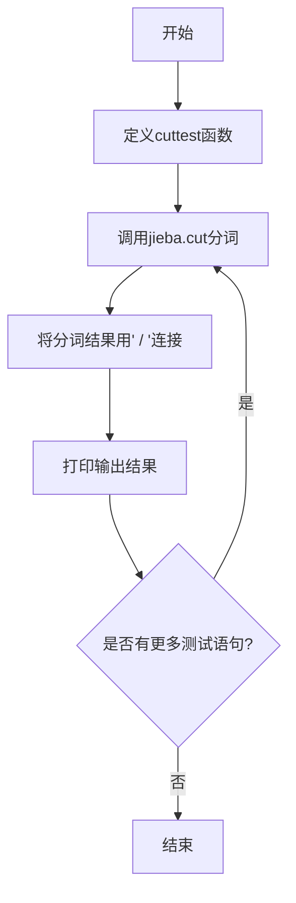
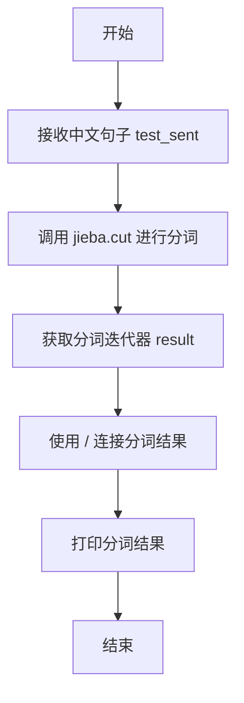
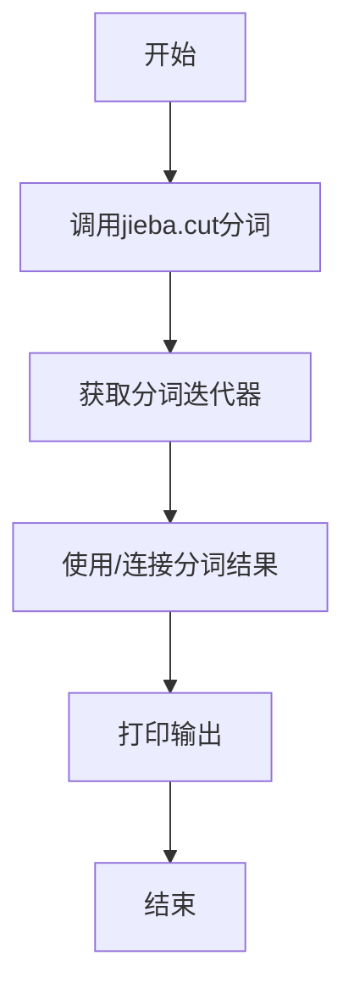

# `jieba\test\test.py` 详细设计文档

这是一个基于jieba中文分词库的测试脚本，通过调用jieba.cut()函数对各种中文句子进行分词处理，并将分词结果以斜杠分隔的形式输出，用于验证jieba分词在不同场景下的准确性和效果。

## 整体流程



## 类结构

```
无类结构（脚本级程序）
```

## 全局变量及字段


### `jieba`
    
jieba中文分词库，提供精准的中文分词、词性标注和关键词提取功能

类型：`module`
    


### `sys`
    
Python标准库模块，用于管理系统路径和获取解释器信息

类型：`module`
    


### `cuttest`
    
测试jieba分词功能的全局函数，对输入的中文句子进行分词并以斜杠分隔打印分词结果

类型：`function`
    


    

## 全局函数及方法


### `cuttest`

该函数是中文分词测试函数，接收一个中文句子作为输入，调用jieba库进行分词处理，并将分词结果以"/ "分隔的形式打印输出。

**参数：**

- `test_sent`：`str`，需要进行分词的中文句子

**返回值：** `None`，该函数没有返回值，仅直接打印分词结果到标准输出

#### 流程图



#### 带注释源码

```python
#encoding=utf-8
import sys
sys.path.append("../")
import jieba


def cuttest(test_sent):
    """
    对输入的中文句子进行分词并打印结果
    
    参数:
        test_sent: str, 要进行分词的中文句子
        
    返回值:
        None, 直接打印分词结果
    """
    # 调用jieba的中文分词功能，返回一个生成器
    result = jieba.cut(test_sent)
    
    # 将分词结果用" / "连接成字符串并打印
    print(" / ".join(result))


if __name__ == "__main__":
    # 测试各种中文句子
    cuttest("这是一个伸手不见五指的黑夜。我叫孙悟空，我爱北京，我爱Python和C++。")
    cuttest("我不喜欢日本和服。")
    cuttest("雷猴回归人间。")
    cuttest("工信处女干事每月经过下属科室都要亲口交代24口交换机等技术性器件的安装工作")
    cuttest("我需要廉租房")
    cuttest("永和服装饰品有限公司")
    cuttest("我爱北京天安门")
    cuttest("abc")
    cuttest("隐马尔可夫")
    cuttest("雷猴是个好网站")
    cuttest("\"Microsoft\"一词由\"MICROcomputer（微型计算机）\"和\"SOFTware（软件）\"两部分组成")
    cuttest("草泥马和欺实马是今年的流行词汇")
    cuttest("伊藤洋华堂总府店")
    cuttest("中国科学院计算技术研究所")
    cuttest("罗密欧与朱丽叶")
    cuttest("我购买了道具和服装")
    cuttest("PS: 我觉得开源有一个好处，就是能够敦促自己不断改进，避免敞帚自珍")
    cuttest("湖北省石首市")
    cuttest("湖北省十堰市")
    cuttest("总经理完成了这件事情")
    cuttest("电脑修好了")
    cuttest("做好了这件事情就一了百了了")
    cuttest("人们审美的观点是不同的")
    cuttest("我们买了一个美的空调")
    cuttest("线程初始化时我们要注意")
    cuttest("一个分子是由好多原子组织成的")
    cuttest("祝你马到功成")
    cuttest("他掉进了无底洞里")
    cuttest("中国的首都是北京")
    cuttest("孙君意")
    cuttest("外交部发言人马朝旭")
    cuttest("领导人会议和第四届东亚峰会")
    cuttest("在过去的这五年")
    cuttest("还需要很长的路要走")
    cuttest("60周年首都阅兵")
    cuttest("你好人们审美的观点是不同的")
    cuttest("买水果然后来世博园")
    cuttest("买水果然后去世博园")
    cuttest("但是后来我才知道你是对的")
    cuttest("存在即合理")
    cuttest("的的的的的在的的的的就以和和和")
    cuttest("I love你，不以为耻，反以为rong")
    cuttest("因")
    cuttest("")
    cuttest("hello你好人们审美的观点是不同的")
    cuttest("很好但主要是基于网页形式")
    cuttest("hello你好人们审美的观点是不同的")
    cuttest("为什么我不能拥有想要的生活")
    cuttest("后来我才")
    cuttest("此次来中国是为了")
    cuttest("使用了它就可以解决一些问题")
    cuttest(",使用了它就可以解决一些问题")
    cuttest("其实使用了它就可以解决一些问题")
    cuttest("好人使用了它就可以解决一些问题")
    cuttest("是因为和国家")
    cuttest("老年搜索还支持")
    cuttest("干脆就把那部蒙人的闲法给废了拉倒！RT @laoshipukong : 27日，全国人大常委会第三次审议侵权责任法草案，删除了有关医疗损害责任\"举证倒置\"的规定。在医患纠纷中本已处于弱势地位的消费者由此将陷入万劫不复的境地。 ")
    cuttest("大")
    cuttest("")
    cuttest("他说的确实在理")
    cuttest("长春市长春节讲话")
    cuttest("结婚的和尚未结婚的")
    cuttest("结合成分子时")
    cuttest("旅游和服务是最好的")
    cuttest("这件事情的确是我的错")
    cuttest("供大家参考指正")
    cuttest("哈尔滨政府公布塌桥原因")
    cuttest("我在机场入口处")
    cuttest("邢永臣摄影报道")
    cuttest("BP神经网络如何训练才能在分类时增加区分度？")
    cuttest("南京市长江大桥")
    cuttest("应一些使用者的建议，也为了便于利用NiuTrans用于SMT研究")
    cuttest('长春市长春药店')
    cuttest('邓颖超生前最喜欢的衣服')
    cuttest('胡锦涛是热爱世界和平的政治局常委')
    cuttest('程序员祝海林和朱会震是在孙健的左面和右面, 范凯在最右面.再往左是李松洪')
    cuttest('一次性交多少钱')
    cuttest('两块五一套，三块八一斤，四块七一本，五块六一条')
    cuttest('小和尚留了一个像大和尚一样的和尚头')
    cuttest('我是中华人民共和国公民;我爸爸是共和党党员; 地铁和平门站')
    cuttest('张晓梅去人民医院做了个B超然后去买了件T恤')
    cuttest('AT&T是一件不错的公司，给你发offer了吗？')
    cuttest('C++和c#是什么关系？11+122=133，是吗？PI=3.14159')
    cuttest('你认识那个和主席握手的的哥吗？他开一辆黑色的士。')
    cuttest('枪杆子中出政权')
    cuttest('张三风同学走上了不归路')
    cuttest('阿Q腰间挂着BB机手里拿着大哥大，说：我一般吃饭不AA制的。')
    cuttest('在1号店能买到小S和大S八卦的书，还有3D电视。')
    jieba.del_word('很赞')
    cuttest('看上去iphone8手机样式很赞,售价699美元,销量涨了5%么？')
```

## 关键组件


### 核心功能概述

该代码是一个基于jieba库的中文分词功能测试脚本，通过调用jieba分词API对多个中文句子进行分词处理，并输出分词结果，同时演示了删除自定义词汇的操作。

### 文件整体运行流程

1. 脚本入口设置UTF-8编码
2. 将上级目录加入系统路径
3. 导入jieba分词库
4. 定义cuttest函数用于分词测试
5. 在主程序中依次调用cuttest函数测试多个中文句子
6. 最后删除词汇"很赞"并再次测试

### 函数详细信息

#### 全局函数：cuttest

- **函数名**: cuttest
- **参数名称**: test_sent
- **参数类型**: str
- **参数描述**: 待分词的中文句子字符串
- **返回值类型**: None
- **返回值描述**: 无返回值，仅打印分词结果到控制台
- **mermaid流程图**: 

- **带注释源码**:
```python
def cuttest(test_sent):
    """对输入的中文句子进行分词并打印结果"""
    result = jieba.cut(test_sent)  # 调用jieba的cut方法进行分词，返回迭代器
    print(" / ".join(result))       # 将分词结果用/连接后打印
```

### 关键组件信息

#### jieba分词库

Python中文分词库，支持精确模式、全模式、搜索引擎模式等分词方式

#### cuttest函数

分词测试函数，封装了jieba.cut调用和结果打印的便捷函数

#### 测试用例集

包含约50+个中文句子，涵盖不同类型的文本：普通句子、成语、缩写、技术术语、人名、地名等

### 潜在技术债务或优化空间

1. **缺乏错误处理机制**: 未对空字符串、None输入、分词异常等情况进行处理
2. **硬编码测试用例**: 所有测试用例直接写在代码中，不利于维护和扩展
3. **缺少配置文件**: 测试用例应分离到单独的配置文件中
4. **无单元测试**: 缺少正式的单元测试框架
5. **无性能测试**: 未包含分词性能基准测试

### 其它项目

#### 设计目标与约束

- 目标：验证jieba分词库对各类中文句子的分词效果
- 约束：依赖jieba库，需确保库已安装

#### 错误处理与异常设计

- 当前未实现任何错误处理机制
- 建议增加：空输入检查、异常捕获、日志记录

#### 数据流与状态机

数据流为：输入字符串 → jieba.cut()分词 → 迭代器 → join连接 → 控制台输出

#### 外部依赖与接口契约

- 依赖：jieba库（通过pip install jieba安装）
- 接口：jieba.cut(text) 接受字符串返回词语生成器；jieba.del_word(word) 删除词典中的词


## 问题及建议


### 已知问题

-   **sys.path使用相对路径**：使用`sys.path.append("../")`添加路径是不可移植的，依赖于特定的项目目录结构，在不同环境或移动文件后可能失败
-   **缺少异常处理**：`cuttest`函数没有对输入进行校验，当传入`None`或分词失败时可能导致程序崩溃
-   **使用print而非日志**：在生产环境中使用`print`输出，无法控制日志级别和输出目标，不利于后期维护和排查问题
-   **测试用例与代码耦合**：大量测试句子硬编码在主程序中，既不利于代码复用，也不利于测试用例的维护和扩展
-   **重复的字符串字面量**：测试句子中存在重复的字符串（如"hello你好人们审美的观点是不同的"出现多次），造成代码冗余
-   **无配置管理**：jieba的初始化配置（如分词模式、词典路径等）均使用默认值，缺乏灵活性和可配置性
-   **未充分利用jieba API**：最后调用`jieba.del_word('很赞')`后立即测试，del_word的效果应在下次分词前生效，但这种用法缺乏明确的设计意图

### 优化建议

-   **使用日志模块**：用`logging`模块替代`print`，配置合理的日志级别和格式
-   **添加异常处理**：为`cuttest`函数增加输入校验，处理空字符串、None等边界情况，并捕获jieba可能的异常
-   **重构测试用例**：将测试句子抽取到列表、文件或配置中，使用循环或测试框架（如unittest/pytest）管理测试用例
-   **消除重复字符串**：使用常量或列表存储测试句子，避免重复定义
-   **配置化设计**：将jieba的分词模式、词典路径等配置项提取到配置文件或环境变量中，提高代码灵活性
-   **封装分词逻辑**：考虑创建一个分词器类，封装配置和分词方法，提高代码的复用性和可测试性


## 其它


### 设计目标与约束

本代码的核心目标是对中文文本进行分词处理，验证jieba分词库对各类中文句子的分词效果。设计约束包括：仅支持UTF-8编码的输入文本，依赖jieba第三方库，分词结果为generator对象需要转换为列表或直接迭代打印。

### 错误处理与异常设计

代码未实现显式的异常处理机制。潜在异常包括：ImportError（jieba库未安装）、UnicodeDecodeError（编码问题）、空字符串输入（已处理，jieba.cut返回空列表）。建议增加异常捕获处理，特别是文件编码异常和jieba初始化失败的场景。

### 数据流与状态机

数据流为：输入字符串 → jieba.cut()分词 → generator对象 → join()拼接 → 输出打印。状态机相对简单，仅包含初始化状态（jieba加载词典）和执行状态（分词处理），无复杂状态转换。

### 外部依赖与接口契约

主要依赖jieba库（中文分词引擎）。接口契约：cuttest函数接收str类型参数test_sent，返回值为None（直接打印到标准输出），函数内部调用jieba.cut()返回generator，join()操作将分词结果以"/"分隔连接。

### 性能考虑

代码未进行性能优化。潜在优化点：jieba.cut()返回generator适合处理长文本，但对于大量短文本可考虑预加载词典、使用jieba.lcut()直接返回列表减少转换开销。当前测试场景为离线批处理，无实时性要求。

### 安全性考虑

代码无用户输入校验、无文件操作、无网络通信，安全性风险较低。潜在风险：输入字符串过长可能导致内存问题，建议添加输入长度限制（如max_length=10000字符）。

### 可维护性与可扩展性

代码结构简单但可维护性较差：所有测试用例硬编码在main函数中，未实现命令行参数解析。建议将测试用例提取为配置文件或测试数据文件，增加--help说明，输出格式（分隔符）应可配置。

### 测试策略

当前为手工测试（直接运行脚本观察输出），无自动化测试用例。建议增加单元测试验证cuttest函数对边界条件（空字符串、特殊字符、纯数字等）的处理，添加性能基准测试。

### 版本兼容性

依赖jieba库的版本兼容性。当前代码兼容jieba 0.42+版本。Python版本建议使用3.6+以确保更好的编码处理和f-string支持。

### 编码规范与约定

代码符合PEP8基本规范，但存在改进空间：import顺序（标准库→第三方库→本地库）应调整，函数应添加docstring说明，魔法数字（如分词间隔符"/"）应提取为常量，测试用例建议使用列表或配置文件管理。

### 配置管理

当前无配置文件，所有参数硬编码。建议将分隔符、测试语句集合、jieba初始化参数等提取为配置文件（如config.yaml或settings.py），便于非技术人员调整测试场景。

### 日志与监控

代码无日志输出，无法追踪执行过程和诊断问题。建议添加logging模块，记录jieba版本、输入文本长度、分词耗时等信息，便于性能分析和问题排查。

### 部署与运维

部署要求：Python 3.6+，安装jieba库（pip install jieba）。无特殊运维需求，属于一次性验证脚本。建议提供requirements.txt或setup.py便于环境搭建。


    