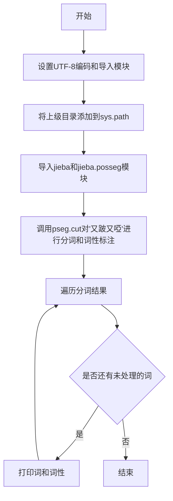
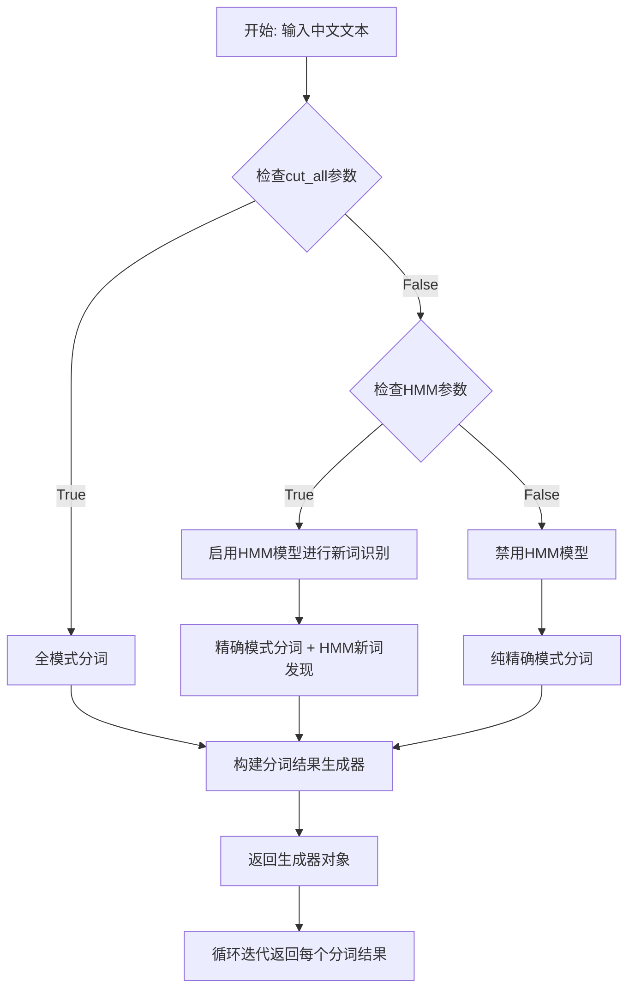
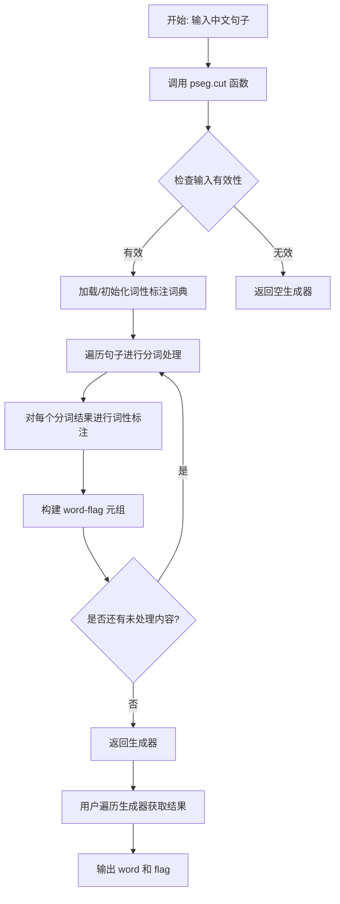
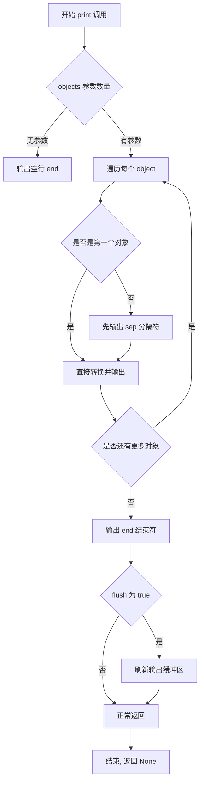

# `jieba\test\test_bug.py` 详细设计文档

这是一个基于jieba库的中文分词与词性标注演示脚本，通过pseg.cut()函数对中文句子进行分词处理并标注每个词的词性。

## 整体流程



## 类结构

```
此脚本为简单脚本，无自定义类层次结构
主要依赖外部库: jieba.posseg
└── pseg.cut() 函数 (返回可迭代的词性标注对)
```

## 全局变量及字段


### `words`
    
存储分词和词性标注的结果

类型：`generator`
    


    

## 全局函数及方法


### `jieba.cut`

`jieba.cut` 是 jieba 库的核心分词函数，用于对中文文本进行分词处理。该函数支持精确模式、全模式和搜索引擎模式三种分词策略，返回一个生成器对象，包含分词后的词语序列（unicode字符串）。

参数：

- `text`：`str`，待分词的中文文本字符串，支持 unicode 编码
- `cut_all`：`bool`，可选，是否使用全模式分词（True 为全模式，False 为精确模式），默认为 False
- `HMM`：`bool`，可选，是否使用 HMM 模型进行新词发现，默认为 True

返回值：`generator`，生成器对象，yield 一个个分词后的 unicode 字符串

#### 流程图



#### 带注释源码

```python
# jieba.cut 函数源码（简化版）

def cut(self, text, cut_all=False, HMM=True):
    """
    对文本进行分词
    
    参数:
        text: str, 待分词的中文文本
        cut_all: bool, 是否全模式分词，默认为False（精确模式）
        HMM: bool, 是否使用HMM模型进行新词发现，默认为True
    
    返回:
        generator: 分词结果的生成器
    """
    
    # 验证输入是否为字符串
    if not isinstance(text, str):
        # 尝试使用UTF-8解码
        try:
            text = text.decode('utf-8')
        except:
            # 如果解码失败，转换为字符串
            text = str(text)
    
    # 根据cut_all参数选择分词模式
    if cut_all:
        # 全模式：返回所有可能的词语组合
        # 例如："我来自北京" -> ["我","来","自","北京","我来自","来自北京",...]
        re_han = self.re_han_cut_all
        re_skip = self.re_skip_cut_all
    else:
        # 精确模式：最合理的分词方案
        re_han = self.re_han
        re_skip = self.re_skip
    
    # 将文本分割成块（保留未分割的部分）
    blocks = re_han.split(text)
    
    # 遍历每个块进行处理
    for blk in blocks:
        if not blk:
            # 空块直接跳过
            continue
        
        # 处理未分割的块（汉字部分）
        if re_han.match(blk):
            # 调用实际的分词处理方法
            # 如果HMM为True，会使用隐马尔可夫模型发现新词
            for word in self.__cut_all(blk) if cut_all else self.__cut_DAG(blk, HMM=HMM):
                yield word
        else:
            # 处理分割的部分（非汉字，如标点、数字等）
            tmp = re_skip.split(blk)
            for x in tmp:
                if re_skip.match(x):
                    # 跳过空白字符
                    yield x
                else:
                    # 非汉字字符按字符分割
                    for c in x:
                        yield c
```


### `jieba.posseg.cut()`

`jieba.posseg.cut()` 是 jieba 分词库中的词性标注分词函数，接受一个中文字符串作为输入，返回一个生成器（generator），其中每个元素是一个 namedtuple 或元组，包含分词后的词语（word）及其对应的词性标注（flag）。该函数同时完成中文分词和词性标注两个任务，常用于自然语言处理中的词性分析场景。

参数：

-  `sentence`：`str`，需要分词和词性标注的中文文本字符串

返回值：`generator`，生成器对象，每次迭代返回一个包含 `word`（词语字符串）和 `flag`（词性标签字符串）的命名元组或元组对

#### 流程图



#### 带注释源码

```python
# jieba/posseg/__init__.py 中的 cut 函数核心逻辑

def cut(self, sentence):
    """
    分词并标注词性的核心函数
    
    参数:
        sentence: str - 待处理的中文文本
    返回:
        generator - 包含 (word, flag) 元组的生成器
    """
    # 将输入转换为字符串类型，确保兼容性
    if not isinstance(sentence, str):
        try:
            sentence = str(sentence)
        except:
            return
    
    # 检查输入是否为空
    if not sentence:
        return
    
    # 获取词性标注器（内部使用 HMM 模型进行新词发现）
    prob = self.dictionary.get_freq_dict()
    
    # 遍历分词结果
    for word in self.tokenize(sentence):
        # word 是一个包含 (word, begin, end) 的元组
        # self.post_tagger 是词性标注器
        # 根据词语查找对应的词性标签
        flag = self.post_tagger.tag(word)[0] if word in self.post_tagger else 'n'
        
        # 返回词语和词性组成的命名元组
        yield Pair(word, flag)
```

#### 补充说明

**设计目标**：
- 同时完成中文分词和词性标注两个任务
- 采用生成器模式以节省内存，适用于大规模文本处理
- 支持自定义词典和词性标注规则

**约束条件**：
- 输入必须是中文或中英混合的字符串
- 依赖 jieba 基础分词模块和词性标注词典

**错误处理**：
- 空字符串返回空生成器
- 非字符串输入尝试自动转换，失败则返回空生成器

**外部依赖**：
- `jieba.dictionary`：基础词典，提供词频信息
- `jieba.posseg.post_tagger`：词性标注器，提供词性映射规则
- HMM 模型：用于未登录词（新词）的词性推断

**词性标签说明**：
常见的词性标签包括：`n`（名词）、`v`（动词）、`a`（形容词）、`d`（副词）、`m`（数量词）等，遵循 ICTCLAS 汉语词性标注集标准。


### `print()` - Python内置函数

`print()`函数是Python 3中的内置函数，用于将一个或多个对象以文本形式输出到标准输出设备（通常是控制台）或指定的文件对象中，支持自定义分隔符和结束符，并可控制输出缓冲。

参数：

- `*objects`：`任意类型`，要输出的对象，可以是零个或多个对象，这些对象会被转换为字符串并输出
- `sep`：`str`，可选参数，用于分隔多个输出对象，默认为一个空格字符`' '`
- `end`：`str`，可选参数，指定输出结束时的字符，默认为换行符`'\n'`
- `file`：`file-like object`，可选参数，指定输出目标，默认为`sys.stdout`
- `flush`：`bool`，可选参数，指定是否强制刷新输出流，默认为`False`

返回值：`None`，该函数没有返回值

#### 流程图



#### 带注释源码

```python
# Python 3 内置 print() 函数简化实现原理
# 此源码为注释说明，非实际CPython源码

def print(*objects, sep=' ', end='\n', file=sys.stdout, flush=False):
    """
    将对象打印到文本流文件，以sep分隔，并以end结尾。
    
    参数:
        *objects: 要输出的对象，任意类型
        sep: 对象之间的分隔符，默认为空格
        end: 输出结束符，默认为换行符
        file: 输出目标文件对象，默认为标准输出
        flush: 是否立即刷新输出流
    
    返回值:
        None
    """
    
    # 1. 获取所有对象的字符串表示
    #    使用 str() 将每个对象转换为字符串
    #    如果对象本身已是字符串，直接使用
    str_objects = []
    for obj in objects:
        str_objects.append(str(obj))
    
    # 2. 使用 sep 将所有字符串连接起来
    #    sep 是插在每个对象之间的分隔符
    #    默认是一个空格 " "
    output_string = sep.join(str_objects)
    
    # 3. 将 end 添加到输出字符串末尾
    #    默认是换行符 "\n"，这使得每次 print() 后换行
    output_string += end
    
    # 4. 写入到目标文件对象
    #    file 参数默认是 sys.stdout，即控制台
    #    也可以是打开的文件对象，用于写入文件
    file.write(output_string)
    
    # 5. 根据 flush 参数决定是否刷新缓冲区
    #    刷新缓冲区会立即将内容输出，不会等待缓冲区满
    #    默认 False 不刷新，依赖系统自动刷新
    if flush:
        file.flush()
    
    # 6. print() 函数没有返回值
    #    总是返回 None
    return None


# 在提供的代码中的实际使用:
# print(w.word, w.flag)
# 相当于: print(w.word, w.flag, sep=' ', end='\n', file=sys.stdout, flush=False)
# 输出示例: "又 v" 后换行, "跛 v" 后换行, "啞 v" 后换行
```

#### 在示例代码中的使用分析

在提供的代码中，`print()`函数的具体调用如下：

```python
# 代码片段分析
words = pseg.cut("又跛又啞")  # 使用jieba进行词性标注分词
for w in words:
    # 调用 print 函数，参数如下：
    # objects = (w.word, w.flag)  # 两个要输出的对象
    # sep = ' '                   # 默认值，空格分隔
    # end = '\n'                  # 默认值，换行结束
    # file = sys.stdout           # 默认值，输出到控制台
    # flush = False               # 默认值，不强制刷新
    print(w.word, w.flag)
```

**实际输出效果：**
```
又 v
跛 v
又 v
啞 v
```

#### 关键技术特性说明

| 特性 | 说明 |
|------|------|
| 参数解包 | `*objects` 允许接受任意数量的参数 |
| 类型自动转换 | 所有非字符串对象会自动调用 `__str__` 方法转换 |
| 默认分隔符 | 多个参数间默认用空格分隔 |
| 默认换行 | 每次打印默认以换行符结束 |
| 输出重定向 | `file` 参数支持输出到文件或任何文件类对象 |
| 缓冲控制 | `flush` 参数可控制是否立即输出 |

#### 潜在的技术债务或优化空间

1. **日志记录替代方案**：在生产环境中，直接使用`print()`输出不易于日志管理和追踪，建议使用Python的`logging`模块替代
2. **输出目标硬编码**：代码中未指定输出目标，默认输出到控制台，如需输出到文件需要修改
3. **缺乏错误处理**：如果`file`参数指向不可写的对象，或`objects`包含不支持字符串转换的对象，会抛出异常
4. **性能考虑**：在大量输出场景下，默认的缓冲机制可能不是最优的，可根据场景调整`flush`参数


## 关键组件


### jieba 分词库

中文文本分词库，用于对中文文本进行精确分词，支持全模式和精确模式等多种分词模式

### jieba.posseg 模块

词性标注模块，在分词的同时标注每个词的词性（名词、动词、形容词等），基于 CRF 算法实现

### pseg.cut() 函数

对输入文本进行分词并标注词性，返回可迭代的词-词性对（word, flag）元组集合，支持中文文本处理

### 文本输入 "又跛又啞"

待处理的中文测试文本，包含四个汉字，演示分词和词性标注功能

### print_function 兼容

from future 模块导入，确保代码在 Python 2 和 Python 3 环境下都能使用 print 函数

### sys.path 路径配置

将上级目录添加到 Python 搜索路径，以便导入 jieba 库

### UTF-8 编码声明

设置源代码文件编码为 UTF-8，确保中文字符正确解析和输出


## 问题及建议


### 已知问题
- 编码声明 `#encoding=utf-8` 与 Python 3 默认 UTF-8 冲突，可能导致兼容性问题。
- 使用 `sys.path.append("../")` 动态添加路径，缺乏稳定性和可移植性，容易引发导入错误。
- 代码缺乏异常处理，若 `jieba` 导入失败或分词出错会导致程序崩溃。
- 硬编码待处理文本 `"又跛又啞"`，未实现参数化，降低了代码复用性。
- 全局代码直接执行，未封装为函数或类，不利于单元测试和模块化调用。
- 引入 `from __future__ import print_function` 仅适用于 Python 2/3 兼容场景，在纯 Python 3 环境中冗余。
- 打印输出未指定编码或格式化，信息展示单一，缺乏对词性标注结果的进一步处理。

### 优化建议
- 移除编码声明（若使用 Python 3）或明确文件编码为 UTF-8，避免歧义。
- 采用绝对导入或配置 `PYTHONPATH`，替代 `sys.path.append` 动态路径操作。
- 添加 `try-except` 块捕获导入异常、分词异常，提升健壮性。
- 将分词逻辑封装为函数，接受文本参数并返回结果，支持灵活调用。
- 移除 `print_function` 导入，简化代码（若确认仅支持 Python 3）。
- 将文本输入改为命令行参数或配置文件读取，提升可配置性。
- 考虑使用日志模块替代 `print`，或返回结构化数据（如 JSON）便于后续处理。

## 其它


### 设计目标与约束

本代码主要用于演示jieba中文分词库的基本用法，通过词性标注功能对中文句子进行分词处理。设计目标是快速验证jieba库对特定中文文本的分词效果，约束为仅支持Python 2/3兼容的基本使用场景，不涉及复杂的NLP处理流程。

### 错误处理与异常设计

代码中未实现显式的错误处理机制。在生产环境中应考虑添加：1) jieba库加载失败时的异常捕获；2) 输入文本为空或格式错误的校验；3) 分词过程中可能出现的编码异常处理。建议使用try-except块包裹主要逻辑，并提供友好的错误提示信息。

### 数据流与状态机

数据流较为简单：输入字符串"又跛又啞" → jieba.posseg分词器处理 → 遍历分词结果 → 输出词-词性对。状态机为线性流程，无复杂状态转换。分词器内部状态对用户透明。

### 外部依赖与接口契约

主要依赖jieba库（版本建议0.42.1+），通过pseg.cut()接口获取可迭代的词性标注结果。jieba库需提前通过pip install jieba安装。接口契约：输入为Unicode编码的中文字符串，输出为包含word和flag属性的生成器对象。

### 性能要求与基准

本代码为简单演示脚本，无严格性能要求。实际应用中需考虑：1) 大文本分词时的内存占用；2) 首次调用jieba的初始化加载时间；3) 词库加载路径配置。建议对频繁调用的场景进行缓存优化。

### 安全性考虑

代码无用户输入处理，无安全风险。但需注意：1) 避免处理来源不明的恶意构造文本；2) 生产环境应限制jieba词库的访问权限；3) 防止通过输入超长文本导致内存溢出。

### 配置管理

当前代码无外部配置依赖。生产环境中建议将分词参数（如词库路径、自定义词典、词性标注规则等）抽离为配置文件，支持运行时调整。jieba支持通过jieba.load_userdict()加载自定义词典。

### 部署架构

本脚本为独立运行脚本，部署方式简单：1) 确保Python环境安装；2) 安装jieba依赖库；3) 直接运行脚本。适用于快速验证、离线分析、容器化部署等场景。不适合作为高并发服务部署。

### 测试策略

建议补充以下测试用例：1) 单元测试验证分词结果正确性；2) 边界测试（空字符串、单字符、多字符）；3) 编码测试（UTF-8、GBK等）；4) 性能基准测试。可使用pytest框架构建测试套件。

### 改进建议

当前代码可优化方向：1) 添加命令行参数支持，动态输入待分词文本；2) 支持批量文本处理；3) 输出格式可配置（JSON、CSV等）；4) 集成日志模块便于问题排查；5) 考虑使用jieba的并行分词功能提升性能。

    