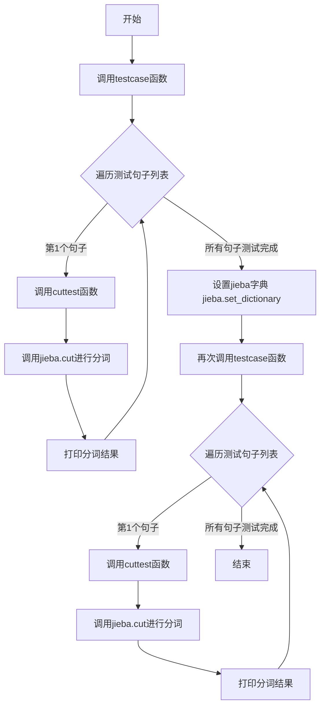
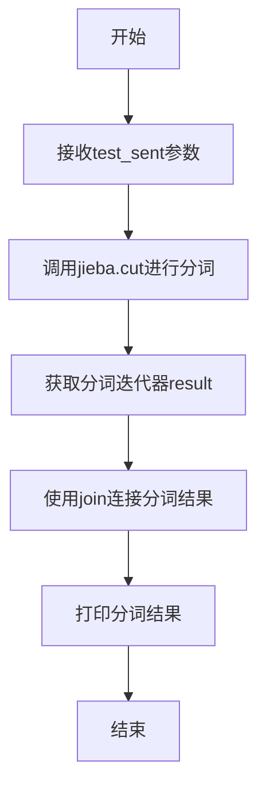
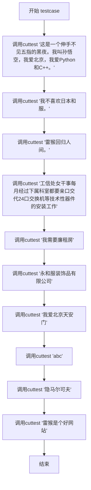

# `jieba\test\test_change_dictpath.py` 详细设计文档

该代码是一个jieba中文分词库的测试程序，通过调用jieba.cut函数对多个中文句子进行分词测试，并演示了如何动态设置分词字典。

## 整体流程



## 类结构

```
该代码无类定义，为扁平化结构
```

## 全局变量及字段


### `jieba`
    
中文分词库，用于对中文文本进行分词处理

类型：`module`
    


### `cuttest`
    
对输入的测试句子进行分词并打印分词结果

类型：`function`
    


### `testcase`
    
执行一组预定义的中文分词测试用例

类型：`function`
    


    

## 全局函数及方法


### `cuttest`

该函数接收一个中文句子作为输入，调用jieba库的中文分词功能对句子进行分词处理，并将分词结果以空格连接后打印输出。

参数：

- `test_sent`：`str`，需要进行中文分词的输入文本

返回值：`None`，该函数无返回值，仅通过打印输出分词结果

#### 流程图



#### 带注释源码

```python
def cuttest(test_sent):
    """
    对输入的中文句子进行分词处理并打印结果
    
    参数:
        test_sent: str，需要进行分词的中文句子
    
    返回值:
        None，仅打印分词结果到标准输出
    """
    # 调用jieba库的cut方法进行中文分词，返回一个生成器对象
    result = jieba.cut(test_sent)
    
    # 将分词结果用双空格连接成字符串并打印输出
    print("  ".join(result))
```


### `testcase`

该函数是一个测试用例封装函数，用于演示和验证jieba分词库在不同文本场景下的分词效果，包括中文短句、复杂技术术语、专有名词以及英文字符串等多种输入。

参数：
- 无

返回值：`None`，该函数仅执行分词测试打印操作，无返回值

#### 流程图



#### 带注释源码

```python
def testcase():
    """
    测试用例函数
    
    该函数封装了多个测试句子，用于验证jieba分词库
    在不同类型文本上的分词效果，包括：
    - 含有标点符号的长句
    - 含有专有名词（如人名、地名）的句子
    - 含有技术术语的句子
    - 短句
    - 英文字符串
    - 专业术语（如隐马尔可夫模型）
    """
    
    # 测试1：长句，包含标点、人名、编程语言
    cuttest("这是一个伸手不见五指的黑夜。我叫孙悟空，我爱北京，我爱Python和C++。")
    
    # 测试2：含日本相关词汇的句子
    cuttest("我不喜欢日本和服。")
    
    # 测试3：简短的问候语/俗语
    cuttest("雷猴回归人间。")
    
    # 测试4：技术类长句，含有多专业术语
    cuttest("工信处女干事每月经过下属科室都要亲口交代24口交换机等技术性器件的安装工作")
    
    # 测试5：房产相关短语
    cuttest("我需要廉租房")
    
    # 测试6：公司名称
    cuttest("永和服装饰品有限公司")
    
    # 测试7：著名地标
    cuttest("我爱北京天安门")
    
    # 测试8：纯英文字符串
    cuttest("abc")
    
    # 测试9：专业术语
    cuttest("隐马尔可夫")
    
    # 测试10：网络用语
    cuttest("雷猴是个好网站")
```

## 关键组件


### jieba 中文分词核心功能

该代码是一个基于jieba库的中文分词测试程序，通过调用jieba.cut()函数对中文句子进行分词处理，并使用set_dictionary()方法配置自定义词典，实现对不同类型中文文本（包括普通句子、专业术语、成语、缩写等）的分词功能。

### cuttest 分词测试函数

该函数是分词测试的核心执行单元，接收待分词的中文文本作为输入参数，调用jieba.cut()进行分词处理，然后将分词结果以空格连接后打印输出。

### testcase 测试用例集

该函数封装了多个典型中文分词测试用例，涵盖了普通叙事文本、包含专有名词的句子、技术术语短语、成语、缩写词以及纯英文文本等多种场景，用于全面验证jieba分词的效果。

### jieba 词典配置

该部分通过jieba.set_dictionary()方法加载自定义词典文件"foobar.txt"，用于增强分词器对特定词汇的识别能力，在测试用例执行前后形成对比，展示自定义词典对分词结果的影响。

### 测试语料覆盖

代码中包含10个不同的测试句子，涵盖了日常对话、文学作品片段、地名与公司名称、技术术语、成语、网络用语等多种中文语言现象，用于全面测试分词系统的准确性和鲁棒性。


## 问题及建议


### 已知问题

-   **字典文件路径硬编码**：使用相对路径 `jieba.set_dictionary("foobar.txt")`，在不同工作目录下运行时可能找不到文件，导致文件不存在异常
-   **字典设置时机错误**：在第一次 `testcase()` 执行后才设置自定义字典，导致第一次运行使用默认字典，第二次才使用自定义字典，逻辑顺序不符合常规预期
-   **缺少异常处理**：没有任何 try-except 捕获异常，jieba 初始化失败、字典文件不存在或加载错误时程序会直接崩溃
-   **sys.path 追加方式不当**：使用 `sys.path.append("../")` 相对路径添加模块路径，依赖运行目录，不够健壮
-   **测试无验证逻辑**：仅打印分词结果，没有任何断言或验证机制，无法判断分词结果是否正确
-   **重复代码执行**：testcase() 函数被连续调用两次，第二次才应用自定义字典设置
-   **测试用例硬编码**：所有测试句子都硬编码在 testcase 函数中，不便于扩展和维护

### 优化建议

-   使用绝对路径或基于项目根目录的路径来设置字典文件，如使用 `os.path.dirname(__file__)` 获取脚本所在目录
-   将字典设置移到第一次调用 testcase 之前，或使用配置中心管理分词字典路径
-   添加异常处理：使用 try-except 捕获 FileNotFoundError、IOError 等异常，并给出友好提示
-   移除 sys.path 修改，改为使用 pip 安装 jieba 或使用绝对导入
-   引入单元测试框架（如 pytest），为每个测试用例添加断言验证分词结果的正确性
-   重构代码避免重复调用：可将 testcase 参数化，或拆分为 setup、execute、teardown 阶段
-   将测试用例数据抽取为外部配置文件（如 YAML 或 JSON），提高可维护性
-   添加日志记录功能，使用 logging 模块记录分词过程和错误信息
-   考虑使用 jieba 的 `load_userdict` 方法动态加载用户字典，而非覆盖默认字典


## 其它


### 设计目标与约束

本代码的设计目标是测试jieba中文分词库的分词效果，通过加载默认词典和自定义词典("foobar.txt")对比分词结果的差异。约束条件包括：Python 2/3兼容(通过from __future__ import print_function实现)、依赖外部库jieba、需要配置有效的词典文件路径。

### 错误处理与异常设计

当前代码缺乏错误处理机制。潜在异常包括：词典文件不存在或路径错误导致FileNotFoundError、jieba库未安装导致ImportError、网络异常情况下词典加载失败。建议添加：词典文件存在性检查、jieba库导入异常捕获、词典加载失败时的回退策略(如使用默认词典)。

### 数据流与状态机

数据流：测试句子输入 → jieba.cut()分词处理 → 结果拼接 → 标准输出打印。状态机不适用本场景，但存在隐式状态：初始状态(词典未加载) → 词典加载状态 → 分词就绪状态 → 分词执行状态。

### 外部依赖与接口契约

外部依赖：jieba库(中文分词)、Python标准库(sys)。接口契约：cuttest函数接受字符串参数test_sent，返回None(仅打印结果)；testcase函数无参数，返回None；jieba.set_dictionary()接受字符串路径参数；jieba.cut()返回生成器对象。

### 配置信息

配置项：词典文件路径("foobar.txt")。该配置在运行时动态加载，用于自定义分词词典。配置来源为命令行参数或硬编码路径。建议配置管理：支持通过命令行参数指定词典路径、配置文件管理、默认值回退机制。

### 性能考虑

词典加载时间可能影响首次分词性能。jieba.cut()返回生成器而非列表，节省内存。当前代码无性能监控机制。优化建议：缓存分词结果、预加载词典、添加性能基准测试。

### 安全性考虑

代码未涉及用户输入验证、文件路径安全检查、恶意字符串处理。潜在风险：test_sent参数未做长度限制、词典文件路径未做路径遍历攻击检查。建议添加输入验证、路径安全检查、异常边界处理。

### 测试覆盖

当前testcase()函数包含10个测试用例，覆盖场景：常规中文句子、中文俗语、技术术语、房产相关、公司名称、地点、英文、数字、专有名词、网络用语。覆盖不足：空字符串、极长字符串、特殊字符、混合语言、未登录词等边界情况。


    