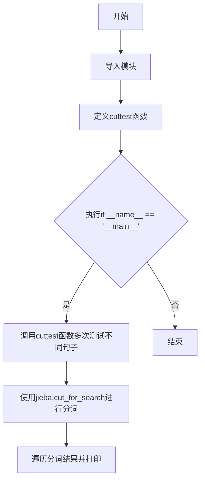

# `jieba\test\test_cut_for_search.py` 详细设计文档

该文件是一个基于jieba中文分词库的测试脚本，主要通过cuttest函数调用jieba.cut_for_search方法对各种中文句子进行分词测试，用于验证jieba分词库在不同场景下的分词效果。

## 整体流程



## 类结构

```
该脚本为独立测试文件，无自定义类层次结构
主要依赖jieba库的分词功能
```

## 全局变量及字段


### `jieba`
    
结巴中文分词模块，提供分词、词性标注、关键词提取等功能

类型：`module`
    


### `sys`
    
Python标准库模块，提供系统相关的参数和函数

类型：`module`
    


### `test_sent`
    
待分词的中文或中英文混合文本字符串

类型：`str`
    


    

## 全局函数及方法


### `cuttest`

该函数使用jieba库的`cut_for_search`方法对输入的中文句子进行搜索引擎友好的分词处理，并将分词结果逐词打印，每个词语后跟"/"符号作为分隔符。

参数：

- `test_sent`：`str`，需要进行分词的中文句子字符串

返回值：`None`，该函数无返回值，仅通过打印输出分词结果

#### 流程图

```mermaid
flowchart TD
    A([开始]) --> B{调用 jieba.cut_for_search<br/>对 test_sent 分词}
    B --> C[获取分词迭代器 result]
    C --> D{遍历 result 中的<br/>每个词语 word}
    D -->|是| E[打印 word 和 "/"]
    E --> D
    D -->|否| F[打印换行]
    F --> G([结束])
    
    subgraph 核心处理
    B
    C
    end
    
    subgraph 输出环节
    E
    F
    end
```

#### 带注释源码

```python
#encoding=utf-8
# 导入print函数以兼容Python 2和Python 3
from __future__ import print_function
import sys
# 将上级目录添加到系统路径，以便导入jieba模块
sys.path.append("../")
# 导入结巴中文分词库
import jieba

def cuttest(test_sent):
    """
    使用jieba的搜索引擎分词模式对中文句子进行分词
    
    参数:
        test_sent: str, 需要进行分词的中文文本
    返回值:
        None, 直接打印分词结果到标准输出
    """
    # 使用jieba的cut_for_search方法进行搜索引擎友好的分词
    # 该方法会生成更细粒度的分词结果，适合搜索引擎索引
    result = jieba.cut_for_search(test_sent)
    
    # 遍历分词结果，打印每个词语并用"/"分隔
    # 使用end=' '参数使所有词语打印在同一行
    for word in result:
        print(word, "/", end=' ') 
    
    # 打印换行符，结束当前句子的分词输出
    print("")


if __name__ == "__main__":
    # 主测试入口，调用cuttest函数测试多种中文句子
    cuttest("这是一个伸手不见五指的黑夜。我叫孙悟空，我爱北京，我爱Python和C++。")
    cuttest("我不喜欢日本和服。")
    cuttest("雷猴回归人间。")
    cuttest("工信处女干事每月经过下属科室都要亲口交代24口交换机等技术性器件的安装工作")
    cuttest("我需要廉租房")
    cuttest("永和服装饰品有限公司")
    cuttest("我爱北京天安门")
    cuttest("abc")
    cuttest("隐马尔可夫")
    # ... 更多测试用例
```


## 关键组件


### jieba中文分词库

这是一个广泛使用的中文分词库，支持精确模式、搜索模式等多种分词方式，提供强大的中文文本处理能力。

### cuttest函数

用于测试jieba分词功能的核心函数，接收中文句子作为输入，调用cut_for_search进行搜索模式分词，并格式化输出分词结果。

### cut_for_search分词方法

搜索引擎模式分词，生成细粒度的分词结果，适合搜索场景使用，支持复合词拆分。

### sys.path路径配置

通过sys.path.append("../")添加上级目录到Python路径，确保能够正确导入jieba模块。

### 测试语料库

包含多种类型的中文测试句子，涵盖新闻、对话、专业术语、成语、网络用语等场景，用于全面测试分词效果。


## 问题及建议


### 已知问题

- 缺少异常处理机制，未对jieba加载失败、输入为空或特殊字符等情况进行捕获，可能导致程序崩溃
- 测试用例硬编码在主程序中，缺乏参数化设计，无法灵活指定测试文本
- 路径处理硬编码（`sys.path.append("../")`），依赖相对路径，可移植性差
- 未使用jieba的高级功能（如词性标注、关键词提取、自定义词典等），功能覆盖不全面
- 无日志记录，无法追踪分词过程和调试问题
- 缺少单元测试和模块化设计，代码可测试性低
- 未提供命令行参数支持，无法通过命令行传入待分词文本
- 输出格式固定，无法根据需求调整分词结果输出形式（如JSON、列表等）
- 重复调用多次`cuttest`函数，可考虑批量处理或封装为测试用例
- 无性能基准测试，无法评估分词效率和大规模文本处理能力

### 优化建议

- 添加try-except异常处理，捕获jieba加载异常、编码异常等情况，提升程序健壮性
- 将测试用例分离为独立数据文件（如JSON/TXT），通过参数或配置文件加载
- 使用argparse库提供命令行接口，支持自定义分词模式和输出格式
- 封装分词逻辑为独立函数或类，支持自定义词典、词性标注等高级功能
- 引入logging模块记录分词过程、耗时统计等信息
- 编写单元测试用例，使用unittest框架验证分词准确性
- 考虑将输出格式化为JSON或结构化数据，便于后续处理和集成
- 对高频调用场景使用jieba的缓存机制或批量分词接口提升性能

## 其它


### 设计目标与约束

本代码的主要设计目标是测试jieba中文分词库中cut_for_search函数对各类中文文本的分词效果。约束条件包括：依赖jieba库、仅支持Python 2/3兼容写法、使用UTF-8编码。

### 错误处理与异常设计

代码未实现显式的错误处理机制。若jieba库加载失败或分词输入为非字符串类型，可能导致运行时异常。建议增加异常捕获逻辑处理空字符串、None值及编码异常情况。

### 数据流与状态机

数据流为：输入测试句子 → cuttest函数调用jieba.cut_for_search → 迭代器遍历分词结果 → 格式化打印输出。无复杂状态机设计，属于线性数据处理流程。

### 外部依赖与接口契约

核心依赖为jieba库，通过jieba.cut_for_search(test_sent)接口进行分词。该接口接收字符串参数test_sent，返回可迭代的分词结果生成器。调用方需确保输入为有效字符串。

### 性能要求与基准

当前代码以功能验证为主，未进行性能优化。jieba.cut_for_search为搜索引擎模式分词，精度较高但速度略慢于精确模式。大规模文本处理时需考虑增量处理和批处理策略。

### 安全性考虑

代码仅用于本地测试，不涉及用户输入处理和网络传输。潜在风险包括：恶意构造的超长字符串可能导致内存问题，建议增加输入长度校验。

### 测试策略

当前代码本身即为测试套件，包含了多类型中文句子（新闻、对话、专业术语、网络用语等）。建议补充：单元测试验证边界条件、性能基准测试、对比测试与标准分词结果比对。

### 扩展性设计

当前仅支持单线程顺序处理。扩展方向可包括：支持自定义词典加载、并行分词处理、多模式切换（精确模式/搜索引擎模式）、结果后处理过滤等。

### 配置管理

代码中硬编码了测试句子集合。若需扩展为正式工具，应将测试用例抽离至配置文件，支持从外部文件或命令行参数读取待分词文本。

### 版本兼容性

代码开头包含from __future__ import print_function以兼容Python 2和Python 3。jieba库需确保使用与Python版本兼容的版本。

### 使用示例与输出说明

程序输出格式为：词语/词语/词语/，每个词语后跟斜杠和空格分隔。空字符串输入会输出空行。输出结果可直接用于验证分词准确性或作为其他系统的输入。


    