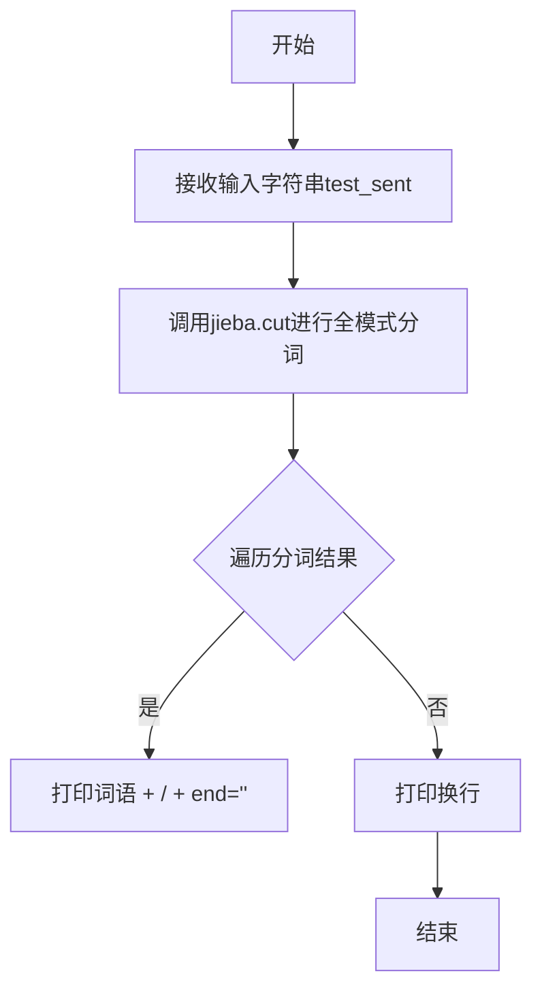

# `jieba\test\test_cutall.py` 详细设计文档

该代码是一个使用jieba库进行中文分词的测试脚本，通过cuttest函数对多个中文句子进行全模式分词，并动态添加自定义词汇以演示分词效果。

## 整体流程

```mermaid
graph TD
    A[程序启动] --> B[添加自定义词汇: jieba.add_word('超敏C反应蛋白')]
B --> C{循环调用cuttest函数}
C --> D[cuttest: 调用jieba.cut进行分词]
D --> E[打印分词结果]
C --> F[结束]
```

## 类结构

```
模块: jieba_test.py
└── 函数: cuttest
```

## 全局变量及字段


### `sys`
    
Python标准库中的系统模块，用于操作Python解释器

类型：`module`
    


### `jieba`
    
优秀的中文分词第三方库，支持多种分词模式

类型：`module`
    


### `cuttest`
    
用于测试jieba分词功能的函数，接受字符串参数并输出全模式分词结果

类型：`function`
    


    

## 全局函数及方法


### `cuttest`

该函数是jieba中文分词库的演示函数，接收一个中文句子作为输入，使用jieba库的cut方法进行全模式（cut_all=True）中文分词，并将分词结果以"/"分隔符的形式逐词打印输出。

参数：

- `test_sent`：`str`，要进行中文分词的输入句子

返回值：`None`，该函数无返回值，仅通过print输出分词结果

#### 流程图



#### 带注释源码

```python
# 定义一个测试函数，用于演示jieba中文分词的全模式分词效果
def cuttest(test_sent):
    # 调用jieba的cut方法进行全模式分词
    # cut_all=True表示全模式分词，会尽可能多地匹配词组
    # 例如"中华人民共和国"会分词为"中华/中华人民/华人/人民/人民共和国/共和国"等
    result = jieba.cut(test_sent, cut_all=True)
    
    # 遍历分词结果，逐个打印
    # 每个词语后面加上" / "分隔符，end=''表示不换行
    for word in result:
        print(word, "/", end=' ') 
    
    # 打印换行符，结束当前句子的分词输出
    print("")
```

#### 关键组件信息

| 组件名称 | 一句话描述 |
|---------|-----------|
| jieba.cut | jieba库的中文分词核心函数，支持全模式和精确模式 |
| sys.path.append("../") | 将上级目录添加到Python路径，以便导入同级的jieba模块 |

#### 潜在的技术债务或优化空间

1. **硬编码的分词模式**：当前使用`cut_all=True`全模式分词，全模式会产生过多冗余词汇，对于实际应用场景可能需要考虑使用精确模式（cut_all=False）或搜索模式（cut_for_search）

2. **缺乏错误处理**：函数未对输入进行校验，如空字符串、None值或非字符串类型的输入可能导致异常

3. **输出方式限制**：使用print直接输出，缺乏灵活性，无法将结果返回给调用者进行进一步处理

4. **功能单一**：仅作为演示函数存在，未封装为可复用的工具类或模块

#### 其它项目

**设计目标与约束**：
- 主要用于演示jieba库的全模式分词功能
- 适用于中文分词算法的测试和演示场景

**错误处理与异常设计**：
- 未实现异常处理机制
- 建议增加对输入类型的检查（是否为字符串）
- 建议增加对空字符串的特殊处理

**数据流与状态机**：
- 输入：字符串类型的句子
- 处理：调用jieba.cut进行中文分词
- 输出：标准输出打印分词结果

**外部依赖与接口契约**：
- 依赖jieba库（中文分词第三方库）
- 依赖Python 2/3兼容的print函数（通过from __future__ import print_function实现兼容）


## 关键组件


### jieba中文分词引擎

这是一个基于jieba库的中文分词测试脚本，通过全模式分词对各类中文文本进行分词处理，并支持动态添加自定义词汇。

### 文件运行流程

1. 脚本初始化时设置Python路径，将上级目录添加到sys.path
2. 导入jieba分词库
3. 定义cuttest函数用于测试分词效果
4. 在主程序中调用cuttest函数多次，测试不同类型的中文句子
5. 使用jieba.add_word添加自定义词汇后继续测试

### 全局函数

#### cuttest

- **参数**: test_sent (str) - 待分词的中文句子
- **参数类型**: str
- **参数描述**: 需要进行中文分词处理的输入文本
- **返回值类型**: None
- **返回值描述**: 该函数直接打印分词结果，不返回任何值
- **功能描述**: 使用jieba的全模式(cut_all=True)对句子进行分词，并将分词结果以"/"分隔打印输出

#### jieba.add_word

- **参数**: word (str) - 要添加的词语
- **参数类型**: str
- **参数描述**: 自定义词典中需要添加的新词汇
- **返回值类型**: None
- **返回值描述**: 无返回值，用于向jieba词典添加新词

### 关键组件信息

#### jieba分词库

中文分词核心引擎，支持全模式、精确模式、搜索引擎模式等多种分词模式

#### jieba.cut()

分词函数，cut_all=True参数启用全模式分词，返回分词结果的迭代器

#### 自定义词汇添加机制

通过jieba.add_word()函数动态向词典添加新词汇，确保新词被正确识别

### 潜在技术债务或优化空间

1. 缺少分词结果准确性验证机制
2. 测试用例缺乏预期输出对比，无法自动评估分词质量
3. 硬编码的测试句子缺乏组织，可考虑使用测试框架管理
4. 没有错误处理机制，如空字符串、特殊字符等边界情况
5. cut_all=True的全模式可能产生过多冗余分词结果

### 其它项目

#### 设计目标与约束

- 目标：验证jieba库的中文分词能力
- 约束：仅使用全模式分词，输出格式固定

#### 错误处理与异常设计

- 缺乏异常捕获机制
- 对空字符串输入未做特殊处理
- 未处理文件编码潜在问题（虽然已设置utf-8）

#### 数据流与状态机

- 数据流：测试句子输入 → jieba分词引擎处理 → 分词结果输出
- 状态机：无状态设计，每次调用独立处理

#### 外部依赖与接口契约

- 依赖：jieba分词库（第三方库）
- 接口契约：jieba.cut()返回可迭代对象，jieba.add_word()接受字符串参数


## 问题及建议


### 已知问题

- **sys.path相对路径依赖**：使用`sys.path.append("../")`添加路径，依赖于脚本执行的工作目录，环境不同可能导致导入失败
- **无错误处理机制**：脚本未对jieba加载失败、输入异常等情况进行捕获和处理，可能导致程序直接崩溃
- **全模式分词滥用**：`cut_all=True`使用全模式分词，会产生大量无意义词汇，分词质量和准确性较低，不适合大多数实际应用场景
- **结果无返回值**：`cuttest`函数直接将结果打印到stdout，无法被调用方获取和处理，限制了函数的复用性
- **硬编码测试用例**：所有测试句子直接写在代码中，无法通过外部配置或参数传入，测试灵活性差
- **Python 2/3兼容性处理不完整**：虽然导入了`print_function`，但未完全清理Python 2语法痕迹（如`end=' '`是Python 3语法）
- **未使用更优分词模式**：未考虑使用精确模式或其他高级功能（如词性标注、关键词提取、TF-IDF等）
- **缺少日志和调试信息**：无法追踪分词过程和结果，不利于问题排查

### 优化建议

- 使用`os.path`构建绝对路径，或采用包导入方式管理模块依赖
- 添加try-except异常捕获，处理jieba初始化失败、空输入等边界情况
- 根据实际需求选择合适的分词模式（精确模式`cut_all=False`），或提供模式参数化
- 改为返回分词结果列表，而非直接打印，提升函数通用性
- 将测试用例移至配置文件或命令行参数，实现测试数据与代码解耦
- 移除Python 2兼容代码（`from __future__ import`），统一使用Python 3
- 考虑集成jieba的完整功能，如词性标注、关键词提取等，提升应用价值
- 添加基本的日志记录功能，便于生产环境调试和问题追踪


## 其它


### 设计目标与约束

该代码是一个中文分词功能测试脚本，主要目标是验证jieba分词库在不同场景下的分词效果。设计约束包括：1) 仅支持Python 2和Python 3兼容（通过from __future__ import print_function实现）；2) 依赖外部库jieba；3) 测试用例覆盖常见中文分词场景，包括歧义识别、新词发现、专有名词处理等。

### 错误处理与异常设计

代码未实现显式的错误处理机制。潜在异常包括：1) jieba库未安装导致的ImportError；2) 空字符串输入导致的无输出；3) 编码问题（已通过#encoding=utf-8声明）。建议添加异常捕获和输入验证逻辑。

### 数据流与状态机

数据流主要包含：输入字符串 -> jieba.cut()分词 -> 遍历结果 -> 打印输出。无复杂状态机设计，属于简单的线性处理流程。

### 外部依赖与接口契约

主要外部依赖：jieba库（中文分词引擎）。接口契约：cuttest(test_sent)函数接收字符串参数，返回打印的分词结果（None返回值）。

### 性能特征与资源消耗

代码主要用于功能验证，未做性能优化。jieba.cut()方法的时间复杂度与输入字符串长度成正比，空间复杂度与分词结果数量相关。测试用例数量较多（50+条），可考虑批量测试优化。

### 编码规范与代码风格

代码采用Python 2/3兼容写法，使用UTF-8编码。命名规范遵循Python惯例（snake_case），但测试函数命名使用camelCase（cuttest）不够规范。缺少文档字符串和类型注解。

### 扩展性与可维护性

代码扩展性较差：1) 硬编码测试用例不易维护；2) 未提供配置接口；3) 输出格式固定。建议将测试用例配置化，支持自定义分词模式和输出格式。

### 安全考虑

代码无用户输入处理，不涉及安全敏感操作。但测试用例包含外部输入（如微博文本），实际应用中需考虑XSS等防护。

### 测试覆盖与质量保证

当前代码即为测试本身，覆盖了基本功能场景。但缺少：1) 单元测试；2) 边界条件测试；3) 性能基准测试；4) 预期结果对比验证。

### 部署与运维指引

部署要求：1) Python 2.7+ 或 Python 3.x；2) 安装jieba库（pip install jieba）；3) 工作目录包含jieba库及其词典文件。无需额外配置，脚本可独立运行。

    