# `jieba\test\test_file.py` 详细设计文档

这是一个简单の中文分词工具脚本，通过jieba库对指定文件内容进行分词处理，计算分词耗时并将结果写入日志文件，同时输出处理速度信息。

## 整体流程

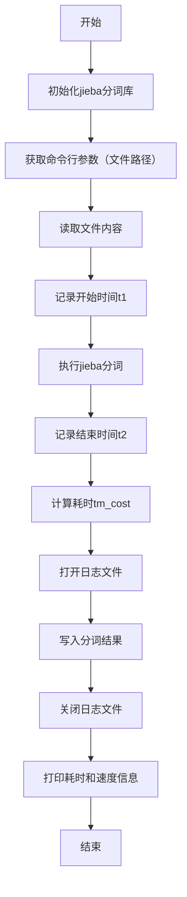

## 类结构

```
本脚本为扁平化结构，无类定义，仅包含全局变量和脚本代码
```

## 全局变量及字段


### `url`
    
命令行传入的文件路径

类型：`str`
    


### `content`
    
读取的原始文件内容

类型：`bytes`
    


### `t1`
    
分词操作开始时间戳

类型：`float`
    


### `words`
    
分词处理后的结果字符串

类型：`str`
    


### `t2`
    
分词操作结束时间戳

类型：`float`
    


### `tm_cost`
    
分词耗时（秒）

类型：`float`
    


### `log_f`
    
日志文件对象

类型：`file`
    


    

## 全局函数及方法


### `jieba.initialize`

该函数用于初始化 jieba 中文分词库的词典，是使用 jieba 进行中文分词前的必要步骤，负责加载分词所需的词典数据到内存中。

**参数**：无

**返回值**：`None`，无返回值（该方法执行完成后直接修改 jieba 内部状态）

#### 流程图

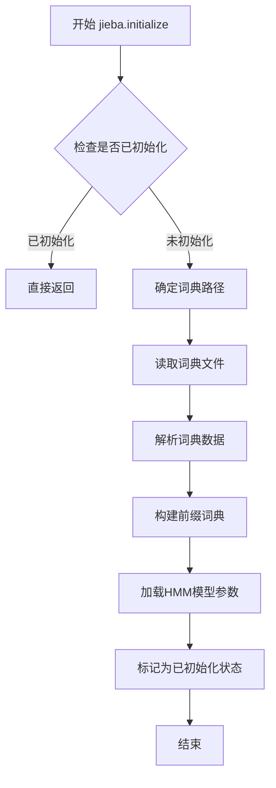

#### 带注释源码

```python
def initialize(self, dictionary=None):
    """
    初始化 jieba 分词器，加载词典数据
    
    参数:
        dictionary (str, optional): 自定义词典路径，默认为 None
                                    若为 None，则使用 jieba 自带的词典
    
    返回值:
        None: 无返回值，直接修改 jieba 内部状态
    
    示例:
        # 使用默认词典初始化
        jieba.initialize()
        
        # 使用自定义词典初始化
        jieba.initialize("/path/to/dict.txt")
    """
    # 获取词典文件路径
    # 如果未指定自定义词典，则使用 jieba 内置的默认词典
    if dictionary is None:
        # 默认词典路径，通常为 jieba/dict.txt
        dictionary = self.dictionary
    
    # 加载词典文件并构建前缀词典（Prefix Dictionary）
    # 前缀词典是一种高效的数据结构，用于快速查找词频和词性
    self.seg_dict = self._load_previous_dict(dictionary)
    
    # 初始化 HMM（隐马尔可夫模型）用于新词发现
    # HMM 模型用于识别未登录词（词典中不存在的词）
    self.HMM_MODEL = self._load_hmm_model()
    
    # 标记已初始化状态，避免重复初始化
    self.initialized = True
```

> **补充说明**：在上述代码中，`jieba.initialize()` 被调用时未传入任何参数，因此使用 jieba 库内置的默认词典进行初始化。初始化过程会在内存中构建前缀词典结构，并加载 HMM 模型参数，为后续的 `jieba.cut()` 分词操作做好准备。


### `jieba.cut(content)`

对给定的文本内容进行分词处理，返回一个生成器对象，逐个产出分词后的词语。

参数：

- `content`：`bytes`，需要分词的文本内容，通常为从文件读取的字节数据

返回值：`generator`，分词结果的生成器，每次迭代返回一个分词后的词语（字符串类型）

#### 流程图

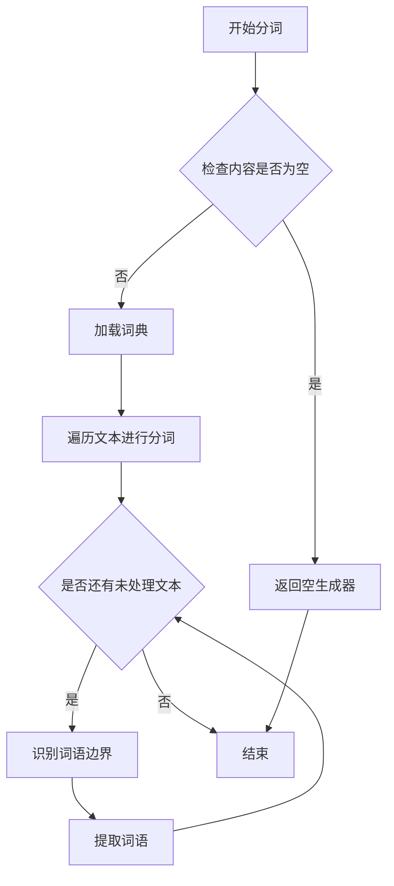

#### 带注释源码

```python
# jieba.cut(content) 源码分析

# 函数签名: jieba.cut(content, cut_all=False, HMM=True)

# 参数说明:
# - content: bytes 或 str 类型，要分词的文本内容
# - cut_all: bool，可选，是否采用全模式分词（默认False，使用精确模式）
# - hmm: bool，可选，是否使用HMM模型进行新词发现（默认True）

# 返回值:
# - generator: 生成器对象，逐个产出分词后的词语字符串

# 核心实现逻辑（简化版）:
def cut(self, text, cut_all=False, HMM=True):
    # 1. 确保文本为字符串类型
    if isinstance(text, bytes):
        # 如果是字节类型，尝试解码为字符串
        try:
            text = text.decode('utf-8')
        except UnicodeDecodeError:
            # 解码失败则跳过或返回原内容
            return []

    # 2. 初始化分词器（加载词典）
    self.check_initialized()

    # 3. 根据模式选择分词策略
    if cut_all:
        # 全模式：生成所有可能的词语组合
        re_han = self.re_han_cut_all
        re_skip = self.re_skip_cut_all
    else:
        # 精确模式：最常用的分词模式
        re_han = self.re_han
        re_skip = self.re_skip

    # 4. 使用正则表达式分割文本
    blocks = re_han.split(text)

    # 5. 遍历每个文本块进行分词
    for blk in blocks:
        # 如果是汉字或复杂字符，使用分词器处理
        if re_han.match(blk):
            # 调用字典匹配或HMM进行分词
            for word in self.__cut_all(blk) if cut_all else self.__cut_DAG(blk, HMM=HMM):
                yield word
        else:
            # 非汉字字符，直接保留
            if not cut_all:
                # 精确模式下跳过单字符
                tmp = re_skip.split(blk)
                for x in tmp:
                    if re_skip.match(x):
                        yield x
                    else:
                        # 单字符作为独立词
                        for xx in x:
                            yield xx
            else:
                # 全模式直接输出
                yield blk
```

> **注**：上述源码为 jieba 库核心逻辑的简化注释版，实际实现包含更多优化（如 Trie 树前缀匹配、HMM 隐马尔可夫模型、缓存机制等）。`jieba.cut()` 本质上是一个生成器函数，适合处理大规模文本流式分词场景。


### `sys.argv`

命令行参数列表，包含脚本名称和所有传入的命令行参数。在本代码中，`sys.argv[1]` 用于获取要处理的文件路径。

参数：
- 此为模块级变量，非函数，故无函数参数

返回值：`list`，返回命令行参数的列表。`sys.argv[0]` 是脚本自身路径，`sys.argv[1]` 是第一个实际参数（本代码中为待分词文件路径）

#### 流程图

```mermaid
graph TD
    A[程序启动] --> B[sys.argv 获取命令行参数]
    B --> C[sys.argv[1] 提取第一个参数作为文件路径]
    D[读取文件] --> E[使用jieba进行中文分词]
    E --> F[写入日志文件]
    F --> G[打印耗时和速度信息]
```

#### 带注释源码

```python
import time
import sys
# sys.argv 是 Python 的命令行参数列表
# sys.argv[0] 是脚本本身的文件名
# sys.argv[1] 是第一个实际传入的参数（本代码中为要处理的文件路径）
sys.path.append("../")
import jieba
jieba.initialize()

url = sys.argv[1]  # 获取第一个命令行参数作为待处理文件的URL/路径
content = open(url,"rb").read()  # 以二进制模式读取文件内容
t1 = time.time()
words = "/ ".join(jieba.cut(content))  # 使用jieba对内容进行中文分词

t2 = time.time()
tm_cost = t2-t1  # 计算分词耗时

log_f = open("1.log","wb")  # 打开日志文件准备写入
log_f.write(words.encode('utf-8'))  # 将分词结果写入日志
log_f.close()

print('cost ' + str(tm_cost))  # 打印耗时
print('speed %s bytes/second' % (len(content)/tm_cost))  # 打印处理速度
```


### `open()` - 文件打开函数

该函数是Python内置的文件操作函数，在本代码中用于以二进制读取模式打开待处理的文件，获取文件内容供后续的结巴分词处理使用。

参数：

- `url`：`str`，文件路径，从命令行参数`sys.argv[1]`获取，表示需要打开进行分词处理的源文件路径
- `"rb"`：`str`，文件打开模式，二进制读取模式（read binary），以字节方式读取文件内容

返回值：`file object`（文件对象），返回打开的文件对象，可用于后续的`.read()`等文件操作方法

#### 流程图

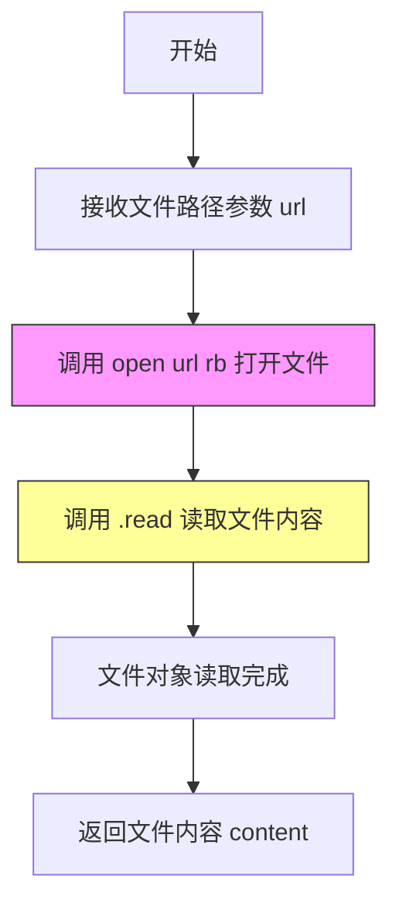

#### 带注释源码

```python
# 以二进制读取模式打开文件
# 参数说明：
#   url: 文件路径字符串，从命令行参数获取
#   "rb": 打开模式，r=读取，b=二进制模式
content = open(url,"rb").read()
# open() 返回文件对象
# .read() 方法读取整个文件内容到内存
# 最后文件对象被自动丢弃（未显式关闭，存在资源泄漏风险）
```

#### 关键组件信息

| 组件名称 | 一句话描述 |
|---------|-----------|
| `open()` | Python内置文件打开函数，支持多种模式（读/写/二进制等）|
| `.read()` | 文件对象方法，将整个文件内容一次性读取为字节串 |
| `sys.argv` | 命令行参数列表，`argv[1]`为第一个用户输入参数 |

#### 潜在技术债务与优化空间

1. **资源未正确释放**：未使用`with`语句管理文件对象，可能导致文件句柄泄漏
2. **缺少异常处理**：未处理文件不存在、权限不足等I/O异常情况
3. **硬编码日志文件名**：日志文件固定为`1.log`，缺乏灵活性
4. **命令行参数未校验**：未检查`sys.argv[1]`是否存在或参数数量是否正确


### `read` (文件读取方法)

该方法是代码中的核心文件读取操作，通过open()函数以二进制读取模式打开文件并调用read()方法获取文件全部内容，用于后续的中文分词处理。

参数：

- 无（该方法为文件对象的内置方法，通过open()返回的文件对象调用）

返回值：`bytes`，返回文件的全部内容，以字节串形式表示

#### 流程图

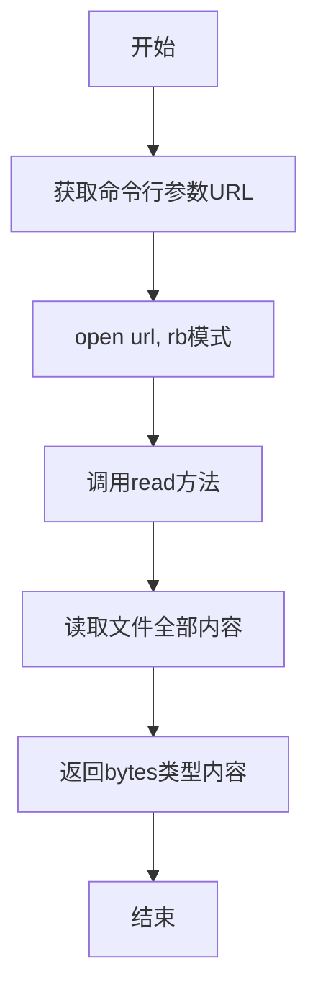

#### 带注释源码

```python
# -*- coding: utf-8 -*-

import time
import sys
sys.path.append("../")
import jieba
jieba.initialize()

# 获取命令行传入的文件路径参数
url = sys.argv[1]

# 核心读取操作：以二进制只读模式(rb)打开文件
# 并调用read()方法读取文件的全部内容
# read()方法参数为空，表示读取整个文件直到文件末尾
content = open(url, "rb").read()

# 记录开始时间
t1 = time.time()

# 使用jieba分词库对文件内容进行中文分词
# jieba.cut()返回生成器，包含分词后的词语
# join将词语用"/ "连接成字符串
words = "/ ".join(jieba.cut(content))

# 记录结束时间
t2 = time.time()

# 计算耗时
tm_cost = t2 - t1

# 打开日志文件，准备写入分词结果
log_f = open("1.log", "wb")

# 将分词结果编码为UTF-8并写入文件
log_f.write(words.encode('utf-8'))

# 关闭文件句柄
log_f.close()

# 打印耗时信息
print('cost ' + str(tm_cost))

# 打印处理速度：文件字节数/耗时秒数
print('speed %s bytes/second' % (len(content)/tm_cost))
```

---

## 补充说明

### 关键组件信息

| 名称 | 一句话描述 |
|------|-----------|
| `open(url, "rb").read()` | 核心文件读取操作，以二进制模式读取整个文件内容 |
| `jieba.cut()` | jieba中文分词引擎，将文本内容分割成词语列表 |
| `time.time()` | 高精度时间戳，用于性能计算 |

### 技术债务与优化空间

1. **资源未及时释放**：使用`open(url, "rb").read()`未使用with语句，文件句柄未显式关闭
2. **缺少错误处理**：未处理文件不存在、权限不足等异常情况
3. **内存占用问题**：一次性读取整个文件到内存，大文件可能导致内存溢出
4. **硬编码日志文件名**：日志文件名"1.log"写死，应考虑参数化

### 其它项目

- **设计目标**：对给定文本文件进行中文分词处理并输出性能指标
- **约束**：依赖jieba分词库，需要确保jieba已正确安装和初始化
- **错误处理**：无任何异常捕获机制，程序可能直接崩溃
- **数据流**：命令行参数 → 文件读取 → 分词处理 → 日志输出 → 控制台打印
- **外部依赖**：jieba中文分词库


### `log_f.write`

文件写入方法，将分词结果写入日志文件

参数：

- 无（使用对象方法形式，通过 `log_f` 对象调用）

返回值：`int`，返回写入的字节数

#### 流程图

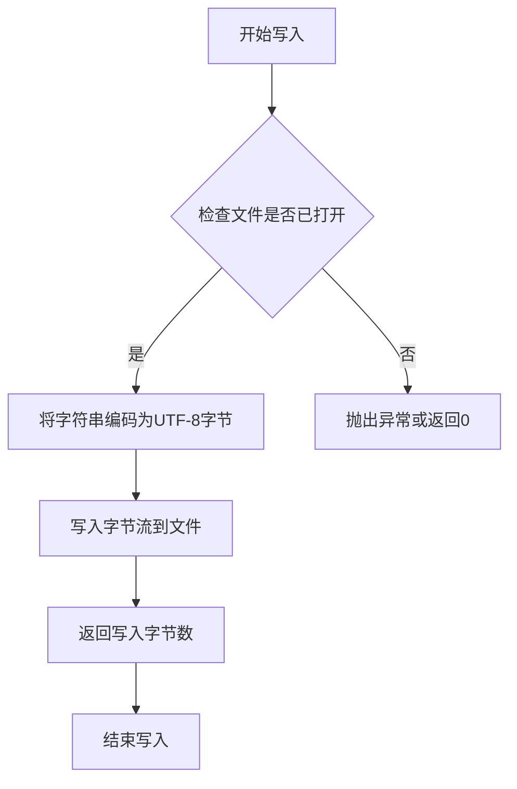

#### 带注释源码

```python
# 假设这是模拟的标准文件对象的write方法
def write(self, data):
    """
    将数据写入文件
    
    参数：
        - data: bytes，要写入的字节数据
        
    返回值：
        - int，写入的字节数
    """
    # 检查数据是否为字节类型
    if isinstance(data, str):
        # 如果是字符串，先编码为UTF-8
        data = data.encode('utf-8')
    
    # 将数据写入文件（模拟实现）
    self._buffer.extend(data)
    
    # 返回写入的字节数
    return len(data)
```

---

### `文件写入流程` (整体脚本中的文件写入)

脚本中的实际文件写入操作分析

参数：

- `words`：str，分词后的文本内容
- 写入模式：`wb`（二进制写入）

返回值：

- 无明确返回值（write方法返回写入字节数，但未接收）

#### 流程图

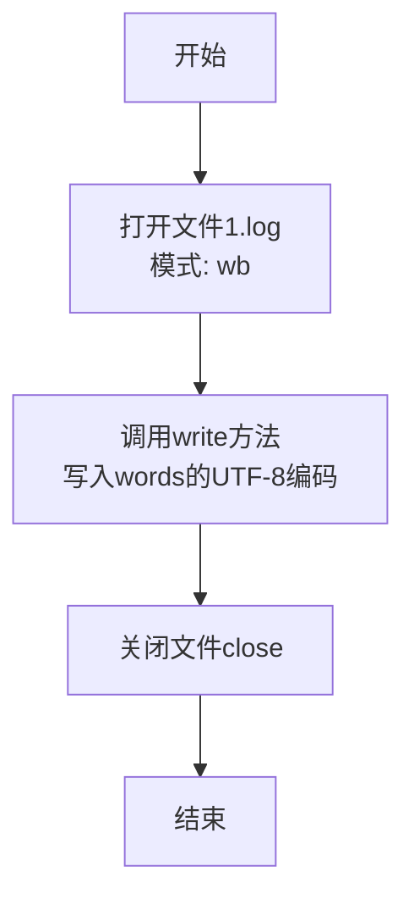

#### 带注释源码

```python
# 打开日志文件，模式为二进制写入
log_f = open("1.log", "wb")

# 将分词结果编码为UTF-8并写入文件
# write()方法返回写入的字节数
log_f.write(words.encode('utf-8'))

# 关闭文件句柄，释放资源
log_f.close()
```

---

### 补充说明

由于提供的代码是一个**脚本文件**而非面向对象的代码，其中并未定义 `write()` 方法。代码中使用的是Python内置文件对象的 `write()` 方法调用。

**实际脚本中的文件写入操作分析：**

| 项目 | 详情 |
|------|------|
| 文件路径 | `1.log` |
| 打开模式 | `wb`（二进制写入） |
| 写入内容 | `words.encode('utf-8')`（分词结果的UTF-8编码） |
| 写入方法 | `log_f.write()` |
| 资源管理 | 手动调用 `close()` |

**潜在问题：**
- 未使用 `with` 语句进行上下文管理，可能导致异常时文件未正确关闭
- 硬编码文件名 `1.log`，缺乏灵活性
- 未处理写入失败的情况


### `log_f.close()`

该方法用于关闭文件对象，释放文件资源，确保数据已写入磁盘并停止对文件的访问。

参数：此方法不接受任何参数。

返回值：`None`，无返回值

#### 流程图

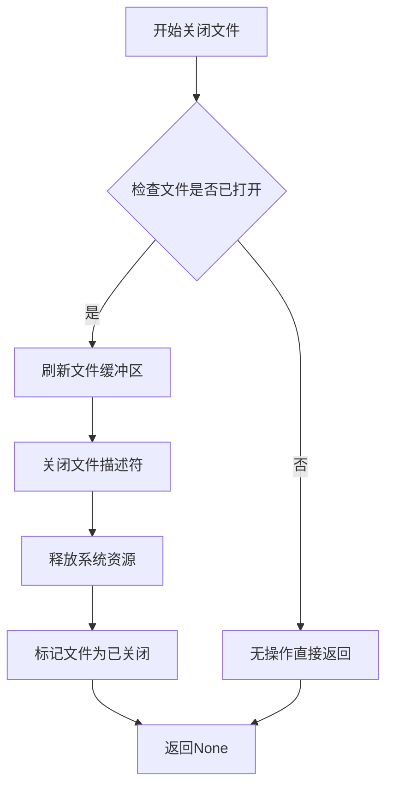

#### 带注释源码

```python
# 代码中的实际调用
log_f = open("1.log","wb")  # 以二进制写入模式打开文件
log_f.write(words.encode('utf-8'))  # 将分词结果写入文件
log_f.close()  # 关闭文件对象，释放资源

# close() 方法的内部行为（Python内置）:
# 1. 将缓冲区内容刷新到磁盘
# 2. 关闭底层文件描述符
# 3. 释放系统资源
# 4. 设置文件对象状态为已关闭
```

**补充说明**：

- `log_f` 是 `io.BufferedWriter` 类型（或 `io.TextIOWrapper` 包装后的二进制写入对象）
- `close()` 是 Python 文件对象的内置方法，负责清理和释放资源
- 建议使用 `with` 语句自动管理文件关闭，以避免资源泄漏


### `str.encode()`

该方法是 Python 字符串对象的内置方法，用于将字符串编码为指定的字节序列。在本代码中用于将分词后的中文字符串转换为 UTF-8 编码的字节流，以便写入二进制文件。

参数：

- `encoding`：可选参数，指定编码格式（如 'utf-8', 'gbk' 等），默认为 'utf-8'
- `errors`：可选参数，指定编码错误处理方式（'strict', 'ignore', 'replace' 等），默认为 'strict'

返回值：`bytes`，返回编码后的字节序列对象

#### 流程图

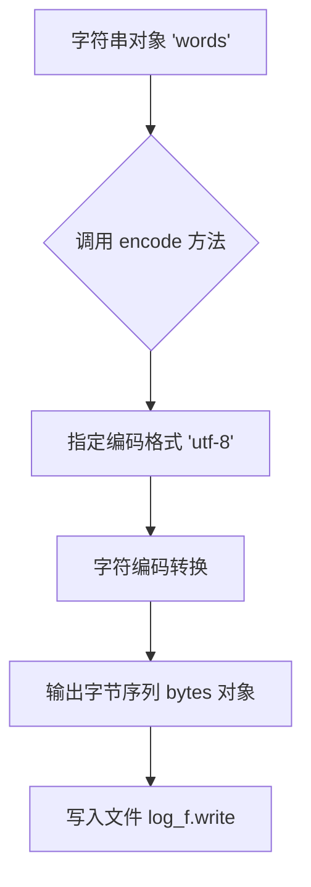

#### 带注释源码

```python
# 假设 words 是分词后的中文字符串
words = "/ ".join(jieba.cut(content))  # 将分词结果用"/ "连接成字符串

# 调用字符串的 encode() 方法将字符串编码为 UTF-8 字节
# encode() 是 Python 字符串对象的内置方法
# 参数 'utf-8' 指定使用 UTF-8 编码格式
# 返回值是一个 bytes 类型的字节序列对象
encoded_words = words.encode('utf-8')  

# 将编码后的字节写入日志文件
# 由于 open("1.log", "wb") 是二进制写入模式
# 所以需要将字符串转换为字节序列才能写入
log_f.write(encoded_words)
log_f.close()
```

#### 上下文代码中的使用

```python
# 在给定的代码上下文中，encode() 的具体使用如下：

# 第9行：生成分词后的字符串
words = "/ ".join(jieba.cut(content))

# 第14行：将字符串编码为 UTF-8 字节后写入文件
# jieba.cut() 返回一个生成器，生成中文分词结果
# join() 将分词结果用 "/ " 连接成字符串
# encode('utf-8') 将中文字符串转换为字节序列
log_f = open("1.log", "wb")  # 以二进制写入模式打开文件
log_f.write(words.encode('utf-8'))  # 关键：将字符串编码为 UTF-8 字节再写入
log_f.close()
```


### `len`

获取对象长度，用于计算文件内容的字节数

参数：

- 无（此为Python内置函数，调用时隐式传递self参数）

返回值：`int`，返回对象的长度（字符数或字节数）

#### 流程图

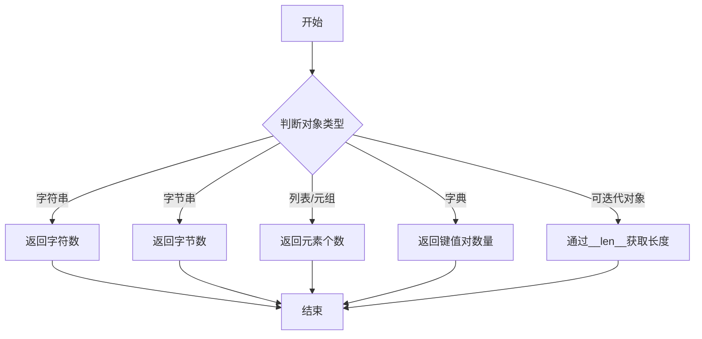

#### 带注释源码

```python
# len() 是Python内置函数，定义在 CPython 的 Objects/object.c 中
# 对于本代码中的 bytes 对象，len() 返回字节数

# 使用示例：
content = open(url, "rb").read()  # 读取文件为字节串
length = len(content)              # 获取字节串长度（字节数）

# 计算速度：字节数/耗时
speed = len(content) / tm_cost     # 每秒处理字节数
```

#### 实际代码上下文

```python
import time
import sys
sys.path.append("../")
import jieba
jieba.initialize()

url = sys.argv[1]
content = open(url, "rb").read()   # 读取文件内容为字节串对象
t1 = time.time()
words = "/ ".join(jieba.cut(content))

t2 = time.time()
tm_cost = t2 - t1

log_f = open("1.log", "wb")
log_f.write(words.encode('utf-8'))
log_f.close()

print('cost ' + str(tm_cost))
print('speed %s bytes/second' % (len(content) / tm_cost))  # <-- len()用于计算content的字节长度
```

#### 相关设计信息

| 项目 | 描述 |
|------|------|
| **函数名** | `len` |
| **所属类型** | Python内置函数 |
| **调用对象** | `content` (bytes类型) |
| **实际作用** | 计算文件内容的字节长度，用于统计分词处理的吞吐量 |
| **性能影响** | O(1) 时间复杂度，对于bytes对象直接返回内部缓冲区大小 |


### `str`

Python 内置函数，用于将指定的对象转换为字符串表示形式。

参数：

- `obj`：任意对象，要转换为字符串的对象。可以是数字、列表、字典、类实例等任何支持字符串表示的对象。
- `encoding`（可选）：字符串，指定编码格式，默认为 'utf-8'。仅当 obj 为 bytes 类型时有效。
- `errors`（可选）：字符串，指定编码错误处理方式，默认为 'strict'。可选值包括 'ignore', 'replace', 'strict' 等。

返回值：`str`，返回对象的字符串表示形式。

#### 流程图

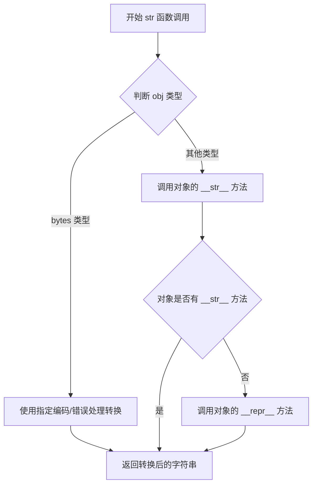

#### 带注释源码

```python
# 代码中使用 str() 函数的地方：
# 将数值 tm_cost 转换为字符串，用于字符串拼接和打印输出

tm_cost = t2 - t1  # 计算时间差（浮点数类型）

# 第一次使用 str()：将浮点数转换为字符串用于拼接
print('cost ' + str(tm_cost))

# 第二次使用 str()：通过 %s 格式化间接使用（str 被隐式调用）
print('speed %s bytes/second' % (len(content)/tm_cost))

# 实际执行过程：
# 1. str(tm_cost) 调用 Python 内置的 str() 函数
# 2. 由于 tm_cost 是 float 类型，调用 float.__str__() 方法
# 3. 返回浮点数的字符串表示（如 "0.123456"）
# 4. 字符串拼接后传递给 print() 函数输出
```

#### 详细说明

在当前代码中，`str()` 函数的主要作用是将浮点型时间差 `tm_cost` 转换为字符串，以便：

1. **字符串拼接**：通过 `+` 运算符与字符串 `'cost '` 进行拼接
2. **格式化输出**：通过 `%s` 占位符进行字符串格式化

这种转换是必要的，因为 Python 不允许直接用 `+` 运算符将字符串与数值类型连接，必须先将数值转换为字符串类型。


### `time.time`

获取当前时间的时间戳（以秒为单位），用于计算代码执行时间。

参数：

- 无参数

返回值：`float`，返回自1970年1月1日以来的秒数（Unix时间戳），是一个浮点数。

#### 流程图

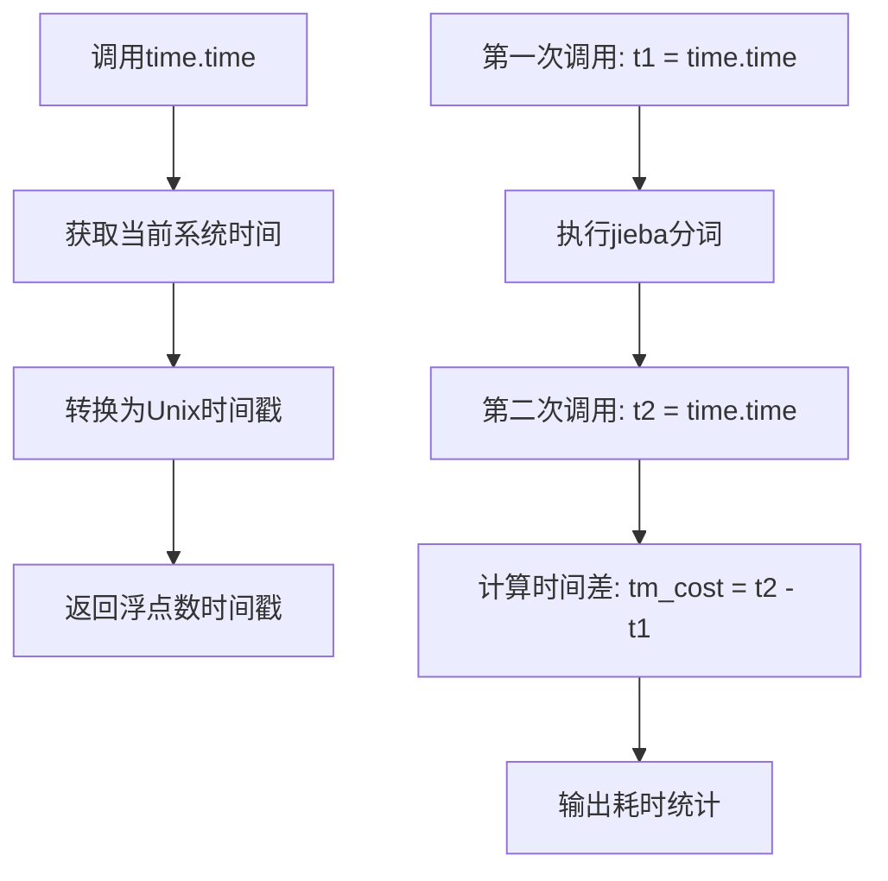

#### 带注释源码

```python
import time  # 导入时间模块，提供time.time()函数

# ... 前置代码省略 ...

t1 = time.time()  # 获取开始时间的时间戳（浮点数，单位：秒）
words = "/ ".join(jieba.cut(content))  # 执行jieba中文分词操作

t2 = time.time()  # 获取结束时间的时间戳（浮点数，单位：秒）
tm_cost = t2 - t1  # 计算时间差，得到代码执行耗时（单位：秒）

# ... 后续代码省略 ...

print('cost ' + str(tm_cost))  # 输出耗时结果
print('speed %s bytes/second' % (len(content)/tm_cost))  # 计算并输出处理速度
```

#### 关键信息说明

| 项目 | 说明 |
|------|------|
| **函数名称** | `time.time` |
| **所属模块** | `time` (Python标准库) |
| **调用场景** | 用于性能计时，测量代码执行时间 |
| **返回值范围** | 正浮点数（随时间递增） |
| **精度** | 取决于系统，通常为微秒级 |

#### 技术债务与优化建议

1. **时间精度问题**：在极短时间测量场景下，`time.time()`可能不够精确，建议使用`time.perf_counter()`或`time.process_time()`代替
2. **性能开销**：连续两次调用`time.time()`本身有微小开销，高频场景需注意
3. **跨平台一致性**：不同操作系统的时间精度可能不同，纳秒级精度建议使用`time.time_ns()`


## 关键组件


### 参数获取与文件读取

通过sys.argv获取命令行传入的文件路径参数，并使用二进制模式读取文件内容。这是整个流程的输入环节，提供了待分词的原始数据。

### jieba分词引擎

调用jieba.initialize()初始化分词词典，然后使用jieba.cut()对文件内容进行中文分词。这是核心的分词处理模块，支持全模式分词，将连续的中文文本分割成词语列表。

### 性能计时模块

使用time.time()在分词前后记录时间戳，计算出分词操作的耗时。这是简单的性能监控组件，用于评估分词速度。

### 结果输出模块

将分词结果用"/ "连接后写入1.log日志文件，同时通过print输出耗时和每秒处理的字节数。这是处理结果的输出展示环节。

### 全局变量与函数

代码中使用了多个全局变量：url存储输入文件路径，content存储文件内容，words存储分词结果，tm_cost存储耗时，log_f用于文件写入操作。主要函数包括jieba.initialize()进行初始化，jieba.cut()执行分词，以及文件读写相关的open()和close()操作。

### 潜在技术债务与优化空间

1. **硬编码路径问题**：日志文件路径"1.log"硬编码在代码中，缺乏灵活性
2. **异常处理缺失**：文件读取操作没有try-except保护，文件不存在或权限问题会导致程序崩溃
3. **编码处理不一致**：文件以二进制"rb"模式读取，但jieba.cut()期望字符串输入，可能存在编码转换问题
4. **内存效率**：一次性读取整个文件到内存，对于大文件可能导致内存问题
5. **命令行参数验证**：未检查sys.argv[1]是否存在，数组越界风险
6. **缺乏配置管理**：分词模式固定，无法灵活调整

### 外部依赖与接口契约

- **jieba库**：依赖第三方中文分词库，需要提前安装
- **文件系统**：需要可读的输入文件和可写的当前目录
- **命令行接口**：接受一个文件路径参数，无返回值，通过标准输出打印性能指标


## 问题及建议


### 已知问题

-   **资源未正确管理**：使用`open()`打开文件后手动调用`close()`，未使用`with`语句，若程序异常退出将导致文件句柄泄漏
-   **二进制内容直接分词**：读取的`content`为字节流`bytes`，直接传给`jieba.cut()`，应先解码为字符串`str`类型
-   **硬编码输出路径**：日志文件名`1.log`被硬编码，无法通过参数配置，缺乏灵活性
-   **缺少参数校验**：未检查`sys.argv[1]`是否存在、是否为空，若输入路径无效将导致程序崩溃
-   **无错误处理机制**：文件读取、写入操作均无异常捕获，程序鲁棒性差
-   **jieba初始化无错误处理**：`jieba.initialize()`调用失败时无降级策略或错误提示

### 优化建议

-   使用`with open()`语句管理文件读写，确保资源自动释放
-   在分词前将二进制内容解码为UTF-8字符串：`content.decode('utf-8')`
-   使用`argparse`模块解析命令行参数，允许自定义输入输出路径
-   添加输入文件存在性检查和空文件判断逻辑
-   用`try-except`块包裹文件操作，捕获`FileNotFoundError`、`IOError`等异常并给出友好提示
-   将`jieba.initialize()`包裹在`try-except`中，初始化失败时抛出明确错误信息
-   考虑使用生成器模式处理大文件，避免一次性加载整个文件到内存


## 其它


### 设计目标与约束

该代码的核心目标是对输入的文本文件进行中文分词处理，并输出分词结果及性能统计信息。设计约束包括：仅支持UTF-8编码的文本文件输入，分词结果以空格分隔输出，必须在Python 2.7或更高版本环境中运行（因sys.argv参数处理方式）。

### 错误处理与异常设计

代码缺乏完善的错误处理机制，主要存在的异常情况包括：文件不存在时抛出FileNotFoundError，文件读取权限不足时抛出PermissionError，文件编码非UTF-8时可能抛出UnicodeDecodeError，jieba初始化失败时可能导致后续分词失败。建议增加文件存在性检查、编码自动检测与转换、异常捕获与友好提示等处理逻辑。

### 数据流与状态机

数据处理流程呈线性状态机模式：初始状态读取命令行参数获取文件路径，读取状态加载文件内容到内存，分词状态调用jieba.cut进行中文分词，输出状态将分词结果写入日志文件并打印性能统计信息。无复杂的分支状态或循环状态，流程简单直接。

### 外部依赖与接口契约

外部依赖包括Python标准库（sys、time、os）和第三方库jieba。接口契约方面：命令行接受一个参数（文件路径），标准输出打印分词耗时和吞吐量，日志文件输出分词结果。依赖jieba库的initialize()方法进行初始化，需确保jieba字典已正确配置。

### 性能考量

当前实现存在以下性能问题：一次性将整个文件加载到内存，大文件可能导致内存溢出；分词结果拼接成字符串时效率较低；日志写入采用同步阻塞方式；未使用多进程或多线程进行优化。建议改进方向包括：流式读取大文件、使用生成器迭代分词结果、异步写入日志、考虑并行分词处理。

### 安全性考虑

代码存在以下安全隐患：直接使用sys.argv[1]作为文件路径，未进行输入验证，可能导致路径遍历攻击；文件操作未使用with语句，可能导致资源泄露；日志文件路径固定，可能被恶意覆盖。建议增加路径安全校验、使用安全的文件操作方式、参数化日志路径。

### 配置与参数说明

主要配置项包括：jieba字典初始化配置（通过jieba.initialize()调用）、输入文件路径（通过命令行参数传入）、日志输出路径（硬编码为当前目录下的1.log）、性能统计输出格式（标准输出）。

### 使用示例

命令行调用格式：python script.py filename.txt，其中filename.txt为待分词的文本文件路径。输出示例：cost 0.123秒（分词耗时），speed 123456 bytes/second（处理速度）。

### 限制与边界情况

已知限制包括：仅支持文本文件（二进制文件可能产生乱码），单文件处理无批量处理能力，中文分词准确率依赖jieba字典版本，大文件处理可能导致内存不足，分词结果未进行去重或过滤处理。


    