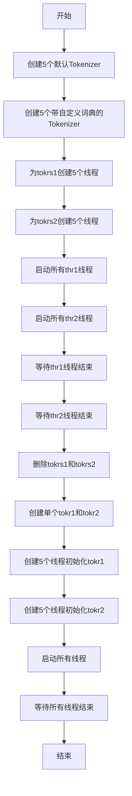

# `jieba\test\test_lock.py` 详细设计文档

该代码是一个多线程Tokenizer初始化测试程序，用于验证jieba分词库在多线程环境下的并发初始化行为，通过创建两组不同配置的Tokenizer并分别在5个线程中进行初始化来测试线程安全性。

## 整体流程



## 类结构

```
无自定义类
主要使用第三方类:
├── jieba.Tokenizer (分词器类)
└── threading.Thread (线程类)
```

## 全局变量及字段


### `tokrs1`
    
存储5个默认配置的Tokenizer实例

类型：`list`
    


### `tokrs2`
    
存储5个带自定义词典路径的Tokenizer实例

类型：`list`
    


### `thr1`
    
存储用于初始化tokrs1的线程对象

类型：`list`
    


### `thr2`
    
存储用于初始化tokrs2的线程对象

类型：`list`
    


### `tokr1`
    
单个默认配置的分词器

类型：`jieba.Tokenizer`
    


### `tokr2`
    
单个带自定义词典的分词器

类型：`jieba.Tokenizer`
    


    

## 全局函数及方法


### `inittokenizer`

该函数是一个多线程初始化函数，接收tokenizer实例和group标识作为参数，在线程执行时打印开始和结束日志，并调用tokenizer的initialize()方法完成分词器的初始化工作。

参数：

- `tokenizer`：`jieba.Tokenizer`， jieba分词器的Tokenizer实例，用于执行初始化操作
- `group`：整型或字符串， 线程组标识，用于日志输出时区分不同组的线程

返回值：`None`，该函数没有返回值，仅执行副作用操作（打印日志和初始化tokenizer）

#### 流程图

```mermaid
flowchart TD
    A[线程开始执行inittokenizer] --> B[获取当前线程ID和group标识]
    B --> C[打印线程开始日志: ===> Thread {group}:{thread_id} started]
    C --> D[调用tokenizer.initialize方法]
    D --> E[打印线程结束日志: <=== Thread {group}:{thread_id} finished]
    E --> F[函数结束]
```

#### 带注释源码

```python
#!/usr/bin/env python
# -*- coding: utf-8 -*-

import jieba
import threading

def inittokenizer(tokenizer, group):
    """
    多线程初始化tokenizer的函数
    
    参数:
        tokenizer: jieba.Tokenizer实例，用于分词初始化
        group: 线程组标识，用于日志区分
    """
    # 打印线程开始日志，包含组别和线程ID
    print('===> Thread %s:%s started' % (group, threading.current_thread().ident))
    
    # 调用tokenizer的initialize方法进行初始化
    tokenizer.initialize()
    
    # 打印线程结束日志，包含组别和线程ID
    print('<=== Thread %s:%s finished' % (group, threading.current_thread().ident))

# 创建5个默认配置的tokenizer实例
tokrs1 = [jieba.Tokenizer() for n in range(5)]
# 创建5个加载小词典的tokenizer实例
tokrs2 = [jieba.Tokenizer('../extra_dict/dict.txt.small') for n in range(5)]

# 为两组tokenizer分别创建线程
thr1 = [threading.Thread(target=inittokenizer, args=(tokr, 1)) for tokr in tokrs1]
thr2 = [threading.Thread(target=inittokenizer, args=(tokr, 2)) for tokr in tokrs2]

# 启动第一组线程
for thr in thr1:
    thr.start()
# 启动第二组线程
for thr in thr2:
    thr.start()

# 等待第一组线程全部完成
for thr in thr1:
    thr.join()
# 等待第二组线程全部完成
for thr in thr2:
    thr.join()

# 清理资源
del tokrs1, tokrs2

print('='*40)

# 创建两个共享的tokenizer实例
tokr1 = jieba.Tokenizer()
tokr2 = jieba.Tokenizer('../extra_dict/dict.txt.small')

# 为同一个tokenizer实例创建5个线程（模拟多线程初始化同一个对象）
thr1 = [threading.Thread(target=inittokenizer, args=(tokr1, 1)) for n in range(5)]
thr2 = [threading.Thread(target=inittokenizer, args=(tokr2, 2)) for n in range(5)]

# 启动所有线程
for thr in thr1:
    thr.start()
for thr in thr2:
    thr.start()

# 等待所有线程完成
for thr in thr1:
    thr.join()
for thr in thr2:
    thr.join()
```

## 关键组件


### jieba.Tokenizer类

中文分词器类，用于对中文文本进行分词处理，该代码中创建了多个实例并用于多线程初始化演示。

### inittokenizer函数

线程目标函数，接收Tokenizer实例和组号作为参数，调用initialize方法完成初始化，并打印线程开始和完成的状态信息。

### 多线程并发管理

使用threading.Thread创建两组线程（thr1和thr2），每组5个线程分别初始化不同的Tokenizer实例，演示了并发的分词器初始化过程。

### 分词器实例集合

创建了两组Tokenizer实例集合：tokrs1使用默认字典创建5个独立实例，tokrs2使用额外字典文件'dict.txt.small'创建5个独立实例，用于展示不同配置下的多线程初始化。


## 问题及建议


### 已知问题

- **线程安全问题**：代码第二部分中所有线程共享同一个`tokr1`和`tokr2`实例，多个线程同时调用`initialize()`方法可能存在竞态条件，jieba的Tokenizer在多线程共享实例时可能不是完全线程安全的
- **缺乏错误处理**：整个代码没有任何异常捕获机制，如果`tokenizer.initialize()`失败（如字典文件不存在），程序会直接崩溃
- **硬编码路径问题**：`'../extra_dict/dict.txt.small'`路径硬编码，缺乏文件存在性验证，在不同环境下可能找不到文件
- **资源清理不彻底**：使用`del`删除变量后未显式调用Tokenizer的清理方法，可能导致资源未完全释放
- **输出不规范**：使用`print`进行调试输出而非标准日志框架，无法控制日志级别，不利于生产环境
- **代码重复**：创建线程和启动/等待线程的逻辑重复出现，违反DRY原则

### 优化建议

- 对共享Tokenizer实例的并发访问使用锁机制，或者为每个线程创建独立的Tokenizer实例
- 添加try-except块捕获`initialize()`可能的异常，并给出友好提示
- 使用`os.path.exists()`验证字典文件路径后再进行初始化
- 使用`logging`模块替代print语句，设置合理的日志级别
- 将线程创建和启动逻辑封装为函数，减少代码重复
- 将字典路径、线程数量等配置提取为常量或配置文件
- 考虑使用线程池（`concurrent.futures.ThreadPoolExecutor`）管理线程生命周期

## 其它


### 设计目标与约束

本代码的核心设计目标是验证jieba分词库在多线程环境下的初始化行为，特别是测试多个独立Tokenizer实例以及共享Tokenizer实例在并发场景下的线程安全性。约束条件包括：Python版本需支持threading模块，需确保jieba库已正确安装且存在额外的词典文件`../extra_dict/dict.txt.small`，代码仅在Unix/Linux环境下能正确显示线程ID。

### 错误处理与异常设计

代码中未实现显式的错误处理机制。潜在的异常情况包括：jieba.Tokenizer初始化时词典文件路径不存在会抛出FileNotFoundError；jieba库未安装会抛出ModuleNotFoundError；线程启动失败会抛出ThreadError。建议增加异常捕获机制，对Tokenizer初始化失败、词典加载失败等情况进行优雅处理，并设置超时机制避免线程永久阻塞。

### 数据流与状态机

代码的数据流较为简单，主要涉及Tokenizer对象的创建、初始化和销毁状态。Tokenizer对象状态转换：创建态（new）→初始化态（initialized）→可使用态（active）→销毁态（destroyed）。第一部分tokrs1和tokrs2为多个独立对象并行初始化，第二部分tokr1和tokr2为共享对象由多线程顺序初始化，两种模式体现了不同的并发初始化策略。

### 外部依赖与接口契约

本代码依赖两个外部组件：jieba库（分词功能）和Python threading模块（多线程支持）。jieba.Tokenizer的initialize()方法接受可选的dictionary参数，用于加载自定义词典。接口契约要求：调用initialize()前Tokenizer处于未初始化状态，调用后进入已初始化状态；多个线程同时初始化同一个Tokenizer对象可能存在竞态条件；词典文件必须为UTF-8编码的文本文件。

### 并发模型与线程同步

代码采用典型的生产者-消费者并发模型（虽然这里生产者即消费者）。线程同步完全依赖threading.Thread的start()和join()方法，未使用任何锁机制。tokrs1/tokrs2模式中每个线程操作独立对象，无共享资源冲突；tokr1/tokr2模式中多个线程共享同一Tokenizer对象，存在潜在的竞态条件风险，但实际执行中由于Python的GIL和jieba内部实现，可能表现为串行化初始化。

### 资源管理与生命周期

Tokenizer对象通过列表推导式批量创建，通过del语句显式删除第一组对象。第二组对象在主程序结束时自动释放。资源管理策略较为简单，未实现连接池或对象缓存机制。建议对Tokenizer对象实施引用计数管理，避免词典文件的重复加载和内存浪费。

### 性能考虑与优化空间

当前实现的性能瓶颈主要包括：词典文件的重复加载（5个独立Tokenizer各加载一次）、缺乏缓存机制、无超时保护。优化方向包括：使用单例模式共享Tokenizer实例、实现词典缓存池、添加初始化超时控制、考虑使用jieba的默认全局Tokenizer以减少对象创建开销。性能指标建议监控：初始化耗时、内存占用、词典加载次数等。

### 测试策略建议

应设计的测试用例包括：单线程Tokenizer初始化测试、多线程独立Tokenizer初始化测试、多线程共享Tokenizer初始化测试、词典文件缺失时的异常处理测试、jieba库未安装时的导入测试、线程中断和超时测试。建议使用pytest框架，模拟词典文件路径不存在、权限不足等异常场景。

### 安全性考虑

代码安全性风险较低，因其仅为测试性质脚本。主要安全考量包括：词典文件路径的路径遍历攻击防护（虽然当前为相对路径）、线程创建数量的资源耗尽防护（当前硬编码为5个线程）。建议对用户输入的路径进行验证，限制最大线程数。

### 配置与部署说明

部署要求：Python 3.x环境、安装jieba库（pip install jieba）、准备词典文件../extra_dict/dict.txt.small。运行方式：直接执行脚本`python script_name.py`。无需额外配置，词典路径为相对路径，需确保工作目录正确。部署平台建议为Linux/Unix系统以获得完整的线程ID显示。


    