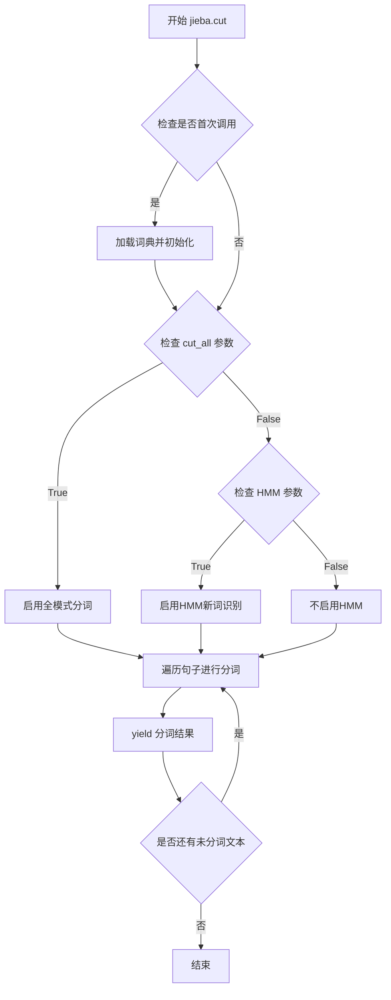
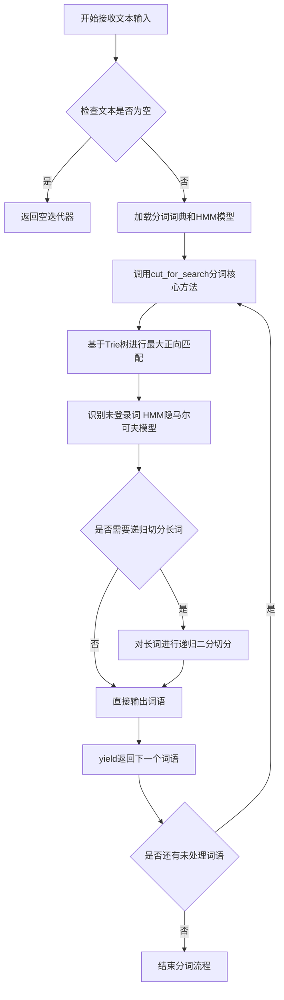
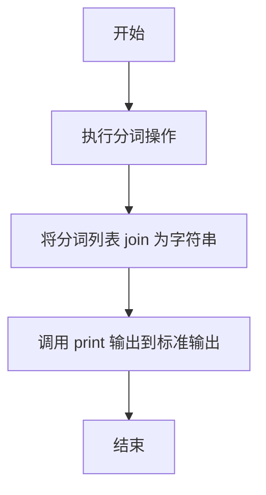
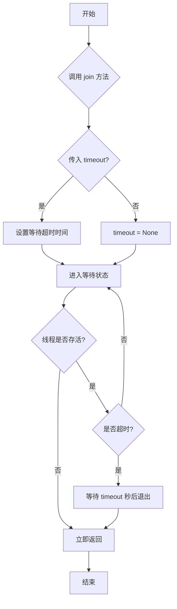
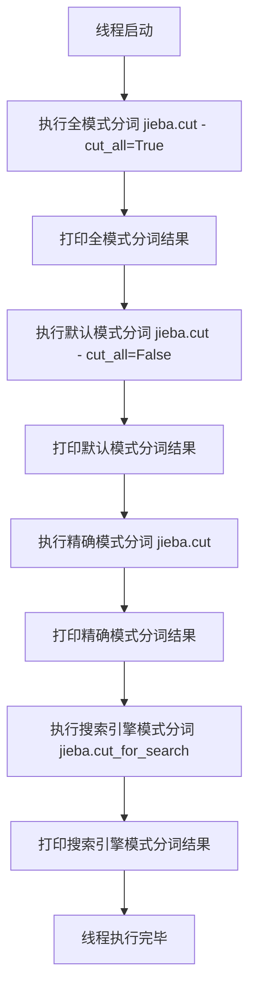

# `jieba\test\test_multithread.py` 详细设计文档

这是一个使用jieba中文分词库进行文本分词的多线程示例程序，通过创建10个工作线程并发执行全模式、默认模式、精确模式和搜索引擎模式的中文分词操作。

## 整体流程

```mermaid
graph TD
A[开始] --> B[导入模块]
B --> C[定义Worker类]
C --> D[创建10个Worker线程]
D --> E[启动所有线程]
E --> F[主线程等待所有子线程完成]
F --> G[结束]
C --> C1[run方法调用jieba分词]
C1 --> C2[全模式分词: jieba.cut(..., cut_all=True)]
C1 --> C3[默认模式分词: jieba.cut(..., cut_all=False)]
C1 --> C4[精确模式分词: jieba.cut(...)]
C1 --> C5[搜索引擎模式: jieba.cut_for_search(...)]
```

## 类结构

```
threading.Thread (基类)
└── Worker (自定义线程类)
```

## 全局变量及字段


### `workers`
    
用于存储Worker线程实例的列表，用于管理和等待所有线程完成

类型：`list`
    


### `i`
    
循环计数器，范围从0到9，用于创建10个工作线程

类型：`int`
    


### `worker`
    
Worker类的实例对象，代表一个独立的工作线程

类型：`Worker`
    


### `Worker.seg_list`
    
分词结果列表，存储jieba对中文文本进行分词后的词语集合

类型：`list`
    
    

## 全局函数及方法


### `jieba.cut`

`jieba.cut` 是 jieba 中文分词库的核心分词函数，支持精确模式和全模式两种分词方式，返回一个分词结果的生成器。

参数：

- `sentence`：`str`，需要分词的原始中文文本字符串
- `cut_all`：`bool`，可选参数，默认为 `False`。当值为 `True` 时启用全模式（所有可能的词都会被切分出来）；当值为 `False` 时启用精确模式（基于词性标注的最优分词方案）
- `HMM`：`bool`，可选参数，默认为 `True`。表示是否使用 HMM（隐马尔可夫模型）模型对新词进行识别

返回值：`Generator[str]`，分词结果生成器，产生分词后的中文词语字符串

#### 流程图



#### 带注释源码

```python
# jieba.cut 函数源码示例（基于 jieba 0.42.1 版本简化）
def cut(self, sentence, cut_all=False, HMM=True):
    """
    对句子进行分词
    
    参数:
        sentence: str, 要分词的文本
        cut_all: bool, 是否全模式分词
        HMM: bool, 是否使用HMM模型
    
    返回:
        Generator[str]: 分词结果生成器
    """
    # 确保输入是字符串
    sentence = str(sentence)
    
    # 初始化分词器（首次调用时）
    if self.initialized is False:
        self.initialize()
    
    # 根据 cut_all 参数选择分词模式
    if cut_all:
        # 全模式：返回所有可能的词
        return self.__cut_all(sentence)
    else:
        # 精确模式：使用 HMM 模型进行新词识别
        return self.__cut_DAG(sentence, HMM=HMM)

def __cut_DAG(self, sentence, HMM=True):
    """精确模式分词核心逻辑"""
    # 获取句子中所有可能的词图（Directed Acyclic Graph）
    DAG = self.get_DAG(sentence)
    
    # 动态规划计算最优分词路径
    route = {}
    self.calc(sentence, DAG, route)
    
    # 根据最优路径生成分词结果
    x = 0
    buf = ''
    while x < len(sentence):
        y = route[x][0] + 1  # 获取下一个词的结束位置
        l = sentence[x:y]    # 提取词语
        
        # 处理单个字符
        if len(l) == 1:
            buf += l
        else:
            # 输出缓冲区中的字符
            if buf:
                if len(buf) == 1:
                    yield buf
                else:
                    # 对连续单字进行HMM分词（如果启用）
                    if HMM:
                        for item in self.hmm.cut(buf):
                            yield item
                    else:
                        yield buf
                buf = ''
            yield l        # 输出完整词语
        x = y
    
    # 处理末尾缓冲区
    if buf:
        if len(buf) == 1:
            yield buf
        elif HMM:
            for item in self.hmm.cut(buf):
                yield item
        else:
            yield buf

def __cut_all(self, sentence):
    """全模式分词：返回所有可能的词"""
    # 遍历句子的每个位置
    for x in range(len(sentence)):
        # 从当前位置开始，尝试匹配所有可能的词
        for y in range(x + 1, len(sentence) + 1):
            word = sentence[x:y]
            # 检查词是否在词典中
            if word in self.FREQ:
                yield word
```


### `jieba.cut_for_search`

`jieba.cut_for_search` 是 jieba 中文分词库中的一个函数，采用搜索引擎模式对中文文本进行分词。该模式在精确模式的基础上，对长词再次进行切分，提高召回率，适用于搜索引擎构建倒排索引的场景。

参数：

-  `text`：`str`，需要进行分词的中文文本字符串

返回值：`Iterator[str]`，返回一个分词结果的迭代器（生成器），每个元素为切分后的词语（字符串类型）

#### 流程图



#### 带注释源码

```python
# jieba.cut_for_search 函数源码分析
# 该函数位于 jieba 库的切分模块中，以下为关键实现逻辑

def cut_for_search(self, text, cut_all=False):
    """
    搜索引擎模式分词函数
    
    参数:
        text: str - 输入的中文文本
        cut_all: bool - 是否使用全模式(默认False)
    
    返回:
        Iterator[str] - 分词结果迭代器
    """
    
    # 1. 参数校验：如果文本为空或只有空白字符，返回空生成器
    if not text:
        return
    
    # 2. 获取分词器实例（包含词典加载、Trie树构建等初始化）
    re = self.re_userdict
    
    # 3. 调用核心分词方法（基于HMM和Trie树的Viterbi算法）
    #    cut_for_search 内部会进行递归切分长词
    for w in self._cut_for_search(text, cut_all):
        # 4. 正则匹配用户词典词汇
        if re:
            w = re.sub(w)
        # 5. yield 返回每个分词结果（生成器模式，节省内存）
        yield w


# 内部核心实现 _cut_for_search
def _cut_for_search(self, text, cut_all=False):
    """
    搜索引擎模式的核心切分实现
    
    实现原理:
    1. 先用精确模式进行基础分词
    2. 对长度超过2的词语进行递归二分切分
    3. 组合所有可能的切分结果
    """
    
    # 步骤1: 调用精确模式获取基础分词结果
    # 例如: "中国科学院" -> ["中国科学院"]
    words = self.cut(text, cut_all=cut_all)
    
    # 步骤2: 对长词进行递归切分
    for w in words:
        # 如果词语长度大于2，进行递归切分
        # 例如: "中国科学院" -> ["中国", "科学", "学院", "中国科学院"]
        if len(w) > 2:
            # 递归切分长词，生成更细粒度的词语
            for i in range(len(w) - 1):
                # 二元切分：每两个相邻字符组合
                for j in range(i + 2, len(w) + 1):
                    # 生成子串并切分
                    for sw in self._cut_for_search(w[i:j], cut_all):
                        yield sw
        
        # 步骤3: 输出原始词语（精确模式的结果）
        yield w
```

#### 在代码中的调用示例

```python
# 在 Worker 类的 run 方法中调用
seg_list = jieba.cut_for_search("小明硕士毕业于中国科学院计算所，后在日本京都大学深造")
# 返回迭代器，包含更细粒度的分词结果
# 例如: "小明", "硕士", "毕业", "于", "中国", "科学院", "计算所", "日本", "京都", "大学", "深造" 等
print(", ".join(seg_list))
```

#### 技术说明

| 项目 | 说明 |
|------|------|
| 函数位置 | `jieba` 包的核心模块 |
| 算法基础 | 最大正向匹配（MPM）+ HMM隐马尔可夫模型 |
| 时间复杂度 | O(n) 线性时间，基于Trie树匹配 |
| 空间复杂度 | O(n) 词典树空间占用 |
| 线程安全 | jieba 4.0+ 版本支持多线程安全调用 |


### `print` (在 Worker.run 方法中)

该函数是 Python 内置的输出函数，在代码中用于输出不同分词模式下的中文分词结果。

参数：

- `msg: str`，要输出的字符串消息，此处为分词结果的描述和分词列表拼接而成的字符串

返回值：`None`，无返回值，直接输出到标准输出

#### 流程图



#### 带注释源码

```python
#encoding=utf-8
import sys
import threading
sys.path.append("../")

import jieba

class Worker(threading.Thread):
    def run(self):
        # 全模式分词：将句子中所有可能的词语都提取出来
        seg_list = jieba.cut("我来到北京清华大学",cut_all=True)
        # 打印全模式分词结果，使用 "/" 连接各词语
        print("Full Mode:" + "/ ".join(seg_list)) #全模式

        # 默认模式（精确模式）：最合适的分词方式
        seg_list = jieba.cut("我来到北京清华大学",cut_all=False)
        # 打印默认模式分词结果，使用 "/" 连接各词语
        print("Default Mode:" + "/ ".join(seg_list)) #默认模式

        # 精确模式分词，对另一个句子进行分词
        seg_list = jieba.cut("他来到了网易杭研大厦")
        # 打印分词结果，使用 ", " 连接各词语
        print(", ".join(seg_list))

        # 搜索引擎模式分词：适合搜索引擎搜索的分词方式
        seg_list = jieba.cut_for_search("小明硕士毕业于中国科学院计算所，后在日本京都大学深造") #搜索引擎模式
        # 打印搜索引擎模式分词结果，使用 ", " 连接各词语
        print(", ".join(seg_list))
```


### `Worker.join`

等待线程执行完成，阻塞调用线程直到被调用 `join()` 的线程终止。这是一个线程同步方法，确保主线程会等待所有工作线程完成后才继续执行。

参数：

- `timeout`：`float` 或 `None`，可选参数，表示等待超时时间（秒）。如果为 `None`，则会无限期等待直到线程终止。

返回值：`None`，无返回值

#### 流程图



#### 带注释源码

```python
# threading.Thread.join() 方法的典型实现逻辑

def join(self, timeout=None):
    """
    等待线程执行完成
    
    参数:
        timeout: 可选的等待超时时间（秒）。如果为 None，则无限期等待
    
    返回值:
        None
    """
    
    # 检查线程是否存活
    if not self.is_alive():
        # 线程已经结束，立即返回
        return
    
    # 如果没有设置超时时间，则无限期等待
    if timeout is None:
        # 阻塞当前线程，直到目标线程执行完毕
        while self.is_alive():
            # 线程仍在运行，继续等待
            pass
    else:
        # 设置了超时时间，在指定时间内等待
        import time
        endtime = time.time() + timeout
        while self.is_alive():
            # 检查是否超时
            if time.time() >= endtime:
                # 超时，退出等待
                break
            # 短暂休眠，避免过度占用CPU
            time.sleep(0.001)

# 在主程序中的使用示例：
for worker in workers:
    worker.join()  # 等待每个 Worker 线程完成执行
```

**调用上下文说明：**
在提供的代码中，`worker.join()` 在主线程中被调用，用于确保主程序会等待所有 10 个 Worker 线程完成分词任务后再退出。这是一种常见的线程同步模式，用于避免主线程在子线程完成任务之前就结束程序执行。

**注意事项：**
- `join()` 方法只能被调用一次，不能重复调用已结束的线程
- 如果在多个线程中调用同一个线程对象的 `join()`，可能会导致死锁
- 设置合理的 `timeout` 值可以避免程序无限期阻塞


### `Worker.run`

该方法是Worker线程类的核心执行逻辑，重写了threading.Thread的run方法，在多线程环境下并行执行中文分词任务，展示了jieba分词库的全模式、默认模式、精确模式和搜索引擎模式四种分词效果。

参数：无

返回值：`None`，该方法为线程执行入口，不返回任何值，仅通过标准输出打印分词结果

#### 流程图



#### 带注释源码

```python
#encoding=utf-8
# 设置文件编码为UTF-8，支持中文处理

import sys
# 导入系统模块，用于访问系统相关的参数和函数

import threading
# 导入线程模块，提供多线程编程能力

sys.path.append("../")
# 将上级目录添加到Python路径，以便导入同级的其他模块

import jieba
# 导入结巴中文分词库，用于中文文本分词处理

class Worker(threading.Thread):
    """
    Worker类：继承自threading.Thread的多线程工作类
    用于在独立线程中执行中文分词任务
    """
    
    def run(self):
        """
        run方法：线程执行入口，当调用thread.start()时自动调用
        该方法演示了jieba分词库的四种主要分词模式
        """
        
        # 全模式分词：把句子中所有可以成词的词语都扫描出来，速度快，但可能产生冗余
        seg_list = jieba.cut("我来到北京清华大学", cut_all=True)
        print("Full Mode:" + "/ ".join(seg_list))  # 输出：Full Mode: 我/来到/北京/清华/清华大学/大学
        
        # 默认模式（精确模式）：试图将句子最精确地切开，适合文本分析
        seg_list = jieba.cut("我来到北京清华大学", cut_all=False)
        print("Default Mode:" + "/ ".join(seg_list))  # 输出：Default Mode: 我/来到/北京/清华大学
        
        # 精确模式分词（省略cut_all参数，默认False）
        seg_list = jieba.cut("他来到了网易杭研大厦")
        print(", ".join(seg_list))  # 输出：他, 来, 到, 了, 网易, 杭研, 大厦
        
        # 搜索引擎模式分词：在精确模式基础上，对长词再次切分，提高召回率，适合搜索引擎
        seg_list = jieba.cut_for_search("小明硕士毕业于中国科学院计算所，后在日本京都大学深造")
        print(", ".join(seg_list))
        # 输出：小明, 硕士, 毕业, 于, 中国, 科学, 学院, 科学院, 计算, 计算所, ，, 日本, 京都, 大学, 深造


# 创建一个空列表用于存储所有Worker线程实例
workers = []

# 循环创建10个Worker线程并启动
for i in range(10):
    worker = Worker()  # 实例化Worker线程对象
    workers.append(worker)  # 将线程对象添加到列表
    worker.start()  # 启动线程，自动调用run()方法

# 等待所有线程执行完毕（主线程阻塞）
for worker in workers:
    worker.join()
```


## 关键组件


### Worker 线程类

继承自 threading.Thread 的工作线程类，负责执行中文分词任务。在 run 方法中调用 jieba 的不同分词模式对中文文本进行切分。

### jieba 分词模块

中文分词库，提供三种分词模式：全模式（cut_all=True）输出所有可能的词，默认模式（cut_all=False）输出最合理的词序列，搜索引擎模式（cut_for_search）适合搜索场景的细粒度分词。

### 多线程并发控制

使用 threading 模块创建10个并发 Worker 线程，通过 start() 启动线程，通过 join() 等待所有线程完成，实现分词任务的并行处理。

### 中文文本输入

代码中使用的测试文本包括："我来到北京清华大学"、"他来到了网易杭研大厦"、"小明硕士毕业于中国科学院计算所，后在日本京都大学深造"等中文句子。


## 问题及建议


### 已知问题

- **重复计算资源浪费**：10个线程执行完全相同的分词任务，导致相同计算被重复执行9次，严重浪费计算资源
- **线程安全隐患**：多线程同时调用jieba.cut()可能存在竞态条件，jieba早期版本非线程安全，可能导致分词结果异常或程序崩溃
- **GIL性能瓶颈**：Python全局解释器锁(GIL)限制多线程并行执行CPU密集型任务，jieba分词属于CPU密集型操作，多线程无法提升性能反而增加线程切换开销
- **输出日志混乱**：多线程同时使用print()输出结果无同步机制，可能造成输出内容交织混乱
- **缺乏异常处理**：代码无任何try-except捕获机制，线程执行异常会导致静默失败，难以定位问题
- **硬编码问题严重**：分词文本、线程数量均硬编码，扩展性差，无法适应不同业务场景
- **导入路径不规范**：使用sys.path.append("../")动态修改路径不是推荐做法，应使用绝对导入或配置PYTHONPATH
- **线程阻塞风险**：worker.join()未设置超时，可能造成主线程无限等待

### 优化建议

- **任务差异化**：让每个线程处理不同的文本，或将分词任务改为单次执行+结果共享
- **线程安全包装**：对jieba调用加锁保护，或使用jieba线程安全版本，或在主线程完成分词后传递结果给worker
- **改用多进程**：使用multiprocessing替代threading绕过GIL限制，或使用jieba的并行分词功能
- **日志输出同步**：使用logging模块替代print，或使用队列/锁保护输出
- **添加异常捕获**：在Worker.run()中添加try-except，捕获并记录异常
- **配置化管理**：将待分词文本和线程数提取为配置文件或函数参数
- **规范导入方式**：使用项目根目录的绝对导入或proper package structure
- **设置join超时**：worker.join(timeout=30)防止无限阻塞，并添加超时处理逻辑
- **jieba缓存优化**：考虑预加载词典或使用jieba的cache机制减少重复加载开销


## 其它


### 设计目标与约束

本代码的核心目标是利用多线程并发执行中文分词任务，通过创建10个Worker线程来并行处理分词操作，利用jieba库对中文文本进行全模式、默认模式和搜索引擎模式三种分词方式的演示。约束条件包括：Python 2.x编码支持（代码开头使用#encoding=utf-8）、依赖jieba分词库、线程数量固定为10个、需等待所有线程执行完毕后再退出程序。

### 错误处理与异常设计

代码中未包含任何显式的异常处理机制，存在以下潜在风险：1）jieba库加载失败或初始化异常会导致所有线程失败；2）字符串编码问题可能导致分词结果异常；3）线程启动失败或join超时未被处理。建议增加：try-except块捕获jieba.cut和jieba.cut_for_search的异常、线程级别的异常捕获与日志记录、主线程对子线程异常的汇总处理、以及超时机制避免join阻塞。

### 数据流与状态机

数据流为静态输入→jieba分词处理→结果输出。Worker线程从预设的中文字符串常量中读取输入，不接受外部参数传递。状态机包含：线程创建态（Thread Created）→就绪态（Ready）→运行态（Running）→终止态（Terminated）。主线程通过start()将Worker从就绪态转入运行态，通过join()阻塞等待所有线程进入终止态。无复杂状态转换逻辑，状态流转简单线性。

### 外部依赖与接口契约

外部依赖：1）jieba库 - 中文分词核心依赖，需通过pip install jieba安装；2）threading模块 - Python标准库，提供多线程支持；3）sys模块 - Python标准库，用于系统路径操作。接口契约：Worker类继承threading.Thread，需实现run()方法作为线程入口点；无公开API接口，属于一次性脚本执行程序；jieba.cut()和jieba.cut_for_search()返回生成器需转换为列表或迭代使用。

### 性能考虑与并发设计

代码采用10个线程并发执行相同任务，属于无数据分片的并发模式。各线程独立执行无数据共享，不存在竞态条件，但存在资源竞争：jieba词典加载可能被多个线程并发访问。潜在性能瓶颈：jieba首次加载词典较慢，建议在主线程预加载；线程创建和销毁有开销，10个线程数量较少可接受；print输出可能产生I/O竞争，建议添加锁保护。

### 资源管理

线程资源：10个Worker线程，主线程负责协调生命周期；内存资源：jieba词典在首次加载后共享于进程内存空间，各线程不单独持有；无显式资源释放逻辑，进程结束自动回收。改进建议：使用线程池替代直接创建线程以复用线程对象；添加资源清理机制如daemon线程设置或显式close方法。

### 线程安全分析

代码中无共享可变状态，各线程操作相互独立，理论上是线程安全的。但存在隐式共享风险：jieba全局词典对象在多线程环境下可能被并发访问修改；print函数在某些Python版本中对多线程调用非完全线程安全；未使用线程同步机制保护共享资源。建议：对print调用使用锁或使用logging模块；确认jieba库的线程安全性（通常安全但未明确文档说明）。

### 测试策略

当前代码无单元测试和集成测试。测试建议：1）单元测试验证Worker类继承关系和run方法行为；2）并发测试验证10线程同时执行的分词结果一致性；3）压力测试增加线程数量验证系统承受能力；4）边界测试验证空字符串、特殊字符、超长文本的处理能力；5）性能测试对比单线程与多线程的执行时间差异。

### 安全性考虑

代码安全性风险较低，属于演示性质脚本。潜在风险：1）sys.path.append("../")存在路径遍历风险，不建议在生产环境使用；2）无输入验证，若未来接受外部输入需防范注入攻击；3）print输出未做编码处理，可能在不同终端环境下出现乱码。建议：移除sys.path的动态路径添加、使用logging替代print、添加必要的输入校验。

### 配置管理

当前代码无外部配置文件，所有参数硬编码。配置项包括：线程数量（10）、分词文本内容、分词模式选择。改进建议：将线程数量改为可配置参数、分词文本支持外部文件或命令行输入、分词模式可配置化、使用配置文件或环境变量管理可调整参数。

    