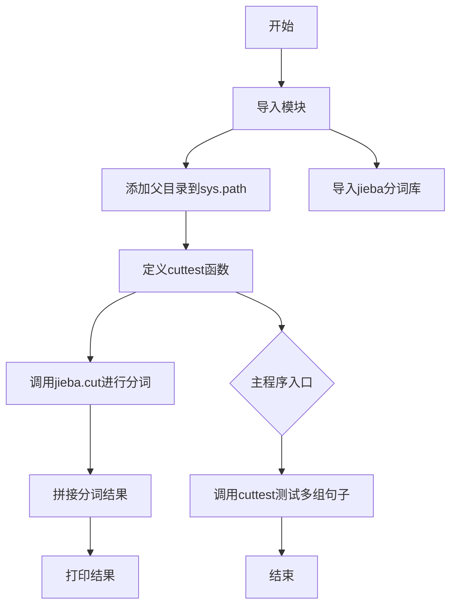
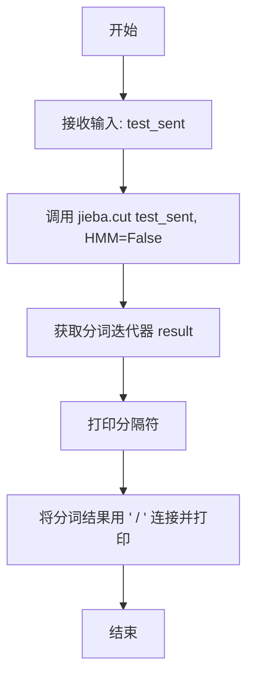
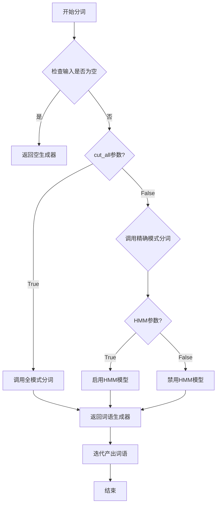
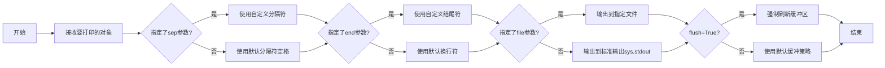
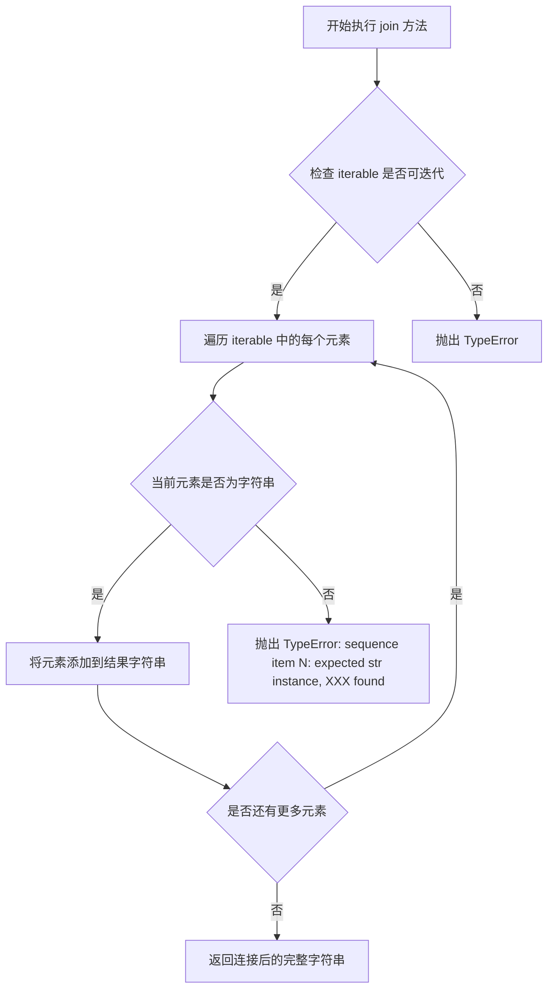

# `jieba\test\test_no_hmm.py` 详细设计文档

这是一个基于jieba库的中文分词测试脚本，通过调用jieba.cut()函数对大量中文句子进行分词测试，并打印分词结果以验证分词效果。

## 整体流程



## 类结构

```
此文件为脚本文件，无类定义
仅包含一个全局函数cuttest
使用jieba库进行中文分词处理
```

## 全局变量及字段


### `sys`
    
Python标准库中的sys模块，用于访问系统相关的参数和函数

类型：`module`
    


### `jieba`
    
中文分词库，提供分词功能

类型：`module`
    


### `test_sent`
    
输入的中文句子，待分词的字符串参数

类型：`str`
    


### `result`
    
jieba.cut返回的分词结果，是一个包含分词结果的生成器对象

类型：`generator`
    


    

## 全局函数及方法


### `cuttest`

该全局函数是jieba中文分词库的测试函数，接收一个字符串参数，调用jieba的cut方法进行分词处理（不启用HMM模型），并将分词结果以"/"分隔的形式打印输出。

参数：

- `test_sent`：`str`，需要分词的中文或中英文混合句子

返回值：`None`，该函数无返回值，仅打印分词结果

#### 流程图



#### 带注释源码

```python
#encoding=utf-8
import sys
# 将上级目录添加到系统路径，以便导入jieba库
sys.path.append("../")
import jieba


def cuttest(test_sent):
    """
    对给定句子进行中文分词并打印结果
    
    参数:
        test_sent: str, 需要分词的中文或中英文混合句子
    返回值:
        None, 仅打印分词结果
    """
    # 调用jieba的cut方法进行分词
    # test_sent: 输入的句子
    # HMM=False: 禁用隐马尔可夫模型，用于识别新词
    result = jieba.cut(test_sent, HMM=False)
    
    # 将分词结果用 " / " 连接并打印输出
    print(" / ".join(result))


# 主程序入口，测试各种中文分词场景
if __name__ == "__main__":
    # 测试各种中文句子分词效果
    cuttest("这是一个伸手不见五指的黑夜。我叫孙悟空，我爱北京，我爱Python和C++。")
    cuttest("我不喜欢日本和服。")
    cuttest("雷猴回归人间。")
    cuttest("工信处女干事每月经过下属科室都要亲口交代24口交换机等技术性器件的安装工作")
    cuttest("我需要廉租房")
    cuttest("永和服装饰品有限公司")
    cuttest("我爱北京天安门")
    cuttest("abc")
    cuttest("隐马尔可夫")
    cuttest("雷猴是个好网站")
    cuttest("\"Microsoft\"一词由\"MICROcomputer（微型计算机）\"和\"SOFTware（软件）\"两部分组成")
    cuttest("草泥马和欺实马是今年的流行词汇")
    cuttest("伊藤洋华堂总府店")
    cuttest("中国科学院计算技术研究所")
    cuttest("罗密欧与朱丽叶")
    cuttest("我购买了道具和服装")
    cuttest("PS: 我觉得开源有一个好处，就是能够敦促自己不断改进，避免敞帚自珍")
    cuttest("湖北省石首市")
    cuttest("湖北省十堰市")
    cuttest("总经理完成了这件事情")
    cuttest("电脑修好了")
    cuttest("做好了这件事情就一了百了了")
    cuttest("人们审美的观点是不同的")
    cuttest("我们买了一个美的空调")
    cuttest("线程初始化时我们要注意")
    cuttest("一个分子是由好多原子组织成的")
    cuttest("祝你马到功成")
    cuttest("他掉进了无底洞里")
    cuttest("中国的首都是北京")
    cuttest("孙君意")
    cuttest("外交部发言人马朝旭")
    cuttest("领导人会议和第四届东亚峰会")
    cuttest("在过去的这五年")
    cuttest("还需要很长的路要走")
    cuttest("60周年首都阅兵")
    cuttest("你好人们审美的观点是不同的")
    cuttest("买水果然后来世博园")
    cuttest("买水果然后去世博园")
    cuttest("但是后来我才知道你是对的")
    cuttest("存在即合理")
    cuttest("的的的的的在的的的的就以和和和")
    cuttest("I love你，不以为耻，反以为rong")
    cuttest("因")
    cuttest("")
    cuttest("hello你好人们审美的观点是不同的")
    cuttest("很好但主要是基于网页形式")
    cuttest("hello你好人们审美的观点是不同的")
    cuttest("为什么我不能拥有想要的生活")
    cuttest("后来我才")
    cuttest("此次来中国是为了")
    cuttest("使用了它就可以解决一些问题")
    cuttest(",使用了它就可以解决一些问题")
    cuttest("其实使用了它就可以解决一些问题")
    cuttest("好人使用了它就可以解决一些问题")
    cuttest("是因为和国家")
    cuttest("老年搜索还支持")
    cuttest("干脆就把那部蒙人的闲法给废了拉倒！RT @laoshipukong : 27日，全国人大常委会第三次审议侵权责任法草案，删除了有关医疗损害责任\"举证倒置\"的规定。在医患纠纷中本已处于弱势地位的消费者由此将陷入万劫不复的境地。 ")
    cuttest("大")
    cuttest("")
    cuttest("他说的确实在理")
    cuttest("长春市长春节讲话")
    cuttest("结婚的和尚未结婚的")
    cuttest("结合成分子时")
    cuttest("旅游和服务是最好的")
    cuttest("这件事情的确是我的错")
    cuttest("供大家参考指正")
    cuttest("哈尔滨政府公布塌桥原因")
    cuttest("我在机场入口处")
    cuttest("邢永臣摄影报道")
    cuttest("BP神经网络如何训练才能在分类时增加区分度？")
    cuttest("南京市长江大桥")
    cuttest("应一些使用者的建议，也为了便于利用NiuTrans用于SMT研究")
    cuttest('长春市长春药店')
    cuttest('邓颖超生前最喜欢的衣服')
    cuttest('胡锦涛是热爱世界和平的政治局常委')
    cuttest('程序员祝海林和朱会震是在孙健的左面和右面, 范凯在最右面.再往左是李松洪')
    cuttest('一次性交多少钱')
    cuttest('两块五一套，三块八一斤，四块七一本，五块六一条')
    cuttest('小和尚留了一个像大和尚一样的和尚头')
    cuttest('我是中华人民共和国公民;我爸爸是共和党党员; 地铁和平门站')
    cuttest('张晓梅去人民医院做了个B超然后去买了件T恤')
    cuttest('AT&T是一件不错的公司，给你发offer了吗？')
    cuttest('C++和c#是什么关系？11+122=133，是吗？PI=3.14159')
    cuttest('你认识那个和主席握手的的哥吗？他开一辆黑色的士。')
    cuttest('枪杆子中出政权')
    cuttest('张三风同学走上了不归路')
    cuttest('阿Q腰间挂着BB机手里拿着大哥大，说：我一般吃饭不AA制的。')
    cuttest('在1号店能买到小S和大S八卦的书，还有3D电视。')
```


### `jieba.cut`

这是 jieba 库提供的中文分词核心函数，用于将中文文本分割成词语列表。该函数支持精确模式（全模式）和 HMM 隐马尔可夫模型两种分词策略，是中文 NLP 领域最常用的分词接口之一。

参数：

- `sentence`：`str`，要进行分词的中文文本字符串
- `cut_all`：`bool`，是否采用全模式分词（True 为全模式，False 为精确模式），默认为 `False`
- `HMM`：`bool`，是否使用 HMM 隐马尔可夫模型识别新词，默认为 `True`

返回值：`generator`，分词结果的生成器，逐个产出分词后的词语字符串

#### 流程图



#### 带注释源码

```python
# jieba 库源码结构（简化版示意）
# 实际源码位于 jieba/__init__.py 的 cut 函数

def cut(self, sentence, cut_all=False, HMM=True):
    """
    中分分词主函数
    
    参数:
        sentence: str, 待分词的中文文本
        cut_all: bool, 是否使用全模式（True返回所有可能的词语组合）
        HMM: bool, 是否使用隐马尔可夫模型识别未登录词（新词）
    
    返回:
        generator: 分词结果生成器
    """
    # 初始化分词器（延迟加载）
    self._ensure_initialized()
    
    # 将输入转为字符串类型
    sentence = strdecode(sentence)
    
    # 判断分词模式：全模式 or 精确模式
    if cut_all:
        # 全模式：返回所有可能的词语，粒度最细
        re_han = self.re_han_cut_all
        re_skip = self.re_skip_cut_all
    else:
        # 精确模式：最符合语言习惯的分词结果
        re_han = self.re_han_cut
        re_skip = self.re_skip
    
    # 处理HMM模型
    # HMM=True时，启用隐马尔可夫模型识别新词/未登录词
    # 例如：网络新词"不明觉厉"会被识别为一个词
    if HMM:
        # 使用Viterbi算法进行词性标注和分词
        for word in self.__cut_all(sentence):
            yield word
    else:
        # 不使用HMM，基于词典的机械分词
        for word in self.__cut_DAG(sentence):
            yield word


def __cut_DAG(self, sentence):
    """
    精确模式的核心分词逻辑
    使用DAG（有向无环图）进行最优路径搜索
    """
    # 构建句子中所有可能的词语组合成DAG
    # 例如："我爱你" -> {0:[0,1], 1:[1,2], 2:[2,3]}
    # 即：0位置可能是"我"，0-1位置可能是"我爱"等
    
    # 使用动态规划找最优分词路径
    # 采用最大概率路径：P(词语1,词语2,...)最大
    
    # 产出最终分词结果
    yield word


def __cut_all(self, sentence):
    """
    全模式分词
    返回所有可能的词语组合
    """
    # 遍历DAG中的所有路径
    yield word  # 可能产生重复词语
```

#### 使用示例源码

```python
# 代码中的实际调用方式
def cuttest(test_sent):
    """
    测试分词功能的示例函数
    
    参数:
        test_sent: str, 要进行分词测试的中文句子
    
    返回:
        None, 直接打印分词结果
    """
    # 调用 jieba.cut 进行分词
    # HMM=False 表示不使用隐马尔可夫模型识别新词
    # 返回一个生成器对象
    result = jieba.cut(test_sent, HMM=False)
    
    # 使用 " / " 将分词结果连接成字符串并打印
    # 生成器需要被消费才能获取所有分词结果
    print(" / ".join(result))


# 主程序入口，测试各种中文句子
if __name__ == "__main__":
    # 测试用例覆盖多种场景
    cuttest("这是一个伸手不见五指的黑夜。我叫孙悟空，我爱北京，我爱Python和C++。")
    cuttest("我不喜欢日本和服。")
    cuttest("工信处女干事每月经过下属科室都要亲口交代24口交换机等技术性器件的安装工作")
    # ... 更多测试用例
```

#### 关键组件信息

| 组件名称 | 一句话描述 |
|---------|-----------|
| jieba 库 | Python 最流行的中文分词库，支持精确模式、全模式、搜索引擎模式 |
| DAG 有向无环图 | 用于表示句子中所有可能的词语组合路径 |
| HMM 隐马尔可夫模型 | 用于识别未登录词（新词）的概率统计模型 |
| Viterbi 算法 | HMM 解码算法，用于计算最优路径 |

#### 潜在的技术债务或优化空间

1. **生成器消费效率**：使用 `join()` 消费生成器时需注意内存占用，大文本建议逐词处理
2. **HMM 模型开销**：HMM=True 时会增加计算开销，可根据实际需求选择
3. **编码兼容性**：需确保输入文本编码正确，建议统一使用 UTF-8
4. **词典加载延迟**：首次调用会有词典加载延迟，可考虑预热（warm-up）

#### 其它说明

**设计目标与约束**：
- 提供高性能的中文分词能力
- 兼容 Python 2 和 Python 3（虽代码显示为 Python 3）
- 支持自定义词典扩展

**错误处理**：
- 空字符串输入会返回空生成器
- 异常输入会被转换为字符串处理
- 编码错误需调用方保证输入编码正确

**数据流**：
```
输入文本 → 编码转换 → DAG构建 → 路径搜索 → HMM处理（如启用） → 分词结果输出
```


### `print`

描述：该函数是Python内置的输出函数，用于将对象打印到标准输出流（默认）或指定文件。在本代码中用于输出jieba分词后的结果。

参数：

-  `*objects`：`任意对象（实际传入为字符串）`，要打印的对象，支持多个位置参数
-  `sep`：`str`，分隔符，默认值为`' '`（空格），当传入多个对象时用于分隔
-  `end`：`str`，结尾符，默认值为`'\n'`（换行），打印完毕后追加的字符
-  `file`：`file-like object`，输出文件对象，默认值为`sys.stdout`（标准输出）
-  `flush`：`bool`，是否强制刷新缓冲区，默认值为`False`

返回值：`None`，无返回值

#### 流程图



#### 带注释源码

```python
# 在本代码中print的实际调用方式
print(" / ".join(result))

# 完整调用展开：
# print(*objects, sep=' ', end='\n', file=sys.stdout, flush=False)
# 
# 参数说明：
# *objects: 本例中传入的是 " / ".join(result) 的结果，即分词后的字符串
#           例如："这是 / 一个 / 伸手不见五指 / 的 / 黑夜"
# sep: 本例中使用的是默认的空格分隔符（在join中已处理）
# end: 使用默认换行符
# file: 使用默认的标准输出
# flush: 使用默认不强制刷新
#
# 执行流程：
# 1. jieba.cut() 返回一个生成器，包含分词结果
# 2. " / ".join(result) 将分词结果用 " / " 连接成字符串
# 3. print() 将连接后的字符串输出到标准输出
```


### `str.join`

`join` 是 Python 字符串对象的一个内置方法，用于将可迭代对象（如列表、元组、生成器等）中的元素用调用该方法的字符串作为分隔符连接起来，返回一个新的字符串。

参数：

- `iterable`：可迭代对象（list、tuple、generator等），其中的元素必须是字符串类型，否则会抛出 TypeError

返回值：`str`，返回连接后的新字符串

#### 流程图



#### 带注释源码

```python
# 代码中实际使用示例（第7行）
result = jieba.cut(test_sent, HMM=False)  # jieba.cut 返回一个生成器，包含分词结果
print(" / ".join(result))  # 使用 str.join 方法将分词结果用 " / " 连接

# 通用语法说明
# separator.join(iterable)
# - separator: 分隔符字符串
# - iterable: 要连接的可迭代对象（元素必须为字符串）

# 例子
words = ["我", "爱", "北京", "天安门"]
result = " ".join(words)  # 结果: "我 爱 北京 天安门"
result = "/".join(words)  # 结果: "我/爱/北京/天安门"
result = "".join(words)   # 结果: "我爱北京天安门"

# 注意事项
# 1. 如果 iterable 中包含非字符串元素，会抛出 TypeError
# 2. 空 iterable 会返回空字符串
# 3. 分隔符可以是空字符串""
# 4. 这是 Python 中将列表/元组连接成字符串的最高效方式
```

## 关键组件


### jieba库导入
这是Python的中文分词库，提供精准的中文分词功能，支持全模式和精确模式分词

### cuttest函数
这是分词测试函数，接收字符串参数，调用jieba.cut进行分词处理，使用HMM=False参数关闭隐马尔可夫模型，最后将分词结果以"/ "连接并打印输出

### 测试句子集合
包含多个中文句子，涵盖不同场景如地名、人名、技术术语、网络用语等，用于全面测试jieba分词在各种语境下的准确性和鲁棒性


## 问题及建议


### 已知问题

- **相对路径导入不可靠**：`sys.path.append("../")` 使用硬编码的相对路径，在不同工作目录运行会导致导入失败
- **缺少异常处理**：对空字符串、None值或jieba库加载失败等异常情况没有处理，可能导致程序崩溃
- **硬编码配置**：`HMM=False` 参数直接写在代码中，无法在不修改源码的情况下调整
- **测试用例无结构化**：大量测试用例以字符串数组形式硬编码，无法灵活选择要执行的用例
- **无日志系统**：使用print直接输出，无法控制日志级别，不适合生产环境或调试
- **函数无返回值**：`cuttest`函数只打印结果不返回，无法在其他代码中复用分词结果
- **Python2编码声明**：代码中`#encoding=utf-8`是Python2语法，在Python3中不需要且可能引起混淆
- **无单元测试**：缺少pytest/unittest等测试框架的测试用例，无法自动化回归测试

### 优化建议

- 使用绝对路径或配置文件来管理导入路径，避免相对路径依赖
- 为`cuttest`函数添加try-except异常处理，捕获空输入和jieba异常
- 将`HMM`参数化，支持命令行参数或配置文件传入
- 将测试用例提取为列表或YAML/JSON配置文件，支持分类和选择性运行
- 引入logging模块替代print，配置不同日志级别
- 修改函数返回分词结果列表，便于后续处理和单元测试
- 移除Python2编码声明，保留UTF-8文件头即可
- 使用pytest编写单元测试，覆盖正常输入、边界输入、异常输入等场景
- 考虑将分词逻辑封装为可复用的类或模块，提供更灵活的接口


## 其它


### 设计目标与约束

设计目标：验证jieba中文分词库对各类中文句子的分词效果，包括正常语句、网络用语、混合中英文、专业术语等场景。约束：使用HMM=False参数禁用隐马尔可夫模型，专注于基于词典的分词效果。

### 错误处理与异常设计

代码未实现显式的错误处理机制。潜在异常场景包括：空字符串输入（已测试）、jieba库加载失败、编码问题（已通过#encoding=utf-8声明处理）。建议增加异常捕获逻辑处理jieba.cut可能的异常情况。

### 数据流与状态机

数据流：输入字符串 → jieba.cut分词处理 → 生成生成器对象 → 遍历拼接为字符串 → print输出。状态机：本程序为一次性执行流程，无状态保持。

### 外部依赖与接口契约

外部依赖：jieba库（中文分词核心库）、sys标准库。接口契约：cuttest函数接收str类型参数test_sent，返回None（仅打印输出），需保证输入为有效字符串编码（UTF-8）。

### 性能考虑

当前为一次性批处理脚本，无性能优化。潜在优化点：批量分词时可考虑并行处理，对大量测试用例可缓存分词结果。

### 安全性考虑

代码无用户输入处理，无安全风险。注意事项：jieba库加载自定义词典时需注意词典文件路径安全性。

### 配置管理

当前无独立配置文件，jieba使用默认配置。HMM参数通过函数参数控制，可考虑抽取为配置常量或命令行参数增强灵活性。

### 日志与监控

代码无日志记录功能。建议添加日志记录分词耗时、输入输出对照，便于性能分析和问题排查。

### 测试策略

当前以main函数包含大量测试用例。可考虑：1）将测试用例结构化（分类：正常语句、网络用语、混合输入等）；2）使用单元测试框架重构；3）增加预期结果对比机制。

### 部署与运维

脚本形式部署，无需特殊运维配置。依赖管理通过pip install jieba即可。适合集成到CI/CD流程中作为分词效果回归测试。

### 国际化与本地化

当前仅支持中文分词。jieba库本身支持多语言分词，可扩展测试其他语言用例。错误提示信息可考虑国际化。

### 代码规范与风格

符合PEP8基本规范。建议：1）增加docstring说明函数用途；2）常量命名（如HMM参数）应大写；3）考虑type hints声明参数和返回值类型。

### 资源管理

无显式资源管理。jieba库首次加载词典文件会有IO开销，可考虑预加载机制优化多次调用场景。

### 并发与异步处理

当前为同步串行执行。如需处理大规模分词任务，可考虑使用multiprocessing或asyncio并行化，但需注意jieba库在多进程环境下的初始化问题。

### 版本管理与变更记录

当前为单一脚本文件。建议使用版本控制管理，保留历史版本记录，特别是分词规则词典的版本更新。

### 监控与告警机制

当前无监控能力。建议添加：分词耗时监控、内存占用监控、异常频率统计等，便于生产环境部署时的问题预警。

    