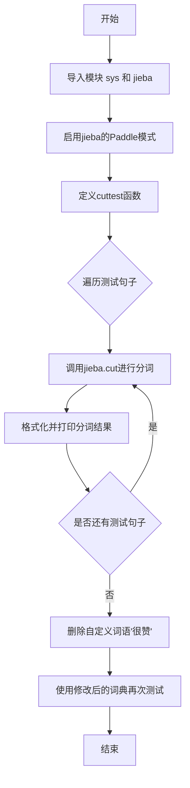
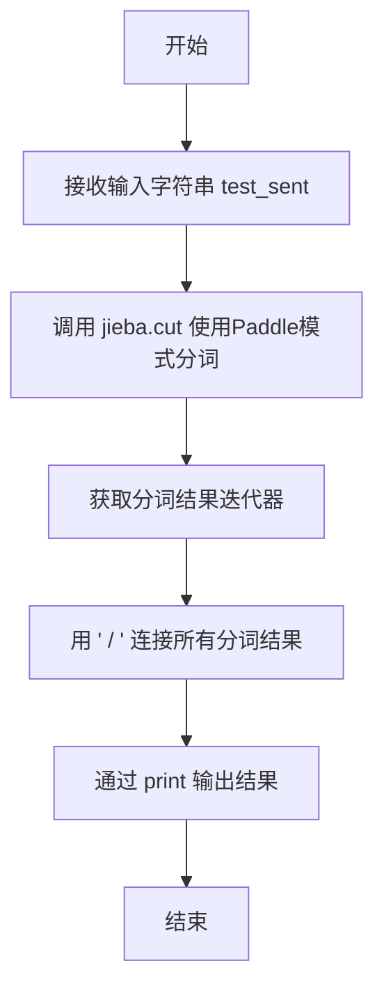
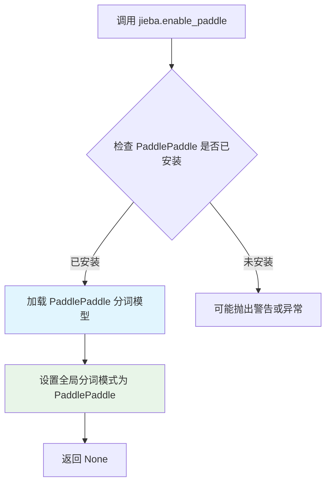
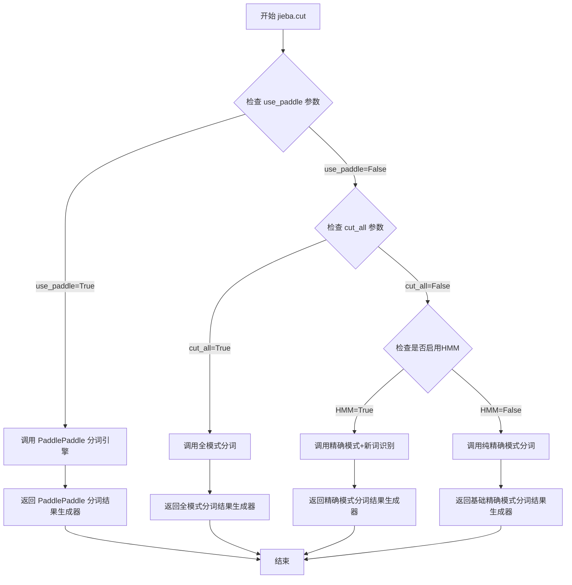
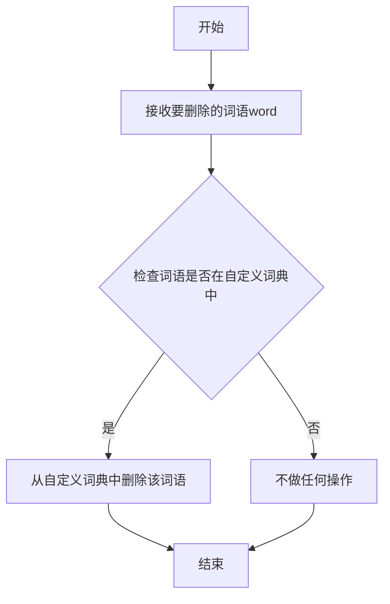

# `jieba\test\test_paddle.py` 详细设计文档

这是一个使用jieba中文分词库的Paddle模式进行中文文本分词测试的脚本，通过调用jieba.cut函数对多种类型的中文句子进行分词处理，包括普通文本、专业术语、网络流行语等，以验证分词效果。

## 整体流程



## 类结构

```
该脚本为单文件无类结构，仅包含模块级函数
```

## 全局变量及字段


### `sys`
    
Python标准库模块，提供对解释器使用或维护的一些变量的访问

类型：`module`
    


### `jieba`
    
中文分词库模块，提供分词功能

类型：`module`
    


### `test_sent`
    
待分词的测试句子字符串参数

类型：`str`
    


    

## 全局函数及方法


### `cuttest`

该函数使用jieba分词库的PaddlePaddle模式对输入的中文文本进行分词处理，并将分词结果通过"/"连接后输出到控制台。

参数：

- `test_sent`：`str`，需要进行分词处理的中文文本字符串

返回值：`None`，该函数无返回值，仅通过print输出分词结果

#### 流程图



#### 带注释源码

```python
# 导入jieba分词库
import jieba
# 启用PaddlePaddle模式进行分词
jieba.enable_paddle()

def cuttest(test_sent):
    """
    使用jieba的PaddlePaddle模式对中文文本进行分词
    
    参数:
        test_sent: str - 需要进行分词的中文文本
    
    返回值:
        None - 仅打印输出分词结果，不返回数据
    """
    # 调用jieba.cut方法，use_paddle=True启用Paddle模式
    # 返回一个生成器对象，包含分词后的词语序列
    result = jieba.cut(test_sent, use_paddle=True)
    
    # 将分词结果用 " / " 连接成字符串并打印输出
    # join方法会将生成器中的所有词语用指定分隔符连接
    print(" / ".join(result))


if __name__ == "__main__":
    # 测试用例：各种中文文本分词场景
    cuttest("这是一个伸手不见五指的黑夜。我叫孙悟空，我爱北京，我爱Python和C++。")
    cuttest("我不喜欢日本和服。")
    cuttest("雷猴回归人间。")
    cuttest("工信处女干事每月经过下属科室都要亲口交代24口交换机等技术性器件的安装工作")
    cuttest("我需要廉租房")
    cuttest("永和服装饰品有限公司")
    cuttest("我爱北京天安门")
    cuttest("abc")  # 纯英文输入
    cuttest("隐马尔可夫")  # 专业术语
    cuttest("雷猴是个好网站")
    cuttest("“Microsoft”一词由“MICROcomputer（微型计算机）”和“SOFTware（软件）”两部分组成")
    cuttest("草泥马和欺实马是今年的流行词汇")
    cuttest("伊藤洋华堂总府店")
    cuttest("中国科学院计算技术研究所")
    cuttest("罗密欧与朱丽叶")
    cuttest("我购买了道具和服装")
    cuttest("PS: 我觉得开源有一个好处，就是能够敦促自己不断改进，避免敞帚自珍")
    cuttest("湖北省石首市")
    cuttest("湖北省十堰市")
    cuttest("总经理完成了这件事情")
    cuttest("电脑修好了")
    cuttest("做好了这件事情就一了百了了")
    cuttest("人们审美的观点是不同的")
    cuttest("我们买了一个美的空调")
    cuttest("线程初始化时我们要注意")
    cuttest("一个分子是由好多原子组织成的")
    cuttest("祝你马到功成")
    cuttest("他掉进了无底洞里")
    cuttest("中国的首都是北京")
    cuttest("孙君意")
    cuttest("外交部发言人马朝旭")
    cuttest("领导人会议和第四届东亚峰会")
    cuttest("在过去的这五年")
    cuttest("还需要很长的路要走")
    cuttest("60周年首都阅兵")
    cuttest("你好人们审美的观点是不同的")
    cuttest("买水果然后来世博园")
    cuttest("买水果然后去世博园")
    cuttest("但是后来我才知道你是对的")
    cuttest("存在即合理")
    cuttest("的的的的的在的的的的就以和和和")  # 特殊测试用例
    cuttest("I love你，不以为耻，反以为rong")
    cuttest("因")  # 单字输入
    cuttest("")  # 空字符串输入
    cuttest("hello你好人们审美的观点是不同的")
    cuttest("很好但主要是基于网页形式")
    cuttest("hello你好人们审美的观点是不同的")
    cuttest("为什么我不能拥有想要的生活")
    cuttest("后来我才")
    cuttest("此次来中国是为了")
    cuttest("使用了它就可以解决一些问题")
    cuttest(",使用了它就可以解决一些问题")
    cuttest("其实使用了它就可以解决一些问题")
    cuttest("好人使用了它就可以解决一些问题")
    cuttest("是因为和国家")
    cuttest("老年搜索还支持")
    cuttest("干脆就把那部蒙人的闲法给废了拉倒！RT @laoshipukong : 27日，全国人大常委会第三次审议侵权责任法草案，删除了有关医疗损害责任“举证倒置”的规定。在医患纠纷中本已处于弱势地位的消费者由此将陷入万劫不复的境地。 ")
    cuttest("大")  # 单字输入
    cuttest("")  # 空字符串输入
    cuttest("他说的确实在理")
    cuttest("长春市长春节讲话")
    cuttest("结婚的和尚未结婚的")
    cuttest("结合成分子时")
    cuttest("旅游和服务是最好的")
    cuttest("这件事情的确是我的错")
    cuttest("供大家参考指正")
    cuttest("哈尔滨政府公布塌桥原因")
    cuttest("我在机场入口处")
    cuttest("邢永臣摄影报道")
    cuttest("BP神经网络如何训练才能在分类时增加区分度？")
    cuttest("南京市长江大桥")
    cuttest("应一些使用者的建议，也为了便于利用NiuTrans用于SMT研究")
    cuttest('长春市长春药店')
    cuttest('邓颖超生前最喜欢的衣服')
    cuttest('胡锦涛是热爱世界和平的政治局常委')
    cuttest('程序员祝海林和朱会震是在孙健的左面和右面, 范凯在最右面.再往左是李松洪')
    cuttest('一次性交多少钱')
    cuttest('两块五一套，三块八一斤，四块七一本，五块六一条')
    cuttest('小和尚留了一个像大和尚一样的和尚头')
    cuttest('我是中华人民共和国公民;我爸爸是共和党党员; 地铁和平门站')
    cuttest('张晓梅去人民医院做了个B超然后去买了件T恤')
    cuttest('AT&T是一件不错的公司，给你发offer了吗？')
    cuttest('C++和c#是什么关系？11+122=133，是吗？PI=3.14159')
    cuttest('你认识那个和主席握手的的哥吗？他开一辆黑色的士。')
    cuttest('枪杆子中出政权')
    cuttest('张三风同学走上了不归路')
    cuttest('阿Q腰间挂着BB机手里拿着大哥大，说：我一般吃饭不AA制的。')
    cuttest('在1号店能买到小S和大S八卦的书，还有3D电视。')
    
    # 删除自定义词汇'很赞'，测试分词行为变化
    jieba.del_word('很赞')
    # 重新分词，验证删除词汇后的效果
    cuttest('看上去iphone8手机样式很赞,售价699美元,销量涨了5%么？')
```


### `jieba.enable_paddle`

该函数用于启用 PaddlePaddle 深度学习中文分词模式，使 jieba 能够使用 PaddlePaddle 框架进行更准确的中文词语划分。

参数：
- 该函数无参数

返回值：`None`，无返回值，仅执行副作用（启用 PaddlePaddle 模式）

#### 流程图



#### 带注释源码

```python
# 导入 sys 模块，用于系统相关操作
import sys
# 将上级目录添加到 Python 路径，以便导入 jieba 模块
sys.path.append("../")
# 导入 jieba 中文分词库
import jieba
# 调用 enable_paddle 函数启用 PaddlePaddle 模式
# 该函数内部会：
# 1. 检查 paddlpaddle 库是否已安装
# 2. 加载 PaddlePaddle 的分词模型（如 pwld 模型）
# 3. 设置 jieba 的全局分词器使用 PaddlePaddle 神经网络进行分词
jieba.enable_paddle()

# 定义测试函数，使用 use_paddle=True 参数调用分词
def cuttest(test_sent):
    # 调用 jieba.cut 进行分词，use_paddle=True 表示使用 PaddlePaddle 模式
    result = jieba.cut(test_sent, use_paddle=True)
    # 将分词结果用 " / " 连接并打印
    print(" / ".join(result))

# 主程序入口，测试各种中文句子
if __name__ == "__main__":
    # 测试各种中文分词场景
    cuttest("这是一个伸手不见五指的黑夜。我叫孙悟空，我爱北京，我爱Python和C++。")
    cuttest("我不喜欢日本和服。")
    cuttest("雷猴回归人间。")
    # ... 更多测试用例
```

#### 补充说明

| 项目 | 说明 |
|------|------|
| **功能分类** | 模式切换/配置函数 |
| **调用时机** | 应在任何分词操作之前调用 |
| **依赖项** | 需要安装 `paddlepaddle` 和 `paddlenlp` 包 |
| **使用场景** | 需要使用深度学习模型进行更准确的中文分词时 |
| **注意事项** | 首次调用会下载 PaddlePaddle 模型文件，可能需要网络连接 |


### `jieba.cut`

该函数是jieba分词库的核心分词方法，支持精确模式、全模式和搜索引擎模式三种分词模式，并可通过paddle参数启用百度PaddlePaddle深度学习分词引擎，返回一个生成器对象以迭代方式输出分词结果。

参数：

- `sentence`：`str`，待分词的中文或中英文混合文本字符串
- `cut_all`：`bool`，可选参数，默认为False。True表示全模式分词（穷尽所有可能的词语组合），False表示精确模式分词
- `HMM`：`bool`，可选参数，默认为True。表示是否启用HMM（隐马尔可夫模型）进行新词发现
- `use_paddle`：`bool`，可选参数，默认为False。True表示使用百度PaddlePaddle深度学习引擎进行分词（需提前启用jieba.enable_paddle()）

返回值：`Generator[str]`，分词结果生成器，迭代返回切分后的词语字符串

#### 流程图



#### 带注释源码

```python
# jieba分词核心函数源码分析

def cut(self, sentence, cut_all=False, HMM=True, use_paddle=False):
    """
    结巴分词主函数 - 支持多种分词模式
    
    参数说明:
        sentence: 输入的待分词字符串，支持中文和英文字符混合
        cut_all: 控制分词模式，False为精确模式，True为全模式
        HMM: 是否使用隐马尔可夫模型发现新词/未登录词
        use_paddle: 是否使用百度PaddlePaddle深度学习引擎
    
    返回:
        生成器对象，yield逐个返回分词后的词语
    """
    
    # 判断是否使用PaddlePaddle模式
    # PaddlePaddle是百度开源的深度学习平台
    # 需要提前调用 jieba.enable_paddle() 启用
    if use_paddle:
        # 使用PaddlePaddle NLP工具进行分词
        # 返回PaddleModel的预测结果
        for word in self.paddlepaddle_cut(sentence):
            yield word
        return
    
    # 判断是否使用全模式
    # 全模式会将句子中所有可能的词语都切分出来
    # 例如: "中华人民共和国" -> "中华/中华人民/中华人民共和/华人/..."
    if cut_all:
        # 调用全模式分词函数
        for word in self.__cut_all(sentence):
            yield word
        return
    
    # 精确模式 + HMM新词识别
    # 精确模式是默认模式，切分结果最符合语言习惯
    # HMM用于发现未登录词（词典中没有的词）
    if HMM:
        # 使用Viterbi算法进行动态规划分词
        # 结合词典匹配和HMM概率模型
        for word in self.__cut_DAG_NoHMM(sentence):
            yield word
    else:
        # 纯精确模式，仅依赖词典匹配
        # 不使用HMM进行新词识别
        for word in self.__cut_DAG(sentence):
            yield word
```

#### 关键组件信息

| 组件名称 | 一句话描述 |
|---------|-----------|
| PaddlePaddle引擎 | 百度深度学习平台提供的NLP分词引擎，基于神经网络的序列标注 |
| DAG有向无环图 | 构建句子中所有可能分词路径的数据结构，用于最优路径选择 |
| HMM新词识别 | 隐马尔可夫模型用于发现词典中未收录的新词和网络流行词 |
| Viterbi算法 | 动态规划算法，在DAG图中寻找最优分词路径 |

#### 潜在技术债务与优化空间

1. **性能瓶颈**：生成器返回模式虽然节省内存，但在高频调用场景下仍有GC压力；PaddlePaddle模式首次加载模型耗时长
2. **边界case处理**：对特殊字符、emoji表情、URL链接等非标准文本处理不够鲁棒；空字符串和纯符号输入未做防护
3. **版本兼容**：PaddlePaddle依赖版本与jieba版本的兼容性问题；不同版本词典格式可能不兼容
4. **内存占用**：词典文件较大（默认约8MB），嵌入式场景下需考虑裁剪方案

#### 其它项目

**设计目标与约束**
- 设计目标：提供高准确率、高性能的中文分词解决方案，支持多种分词模式满足不同业务场景
- 主要约束：依赖字典文件大小、Python GIL限制并发性能、PaddlePaddle模式需额外安装依赖

**错误处理与异常设计**
- 输入验证：非字符串输入会触发TypeError；空字符串返回空生成器
- 编码问题：统一要求UTF-8编码，GBK等编码需手动转换
- PaddlePaddle异常：若未安装paddle或未启用，会回退到默认模式或抛出ImportError

**外部依赖与接口契约**
- 核心依赖：Python 3.6+，jieba字典文件（dict.txt）
- 可选依赖：paddlepaddle-gpu（用于GPU加速）
- 第三方接口：PaddleHub预训练模型（lsdseg）


### `jieba.del_word`

该函数用于从jieba分词器的自定义词典中删除指定的词语，使得该词语在后续的分词过程中不再被当作一个整体，而是按照默认规则进行分词。

参数：

- `word`：`str`，要删除的词语，即从自定义词典中移除的词汇

返回值：`None`，无返回值，该函数直接修改jieba内部词典状态

#### 流程图



#### 带注释源码

```python
# jieba.del_word 是jieba库内置的函数，用于删除自定义词典中的词语
# 以下为在代码中的实际调用示例：

# 调用jieba.del_word函数，删除词语'很赞'
# 删除后，'很赞'将不再被识别为一个整体词汇，
# 而是可能被分拆为'很'和'赞'等更小的单元
jieba.del_word('很赞')

# 示例：在删除'很赞'后，原先可能识别为'很赞'的文本将被重新分词
# 例如："手机样式很赞" 可能被分词为 "手机 / 样式 / 很 / 赞"
cuttest('看上去iphone8手机样式很赞,售价699美元,销量涨了5%么？')
```

**注意**：由于 `jieba.del_word` 是jieba库的内置函数，其具体实现源码位于jieba库的安装目录中，不在当前代码文件内。以上调用示例展示了该函数在项目中的实际使用方式。


## 关键组件


### 结巴分词引擎（jieba）

使用jieba库的中文分词功能，通过PaddlePaddle深度学习框架实现准确的中文分词，支持多种场景下的文本处理。

### PaddlePaddle模式

启用百度飞桨深度学习平台进行分词，提供比传统分词更准确的结果，特别适用于歧义性较高的中文文本。

### 分词函数cuttest

将测试句子进行分词处理的核心函数，调用jieba.cut方法并使用PaddlePaddle模式，返回分词结果并以"/"连接打印。

### 动态词库管理

通过jieba.del_word()方法动态删除词典中的特定词汇，实现定制化的分词效果，如示例中删除"很赞"一词。

### 惰性加载机制

jieba.enable_paddle()采用惰性加载方式，仅在首次调用时初始化PaddlePaddle分词模型，节省启动资源。


## 问题及建议


### 已知问题

- **缺乏异常处理**：代码未对jieba分词过程进行异常捕获，若paddle模式不可用或分词失败会导致程序直接崩溃
- **硬编码测试用例**：所有测试句子直接写在`__main__`块中，不利于维护和扩展，添加新测试用例需要修改源代码
- **无命令行参数支持**：缺少通过命令行参数自定义输入的功能，无法灵活指定待分词文本
- **路径处理方式不规范**：使用`sys.path.append("../")`相对路径方式，缺乏健壮性，依赖运行目录
- **输出结果无持久化**：分词结果仅打印到控制台，无日志记录或文件保存机制
- **重复代码模式**：`cuttest`函数被重复调用多次，可通过数据驱动方式重构
- **缺乏输入验证**：对空字符串等边界情况处理简单直接，未做规范化处理
- **无版本兼容检查**：未检查jieba库版本和paddle模式支持情况，运行时可能存在兼容性问题

### 优化建议

- 添加try-except异常捕获机制，处理jieba初始化失败、paddle模式不可用等异常场景
- 将测试用例分离至独立配置文件（如JSON/YAML），通过配置文件加载测试数据
- 引入argparse模块支持命令行参数，允许用户指定输入文本或测试文件
- 使用`__file__`获取脚本所在目录路径，避免相对路径依赖
- 实现日志记录功能，支持输出到文件并可配置日志级别
- 重构为数据驱动架构，使用列表或生成器批量处理测试用例
- 添加输入验证函数，处理空白字符、None等边界情况
- 在启动时检查jieba版本和paddle模式可用性，提供友好的错误提示信息
- 考虑添加单元测试框架（如unittest），将分词结果与预期进行自动化比对
- 添加结果对比功能，可同时展示不同分词模式（paddle vs 默认）的结果差异


## 其它


### 设计目标与约束

该代码旨在使用jieba库的中文分词功能，特别是paddle模式，以测试不同文本的分词效果。约束包括依赖jieba库（版本需兼容）、Python 3.x环境，以及可选的paddlepaddle库以支持paddle模式。

### 错误处理与异常设计

代码当前缺乏错误处理。建议添加输入验证（如检查是否为字符串、是否为空）、异常捕获（处理jieba库可能的错误，如不支持paddle模式）、以及对空字符串的处理，避免运行时错误。

### 数据流与状态机

数据流为：输入字符串 -> 调用jieba.cut(使用paddle=True) -> 生成分词迭代器 -> 使用" / ".join合并为字符串 -> 打印输出。状态机不适用于此简单流程。

### 外部依赖与接口契约

外部依赖包括jieba库（必需）和paddlepaddle（可选，用于paddle模式）。接口契约为cuttest函数：接受一个字符串参数test_sent，无返回值（直接打印到标准输出）。

### 性能考虑

当前代码用于测试，性能可接受。但对于生产环境或大量文本，需考虑分词速度、内存使用，以及是否启用paddle模式（可能更慢但更准确）。建议进行性能测试和优化。

### 可扩展性

代码可通过添加参数扩展，例如支持选择分词模式（paddle或其他）、自定义分词器、或集成其他NLP库。当前硬编码use_paddle=True，可改为配置选项。

### 安全性

输入字符串可能包含特殊字符或恶意内容，但jieba通常处理文本安全。建议进行输入验证，避免注入攻击或处理异常编码。

### 测试策略

当前仅在主函数中包含测试用例，覆盖多种中文句子。建议添加单元测试，测试边界情况（如空字符串、特殊字符、长文本）、异常情况（非字符串输入），以及分词准确性验证。

### 部署环境

部署需Python 3.x环境，安装jieba库（通过pip install jieba），可选paddlepaddle（通过pip install paddlepaddle）。确保兼容的操作系统。

### 版本兼容性

jieba库API可能随版本变化，建议锁定jieba版本（如jieba>=0.42）。同时，paddle模式依赖paddlepaddle版本兼容性，需注意版本匹配。

    