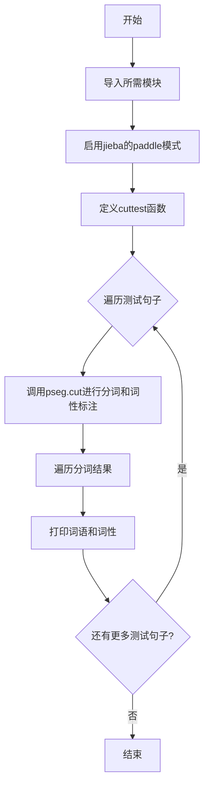
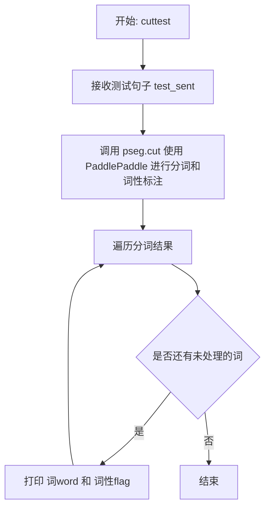

# `jieba\test\test_paddle_postag.py` 详细设计文档

该代码是一个基于jieba分词库的PaddlePaddle深度学习模式中文分词与词性标注演示程序，通过调用pseg.cut函数对多个测试句子进行分词和词性标注，并打印结果。

## 整体流程



## 类结构

```
该文件为脚本文件，无类层次结构
仅包含一个全局函数 cuttest
依赖外部库: jieba
```

## 全局变量及字段


### `sys`
    
Python标准库模块，用于访问系统相关参数和函数

类型：`module`
    


### `jieba`
    
开源的中文分词库，提供分词、词性标注等功能

类型：`module`
    


### `pseg`
    
jieba的词性标注模块，用于分词并标注词性

类型：`module`
    


    

## 全局函数及方法


### `cuttest`

该函数是一个全局测试函数，接收测试句子作为输入，使用jieba的posseg模块结合PaddlePaddle深度学习模型进行中文分词和词性标注，并将分词结果逐个打印输出。

参数：
- `test_sent`：`str`，要进行分词和词性标注的中文或中英文混合句子

返回值：`None`，该函数直接打印分词结果，不返回任何值

#### 流程图



#### 带注释源码

```python
# encoding: utf-8
# 导入系统模块，用于添加路径
import sys
# 将上级目录添加到系统路径，以便导入jieba模块
sys.path.append("../")

# 导入jieba的词性标注模块
import jieba.posseg as pseg
# 导入jieba主模块
import jieba
# 启用PaddlePaddle模式进行分词（基于深度学习的分词方式）

def cuttest(test_sent):
    """
    对输入的测试句子进行分词和词性标注并打印结果
    
    参数:
        test_sent (str): 要进行分词的句子，支持中文和中英文混合
        
    返回值:
        None: 函数直接打印结果，不返回任何值
    """
    # 使用pseg.cut进行分词和词性标注
    # use_paddle=True 启用PaddlePaddle深度学习模型
    result = pseg.cut(test_sent, use_paddle=True)
    
    # 遍历分词结果，result是一个生成器
    for word, flag in result:
        # 打印每个词及其对应的词性
        # word: 分词后的词语
        # flag: 该词语的词性标注
        print('%s %s' % (word, flag))


# 主程序入口，用于测试函数功能
if __name__ == "__main__":
    # 测试各种中文句子，包括普通句子、成语、专业术语等
    cuttest("这是一个伸手不见五指的黑夜。我叫孙悟空，我爱北京，我爱Python和C++。")
    cuttest("我不喜欢日本和服。")
    cuttest("雷猴回归人间。")
    cuttest("工信处女干事每月经过下属科室都要亲口交代24口交换机等技术性器件的安装工作")
    cuttest("我需要廉租房")
    cuttest("永和服装饰品有限公司")
    cuttest("我爱北京天安门")
    cuttest("abc")
    cuttest("隐马尔可夫")
    cuttest("雷猴是个好网站")
    cuttest("\"Microsoft\"一词由\"MICROcomputer（微型计算机）\"和\"SOFTware（软件）\"两部分组成")
    cuttest("草泥马和欺实马是今年的流行词汇")
    cuttest("伊藤洋华堂总府店")
    cuttest("中国科学院计算技术研究所")
    cuttest("罗密欧与朱丽叶")
    cuttest("我购买了道具和服装")
    cuttest("PS: 我觉得开源有一个好处，就是能够敦促自己不断改进，避免敞帚自珍")
    cuttest("湖北省石首市")
    cuttest("湖北省十堰市")
    cuttest("总经理完成了这件事情")
    cuttest("电脑修好了")
    cuttest("做好了这件事情就一了百了了")
    cuttest("人们审美的观点是不同的")
    cuttest("我们买了一个美的空调")
    cuttest("线程初始化时我们要注意")
    cuttest("一个分子是由好多原子组织成的")
    cuttest("祝你马到功成")
    cuttest("他掉进了无底洞里")
    cuttest("中国的首都是北京")
    cuttest("孙君意")
    cuttest("外交部发言人马朝旭")
    cuttest("领导人会议和第四届东亚峰会")
    cuttest("在过去的这五年")
    cuttest("还需要很长的路要走")
    cuttest("60周年首都阅兵")
    cuttest("你好人们审美的观点是不同的")
    cuttest("买水果然后来世博园")
    cuttest("买水果然后去世博园")
    cuttest("但是后来我才知道你是对的")
    cuttest("存在即合理")
    cuttest("的的的的的在的的的的就以和和和")
    cuttest("I love你，不以为耻，反以为rong")
    cuttest("因")
    cuttest("")
    cuttest("hello你好人们审美的观点是不同的")
    cuttest("很好但主要是基于网页形式")
    cuttest("hello你好人们审美的观点是不同的")
    cuttest("为什么我不能拥有想要的生活")
    cuttest("后来我才")
    cuttest("此次来中国是为了")
    cuttest("使用了它就可以解决一些问题")
    cuttest(",使用了它就可以解决一些问题")
    cuttest("其实使用了它就可以解决一些问题")
    cuttest("好人使用了它就可以解决一些问题")
    cuttest("是因为和国家")
    cuttest("老年搜索还支持")
    cuttest("干脆就把那部蒙人的闲法给废了拉倒！RT @laoshipukong : 27日，全国人大常委会第三次审议侵权责任法草案，删除了有关医疗损害责任\"举证倒置\"的规定。在医患纠纷中本已处于弱势地位的消费者由此将陷入万劫不复的境地。 ")
    cuttest("大")
    cuttest("")
    cuttest("他说的确实在理")
    cuttest("长春市长春节讲话")
    cuttest("结婚的和尚未结婚的")
    cuttest("结合成分子时")
    cuttest("旅游和服务是最好的")
    cuttest("这件事情的确是我的错")
    cuttest("供大家参考指正")
    cuttest("哈尔滨政府公布塌桥原因")
    cuttest("我在机场入口处")
    cuttest("邢永臣摄影报道")
    cuttest("BP神经网络如何训练才能在分类时增加区分度？")
    cuttest("南京市长江大桥")
    cuttest("应一些使用者的建议，也为了便于利用NiuTrans用于SMT研究")
    cuttest('长春市长春药店')
    cuttest('邓颖超生前最喜欢的衣服')
    cuttest('胡锦涛是热爱世界和平的政治局常委')
    cuttest('程序员祝海林和朱会震是在孙健的左面和右面, 范凯在最右面.再往左是李松洪')
    cuttest('一次性交多少钱')
    cuttest('两块五一套，三块八一斤，四块七一本，五块六一条')
    cuttest('小和尚留了一个像大和尚一样的和尚头')
    cuttest('我是中华人民共和国公民;我爸爸是共和党党员; 地铁和平门站')
    cuttest('张晓梅去人民医院做了个B超然后去买了件T恤')
    cuttest('AT&T是一件不错的公司，给你发offer了吗？')
    cuttest('C++和c#是什么关系？11+122=133，是吗？PI=3.14159')
    cuttest('你认识那个和主席握手的的哥吗？他开一辆黑色的士。')
    cuttest('枪杆子中出政权')
    cuttest('张三风同学走上了不归路')
    cuttest('阿Q腰间挂着BB机手里拿着大哥大，说：我一般吃饭不AA制的。')
    cuttest('在1号店能买到小S和大S八卦的书，还有3D电视。')
```

#### 关键组件信息

- **jieba.posseg 模块**：jieba的词性标注模块，提供分词和词性标注功能
- **pseg.cut()**：词性标注的核心函数，支持使用PaddlePaddle深度学习模型
- **PaddlePaddle**：百度开源的深度学习平台，在此用于提高分词和词性标注的准确性

#### 潜在的技术债务或优化空间

1. **返回值设计不合理**：函数直接将结果打印到标准输出，没有返回值，调用者无法获取分词结果进行后续处理。建议改为返回分词结果列表或生成器。

2. **缺乏错误处理**：没有对输入参数进行有效性校验（如空字符串、None值等），虽然代码中有`cuttest("")`的测试用例，但没有优雅处理。

3. **硬编码输出格式**：打印格式`'%s %s'`硬编码在函数内，应该作为可选参数让调用者自定义。

4. **依赖外部模型**：依赖PaddlePaddle模型，如果环境没有正确安装相关依赖，可能导致运行失败。

5. **测试用例与函数耦合**：大量测试用例直接写在`__main__`块中，应该将这些测试用例分离到独立的测试文件中。

#### 其它项目

**设计目标与约束**：
- 主要用于演示jieba的PaddlePaddle模式分词效果
- 支持中英文混合输入
- 专注于中文分词和词性标注

**错误处理与异常设计**：
- 当前实现没有异常处理机制
- 建议添加：空输入检测、编码异常处理、模型加载失败处理

**数据流与状态机**：
- 数据流：输入字符串 → pseg.cut()处理 → 遍历结果 → 打印输出
- 无复杂状态机设计

**外部依赖与接口契约**：
- 依赖jieba库（包含posseg子模块）
- 依赖PaddlePaddle框架（通过jieba.enable_paddle()调用）
- 接口简单：输入字符串，输出打印到stdout


## 关键组件


### 中文分词引擎（jieba）

该代码使用了jieba库的中文分词功能，通过pseg.cut进行词性标注，支持PaddlePaddle深度学习模式。

### 词性标注模块（pseg）

使用jieba.posseg模块的cut函数进行分词的同时标注词性，返回词-词性对。

### PaddlePaddle模式支持

通过jieba.enable_paddle()启用基于PaddlePaddle的深度学习分词模型，提升分词准确率。

### 测试用例集

包含大量中文分词测试用例，覆盖人名、地名、机构名、混合语言、专业术语等场景。


## 问题及建议


### 已知问题

- **缺乏异常处理**：代码未对空字符串、None输入或jieba库调用异常进行处理，可能导致程序崩溃
- **硬编码测试用例**：大量测试句子直接写在if __name__ == "__main__"代码块中，导致代码冗余，难以维护
- **未封装配置**：jieba的enable_paddle()调用、词典路径等配置直接写死在代码中，缺乏灵活性
- **无日志输出**：仅使用print输出分词结果，无法追踪程序执行状态和调试问题
- **缺乏模块化设计**：所有功能集中在单个脚本中，未按照单一职责原则进行类和函数封装
- **依赖管理不明确**：直接使用`jieba.enable_paddle()`但未检查paddlepaddle是否已安装，运行时可能出错
- **函数命名不规范**：cuttest函数命名不够清晰，未体现其实际功能

### 优化建议

- 将测试用例抽取为列表或外部配置文件，通过循环遍历执行，减少代码重复
- 为cuttest函数添加输入验证和异常捕获机制，处理空字符串、None等边界情况
- 将jieba配置（enable_paddle、词典路径、自定义词典等）封装为配置类或独立配置文件
- 引入日志模块（如logging）替代print，便于生产环境调试和监控
- 考虑将分词功能封装为独立的类（如ChineseSegmenter），提供初始化配置、分词、批量分词等方法
- 在import段添加paddlepaddle可用性检查，不可用时回退到其他分词模式
- 使用更语义化的函数命名，如chinese_tokenize替代cuttest
- 添加单元测试用例，覆盖正常输入、边界输入、异常输入等场景


## 其它


### 设计目标与约束

本代码旨在演示jieba中文分词库的分词和词性标注功能，主要用于验证paddle模式下的分词效果。设计约束包括：仅支持Python 3环境，需安装jieba库及paddlepaddle-tiny-paddle依赖，仅作为演示脚本使用，不适用于生产环境。

### 错误处理与异常设计

代码缺少显式的错误处理机制。潜在异常包括：ImportError（jieba或paddle模块未安装）、RuntimeError（paddle模式初始化失败）、UnicodeEncodeError（控制台编码不支持中文时）。建议添加异常捕获：try-except块捕获ImportError提示用户安装依赖，捕获UnicodeEncodeError时使用safe_print函数，捕获RuntimeError时回退到非paddle模式。

### 数据流与状态机

数据流为：输入字符串 → cuttest函数 → pseg.cut分词 → 遍历结果 → 控制台输出。状态机较为简单，仅包含初始化状态（jieba加载）、执行状态（分词处理）和完成状态（输出结果）三种状态转换。

### 外部依赖与接口契约

主要外部依赖：jieba>=0.42.1（中文分词核心库）、paddlepaddle-tiny-paddle（paddle模式运行时）、paddlenlp（NLP基础库）。接口契约：cuttest函数接收str类型输入test_sent，返回值为None（直接打印到标准输出），函数签名保持稳定。

### 性能考虑与优化空间

当前实现每次调用cuttest都会创建新的分词器实例，频繁调用时性能较低。优化方向：使用jieba.initialize()预加载词典，批量处理多个句子减少函数调用开销，对于大规模文本考虑使用jieba.lcut直接返回列表而非迭代器。

### 安全性考虑

代码本身无用户输入处理，无SQL注入、XSS等安全风险。潜在风险：输入字符串长度无限制，过长字符串可能导致内存问题，建议添加输入长度校验。

### 测试策略

当前代码通过if __name__ == "__main__":块直接执行多组测试用例。测试覆盖了常见中文分词场景，包括成语、人名、地名、专有名词、混合中英文等。建议补充：单元测试验证各函数返回值，集成测试对比不同分词模式的结果一致性，性能基准测试。

### 配置说明

jieba支持多种配置选项：jieba.enable_paddle()启用paddle模式，词典路径可通过jieba.setDictionary()自定义，词性标注可用use_paddle参数切换模式（True为paddle模式，False为默认模式）。

### 使用示例与用例

基本用法：导入cuttest函数后调用cuttest("待分词文本")。应用场景：中文文本预处理、语料库分词、词性统计、文本分类前处理。不适用场景：实时性要求高的生产服务、大规模批量处理（建议使用批处理API）。

### 版本变更记录

当前版本为1.0.0，基于jieba 0.42.1和paddlepaddle实现初始功能。后续可考虑：添加日志记录、配置化管理、批量处理接口、结果格式化输出（如JSON/CSV）等。

    