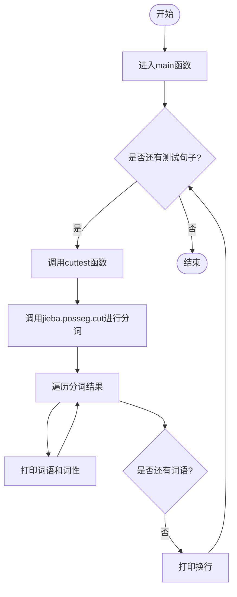
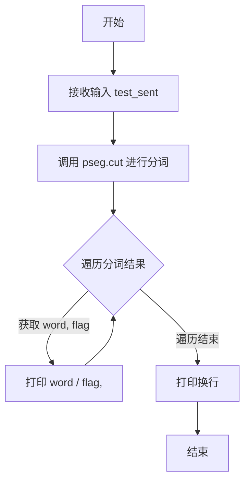

# `jieba\test\test_pos.py` 详细设计文档

这是一个使用jieba中文分词库进行分词和词性标注的测试脚本，通过调用cuttest函数对多个中文句子进行分词演示

## 整体流程



## 类结构

```
该脚本为单文件脚本，无自定义类层次结构，仅包含一个全局函数cuttest
```

## 全局变量及字段


### `sys`
    
提供对系统参数和函数的访问，常用于操作命令行参数、路径和退出等。

类型：`module`
    


### `pseg`
    
jieba 的词性标注子模块，用于中文分词并返回词语的词性标记。

类型：`module`
    


    

## 全局函数及方法


### `cuttest`

该函数接收一段中文文本，使用jieba分词库的分词功能对其进行词性标注，并将分词结果以“词语/词性,”的格式打印到标准输出。

参数：
- `test_sent`：`str`，需要进行分词处理的中文文本字符串

返回值：`None`，函数直接打印分词结果，不返回任何值

#### 流程图



#### 带注释源码

```python
# -*- coding: utf-8 -*-
# 导入未来版本的print函数，确保Python 2和Python 3兼容性
from __future__ import print_function
# 导入系统模块，用于处理路径
import sys
# 将上级目录添加到系统路径，以便导入jieba模块
sys.path.append("../")
# 导入jieba的分词模块，并重命名为pseg
import jieba.posseg as pseg

def cuttest(test_sent):
    """
    对输入的中文句子进行分词和词性标注，并打印结果
    
    参数:
        test_sent: str, 需要分词的中文文本
    返回值:
        None, 直接打印到标准输出
    """
    # 使用jieba的词性标注功能进行分词
    result = pseg.cut(test_sent)
    
    # 遍历分词结果，每个元素为(word, flag)元组
    for word, flag in result:
        # 打印词语和词性，格式为: 词语 / 词性 ,
        print(word, "/", flag, ", ", end=' ')
    
    # 打印换行符，结束当前句子的输出
    print("")


# 主程序入口，当脚本直接运行时执行
if __name__ == "__main__":
    # 使用各种测试用例调用cuttest函数
    cuttest("这是一个伸手不见五指的黑夜。我叫孙悟空，我爱北京，我爱Python和C++。")
    cuttest("我不喜欢日本和服。")
    cuttest("雷猴回归人间。")
    cuttest("工信处女干事每月经过下属科室都要亲口交代24口交换机等技术性器件的安装工作")
    cuttest("我需要廉租房")
    cuttest("永和服装饰品有限公司")
    cuttest("我爱北京天安门")
    cuttest("abc")
    cuttest("隐马尔可夫")
    cuttest("雷猴是个好网站")
    cuttest("\"Microsoft\"一词由\"MICROcomputer（微型计算机）\"和\"SOFTware（软件）\"两部分组成")
    cuttest("草泥马和欺实马是今年的流行词汇")
    cuttest("伊藤洋华堂总府店")
    cuttest("中国科学院计算技术研究所")
    cuttest("罗密欧与朱丽叶")
    cuttest("我购买了道具和服装")
    cuttest("PS: 我觉得开源有一个好处，就是能够敦促自己不断改进，避免敞帚自珍")
    cuttest("湖北省石首市")
    cuttest("湖北省十堰市")
    cuttest("总经理完成了这件事情")
    cuttest("电脑修好了")
    cuttest("做好了这件事情就一了百了了")
    cuttest("人们审美的观点是不同的")
    cuttest("我们买了一个美的空调")
    cuttest("线程初始化时我们要注意")
    cuttest("一个分子是由好多原子组织成的")
    cuttest("祝你马到功成")
    cuttest("他掉进了无底洞里")
    cuttest("中国的首都是北京")
    cuttest("孙君意")
    cuttest("外交部发言人马朝旭")
    cuttest("领导人会议和第四届东亚峰会")
    cuttest("在过去的这五年")
    cuttest("还需要很长的路要走")
    cuttest("60周年首都阅兵")
    cuttest("你好人们审美的观点是不同的")
    cuttest("买水果然后来世博园")
    cuttest("买水果然后去世博园")
    cuttest("但是后来我才知道你是对的")
    cuttest("存在即合理")
    cuttest("的的的的的在的的的的就以和和和")
    cuttest("I love你，不以为耻，反以为rong")
    cuttest("因")
    cuttest("")
    cuttest("hello你好人们审美的观点是不同的")
    cuttest("很好但主要是基于网页形式")
    cuttest("hello你好人们审美的观点是不同的")
    cuttest("为什么我不能拥有想要的生活")
    cuttest("后来我才")
    cuttest("此次来中国是为了")
    cuttest("使用了它就可以解决一些问题")
    cuttest(",使用了它就可以解决一些问题")
    cuttest("其实使用了它就可以解决一些问题")
    cuttest("好人使用了它就可以解决一些问题")
    cuttest("是因为和国家")
    cuttest("老年搜索还支持")
    cuttest("干脆就把那部蒙人的闲法给废了拉倒！RT @laoshipukong : 27日，全国人大常委会第三次审议侵权责任法草案，删除了有关医疗损害责任\"举证倒置\"的规定。在医患纠纷中本已处于弱势地位的消费者由此将陷入万劫不复的境地。 ")
    cuttest("大")
    cuttest("")
    cuttest("他说的确实在理")
    cuttest("长春市长春节讲话")
    cuttest("结婚的和尚未结婚的")
    cuttest("结合成分子时")
    cuttest("旅游和服务是最好的")
    cuttest("这件事情的确是我的错")
    cuttest("供大家参考指正")
    cuttest("哈尔滨政府公布塌桥原因")
    cuttest("我在机场入口处")
    cuttest("邢永臣摄影报道")
    cuttest("BP神经网络如何训练才能在分类时增加区分度？")
    cuttest("南京市长江大桥")
    cuttest("应一些使用者的建议，也为了便于利用NiuTrans用于SMT研究")
    cuttest('长春市长春药店')
    cuttest('邓颖超生前最喜欢的衣服')
    cuttest('胡锦涛是热爱世界和平的政治局常委')
    cuttest('程序员祝海林和朱会震是在孙健的左面和右面, 范凯在最右面.再往左是李松洪')
    cuttest('一次性交多少钱')
    cuttest('两块五一套，三块八一斤，四块七一本，五块六一条')
    cuttest('小和尚留了一个像大和尚一样的和尚头')
    cuttest('我是中华人民共和国公民;我爸爸是共和党党员; 地铁和平门站')
    cuttest('张晓梅去人民医院做了个B超然后去买了件T恤')
    cuttest('AT&T是一件不错的公司，给你发offer了吗？')
    cuttest('C++和c#是什么关系？11+122=133，是吗？PI=3.14159')
    cuttest('你认识那个和主席握手的的哥吗？他开一辆黑色的士。')
    cuttest('枪杆子中出政权')
```


## 关键组件


### jieba.posseg 分词引擎

jieba库的中文词性标注模块，提供分词的同时进行词性标注功能，是整个程序的核心依赖。

### cuttest() 分词测试函数

对输入的中文句子进行分词和词性标注，并将结果以"词语/词性"的格式打印输出。

### pseg.cut() 分词方法

jieba.posseg模块的核心方法，接收任意中文句子，返回词语-词性对的生成器。

### 测试用例集

包含多种场景的中文句子：简单句、人名、地名、机构名、混合语言、专业术语、成语、网络用语等，用于全面测试分词效果。


## 问题及建议


### 已知问题

- **缺乏异常处理**：代码未对空字符串、None输入或jieba库加载失败等情况进行异常捕获，可能导致程序崩溃
- **无返回值设计**：`cuttest`函数直接将结果打印到标准输出，无法用于单元测试或后续业务逻辑处理，降低了函数的可复用性
- **硬编码测试数据**：所有测试句子直接写在`if __name__ == "__main__"`块中，数据与代码耦合，测试数据管理混乱，难以维护和扩展
- **路径依赖脆弱**：使用`sys.path.append("../")`相对路径方式添加模块路径，依赖项目目录结构，迁移或部署时容易出现模块找不到的问题
- **编码声明冗余**：Python 3默认UTF-8编码，`#encoding=utf-8`和`from __future__ import print_function`在Python 3环境下是多余
- **无配置选项**：分词功能无任何配置接口，无法自定义词库、用户词典或分词模式，缺乏灵活性

### 优化建议

- **增加返回值**：修改`cuttest`函数返回分词结果列表而非直接打印，便于单元测试和二次开发
- **异常处理包装**：对`pseg.cut`调用添加try-except块，捕获可能的异常并给出友好提示
- **测试数据分离**：将测试句子迁移到独立的测试数据文件（如JSON或TXT），通过文件读取加载测试用例
- **依赖管理改进**：使用`try-except`处理模块导入，或改用`pip install jieba`方式安装依赖，避免修改sys.path
- **添加配置接口**：为`cuttest`函数增加可选参数，如自定义词典路径、分词模式选择等
- **代码结构优化**：考虑面向对象设计，封装分词器为类，提供更规范的接口和更好的可扩展性
- **移除冗余代码**：在Python 3环境下删除`#encoding=utf-8`和`from __future__ import print_function`声明

## 其它


### 设计目标与约束

本代码的核心设计目标是对中文文本进行分词和词性标注测试，验证jieba分词库在不同场景下的表现。设计约束包括：依赖jieba库的环境配置、需要正确设置UTF-8编码支持、目标平台需安装Python 2或Python 3环境。

### 错误处理与异常设计

代码未包含显式的错误处理机制。潜在异常包括：jieba库未安装导致的ImportError、编码问题导致的UnicodeDecodeError、空字符串输入导致的异常、空文件路径访问异常等。建议添加异常捕获块处理ImportError、UnicodeDecodeError、IOError等异常情况，并为关键函数添加输入验证。

### 数据流与状态机

数据流：输入字符串 → pseg.cut()分词函数 → 遍历生成器 → 格式化输出。状态机较为简单，主要处于"就绪"和"处理中"两种状态，无复杂状态转换逻辑。

### 外部依赖与接口契约

主要外部依赖：jieba库（特别是jieba.posseg模块）。接口契约：cuttest函数接收字符串参数test_sent，返回值为None（直接打印到标准输出），依赖pseg.cut()函数返回(word, flag)元组生成器。

### 性能要求与约束

由于是测试脚本，无严格性能要求。但作为参考：单个句子分词应在毫秒级完成，内存占用应保持在较低水平（分词结果为生成器形式，不一次性加载全部结果）。

### 安全性考虑

代码安全性风险较低。主要关注点：用户输入未经过滤即进行分词处理，但因仅做文本处理且无文件操作或系统命令调用，实际风险可控。建议对超长输入进行长度限制以防止内存耗尽。

### 测试策略

当前代码即作为测试用例集合使用。测试覆盖了：常见中文句子、专业术语、地名、人名、缩写词、混合中英文、特殊字符、空输入等场景。测试方法为直接运行并检查输出格式是否符合"word / flag, "的预期格式。

### 部署与运维

部署要求：Python 2.7+或Python 3.x、jieba库、UTF-8编码环境。运维关注点：jieba库版本兼容性检查、输出日志管理、脚本执行权限配置。

### 监控与日志

代码未实现日志记录功能。运行时通过标准输出打印分词结果，可通过重定向进行日志保存。建议添加日志记录分词耗时、输入长度、异常信息等关键指标。

### 配置管理

无外部配置文件。所有参数硬编码在测试句子集合中。如需扩展，建议将测试句子集合外部化，支持从配置文件或数据库加载测试用例。

### 扩展性与可维护性

当前实现的可扩展性有限：测试句子以硬编码形式存在，每次添加新测试用例需修改源码。建议重构为：测试用例数据驱动化（从文件或配置读取）、支持自定义分词器注入、支持输出格式配置化。代码结构较为平坦，主要逻辑集中于cuttest函数，建议拆分为主流程控制模块和分词执行模块。


    