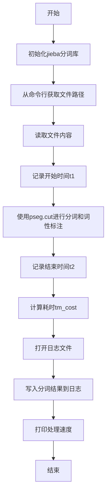
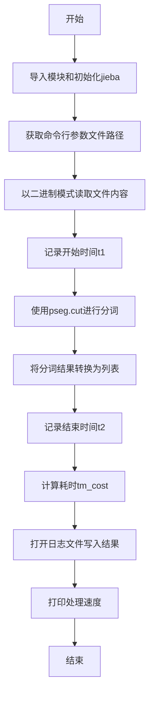

# `jieba\test\test_pos_file.py` 详细设计文档

这是一个使用jieba库对文本文件进行中文分词和词性标注的脚本，读取指定文件内容，进行分词处理，统计处理速度，并将分词结果写入日志文件。

## 整体流程



## 类结构

```
无类定义，纯脚本文件
```

## 全局变量及字段


### `url`
    
命令行参数传入的文件路径，用于指定待分词的文本文件

类型：`str`
    


### `content`
    
读取的原始文件内容，以二进制方式读取文本文件得到的字节数据

类型：`bytes`
    


### `t1`
    
分词开始时间戳，记录开始进行中文分词操作的时间点

类型：`float`
    


### `t2`
    
分词结束时间戳，记录完成中文分词操作的时间点

类型：`float`
    


### `tm_cost`
    
分词耗时，计算分词操作所消耗的时间长度（秒）

类型：`float`
    


### `words`
    
分词和词性标注结果列表，包含通过jieba分词后的词语及其词性标注对

类型：`list`
    


### `log_f`
    
日志文件对象，用于写入分词结果的日志文件句柄

类型：`file`
    


    

## 全局函数及方法


### 全局脚本流程

该脚本是一个命令行工具，用于对指定文本文件进行中文分词处理，计算分词速度并将结果写入日志文件。

参数：

- `sys.argv[1]`：`str`，命令行第一个参数，表示待分词的文本文件路径

返回值：`int`，脚本执行完毕返回0（正常结束）

#### 流程图



#### 带注释源码

```python
# 兼容Python 2的print函数
from __future__ import print_function
# 导入系统相关模块
import sys
# 导入时间模块用于计时
import sys.path.append("../")
# 导入jieba中文分词库
import jieba
# 初始化jieba词典
jieba.initialize()
# 导入jieba词性标注模块
import jieba.posseg as pseg

# 获取命令行第一个参数作为文件路径
url = sys.argv[1]
# 以二进制读取模式打开文件并读取全部内容
content = open(url,"rb").read()
# 记录分词开始时间
t1 = time.time()
# 使用词性标注分词并转换为列表
words = list(pseg.cut(content))

# 记录分词结束时间
t2 = time.time()
# 计算分词耗时
tm_cost = t2-t1

# 打开日志文件准备写入
log_f = open("1.log","w")
# 将分词结果用" / "连接并写入日志文件
log_f.write(' / '.join(map(str, words)))

# 打印处理速度：文件字节数/耗时秒数
print('speed' , len(content)/tm_cost, " bytes/second")
```

---

### 关键组件信息

| 名称 | 描述 |
|------|------|
| `jieba` | 中文分词第三方库，支持精确模式、全模式、搜索引擎模式 |
| `pseg.cut()` | jieba的词性标注分词方法，返回分词结果和词性 |
| `sys.argv` | 命令行参数列表，argv[0]为脚本名，argv[1]为第一个参数 |
| `time.time()` | 返回当前时间戳，用于性能计时 |

---

### 潜在的技术债务或优化空间

1. **文件路径安全风险**：直接使用命令行参数作为文件路径，未进行路径验证，可能存在路径遍历攻击风险
2. **资源未正确关闭**：打开的文件对象`log_f`未显式调用`close()`，应使用`with`语句管理
3. **错误处理缺失**：文件读取、jieba分词等操作均无异常捕获机制
4. **硬编码日志文件名**：日志文件名"1.log"硬编码，应考虑可配置
5. **二进制读取可能影响编码**：以"rb"模式读取，可能导致编码问题，应根据文件编码正确解码

---

### 其它项目

#### 设计目标与约束
- 目标：对中文文本文件进行分词并输出处理速度
- 约束：依赖jieba库，需保证jieba词典正确初始化

#### 错误处理与异常设计
- 缺少异常处理机制，建议添加：
  - 文件不存在或无读取权限的异常处理
  - jieba初始化失败的处理
  - 内存占用过大时的处理

#### 外部依赖与接口契约
- 依赖：`jieba>=0.42`（中文分词）
- 接口：接收一个命令行参数（文件路径），输出分词结果到1.log


## 关键组件


### 文件读取与内容获取

该组件负责从命令行接收文件路径，并读取文件内容作为后续分词的输入源，使用二进制模式读取以支持各种文件编码。

### jieba分词引擎初始化

该组件在程序启动时加载jieba字典和模型，实现惰性加载机制，确保分词器在使用前已完成必要的资源准备工作。

### 中文分词与词性标注

该组件使用jieba.posseg模块的cut方法对文本进行分词，同时为每个词语标注词性，实现了分词与词性标注的一体化处理流程。

### 性能测量与计算

该组件通过time模块记录分词操作的开始和结束时间，计算整个分词过程的耗时，并进一步计算处理速度（字节/秒）用于性能评估。

### 日志记录与输出

该组件负责将分词结果转换为字符串并写入日志文件，同时在控制台输出处理速度等性能指标，实现处理结果的可观测性。

### 命令行参数解析

该组件从sys.argv获取输入文件的路径作为程序参数，使程序能够通过命令行指定待处理的文件。


## 问题及建议


### 已知问题

- **资源未正确关闭**：文件读取和日志写入均未使用`with`语句或手动`close()`，可能导致资源泄漏
- **硬编码问题**：日志文件名“1.log”和路径`sys.path.append("../")`硬编码，缺乏灵活性和可配置性
- **错误处理缺失**：未检查命令行参数是否存在、文件是否可读、jieba初始化是否成功，程序可能在各种异常情况下崩溃
- **编码问题**：文件读取未指定编码（`open(url,"rb")`），不同操作系统下可能导致编码错误
- **内存问题**：`list(pseg.cut(content))`将所有分词结果加载到内存，大文件可能导致内存溢出
- **变量命名混淆**：变量名为`url`但实际存储的是文件路径，容易造成误解
- **Python 2/3兼容残留**：`from __future__ import print_function`表明代码可能源自Python 2迁移，但仍保留旧代码风格

### 优化建议

- 使用`with`语句管理文件资源，或在操作完成后显式调用`close()`
- 将日志路径、配置路径提取为配置文件或命令行参数
- 添加参数校验、文件存在性检查、异常捕获（try-except）等错误处理机制
- 明确指定文件编码为`utf-8`，如`open(url, "rb", encoding="utf-8")`
- 对于大文件，考虑分块读取或使用生成器进行流式处理
- 重命名变量`url`为`file_path`以准确表达其用途
- 移除不必要的Python 2兼容代码，统一使用Python 3语法

## 其它


### 设计目标与约束

本代码的主要设计目标是实现对中文文本文件的高效分词处理，支持词性标注功能。约束条件包括：输入必须是文件路径（通过命令行参数传入），输出为分词结果日志和处理速度统计。代码设计为单次处理模式，不支持批量处理或流式处理。

### 错误处理与异常设计

代码缺乏完善的错误处理机制，主要问题包括：未对命令行参数进行校验（未检查sys.argv长度），未处理文件读取异常（如文件不存在、权限不足），未处理编码异常（使用"rb"模式读取可能产生UnicodeDecodeError），未处理写入日志文件的异常，且jieba初始化失败时无降级策略。建议增加参数校验、文件存在性检查、异常捕获与日志记录机制。

### 数据流与状态机

数据流为线性流程：启动阶段（jieba库初始化）→ 输入读取阶段（从文件读取二进制内容）→ 处理阶段（分词计算）→ 输出阶段（写日志、打印性能指标）。状态机可简化为三个状态：初始化态（jieba加载）、执行态（分词处理）、完成态（结果输出），无错误恢复状态。

### 外部依赖与接口契约

主要外部依赖为jieba库，需要jieba.init()成功初始化。接口契约方面：输入接口接收命令行参数sys.argv[1]作为文件路径，返回接口为标准输出（print输出速度）和文件系统输出（1.log文件写入分词结果）。依赖版本方面未做版本约束，存在兼容风险。

### 性能考虑与优化空间

当前实现存在以下性能问题：一次性将整个文件读入内存（content变量），大文件场景下内存压力大；使用list()强制完整迭代分词结果，无法流式处理；文件写入使用单次write，可考虑缓冲；未使用多进程或多线程并行处理。建议优化方向：支持大文件流式处理、增加批处理能力、考虑使用jieba的cut_for_search支持更细粒度分词、添加缓存机制避免重复分词相同内容。

### 安全性考虑

代码存在以下安全风险：命令行参数直接用于文件路径open()，未做路径验证，存在路径遍历攻击风险（虽然实际场景中影响有限）；日志文件路径硬编码为"1.log"，可能被覆盖；未对输入内容进行安全过滤，分词结果直接写入日志可能造成日志注入。建议增加输入验证、参数化日志路径、输出内容过滤。

### 配置文件与参数设计

当前代码无独立配置文件，所有参数硬编码。值得配置化的参数包括：jieba字典路径（当前使用默认）、日志文件路径、输出分隔符、处理编码格式（当前默认二进制读取后由jieba自动处理）、性能阈值（当处理速度低于阈值时告警）。建议引入配置文件或命令行参数来管理这些可变量。


    