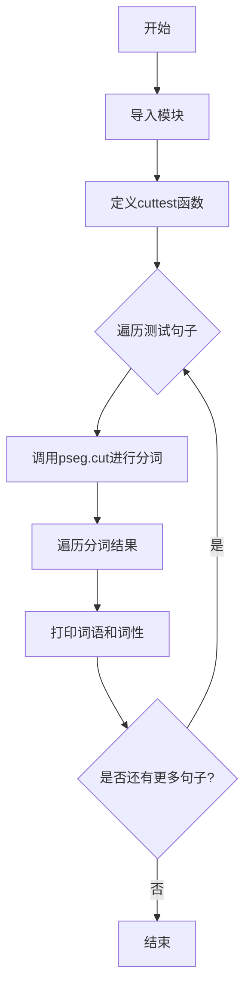
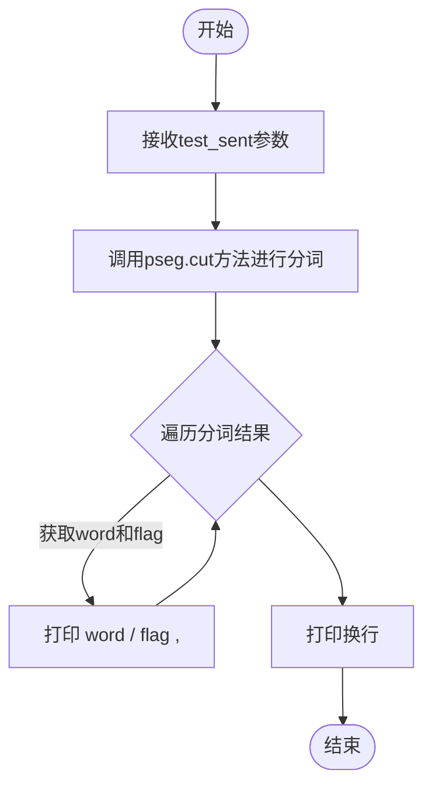

# `jieba\test\test_pos_no_hmm.py` 详细设计文档

该代码是一个使用jieba库进行中文分词和词性标注的测试程序，通过调用jieba.posseg模块的cut函数对多个中文句子进行分词处理，并打印每个词语及其对应的词性标签。

## 整体流程



## 类结构

```
模块: jieba.posseg (外部依赖)
└── cuttest 函数 (全局函数)
```

## 全局变量及字段


    

## 全局函数及方法


### `cuttest`

该函数是使用jieba分词库进行中文分词的测试函数，接收一个中文句子作为输入，调用jieba.posseg模块的cut方法进行词性标注分词，然后遍历分词结果并打印每个词语及其对应的词性标签。

参数：

- `test_sent`：`str`，要进行分词处理的中文输入句子

返回值：`None`，该函数无返回值，仅通过标准输出打印分词结果

#### 流程图



#### 带注释源码

```python
# encoding: utf-8
from __future__ import print_function  # 兼容Python 2的print语法
import sys
sys.path.append("../")  # 添加上级目录到系统路径，以便导入jieba模块
import jieba.posseg as pseg  # 导入jieba的词性标注模块

def cuttest(test_sent):
    """
    对输入的中文句子进行分词并打印词语及其词性
    
    参数:
        test_sent: str - 要进行分词的中文句子
    返回值:
        无返回值，结果直接打印到标准输出
    """
    # 使用pseg.cut进行分词，HMM=False关闭基于隐马尔可夫模型的未登录词识别
    result = pseg.cut(test_sent, HMM=False)
    
    # 遍历分词结果的每一个词及其词性
    for word, flag in result:
        # 打印词语、斜杠、词性、逗号，不换行（end=' '）
        print(word, "/", flag, ", ", end=' ')
    
    # 打印换行，结束当前句子的分词输出
    print("")


if __name__ == "__main__":
    # 测试用例：各种中文句子进行分词测试
    cuttest("这是一个伸手不见五指的黑夜。我叫孙悟空，我爱北京，我爱Python和C++。")
    cuttest("我不喜欢日本和服。")
    cuttest("雷猴回归人间。")
    cuttest("工信处女干事每月经过下属科室都要亲口交代24口交换机等技术性器件的安装工作")
    cuttest("我需要廉租房")
    cuttest("永和服装饰品有限公司")
    cuttest("我爱北京天安门")
    cuttest("abc")
    cuttest("隐马尔可夫")
    cuttest("雷猴是个好网站")
    cuttest("\"Microsoft\"一词由\"MICROcomputer（微型计算机）\"和\"SOFTware（软件）\"两部分组成")
    cuttest("草泥马和欺实马是今年的流行词汇")
    cuttest("伊藤洋华堂总府店")
    cuttest("中国科学院计算技术研究所")
    cuttest("罗密欧与朱丽叶")
    cuttest("我购买了道具和服装")
    cuttest("PS: 我觉得开源有一个好处，就是能够敦促自己不断改进，避免敞帚自珍")
    cuttest("湖北省石首市")
    cuttest("湖北省十堰市")
    cuttest("总经理完成了这件事情")
    cuttest("电脑修好了")
    cuttest("做好了这件事情就一了百了了")
    cuttest("人们审美的观点是不同的")
    cuttest("我们买了一个美的空调")
    cuttest("线程初始化时我们要注意")
    cuttest("一个分子是由好多原子组织成的")
    cuttest("祝你马到功成")
    cuttest("他掉进了无底洞里")
    cuttest("中国的首都是北京")
    cuttest("孙君意")
    cuttest("外交部发言人马朝旭")
    cuttest("领导人会议和第四届东亚峰会")
    cuttest("在过去的这五年")
    cuttest("还需要很长的路要走")
    cuttest("60周年首都阅兵")
    cuttest("你好人们审美的观点是不同的")
    cuttest("买水果然后来世博园")
    cuttest("买水果然后去世博园")
    cuttest("但是后来我才知道你是对的")
    cuttest("存在即合理")
    cuttest("的的的的的在的的的的就以和和和")
    cuttest("I love你，不以为耻，反以为rong")
    cuttest("因")
    cuttest("")
    cuttest("hello你好人们审美的观点是不同的")
    cuttest("很好但主要是基于网页形式")
    cuttest("hello你好人们审美的观点是不同的")
    cuttest("为什么我不能拥有想要的生活")
    cuttest("后来我才")
    cuttest("此次来中国是为了")
    cuttest("使用了它就可以解决一些问题")
    cuttest(",使用了它就可以解决一些问题")
    cuttest("其实使用了它就可以解决一些问题")
    cuttest("好人使用了它就可以解决一些问题")
    cuttest("是因为和国家")
    cuttest("老年搜索还支持")
    cuttest("干脆就把那部蒙人的闲法给废了拉倒！RT @laoshipukong : 27日，全国人大常委会第三次审议侵权责任法草案，删除了有关医疗损害责任\"举证倒置\"的规定。在医患纠纷中本已处于弱势地位的消费者由此将陷入万劫不复的境地。 ")
    cuttest("大")
    cuttest("")
    cuttest("他说的确实在理")
    cuttest("长春市长春节讲话")
    cuttest("结婚的和尚未结婚的")
    cuttest("结合成分子时")
    cuttest("旅游和服务是最好的")
    cuttest("这件事情的确是我的错")
    cuttest("供大家参考指正")
    cuttest("哈尔滨政府公布塌桥原因")
    cuttest("我在机场入口处")
    cuttest("邢永臣摄影报道")
    cuttest("BP神经网络如何训练才能在分类时增加区分度？")
    cuttest("南京市长江大桥")
    cuttest("应一些使用者的建议，也为了便于利用NiuTrans用于SMT研究")
    cuttest('长春市长春药店')
    cuttest('邓颖超生前最喜欢的衣服')
    cuttest('胡锦涛是热爱世界和平的政治局常委')
    cuttest('程序员祝海林和朱会震是在孙健的左面和右面, 范凯在最右面.再往左是李松洪')
    cuttest('一次性交多少钱')
    cuttest('两块五一套，三块八一斤，四块七一本，五块六一条')
    cuttest('小和尚留了一个像大和尚一样的和尚头')
    cuttest('我是中华人民共和国公民;我爸爸是共和党党员; 地铁和平门站')
    cuttest('张晓梅去人民医院做了个B超然后去买了件T恤')
    cuttest('AT&T是一件不错的公司，给你发offer了吗？')
    cuttest('C++和c#是什么关系？11+122=133，是吗？PI=3.14159')
    cuttest('你认识那个和主席握手的的哥吗？他开一辆黑色的士。')
    cuttest('枪杆子中出政权')
```


## 关键组件


### jieba.posseg 模块

jieba库的中文分词与词性标注模块，提供分词和词性标注功能

### cuttest 函数

核心分词测试函数，接收测试句子，使用pseg.cut进行分词和词性标注，然后打印结果

### pseg.cut 方法

jieba库的分词核心方法，接收待分词字符串和HMM参数，返回词-词性对生成器

### 测试语料

包含各种中文分词场景的测试句子，如普通中文句子、专业术语、英文混合、缩写等

### HMM 参数控制

控制是否使用隐马尔可夫模型进行新词发现，False表示关闭HMM

### 输出格式化

将分词结果格式化为"词性/词, "的形式输出，每个词用逗号分隔


## 问题及建议


### 已知问题

- **缺乏异常处理机制**：代码未对空字符串、None输入或jieba库异常进行捕获，可能导致运行时崩溃
- **测试用例硬编码**：所有测试句子直接写在if __name__ == "__main__"块中，无法通过外部配置或命令行参数指定测试输入
- **函数无返回值**：cuttest函数仅执行打印操作，不返回分词结果，限制了结果的二次利用和单元测试验证
- **路径依赖脆弱**：使用sys.path.append("../")相对路径依赖，脚本执行目录受限，移植性差
- **无单元测试覆盖**：缺少pytest/unittest等测试框架，无法自动化验证分词准确性
- **Python 2/3兼容性不完整**：虽然导入了print_function，但print语句语法未统一，且HMM参数含义未注释说明
- **代码无文档注释**：cuttest函数缺少docstring，后续维护者难以理解其用途和参数含义
- **重复代码模式**：主函数中大量重复调用cuttest，未通过循环或数据驱动方式简化

### 优化建议

- 为cuttest函数添加try-except异常处理，捕获空输入和库异常，并返回空列表或抛出自定义异常
- 将测试用例改为列表结构，通过循环遍历执行，支持从文件或命令行参数读取测试文本
- 修改cuttest函数返回分词结果列表，便于调用方处理和单元测试断言
- 使用绝对路径或基于__file__的路径计算方式，替代相对路径sys.path.append
- 编写pytest单元测试，验证不同输入的分词结果是否符合预期
- 为函数添加docstring，说明参数test_sent类型、返回值类型及HMM参数作用
- 将重复的测试调用重构为数据驱动模式，如使用for循环遍历测试用例列表
- 考虑添加简单的命令行参数解析（argparse），支持自定义分词模式和输出格式


## 其它


### 设计目标与约束

本代码的设计目标是演示jieba分词库的基本使用方法，验证分词和词性标注功能在不同中文文本场景下的效果。约束条件包括：使用Python 2和Python 3兼容写法（from __future__ import print_function），依赖jieba库，通过命令行直接运行进行测试。

### 错误处理与异常设计

代码未实现显式的错误处理机制。若输入为空字符串，jieba会返回空结果；若输入非字符串类型，可能抛出异常。建议增加输入类型检查、空值处理和异常捕获逻辑，提高代码健壮性。

### 数据流与状态机

数据流为：外部输入字符串 → cuttest函数 → pseg.cut分词 → 遍历结果 → 打印输出。无复杂状态机，为线性处理流程。

### 外部依赖与接口契约

外部依赖：jieba.posseg模块（pseg.cut函数）。接口契约：cuttest函数接收test_sent字符串参数，返回None（直接打印结果），调用pseg.cut(test_sent, HMM=False)进行分词，返回迭代器包含(word, flag)元组。

### 性能考虑与优化建议

当前代码为演示脚本，未考虑性能优化。pseg.cut的HMM参数设为False可禁用隐马尔可夫模型，提升部分场景性能。若处理大量文本，建议批量处理、缓存结果或使用并行机制。

### 安全考虑与权限控制

代码仅涉及本地文本处理，无安全风险。无用户权限控制需求。

### 配置与扩展性

当前硬编码了jieba的HMM=False参数。如需扩展，可将分词参数、输出格式、目标文件路径等配置化，支持命令行参数或配置文件管理。

### 测试策略与验证方法

当前通过main函数中的多个测试用例验证功能。建议增加单元测试覆盖：正常文本、边界条件（空字符串、单字符）、特殊字符、混合中英文等场景，验证分词准确性和词性标注合理性。

### 部署与运维指南

代码为独立脚本，部署简单。需确保目标环境安装jieba库（pip install jieba），Python版本兼容（2.7+或3.x）。可直接通过python脚本名运行。

### 版本兼容性与迁移策略

代码使用from __future__ import print_function实现Python 2/3兼容。jieba库需使用兼容版本。随着jieba版本更新，需关注API变化（如pseg.cut参数调整）。


    