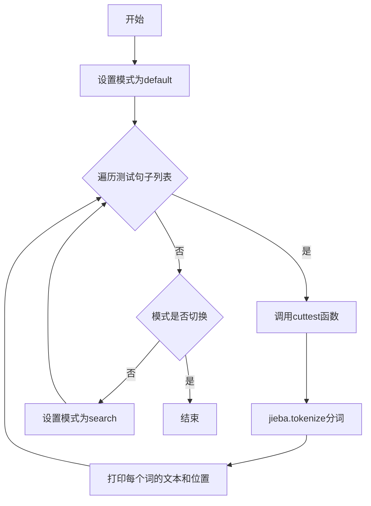
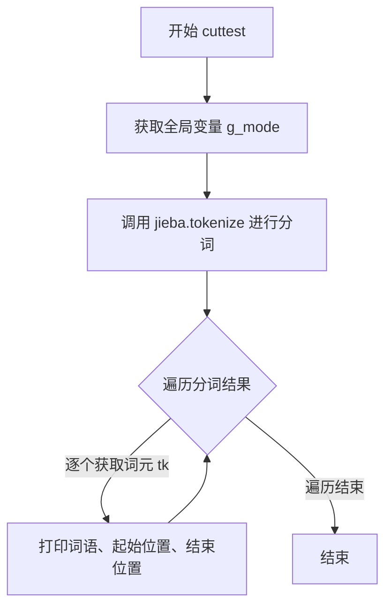
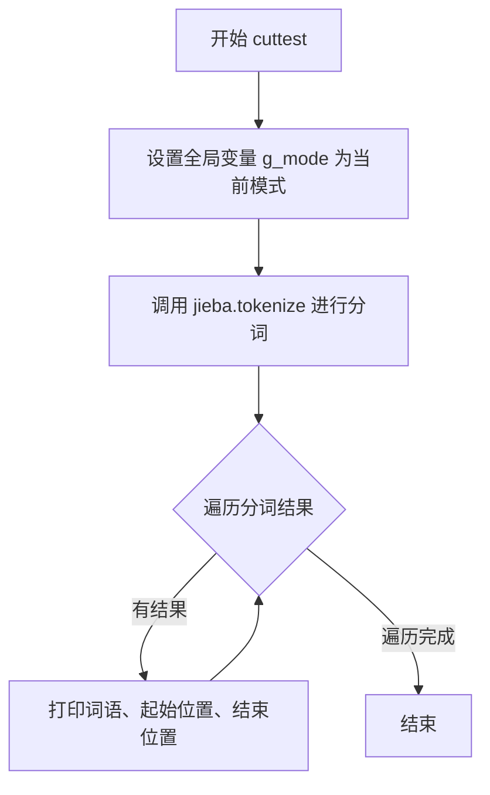

# `jieba\test\test_tokenize.py` 详细设计文档

该代码是一个基于jieba中文分词库的测试脚本，通过全局变量控制分词模式（默认模式和搜索模式），对多个中文句子进行分词处理，并打印每个词的文本、起始位置和结束位置，用于验证jieba分词库在不同模式下的分词效果。

## 整体流程



## 类结构

```
该代码无类层次结构，仅包含全局变量和全局函数
```

## 全局变量及字段


### `g_mode`
    
全局分词模式变量，用于指定jieba分词的模式，支持'default'和'search'两种模式

类型：`str`
    


    

## 全局函数及方法


### `cuttest`

该函数是中文分词测试函数，接收待分词的中文文本，通过jieba库的tokenize方法进行分词，并根据全局配置的模式（default或search）输出每个词语及其在原文中的起始和结束位置。

参数：

-  `test_sent`：`str`，要分词的中文文本字符串

返回值：`None`，该函数无返回值，仅通过print输出分词结果

#### 流程图



#### 带注释源码

```python
# 定义全局变量，用于控制分词模式（默认模式或搜索模式）
g_mode = "default"

def cuttest(test_sent):
    """
    中文分词测试函数
    
    该函数接收一个中文句子，使用jieba库进行分词，
    并打印每个词语及其在原文中的位置信息
    
    参数:
        test_sent: str, 要进行分词的中文文本
    返回值:
        None, 结果直接打印输出
    """
    # 声明使用全局变量g_mode，用于控制分词模式
    global g_mode
    
    # 调用jieba的tokenize方法进行分词
    # mode参数由全局变量g_mode控制，可选"default"(精确模式)或"search"(搜索引擎模式)
    result = jieba.tokenize(test_sent, mode=g_mode)
    
    # 遍历分词结果，result是一个生成器，包含每个词元(token)
    # 每个token是一个三元组: (词语, 起始位置, 结束位置)
    for tk in result:
        # 打印分词结果，格式为: word XXX start: X end: X
        print("word %s\t\t start: %d \t\t end:%d" % (tk[0], tk[1], tk[2]))
```

## 关键组件


### 全局模式变量 g_mode

控制分词模式的全局变量，用于在 default 和 search 两种分词模式间切换

### 分词测试函数 cuttest

调用 jieba.tokenize 对输入中文句子进行分词，遍历并打印每个词及其在原文中的起止位置

### 分词模式切换逻辑

在主循环中遍历 ("default","search") 两种模式，每次切换时更新全局变量 g_mode 后执行分词测试

### 中文分词核心引擎 jieba.tokenize

jieba 库提供的分词 API，返回一个生成器，包含每个词语及其在原文中的 start 和 end 位置索引


## 问题及建议


### 已知问题

- **全局变量滥用**：使用全局变量 `g_mode` 控制分词模式，导致代码逻辑分散，难以追踪状态变化，且在多线程环境下存在竞态条件风险
- **缺乏错误处理**：对输入参数 `test_sent` 未进行有效性验证（如 None、空字符串），可能导致运行时异常或未定义行为
- **硬编码测试数据**：所有测试句子直接写在主函数中，无法独立运行单个测试用例，不便于维护和扩展
- **函数无返回值**：`cuttest` 函数仅打印结果不返回分词结果，限制了函数的复用性，调用方无法进一步处理分词数据
- **路径处理不规范**：使用 `sys.path.append("../")` 相对路径方式添加依赖路径，依赖代码目录结构，移植性差
- **缺少文档注释**：函数和全局变量均无文档字符串（docstring），降低代码可读性和可维护性
- **未使用标准日志**：仅依赖 `print` 输出，未使用 `logging` 模块，无法灵活控制日志级别和输出目标
- **魔法字符串**：分词模式 `"default"` 和 `"search"` 以字符串形式硬编码，应提取为常量或枚举类
- **无单元测试**：代码未包含任何测试框架（如 pytest/unittest），无法保证功能正确性和回归测试

### 优化建议

- 消除全局变量，将 `g_mode` 作为 `cuttest` 函数的参数传入，提高函数纯度
- 添加输入验证：检查 `test_sent` 是否为有效字符串，对空字符串和 None 进行处理
- 将测试数据分离至外部配置文件（如 JSON/YAML）或使用 pytest 参数化测试
- 修改 `cuttest` 函数返回分词结果列表，保留打印逻辑作为可选功能
- 使用 `os.path` 或配置方式管理路径依赖，避免硬编码相对路径
- 为关键函数添加 docstring，说明功能、参数和返回值
- 引入 `logging` 模块替代 print，便于生产环境日志管理
- 定义常量类或枚举类型管理分词模式，避免字符串硬编码
- 编写单元测试，覆盖正常输入、边界条件（如空字符串、None）和异常输入

## 其它


### 一段话描述

该代码是一个基于jieba中文分词库的测试程序，通过调用jieba的tokenize方法对中文句子进行分词，支持默认模式和搜索模式两种分词策略，并输出每个词语及其在原文中的起始和结束位置，主要用于验证和演示jieba分词库对各类中文文本的处理能力。

### 文件的整体运行流程

1. 程序入口`if __name__ == "__main__":`首先设置全局变量`g_mode`为"default"
2. 进入循环遍历预设的测试句子列表（共约70个测试用例）
3. 对每个测试句子调用`cuttest`函数进行分词处理
4. `cuttest`函数内部调用`jieba.tokenize`获取分词结果迭代器
5. 遍历迭代器，使用print输出每个词语、起始位置和结束位置
6. 循环结束后，将`g_mode`切换为"search"模式
7. 重复步骤2-5，使用搜索模式对相同句子进行分词
8. 全部测试完成后程序结束

### 全局变量详细信息

#### g_mode

- **类型**：字符串（str）
- **描述**：全局分词模式控制变量，用于指定jieba分词的模式，可选值为"default"（精确模式）或"search"（搜索引擎模式），影响分词粒度和结果

### 全局函数详细信息

#### cuttest

- **参数名称**：test_sent
- **参数类型**：字符串（str）
- **参数描述**：待分词的中文或中英文混合句子
- **返回值类型**：None（无返回值）
- **返回值描述**：该函数直接将分词结果打印到标准输出，不返回任何值
- **mermaid流程图**：



- **带注释源码**：

```python
def cuttest(test_sent):
    """
    对输入的句子进行中文分词并打印结果
    
    参数:
        test_sent: str, 待分词的句子
    
    返回:
        None, 结果直接打印到标准输出
    """
    global g_mode  # 引用全局变量以获取当前分词模式
    # 调用jieba的tokenize方法进行分词，返回可迭代的token列表
    result = jieba.tokenize(test_sent, mode=g_mode)
    # 遍历每个分词结果并打印
    for tk in result:
        # tk是一个三元组 (词语, 起始位置, 结束位置)
        print("word %s\t\t start: %d \t\t end:%d" % (tk[0], tk[1], tk[2]))
```

### 关键组件信息

#### jieba.tokenize

- **名称**：jieba.tokenize
- **描述**：jieba库提供的分词方法，对给定句子进行中文分词，返回一个迭代器，每个元素为包含词语、起始索引和结束索引的三元组

#### jieba库

- **名称**：jieba中文分词库
- **描述**：开源的中文分词库，支持精确模式、搜索引擎模式、全模式等多种分词模式，是Python最常用的中文分词工具之一

### 潜在的技术债务或优化空间

1. **全局状态管理**：使用全局变量`g_mode`控制分词模式，违反了函数式编程的纯函数原则，增加了代码耦合度，难以进行单元测试
2. **硬编码测试数据**：所有测试句子直接写在代码中，应分离到独立的测试数据文件或使用测试框架管理
3. **缺乏错误处理**：代码未对空字符串、None输入、编码异常等情况进行处理
4. **重复计算**：两种模式对同一句子重复分词，没有缓存机制
5. **输出格式**：使用print直接输出，缺乏结构化输出（如JSON、XML），不利于后续自动化处理
6. **性能监控缺失**：没有分词性能统计和日志记录
7. **可配置性差**：模式切换、输出格式等都是硬编码，缺乏配置管理

### 设计目标与约束

- **设计目标**：演示jieba分词库的基本用法，验证不同分词模式对中文文本的处理效果
- **约束条件**：
  - 依赖jieba库，需确保环境中已安装
  - Python 2/3兼容（使用了`from __future__ import`）
  - 输入文本假定为UTF-8编码
  - 分词模式仅支持"default"和"search"两种

### 错误处理与异常设计

- **输入验证**：未对空字符串进行特殊处理，jieba.tokenize会返回空迭代器
- **编码异常**：假设输入为Unicode字符串，未处理编码错误
- **jieba库异常**：未捕获jieba可能的异常（如词典加载失败）
- **改进建议**：
  ```python
  def cuttest(test_sent):
      global g_mode
      if not test_sent or not isinstance(test_sent, str):
          print("Warning: Invalid input")
          return
      try:
          result = jieba.tokenize(test_sent, mode=g_mode)
          for tk in result:
              print("word %s\t\t start: %d \t\t end:%d" % (tk[0], tk[1], tk[2]))
      except Exception as e:
          print("Error during tokenization: %s" % str(e))
  ```

### 数据流与状态机

- **数据流**：
  ```
  测试句子列表 → cuttest函数 → jieba.tokenize处理 → 分词结果迭代器 → 格式化输出
  ```
- **状态机**：
  ```
  初始状态(g_mode="default") → 循环处理句子 → 切换到search模式 → 循环处理句子 → 结束
  ```
- **状态转换**：
  - 状态1：default模式分词
  - 状态2：search模式分词
  - 转换条件：所有句子分词完成后切换模式

### 外部依赖与接口契约

- **外部依赖**：
  - `jieba`库：核心分词功能，需提前安装
  - `sys`模块：Python标准库，用于修改sys.path
  - `__future__`模块：Python 2/3兼容支持
- **接口契约**：
  - `cuttest(test_sent)`：输入字符串，返回None
  - `jieba.tokenize(sequence, mode)`：输入字符串和模式，返回迭代器
  - 返回的迭代器元素为三元组：(word, begin, end)

### 性能考虑

- **时间复杂度**：O(n)，其中n为输入句子长度，jieba分词复杂度与文本长度线性相关
- **空间复杂度**：O(m)，m为分词结果数量，取决于句子本身的词汇数量
- **优化建议**：
  - 对于大量重复句子，可使用缓存机制
  - 批量处理多个句子时，可考虑并行化
  - 对于超长文本，可考虑分批处理

### 安全考虑

- **输入安全**：未对用户输入进行过滤，可能存在日志注入风险
- **路径安全**：使用了`sys.path.append("../")`，存在路径遍历风险
- **建议**：对用户输入进行验证，避免使用相对路径引用

### 配置管理

- **当前配置方式**：全局变量硬编码
- **改进建议**：
  - 使用配置文件（JSON/YAML）管理分词模式
  - 使用环境变量控制行为
  - 使用argparse处理命令行参数

### 测试策略

- **当前测试**：使用内置测试集验证分词效果
- **改进建议**：
  - 引入单元测试框架（pytest/unittest）
  - 分离测试数据到独立文件
  - 添加边界条件测试（空字符串、特殊字符、超长文本）
  - 添加性能基准测试

### 部署注意事项

- **环境要求**：Python 2.7+ 或 Python 3.x，需安装jieba库
- **安装方式**：`pip install jieba`
- **编码设置**：确保源代码文件保存为UTF-8编码
- **运行时**：直接运行脚本，无需额外配置

    