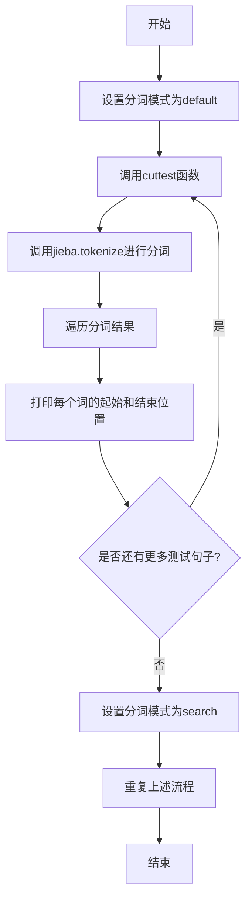
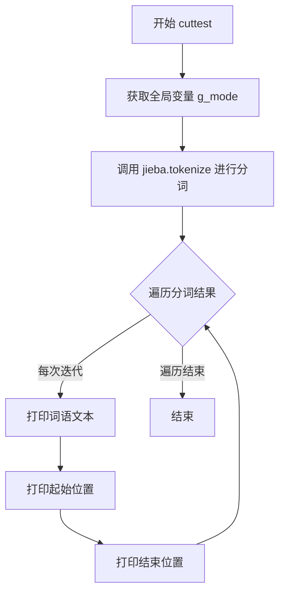

# `jieba\test\test_tokenize_no_hmm.py` 详细设计文档

该代码是一个中文分词工具的测试脚本，使用jieba库对多个中文句子进行分词测试，支持default和search两种分词模式，并通过全局变量g_mode控制分词模式的选择。

## 整体流程



## 类结构

```
该脚本为扁平结构，无类定义
仅包含全局变量和函数
```

## 全局变量及字段


### `g_mode`
    
全局变量，控制分词模式（default或search）

类型：`string`
    


    

## 全局函数及方法


### cuttest

接受中文字符串，使用jieba分词库进行分词测试，以指定模式（default或search）对输入句子进行分词，并打印每个词的文本、起始位置和结束位置。

参数：

- `test_sent`：`str`，待分词测试的中文字符串

返回值：`None`，无返回值，仅通过print输出分词结果

#### 流程图



#### 带注释源码

```python
#encoding=utf-8
# 引入Python 2/3兼容的print函数和unicode_literals
from __future__ import print_function,unicode_literals
import sys
# 将上级目录添加到系统路径，以便导入jieba模块
sys.path.append("../")
# 导入结巴中文分词库
import jieba

# 全局变量：分词模式，默认为"default"，可选"search"
g_mode="default"

def cuttest(test_sent):
    """
    对给定中文句子进行分词测试并打印结果
    
    参数:
        test_sent: str, 待分词的中文字符串
    
    返回值:
        None, 无返回值，结果直接打印到标准输出
    """
    # 引用全局变量g_mode，用于指定分词模式
    global g_mode
    # 调用jieba.tokenize进行分词，返回一个生成器
    # 参数test_sent: 待分词句子
    # 参数mode: 分词模式（default或search）
    # 参数HMM: 是否使用HMM模型进行新词发现
    result = jieba.tokenize(test_sent,mode=g_mode,HMM=False)
    # 遍历分词结果，每个tk是一个元组 (word, start, end)
    for tk in result:
        # 打印分词结果：词语、起始位置、结束位置
        print("word %s\t\t start: %d \t\t end:%d" % (tk[0],tk[1],tk[2]))
```


## 关键组件


### jieba 中文分词库

Python 中文分词库，支持精确模式、搜索引擎模式等多种分词策略

### cuttest 分词函数

核心分词执行函数，接受测试句子，使用全局模式进行分词并输出词位置信息

### g_mode 全局变量

控制 jieba 分词模式的全局变量，支持 "default"（精确模式）和 "search"（搜索引擎模式）两种值

### tokenize 方法

jieba 库的核心分词方法，返回分词结果迭代器，每个元素为 (词, 起始位置, 结束位置) 的元组

### 分词模式切换机制

通过循环遍历 "default" 和 "search" 两种模式，演示不同分词策略的效果差异

### 测试用例集

包含多样化中文句子集合，涵盖短句、长句、专业术语、成语、混合中英文等多种场景，用于全面测试分词效果


## 问题及建议


### 已知问题

-   使用全局变量g_mode控制分词模式，违反函数式编程最佳实践，降低了代码可测试性和可维护性
-   主程序块硬编码大量测试句子，代码冗长且不易扩展，测试用例与逻辑代码未分离
-   缺少异常处理机制，无法处理jieba库加载失败、输入异常或空输入等情况
-   缺少文档字符串（docstring），不利于代码阅读、维护和团队协作
-   使用print语句进行输出，无法灵活控制日志级别和输出目标，不利于生产环境部署
-   完全没有单元测试，无法保证分词功能的正确性和回归测试
-   缺少日志记录，无法追踪程序执行过程、排查问题和监控运行状态
-   未对jieba.tokenize的返回值进行None检查，如果返回None会导致运行时错误

### 优化建议

-   重构消除全局变量，将分词模式作为cuttest函数参数，或创建Tokenizer类封装状态和行为
-   将测试句子提取到列表或外部配置文件，通过循环遍历执行，实现数据与逻辑分离
-   添加try-except异常处理，捕获ImportError、TypeError等异常并给出友好提示
-   为cuttest函数和模块添加docstring，说明功能、参数、返回值和使用示例
-   使用logging模块代替print语句，配置日志格式、级别和输出目标（控制台/文件）
-   编写单元测试，使用pytest或unittest验证不同模式下的分词准确性
-   添加日志记录，记录程序启动、模式切换、关键操作和错误信息
-   在遍历tokenize结果前检查result是否为None或空


## 其它


### 设计目标与约束

本代码的核心目标是测试jieba中文分词库在两种不同分词模式（default默认模式、search搜索引擎模式）下的分词效果，通过遍历预设的大量中文测试句子来验证分词准确性。设计约束包括：依赖jieba库（版本无显式声明，通常需要>=0.42），需要Python 2.7+或Python 3.x环境支持，由于使用from __future__ import print_function,unicode_literals以兼容Python 2。

### 错误处理与异常设计

当前代码缺乏显式的错误处理机制。潜在的异常情况包括：jieba库未安装导致的ImportError、测试字符串编码异常、jieba.tokenize()方法参数不合法、测试句子为None或空导致的异常等。建议增加try-except块捕获Exception并输出友好错误信息，对空字符串和None进行前置校验。

### 数据流与状态机

数据流为：测试句子字符串输入 → 全局变量g_mode设置分词模式 → 调用jieba.tokenize()进行分词 → 遍历分词结果元组(token,start_pos,end_pos) → print输出。状态机较为简单：主循环遍历两种分词模式("default"→"search")，每种模式下依次对多个测试句子执行cuttest()函数，无复杂状态转换。

### 外部依赖与接口契约

外部依赖仅包含jieba库（第三方中文分词工具）和Python标准库（sys）。接口契约方面：cuttest(test_sent)函数接收str类型测试句子参数，无返回值（仅打印），全局变量g_mode为str类型控制分词模式。jieba.tokenize()返回生成器，每项为(word, start, end)三元组。

### 性能考虑

当前为测试脚本，性能非首要关注点。潜在优化点：jieba.tokenize()返回生成器已具备惰性计算特性，大批量测试时可考虑批量处理减少函数调用开销，分词结果可考虑缓存避免重复计算。

### 安全性考虑

代码无用户交互输入，无敏感数据处理，无SQL/命令注入风险，安全性风险较低。但生产环境中使用需注意：测试句子硬编码不可配置，jieba词典路径需确认可访问。

### 配置管理

当前配置通过全局变量g_mode硬编码管理，测试句子集合直接写在__main__代码块中。建议改进：测试句子可抽离至单独配置文件（如JSON/YAML），分词模式可通过命令行参数传入，jieba库初始化参数可配置化。

### 测试策略

采用穷举式测试用例覆盖，涵盖：短文本、中文长句、成语、人名地名、专业术语、混合中英文、中英文标点混合、多音字词、重复字、网络用语、特殊字符等场景。缺点是测试用例与代码耦合，无法自动化判定分词正确性，建议引入标注语料库进行自动化评估。

### 部署注意事项

部署环境需满足：Python解释器、jieba库（pip install jieba）、UTF-8编码支持。代码文件编码声明为UTF-8 (#encoding=utf-8)，但该声明仅对Python 2有效，Python 3默认UTF-8无需此声明。部署时需确保jieba词典文件可正常加载。

### 维护注意事项

代码结构简单，维护性较好。长期维护建议：将测试用例与测试逻辑分离，引入日志记录替代print便于调试，考虑增加单元测试框架支持，将硬编码的测试句子统一管理以便扩展。

### 版本兼容性说明

代码使用from __future__ import print_function,unicode_literals以兼容Python 2.7和Python 3。Python 2中sys.path.append("../")路径分隔符可能存在问题，Python 3无此问题。建议在Python 3环境下运行以获得更好支持。


    