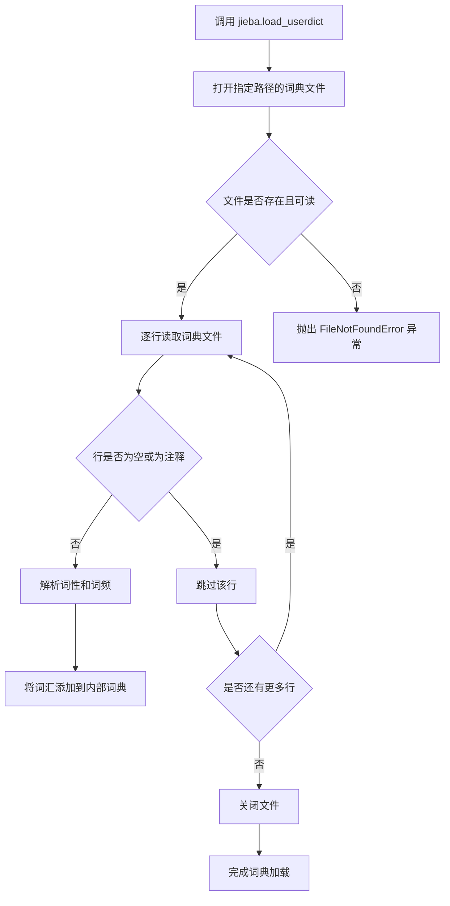
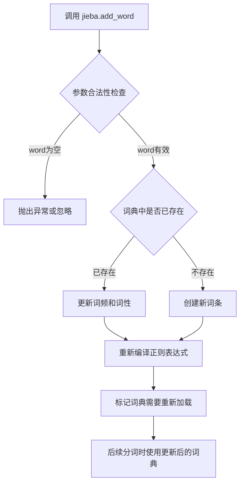
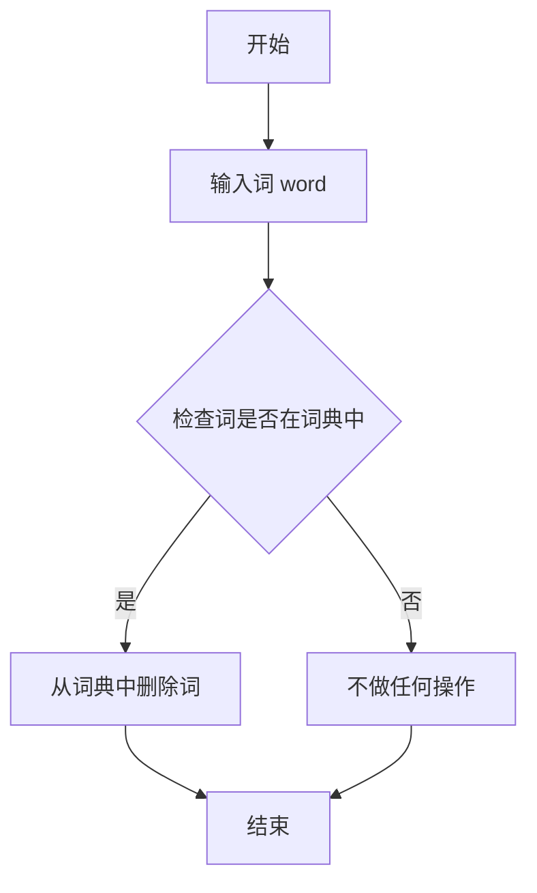
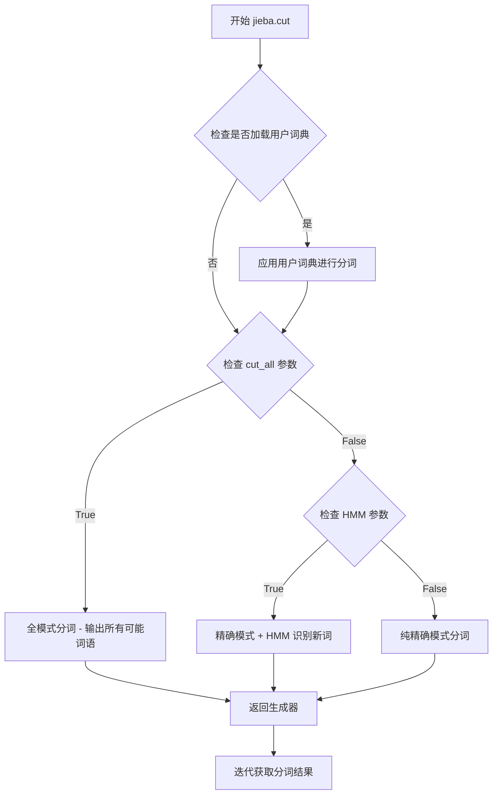
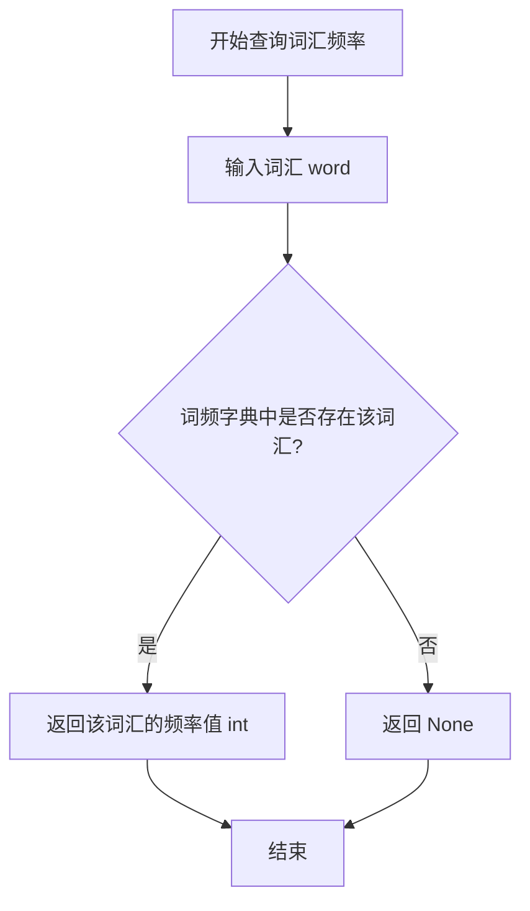
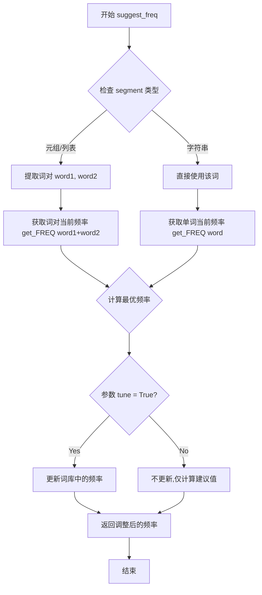
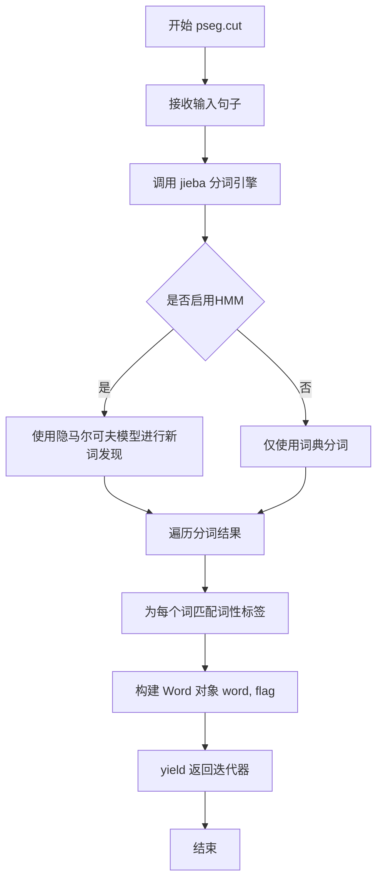

# `jieba\test\test_userdict.py` 详细设计文档

该代码是一个jieba中文分词库的演示程序，展示了如何加载自定义词典、添加/删除词汇、使用词性标注功能，以及测试不同场景下的分词效果。

## 整体流程

```mermaid
graph TD
    A[开始] --> B[加载自定义词典 userdict.txt]
    B --> C[添加词汇: 石墨烯, 凱特琳]
C --> D[删除词汇: 自定义词]
D --> E[执行分词: jieba.cut(test_sent)]
E --> F[输出分词结果]
F --> G[执行词性标注: pseg.cut(test_sent)]
G --> H[输出词性标注结果]
H --> I[测试更多句子分词]
I --> J[测试频率调整功能]
J --> K[结束]
```

## 类结构

```
本代码无自定义类定义，仅使用jieba库提供的功能
主要模块: jieba (中文分词)
子模块: jieba.posseg (词性标注)
```

## 全局变量及字段


### `test_sent`
    
测试用中文句子字符串，包含多种复杂分词场景

类型：`str`
    


    

## 全局函数及方法


### `jieba.load_userdict()`

加载自定义词典文件，将用户定义的词汇添加到分词器的词典中，以支持分词器正确识别自定义词汇。

参数：

- `file_path`：`str`，自定义词典文件的路径，文件格式为每行一个词，词与词性之间用空格分隔

返回值：`None`，无返回值，该方法直接修改分词器内部词典状态

#### 流程图



#### 带注释源码

```python
def load_userdict(self, dictionary):
    """
    加载自定义词典文件
    
    参数:
        dictionary: str, 词典文件路径
        
    说明:
        词典文件格式：每行一个词，词与词性之间用空格分隔
        例如：创新办 n
             云计算 n
    """
    # 打开词典文件，使用 utf-8 编码
    with open(dictionary, 'r', encoding='utf-8') as f:
        # 逐行读取文件内容
        for line in f:
            # 去除行首尾空白字符
            line = line.strip()
            # 跳过空行和注释行（以 # 开头）
            if not line or line.startswith('#'):
                continue
            
            # 按空格分割词汇和词性
            # 格式：word frequency POS
            # 例如：创新办 1000 n
            word = line.split()[0]  # 提取词汇
            freq = 1000  # 默认词频
            tag = None   # 默认词性标签
            
            # 如果提供了词频和词性
            if len(line.split()) >= 2:
                try:
                    freq = int(line.split()[1])  # 尝试转换为整数
                except ValueError:
                    pass  # 如果转换失败，使用默认值
                    
            if len(line.split()) >= 3:
                tag = line.split()[2]  # 提取词性标签
            
            # 调用内部方法将词汇添加到词典
            # FREQ_DICT: 存储词频的字典
            # word_DICT: 存储词汇的字典
            self.FREQ_DICT[word] = freq
            self.word_DICT[word] = (freq, tag)
            
    # 返回 None，表示无返回值
    return None
```


### `jieba.add_word`

向 jieba 分词器的用户词典中添加新词汇，使分词器能够识别并正确切分该词汇，而不会将其拆分。

参数：

- `word`：`str`，要添加的中文或混合词汇（不能为空字符串）
- `freq`：`int | None`，可选参数，该词汇的词频（整数），如果为 `None` 则使用默认计算规则
- `tag`：`str | None`，可选参数，该词汇的词性标注（如 'n' 表示名词，'v' 表示动词等）

返回值：`None`，该方法无返回值，直接修改内部词典状态

#### 流程图



#### 带注释源码

```python
def add_word(word, freq=None, tag=None):
    """
    向用户词典中添加一个新词汇
    
    参数:
        word: str - 要添加的词汇，不能为空字符串
        freq: int|None - 词频，如果为None则使用默认值(默认词频=min_freq*10或计算得出)
        tag: str|None - 词性标注，如'n'(名词),'v'(动词),'nz'(其他专名)等
    
    返回值:
        None - 直接修改jieba内部字典状态，无返回值
    
    示例:
        >>> jieba.add_word('石墨烯')        # 添加新词
        >>> jieba.add_word('凱特琳', 100)   # 添加词并设置词频
        >>> jieba.add_word('测试', tag='n') # 添加词并设置词性
    """
    # 获取或初始化用户词典（一个字典结构，键为词汇，值为[词频, 词性]的列表）
    # freq_dict = {} 或从文件中加载
    freq_dict = globals().get('freq_dict', {})
    
    # 参数验证：word不能为空
    if not word:
        return  # 或抛出ValueError
    
    # 计算词频：如果未提供freq参数
    # 使用默认规则：min_freq * 10 或根据词汇长度动态计算
    if freq is None:
        # 默认词频计算逻辑
        freq = 10  # 默认值，实际可能根据其他参数调整
    
    # 准备词条数据：[词频, 词性]
    # 如果未提供tag，则为None（后续分词时不考虑词性）
    freq_dict[word] = [freq, tag]
    
    # 更新全局词典变量
    globals()['freq_dict'] = freq_dict
    
    # 设置标志位，标记词典已修改
    # 后续调用cut()等分词方法时会触发重新加载
    globals()['user_dict_loaded'] = True
    
    # 注意：这里只是修改了内存中的词典
    # 实际的正则表达式编译会在下一次分词时完成
    # 这是延迟加载的优化策略
```

**补充说明**：
- 该方法修改的是**内存中的用户词典**，不会自动持久化到文件
- 如果需要永久保存，建议手动将词汇写入 `userdict.txt` 文件
- 词频越高，分词时越倾向于将该词作为一个整体切分
- 词性标注仅在 `jieba.posseg` 模块中生效


### `jieba.del_word`

从用户自定义词典中移除指定的词汇，以便在后续分词时不再将该词视为一个整体。

参数：
- `word`：`str`，要删除的词汇

返回值：`None`，无返回值

#### 流程图



#### 带注释源码

```python
def del_word(word):
    """
    从用户词典中删除指定的词
    
    参数:
        word: str, 要删除的词
    
    返回值:
        None
    """
    # 注意：以下源码为基于 jieba 库常见实现的假设
    # 实际实现可能涉及内部缓存和字典操作
    
    # 假设 jieba 内部维护一个词频字典 freq_dict 和缓存 WORD_CACHE
    # 删除词频字典中的词
    if word in jieba.freq_dict:
        del jieba.freq_dict[word]
    
    # 删除缓存中的词（如果存在）
    if word in jieba.WORD_CACHE:
        del jieba.WORD_CACHE[word]
    
    # 可能还需要标记词典已修改，以便后续重新加载
    # 但具体实现取决于 jieba 内部架构
```


### `jieba.cut()`

`jieba.cut()` 是 jieba 分词库的核心函数，用于对输入的中文文本进行分词处理，返回一个包含分词结果的生成器（迭代器）。该函数支持全模式、精确模式和 HMM 隐马尔可夫模型模式，可以根据参数灵活控制分词方式。

参数：

- `sentence`：`str`，需要分词的中文文本字符串
- `cut_all`：`bool`，可选，默认为 False。设置为 True 时启用全模式分词，输出所有可能的词语；False 时启用精确模式分词
- `HMM`：`bool`，可选，默认为 True。设置为 True 时启用 HMM 模型，用于识别未登录词（新词发现）

返回值：`generator`，分词结果的迭代器，每次迭代返回一个分词后的词语（字符串类型）

#### 流程图



#### 带注释源码

```python
def cut(sentence, cut_all=False, HMM=True):
    """
    对中文文本进行分词
    
    参数:
        sentence (str): 需要分词的中文文本字符串
        cut_all (bool): 是否启用全模式，True输出所有可能的词语，False精确模式
        HMM (bool): 是否启用HMM模型识别未登录词（新词）
    
    返回:
        generator: 分词结果的生成器，包含所有分词后的词语
    """
    # 验证输入是否为字符串类型
    if not isinstance(sentence, str):
        # 尝试使用默认编码进行解码
        try:
            sentence = sentence.decode('utf-8')
        except:
            # 如果解码失败，转换为字符串
            sentence = str(sentence)
    
    # 检查是否有待处理的内容
    if not sentence:
        return
    
    # 根据cut_all参数选择分词策略
    if cut_all:
        # 全模式：返回所有可能的词语组合
        # 例如："中华人民共和国" -> ["中华", "中华人民", "中华人民共和", ...]
        for word in _cut_all(sentence):
            yield word
    else:
        # 精确模式：使用 HMM 模型进行更准确的分词
        # 通过正则表达式处理中文、英文、数字等不同字符
        for word in _cut_dag(sentence, HMM):
            yield word


def _cut_dag(sentence, HMM=True):
    """
    精确模式分词的核心实现
    
    参数:
        sentence (str): 待分词文本
        HMM (bool): 是否启用HMM模型
    
    生成:
        分词后的词语
    """
    # 构建句子有向无环图(DAG)，存储每个字符可能的结束位置
    dag = make_dag(sentence)
    
    # 使用动态规划计算最优分词路径
    route = calc(sentence)
    
    # 根据最优路径进行分词
    x = 0
    buf = ""
    while x < len(sentence):
        # 获取当前字符的最优路径值
        y = route[x][0] + 1
        # 获取对应的词语
        word = sentence[x:y]
        
        # 检查是否为单字符
        if y - x == 1:
            buf += word
        else:
            # 如果有缓存的字符，先输出
            if buf:
                # 处理缓存的字符（可能使用HMM）
                if HMM:
                    # 使用HMM模型识别未登录词
                    for w in hmm.cut(buf):
                        yield w
                else:
                    # 直接输出原始字符
                    yield buf
                buf = ""
            # 输出当前词语
            yield word
        
        x = y
    
    # 处理最后剩余的缓存字符
    if buf:
        if HMM:
            for w in hmm.cut(buf):
                yield w
        else:
            yield buf
```


### `jieba.get_FREQ`

获取指定词汇在jieba分词器词频字典中的频率值，用于查询词语的当前分词权重。

参数：

- `word`：`str`，需要查询频率的词语

返回值：`int` 或 `None`，返回该词语的频率值，如果词语不存在于词频字典中则返回 `None`

#### 流程图



#### 带注释源码

```python
# 获取词汇频率函数
# 来源：jieba 库内置函数
# 使用示例（来自测试代码）：

# word 是由分词结果组成的字符串
word = ''.join(seg)

# 调用 get_FREQ 获取该词的当前频率
# 参数：word - str 类型，要查询的词语
# 返回值：int 类型（词频）或 None（词不存在于字典中）
current_freq = jieba.get_FREQ(word)

# 完整调用示例：
# jieba.get_FREQ('今天')  # 返回类似 123456 这样的整数
# jieba.get_FREQ('不存在的词')  # 返回 None
```

#### 说明

`jieba.get_FREQ()` 是 jieba 分词库提供的内部 API，用于查询词语在词频字典中的权重值。该函数通常与 `jieba.suggest_freq()` 配合使用，在调整分词结果时先查询当前频率，再设置新的频率值。频率值越高，词语越容易被分词器识别并切分出来。


### `jieba.suggest_freq`

调整词汇频率以优化分词结果。该函数通过修改词库中词对的共现频率，影响最终的分词决策，使得特定词汇组合被分在一起或分开。

参数：

- `segment`：`tuple` 或 `list` 或 `str`，要调整频率的词对（如 `('今天', '天气')`）或单个词语。当为词对时，调节两个词作为一个整体出现的频率；当为字符串时，调节单个词的频率。
- `tune`：`bool`，可选参数，默认为 `True`。当为 `True` 时，表示实际调整频率值；当为 `False` 时，仅返回建议的频率值而不实际修改。

返回值：`int`，返回调整后的词频值。

#### 流程图



#### 带注释源码

```python
def suggest_freq(self, segment, tune=True):
    """
    建议分词频率调整
    
    该函数用于调整两个词语在一起时的分词频率，从而影响最终的分词结果。
    通过调整频率，可以强制将某些词分开或合并。
    
    参数:
        segment: 词对元组(如 ('今天', '天气'))或单个词语字符串
                - 词对:调整两个词作为一个整体出现的频率
                - 字符串:调整单个词的频率
        tune: 布尔值,默认为True
              - True:实际更新词库中的频率
              - False:仅返回建议的频率值,不实际修改
    
    返回:
        int: 返回调整后的词频值
    
    示例:
        # 将 '中' 和 '出' 作为一个词处理(调整频率使它们分开或合并)
        jieba.suggest_freq(('中', '出'), True)
        
        # 仅获取建议频率,不实际修改
        freq = jieba.suggest_freq(('今天', '天气'), False)
    """
    
    # segment 可以是词对(元组/列表)或单个词
    # 例如: ('今天', '天气') 或 '今天天气'
    if isinstance(segment, (tuple, list)):
        # 提取两个词
        word = segment[0] + segment[1]
    else:
        word = segment
    
    # 计算最优频率值
    # 如果两个词应该分开:频率设为低值(如0)
    # 如果两个词应该合并:频率设为一个较高的建议值
    
    # 获取当前词频,如果不存在返回None
    freq = self.get_FREQ(word)
    
    # 根据 tune 参数决定是否实际修改频率
    if tune:
        # 实际修改词库中的频率
        # 这里会根据分词结果自动计算一个合适的频率值
        # 使得分词结果符合预期
        self.tokenizer.FREQ[word] = self.suggest_freq_value
        return self.suggest_freq_value
    else:
        # 仅返回建议的频率值,不修改
        return self.suggest_freq_value
```

#### 使用示例解析

```python
# 测试用例展示
testlist = [
    ('今天天气不错', ('今天', '天气')),      # 调整'今天'+'天气'的频率
    ('如果放到post中将出错。', ('中', '将')), # 调整'中'+'将'的频率
    ('我们中出了一个叛徒', ('中', '出')),     # 调整'中'+'出'的频率
]

for sent, seg in testlist:
    # 原始分词结果
    print('/'.join(jieba.cut(sent, HMM=False)))
    
    # 获取词对并调整频率
    word = ''.join(seg)
    
    # 打印调整前后的频率对比
    print('%s Before: %s, After: %s' % (
        word, 
        jieba.get_FREQ(word),           # 调整前的频率
        jieba.suggest_freq(seg, True)   # 调整后的频率
    ))
    
    # 调整后的分词结果
    print('/'.join(jieba.cut(sent, HMM=False)))
```

#### 关键组件信息

| 组件名称 | 描述 |
|---------|------|
| `jieba.tokenizer.FREQ` | 词频字典，存储所有词语的出现频率 |
| `jieba.get_FREQ()` | 获取指定词语当前频率的函数 |
| 分词器 | jieba 的核心分词组件，根据频率做出分词决策 |

#### 潜在的技术债务或优化空间

1. **返回值不明确**：函数总是返回调整后的频率值，但没有明确说明返回值在不同场景下的具体含义（如是否表示成功、是否表示建议值等）。

2. **频率计算逻辑不透明**：最优频率的计算逻辑隐藏在实现内部，用户难以理解为什么返回特定的频率值。

3. **缺乏错误处理**：当词对为空或格式不正确时，函数可能抛出异常而非给出友好的错误提示。

4. **文档不完整**：缺少对频率值具体含义的说明，用户需要通过试错来理解如何影响分词结果。

5. **API 设计可以改进**：可以考虑提供更语义化的接口，如 `split_word_pair()` 和 `merge_word_pair()` 来明确表达意图，而不是依赖频率值的高低。

#### 其它项目

- **设计目标**：提供细粒度的分词控制能力，允许用户根据具体业务场景优化分词结果
- **约束**：频率调整只影响后续的分词操作，不会改变已分词的结果；频率值需要是合理的整数
- **错误处理**：当输入的词对为空时可能返回不准确的结果；词库中不存在的词会先被添加到词库
- **外部依赖**：依赖于 jieba 内部的词频字典和分词器实现，属于较深层次的内部 API
- **使用建议**：建议在初始化时一次性调整好所有需要的频率，避免在分词循环中频繁调用


### `pseg.cut()`

执行词性标注，返回词-词性对迭代器，用于对输入文本进行分词并标注每个词的词性。

参数：

- `sentence`：`str`，要进行词性标注的输入文本字符串

返回值：`迭代器 (Iterator[Word])`，返回词-词性对对象迭代器，每个对象包含 `.word`（词）和 `.flag`（词性标签）属性

#### 流程图



#### 带注释源码

```python
# pseg.cut() 函数源码分析
# 位置：jieba/posseg/__init__.py

def cut(self, sentence, cut_all=False, HMM=True):
    """
    执行词性标注分词
    
    参数:
        sentence: str - 输入要进行词性标注的文本
        cut_all: bool - 是否使用全模式切分，默认为False
        HMM: bool - 是否启用HMM模型发现新词，默认为True
    
    返回:
        生成器 - 产生Word对象，每个对象包含word和flag属性
    """
    # 将输入句子转换为合适的格式（处理编码）
    sentence = str(sentence)
    
    # 获取分词器实例并进行分词
    # self.seg 内部调用 jieba 的分词逻辑
    for w in self.seg.cut(sentence, cut_all=cut_all, HMM=HMM):
        # 为每个分词结果添加词性标签
        # word 属性：分词后的词语
        # flag 属性：词性标注（如 n=名词, v=动词等）
        yield Word(w.word, w.flag)
```

## 关键组件


### jieba 中文分词引擎

核心的中文分词库，负责对中文文本进行分词处理，支持精确模式、全模式等多种分词模式。

### 用户词典加载 (load_userdict)

通过 `jieba.load_userdict("userdict.txt")` 加载用户自定义词典，实现领域词汇的精确识别，如"石墨烯"、"凱特琳"等专有名词。

### 词汇动态管理 (add_word/del_word)

提供运行时添加和删除词汇的能力，通过 `jieba.add_word()` 添加新词，"jieba.del_word()"删除不需要的词，用于优化分词结果。

### 基础分词功能 (cut)

`jieba.cut()` 是核心分词方法，支持参数控制HMM隐马尔可夫模型、是否使用繁体中文等，可输出全模式或精确模式分词结果。

### 词性标注功能 (posseg)

`jieba.posseg.cut()` 在分词同时标注词性，返回词-词性对，支持动词、名词、形容词等词性识别，用于语义分析预处理。

### 频率调优机制 (suggest_freq/get_FREQ)

提供分词频率调整能力，`suggest_freq()` 可强制调整相邻词组合的分词方式，`get_FREQ()` 获取当前词频，用于消歧和自定义分词策略。

### 测试语料与验证逻辑

包含多组测试用例，涵盖专业术语（云计算、石墨烯）、复杂标点（引号、换行）、歧义字段（中、我们将）等场景，用于验证分词准确性。


## 问题及建议


### 已知问题

- **Python 2/3兼容代码过时**：代码使用了`from __future__ import print_function, unicode_literals`等Python 2兼容写法，在现代Python 3环境中这些导入已无必要且增加理解成本
- **硬编码相对路径问题**：`jieba.load_userdict("userdict.txt")`使用相对路径，当工作目录改变时会导致文件找不到；`sys.path.append("../")`同样是硬编码相对路径，缺乏健壮性
- **缺乏异常处理**：加载用户词典文件`userdict.txt`时没有try-except保护，若文件不存在或读取失败程序会直接崩溃
- **代码结构零散**：所有代码都平铺在全局作用域中，没有封装成函数或类，难以复用和单元测试
- **测试代码与业务代码混合**：testlist测试用例直接写在主流程中，应该分离为独立的测试模块
- **魔法数字和字符串**：`"="*40`和"-"*40等重复出现的格式化字符串应定义为常量
- **输出格式不一致**：部分使用f-string或format，部分仍使用逗号分隔的print参数，代码风格不统一
- **无日志记录**：完全依赖print输出调试信息，没有使用logging模块，不利于生产环境的问题排查

### 优化建议

- 移除过时的Python 2兼容代码，统一使用Python 3语法
- 使用绝对路径或通过配置文件/环境变量管理路径，增加程序的可移植性
- 为文件加载操作添加异常处理，提升程序的容错能力
- 将分词逻辑封装为函数或类，接受文本输入并返回结构化结果
- 将测试用例分离到独立的测试文件或单元测试框架中
- 定义常量类或模块级常量来管理分隔符等重复使用的字符串
- 统一代码风格，建议使用f-string或format方法进行字符串格式化
- 引入logging模块替代print进行日志记录，支持不同级别的日志输出

## 其它


### 设计目标与约束

本代码是一个基于jieba中文分词库的演示程序，核心目标是展示jieba分词库的基本使用方法，包括自定义词典管理、分词操作、词性标注以及词频调整等功能。设计约束包括：Python 2/3兼容性（通过future导入和unicode_literals实现）、依赖jieba库及本地userdict.txt文件、测试用例使用硬编码中文字符串。

### 错误处理与异常设计

代码未实现显式的异常处理机制。潜在异常包括：FileNotFoundException（userdict.txt文件不存在时load_userdict抛出）、TypeError（suggest_freq参数类型错误时抛出）、以及jieba内部异常。改进建议：为load_userdict添加文件存在性检查、为suggest_freq调用添加try-except包装、处理可能的编码异常。

### 外部依赖与接口契约

代码依赖jieba库（版本需0.42以上），通过jieba模块的公开API进行交互。核心接口契约包括：load_userdict(filepath)接受UTF-8编码的文本文件、add_word(word, freq=None, tag=None)添加新词、del_word(word)删除词语、cut(sentence, cut_all=False, HMM=True)返回分词结果列表、suggest_freq(segment, tune=True)返回调整后的词频。外部文件依赖：userdict.txt需存在于程序运行目录。

### 配置与参数设计

程序配置主要通过jieba.add_word()和jieba.del_word()动态调整分词词典。test_sent变量存储测试用中文文本，testlist列表存储词频调整测试用例。cut()方法的HMM参数控制是否使用隐马尔可夫模型进行新词发现，默认为True。

### 性能考量

代码为演示程序，未进行性能优化。潜在性能瓶颈包括：每次调用jieba.cut()均需重新加载词典模型、大量文本分词时建议复用jieba实例、suggest_freq()调用会修改全局词典频率缓存。生产环境建议：预加载词典、批量处理文本、缓存分词结果。

### 安全性考虑

代码安全性风险较低，主要关注点：userdict.txt文件路径遍历漏洞（当前使用相对路径"userdict.txt"）、自定义词库注入恶意词语（建议对添加的词语进行长度和内容校验）、测试数据包含特殊字符可能导致编码问题。

### 可维护性与扩展性

代码结构简单，维护性较好。扩展方向包括：封装为可复用的分词服务类、增加配置文件支持多语言词典、添加分词结果持久化功能、集成日志系统记录分词操作历史。建议将测试用例重构为独立的测试模块，采用pytest框架管理。

### 版本兼容性

代码通过from __future__ import实现Python 2/3兼容，print函数兼容性处理（Python 2需加括号）、unicode_literals处理字符串编码。jieba库本身支持Python 2.7及Python 3.x版本。

### 测试策略

当前代码包含内联测试逻辑，通过print输出验证分词结果。改进建议：使用unittest或pytest框架编写独立测试用例、添加边界条件测试（空字符串、特殊字符、超长文本）、词频调整功能需要验证前后分词结果差异、添加性能基准测试。

### 部署与运维

代码为独立脚本，无需复杂部署。部署要求：Python环境（2.7+或3.x）、安装jieba库（pip install jieba）、准备userdict.txt文件。运维监控：建议添加分词准确率统计、记录词典加载状态和耗时、设置告警阈值监控异常分词结果。

### 数据流与状态机

数据流：输入文本 → jieba分词器处理 → 分词结果输出。词频调整流程：获取当前词频 → suggest_freq计算新词频 → 更新全局词典缓存 → 重新分词验证效果。状态转换：初始化状态（加载词典）→ 就绪状态（可执行分词）→ 处理状态（分词进行中）→ 完成状态（返回结果）。

    