# `jieba\test\test_whoosh.py` 详细设计文档

这是一个基于Whoosh全文搜索引擎和jieba中文分词器的索引创建与搜索演示程序，通过创建Schema、添加文档、执行查询来展示中英文全文检索功能

## 整体流程

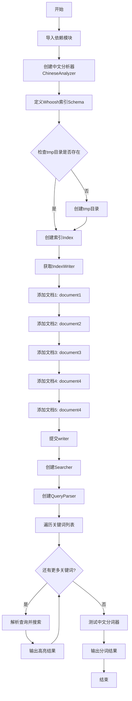

## 类结构

```
无面向对象类结构（纯脚本式实现）
```

## 全局变量及字段


### `analyzer`
    
中文分词分析器

类型：`ChineseAnalyzer实例`
    


### `schema`
    
Whoosh索引模式定义

类型：`Schema实例`
    


### `ix`
    
Whoosh索引对象

类型：`Index实例`
    


### `writer`
    
索引写入器

类型：`IndexWriter实例`
    


### `searcher`
    
搜索引擎实例

类型：`Searcher实例`
    


### `parser`
    
查询解析器

类型：`QueryParser实例`
    


    

## 全局函数及方法


### `create_in`

`create_in` 是 Whoosh 全文搜索引擎库中的一个核心函数，用于在指定目录下创建一个新的全文索引实例，并返回对应的 Index 对象供后续的文档添加、搜索等操作使用。

参数：

- `indexdir`：`str`，索引目录的路径，如果目录不存在会自动创建
- `schema`：`Schema`，定义索引的字段结构，包括字段名称、类型及存储选项
- `indexname`：`str`（可选），索引名称，默认为 "DEFAULT"
- `**kwargs`：其他可选参数，用于传递额外的索引配置

返回值：`Index`，返回创建的索引对象，用于执行文档添加、提交和搜索等操作

#### 流程图

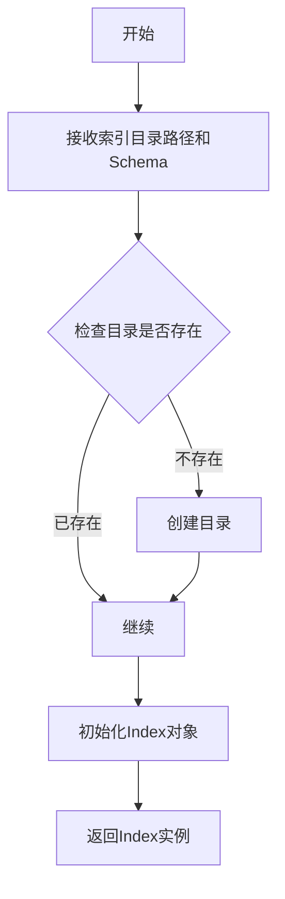

#### 带注释源码

```python
# 导入必要的模块
from whoosh.index import create_in, open_dir
from whoosh.fields import *
import os

# 定义索引Schema（模式），指定索引包含哪些字段及字段类型
# TEXT类型：支持全文搜索
# ID类型：作为唯一标识符
schema = Schema(
    title=TEXT(stored=True),      # 标题字段，可存储并支持全文搜索
    path=ID(stored=True),         # 路径字段，作为唯一标识符并存储
    content=TEXT(stored=True, analyzer=analyzer)  # 内容字段，使用中文分词器
)

# 确保索引目录存在
if not os.path.exists("tmp"):
    os.mkdir("tmp")

# 使用create_in函数创建新索引
# 参数1: "tmp" - 索引目录路径
# 参数2: schema - 索引结构定义
ix = create_in("tmp", schema)  # 返回Index对象

# 使用返回的Index对象创建writer来添加文档
writer = ix.writer()

# 添加文档到索引
writer.add_document(
    title="document1",
    path="/a",
    content="This is the first document we've added!"
)

# 提交所有更改到索引
writer.commit()

# 获取搜索器进行查询
searcher = ix.searcher()
```


### `whoosh.index.open_dir`

打开已存在的索引目录，返回一个可用于搜索的索引对象。该函数是Whoosh全文搜索引擎的核心组件之一，用于加载已创建的索引，而不是创建新索引。

参数：

- `indexdir`：`str`，索引目录的路径字符串，指定要打开的索引所在文件系统路径
- `**kwargs`：可选关键字参数，用于传递额外的配置选项，如`readonly=True`以只读模式打开索引

返回值：`Index`，返回打开的索引对象，可用于创建搜索器进行全文检索操作

#### 流程图

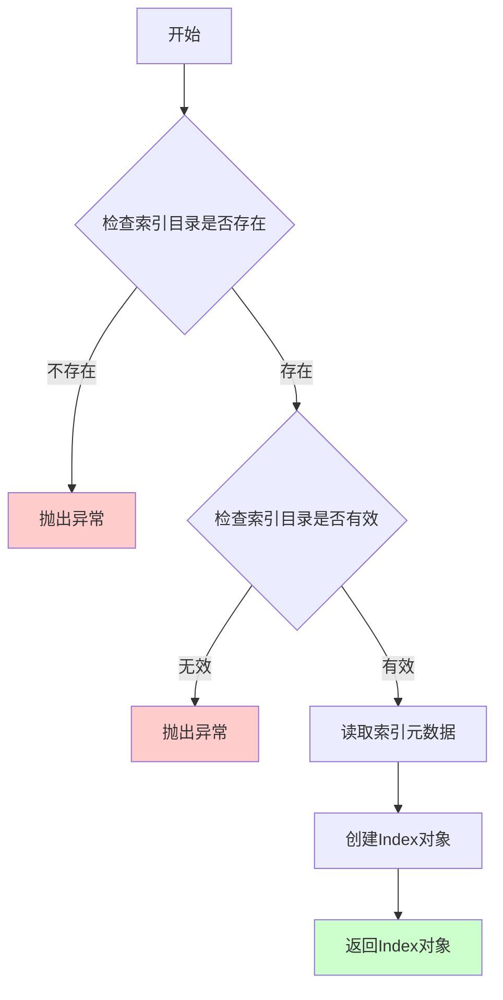

#### 带注释源码

```python
# whoosh.index.open_dir 函数源码示例
# 位置：whoosh/index/__init__.py

def open_dir(indexdir, **kwargs):
    """
    打开已存在的索引目录进行搜索操作
    
    参数:
        indexdir: 索引目录路径
        **kwargs: 可选参数
            - readonly: 布尔值，是否以只读模式打开
            - schema: 可选的Schema对象
            - bitread: 布尔值，是否使用位图读取优化
    
    返回:
        Index对象: 可用于搜索的索引实例
    """
    # 检查目录是否存在
    if not os.path.exists(indexdir):
        raise IndexNotFoundError("索引目录不存在: %s" % indexdir)
    
    # 检查是否为有效的索引目录（包含索引元数据文件）
    if not os.path.isfile(os.path.join(indexdir, "CURRENT")):
        raise IndexNotFoundError("无效的索引目录: %s" % indexdir)
    
    # 从磁盘读取索引元数据
    # CURRENT文件包含索引格式版本和段信息
    with open(os.path.join(indexdir, "CURRENT"), "rb") as f:
        version = f.readline().strip()
        # 解析版本信息和段文件名
    
    # 创建索引对象
    # 根据版本和段信息初始化索引
    ix = Index(indexdir, schema=None, readonly=kwargs.get('readonly', False))
    
    return ix

# 在示例代码中的使用方式
# ix = open_dir("tmp")  # 以读写模式打开
# ix = open_dir("tmp", readonly=True)  # 以只读模式打开（推荐用于搜索）
```

#### 在示例代码中的实际应用

```python
# 从whoosh.index模块导入open_dir函数
from whoosh.index import create_in, open_dir

# 创建索引（示例代码中使用）
ix = create_in("tmp", schema)  # 创建新索引

# 打开已存在的索引（注释中的用法）
# ix = open_dir("tmp")  # 打开索引用于搜索

# 使用打开的索引进行搜索
searcher = ix.searcher()  # 创建搜索器
parser = QueryParser("content", schema=ix.schema)  # 创建查询解析器

# 执行搜索
q = parser.parse("关键词")
results = searcher.search(q)
```

#### 关键说明

| 项目 | 说明 |
|------|------|
| **使用场景** | 当需要搜索已存在的索引时使用，而非创建新索引 |
| **只读模式** | 推荐在搜索场景中使用`readonly=True`参数，避免意外的写操作 |
| **异常处理** | 目录不存在或无效时会抛出`IndexNotFoundError` |
| **性能考虑** | 多次搜索时应复用同一个Index对象，避免重复打开索引 |


### 概述

该代码演示了如何使用Whoosh库构建一个支持中文全文搜索的索引系统，包括定义索引Schema结构、创建索引、添加文档、执行搜索查询以及使用jieba中文分词器进行文本分析的核心流程。

---

### 文件整体运行流程

```
┌─────────────────────────────────────────────────────────────────┐
│                        程序入口                                  │
└─────────────────────────┬───────────────────────────────────────┘
                          ▼
┌─────────────────────────────────────────────────────────────────┐
│  1. 模块导入                                                     │
│     - whoosh.index (create_in, open_dir)                       │
│     - whoosh.fields (Schema, TEXT, ID)                          │
│     - whoosh.qparser (QueryParser)                              │
│     - jieba.analyse.analyzer (ChineseAnalyzer)                 │
└─────────────────────────┬───────────────────────────────────────┘
                          ▼
┌─────────────────────────────────────────────────────────────────┐
│  2. 创建中文分词分析器 (ChineseAnalyzer)                         │
└─────────────────────────┬───────────────────────────────────────┘
                          ▼
┌─────────────────────────────────────────────────────────────────┐
│  3. 定义Schema索引结构 (核心步骤)                                │
│     - title: TEXT类型，可存储                                    │
│     - path: ID类型，可存储                                       │
│     - content: TEXT类型，可存储，使用中文分析器                   │
└─────────────────────────┬───────────────────────────────────────┘
                          ▼
┌─────────────────────────────────────────────────────────────────┐
│  4. 创建/打开索引目录                                            │
│     - 创建"tmp"目录                                             │
│     - 创建或打开索引                                             │
└─────────────────────────┬───────────────────────────────────────┘
                          ▼
┌─────────────────────────────────────────────────────────────────┐
│  5. 索引文档操作                                                │
│     - 创建Writer                                                 │
│     - 添加5个文档                                                │
│     - 提交更改                                                   │
└─────────────────────────┬───────────────────────────────────────┘
                          ▼
┌─────────────────────────────────────────────────────────────────┐
│  6. 搜索操作                                                    │
│     - 创建Searcher                                              │
│     - 创建QueryParser                                           │
│     - 循环搜索多个关键词                                         │
│     - 输出高亮结果                                               │
└─────────────────────────┬───────────────────────────────────────┘
                          ▼
┌─────────────────────────────────────────────────────────────────┐
│  7. 分词器测试                                                  │
│     - 对示例文本进行分词                                         │
│     - 输出分词结果                                               │
└─────────────────────────────────────────────────────────────────┘
```

---

### 类详细信息

#### 1. Schema类 (whoosh.fields)

**描述**：Whoosh的字段模式类，用于定义索引的文档结构

**字段详情**：

| 字段名 | 类型 | 描述 |
|--------|------|------|
| title | TEXT | 文档标题字段，支持全文搜索，可存储 |
| path | ID | 文档路径字段，精确匹配，可存储 |
| content | 文档内容字段 | 支持全文搜索和中文分词，可存储 |

**方法**：
- `__init__(*args, **kwargs)`：构造函数，创建字段模式

#### 2. ChineseAnalyzer类 (jieba.analyse.analyzer)

**描述**：基于jieba的中文分词分析器，用于文本分词处理

**方法**：
- `__call__(text)`：分词调用接口，返回分词迭代器

---

### 全局变量和全局函数详细信息

| 名称 | 类型 | 描述 |
|------|------|------|
| analyzer | ChineseAnalyzer | 中文分词分析器实例，用于content字段的中文分词 |
| schema | Schema | 索引结构定义对象，定义title、path、content三个字段 |
| ix | Index | Whoosh索引对象，用于文档索引和搜索 |
| writer | IndexWriter | 索引写入器，用于添加文档到索引 |
| searcher | IndexSearcher | 索引搜索器，用于执行搜索查询 |
| parser | QueryParser | 查询解析器，用于解析搜索关键词 |

---

### 核心函数/方法提取：Schema定义

#### Schema - 定义索引字段结构

**描述**：定义Whoosh全文搜索索引的字段结构，包括title（标题）、path（路径）、content（内容）三个字段，其中content字段使用jieba中文分析器支持中文分词检索。

**参数**：无（通过关键字参数定义字段）

**返回值**：`Schema`，返回定义的索引模式对象

#### 流程图

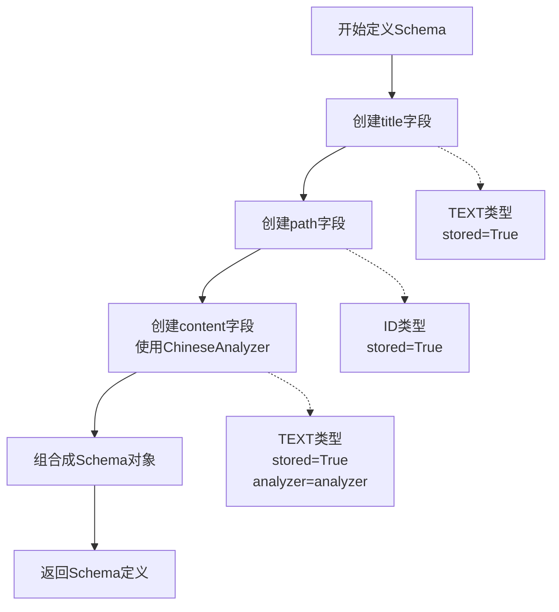

#### 带注释源码

```python
# 导入必要的Whoosh字段类型
from whoosh.fields import *

# 导入jieba中文分析器
from jieba.analyse.analyzer import ChineseAnalyzer

# 创建中文分词分析器实例
# 用于对content字段进行中文分词处理
analyzer = ChineseAnalyzer()

# 定义索引Schema结构 - 核心步骤
# Schema类用于定义索引中每个文档的字段结构
schema = Schema(
    # title字段: TEXT类型
    # - TEXT: 文本类型，支持全文搜索和分词
    # - stored=True: 搜索时返回原始内容
    title=TEXT(stored=True), 
    
    # path字段: ID类型
    # - ID: 标识符类型，精确匹配，不进行分词
    # - stored=True: 搜索时返回原始路径
    path=ID(stored=True), 
    
    # content字段: TEXT类型
    # - TEXT: 文本类型，支持全文搜索
    # - stored=True: 搜索时返回原始内容
    # - analyzer=analyzer: 指定中文分词分析器
    #   支持中文词语分割，提高中文检索准确性
    content=TEXT(stored=True, analyzer=analyzer)
)
```

---

### 关键组件信息

| 组件名称 | 一句话描述 |
|----------|------------|
| Whoosh | Python实现的纯Python全文搜索库，无需外部依赖如Solr或Elasticsearch |
| jieba | 最流行的中文分词库，支持精确模式、全模式和搜索引擎模式 |
| Schema | 定义索引文档的结构，包含字段类型和存储选项 |
| Index | Whoosh索引对象，管理文档的索引存储 |
| QueryParser | 将用户输入的查询字符串解析为Query对象 |
| ChineseAnalyzer | 结合Whoosh和jieba的中文分析器，处理中文分词 |

---

### 潜在的技术债务或优化空间

1. **错误处理缺失**：代码未包含任何异常处理机制（如try-except），索引创建、文档添加、搜索操作均可能失败
2. **硬编码路径**："tmp"目录路径硬编码，缺乏配置管理
3. **资源未释放**：searcher使用后未显式关闭，可能导致资源泄漏
4. **配置外部化**：索引路径、字段配置应抽取为配置文件或环境变量
5. **批量操作优化**：文档添加建议使用批量API（add_document可接受批量）
6. **日志缺失**：无任何日志记录，不利于生产环境排查问题
7. **单元测试缺失**：缺乏对索引功能、分词效果的单元测试
8. **索引更新机制**：仅演示了创建索引，未展示更新/删除文档的API使用

---

### 其它项目

#### 设计目标与约束
- **目标**：构建支持中文全文检索的本地文件系统索引
- **约束**：纯Python实现，无外部搜索引擎依赖
- **适用场景**：中小型文档检索系统、站内搜索

#### 错误处理与异常设计
- 目录创建可能失败（权限问题）
- 索引写入可能并发冲突
- 查询解析可能对特殊字符报错
- 建议添加：目录存在性检查、写入锁处理、查询异常捕获

#### 数据流与状态机
```
[文本输入] --> [分词分析] --> [索引构建] --> [倒排索引存储]
                                              ↓
[查询请求] --> [查询解析] --> [匹配计算] --> [结果排序] --> [高亮输出]
```

#### 外部依赖与接口契约
- **依赖库**：whoosh、jieba
- **输入**：任意中文/英文文本
- **输出**：搜索结果（title、path、content高亮片段）

#### 使用注意事项
- 索引创建后如需修改Schema，需要重新建索引
- 中文Analyzer必须配合jieba库使用
- stored=True会占用更多磁盘空间，但可返回原始内容
- 搜索结果默认返回前10条，可通过limit参数调整


### `TEXT (whoosh.fields.TEXT)`

TEXT字段类型是Whoosh库中用于存储和索引文本内容的字段类型，支持全文搜索和中文分词。

参数：

- `stored`：布尔值，默认为False，指定是否在索引中存储该字段的原始值
- `analyzer`：分析器对象，指定用于分词和分析文本的分析器，默认为Whoosh内置的分析器
- `scorable`：布尔值，默认为False，指定该字段是否用于评分计算
- `unique`：布尔值，默认为False，指定该字段值是否唯一

返回值：`FieldType`，返回TEXT字段类型对象，用于Schema定义

#### 流程图

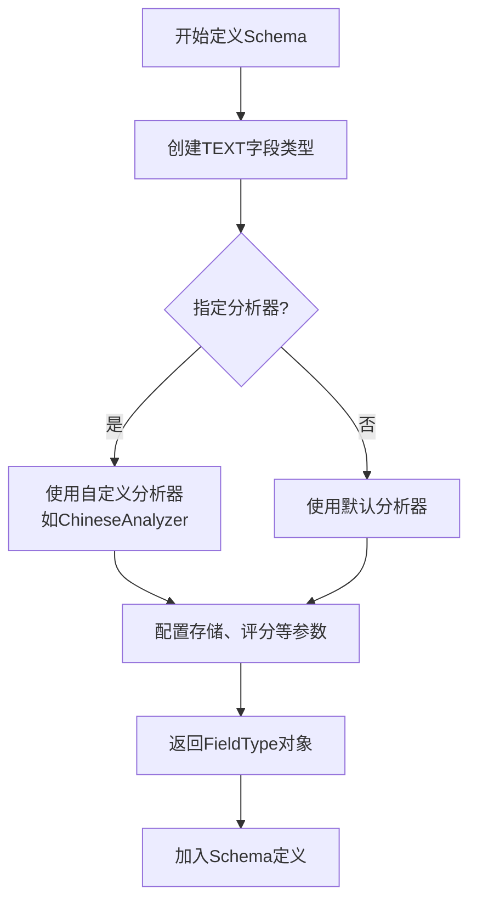

#### 带注释源码

```python
# -*- coding: UTF-8 -*-
from __future__ import unicode_literals
import sys,os
sys.path.append("../")

# 从whoosh.index导入创建和打开索引的函数
from whoosh.index import create_in,open_dir
# 从whoosh.fields导入各种字段类型定义，包括TEXT
from whoosh.fields import *
# 从whoosh.qparser导入查询解析器
from whoosh.qparser import QueryParser

# 导入jieba的中文分析器
from jieba.analyse.analyzer import ChineseAnalyzer

# 创建中文分析器实例
analyzer = ChineseAnalyzer()

# 定义搜索索引的Schema，包含三个TEXT字段
# title: 标题字段，stored=True表示存储原始值
# path: 路径字段，ID类型
# content: 内容字段，使用中文分析器，支持全文搜索
schema = Schema(
    title=TEXT(stored=True),           # TEXT字段：存储标题，可用于搜索
    path=ID(stored=True),              # ID字段：存储路径标识
    content=TEXT(stored=True, analyzer=analyzer)  # TEXT字段：存储内容，使用中文分词器
)

# 创建索引目录
if not os.path.exists("tmp"):
    os.mkdir("tmp")

# 创建新索引（如果已存在则覆盖）
ix = create_in("tmp", schema)

# 获取索引写入器
writer = ix.writer()

# 添加第一个文档
writer.add_document(
    title="document1",
    path="/a",
    content="This is the first document we've added!"
)

# 添加第二个文档（包含中英文内容）
writer.add_document(
    title="document2",
    path="/b",
    content="The second one 你 中文测试中文 is even more interesting! 吃水果"
)

# 添加第三个文档
writer.add_document(
    title="document3",
    path="/c",
    content="买水果然后来世博园。"
)

# 添加第四个文档
writer.add_document(
    title="document4",
    path="/c",
    content="工信处女干事每月经过下属科室都要亲口交代24口交换机等技术性器件的安装工作"
)

# 添加第五个文档
writer.add_document(
    title="document4",
    path="/c",
    content="咱俩交换一下吧。"
)

# 提交写入操作
writer.commit()

# 创建搜索器
searcher = ix.searcher()
# 创建查询解析器，解析content字段的查询
parser = QueryParser("content", schema=ix.schema)

# 遍历关键词进行搜索
for keyword in ("水果世博园","你","first","中文","交换机","交换"):
    print("result of ",keyword)
    # 解析查询关键词
    q = parser.parse(keyword)
    # 执行搜索
    results = searcher.search(q)
    # 打印高亮结果
    for hit in results:
        print(hit.highlights("content"))
    print("="*10)

# 使用中文分析器对文本进行分词
for t in analyzer("我的好朋友是李明;我爱北京天安门;IBM和Microsoft; I have a dream. this is intetesting and interested me a lot"):
    print(t.text)
```

### 整体运行流程

1. **初始化阶段**：导入所需库，创建中文分析器实例
2. **索引创建阶段**：定义Schema（包含TEXT字段），创建索引目录，获取写入器
3. **文档添加阶段**：使用`writer.add_document()`添加多个中英文文档到索引
4. **提交阶段**：调用`writer.commit()`将文档写入索引
5. **搜索阶段**：创建搜索器和查询解析器，对多个关键词进行搜索
6. **分词测试阶段**：使用中文分析器对示例文本进行分词测试

### 关键组件信息

| 组件名称 | 一句话描述 |
|---------|-----------|
| `ChineseAnalyzer` | jieba库提供的中文分词分析器，支持中文文本分词 |
| `Schema` | Whoosh索引的字段结构定义，定义了可索引的字段 |
| `ix.writer()` | 索引写入器，用于添加、更新、删除文档 |
| `QueryParser` | 查询解析器，将关键词解析为查询对象 |
| `searcher.search()` | 搜索引擎，执行查询并返回结果 |

### 潜在技术债务与优化空间

1. **错误处理缺失**：代码缺少异常处理机制，如文件权限问题、索引损坏等情况
2. **硬编码路径**："tmp"目录路径硬编码，缺乏配置灵活性
3. **索引模式固定**：注释中提到open_dir用于只读，但代码始终使用create_in创建新索引
4. **资源未释放**：searcher使用后未显式关闭，可能导致资源泄漏
5. **缺乏批量操作**：多次调用add_document效率较低，可使用批量添加优化

### 其它项目说明

**设计目标**：实现一个支持中文全文搜索的简单搜索引擎demo

**约束**：
- 依赖Whoosh和jieba库
- 需要UTF-8编码支持

**错误处理**：
- 当前实现无错误处理，生产环境需添加try-except块
- 目录创建使用了简单的exists检查和mkdir

**数据流**：
- 输入：文档数据（title, path, content）
- 处理：分词 → 索引 → 存储
- 输出：搜索结果（高亮显示的片段）

**外部依赖**：
- whoosh：全文搜索引擎库
- jieba：中文分词库


### `create_in`

创建Whoosh索引目录并返回索引对象

参数：

-  `index_dir`：`str`，索引存储的目录路径
-  `schema`：`<class 'whoosh.fields.Schema'>`，索引的模式定义

返回值：`<class 'whoosh.index.Index'>`，返回创建的索引对象

#### 流程图

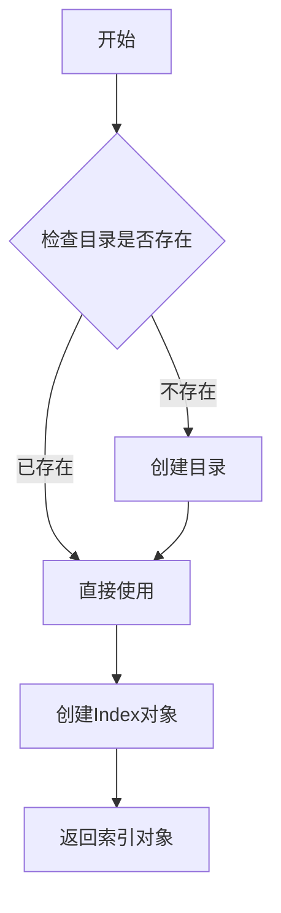

#### 带注释源码

```python
# -*- coding: UTF-8 -*-
from __future__ import unicode_literals
import sys,os
sys.path.append("../")

# 导入Whoosh相关模块
from whoosh.index import create_in,open_dir
from whoosh.fields import *
from whoosh.qparser import QueryParser

# 导入jieba中文分词器
from jieba.analyse.analyzer import ChineseAnalyzer

# 创建中文分析器实例
analyzer = ChineseAnalyzer()

# 定义索引模式：包含title、path和content三个字段
# TEXT表示文本字段，支持全文搜索；ID表示标识符字段
# stored=True表示该字段值会被存储在索引中
schema = Schema(title=TEXT(stored=True), path=ID(stored=True), content=TEXT(stored=True, analyzer=analyzer))

# 检查tmp目录是否存在，不存在则创建
if not os.path.exists("tmp"):
    os.mkdir("tmp")

# 使用create_in函数在tmp目录中创建新索引
# 第一个参数：索引目录路径
# 第二个参数：索引模式schema
ix = create_in("tmp", schema) # for create new index
#ix = open_dir("tmp") # for read only - 另一种打开索引的方式（只读）
```

---

### `Schema`

定义索引的字段结构

参数：

-  `title`：`<class 'whoosh.fields.TEXT'>`，文档标题，支持全文搜索，可存储
-  `path`：`<class 'whoosh.fields.ID'>`，文档路径，标识符字段，可存储
-  `content`：`<class 'whoosh.fields.TEXT'>`，文档内容，支持全文搜索，使用中文分析器，可存储

返回值：`<class 'whoosh.fields.Schema'>`，索引模式对象

#### 流程图

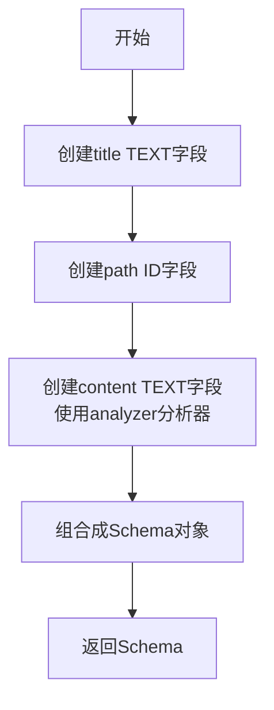

#### 带注释源码

```python
# Schema用于定义索引中每个文档的结构
# 语法：字段名=字段类型(参数)

# title字段：TEXT类型，stored=True表示该字段会被存储在索引中
# TEXT类型字段会进行分词处理，支持全文搜索
title=TEXT(stored=True),

# path字段：ID类型，用于存储唯一标识符（如URL、文件路径）
# ID类型不做分词，整个值作为一个整体进行索引
path=ID(stored=True),

# content字段：TEXT类型，使用ChineseAnalyzer进行中文分词
# analyzer参数指定用于分词的analysis对象
content=TEXT(stored=True, analyzer=analyzer)
```

---

### `writer.add_document`

向索引添加单个文档

参数：

-  `title`：`str`，文档标题
-  `path`：`str`，文档路径/标识
-  `content`：`str`，文档内容

返回值：`None`，该方法无返回值

#### 流程图

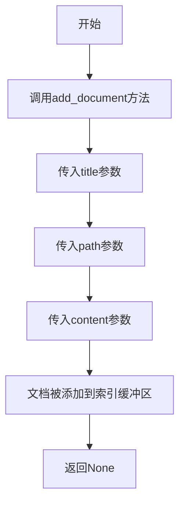

#### 带注释源码

```python
# writer对象用于添加文档到索引
# add_document方法将一个文档添加到索引缓冲区

# 添加第一个文档
writer.add_document(
    title="document1",     # 文档标题
    path="/a",             # 文档路径标识
    content="This is the first document we've added!"  # 文档内容
)

# 添加第二个文档 - 包含中英文内容测试
writer.add_document(
    title="document2",
    path="/b",
    content="The second one 你 中文测试中文 is even more interesting! 吃水果"
)

# 添加第三个文档 - 纯中文内容
writer.add_document(
    title="document3",
    path="/c",
    content="买水果然后来世博园。"
)

# 添加第四个文档 - 包含技术术语
writer.add_document(
    title="document4",
    path="/c",
    content="工信处女干事每月经过下属科室都要亲口交代24口交换机等技术性器件的安装工作"
)

# 添加第五个文档
writer.add_document(
    title="document4",
    path="/c",
    content="咱俩交换一下吧。"
)
```

---

### `writer.commit`

提交所有待索引的文档，将缓冲区中的数据写入磁盘

参数：无

返回值：`<class 'whoosh.indices.MultiplePostings'>` 或 `None`，返回写入的 postings 信息或无返回值

#### 流程图

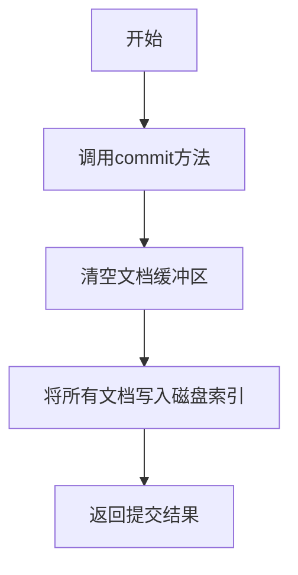

#### 带注释源码

```python
# commit方法将缓冲区中的所有文档正式写入索引
# 在调用commit之前，所有add_document的调用都只是在内存缓冲区中
# 必须调用commit()才能将数据持久化到磁盘
writer.commit()

# 提交后，索引已经包含所有添加的5个文档
# 后续的searcher搜索操作将能够找到这些文档
```

---

### `searcher.search`

在索引中执行搜索查询

参数：

-  `q`：`<class 'whoosh.searching.Query'>`，解析后的查询对象

返回值：`<class 'whoosh.searching.Results'>`，搜索结果对象，包含所有匹配的文档

#### 流程图

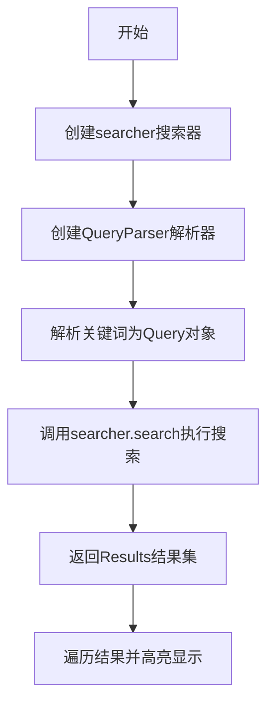

#### 带注释源码

```python
# 创建搜索器对象，用于执行搜索操作
searcher = ix.searcher()

# 创建查询解析器
# 第一个参数：要在哪个字段上搜索
# 第二个参数：索引模式
parser = QueryParser("content", schema=ix.schema)

# 遍历多个关键词进行搜索
for keyword in ("水果世博园","你","first","中文","交换机","交换"):
    print("result of ",keyword)
    
    # 使用parser解析关键词为Query对象
    q = parser.parse(keyword)
    
    # 执行搜索并返回结果
    results = searcher.search(q)
    
    # 遍历搜索结果
    for hit in results:
        # 使用highlights方法获取高亮显示的摘要
        print(hit.highlights("content"))
    
    print("="*10)
```

---

### `parser.parse`

将用户输入的关键词解析为Whoosh查询对象

参数：

-  `query_string`：`str`，用户输入的搜索关键词

返回值：`<class 'whoosh.searching.Query'>`，解析后的查询对象

#### 流程图

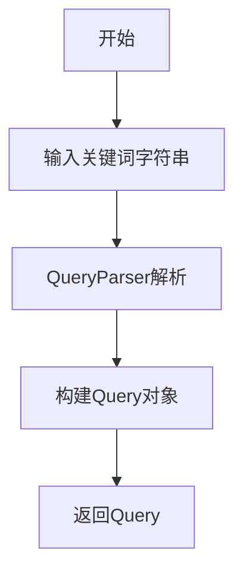

#### 带注释源码

```python
# QueryParser负责将用户输入的文本转换为Whoosh的Query对象
# Query对象包含了搜索的逻辑（如AND、OR、TERM等）

# 解析单个关键词
q = parser.parse(keyword)

# parser.parse会使用创建时指定的字段(content)和模式(ix.schema)
# 将关键词转换为可以在索引中执行的查询对象
# 例如："中文"会被转换为TermQuery("content", "中文")
```

---

### `analyzer`

使用jieba中文分词器对文本进行分词

参数：

-  `text`：`str`，需要分词的文本

返回值：`<class 'generator'>`，分词结果生成器，产生Token对象

#### 流程图

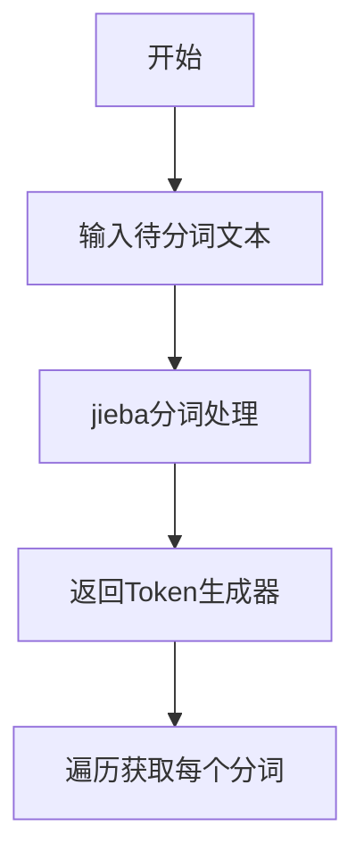

#### 带注释源码

```python
# analyzer是ChineseAnalyzer实例，用于中文分词
# 调用analyzer时传入文本，返回一个生成器

# 对包含中英文的文本进行分词测试
for t in analyzer("我的好朋友是李明;我爱北京天安门;IBM和Microsoft; I have a dream. this is intetesting and interested me a lot"):
    # 每个t是一个Token对象，包含text属性
    print(t.text)

# 分词结果示例：
# 我的 / 好朋友 / 是 / 李明 / ; / 我 / 爱 / 北京 / 天安门 / ; / IBM / 和 / Microsoft / ; / 
# I / have / a / dream / . / this / is / interesting / and / interested / me / a / lot
```

---

## 整体设计文档

### 1. 一句话描述

该代码实现了一个基于Whoosh和jieba的中文全文搜索引擎，支持对中英文文档进行索引和搜索，并能够对搜索结果进行高亮显示。

### 2. 文件的整体运行流程

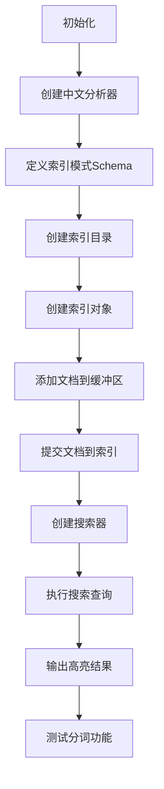

### 3. 类详细信息

| 类名 | 说明 |
|------|------|
| `ChineseAnalyzer` | jieba中文分词分析器，用于对中文文本进行分词处理 |
| `Schema` | Whoosh索引模式定义类，定义索引包含的字段 |
| `Index` | Whoosh索引对象，管理索引的创建、打开和操作 |
| `IndexWriter` | 索引写入器，用于添加、删除文档和提交更改 |
| `Searcher` | 索引搜索器，用于执行搜索查询 |
| `QueryParser` | 查询解析器，将关键词解析为Query对象 |

### 4. 全局变量信息

| 变量名 | 类型 | 描述 |
|--------|------|------|
| `analyzer` | `ChineseAnalyzer` | jieba中文分析器实例，用于中文分词 |
| `schema` | `Schema` | 索引模式定义，包含title、path、content三个字段 |
| `ix` | `Index` | Whoosh索引对象 |
| `writer` | `IndexWriter` | 索引写入器对象 |
| `searcher` | `Searcher` | 索引搜索器对象 |
| `parser` | `QueryParser` | 查询解析器对象 |

### 5. 关键组件信息

| 组件名称 | 一句话描述 |
|----------|------------|
| Whoosh索引系统 | Python开源全文搜索库，提供完整的索引和搜索功能 |
| jieba中文分词 | 最流行的中文分词库，支持精确模式、全模式和搜索引擎模式 |
| Schema定义 | 定义索引的字段结构，决定哪些内容被索引和存储 |
| QueryParser | 将用户输入的搜索关键词解析为结构化查询对象 |
| 高亮显示 | 将搜索结果中的匹配关键词以高亮形式展示 |

### 6. 潜在技术债务和优化空间

1. **错误处理缺失**：代码没有对文件操作、索引操作进行异常捕获
2. **硬编码路径**：索引目录路径"tmp"硬编码，应使用配置文件
3. **资源未释放**：searcher对象使用后未显式关闭
4. **无批量操作优化**：大量文档添加时建议使用writer的commit合并策略
5. **无索引更新机制**：缺少更新和删除文档的功能
6. **无分词器配置**：分析器使用默认配置，未针对特定场景调优

### 7. 其它项目

#### 设计目标与约束
- 支持中英文混合文本的全文搜索
- 使用jieba保证中文分词准确性
- 索引结果可高亮显示

#### 错误处理与异常设计
- 当前代码缺少try-except保护
- 建议添加：文件目录创建失败、索引创建失败、搜索异常等处理

#### 数据流与状态机
```
空闲状态 → 创建索引 → 添加文档 → 提交状态 → 搜索状态 → 结果展示
```

#### 外部依赖与接口契约
- `whoosh`库：索引和搜索核心功能
- `jieba`库：中文分词
- 依赖版本建议：whoosh>=2.7.0, jieba>=0.42


### `QueryParser`

QueryParser是whoosh库的查询解析器构造函数，用于创建一个查询解析器实例，该实例可以将用户输入的查询字符串解析为whoosh的查询对象，以便在索引中进行搜索。

参数：

- `fieldname`：`str`，要查询的字段名称，指定在哪个字段上进行搜索
- `schema`：`Schema`，索引的schema定义，定义了在搜索时使用的字段和字段类型
- `group`：`Group`，可选，分组方式，默认为AndGroup（所有条件都满足）
- `restrict`：`set`，可选，限制搜索的文档范围
- `boost`：`float`，可选，查询权重提升值，默认为1.0
- `cache`：`bool`，可选，是否启用查询缓存，默认为True
- `splitting`：`bool`或`None`，可选，控制查询分词行为

返回值：`QueryParser`，返回创建的查询解析器实例，用于调用parse()方法解析查询字符串

#### 流程图

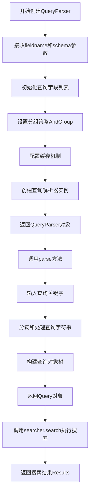

#### 带注释源码

```python
# 创建查询解析器实例
# 参数1: "content" - 指定要搜索的字段名
# 参数2: schema=ix.schema - 使用索引的schema定义
parser = QueryParser("content", schema=ix.schema)

# 使用示例：
for keyword in ("水果世博园","你","first","中文","交换机","交换"):
    print("result of ",keyword)
    
    # parse方法将字符串查询解析为Query对象
    q = parser.parse(keyword)
    
    # searcher.search执行搜索并返回结果
    results = searcher.search(q)
    
    # 遍历搜索结果并打印高亮显示的内容
    for hit in results:
        print(hit.highlights("content"))
    print("="*10)
```

#### 内部实现原理（参考whoosh源码）

```python
# whoosh/qparser/queryparser.py 中的核心逻辑简化

class QueryParser(object):
    def __init__(self, fieldname, schema, group=AndGroup, restrict=None, 
                 boost=1.0, cache=True, splitting=None):
        """
        构造函数初始化
        
        参数:
            fieldname: str 或 list - 搜索字段名
            schema: Schema - 索引模式定义
            group: Group - 多条件组合策略
            restrict: set - 搜索范围限制
            boost: float - 权重系数
            cache: bool - 是否缓存
            splitting: bool - 分词策略
        """
        # 将字段名转换为列表
        if isinstance(fieldname, str):
            self.fieldnames = [fieldname]
        else:
            self.fieldnames = fieldname
            
        self.schema = schema  # 保存schema引用
        self.group = group    # 保存分组策略
        self.restrict = restrict
        self.boost = boost
        self.cache = cache if cache is not None else {}
        self.splitting = splitting
        
        # 初始化分析器
        self.analyzer = self.schema[self.fieldnames[0]].analyzer
        
    def parse(self, query_string):
        """
        解析查询字符串为Query对象
        
        参数:
            query_string: str - 用户输入的查询关键字
            
        返回值:
            Query - whoosh查询对象树
        """
        # 1. 预处理查询字符串
        # 2. 使用分析器分词
        # 3. 构建查询节点树
        # 4. 返回组合的查询对象
        pass
```


### `ChineseAnalyzer`

ChineseAnalyzer 是 jieba 库中的中文分析器类构造函数，用于创建中文文本分词分析器实例，支持对中英文混合文本进行分词处理。

参数：

- 该构造函数无参数

返回值：`ChineseAnalyzer` 对象，返回一个中文分析器实例，用于后续的文本分词操作。

#### 流程图

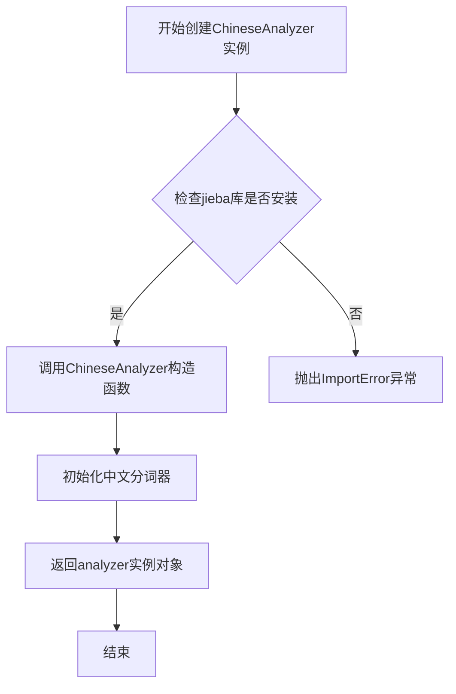

#### 带注释源码

```python
# 从jieba库的中文分析器模块导入ChineseAnalyzer类
from jieba.analyse.analyzer import ChineseAnalyzer

# 创建ChineseAnalyzer实例 - 构造函数调用
# 参数: 无参数
# 返回值: ChineseAnalyzer实例对象
analyzer = ChineseAnalyzer()

# 使用analyzer对文本进行分词
# analyzer是一个可迭代对象，返回分词结果
for t in analyzer("我的好朋友是李明;我爱北京天安门;IBM和Microsoft; I have a dream. this is intetesting and interested me a lot"):
    print(t.text)
```

## 关键组件


### 核心功能概述

该代码使用Whoosh全文搜索引擎和Jieba中文分词库，构建了一个支持中英文的全文搜索索引系统，演示了文档索引创建、关键词搜索、搜索结果高亮显示以及中文分词的基本功能。

### 文件运行流程

1. 导入所需模块和库
2. 初始化中文分析器（ChineseAnalyzer）
3. 创建Search Schema，定义索引字段结构
4. 创建或打开索引目录"tmp"
5. 获取索引写入器，添加多个中英文文档
6. 提交文档到索引
7. 创建搜索器和查询解析器
8. 循环执行多个关键词搜索并打印高亮结果
9. 测试中文分词器功能并输出分词结果

### 关键组件信息

#### 1. Whoosh索引系统
Whoosh是一个纯Python实现的全文搜索引擎，提供了索引创建、文档管理和搜索功能。

#### 2. Schema定义
定义了索引的字段结构，包括title（标题）、path（路径）和content（内容）三个字段，其中content字段使用中文分析器进行分词。

#### 3. ChineseAnalyzer
来自jieba.analyse.analyzer的中文分析器，支持中英文混合分词，是索引中文文档和搜索的基础。

#### 4. 文档索引流程
包括创建索引写入器、添加文档、提交索引的完整流程。

#### 5. 查询解析与搜索
使用QueryParser解析关键词，执行搜索并通过highlights方法实现搜索结果高亮显示。

### 潜在技术债务与优化空间

1. **硬编码配置问题**：索引路径、Schema定义等均为硬编码，缺乏灵活的配置管理
2. **错误处理缺失**：文件操作、索引操作均未做异常处理，可能导致程序中断
3. **索引更新机制**：代码注释显示有open_dir选项但未实现，需要手动切换索引打开方式
4. **搜索功能单一**：仅支持基础查询，缺少高级搜索功能（如模糊匹配、权重调整）
5. **文档路径重复**：添加文档时出现path="/c"重复两次的情况，可能导致文档覆盖
6. **资源未释放**：搜索器使用后未显式关闭，存在资源泄漏风险
7. **分词器应用局限**：分词器仅在索引时使用，搜索时未应用相同的分析器，可能导致搜索结果不准确

### 其它项目

#### 设计目标与约束
- 目标：演示Whoosh全文搜索和Jieba中文分词的基本用法
- 约束：纯Python实现，无需额外编译库

#### 错误处理与异常设计
- 缺少对文件操作、索引创建、文档添加等关键步骤的异常捕获
- 建议添加try-except块处理可能的IOError、IndexError等异常

#### 数据流与状态机
- 数据流：文档→分析器分词→索引写入器→索引存储→查询解析→搜索匹配→结果返回
- 状态机：初始化→索引创建→文档添加→索引提交→搜索就绪

#### 外部依赖与接口契约
- 依赖：whoosh库（全文搜索）、jieba库（中文分词）
- 接口：add_document()添加文档、commit()提交索引、search()执行搜索


## 问题及建议


### 已知问题

- **缺少异常处理**：代码未对文件操作、索引创建、文档添加和搜索等关键操作进行try-except包装，缺乏对OSError、Whoosh异常等潜在错误的捕获
- **资源未及时释放**：searcher对象使用后未显式关闭，writer对象也未使用with语句确保资源释放，可能导致资源泄漏
- **硬编码配置问题**：索引目录路径"tmp"、schema定义、测试文档内容均硬编码，配置缺乏灵活性和可维护性
- **索引覆盖风险**：每次运行都使用create_in创建新索引，会无条件覆盖已存在的索引数据，缺乏索引存在性检查
- **sys.path相对路径依赖**：通过sys.path.append("../")添加路径的方式依赖运行目录，不够稳健
- **代码无封装**：所有代码处于全局作用域，未封装为可复用的类或函数，不利于测试和维护
- **路径安全漏洞**：os.path.exists和os.mkdir未进行充分的路径安全校验，可能存在路径注入风险

### 优化建议

- **添加异常处理**：为文件操作、索引写入、搜索查询等关键路径添加try-except-finally块，确保资源在异常情况下也能正确释放
- **使用上下文管理器**：使用with ix.writer() as writer和with ix.searcher() as searcher确保资源自动释放
- **配置外部化**：将索引路径、schema定义等配置提取到配置文件或环境变量中
- **索引更新策略**：添加逻辑检查索引是否已存在，使用open_dir打开已有索引或根据需求决定是否重建
- **代码重构**：将索引创建、文档添加、搜索等操作封装为独立的函数或类，提高代码模块化和可测试性
- **路径处理优化**：使用os.path.join构建路径，并考虑添加路径规范化处理
- **添加搜索结果限制**：为searcher.search()调用添加limit参数，避免返回过多结果影响性能
- **依赖管理**：考虑使用requirements.txt或setup.py明确依赖版本，避免使用sys.path动态添加路径的方式


## 其它


### 设计目标与约束

本代码旨在实现一个基于Whoosh全文搜索引擎的简单搜索演示系统，支持中英文文档索引和关键词搜索，使用jieba中文分词器进行中文分词。约束条件包括：仅支持本地文件系统索引存储、不支持分布式部署、索引数据存储在"tmp"目录中、内存占用随文档数量线性增长。

### 错误处理与异常设计

代码中缺少显式的异常处理机制。潜在异常包括：目录创建失败（os.mkdir）、索引创建失败（create_in）、文档添加失败（writer.add_document）、搜索操作失败（searcher.search）。建议增加try-except块捕获IOError、WhooshError等异常，并提供用户友好的错误提示信息。

### 数据流与状态机

数据流分为三个主要阶段：索引创建阶段（创建Schema、初始化索引、添加文档、提交事务）、索引查询阶段（创建搜索器、解析查询、执行搜索、返回结果）、分词分析阶段（调用ChineseAnalyzer对文本进行分词）。状态转换：索引初始化→文档添加→事务提交→搜索就绪→查询执行。

### 外部依赖与接口契约

主要依赖包括：whoosh（全文搜索引擎库）、jieba（中文分词库）、Python标准库（os、sys）。whoosh.index.create_in用于创建新索引，writer.add_document用于添加文档，searcher.search用于执行查询，analyzer用于文本分词。所有接口均为同步阻塞调用，不支持异步操作。

### 性能考虑

当前实现的主要性能瓶颈：每次查询都创建新的QueryParser对象、搜索结果未进行分页处理、索引写入使用单线程、highlight操作可能影响性能。建议优化：复用QueryParser对象、实现结果分页、考虑使用索引优化器（ix.optimize()）、批量添加文档以减少IO次数。

### 安全性考虑

代码存在以下安全风险：路径遍历风险（索引目录固定为"tmp"）、无访问控制机制、查询语句未做过滤可能存在注入风险（虽然Whoosh查询解析器相对安全）、敏感信息可能通过搜索结果泄露。生产环境建议增加输入验证、访问控制和数据加密。

### 配置文件说明

当前代码无独立的配置文件，所有配置硬编码在代码中。建议将以下配置外部化：索引存储路径（tmp）、Schema定义、搜索引擎参数（每页结果数、最大结果数等）、分词器参数。配置文件可采用JSON或YAML格式管理。

### 测试策略建议

建议增加以下测试用例：单元测试（Schema定义验证、分词器功能测试）、集成测试（索引创建、文档添加、搜索功能测试）、性能测试（大规模文档索引和查询响应时间）、中文分词准确性测试、异常场景测试（空文档、特殊字符、超长文本）。

### 部署注意事项

部署环境要求：Python 2.x或3.x（代码开头有from __future__ import unicode_literals表明兼容Python 2）、安装依赖包（whoosh、jieba）、确保tmp目录可写、磁盘空间充足（索引大小约为原文档的1.5-3倍）。生产环境建议使用虚拟环境隔离依赖。

### 版本兼容性

代码使用from __future__ import unicode_literals表明兼容Python 2.7，但whoosh库在Python 3上的支持更完善。建议迁移到Python 3以获得更好的性能和兼容性。jieba库在Python 2和Python 3中均可正常工作。

### 扩展性建议

当前代码功能单一，扩展方向包括：支持多种文档格式（PDF、Word、HTML）、支持分布式索引（使用whoosh的RemoteSearcher）、支持增量索引更新、提供RESTful API接口、集成Web前端界面、支持中文分词调优（自定义词典、停用词过滤）。

    