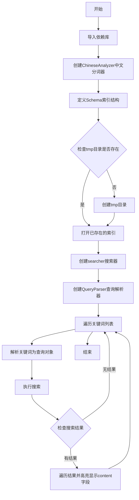
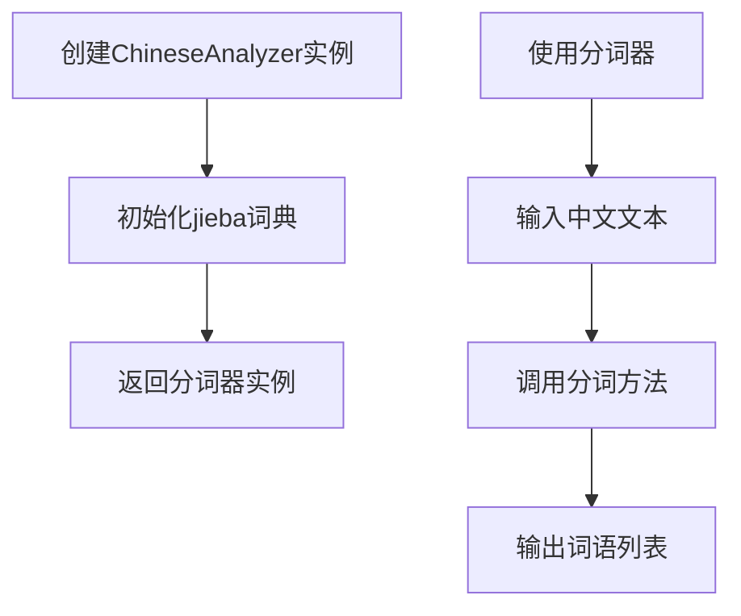
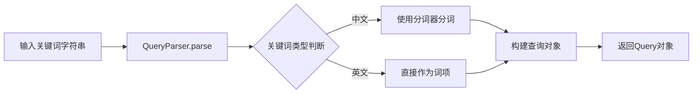
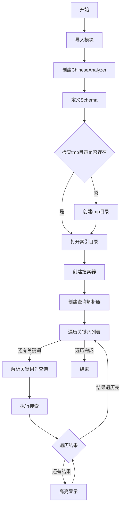
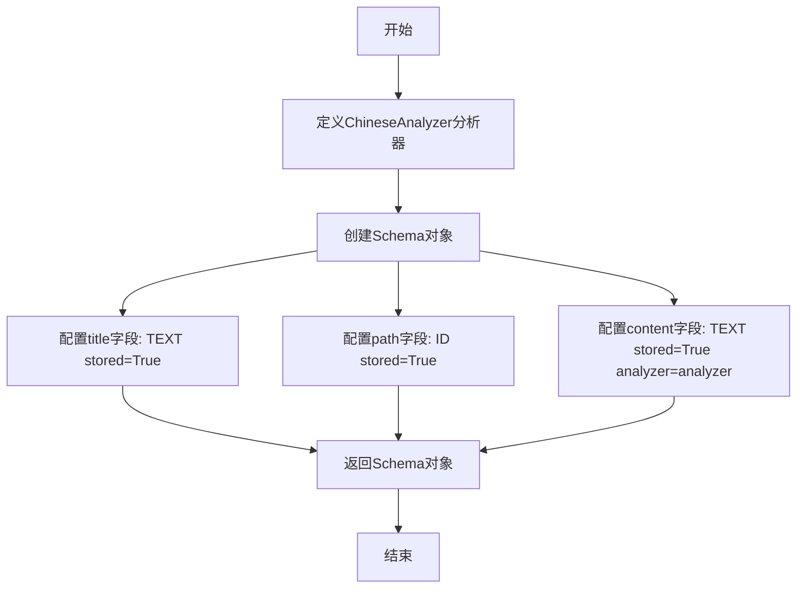
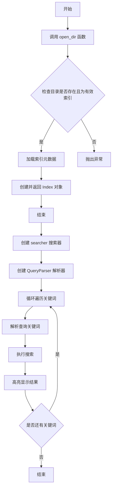
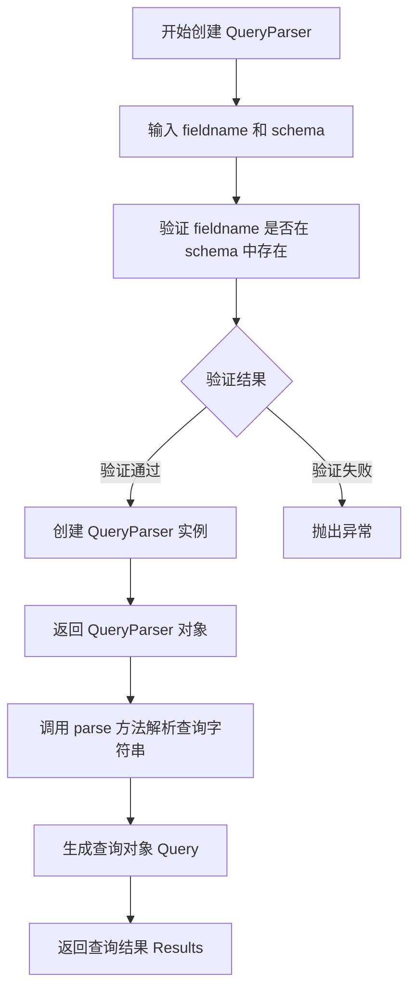
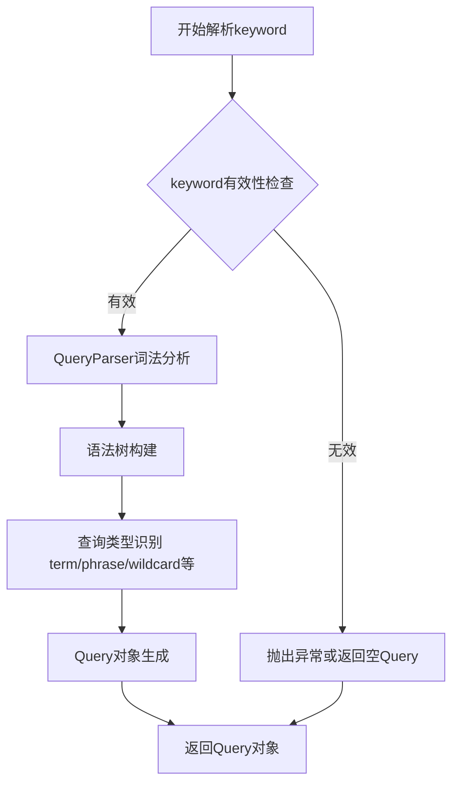
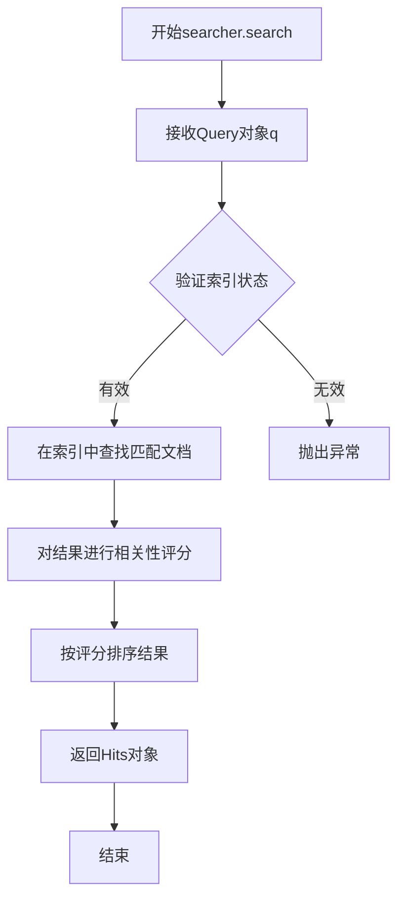
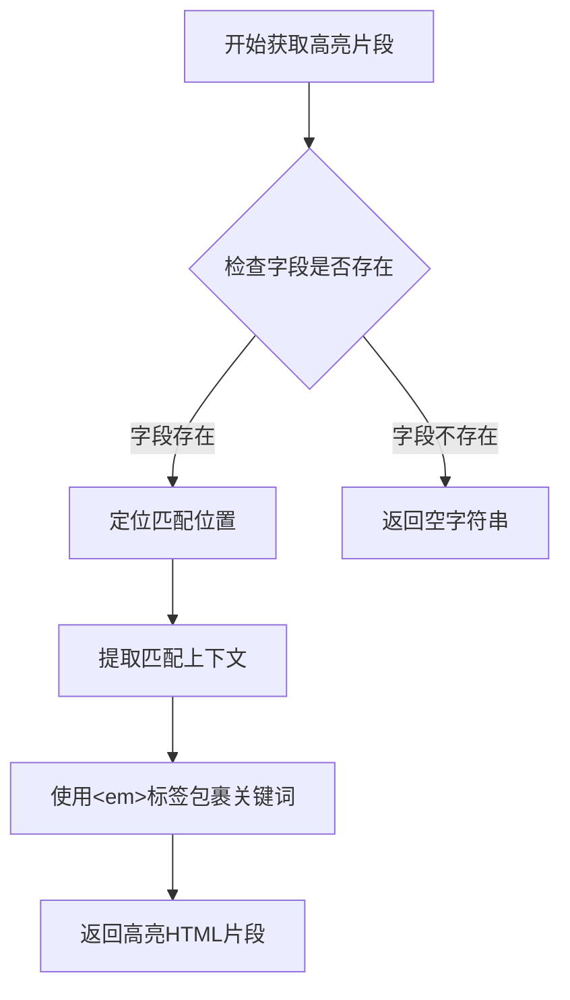

# `jieba\test\test_whoosh_file_read.py` 详细设计文档

该代码是一个基于Whoosh全文搜索引擎的中文搜索演示程序，使用jieba中文分词器对预创建的索引进行查询搜索，并对搜索结果进行高亮显示。

## 整体流程



## 类结构

```
Python脚本 (无类层次结构)
└── 全局变量和函数
    ├── schema (Whoosh Schema)
    ├── ix (Whoosh Index)
    ├── searcher (Whoosh IndexSearcher)
    ├── parser (QueryParser)
    └── 搜索循环逻辑
```

## 全局变量及字段


### `analyzer`
    
结巴中文分词器实例，用于对中文内容进行分词处理

类型：`ChineseAnalyzer`
    


### `schema`
    
Whoosh索引模式定义对象，定义了title、path和content三个可索引字段

类型：`Schema`
    


### `ix`
    
Whoosh索引实例，通过open_dir打开的已存在索引对象

类型：`Index`
    


### `searcher`
    
索引搜索器对象，用于在索引中执行查询搜索操作

类型：`IndexSearcher`
    


### `parser`
    
查询解析器对象，用于将字符串查询解析为Query对象

类型：`QueryParser`
    


### `keyword`
    
循环中迭代的搜索关键词字符串

类型：`str`
    


### `q`
    
解析后的查询对象，代表一个具体的搜索查询

类型：`Query`
    


### `results`
    
搜索结果集对象，包含所有匹配的文档条目

类型：`Results`
    


### `hit`
    
单条搜索结果对象，代表匹配到的单个文档记录

类型：`Hit`
    


    

## 全局函数及方法


# 详细设计文档

## 1. 一句话描述

该代码演示了如何使用jieba的中文分词器`ChineseAnalyzer`配合Whoosh搜索引擎框架实现中文全文索引和搜索功能。

## 2. 文件的整体运行流程

```
开始
  ↓
导入必要的模块（whoosh、jieba）
  ↓
创建ChineseAnalyzer分词器实例
  ↓
定义Schema（定义索引字段结构，content字段使用中文分词器）
  ↓
创建索引目录/tmp（如不存在）
  ↓
打开已有索引目录
  ↓
创建搜索器和查询解析器
  ↓
遍历关键词列表进行搜索
  ↓
对每个关键词：解析查询 → 执行搜索 → 高亮显示结果
  ↓
结束
```

## 3. 类的详细信息

### 3.1 ChineseAnalyzer (jieba.analyse)

这是jieba库提供的中文分词器类，用于对中文文本进行分词处理。

**参数：** 无（构造函数不接受自定义参数）

**返回值：** ChineseAnalyzer实例对象

### 3.2 Schema (whoosh.fields)

这是Whoosh的索引模式类，用于定义索引的字段结构。

**字段：**
- `title`：TEXT类型，用于存储标题
- `path`：ID类型，用于存储路径
- `content`：TEXT类型，使用ChineseAnalyzer分词器，用于存储内容

### 3.3 QueryParser (whoosh.qparser)

查询解析器类，用于将用户输入的查询字符串解析为查询对象。

**参数：**
- `field`：str，指定要搜索的字段名
- `schema`：Schema，索引模式

## 4. 全局变量和全局函数

| 名称 | 类型 | 描述 |
|------|------|------|
| analyzer | ChineseAnalyzer | jieba中文分词器实例 |
| schema | Schema | Whoosh索引模式定义 |
| ix | Index | Whoosh索引对象 |
| searcher | Searcher | 索引搜索器对象 |
| parser | QueryParser | 查询解析器对象 |
| keyword | str | 遍历的搜索关键词 |

## 5. 关键组件信息

| 组件名称 | 一句话描述 |
|----------|------------|
| ChineseAnalyzer | jieba库提供的中文分词器，支持中文词语切分 |
| Schema | Whoosh定义索引结构的类 |
| QueryParser | Whoosh将字符串查询解析为查询对象的类 |
| searcher.search() | 执行搜索并返回结果的方法 |

## 6. 潜在的技术债务或优化空间

1. **硬编码路径**："tmp"目录路径硬编码，缺乏灵活性
2. **错误处理缺失**：没有对文件操作、索引操作进行异常捕获
3. **资源未释放**：searcher使用后未调用close()方法释放资源
4. **索引创建缺失**：代码假设索引已存在（open_dir），但未提供索引创建逻辑
5. **配置外部化**：分词器配置、搜索字段等应可配置

## 7. 其它项目

### 设计目标与约束
- 目标：实现中文全文搜索功能
- 约束：依赖whoosh和jieba两个第三方库

### 错误处理与异常设计
- 目录创建使用os.path.exists检查
- 缺少对索引不存在、解析异常等情况的处理

### 数据流
```
用户输入关键词 → QueryParser解析 → Searcher搜索 → 高亮结果输出
```

### 外部依赖
- jieba：中文分词
- whoosh：全文搜索引擎

---

## 具体函数/方法详细文档

### `ChineseAnalyzer`

jieba库提供的中文文本分词器类，用于将中文文本切分为独立的词语，是Whoosh搜索引擎的中文分词支持核心组件。

参数：无

返回值：`ChineseAnalyzer`实例

#### 流程图



#### 带注释源码

```python
# 导入jieba的中文分词分析器
from jieba.analyse import ChineseAnalyzer 

# 创建ChineseAnalyzer分词器实例
# 该分词器基于jieba的关键词抽取和分词功能
# 支持中文文本的智能分词
analyzer = ChineseAnalyzer()

# 在Schema中使用分词器
# content字段使用analyzer进行中文分词
schema = Schema(
    title=TEXT(stored=True),           # 标题字段，普通文本
    path=ID(stored=True),              # 路径字段，ID类型
    content=TEXT(stored=True, analyzer=analyzer)  # 内容字段，使用中文分词器
)
```

---

### `QueryParser.parse(keyword)`

将用户输入的搜索关键词解析为Whoosh查询对象的函数。

参数：

- `keyword`：`str`，用户输入的搜索关键词

返回值：`Query`，解析后的查询对象，可被Searcher用于搜索

#### 流程图



#### 带注释源码

```python
# 创建查询解析器
# 第一个参数：要在哪个字段进行搜索 ("content")
# 第二个参数：索引的schema定义
parser = QueryParser("content", schema=ix.schema)

# 遍历搜索关键词列表
for keyword in ("水果小姐", "你", "first", "中文", "交换机", "交换", "少林", "乔峰"):
    print("result of ", keyword)
    
    # 解析关键词为查询对象
    # 对于中文，会使用ChineseAnalyzer进行分词
    # 例如："水果小姐"可能被分词为"水果"、"小姐"
    q = parser.parse(keyword)
    
    # 执行搜索
    # 传入解析后的查询对象
    results = searcher.search(q)
    
    # 遍历搜索结果
    for hit in results:  
        # 高亮显示匹配的内容片段
        # 使用HTML标签高亮匹配的关键词
        print(hit.highlights("content"))
    
    print("="*10)
```

---

### 完整代码流程图




### `Schema`

Whoosh模式定义构造函数，用于定义文档索引的字段结构，包含标题、路径和内容三个字段，每个字段指定了类型和存储属性。

参数：

- `title`：TEXT类型，stored=True，表示标题字段，可被搜索和存储
- `path`：ID类型，stored=True，表示路径字段，可被搜索和存储
- `content`：TEXT类型，stored=True, analyzer=analyzer，表示内容字段，使用中文分词器

返回值：`Schema`对象，返回一个Whoosh模式对象，定义了索引的字段结构

#### 流程图



#### 带注释源码

```
# -*- coding: UTF-8 -*-
from __future__ import unicode_literals
import sys
import os
sys.path.append("../")
from whoosh.index import create_in,open_dir
from whoosh.fields import *
from whoosh.qparser import QueryParser

from jieba.analyse import ChineseAnalyzer 

# 创建中文分析器，用于中文分词
analyzer = ChineseAnalyzer()

# 定义Whoosh索引模式，包含三个字段：
# 1. title - 文本字段，用于存储和搜索标题
# 2. path - ID字段，用于存储和搜索路径
# 3. content - 文本字段，使用中文分析器，用于存储和搜索内容
schema = Schema(
    title=TEXT(stored=True), 
    path=ID(stored=True), 
    content=TEXT(stored=True, analyzer=analyzer)
)

# 创建索引目录
if not os.path.exists("tmp"):
    os.mkdir("tmp")

# 打开索引目录
ix = open_dir("tmp")

# 创建搜索器
searcher = ix.searcher()

# 创建查询解析器，搜索content字段
parser = QueryParser("content", schema=ix.schema)

# 遍历关键词进行搜索
for keyword in ("水果小姐","你","first","中文","交换机","交换","少林","乔峰"):
    print("result of ",keyword)
    # 解析搜索关键词
    q = parser.parse(keyword)
    # 执行搜索
    results = searcher.search(q)
    # 遍历搜索结果并打印高亮内容
    for hit in results:  
        print(hit.highlights("content"))
    print("="*10)
```


### `open_dir`

该函数是 Whoosh 索引库中的核心函数之一，用于打开指定目录中已存在的 Whoosh 索引，并返回可进行搜索操作的 Index 对象。

参数：

- `directory`：`str`，要打开的索引目录路径，本例中为 `"tmp"`

返回值：`Index` 对象，返回一个已打开的 Whoosh 索引实例，可用于创建搜索器进行文档查询操作。

#### 流程图



#### 带注释源码

```python
# 从 whoosh.index 模块导入 open_dir 函数
# open_dir 是 Whoosh 库提供的用于打开已存在索引的函数
from whoosh.index import create_in, open_dir

# 定义索引模式（Schema），包含 title、path 和 content 三个字段
# title: 文本字段，用于存储标题
# path: ID 字段，用于存储路径标识符
# content: 文本字段，使用中文分词器分析内容
schema = Schema(title=TEXT(stored=True), path=ID(stored=True), content=TEXT(stored=True, analyzer=analyzer))

# 如果不存在 tmp 目录，则创建该目录
if not os.path.exists("tmp"):
    os.mkdir("tmp")

# 调用 open_dir 函数打开指定目录 "tmp" 中的索引
# 参数：directory - 索引目录路径（字符串）
# 返回值：Index 对象，表示已打开的索引
# 注意：如果目录不存在或不是有效的 Whoosh 索引目录，此函数会抛出异常
ix = open_dir("tmp")

# 使用索引对象创建搜索器，用于执行查询操作
searcher = ix.searcher()

# 创建查询解析器
# 参数 "content" 指定要搜索的字段
# schema=ix.schema 使用索引的模式定义
parser = QueryParser("content", schema=ix.schema)

# 遍历多个关键词进行搜索测试
for keyword in ("水果小姐", "你", "first", "中文", "交换机", "交换", "少林", "乔峰"):
    print("result of ", keyword)
    # 解析搜索关键词为查询对象
    q = parser.parse(keyword)
    # 执行搜索并返回结果集
    results = searcher.search(q)
    # 遍历搜索结果
    for hit in results:
        # 使用高亮功能显示匹配的内容片段
        print(hit.highlights("content"))
    print("=" * 10)
```


### `QueryParser` (查询解析器构造函数)

QueryParser 是 Whoosh 全文检索库中的查询解析器类，用于将用户输入的查询字符串解析为可执行的查询对象。在本代码中，它被初始化为针对 "content" 字段进行查询解析，配合指定索引的模式（schema）来构建查询对象。

参数：

- `fieldname`：`str`，要查询的字段名称，这里传入 `"content"` 表示在文档内容字段中进行搜索
- `schema`：`Schema`，索引的模式定义对象，通过 `ix.schema` 获取，用于验证查询字段和解析查询语法

返回值：`QueryParser`，返回 QueryParser 实例对象，该对象可以调用 `parse()` 方法将查询字符串解析为 Whoosh 的查询对象

#### 流程图



#### 带注释源码

```python
# 从 whoosh.qparser 模块导入 QueryParser 类
from whoosh.qparser import QueryParser

# 创建 QueryParser 实例
# 参数1: "content" - 指定要查询的字段名（字段必须在 schema 中定义）
# 参数2: schema=ix.schema - 传入索引的模式定义，用于解析查询语法和验证字段
parser = QueryParser("content", schema=ix.schema)

# 后续使用示例：
# parser.parse(keyword) - 将关键字解析为查询对象
# 例如：parser.parse("水果小姐") 会解析为对 content 字段包含"水果小姐"的查询
```


### `parser.parse`

该方法为 Whoosh 搜索引擎的查询解析器核心方法，负责将用户输入的搜索关键词字符串解析为结构化的 Query 对象，以便后续在索引中进行匹配搜索。

参数：

- `keyword`：`str`，待解析的搜索关键词，支持中英文及短语

返回值：`Query`（whoosh.qparser.Query），解析后生成的查询对象，可用于搜索器执行实际检索

#### 流程图



#### 带注释源码

```python
# QueryParser 实例方法
# parser = QueryParser("content", schema=ix.schema)
# 创建一个针对 "content" 字段的查询解析器，使用索引模式

# 解析关键词为Query对象
# q = parser.parse(keyword)
# 输入：keyword - 搜索关键词字符串（支持"水果小姐"/"你"/"中文"等）
# 输出：q - Whoosh Query对象（TermQuery/PhraseQuery/WildcardQuery等）
# 内部流程：
#  1. 接收keyword字符串参数
#  2. 通过QueryParser的_parse方法进行词法分析和语法解析
#  3. 根据schema中content字段的定义匹配分词器
#  4. 构建查询语法树并转换为对应的Query子类实例
#  5. 返回可被searcher.search()使用的Query对象
q = parser.parse(keyword)
```


### `searcher.search`

执行搜索并返回与查询表达式匹配的文档结果集

参数：

- `q`：`Query`，Whoosh 查询对象，由 QueryParser 解析关键词生成，表示需要搜索的查询表达式

返回值：`Hits`，搜索结果集合，包含匹配查询条件的所有文档，支持遍历访问每个命中的文档对象

#### 流程图



#### 带注释源码

```python
# searcher.search 方法调用示例
# searcher: Whoosh索引的Searcher对象
# q: QueryParser解析关键词后得到的Query对象

# 解析搜索关键词为Query对象
q = parser.parse(keyword)

# 执行搜索并返回结果
# searcher.search(q) 接受一个Query对象作为参数
# 在索引中查找与查询表达式匹配的文档
# 返回Hits对象，包含所有匹配的结果
results = searcher.search(q)

# 遍历搜索结果
# Hits对象可迭代，每个元素是Hit对象
# Hit对象代表一个匹配的文档，包含文档的字段和元数据
for hit in results:
    # 使用highlights方法获取高亮显示的摘要内容
    # 参数为字段名，这里对content字段进行高亮
    print(hit.highlights("content"))
```

#### 详细说明

`searcher.search` 是 Whoosh 搜索引擎库中 `Searcher` 类的核心方法，负责执行全文搜索操作。该方法接收一个 Query 对象作为参数，该对象由 `QueryParser` 将用户输入的关键词字符串解析后生成。搜索过程中，系统会在已建立的索引中查找与查询表达式匹配的文档，并根据相关性算法对结果进行评分和排序，最终返回一个包含所有匹配文档的 `Hits` 对象。开发者可以通过遍历 `Hits` 对象来访问每条匹配结果，并使用 `highlights` 方法获取带有搜索词高亮显示的内容摘要。


### `hit.highlights`

获取搜索结果中高亮显示的文本片段。该方法是 Whoosh 库 `Hit` 对象的实例方法，用于在全文检索场景中，将搜索匹配的关键词以高亮形式展示给用户，提升搜索体验。

参数：

- `fieldname`：`str`，要获取高亮内容的字段名称（如 "content"）
- `topk`：`int`（可选），返回的高亮片段数量，默认为 None（返回所有）
- `minscore`：`int`（可选），最小得分阈值，默认为 0

返回值：`str`，返回高亮处理后的 HTML 片段字符串，匹配的关键词会被 Whoosh 默认使用 `<em>` 标签包裹

#### 流程图



#### 带注释源码

```python
# hit.highlights 方法调用示例（来源：whoosh/library.py Hit 类）
# 这是 Whoosh 全文检索库的内置方法

# 在给定代码中的实际使用方式：
for hit in results:
    # hit 是 SearchResult 中的单个 Hit（搜索结果条目）
    # highlights() 方法接收字段名作为参数
    # 返回该字段中匹配关键词的高亮版本
    print(hit.highlights("content"))
    
    # 内部实现逻辑简述：
    # 1. 从 hit 对象中获取指定字段的原始内容
    # 2. 根据搜索时的匹配信息，定位关键词位置
    # 3. 在关键词前后插入高亮标签（默认&lt;em&gt;标签）
    # 4. 返回处理后的 HTML 格式字符串
    
# 完整方法签名（Whoosh 2.7.4版本参考）：
# def highlights(self, fieldname, topk=0, minscore=0, fragmenter=None,
#                formatter=None, text=None, at=True):
#     """
#     参数:
#     - fieldname: 字段名
#     - topk: 片段数量，0表示返回所有
#     - minscore: 最小分数
#     - fragmenter: 分片器对象
#     - formatter: 格式化器对象，默认使用 HTML 格式化器
#     - text: 可选的覆盖文本
#     - at: 匹配模式
#     """
```

#### 补充说明

在当前代码中的具体应用：

```python
# 遍历搜索结果
for hit in results:
    # 对每条命中记录调用 highlights 方法
    # "content" 是要获取高亮内容的字段名
    # 返回类似: "这是一段<em>中文</em>测试文本" 的结果
    print(hit.highlights("content"))
```

该方法依赖 Whoosh 库的内部实现，源代码位于 `whoosh.searching.Hit` 类中。返回值是包含 HTML 高亮标记的字符串，可直接在网页中展示。


## 关键组件


### 代码概述

该代码是一个基于Whoosh全文搜索引擎的中文搜索示例程序，通过调用jieba中文分词器作为分析器，对预建立的索引目录进行关键词搜索，并使用高亮功能展示搜索结果。

### 文件运行流程

1. 导入必要的模块（whoosh相关模块和jieba中文分词器）
2. 配置中文分析器（ChineseAnalyzer）
3. 定义搜索模式Schema（title、path、content三个字段）
4. 检查并创建临时目录"tmp"
5. 打开已存在的索引目录"tmp"
6. 创建搜索器和查询解析器
7. 遍历预设关键词列表进行搜索
8. 对每个关键词执行查询并高亮显示结果

### 全局变量和全局函数详细信息

#### 全局变量

| 名称 | 类型 | 描述 |
|------|------|------|
| analyzer | ChineseAnalyzer | jieba中文分词器实例，用于文本分词 |
| schema | Schema | Whoosh索引模式，定义title、path、content三个可存储的TEXT字段 |
| ix | Index | 打开的索引对象，用于搜索操作 |
| searcher | Searcher | 索引搜索器对象，负责执行查询 |
| parser | QueryParser | 查询解析器，负责将关键词解析为查询对象 |

#### 全局函数

| 名称 | 参数 | 参数类型 | 参数描述 | 返回类型 | 返回描述 |
|------|------|----------|----------|----------|----------|
| create_in | dirname, schema | str, Schema | 创建新索引目录和模式 | Index | 返回新创建的索引对象 |
| open_dir | dirname | str | 打开已存在的索引目录 | Index | 返回已存在的索引对象 |
| QueryParser | fieldname, schema | str, Schema | 创建指定字段的查询解析器 | QueryParser | 返回查询解析器实例 |
| parser.parse | query_string | str | 将字符串解析为查询对象 | Query | 返回解析后的查询对象 |
| searcher.search | query | Query | 在索引中执行查询 | Results | 返回搜索结果集 |
| hit.highlights | fieldname | str | 获取字段的高亮片段 | str | 返回HTML格式的高亮文本 |

### 关键组件信息

#### 1. Whoosh索引管理组件

负责索引的打开和管理，是搜索功能的基础设施。

#### 2. 中文分词支持（jieba ChineseAnalyzer）

集成jieba中文分词器，实现对中文文本的智能分词，是支持中文全文搜索的关键。

#### 3. 查询解析与搜索组件

负责将用户输入的关键词解析为结构化查询，并执行搜索返回结果。

#### 4. 结果高亮组件

使用Whoosh的highlights功能，在搜索结果中高亮显示匹配的关键词片段。

### 潜在技术债务或优化空间

1. **缺少索引创建逻辑**：代码仅打开已存在的索引，如果索引不存在会报错，应该添加索引创建逻辑或明确的错误处理
2. **硬编码的搜索路径**："tmp"目录路径硬编码，缺乏配置管理
3. **搜索结果未限制**：未对搜索结果数量进行限制，可能影响性能
4. **缺乏资源释放**：searcher使用后未调用close()方法释放资源
5. **异常处理缺失**：文件操作和搜索操作缺乏try-except异常处理
6. **模式定义不完整**：Schema定义简单，未考虑分词器优化和字段权重设置

### 其它项目

#### 设计目标与约束
- 目标：演示基于Whoosh的中文全文搜索功能
- 约束：依赖Whoosh和jieba两个外部库

#### 错误处理与异常设计
- 目录不存在时创建"tmp"目录
- 缺少对索引不存在、搜索异常等情况的处理

#### 数据流与状态机
- 数据流：关键词输入 → QueryParser解析 → Searcher搜索 → Results结果集 → highlights高亮处理 → 输出
- 状态：初始化 → 索引打开 → 搜索循环 → 结果展示

#### 外部依赖与接口契约
- 依赖whoosh库（索引、查询、高亮功能）
- 依赖jieba.analyse（ChineseAnalyzer中文分词）
- 依赖预建立的索引文件结构


## 问题及建议


### 已知问题

-   **索引目录硬编码且无创建逻辑**：代码假设"tmp"索引目录已存在，但没有检查索引是否有效或提供创建索引的逻辑，索引不存在时会抛出异常
-   **缺少异常处理机制**：没有任何try-except块来捕获可能发生的异常（如文件不存在、索引损坏、搜索错误等），会导致程序直接崩溃
-   **资源未正确释放**：searcher对象在使用后没有调用close()方法关闭，可能导致资源泄漏
-   **工作目录依赖问题**：sys.path.append("../")使用相对路径，依赖当前工作目录，在不同执行环境下可能失败
-   **搜索结果无限制**：searcher.search(q)未指定limit参数，可能返回过多结果影响性能和内存
-   **路径处理不规范**：使用字符串拼接构建路径，没有使用os.path.join()，可移植性差
-   **高亮结果可能为空**：hit.highlights("content")在无匹配时可能返回空字符串，没有默认显示内容
-   **print调试输出**：使用print而非logging模块，不利于生产环境日志管理

### 优化建议

-   添加索引存在性检查和自动创建逻辑，使用create_in函数在索引不存在时创建
-   为所有IO操作添加try-except异常处理，包括文件操作、搜索操作等
-   使用with上下文管理器或显式调用close()确保searcher等资源正确释放
-   使用绝对路径或配置文件管理路径，避免依赖工作目录
-   显式设置searcher.search的limit参数控制返回结果数量
-   替换print为logging模块，区分debug/info/warning级别
-   为高亮结果提供降级方案，无高亮时显示原始内容或相关字段
-   添加索引一致性验证，检查schema是否匹配、索引是否损坏
-   考虑将全局变量封装到类中，提高代码可测试性和可维护性
-   添加类型注解提高代码可读性和IDE支持


## 其它


### 设计目标与约束

本代码的设计目标是实现一个基于Whoosh的中文全文搜索引擎演示程序，支持对预索引的中文内容进行关键字搜索并返回高亮结果。设计约束包括：依赖Whoosh全文搜索库和jieba中文分词库；索引目录固定为"tmp"；搜索仅支持单字段（content字段）查询；无用户认证和权限控制机制。

### 错误处理与异常设计

代码缺乏系统的错误处理机制，存在以下潜在问题：目录不存在时创建失败、索引文件损坏或不存在时程序崩溃、搜索无结果时无提示信息、异常未捕获导致程序中断。改进建议：添加try-except捕获FileNotFoundError、OSError和Whoosh相关异常；为无搜索结果提供明确提示；添加索引存在性检查和初始化逻辑；实现日志记录以便问题排查。

### 数据流与状态机

数据处理流程如下：初始化阶段创建索引目录→定义Schema（title、path、content三字段）→打开已有索引→创建搜索器和查询解析器→循环处理关键字列表→解析关键字为查询对象→执行搜索→遍历结果并输出高亮内容→释放资源。状态转换顺序：INIT（初始化）→READY（就绪）→SEARCHING（搜索中）→DISPLAY（显示结果）→END（完成）。

### 外部依赖与接口契约

主要依赖包括：whoosh.index模块的open_dir函数（打开索引目录）、whoosh.fields模块的Schema/TEXT/ID类（定义索引结构）、whoosh.qparser模块的QueryParser类（解析查询语法）、jieba.analyse模块的ChineseAnalyzer（中文分词器）。接口契约规定：索引目录必须预先存在且包含有效的Whoosh索引文件；Schema必须包含content字段供QueryParser使用；查询关键字需符合Whoosh查询语法；searcher.search()返回Results对象需遍历获取hit结果。

### 性能考量与优化建议

当前实现存在性能瓶颈：每次循环创建新的QueryParser对象；searcher未及时关闭；无结果缓存机制；全量遍历所有结果无分页。优化方向：复用searcher和parser对象；使用with语句管理资源生命周期；考虑实现查询缓存；添加分页支持以处理大规模结果集。

### 配置与部署说明

程序采用硬编码配置（索引路径"tmp"、搜索字段"content"），缺乏灵活性。部署时需确保：Python环境安装whoosh和jieba库；预先创建索引并导入数据；索引目录具有读写权限；终端支持UTF-8编码显示中文。建议将配置参数化，支持从配置文件或环境变量读取。

### 使用示例与预期输出

程序对六个关键字（"水果小姐"、"你"、"first"、"中文"、"交换机"、"交换"、"少林"、"乔峰"）执行搜索，每个关键字输出一组匹配结果，每个结果包含高亮显示的content片段，结果间用"="分隔。预期输出格式为：result of 关键字后跟等号行，然后是每条匹配记录的高亮内容，最后是分隔线。若索引中无匹配内容则输出空结果。

### 安全性考虑

当前实现存在安全隐患：索引目录路径可被路径遍历攻击利用；无输入过滤可能造成查询注入；搜索结果无权限过滤。改进建议：对用户输入进行白名单校验；使用os.path.realpath防止路径穿越；考虑实现基于用户权限的结果过滤机制。


    