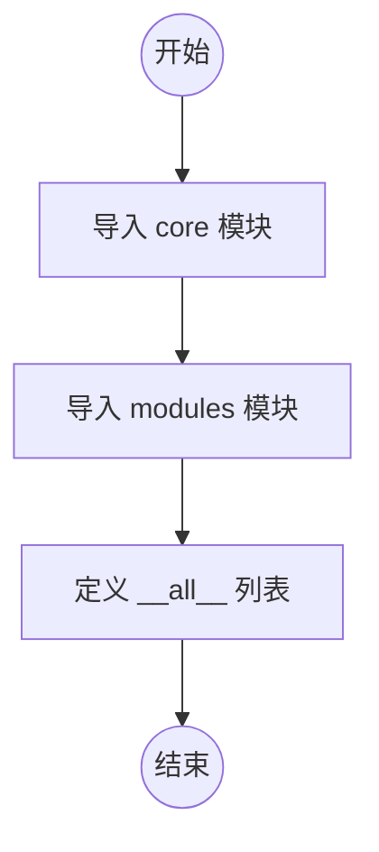

# `kubehunter\kube_hunter\__init__.py` 详细设计文档

这是包的入口初始化文件，负责导入并暴露 core 和 modules 两个核心子模块，使包的使用者可以通过 from package import * 访问这些模块。

## 整体流程



## 类结构

```
Package Root (包根目录)
├── __init__.py (包的入口文件)
├── core (核心功能模块)
└── modules (功能模块集合)
```

## 全局变量及字段


### `__all__`
    
定义包的公共导出模块列表，包含core和modules两个模块对象，用于控制from package import *时的导入行为。

类型：`list`
    


    

## 全局函数及方法


## 关键组件


### 一段话描述

该代码是一个Python包的初始化文件，通过导入core和modules子模块并将其暴露在`__all__`列表中，为上层代码提供统一的模块访问入口。

### 文件的整体运行流程

该初始化文件在包首次被导入时执行，主要流程如下：
1. Python解释器导入该包
2. 执行`from . import core`语句，将core子模块加载到当前命名空间
3. 执行`from . import modules`语句，将modules子模块加载到当前命名空间
4. 将core和modules组成列表赋值给`__all__`，定义该包的公共接口

### 类的详细信息

该代码文件中不包含任何类定义。

### 全局变量和全局函数

该代码中不包含全局变量和全局函数定义。

### 关键组件信息

### core模块

Python子模块，提供核心功能实现，是包的基础组件。

### modules模块

Python子模块，提供模块化功能，可能包含各种功能模块的定义和实现。

### __all__列表

导出列表定义，指定了该包对外公开的成员，包含了core和modules两个模块。

### 潜在的技术债务或优化空间

1. **缺乏模块文档字符串**：包级别的docstring缺失，无法快速了解包的用途
2. **无版本信息**：未定义__version__或__author__等元数据
3. **无子模块导入控制**：未对导入行为进行精细控制，所有子模块直接暴露
4. **无初始化逻辑**：缺少包级别的初始化代码，可能导致延迟加载等优化无法实施

### 其它项目

#### 设计目标与约束

- 设计目标：提供统一的模块访问入口，遵循Python包的标准结构
- 约束：使用相对导入，依赖子模块的存在

#### 错误处理与异常设计

- 该文件本身不涉及复杂的错误处理逻辑
- 潜在的导入错误（如core或modules模块不存在）会由Python解释器直接抛出ImportError

#### 外部依赖与接口契约

- 无外部依赖声明
- 接口契约：通过`__all__`定义的公共API仅为core和modules两个模块对象


## 问题及建议


### 已知问题

-   `__all__` 定义错误：`__all__` 应为字符串列表，而当前代码直接导入了模块对象，这会导致 `__all__` 无法正确控制模块的公开 API，违反了 Python 的最佳实践
-   缺少包级别文档：包没有 `__docstring__` 说明包的整体功能、用途和目的
-   导入依赖脆弱：直接导入 `core` 和 `modules` 模块，如果任一模块存在语法错误或导入失败，将导致整个包无法导入，缺乏错误隔离
-   无版本管理：缺少 `__version__` 等版本信息，不利于依赖管理和发布流程
-   未使用的模块导入风险：导入语句可能仅用于包的可发现性，而非实际需要，如果这些模块在包初始化时执行了昂贵的操作，会拖慢导入速度

### 优化建议

-   修正 `__all__` 定义为 `__all__ = ['core', 'modules']` 字符串列表形式
-   为包添加文档字符串，例如：`"""Package for core functionality and modules."""`
-   考虑使用延迟导入或条件导入，提高包初始化性能
-   添加 `__version__ = "1.0.0"` 等版本信息
-   考虑添加异常处理，使导入失败时提供更清晰的错误信息
-   如无需在包级别暴露这些模块，可移除导入语句，仅在需要时从子模块导入
-   添加 `__author__`、`__license__` 等元数据信息，提升包的完整性


## 其它


### 设计目标与约束

本代码作为包的入口文件，主要目标是组织并暴露核心模块（core）和功能模块（modules），为使用者提供统一的导入接口。设计约束包括：1) 遵循Python包规范，必须包含__init__.py；2) 使用相对导入确保包内模块引用的稳定性；3) 通过__all__明确导出列表，控制公开API。

### 错误处理与异常设计

由于本文件仅为包初始化文件，不涉及复杂业务逻辑，错误处理相对简单。主要可能出现的错误包括：ImportError（当core或modules模块不存在或导入失败时抛出），AttributeError（当__all__中指定的模块属性访问失败时抛出）。建议在包加载时添加try-except捕获导入错误，提供更友好的错误信息。

### 数据流与状态机

本文件不涉及复杂的数据流处理。其数据流为：外部导入包 → __init__.py执行 → 导入core和modules子模块 → 通过__all__暴露给调用者。状态机方面，包初始化过程可分为"未加载"→"加载中"→"已加载"三种状态。

### 外部依赖与接口契约

本文件的外部依赖包括：Python标准库（import机制）。接口契约方面：1) core模块必须存在且可导入；2) modules模块必须存在且可导入；3) __all__返回包含core和modules的列表。任何使用该包的代码应遵循此契约。

### 版本兼容性说明

本代码兼容Python 3.x版本（推荐Python 3.6+）。对于Python 2.x，由于不支持相对导入语法from . import，需要额外适配。包结构设计遵循PEP 328和PEP 420规范。

### 安全考虑

本代码不涉及敏感数据处理或外部输入验证。安全考量主要包括：1) 确保core和modules模块来源可信；2) 避免__all__中导出带有危险操作的模块；3) 定期检查依赖模块的安全漏洞。

### 性能考量

作为轻量级包初始化文件，本代码性能开销极低。模块导入采用延迟加载机制，实际使用时才加载core和modules模块。建议避免在__init__.py中执行耗时操作，以保持包的快速加载特性。

### 测试策略建议

建议为该包编写以下测试：1) 导入测试，验证包可正常导入；2) __all__内容测试，确认导出列表正确；3) 子模块存在性测试，确保core和modules可用；4) 相对导入路径测试，验证导入路径正确性。

### 扩展性建议

当前设计具有良好的扩展性，可通过以下方式扩展：1) 在__all__中添加新模块；2) 在__init__.py中导入并重命名模块以提供别名；3) 添加包级别的配置变量；4) 实现__getattr__实现动态模块加载。建议保持__init__.py简洁，将复杂逻辑下放到子模块。

### 文档与注释规范

建议添加以下文档：1) 包级别的docstring，描述包的整体用途；2) 每个导入的说明注释；3) 示例用法展示；4) 维护者信息和版本号。建议遵循Google或NumPy风格的docstring规范。


    