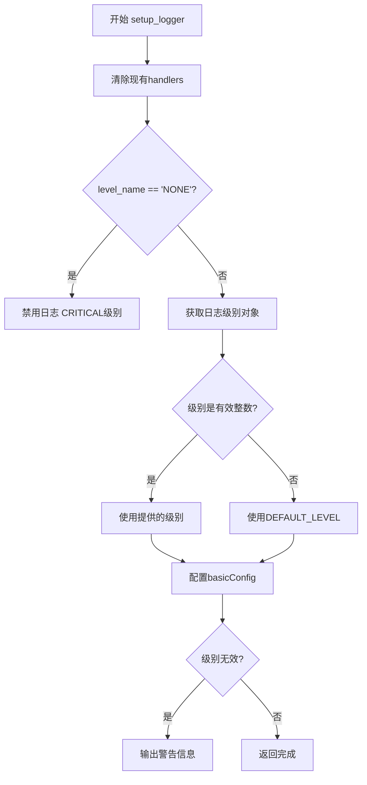
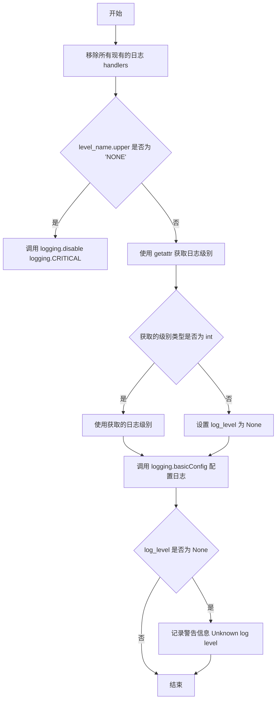

# `kubehunter\kube_hunter\conf\logging.py` 详细设计文档

该文件实现了一个日志配置模块，通过setup_logger函数提供灵活的日志级别管理功能，同时抑制scapy库的冗余日志输出，确保日志系统的清晰可控。

## 整体流程



## 类结构

```
模块: logger_setup (无类定义)
```

## 全局变量及字段


### `DEFAULT_LEVEL`
    
Default logging level set to logging.INFO (numeric value 20)

类型：`int`
    


### `DEFAULT_LEVEL_NAME`
    
Human-readable string name for the default logging level (e.g., 'INFO')

类型：`str`
    


### `LOG_FORMAT`
    
Log message format string containing timestamp, level, logger name and message

类型：`str`
    


    

## 全局函数及方法


### `setup_logger`

该函数用于配置应用程序的日志系统，根据传入的日志级别名称设置日志记录器的级别、格式，并移除所有已存在的处理器。如果传入的级别为 "NONE"，则完全禁用日志输出。

参数：

- `level_name`：`str`，日志级别名称（如 DEBUG、INFO、WARNING、ERROR、CRITICAL 或 NONE）

返回值：`None`，该函数不返回任何值

#### 流程图



#### 带注释源码

```python
import logging


# 全局变量：默认日志级别
DEFAULT_LEVEL = logging.INFO
# 全局变量：默认日志级别的名称字符串
DEFAULT_LEVEL_NAME = logging.getLevelName(DEFAULT_LEVEL)
# 全局变量：日志格式字符串
LOG_FORMAT = "%(asctime)s %(levelname)s %(name)s %(message)s"

# 抑制 scapy 库的日志输出，将其级别设为 CRITICAL
logging.getLogger("scapy.runtime").setLevel(logging.CRITICAL)
logging.getLogger("scapy.loading").setLevel(logging.CRITICAL)


def setup_logger(level_name):
    """
    配置应用程序的日志系统
    
    参数:
        level_name: 日志级别名称，如 DEBUG、INFO、WARNING、ERROR、CRITICAL 或 NONE
    """
    # 移除任何现有的 handlers
    # 在 Python 3.8+ 中不必要，因为 logging.basicConfig 有 force 参数
    for h in logging.getLogger().handlers[:]:
        h.close()  # 关闭处理器
        logging.getLogger().removeHandler(h)  # 从 logger 中移除处理器

    # 如果级别名称为 "NONE"，则禁用所有日志
    if level_name.upper() == "NONE":
        logging.disable(logging.CRITICAL)
    else:
        # 尝试获取对应的日志级别
        log_level = getattr(logging, level_name.upper(), None)
        # 验证获取的是否为有效的整数级别
        log_level = log_level if type(log_level) is int else None
        # 使用 basicConfig 配置日志系统
        logging.basicConfig(level=log_level or DEFAULT_LEVEL, format=LOG_FORMAT)
        # 如果级别无效，记录警告并使用默认级别
        if not log_level:
            logging.warning(f"Unknown log level '{level_name}', using {DEFAULT_LEVEL_NAME}")
```

## 关键组件


### 日志级别配置

定义了默认的日志级别为INFO级别，并提供日志级别的名称字符串表示。

### 日志格式定义

使用标准的Python日志格式字符串，包含时间戳、日志级别、logger名称和消息内容。

### Scapy日志抑制

通过将scapy相关logger的级别设置为CRITICAL，抑制Scapy库在运行时的日志输出，避免干扰主业务日志。

### setup_logger函数

核心日志配置函数，负责初始化日志系统。支持动态设置日志级别、可清理已存在的处理器、处理无效日志级别名称。当传入"NONE"时完全禁用日志。


## 问题及建议


### 已知问题

-   类型检查使用 `type(log_level) is int` 而非推荐的 `isinstance(log_level, int)`，不符合 Python 最佳实践
-   `getattr` 获取日志级别后，类型检查与赋值逻辑分散，先检查再覆盖，逻辑不够清晰
-   当 `level_name.upper() == "NONE"` 时，直接调用 `logging.disable(logging.CRITICAL)`，但之后可能又被 `basicConfig` 覆盖，逻辑存在冲突
-   移除现有 handler 的操作在 Python 3.8+ 可用 `force` 参数替代，代码注释已提及但未采用新方式
-   函数没有返回值，调用者无法得知配置是否成功或使用了默认级别
-   直接操作全局 `logging` 状态，不利于单元测试和模块隔离
-   未对 `level_name` 为空或非字符串类型的情况进行处理，可能引发异常

### 优化建议

-   使用 `isinstance(log_level, int)` 进行类型检查
-   统一日志级别解析逻辑，提取为独立函数，增强可测试性
-   当 `level_name` 为 "NONE" 时，应直接返回或设置特殊标志，避免后续 `basicConfig` 覆盖
-   利用 Python 3.8+ 的 `logging.basicConfig(force=True)` 替代手动移除 handler 的代码
-   考虑让 `setup_logger` 返回配置结果（如返回实际使用的日志级别或成功/失败标志）
-   将日志配置封装为类或使用依赖注入，便于测试
-   添加对 `level_name` 参数的类型检查和空值处理

## 其它


### 设计目标与约束

本模块的设计目标是提供一个统一的日志配置接口，支持动态设置日志级别，并能够抑制第三方库（scapy）的不必要日志输出。约束条件包括：仅支持Python标准logging模块，需要Python 3.6+版本（使用f-string）。

### 错误处理与异常设计

当传入无效的日志级别名称时，代码不会抛出异常，而是降级使用默认的INFO级别，并通过logging.warning发出警告。这种设计保证了程序的健壮性，避免因日志配置错误导致主业务逻辑中断。无效的日志级别会被设置为None，后续通过逻辑判断处理。

### 数据流与状态机

本模块不涉及复杂的状态机，主要数据流如下：输入level_name字符串 → 转换为logging级别 → 配置logging.basicConfig → 输出配置好的日志系统。状态转换简单：初始状态（默认logging配置）→ 配置状态（用户指定的级别）→ 完成状态（配置生效）。

### 外部依赖与接口契约

本模块仅依赖Python标准库中的logging模块，无外部依赖。接口契约：setup_logger函数接受字符串类型的level_name参数，返回值为None，传入"NONE"将完全禁用日志。

### 性能考虑

代码性能开销极低，主要操作包括：日志级别查找（O(1)字典查找）、handler遍历移除（O(n)）、basicConfig调用（一次性配置）。对于频繁调用的场景，建议在程序初始化时调用一次即可，避免重复配置带来的开销。

### 安全性考虑

本模块不涉及敏感数据处理，安全性风险较低。但需要注意：logging.basicConfig默认会将日志输出到标准输出，在生产环境中可能需要配合其他handler实现日志轮转和持久化。LOG_FORMAT中包含时间戳、级别、logger名称和消息，不应包含敏感信息。

### 测试策略

建议编写单元测试覆盖以下场景：有效日志级别配置（DEBUG、INFO、WARNING、ERROR、CRITICAL）、无效日志级别处理、NONE级别禁用日志、重复调用setup_logger、scapy日志确实被抑制。可使用pytest框架配合mock验证logging.basicConfig的调用参数。

### 配置管理

日志级别通过函数参数传入，支持运行时动态调整。DEFAULT_LEVEL和DEFAULT_LEVEL_NAME作为模块级常量定义默认值，LOG_FORMAT定义了统一的日志输出格式。在实际项目中，建议将这些配置抽取到独立的配置文件或环境变量中，以支持不同环境的差异化配置。

### 兼容性考虑

代码主要兼容Python 3.6+版本（使用f-string语法）。注释中提到Python 3.8的logging.basicConfig新增了force参数，当前代码通过手动移除handler的方式实现兼容早于3.8的版本。对于Python 2.7环境，需要将f-string改为format()或%格式化方式，并修改type()检查语法。

### 模块化与可扩展性

当前模块职责单一，仅负责日志配置。扩展建议：可封装为LoggerManager类支持多logger配置、添加文件handler支持日志持久化、集成日志轮转（logging.handlers.RotatingFileHandler）、支持从配置文件加载设置。

    