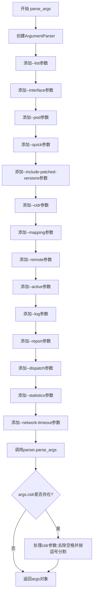
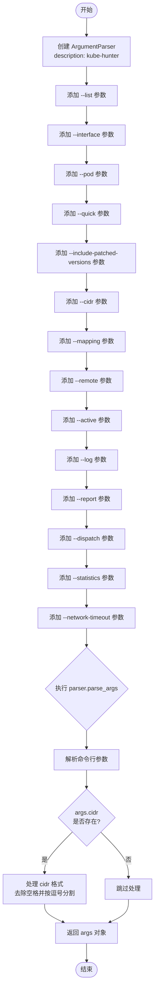
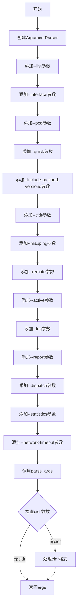

# `kubehunter\kube_hunter\conf\parser.py` 详细设计文档

这是kube-hunter工具的命令行参数解析模块，通过argparse库定义并解析各类扫描配置参数，包括扫描模式、目标范围、日志级别、报告格式等，用于配置Kubernetes集群安全漏洞扫描行为。

## 整体流程



## 类结构

```
parse_args (模块)
└── parse_args (函数)
    └── ArgumentParser ( argparse.ArgumentParser类实例)
```

## 全局变量及字段


### `parser`
    
ArgumentParser实例，用于定义和解析命令行参数

类型：`ArgumentParser`
    


### `args`
    
Namespace对象，包含解析后的命令行参数值

类型：`Namespace`
    


    

## 全局函数及方法


### `parse_args`

该函数使用 Python 的 `argparse` 模块构建命令行参数解析器，定义并添加所有 kube-hunter 工具所需的命令行选项（如 `--list`、`--remote`、`--active` 等），解析用户输入的参数后进行简单处理（如 CIDR 格式转换），最终返回一个包含所有命令行参数的 `Namespace` 对象。

参数：
- 该函数无参数

返回值：`args`（`argparse.Namespace` 对象），包含所有解析后的命令行参数，如 `list`、`interface`、`pod`、`quick`、`cidr`、`remote`、`active`、`log`、`report`、`dispatch`、`statistics`、`network_timeout` 等属性。

#### 流程图



#### 带注释源码

```python
from argparse import ArgumentParser  # 导入 argparse 模块的 ArgumentParser 类


def parse_args():
    """
    解析命令行参数并返回包含所有选项的 Namespace 对象
    """
    # 创建 ArgumentParser 实例，设置程序描述信息
    parser = ArgumentParser(description="kube-hunter - hunt for security weaknesses in Kubernetes clusters")

    # 添加 --list 参数：显示所有测试用例（加上 --active 可显示主动测试）
    parser.add_argument(
        "--list", action="store_true", help="Displays all tests in kubehunter (add --active flag to see active tests)",
    )

    # 添加 --interface 参数：设置在所有网络接口上进行狩猎
    parser.add_argument("--interface", action="store_true", help="Set hunting on all network interfaces")

    # 添加 --pod 参数：将 hunter 设置为内部 Pod
    parser.add_argument("--pod", action="store_true", help="Set hunter as an insider pod")

    # 添加 --quick 参数：优先使用快速扫描（子网 24）
    parser.add_argument("--quick", action="store_true", help="Prefer quick scan (subnet 24)")

    # 添加 --include-patched-versions 参数：扫描时不跳过已修复版本
    parser.add_argument(
        "--include-patched-versions", action="store_true", help="Don't skip patched versions when scanning",
    )

    # 添加 --cidr 参数：设置要扫描/忽略的 IP 范围
    parser.add_argument(
        "--cidr",
        type=str,
        help="Set an IP range to scan/ignore, example: '192.168.0.0/24,!192.168.0.8/32,!192.168.0.16/32'",
    )

    # 添加 --mapping 参数：仅输出集群节点的映射
    parser.add_argument(
        "--mapping", action="store_true", help="Outputs only a mapping of the cluster's nodes",
    )

    # 添加 --remote 参数：指定一个或多个远程 IP/DNS 进行狩猎
    parser.add_argument(
        "--remote", nargs="+", metavar="HOST", default=list(), help="One or more remote ip/dns to hunt",
    )

    # 添加 --active 参数：启用主动狩猎模式
    parser.add_argument("--active", action="store_true", help="Enables active hunting")

    # 添加 --log 参数：设置日志级别
    parser.add_argument(
        "--log",
        type=str,
        metavar="LOGLEVEL",
        default="INFO",
        help="Set log level, options are: debug, info, warn, none",
    )

    # 添加 --report 参数：设置报告类型
    parser.add_argument(
        "--report", type=str, default="plain", help="Set report type, options are: plain, yaml, json",
    )

    # 添加 --dispatch 参数：设置报告发送目标
    parser.add_argument(
        "--dispatch",
        type=str,
        default="stdout",
        help="Where to send the report to, options are: "
        "stdout, http (set KUBEHUNTER_HTTP_DISPATCH_URL and "
        "KUBEHUNTER_HTTP_DISPATCH_METHOD environment variables to configure)",
    )

    # 添加 --statistics 参数：显示狩猎统计信息
    parser.add_argument("--statistics", action="store_true", help="Show hunting statistics")

    # 添加 --network-timeout 参数：设置网络操作超时时间
    parser.add_argument("--network-timeout", type=float, default=5.0, help="network operations timeout")

    # 解析命令行参数，返回 Namespace 对象
    args = parser.parse_args()
    
    # 如果指定了 --cidr 参数，处理格式：去除空格并按逗号分割为列表
    if args.cidr:
        args.cidr = args.cidr.replace(" ", "").split(",")
    
    # 返回解析后的参数对象
    return args
```

## 关键组件


### 核心功能概述

该代码是kube-hunter安全扫描工具的命令行参数解析模块，通过argparse库定义并解析所有命令行参数，包括扫描模式、网络配置、日志级别、报告输出等选项，最终返回一个包含所有用户指定参数的Namespace对象供主程序使用。

### 文件整体运行流程

1. 创建ArgumentParser实例并设置程序描述
2. 通过add_argument方法定义所有命令行参数（包含标志位、字符串、浮点数、列表等类型）
3. 调用parse_args()解析命令行输入
4. 对cidr参数进行后处理（移除空格、分割为列表）
5. 返回解析后的args对象给调用者

### 全局函数详细信息

#### parse_args

- **参数**: 无
- **参数类型**: 无
- **参数描述**: 无
- **返回值类型**: Namespace对象
- **返回值描述**: 包含所有命令行参数值的命名空间对象
- **流程图**: 

- **源码**:
```python
def parse_args():
    parser = ArgumentParser(description="kube-hunter - hunt for security weaknesses in Kubernetes clusters")

    parser.add_argument(
        "--list", action="store_true", help="Displays all tests in kubehunter (add --active flag to see active tests)",
    )

    parser.add_argument("--interface", action="store_true", help="Set hunting on all network interfaces")

    parser.add_argument("--pod", action="store_true", help="Set hunter as an insider pod")

    parser.add_argument("--quick", action="store_true", help="Prefer quick scan (subnet 24)")

    parser.add_argument(
        "--include-patched-versions", action="store_true", help="Don't skip patched versions when scanning",
    )

    parser.add_argument(
        "--cidr",
        type=str,
        help="Set an IP range to scan/ignore, example: '192.168.0.0/24,!192.168.0.8/32,!192.168.0.16/32'",
    )

    parser.add_argument(
        "--mapping", action="store_true", help="Outputs only a mapping of the cluster's nodes",
    )

    parser.add_argument(
        "--remote", nargs="+", metavar="HOST", default=list(), help="One or more remote ip/dns to hunt",
    )

    parser.add_argument("--active", action="store_true", help="Enables active hunting")

    parser.add_argument(
        "--log",
        type=str,
        metavar="LOGLEVEL",
        default="INFO",
        help="Set log level, options are: debug, info, warn, none",
    )

    parser.add_argument(
        "--report", type=str, default="plain", help="Set report type, options are: plain, yaml, json",
    )

    parser.add_argument(
        "--dispatch",
        type=str,
        default="stdout",
        help="Where to send the report to, options are: "
        "stdout, http (set KUBEHUNTER_HTTP_DISPATCH_URL and "
        "KUBEHUNTER_HTTP_DISPATCH_METHOD environment variables to configure)",
    )

    parser.add_argument("--statistics", action="store_true", help="Show hunting statistics")

    parser.add_argument("--network-timeout", type=float, default=5.0, help="network operations timeout")

    args = parser.parse_args()
    if args.cidr:
        args.cidr = args.cidr.replace(" ", "").split(",")
    return args
```

### 关键组件信息

#### ArgumentParser实例

命令行参数解析器核心组件，负责定义参数和解析用户输入

#### --cidr参数处理逻辑

对CIDR格式字符串进行预处理，移除空格并转换为列表

#### 参数验证与转换

包含默认值设置、类型转换（float、str、list）和格式规范化

### 潜在技术债务与优化空间

1. **缺少参数校验**: 没有对remote参数进行IP地址或域名格式验证
2. **日志级别无校验**: log参数接受任意字符串，应验证是否为有效日志级别
3. **报告类型无校验**: report参数应验证是否为有效选项（plain/yaml/json）
4. **dispatch参数验证缺失**: http模式未验证环境变量是否已设置
5. **网络超时缺少边界检查**: network-timeout未检查是否为正数或合理范围
6. **参数文档与实现分散**: help信息中的选项说明分散在不同位置，维护性较差

### 其它项目

#### 设计目标与约束

- 目标：提供灵活的命令行接口供用户配置kube-hunter扫描行为
- 约束：使用标准库argparse，保持简单性和兼容性

#### 错误处理与异常设计

- 依赖argparse内置的错误处理机制
- 无效参数会触发系统自动的错误提示和退出
- cidr参数的后处理使用简单的字符串操作，未捕获潜在异常

#### 数据流与状态机

- 数据流：命令行输入 → argparse解析 → 后处理 → 返回Namespace对象
- 无复杂状态机设计

#### 外部依赖与接口契约

- 依赖：argparse模块（Python标准库）
- 接口契约：返回包含所有定义参数的Namespace对象，调用者通过args.attribute访问各参数值


## 问题及建议


### 已知问题

-   **CIDR 参数处理方式不健壮**：使用简单的 `.replace(" ", "")` 和 `.split(",")` 无法处理所有边界情况，如带引号的字符串、引号内包含逗号、格式错误等，可能导致解析失败或意外行为
-   **缺少输入验证**：对关键参数（CIDR 格式、远程主机地址、日志级别、报告类型等）均未进行合法性验证，用户输入无效值时程序可能后续才报错，缺乏提前反馈
-   **日志级别未验证**：虽然 help 信息中说明了选项（debug, info, warn, none），但未对用户输入进行校验，非法日志级别会导致后续日志配置异常
-   **环境变量依赖未预检查**：当 `--dispatch http` 时依赖 `KUBEHUNTER_HTTP_DISPATCH_URL` 和 `KUBEHUNTER_HTTP_DISPATCH_METHOD` 环境变量，但解析参数时未检查其存在性，导致后续运行时才失败
-   **报告类型和分发方式未验证**：与日志级别类似，`--report` 和 `--dispatch` 的可选值也未进行校验
-   **缺少参数间互斥校验**：某些参数可能存在互斥关系（如 `--list` 与 `--remote`），当前未做检查
-   **网络超时参数无边界校验**：虽然设置了默认值 5.0，但未校验是否为合理范围（如正数、不能为 0 或负数）

### 优化建议

-   为 CIDR、远程主机地址等复杂参数添加专门的解析函数或使用第三方验证库（如 ipaddress 模块）进行格式校验
-   在 parse_args 函数中添加日志级别、报告类型、分发方式等枚举值的校验逻辑，无效输入时给出明确错误提示
-   在参数解析完成后检查环境变量依赖，使用 argparse 的 `type` 参数或自定义 action 进行预处理和错误报告
-   添加参数互斥检查（如 `--list` 与其他扫描参数不能同时使用），可利用 argparse 的 mutually_exclusive_group
-   为数值参数（network-timeout、cidr 相关数值）添加范围校验，确保输入值合理
-   考虑将默认值和可选值配置化，便于维护和扩展
-   增加单元测试覆盖参数解析的各种边界情况和错误输入场景


## 其它


### 设计目标与约束

本模块的设计目标是提供一个灵活且用户友好的命令行参数解析接口，支持kube-hunter的多种扫描模式和输出选项。约束包括：使用Python标准库的argparse模块确保跨平台兼容性；参数命名遵循Kubernetes社区惯例；默认值为常规使用场景优化，同时提供高级选项满足定制化需求。

### 错误处理与异常设计

本模块主要处理两类错误：1) 命令行参数格式错误 - argparse自动捕获并显示用法信息；2) 参数值合法性错误 - 如CIDR格式不正确、网络超时值非正数等，需要在调用处进行额外校验。当前代码未实现参数值校验逻辑，建议在parse_args返回后添加校验或使用argparse的type参数自定义验证函数。

### 数据流与状态机

数据流：用户输入命令行参数 → argparse解析 → 参数对象args → 传递给核心扫描模块。无复杂状态机设计，状态流转简单：解析成功返回args对象，解析失败（-h/--help或错误）则退出程序。

### 外部依赖与接口契约

外部依赖：argparse（Python标准库）、sys（用于argparse错误时退出）。接口契约：parse_args()函数无输入参数，返回Namespace对象，包含所有命令行选项对应的属性（如args.remote、args.active等）。调用方通过args.remote、args.cidr等方式访问参数值。

### 配置管理

配置来源于三个方面：1) 命令行参数（最高优先级）；2) 环境变量（如KUBEHUNTER_HTTP_DISPATCH_URL、KUBEHUNTER_HTTP_DISPATCH_METHOD）；3) 配置文件（当前代码未实现）。建议后续支持配置文件以简化常用选项管理。

### 安全性考虑

当前模块本身安全风险较低，但存在以下改进点：1) remote参数未验证输入是否为有效IP/DNS，存在注入风险；2) cidr参数应校验CIDR格式合法性；3) 敏感信息（如HTTP dispatch URL）不应通过命令行历史记录暴露，建议支持交互式输入。

### 性能考虑

parse_args()性能开销极低，主要瓶颈在后续网络扫描模块。当前设计对性能无显著影响，无需优化。

### 日志与监控

本模块不涉及日志记录，所有日志配置通过--log参数传递给后续模块处理。监控指标：无。

### 国际化/本地化

当前仅支持英文描述（description和help文本）。如需国际化，需将所有字符串提取至locale文件并使用gettext或i18n框架。

### 测试策略

建议添加以下测试用例：1) 默认参数解析验证；2) 各参数组合解析验证；3) 非法参数值校验；4) help输出格式验证；5) CIDR参数空格处理逻辑验证。可使用unittest或pytest框架。

### 使用示例

```bash
# 列出所有测试
python kubehunter.py --list

# 快速扫描本地子网
python kubehunter.py --quick

# 远程扫描指定目标
python kubehunter.py --remote 192.168.1.10 example.com --active

# 输出JSON格式报告
python kubehunter.py --report json --remote targetkube.com

# 自定义CIDR范围扫描
python kubehunter.py --cidr "10.0.0.0/16,!10.0.0.5/32"
```

### 兼容性考虑

argparse为Python 3.2+标准库，兼容Python 3.5+。命令行接口设计遵循POSIX惯例，支持Linux、macOS、Windows三大平台。部分参数行为可能因操作系统差异（如网络超时默认值）需做平台适配。

    