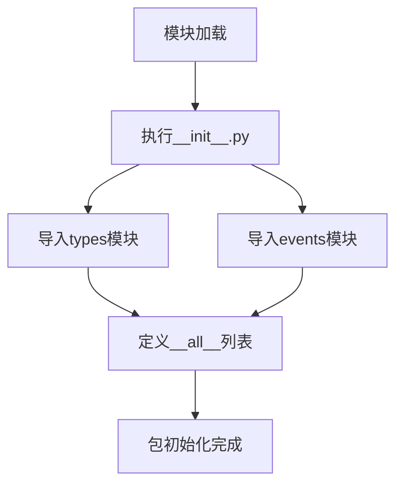

# `kubehunter\kube_hunter\core\__init__.py` 详细设计文档

这是项目的包初始化文件，负责导出types和events两个子模块，使得它们可以通过包级别导入访问，定义了公共接口列表__all__来控制星号导入的行为。

## 整体流程



## 类结构

```
包根目录
├── __init__.py (当前文件)
├── types (子模块)
└── events (子模块)
```

## 全局变量及字段


### `__all__`
    
定义公共接口导出列表，指定该模块允许被外部导入的子模块

类型：`list`
    


    

## 全局函数及方法


## 关键组件


### types 模块

types 是当前包的子模块，通过相对导入被引入到包中，提供数据类型相关的定义和功能。

### events 模块

events 是当前包的子模块，通过相对导入被引入到包中，提供事件处理相关的功能。

### __all__ 列表

__all__ 是一个列表变量，定义了包被导入时的公开接口，包含 types 和 events 两个模块。


## 问题及建议


### 已知问题

- `__all__` 定义不规范：直接包含模块对象而非字符串列表，标准做法是使用字符串列表来定义公共API
- 缺少包级文档字符串：没有说明该包的用途和功能
- 无版本信息：缺少 `__version__` 或类似版本标识
- 缺少异常处理：导入语句未考虑模块可能不存在时的容错处理

### 优化建议

- 将 `__all__` 改为字符串列表：`__all__ = ['types', 'events']`
- 添加包级文档字符串说明模块功能
- 考虑添加版本信息，如 `__version__ = '1.0.0'`
- 若后续模块增多，可考虑使用延迟导入（lazy import）优化启动性能
- 可添加 `__init__.py` 的功能注释，说明该包的核心职责


## 其它


### 设计目标与约束

本模块作为包的入口文件，主要目标是将内部的types和events子模块统一导出，提供清晰的API接口。设计约束包括：保持简单的导入结构、确保__all__列表与实际导出一致、避免循环依赖。

### 错误处理与异常设计

由于仅包含导入语句，不涉及复杂的业务逻辑，因此不设计专门的异常处理机制。若导入失败，Python会抛出ImportError异常，由上层调用者处理。

### 数据流与状态机

本模块不涉及数据流处理或状态机设计，仅作为模块导入的传递层。

### 外部依赖与接口契约

外部依赖：依赖于同级目录下的types和events子模块。接口契约：通过__all__定义的公共接口为types和events两个模块对象，调用者可通过from package import *获取这两个模块。

### 性能考虑

本模块在导入时执行，开销极低。性能优化主要依赖于types和events子模块的导入优化。

### 安全考虑

仅导入本地子模块，无安全风险。需确保types和events模块来源可信。

### 测试策略

测试重点验证：导入成功性、__all__列表准确性、子模块可访问性。可通过import语句和属性检查进行单元测试。

### 版本兼容性

遵循标准Python 3语法，无特定版本依赖要求。

### 部署配置

无需特殊部署配置，作为普通Python包的一部分进行分发。

### 文档和注释规范

当前代码无文档字符串，建议添加模块级docstring说明包的功能和用途。

    