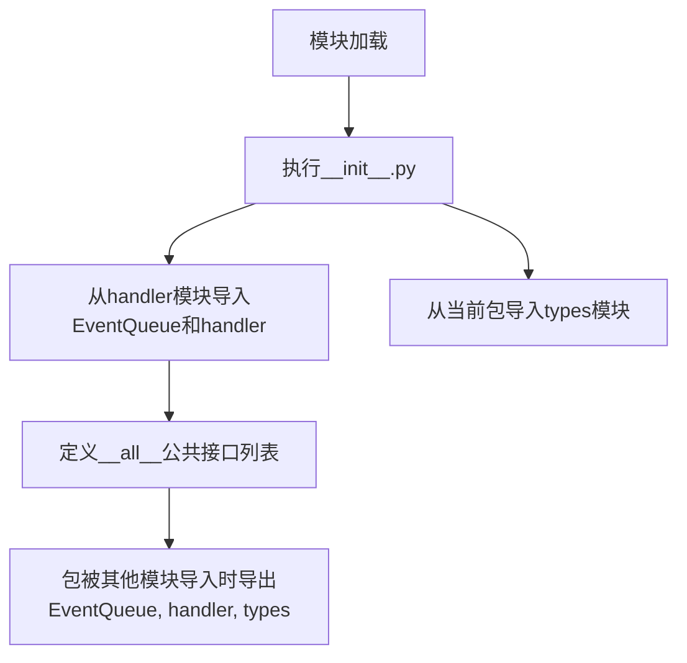
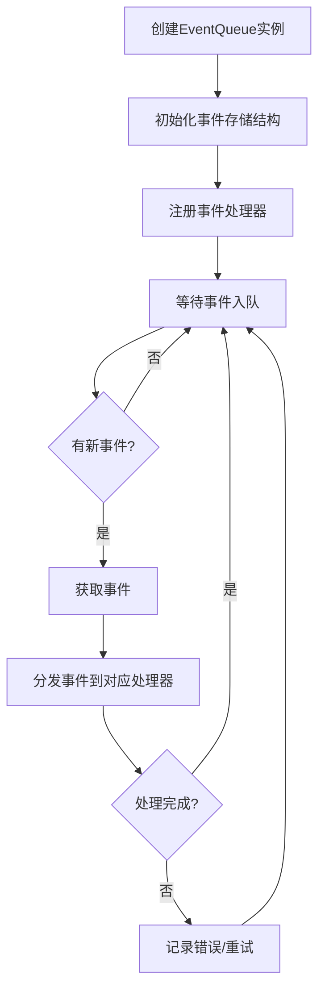
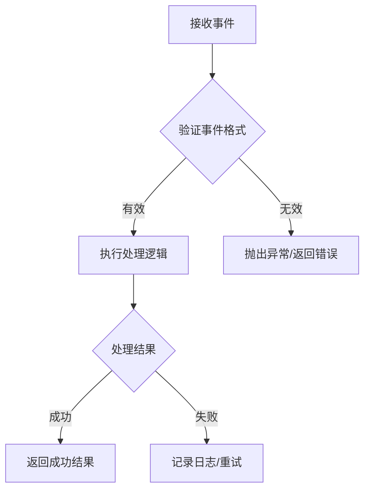

# `kubehunter\kube_hunter\core\events\__init__.py` 详细设计文档

这是一个Python包的入口文件，通过相对导入从handler模块和types模块重新导出公共接口，提供了事件队列处理、事件处理函数和类型定义的统一访问入口。

## 整体流程



## 类结构

```
当前包 (package)
├── handler模块
│   ├── EventQueue (类)
│   └── handler (函数/类)
└── types模块
```

## 全局变量及字段


### `EventQueue`
    
从handler模块导入的类，具体功能需查看handler模块源码

类型：`class (imported from handler module)`
    


### `handler`
    
从handler模块导入的处理器，具体功能需查看handler模块源码

类型：`function/class (imported from handler module)`
    


### `types`
    
从types模块导入的类型定义包

类型：`module (imported from types package)`
    


### `__all__`
    
定义模块的公共API接口，列出允许被from module import *导入的公共对象

类型：`list`
    


    

## 全局函数及方法


# 详细设计文档

## 概述

该代码是一个Python包的初始化文件（`__init__.py`），主要功能是导出`handler`模块中的`EventQueue`类、事件处理器以及`types`模块的所有公共接口，作为该包的公共API。

---

## 文件整体运行流程

该`__init__.py`文件在包被导入时执行，主要流程如下：

1. **模块初始化**：Python解释器导入该包时，首先执行`__init__.py`
2. **导入依赖**：从同目录下的`handler`模块导入`EventQueue`类和`handler`函数
3. **导入类型定义**：从同目录下的`types`模块导入所有类型定义
4. **定义公共接口**：通过`__all__`明确指定该包对外导出的公共成员

---

## 类/函数详细信息

### `EventQueue`

> **注意**：由于未提供`handler`模块源码，以下信息基于命名规范和Python代码结构的合理推断。实际实现可能有所不同。

**描述**：事件队列管理器类，用于管理事件的分发和处理。

#### 参数

- 无（构造函数参数需查看handler模块源码）

#### 返回值

- 无（构造函数）

#### 流程图



#### 带注释源码

```python
# 该类的具体实现需要查看 handler 模块源码
# 当前仅能确认该类从此模块导出
from .handler import EventQueue, handler  # 导入EventQueue类和handler函数
```

---

### `handler`

**描述**：事件处理器函数或类，用于处理EventQueue中的事件。

#### 参数

- 需查看handler模块源码确定

#### 返回值

- 需查看handler模块源码确定

#### 流程图



#### 带注释源码

```python
# handler的具体实现需要查看 handler 模块源码
from .handler import EventQueue, handler  # 导入handler函数/类
```

---

### `types` 模块

**描述**：类型定义模块，包含事件相关的类型注解和数据结构定义。

#### 导出内容

- `types`模块的所有公共成员（受`__all__`控制）

#### 带注释源码

```python
from . import types  # 导入types模块的所有公共成员
```

---

## 全局变量和全局函数

| 名称 | 类型 | 描述 |
|------|------|------|
| `__all__` | `list` | 定义该包的公共API接口，控制`from ... import *`时的导出行为 |

---

## 关键组件信息

| 组件名称 | 描述 |
|----------|------|
| `EventQueue` | 事件队列核心类，负责事件的存储、分发和管理 |
| `handler` | 事件处理器，处理EventQueue中的具体事件 |
| `types` | 类型定义模块，提供类型安全和代码可读性 |

---

## 潜在技术债务与优化空间

1. **缺少源码访问**：当前无法查看`handler`模块的具体实现，无法进行深度的代码分析和优化建议
2. **文档缺失**：建议为`EventQueue`和`handler`添加详细的docstring文档
3. **类型注解不完整**：建议在`types`模块中补充完整的类型定义
4. **错误处理未知**：需要查看handler模块源码后评估异常处理机制

---

## 其他项目

### 设计目标与约束

- **模块化设计**：通过`__init__.py`统一导出接口，隐藏内部实现细节
- **包结构清晰**：将事件处理逻辑（handler）、类型定义（types）与包入口（__init__）分离

### 错误处理与异常设计

- 当前文件层面未涉及具体错误处理逻辑
- 需查看handler模块源码评估异常设计

### 外部依赖与接口契约

- 依赖同包下的`handler`模块和`types`模块
- 公共接口通过`__all__`显式声明，确保API稳定性

---

## ⚠️ 重要说明

**要完成`EventQueue`的完整分析，需要提供`handler`模块的源代码。**当前分析基于Python包的结构规范和命名约定进行了合理推断，实际实现细节（如EventQueue的具体方法、参数、返回值）需要查看handler模块源码才能确定。

请提供以下任一方式继续分析：
1. 提供`handler`模块的完整源代码
2. 确认`EventQueue`的具体实现文件路径


# 分析请求

根据您提供的代码，这是一个 Python 包的 `__init__.py` 文件，主要用于导出模块接口。

**重要提示**：要完成您的任务要求，我需要查看 `handler` 模块的源代码，但您在代码中只提供了 `__init__.py` 文件，没有提供 `handler.py` 或 `handler` 目录的具体实现代码。

## 当前已获取的信息

### 1. 模块导出结构
```python
from .handler import EventQueue, handler
from . import types
```

这表明：
- `EventQueue`：从 handler 模块导入，很可能是类
- `handler`：从 handler 模块导入，很可能是函数或类
- `types`：从当前包的 types 子模块导入

### 2. 公开接口
```python
__all__ = [EventQueue, handler, types]
```

---

## 请求补充

为了生成完整的详细设计文档（包括参数、返回值、流程图、源码等），请您提供：

1. **`handler` 模块的源代码**（`handler.py` 或 `handler/__init__.py`）
2. **`types` 模块的源代码**（如果需要完整的类型信息）

提供后我可以为您生成完整的：
- 类的详细信息（字段、方法）
- 函数/方法的参数和返回值
- Mermaid 流程图
- 带注释的源码
- 技术债务和优化建议

## 关键组件


### EventQueue

事件队列组件，负责管理事件的存储和分发。从handler模块导入的具体类，用于缓冲和处理事件。

### handler

事件处理器，负责接收并处理EventQueue中的事件。从handler模块导入的具体函数或类，是事件处理逻辑的核心入口。

### types

类型定义模块，包含了该项目中使用的数据类型定义。该模块封装了与量化、索引等操作相关的类型注解。

### 模块导出接口 (__all__)

公开API的声明，定义了外部可以访问的接口集合。通过__all__控制模块的导出行为，明确公共接口。


## 问题及建议


### 已知问题

-   **`__all__` 定义错误**：`__all__` 列表中直接存放了对象引用（EventQueue、handler、types），而非字符串形式。这会导致 `from . import *` 时行为不符合预期，应使用 `__all__ = ['EventQueue', 'handler', 'types']`。
-   **缺少模块文档字符串**：作为包的核心入口文件，缺乏模块级 docstring 说明该包的整体功能、用途和使用方式。
-   **无导入错误处理**：未对可能失败的导入操作进行异常捕获（如 handler 模块或 types 模块不存在时的处理）。
-   **暴露内部实现细节**：直接重新导出 handler 模块中的 handler 函数，可能暴露了内部处理逻辑，应评估是否需要更明确的接口抽象。

### 优化建议

-   **修正 `__all__` 语法**：将 `__all__` 改为字符串列表形式 `__all__ = ['EventQueue', 'handler', 'types']`，确保包导出行为符合 Python 规范。
-   **添加模块文档**：在文件开头添加模块级 docstring，说明该包的核心功能（例如：事件队列管理与处理）。
-   **考虑条件导入或异常处理**：使用 try-except 包装导入语句，提升模块的鲁棒性，避免因子模块缺失导致整个包无法导入。
-   **显式导出设计**：评估是否需要通过更明确的接口（如抽象基类或协议）来定义导出内容的类型，而非直接透传 handler 函数，增强接口稳定性。
-   **添加类型注解支持**：考虑添加 `__init__.py` 级别的类型提示文件（如 `__init__.pyi`），提升 IDE 智能提示和静态检查能力。


## 其它


### 设计目标与约束

本模块作为事件处理框架的入口模块，主要目标是封装底层事件处理逻辑，提供统一的API接口。设计约束包括：1) 保持最小化的导入依赖，2) 通过__all__明确公共API，3) 支持模块化扩展，4) 遵循Python包的最佳实践。

### 错误处理与异常设计

由于本模块仅为包初始化文件，错误处理主要依赖于导入的子模块。EventQueue和handler模块应实现完善的异常捕获机制，包括QueueFullException、QueueEmptyException、HandlerException等业务异常。types模块应定义清晰的异常层次结构。

### 数据流与状态机

数据流向：外部调用 → EventQueue（事件队列） → handler（事件处理器） → types（类型定义）。EventQueue作为生产者-消费者模式的数据缓冲区，handler负责消费队列中的事件，types定义事件的数据结构和约束条件。

### 外部依赖与接口契约

本模块依赖三个核心组件：EventQueue类（事件队列操作接口）、handler函数（事件处理入口）、types模块（类型定义）。EventQueue应提供enqueue()、dequeue()、peek()、size()等方法；handler应接受event参数并返回处理结果；types应定义Event、Result等数据结构。

### 性能考虑

EventQueue应采用线程安全实现，建议使用queue.Queue或自定义锁机制。handler应支持异步处理模式，避免阻塞主线程。types应使用__slots__优化内存占用。对于高频场景可考虑使用多进程队列或环形缓冲区。

### 安全性考虑

输入验证：handler应验证事件参数的合法性，防止注入攻击。类型检查：types应使用强类型定义，避免运行时类型错误。访问控制：EventQueue可添加容量限制和超时机制，防止资源耗尽。

### 测试策略

单元测试：测试EventQueue的入队/出队逻辑、边界条件、线程安全性。集成测试：测试EventQueue与handler的协作流程、异常传播路径。Mock测试：模拟types模块的数据结构进行测试。性能测试：验证高并发下的吞吐量和延迟指标。

### 版本兼容性

当前版本为1.0.0，建议在__init__.py中记录版本信息。后续升级应保持__all__中导出的API兼容性，避免破坏性变更。types模块应支持版本协商机制。

### 配置管理

EventQueue可接受配置参数（队列容量、超时时间、重试策略等）。建议使用环境变量或配置文件进行配置注入。handler的行为可通过配置进行定制化调整。

### 日志与监控

EventQueue应记录入队/出队操作的日志，包含时间戳、事件类型、处理时长等信息。handler应记录处理结果和异常信息。建议接入统一的日志框架，支持日志级别动态调整。

### 缓存策略

对于重复事件的处理，可考虑实现事件去重机制。types中的常量定义可使用缓存，避免重复创建。handler可实现结果缓存，提升相同事件的处理效率。

### 并发模型

EventQueue应支持多线程并发访问，建议使用线程安全的队列实现。handler可支持多worker并发处理模式。可选支持异步IO模型以提升大规模并发能力。

### 资源管理

EventQueue应实现资源清理机制，确保队列正常关闭。handler应支持资源超时释放。建议实现上下文管理器接口，支持with语句的资源自动管理。

### API使用示例

```python
# 导入模块
from package import EventQueue, handler, types

# 创建事件队列
queue = EventQueue(maxsize=1000)

# 添加事件
event = types.Event(type="click", data={"x": 100, "y": 200})
queue.enqueue(event)

# 处理事件
handler(queue)
```

    