# `kubehunter\kube_hunter\core\events\handler.py` 详细设计文档

这是一个Kubernetes漏洞扫描框架的核心事件处理模块，通过异步队列机制管理被动和主动扫描器的事件订阅、过滤与分发，支持装饰器方式的灵活订阅、一次性订阅、事件过滤器链式处理，以及多线程worker并发执行扫描任务。

## 整体流程

```mermaid
graph TD
    A[主程序启动] --> B[创建EventQueue实例]
    B --> C[初始化800个Worker线程]
    C --> D[启动Notifier守护线程]
    D --> E[等待事件发布]
    E --> F[调用publish_event发布事件]
    F --> G{应用过滤器}
    G -->|事件被过滤| H[返回None不发布]
    G -->|事件通过| I[遍历hooks查找订阅者]
    I --> J[将hook加入队列]
    J --> K[Worker线程取出hook]
    K --> L[执行hook.execute()]
    L --> M{任务完成?}
    M -->|是| N[通知Notifier]
    M -->|否| E
    N --> O[程序结束/free调用]
    O --> P[停止running标志]
    P --> Q[清空队列]
```

## 类结构

```
Queue (标准库基类)
└── EventQueue (自定义事件队列处理器)
```

## 全局变量及字段


### `logger`
    
Logger instance for the module to log debug and error messages.

类型：`logging.Logger`
    


### `handler`
    
Global EventQueue singleton used for event handling, initialized with 800 worker threads.

类型：`EventQueue`
    


### `EventQueue.passive_hunters`
    
Dictionary storing passive hunter instances keyed by their class.

类型：`dict`
    


### `EventQueue.active_hunters`
    
Dictionary storing active hunter instances keyed by their class.

类型：`dict`
    


### `EventQueue.all_hunters`
    
Dictionary storing all hunter instances (both active and passive) keyed by their class.

类型：`dict`
    


### `EventQueue.hooks`
    
Mapping from events to list of subscriber hooks (hunters) that handle them.

类型：`defaultdict`
    


### `EventQueue.filters`
    
Mapping from events to list of filter hooks that can modify or suppress events.

类型：`defaultdict`
    


### `EventQueue.running`
    
Flag indicating whether the event queue workers are still running.

类型：`bool`
    


### `EventQueue.workers`
    
List of daemon threads that consume and execute queued hook tasks.

类型：`list`
    
    

## 全局函数及方法


### `logging.getLogger(__name__)`

获取模块级日志器，用于在当前模块中创建并返回一个logger实例，以便在该模块中进行日志记录操作。该日志器以当前模块的完整路径作为名称，便于在日志输出时识别日志来源。

参数：

- `__name__`：`str`，Python内置变量，表示当前模块的完全限定名称（如`kube_hunter.core.events.queue`）

返回值：`logging.Logger`，返回一个Logger对象实例，用于记录日志信息

#### 流程图

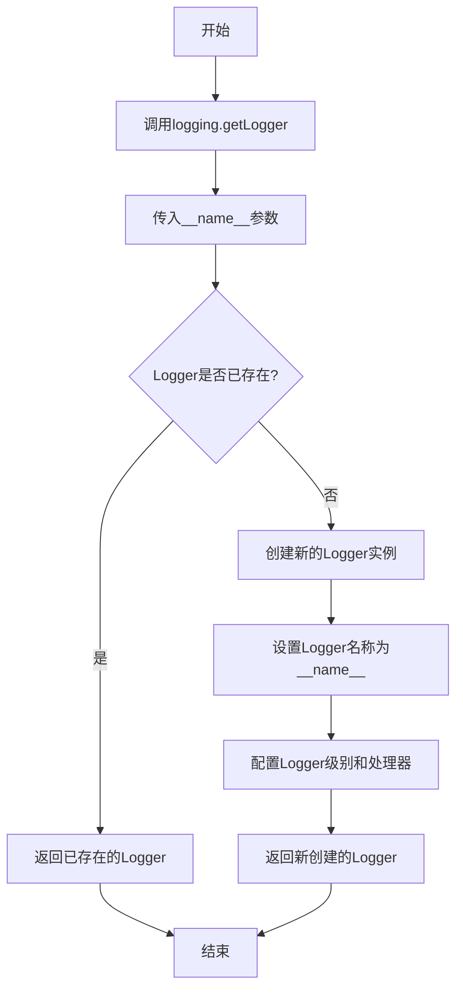

#### 带注释源码

```python
# 导入Python标准库中的logging模块，用于日志记录
import logging
# ... 其他导入语句 ...

# 获取当前模块的日志记录器
# __name__ 是Python内置变量，值为当前模块的全限定名称
# logging.getLogger() 根据传入的名称返回对应的Logger实例
# 如果该名称的Logger已存在，则返回现有实例；否则创建新的Logger
logger = logging.getLogger(__name__)

# 后续使用示例：
# logger.debug("调试信息")   # 输出调试级别日志
# logger.info("普通信息")     # 输出信息级别日志
# logger.warning("警告信息") # 输出警告级别日志
# logger.error("错误信息")   # 输出错误级别日志
# logger.critical("严重错误")# 输出严重错误级别日志
```

#### 详细说明

| 项目 | 说明 |
|------|------|
| **函数名称** | `logging.getLogger` |
| **调用方式** | `logging.getLogger(__name__)` |
| **参数类型** | `str` (通过`__name__`传递) |
| **返回值类型** | `logging.Logger` |
| **日志级别** | 默认级别为WARNING，可通过配置调整 |
| **模块用途** | 为当前模块提供独立的日志记录能力，便于追踪日志来源和进行日志分类 |
| **配置依赖** | 根日志器的配置会影响返回的Logger实例的行为 |


### `EventQueue.__init__`

构造函数，初始化事件队列并启动worker线程和notifier线程。

参数：

- `num_worker`：`int`，可选参数，默认为10，指定worker线程的数量

返回值：`None`，构造函数无返回值

#### 流程图

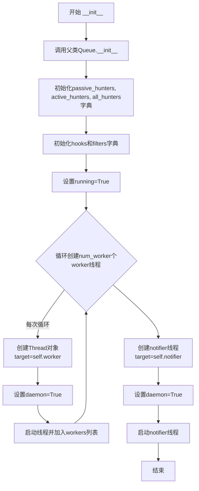

#### 带注释源码

```python
def __init__(self, num_worker=10):
    # 调用父类Queue的初始化方法
    super(EventQueue, self).__init__()
    
    # 初始化被动 hunter 字典，用于存储订阅事件的被动hunter
    self.passive_hunters = dict()
    # 初始化主动 hunter 字典，用于存储订阅事件的主动hunter
    self.active_hunters = dict()
    # 初始化所有 hunter 字典，存储所有类型的hunter
    self.all_hunters = dict()

    # 使用defaultdict创建hooks字典，默认值为空列表
    # 用于存储事件与处理函数的映射
    self.hooks = defaultdict(list)
    # 使用defaultdict创建filters字典，默认值为空列表
    # 用于存储事件与过滤器的映射
    self.filters = defaultdict(list)
    # 标志位，控制线程运行状态
    self.running = True
    # 存储所有worker线程的列表
    self.workers = list()

    # 循环创建指定数量的worker线程
    for _ in range(num_worker):
        # 创建Thread对象，target指定线程执行的目标函数为self.worker
        t = Thread(target=self.worker)
        # 设置为守护线程，当主程序退出时自动终止
        t.daemon = True
        # 启动线程
        t.start()
        # 将线程对象添加到workers列表中
        self.workers.append(t)

    # 创建notifier线程，用于监控任务完成情况
    t = Thread(target=self.notifier)
    # 设置为守护线程
    t.daemon = True
    # 启动notifier线程
    t.start()
```

---

### `EventQueue.worker`

Worker线程函数，从队列中取出事件并执行对应的hook处理函数。

参数：无

返回值：`None`，该方法在while循环中持续运行，通过异常处理机制退出

#### 流程图

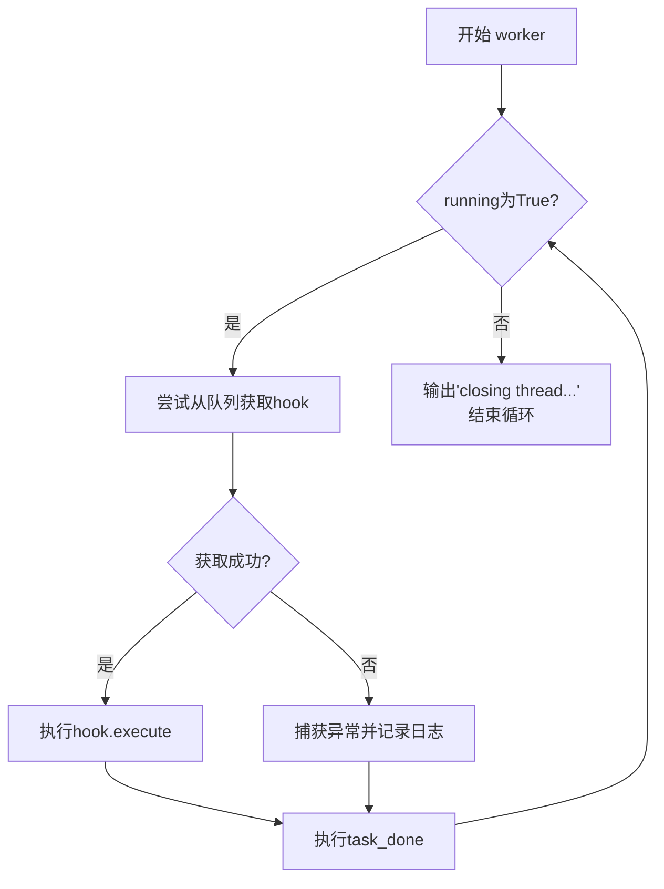

#### 带注释源码

```python
# executes callbacks on dedicated thread as a daemon
def worker(self):
    # 当running标志为True时持续运行
    while self.running:
        try:
            # 从队列中获取一个hook（事件处理器）
            hook = self.get()
            # 记录调试日志，显示执行的hook类和事件字典
            logger.debug(f"Executing {hook.__class__} with {hook.event.__dict__}")
            # 调用hook的execute方法执行具体逻辑
            hook.execute()
        except Exception as ex:
            # 捕获并记录任何异常
            logger.debug(ex, exc_info=True)
        finally:
            # 标记任务完成
            self.task_done()
    # 线程结束时记录日志
    logger.debug("closing thread...")
```

---

### `EventQueue.notifier`

Notifier线程函数，监控未完成任务的数量，在所有任务完成后退出。

参数：无

返回值：`None`，该方法在监控到所有任务完成后退出

#### 流程图

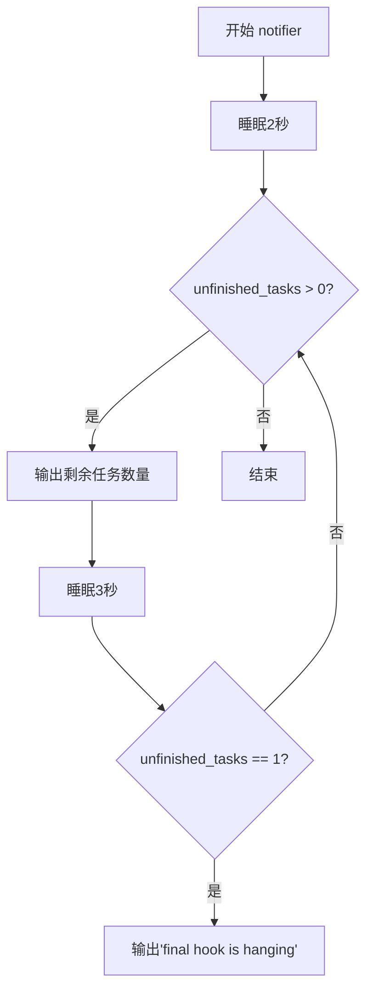

#### 带注释源码

```python
def notifier(self):
    # 初始等待2秒，让worker线程有時間处理任务
    time.sleep(2)
    # should consider locking on unfinished_tasks
    # 当队列中还有未完成的任务时持续监控
    while self.unfinished_tasks > 0:
        # 记录剩余任务数量
        logger.debug(f"{self.unfinished_tasks} tasks left")
        # 每3秒检查一次
        time.sleep(3)
        # 如果只剩一个任务还没完成，认为可能是最后一个hook卡住了
        if self.unfinished_tasks == 1:
            logger.debug("final hook is hanging")
```

---

### 关键组件信息

| 组件名称 | 一句话描述 |
|---------|-----------|
| `Thread` | Python标准库的线程类，用于创建并发执行的工作线程 |
| `daemon` | 守护线程标志，设为True时主程序退出线程自动终止 |
| `worker` | 处理队列中事件的核心工作线程函数 |
| `notifier` | 监控任务完成状态的守护线程函数 |

---

### 技术债务与优化空间

1. **notifier的轮询机制**：使用`sleep`轮询检查`unfinished_tasks`，效率较低且不精确，建议使用线程同步原语（如`Event`、`Condition`）替代

2. **缺少线程数量配置**：worker数量硬编码或通过构造函数传入，无运行时调整能力

3. **异常处理过于宽泛**：worker中的`except Exception`捕获所有异常，可能隐藏潜在的严重问题

4. **线程安全问题**：注释中提到"should consider locking on unfinished_tasks"，表明对`unfinished_tasks`的访问可能存在竞态条件

5. **缺乏优雅停止机制**：stop方法只是简单设置标志位，可能导致正在执行的任务被强制中断

---

### 其它项目

**设计目标与约束**：
- 目标：实现异步事件驱动架构，将事件发布与处理解耦
- 约束：worker和notifier必须作为守护线程运行，确保主程序可正常退出

**错误处理与异常设计**：
- worker方法中捕获所有异常并记录日志，防止单个任务失败影响整体队列运行
- notifier没有异常处理，可能因未预期异常终止

**数据流与状态机**：
- 事件流程：`publish_event` -> `apply_filters` -> 放入队列 -> `worker`取出执行
- 状态：`running=True`表示队列活跃，`running=False`表示队列关闭

**外部依赖与接口契约**：
- 依赖`queue.Queue`：利用其线程安全的队列实现
- 依赖`logging`：用于记录调试信息
- 依赖`config.active`：控制是否启用主动hunter
- 依赖`config.statistics`：控制是否统计漏洞发布数量


### EventQueue

EventQueue 是一个继承自 Queue 的线程安全事件队列实现，通过工作线程异步执行事件钩子，支持事件的订阅、发布和过滤机制，用于协调被动和主动扫描器的事件流。

#### 参数

- `num_worker`：`int`，可选参数，默认为 10，指定工作线程的数量

返回值：`EventQueue`，返回初始化后的事件队列实例

#### 流程图

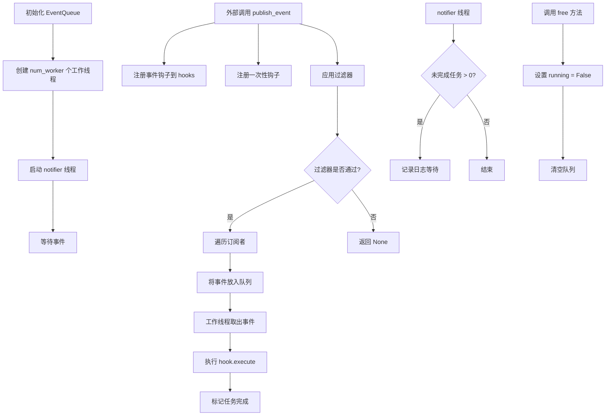

#### 带注释源码

```python
import logging
import time
from collections import defaultdict
from queue import Queue
from threading import Thread

from kube_hunter.conf import config
from kube_hunter.core.types import ActiveHunter, HunterBase
from kube_hunter.core.events.types import Vulnerability, EventFilterBase

logger = logging.getLogger(__name__)


# 继承 Queue 对象，异步处理事件
class EventQueue(Queue, object):
    """事件队列基类，提供线程安全的事件订阅、发布和异步执行机制"""
    
    def __init__(self, num_worker=10):
        """初始化事件队列
        
        参数:
            num_worker: 工作线程数量，默认为 10
        """
        # 调用父类 Queue 的初始化方法
        super(EventQueue, self).__init__()
        
        # 存储被动扫描器和主动扫描器的字典
        self.passive_hunters = dict()  # 被动扫描器映射
        self.active_hunters = dict()   # 主动扫描器映射
        self.all_hunters = dict()      # 所有扫描器映射

        # 事件钩子注册表：事件类型 -> [(hook, predicate), ...]
        self.hooks = defaultdict(list)
        # 过滤器注册表：事件类型 -> [(filter, predicate), ...]
        self.filters = defaultdict(list)
        
        # 控制线程运行状态的标志
        self.running = True
        # 存储工作线程的列表
        self.workers = list()

        # 创建指定数量的工作线程
        for _ in range(num_worker):
            t = Thread(target=self.worker)
            t.daemon = True  # 设置为守护线程
            t.start()
            self.workers.append(t)

        # 启动通知线程，用于监控任务完成情况
        t = Thread(target=self.notifier)
        t.daemon = True
        t.start()

    # 用于简化订阅的装饰器包装器
    def subscribe(self, event, hook=None, predicate=None):
        """事件订阅装饰器
        
        参数:
            event: 事件类型
            hook: 事件处理钩子
            predicate: 可选的过滤谓词
            
        返回:
            装饰器函数
        """
        def wrapper(hook):
            self.subscribe_event(event, hook=hook, predicate=predicate)
            return hook

        return wrapper

    # 包装器实现一次性订阅机制
    def subscribe_once(self, event, hook=None, predicate=None):
        """一次性事件订阅装饰器，钩子执行后自动取消订阅
        
        参数:
            event: 事件类型
            hook: 事件处理钩子
            predicate: 可选的过滤谓词
            
        返回:
            装饰器函数
        """
        def wrapper(hook):
            # 在钩子上安装 __new__ 魔方法，创建后自动移除订阅
            def __new__unsubscribe_self(self, cls):
                handler.hooks[event].remove((hook, predicate))
                return object.__new__(self)

            hook.__new__ = __new__unsubscribe_self

            self.subscribe_event(event, hook=hook, predicate=predicate)
            return hook

        return wrapper

    # 获取未实例化的事件对象
    def subscribe_event(self, event, hook=None, predicate=None):
        """注册事件钩子或过滤器
        
        参数:
            event: 事件类型
            hook: 事件处理钩子/过滤器
            predicate: 可选的过滤谓词
        """
        # 如果钩子是主动扫描器，且未启用主动模式，则跳过
        if ActiveHunter in hook.__mro__:
            if not config.active:
                return
            self.active_hunters[hook] = hook.__doc__
        elif HunterBase in hook.__mro__:
            self.passive_hunters[hook] = hook.__doc__

        # 将扫描器添加到所有扫描器列表
        if HunterBase in hook.__mro__:
            self.all_hunters[hook] = hook.__doc__

        # 注册过滤器
        if EventFilterBase in hook.__mro__:
            if hook not in self.filters[event]:
                self.filters[event].append((hook, predicate))
                logger.debug(f"{hook} filter subscribed to {event}")

        # 注册扫描器钩子
        elif hook not in self.hooks[event]:
            self.hooks[event].append((hook, predicate))
            logger.debug(f"{hook} subscribed to {event}")

    def apply_filters(self, event):
        """对事件应用过滤器
        
        参数:
            event: 待过滤的事件对象
            
        返回:
            过滤后的事件对象，如果被过滤掉则返回 None
        """
        # 如果有过滤器订阅，则对事件应用过滤器
        for hooked_event in self.filters.keys():
            if hooked_event in event.__class__.__mro__:
                for filter_hook, predicate in self.filters[hooked_event]:
                    # 如果有谓词且不满足，则跳过
                    if predicate and not predicate(event):
                        continue

                    logger.debug(f"Event {event.__class__} filtered with {filter_hook}")
                    # 执行过滤器
                    event = filter_hook(event).execute()
                    # 如果过滤器决定移除事件，返回 None
                    if not event:
                        return None
        return event

    # 获取已实例化的事件对象
    def publish_event(self, event, caller=None):
        """发布事件到订阅者
        
        参数:
            event: 要发布的事件对象
            caller: 调用者（扫描器实例）
        """
        # 设置事件链
        if caller:
            event.previous = caller.event
            event.hunter = caller.__class__

        # 在发布前应用过滤器，如果过滤器返回 None，则不继续发布
        event = self.apply_filters(event)
        if event:
            # 如果事件被重写，确保与父事件关联
            if caller:
                event.previous = caller.event
                event.hunter = caller.__class__

            # 遍历所有钩子
            for hooked_event in self.hooks.keys():
                if hooked_event in event.__class__.__mro__:
                    for hook, predicate in self.hooks[hooked_event]:
                        # 如果有谓词且不满足，则跳过
                        if predicate and not predicate(event):
                            continue

                        # 统计漏洞发布数量
                        if config.statistics and caller:
                            if Vulnerability in event.__class__.__mro__:
                                caller.__class__.publishedVulnerabilities += 1

                        logger.debug(f"Event {event.__class__} got published with {event}")
                        # 将事件放入队列等待执行
                        self.put(hook(event))

    # 在专用线程上作为守护线程执行回调
    def worker(self):
        """工作线程主函数，从队列中取出钩子并执行"""
        while self.running:
            try:
                # 从队列获取钩子（阻塞等待）
                hook = self.get()
                logger.debug(f"Executing {hook.__class__} with {hook.event.__dict__}")
                # 执行钩子
                hook.execute()
            except Exception as ex:
                logger.debug(ex, exc_info=True)
            finally:
                # 标记任务完成
                self.task_done()
        logger.debug("closing thread...")

    def notifier(self):
        """通知线程，监控任务完成情况并记录日志"""
        time.sleep(2)
        # 应该考虑对 unfinished_tasks 加锁
        while self.unfinished_tasks > 0:
            logger.debug(f"{self.unfinished_tasks} tasks left")
            time.sleep(3)
            if self.unfinished_tasks == 1:
                logger.debug("final hook is hanging")

    # 停止所有守护线程的执行
    def free(self):
        """释放资源，停止所有线程并清空队列"""
        self.running = False
        # 使用互斥锁保护队列操作
        with self.mutex:
            self.queue.clear()


# 全局事件处理器单例
handler = EventQueue(800)
```


### `EventQueue 中的 defaultdict 自动初始化机制`

本节描述代码中如何使用 `defaultdict` 实现自动初始化空列表的功能，用于存储事件钩子和过滤器。

#### 流程图

```mermaid
flowchart TD
    A[EventQueue.__init__] --> B[创建 self.hooks = defaultdict(list)]
    C[EventQueue.__init__] --> D[创建 self.filters = defaultdict(list)]
    
    B --> E[当访问不存在的key时自动创建空list]
    D --> E
    
    E --> F{后续操作}
    F --> G[self.hooks[event].append]
    F --> H[self.filters[event].append]
    
    G --> I[无需检查key是否存在]
    H --> I
    
    style E fill:#f9f,color:#333
    style I fill:#9f9,color:#333
```

#### 带注释源码

```python
# 在 EventQueue 类的 __init__ 方法中

# 使用 defaultdict(list) 创建 self.hooks
# 作用：当访问不存在的 event key 时，自动创建空列表，而不是抛出 KeyError
self.hooks = defaultdict(list)

# 使用 defaultdict(list) 创建 self.filters
# 作用：当访问不存在的 event key 时，自动创建空列表
self.filters = defaultdict(list)

# -----------------------------------------------------
# 后续使用示例 - 无需手动初始化
# -----------------------------------------------------

# 在 subscribe_event 方法中：
# 直接 append 到 self.hooks[event]，如果 event 不存在
# defaultdict 会自动创建空列表，无需先检查或初始化
if hook not in self.hooks[event]:
    self.hooks[event].append((hook, predicate))

# 在 apply_filters 方法中：
# 直接遍历 self.filters.keys()，无需担心空字典
for hooked_event in self.filters.keys():
    if hooked_event in event.__class__.__mro__:
        for filter_hook, predicate in self.filters[hooked_event]:
            # ...

# 在 publish_event 方法中：
# 直接访问 self.hooks[hooked_event]
for hooked_event in self.hooks.keys():
    if hooked_event in event.__class__.__mro__:
        for hook, predicate in self.hooks[hooked_event]:
            # ...
```

#### 技术细节说明

| 项目 | 详情 |
|------|------|
| **使用的类** | `defaultdict` from `collections` |
| **工厂函数** | `list` - 指定默认值为空列表 |
| **优势** | 1. 避免 KeyError 异常<br>2. 简化代码逻辑<br>3. 减少条件判断<br>4. 提高代码可读性 |
| **应用场景** | 存储事件与钩子/过滤器的映射关系 |

#### 与标准 dict 的对比

```python
# 使用普通 dict（需要手动检查和初始化）
if event not in self.hooks:
    self.hooks[event] = []
self.hooks[event].append((hook, predicate))

# 使用 defaultdict（自动初始化）
self.hooks[event].append((hook, predicate))  # 自动创建空列表
```


### `EventQueue.__init__`

这是EventQueue类的构造函数，用于初始化事件队列管理器。它继承自Queue类，设置各种数据结构存储猎人和过滤器，创建指定数量的工作线程来处理异步事件，并启动一个守护线程用于通知任务完成状态。

参数：

- `num_worker`：`int`，工作线程的数量，默认为10，用于并行处理事件

返回值：`None`，构造函数不返回值

#### 流程图

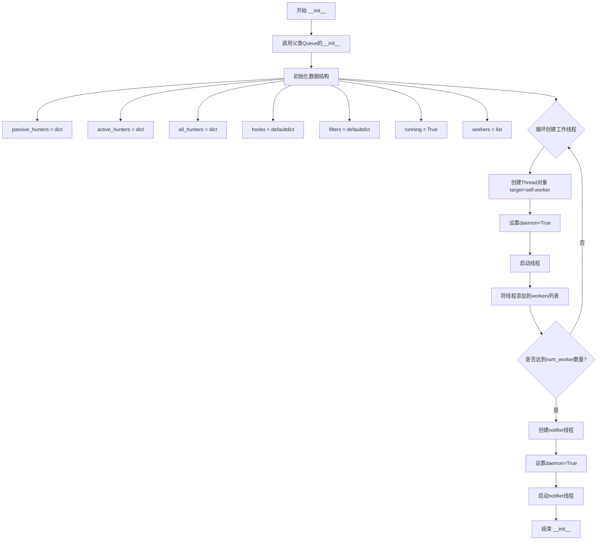

#### 带注释源码

```python
def __init__(self, num_worker=10):
    """
    初始化EventQueue实例
    
    参数:
        num_worker: 工作线程数量，默认为10
    """
    # 调用父类Queue的初始化方法
    super(EventQueue, self).__init__()
    
    # 存储被动型hunter的字典（键为hunter类，值为描述信息）
    self.passive_hunters = dict()
    
    # 存储主动型hunter的字典
    self.active_hunters = dict()
    
    # 存储所有hunter的字典
    self.all_hunters = dict()

    # 事件钩子映射：事件类型 -> [(hook, predicate), ...]
    self.hooks = defaultdict(list)
    
    # 事件过滤器映射：事件类型 -> [(filter_hook, predicate), ...]
    self.filters = defaultdict(list)
    
    # 标记队列是否运行中
    self.running = True
    
    # 存储所有工作线程的列表
    self.workers = list()

    # 创建指定数量的工作线程
    for _ in range(num_worker):
        # 创建守护线程，target为worker方法
        t = Thread(target=self.worker)
        
        # 设置为守护线程，主程序退出时自动终止
        t.daemon = True
        
        # 启动线程
        t.start()
        
        # 将线程添加到workers列表
        self.workers.append(t)

    # 创建通知者线程，用于监控任务完成情况
    t = Thread(target=self.notifier)
    t.daemon = True
    t.start()
```


### EventQueue.subscribe

这是一个装饰器方法，用于简化事件订阅流程。它接收事件类型、处理程序和可选的断言函数作为参数，返回一个包装函数，当被装饰的函数注册时会自动调用subscribe_event方法将处理程序订阅到指定事件。

参数：

- `event`：`type`，事件类型，指定要订阅的事件类
- `hook`：`Callable[[], None]`，可选的处理程序函数，当事件发布时执行的回调
- `predicate`：`Callable[[Any], bool]`，可选的断言函数，用于过滤事件，只有满足条件的事件才会触发hook

返回值：`Callable[[Callable], Callable]`，返回装饰器包装函数，用于装饰目标函数并将其注册为事件处理程序

#### 流程图

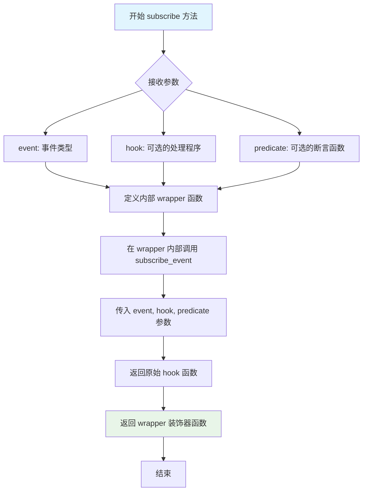

#### 带注释源码

```python
# 装饰器包装方法，用于简化事件订阅流程
# 该方法返回一个装饰器函数，方便用户以装饰器形式订阅事件
def subscribe(self, event, hook=None, predicate=None):
    """
    装饰器包装方法，用于简化事件订阅流程
    
    参数:
        event: 事件类型，指定要订阅的事件类
        hook: 可选的处理程序函数，当事件发布时执行的回调
        predicate: 可选的断言函数，用于过滤事件，只有满足条件的事件才会触发hook
    
    返回:
        返回一个装饰器包装函数wrapper
    """
    def wrapper(hook):
        """
        内部装饰器函数，负责实际的事件订阅操作
        
        参数:
            hook: 被装饰的处理程序函数
        
        返回:
            返回原始的hook函数，保留其原有功能
        """
        # 调用内部方法完成事件订阅
        self.subscribe_event(event, hook=hook, predicate=predicate)
        # 返回原始hook，保持函数完整性
        return hook

    # 返回装饰器，供用户装饰目标函数使用
    return wrapper
```


### `EventQueue.subscribe_once`

该方法是一个装饰器工厂，用于实现"一次性订阅"机制。当使用该装饰器订阅事件时，订阅的钩子（Hunter）在被实例化后会自动从事件订阅列表中移除，确保该钩子仅执行一次。

参数：

-  `event`：事件类，要订阅的事件类型
-  `hook`：可选项，回调函数或 Hunter 类
-  `predicate`：可选项，用于过滤事件的谓词函数

返回值：`function`，返回一个装饰器包装函数（wrapper）

#### 流程图

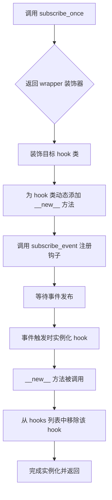

#### 带注释源码

```python
# wrapper takes care of the subscribe once mechanism
def subscribe_once(self, event, hook=None, predicate=None):
    """
    装饰器工厂，实现一次性订阅机制
    
    参数:
        event: 要订阅的事件类型
        hook: 可选的回调函数或类
        predicate: 可选的谓词函数用于过滤
    
    返回:
        返回一个装饰器 wrapper 函数
    """
    def wrapper(hook):
        """
        实际的装饰器函数，当被装饰的类被实例化时执行
        
        参数:
            hook: 被装饰的 Hunter 类
        
        返回:
            原始的 hook 类（已修改）
        """
        # installing a __new__ magic method on the hunter
        # which will remove the hunter from the list upon creation
        def __new__unsubscribe_self(self, cls):
            """
            动态添加的 __new__ 方法，在类实例化时自动取消订阅
            
            参数:
                self: 类的实例
                cls: 类的类型
            
            返回:
                新的实例对象
            """
            # 从事件的钩子列表中移除该 hook 和 predicate 组合
            # 实现"执行一次后自动取消订阅"的逻辑
            handler.hooks[event].remove((hook, predicate))
            # 使用 object.__new__ 创建实例
            return object.__new__(self)

        # 将自定义的 __new__ 方法绑定到 hook 类
        # 这样在类实例化时会自动触发取消订阅逻辑
        hook.__new__ = __new__unsubscribe_self

        # 调用核心订阅方法完成注册
        self.subscribe_event(event, hook=hook, predicate=predicate)
        return hook

    return wrapper
```


### `EventQueue.subscribe_event`

该方法负责将事件订阅者（hook）注册到事件队列中，根据 hook 的类型（ActiveHunter、HunterBase 或 EventFilterBase）分别维护不同的注册表（active_hunters、passive_hunters、all_hunters、filters、hooks），并支持可选的谓词（predicate）用于事件过滤。

参数：

- `self`：`EventQueue`，事件队列实例本身
- `event`：`type`，要订阅的事件类，标识需要监听的事件类型
- `hook`：`type`，订阅者钩子类，需要实例化以处理事件的类，必须是 ActiveHunter、HunterBase 或 EventFilterBase 的子类
- `predicate`：`callable`，可选的谓词函数，用于在事件发布时判断是否需要执行该 hook，默认为 None

返回值：`None`，该方法无返回值，仅执行注册逻辑

#### 流程图

```mermaid
flowchart TD
    A[开始 subscribe_event] --> B{hook 是 ActiveHunter?}
    B -->|是| C{config.active 为真?}
    C -->|否| D[直接返回，不注册]
    C -->|是| E[注册到 active_hunters 字典]
    B -->|否| F{hook 是 HunterBase?}
    F -->|是| G[注册到 passive_hunters 字典]
    F -->|否| H{hook 是 HunterBase?}
    H -->|是| I[注册到 all_hunters 字典]
    H -->|否| J[跳过hunter注册]
    E --> K{hook 是 EventFilterBase?}
    G --> K
    I --> K
    J --> K
    K -->|是| L{hook 已在 filters[event]?}
    K -->|否| M{hook 已在 hooks[event]?}
    L -->|否| N[添加 hook 到 filters[event]]
    L -->|是| O[跳过]
    M -->|否| P[添加 hook 到 hooks[event]]
    M -->|是| Q[跳过]
    N --> R[结束]
    O --> R
    P --> R
    Q --> R
```

#### 带注释源码

```python
# 获取未实例化的事件对象
def subscribe_event(self, event, hook=None, predicate=None):
    """
    将事件订阅者注册到事件队列中
    
    参数:
        event: 要订阅的事件类
        hook: 订阅者钩子类（处理事件的类）
        predicate: 可选的谓词函数，用于过滤事件
    """
    
    # 检查 hook 是否为 ActiveHunter 类型（主动扫描器）
    if ActiveHunter in hook.__mro__:
        # 如果配置中未启用主动扫描模式，则直接返回不注册
        if not config.active:
            return
        # 将主动扫描器注册到 active_hunters 字典，键为 hook 类，值为其文档字符串
        self.active_hunters[hook] = hook.__doc__
    
    # 检查 hook 是否为 HunterBase 类型（被动扫描器）
    elif HunterBase in hook.__mro__:
        # 将被动扫描器注册到 passive_hunters 字典
        self.passive_hunters[hook] = hook.__doc__

    # 无论主动还是被动，只要继承自 HunterBase 都注册到 all_hunters
    if HunterBase in hook.__mro__:
        self.all_hunters[hook] = hook.__doc__

    # 注册过滤器 - 检查 hook 是否为 EventFilterBase 类型
    if EventFilterBase in hook.__mro__:
        # 避免重复注册同一过滤器
        if hook not in self.filters[event]:
            # 将过滤器和谓词添加到对应事件的过滤器列表中
            self.filters[event].append((hook, predicate))
            logger.debug(f"{hook} filter subscribed to {event}")

    # 注册猎人/处理器 - 如果不是过滤器，则注册为普通的 hook 处理器
    elif hook not in self.hooks[event]:
        # 将处理者和谓词添加到对应事件的钩子列表中
        self.hooks[event].append((hook, predicate))
        logger.debug(f"{hook} subscribed to {event}")
```


### `EventQueue.apply_filters(event)`

该方法负责对传入的事件对象执行已订阅的过滤器链。它遍历所有已注册的过滤器，检查每个过滤器订阅的事件类型是否与当前事件的类有继承关系，然后根据谓词条件决定是否执行过滤器。如果过滤器返回 None（表示该事件被过滤掉），则立即返回 None；否则返回经过所有过滤器处理后的事件对象。

参数：

- `event`：任意类型（事件对象），需要应用过滤器的事件

返回值：`任意类型`，如果事件被过滤掉返回 None，否则返回过滤处理后的事件对象

#### 流程图

```mermaid
flowchart TD
    A([开始 apply_filters]) --> B[遍历 self.filters 中的所有 hooked_event]
    B --> C{hooked_event 在 event.__class__.__mro__ 中?}
    C -->|否| H{还有更多过滤器事件类型?}
    C -->|是| D[获取该事件类型的所有过滤器列表]
    D --> E{过滤器列表中还有更多 filter_hook?}
    E -->|否| H
    E -->|是| F{当前 filter_hook 有 predicate?}
    F -->|是| G{predicate(event) 返回 True?}
    F -->|否| I
    G -->|否| E
    G -->|是| I
    I[执行 filter_hook(event).execute()]
    I --> J{返回的 event 为 None?}
    J -->|是| K[返回 None]
    J -->|否| E
    H --> L([返回 event])
    K --> L
```

#### 带注释源码

```python
def apply_filters(self, event):
    # 遍历所有已订阅的过滤器事件类型
    for hooked_event in self.filters.keys():
        # 检查当前事件的类是否在过滤器订阅的事件类型的MRO（方法解析顺序）中
        # 即判断事件是否是过滤器所关注类型的子类或相同类型
        if hooked_event in event.__class__.__mro__:
            # 获取该事件类型对应的所有过滤器（filter_hook, predicate）元组列表
            for filter_hook, predicate in self.filters[hooked_event]:
                # 如果存在谓词函数，先检查谓词是否满足条件
                # 谓词可以用于条件性地过滤事件
                if predicate and not predicate(event):
                    # 谓词返回False，跳过此过滤器，继续下一个
                    continue

                # 记录调试日志，说明哪个过滤器正在处理事件
                logger.debug(f"Event {event.__class__} filtered with {filter_hook}")
                
                # 实例化过滤器并执行其execute方法处理事件
                event = filter_hook(event).execute()
                
                # 如果过滤器决定移除事件（返回None），则立即返回None
                # 表示该事件被过滤掉，不会继续传播
                if not event:
                    return None
    
    # 所有过滤器处理完成后，返回处理后的事件（可能未被修改）
    return event
```


### EventQueue.publish_event

该方法用于将事件发布到事件队列系统中，在发布前会先应用已注册的过滤器，如果事件未被过滤则分发给所有订阅的钩子函数执行。

参数：

- `event`：任意类型，要发布的事件对象，该对象会被传递给所有订阅的钩子
- `caller`：可选参数，Hunter 类型实例，发布事件的调用者，用于设置事件的 `previous`（前一个事件）和 `hunter`（猎人类）属性

返回值：`None`，无返回值

#### 流程图

```mermaid
flowchart TD
    A[开始 publish_event] --> B{caller 是否存在?}
    B -->|是| C[设置 event.previous = caller.event]
    C --> D[设置 event.hunter = caller.__class__]
    B -->|否| E[不设置]
    D --> F[调用 apply_filters 过滤事件]
    E --> F
    F --> G{event 是否为 None?}
    G -->|是| H[返回, 不发布]
    G -->|否| I{再次检查 caller?}
    I -->|是| J[重新设置 event.previous 和 event.hunter]
    I -->|否| K[跳过]
    J --> L[遍历 self.hooks 中的所有钩子事件]
    K --> L
    L --> M{hooked_event 在 event.__class__.__mro__ 中?}
    M -->|是| N[遍历该事件的所有钩子]
    M -->|否| O[检查下一个 hooked_event]
    N --> P{谓词 predicate 满足?}
    P -->|否| Q[跳过当前钩子]
    P -->|是| R{config.statistics 且 caller 且 event 是 Vulnerability?}
    R -->|是| S[publishedVulnerabilities += 1]
    R -->|否| T[不增加计数]
    S --> U[记录日志]
    T --> U
    U --> V[将 hook(event) 放入队列]
    V --> O
    O --> W{还有更多 hooked_event?}
    W -->|是| L
    W -->|否| X[结束]
    H --> X
```

#### 带注释源码

```python
def publish_event(self, event, caller=None):
    # 设置事件链，如果存在调用者，则将当前事件与前一个事件关联
    # caller 通常是 Hunter 实例，用于追踪事件来源
    if caller:
        # 将前一个事件链接到当前事件，形成事件链
        event.previous = caller.event
        # 记录当前事件的处理者（猎人类）
        event.hunter = caller.__class__

    # 在发布事件之前，先应用过滤器
    # 过滤器可以修改事件或决定是否继续发布
    # 如果过滤器返回 None，表示事件被过滤掉，不再向下执行
    event = self.apply_filters(event)
    if event:
        # 如果事件被过滤器重写（修改），确保重新设置父事件链接
        # 这样可以保持事件链的完整性
        if caller:
            event.previous = caller.event
            event.hunter = caller.__class__

        # 遍历所有已注册的事件钩子
        for hooked_event in self.hooks.keys():
            # 检查当前事件是否是钩子所关注的事件类型
            # 使用 MRO（方法解析顺序）进行类型检查，支持继承关系
            if hooked_event in event.__class__.__mro__:
                # 遍历该事件类型对应的所有钩子
                for hook, predicate in self.hooks[hooked_event]:
                    # 如果存在谓词函数，检查是否满足条件
                    # 谓词可以用于条件性地触发钩子
                    if predicate and not predicate(event):
                        continue

                    # 如果启用了统计功能且存在调用者，且事件是漏洞类型
                    # 则统计已发布的漏洞数量
                    if config.statistics and caller:
                        if Vulnerability in event.__class__.__mro__:
                            # 增加该猎人的已发布漏洞计数
                            caller.__class__.publishedVulnerabilities += 1

                    # 记录调试日志
                    logger.debug(f"Event {event.__class__} got published with {event}")
                    # 将钩子（已包装的事件处理器）放入队列
                    # 由工作线程异步执行
                    self.put(hook(event))
```


### `EventQueue.worker`

该方法是事件队列的工作线程核心实现，以守护线程方式运行，持续从队列中获取事件钩子（hook）并执行，实现异步事件处理机制。

参数：

- 无显式参数（`self` 为隐式参数，表示 EventQueue 实例本身）

返回值：`None`，无返回值

#### 流程图

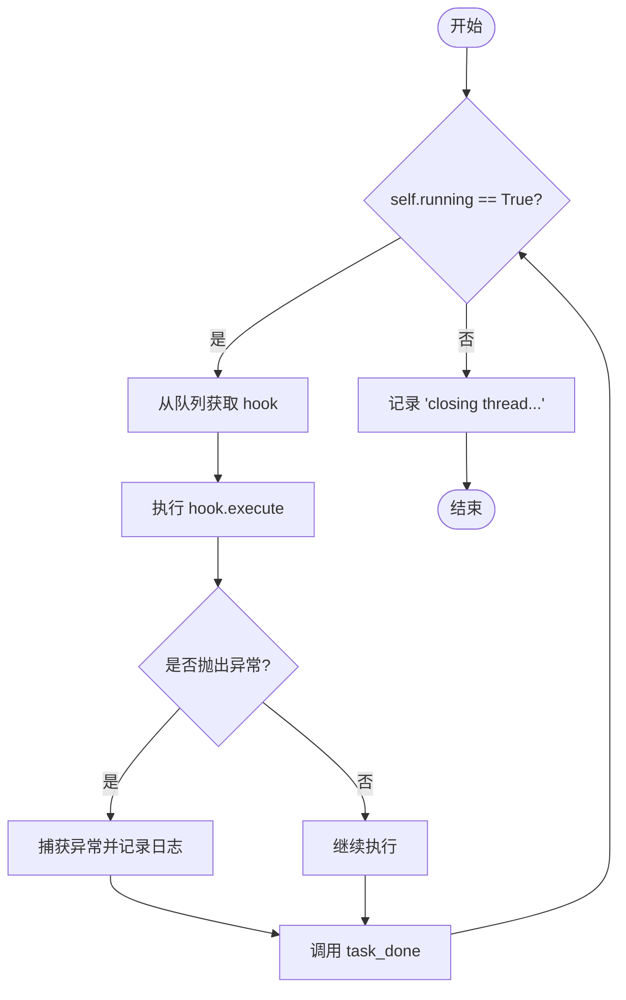

#### 带注释源码

```python
# executes callbacks on dedicated thread as a daemon
def worker(self):
    # 主循环：持续运行直到 self.running 被设置为 False
    while self.running:
        try:
            # 从队列中获取一个 hook 对象（阻塞操作）
            # Queue.get() 会阻塞直到有元素可用
            hook = self.get()
            
            # 记录调试日志：显示正在执行的 hook 类及其事件字典
            logger.debug(f"Executing {hook.__class__} with {hook.event.__dict__}")
            
            # 执行 hook 的实际业务逻辑
            hook.execute()
        except Exception as ex:
            # 捕获所有异常并记录日志
            # exc_info=True 会包含完整的堆栈跟踪信息
            logger.debug(ex, exc_info=True)
        finally:
            # 无论执行成功还是异常，都标记任务完成
            # 这对于 Queue.join() 的阻塞机制至关重要
            self.task_done()
    
    # 当 running 变为 False 时，记录线程关闭信息
    logger.debug("closing thread...")
```


### `EventQueue.notifier`

该方法是一个后台守护线程，用于监控事件队列中的未完成任务数量，并在任务即将完成时记录警告信息。

参数：
- `self`：`EventQueue`，表示 EventQueue 类的实例本身

返回值：`None`，无返回值

#### 流程图

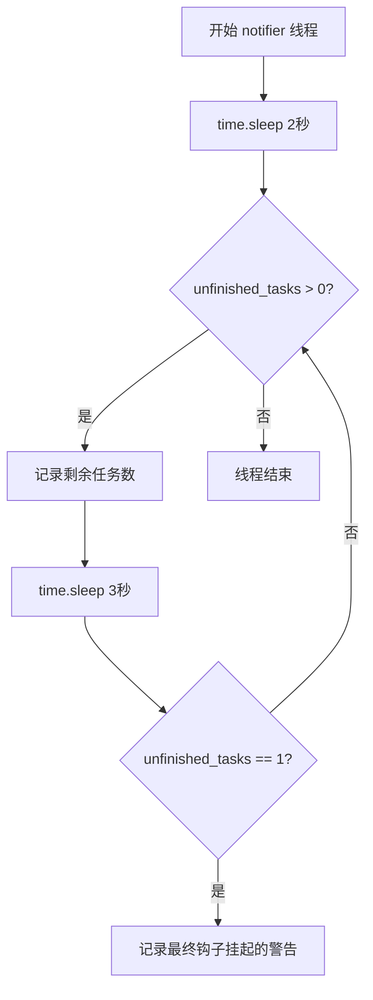

#### 带注释源码

```python
def notifier(self):
    """
    监控未完成任务的后台线程。
    作为守护线程运行，定期检查队列中剩余的未完成任务数量，
    并在任务接近完成时提供诊断信息。
    """
    # 初始化等待时间，让worker线程有时间启动并开始处理任务
    time.sleep(2)
    
    # should consider locking on unfinished_tasks
    # 注意：访问unfinished_tasks时应该考虑加锁，因为它是Queue的内部属性
    while self.unfinished_tasks > 0:
        # 记录当前剩余的未完成任务数量，用于监控队列处理进度
        logger.debug(f"{self.unfinished_tasks} tasks left")
        
        # 每3秒检查一次任务完成状态
        time.sleep(3)
        
        # 当只剩一个任务时，可能是某个hook被阻塞或执行时间过长
        if self.unfinished_tasks == 1:
            # 记录警告信息，提示最后一个钩子可能挂起
            logger.debug("final hook is hanging")
```


### `EventQueue.free`

该方法用于停止所有守护线程的执行，并通过清空队列来释放资源，确保EventQueue能够安全地关闭。

参数： 无（仅包含隐式参数`self`）

返回值：`None`，无返回值

#### 流程图

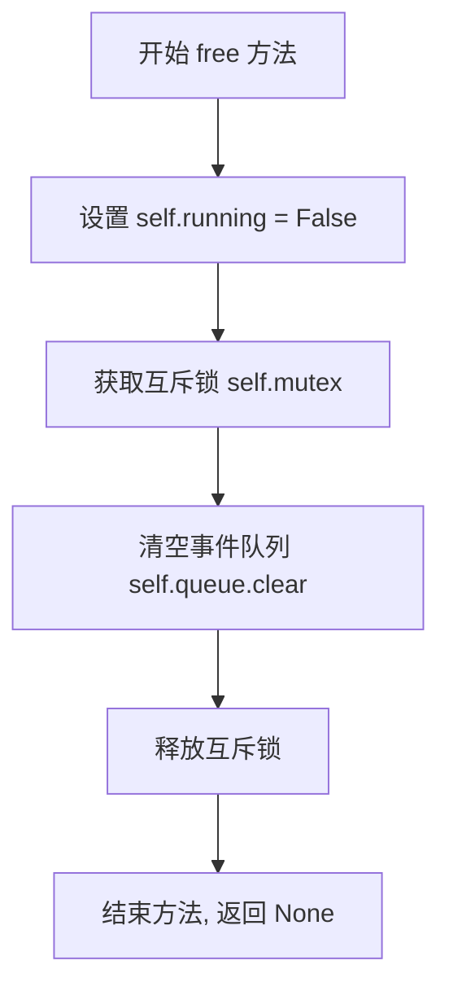

#### 带注释源码

```python
def free(self):
    # 停止执行标志，通知所有 worker 线程退出循环
    self.running = False
    
    # 使用互斥锁确保清空队列操作的线程安全性
    with self.mutex:
        # 清空队列中的所有待处理事件，防止资源泄漏
        self.queue.clear()
```


## 关键组件


### EventQueue

事件队列管理器，继承自Queue类，异步处理kube-hunter中的事件订阅、过滤、发布与执行，采用生产者-消费者模式。

### subscribe 装饰器

事件订阅装饰器，提供便捷的方式将钩子函数注册到特定事件，支持predicate过滤条件。

### subscribe_once 装饰器

单次事件订阅装饰器，事件处理后自动取消订阅，用于一次性执行的钩子。

### subscribe_event 方法

事件注册核心方法，根据钩子类型（ActiveHunter/HunterBase/EventFilterBase）分别注册到active_hunters、passive_hunters或filters字典。

### apply_filters 方法

过滤器应用方法，遍历已注册的过滤器链，对事件进行转换或过滤，返回处理后的事件或None。

### publish_event 方法

事件发布核心方法，设置事件链关系（previous/hunter），应用过滤器后，将事件分发给所有订阅的钩子到队列。

### worker 方法

后台工作线程方法，从队列获取钩子并执行，捕获异常保证线程持续运行，以守护线程方式运行。

### notifier 线程

任务监控线程，定期检查未完成任务数量，记录挂起的最后一个钩子，用于调试目的。

### free 方法

资源释放方法，停止所有工作线程并清空队列，确保程序正常退出。

### handler 全局变量

全局事件处理器单例，默认配置800个工作线程，处理整个kube-hunter系统的事件流。


## 问题及建议


### 已知问题

-   **并发安全问题**：多个方法（`subscribe_event`、`apply_filters`、`publish_event`）对共享数据结构（`self.hooks`、`self.filters`、`self.active_hunters`、`self.passive_hunters`、`self.all_hunters`）进行读写操作，但没有任何线程锁保护，可能导致竞态条件和数据不一致。
-   **notifier 线程不安全**：`notifier` 方法中访问 `self.unfinished_tasks` 时没有加锁保护，注释明确提到 "should consider locking on unfinished_tasks"，这在高并发场景下可能导致计数不准确或无限等待。
-   **worker 线程退出逻辑缺陷**：在 `worker` 方法中，`self.get()` 是阻塞调用，当 `self.running = False` 时，worker 线程可能卡在 `get()` 调用上无法立即退出，需要依赖 Queue 的超时机制或外部强制终止。
-   **异常吞没风险**：`worker` 方法中的异常处理仅记录 debug 级别日志后继续执行，严重的错误可能被忽视，导致任务静默失败。
-   **资源过度配置**：全局单例 `handler = EventQueue(800)` 创建 800 个工作线程，对于大多数场景来说过高，会造成严重的资源浪费和上下文切换开销。
-   **硬编码时间值**：`notifier` 方法中的 `time.sleep(2)` 和 `time.sleep(3)` 是硬编码值，缺乏可配置性，且 2 秒的初始等待可能导致启动延迟。
-   **内存泄漏风险**：`self.hooks` 和 `self.filters` 字典只增不减，没有清理机制，随着程序运行可能积累大量无用的事件订阅记录。
-   **subscribe_once 使用 hack 方式**：通过修改 `__new__` 方法来实现一次性订阅，这种方式不够直观且可能与某些类定义产生意外交互。
-   **apply_filters 修改 event 引用**：方法中 `event = filter_hook(event).execute()` 直接修改 event 变量引用，可能导致调用方的 event 引用指向错误对象。
-   **类型注解完全缺失**：整个代码库没有任何类型注解，降低了代码的可维护性和 IDE 支持。

### 优化建议

-   **添加线程锁**：在 `subscribe_event`、`apply_filters`、`publish_event` 等方法中使用 `threading.Lock` 或 `RLock` 保护共享数据结构的并发访问。
-   **修复 notifier 线程安全**：在访问 `self.unfinished_tasks` 时使用锁保护，或使用 Queue 的 `join()` 方法替代自定义等待逻辑。
-   **优化 worker 退出机制**：使用 `self.get(timeout=1)` 替代阻塞的 `self.get()`，并在检查 `self.running` 后再处理任务，确保线程能响应关闭信号。
-   **降低默认线程数**：将默认 worker 数量改为可配置参数，并设置合理的默认值（如 CPU 核心数或 10-20）。
-   **实现清理机制**：添加 `unsubscribe` 方法或在事件订阅时提供生命周期管理，定期清理不再需要的事件钩子。
-   **统一异常处理策略**：对于关键异常应记录 warning 或 error 级别日志，必要时重新抛出或触发告警机制。
-   **提取硬编码值**：将超时、睡眠时间等硬编码值提取为配置参数，提高系统灵活性。
-   **使用更清晰的一次性订阅实现**：可以考虑使用装饰器或上下文管理器实现 `subscribe_once`，而非修改 `__new__` 方法。
-   **添加类型注解**：为所有方法参数、返回值和类字段添加类型注解，提高代码可读性和可维护性。
-   **考虑使用 asyncio 替代**：在现代 Python 项目中，可考虑使用 `asyncio` 替代 threading 以获得更好的并发性能和资源利用率。


## 其它


### 设计目标与约束

**设计目标**：
- 实现异步事件驱动架构，支持事件的发布-订阅模式
- 通过多线程worker实现事件的并行处理，提高扫描效率
- 支持事件的过滤机制，允许在事件传播过程中修改或终止事件
- 支持主动扫描（ActiveHunter）和被动扫描（HunterBase）两种模式

**约束条件**：
- 被动hunters必须在主动扫描之前完成注册
- 事件过滤器仅能修改事件内容，无法完全阻止事件传播（除非返回None）
- 线程数量默认为800个worker线程（通过handler = EventQueue(800)）
- 所有hooks和filters必须在事件发布前完成订阅

### 错误处理与异常设计

**异常处理机制**：
- worker线程中使用try-except捕获所有异常，确保单个任务的异常不影响其他任务执行
- 异常信息通过logger.debug输出，包含完整的堆栈信息（exc_info=True）
- 事件处理中的异常不会中断事件队列的运行

**边界情况处理**：
- 当filter返回None时，事件被丢弃，不会发布给订阅者
- predicate函数用于条件判断，如果predicate返回False，则跳过该hook/filter
- notifier线程等待所有任务完成后退出

### 数据流与状态机

**事件流转过程**：
1. 事件发布者调用publish_event发布事件
2. 首先应用过滤器（apply_filters），过滤后的事件继续传播
3. 事件进入Queue队列
4. worker线程从队列取出事件并执行（execute方法）
5. hunter执行过程中可能产生新事件，递归触发上述流程

**状态转换**：
- EventQueue初始化：创建worker线程和notifier线程
- 订阅阶段：注册hooks和filters
- 运行阶段：事件循环处理
- 终止阶段：调用free()方法停止所有线程

### 外部依赖与接口契约

**外部依赖**：
- `logging`：用于日志记录
- `time`：用于notifier线程的延时
- `collections.defaultdict`：存储hooks和filters
- `queue.Queue`：事件队列基类
- `threading.Thread`：多线程支持
- `kube_hunter.conf.config`：配置对象（包含active和statistics标志）
- `kube_hunter.core.types`：HunterBase、ActiveHunter类型定义
- `kube_hunter.core.events.types`：Vulnerability、EventFilterBase类型定义

**接口契约**：
- subscribe(event, hook, predicate)：订阅事件，返回装饰器
- subscribe_once(event, hook, predicate)：一次性订阅，hook执行后自动取消订阅
- subscribe_event(event, hook, predicate)：内部方法，处理hunter和filter的注册
- apply_filters(event)：应用过滤器链，返回处理后的事件或None
- publish_event(event, caller)：发布事件到队列
- worker()：worker线程主函数，从队列消费事件
- notifier()：通知线程，监控任务完成情况
- free()：停止队列，清理资源

### 性能考虑

**并发模型**：
- 使用生产-消费者模式，publish_event为生产者，worker线程为消费者
- 默认800个worker线程，适合高并发场景
- Queue本身是线程安全的，无需额外加锁

**潜在性能问题**：
- 800个线程可能导致较高的上下文切换开销
- notifier线程使用轮询方式检查unfinished_tasks，可考虑使用条件变量优化
- 未限制队列最大长度，可能导致内存溢出

### 线程安全分析

**线程安全保证**：
- Queue继承自queue.Queue，已提供线程安全的put/get操作
- 使用mutex保护queue.clear()操作（free方法中）

**需关注的线程安全问题**：
- self.running标志的读写未加锁，可能存在竞态条件
- self.passive_hunters、self.active_hunters、self.all_hunters字典的并发修改
- self.hooks和self.filters字典在订阅和执行时的并发访问

### 生命周期管理

**启动流程**：
1. 创建EventQueue实例，初始化各种数据结构
2. 启动指定数量的worker线程
3. 启动notifier线程

**运行流程**：
1. 外部模块调用subscribe/subscribe_once注册hunters和filters
2. 外部模块调用publish_event发布事件
3. worker线程异步执行事件处理逻辑

**终止流程**：
1. 调用free()方法设置running=False
2. 清空队列中的待处理任务
3. worker线程退出循环并记录日志
4. notifier线程检测到unfinished_tasks=0后退出

### 配置管理

**配置项（来自config对象）**：
- `config.active`：布尔值，控制是否注册ActiveHunter类型的hunters
- `config.statistics`：布尔值，控制是否统计已发布的漏洞数量

### 可扩展性设计

**扩展点**：
- 可通过继承HunterBase或ActiveHunter添加新的hunters
- 可通过继承EventFilterBase添加新的过滤器
- 事件类型系统支持事件类继承链匹配

**订阅机制灵活性**：
- 支持带条件的订阅（predicate参数）
- 支持一次性订阅（自动取消）
- 支持装饰器模式的便捷订阅

### 监控与日志

**日志记录点**：
- 订阅/取消订阅操作
- 过滤器应用和事件过滤
- 事件发布
- worker执行hook
- 异常捕获
- 任务完成情况

**调试信息**：
- hook执行时记录完整的event.__dict__
- notifier定期输出剩余任务数量


    