# `kubehunter\kube_hunter\core\events\types.py` 详细设计文档

该文件定义了kube-hunter框架的事件系统，包括事件基类Event、服务类Service、漏洞类Vulnerability以及各种具体事件类型，用于实现安全扫描过程中的事件传递、状态追踪和漏洞报告功能。

## 整体流程

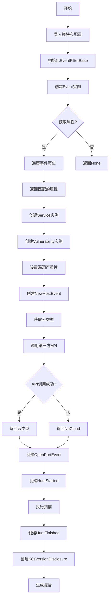

## 类结构

```
Event (事件基类)
├── NewHostEvent (新主机事件)
├── OpenPortEvent (开放端口事件)
├── HuntFinished (扫描完成事件)
├── HuntStarted (扫描开始事件)
├── ReportDispatched (报告分发事件)
└── K8sVersionDisclosure (K8s版本泄露漏洞)
EventFilterBase (事件过滤器基类)
Service (服务类)
Vulnerability (漏洞基类)
```

## 全局变量及字段


### `event_id_count_lock`
    
事件ID计数线程锁，用于保护event_id_count的并发访问

类型：`threading.Lock`
    


### `event_id_count`
    
事件ID计数器，记录已创建的事件总数

类型：`int`
    


### `logger`
    
模块级日志器，用于记录kube-hunter的运行日志

类型：`logging.Logger`
    


### `config`
    
kube-hunter配置对象，从kube_hunter.conf模块导入

类型：`Configuration`
    


### `EventFilterBase.event`
    
事件对象

类型：`Event`
    


### `Event.previous`
    
前一个事件，组成事件链表

类型：`Event`
    


### `Event.hunter`
    
扫描器实例

类型：`Hunter`
    


### `Service.name`
    
服务名称

类型：`str`
    


### `Service.secure`
    
是否安全标记

类型：`bool`
    


### `Service.path`
    
访问路径

类型：`str`
    


### `Service.role`
    
角色标识

类型：`str`
    


### `Vulnerability.vid`
    
漏洞ID

类型：`str`
    


### `Vulnerability.component`
    
所属组件

类型：`KubernetesCluster`
    


### `Vulnerability.category`
    
漏洞类别

类型：`VulnerabilityCategory`
    


### `Vulnerability.name`
    
漏洞名称

类型：`str`
    


### `Vulnerability.evidence`
    
漏洞证据

类型：`str`
    


### `Vulnerability.role`
    
角色标识

类型：`str`
    


### `NewHostEvent.host`
    
主机地址

类型：`str`
    


### `NewHostEvent.cloud_type`
    
云类型

类型：`str`
    


### `NewHostEvent.event_id`
    
事件唯一ID

类型：`int`
    


### `OpenPortEvent.port`
    
端口号

类型：`int`
    


### `K8sVersionDisclosure.version`
    
Kubernetes版本号

类型：`str`
    


### `K8sVersionDisclosure.from_endpoint`
    
获取版本的端点

类型：`str`
    


### `K8sVersionDisclosure.extra_info`
    
额外信息

类型：`str`
    
    

## 全局函数及方法


### `EventFilterBase.execute`

执行过滤器逻辑，默认实现返回原始事件对象，允许子类重写以实现自定义的事件过滤逻辑。如果返回None则表示该事件应被丢弃。

参数：
- （无额外参数，只包含隐式的`self`参数）

返回值：`Event`，返回处理后的事件对象。如果未做任何修改，默认返回原始的`self.event`；如果返回`None`则表示该事件应被丢弃。

#### 流程图

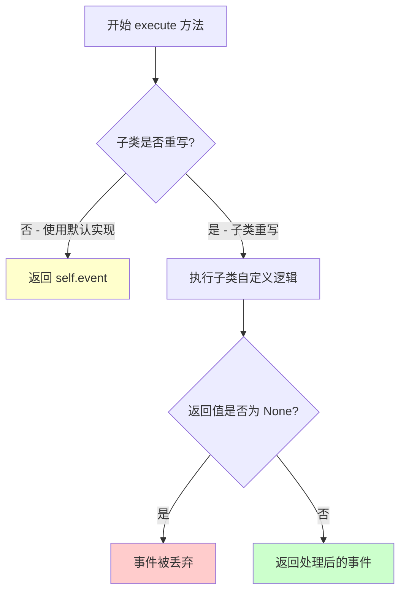

#### 带注释源码

```python
class EventFilterBase(object):
    def __init__(self, event):
        """
        初始化事件过滤器基类
        :param event: 需要过滤的事件对象，类型为Event或其子类
        """
        self.event = event

    # Returns self.event as default.
    # If changes has been made, should return the new event that's been altered
    # Return None to indicate the event should be discarded
    def execute(self):
        """
        执行过滤器逻辑，默认实现原样返回事件对象
        
        默认行为：
        - 返回 self.event：表示事件通过过滤，保持不变
        - 返回 None：表示事件应被丢弃/过滤掉
        - 返回新的Event对象：表示事件已被修改处理
        
        子类应重写此方法以实现自定义过滤逻辑
        """
        return self.event
```


### `Event.__getattr__`

该方法是Python的属性访问魔术方法，用于实现Event对象的事件属性动态查找机制。当访问Event实例的属性时，如果该属性不存在于当前对象，会自动调用此方法；它首先检查是否为"previous"属性（返回None），然后遍历从最新到最旧的事件历史链，查找最早出现的同名属性并返回，从而实现事件属性的向上追溯和继承效果。

参数：

- `name`：`str`，表示要访问的属性名称

返回值：`Any`（任意类型），返回在事件历史中找到的属性值，如果未找到则返回None（Python自动返回）

#### 流程图

```mermaid
flowchart TD
    A[访问属性 name] --> B{name == 'previous'?}
    B -->|是| C[返回 None]
    B -->|否| D[遍历 self.history 事件历史]
    D --> E{在当前事件的 __dict__ 中找到 name?}
    E -->|是| F[返回 event.__dict__[name]]
    E -->|否| G[继续遍历下一个历史事件]
    G --> H{还有历史事件?}
    H -->|是| D
    H -->|否| I[返回 None]
    
    style F fill:#90EE90
    style I fill:#FFB6C1
```

#### 带注释源码

```python
# newest attribute gets selected first
def __getattr__(self, name):
    """
    动态属性访问魔术方法
    当访问的属性不存在时自动调用，实现事件属性的历史追溯
    
    参数:
        name: str - 要访问的属性名称
    
    返回:
        Any - 返回找到的属性值，未找到时返回None
    """
    # 特殊处理：如果访问的是 "previous" 属性，直接返回 None
    # 防止在属性查找过程中触发无限递归
    if name == "previous":
        return None
    
    # 遍历事件历史记录（从最新到最旧）
    # Event 类通过 linked list 方式存储历史：self.previous -> previous -> previous ...
    for event in self.history:
        # 检查属性是否存在于该历史事件的 __dict__ 中
        if name in event.__dict__:
            # 返回找到的第一个属性值（因为从最新开始遍历，所以是最新的）
            return event.__dict__[name]
    
    # 如果所有历史事件中都没有该属性，返回 None（Python 默认行为）
    # 这允许调用方使用 event.attribute 并检查是否为 None
```

#### 关键组件信息

- **`Event.history`**：属性，返回事件历史列表（从最新到最旧），用于支持属性追溯
- **`Event.previous`**：字段，指向上一事件的引用，构成事件链表的指针
- **`Event.location()`**：方法，获取事件的逻辑位置用于报告

#### 潜在的技术债务或优化空间

1. **隐式返回None**：方法未显式说明在属性未找到时返回None的语义，可能导致调用方难以区分"属性不存在"和"属性值本身为None"的情况
2. **性能考量**：每次属性访问都遍历完整的事件历史链，时间复杂度为O(n)，在事件链较长时可能有性能瓶颈
3. **缓存机制缺失**：可以考虑对已访问的属性结果进行缓存，避免重复遍历
4. **类型提示缺失**：方法签名缺少类型注解，影响代码可读性和IDE支持
5. **文档不完整**：缺少对属性查找优先级策略的完整说明

#### 其它项目

**设计目标与约束：**
- 实现事件属性的"继承"效果，新事件可以访问历史事件的属性
- 属性查找遵循"最新优先"原则，即如果多个历史事件有同名属性，返回最近添加的值

**错误处理与异常设计：**
- 本方法不抛出异常，未找到属性时返回Python标准的None
- 特殊处理"previous"属性以防止属性查找递归

**数据流与状态机：**
- Event对象构成链表结构：CurrentEvent -> previous -> previous -> ... -> OldestEvent
- 属性查找沿链表反向遍历，从最新事件向最旧事件搜索

**外部依赖与接口契约：**
- 依赖`Event.history`属性获取事件历史列表
- 依赖`Event.__dict__`访问实例属性字典
- 调用方应理解属性可能返回None（无论是未找到还是值本身为None）


### Event.location

获取事件的逻辑位置，主要用于报告。如果当前事件没有实现 location 方法，则递归检查前一个事件。这是因为事件是组合的（previous -> previous ...），而不是继承的。

参数：

- `self`：`Event`，隐式参数，表示当前事件对象

返回值：`Optional[str]`，返回事件的逻辑位置字符串，如果没有任何实现则返回 None

#### 流程图

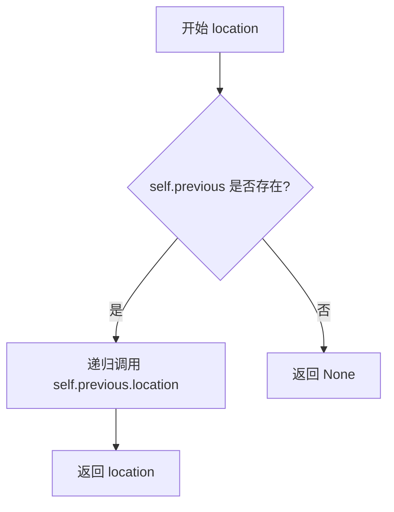

#### 带注释源码

```python
# Event's logical location to be used mainly for reports.
# If event don't implement it check previous event
# This is because events are composed (previous -> previous ...)
# and not inherited
def location(self):
    location = None
    if self.previous:
        # 如果存在前一个事件，递归调用前一个事件的 location 方法
        location = self.previous.location()

    return location
```


### `Event.history`

获取事件历史，按从最新到最旧的顺序返回。

参数：

- （无参数，作为属性访问）

返回值：`list`，返回事件历史列表（从最新到最旧）

#### 流程图

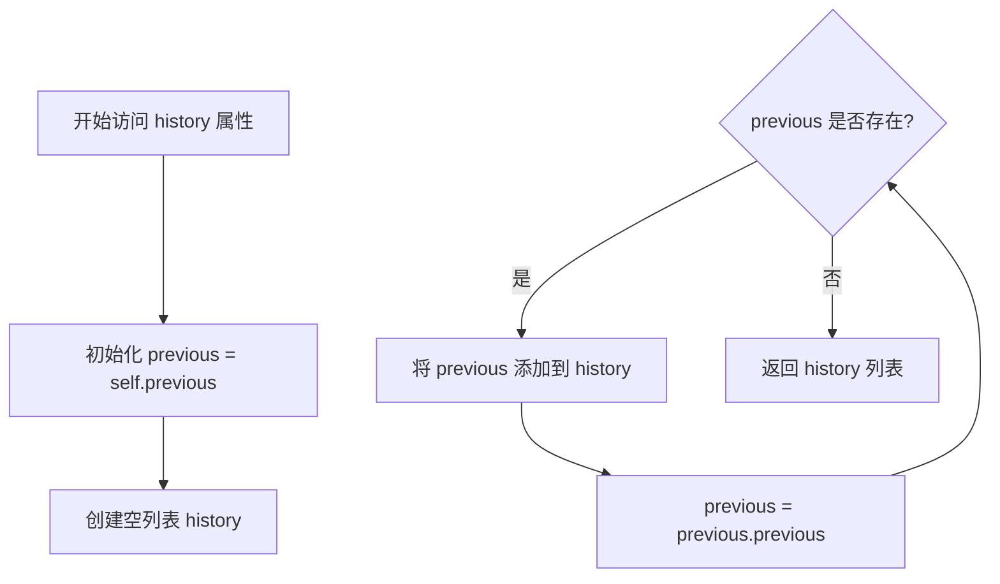

#### 带注释源码

```python
# returns the event history ordered from newest to oldest
@property
def history(self):
    # 从当前事件的 previous 开始（previous 指向更旧的事件）
    previous, history = self.previous, list()
    # 遍历链表，将每个历史事件添加到列表中
    while previous:
        history.append(previous)
        previous = previous.previous
    # 返回的事件顺序：最新 -> 最旧
    return history
```


### `Service.get_name`

获取服务的名称并返回。

参数：

- `self`：`Service` 类实例，隐式参数，表示当前服务对象

返回值：`str`，返回服务的名称

#### 流程图

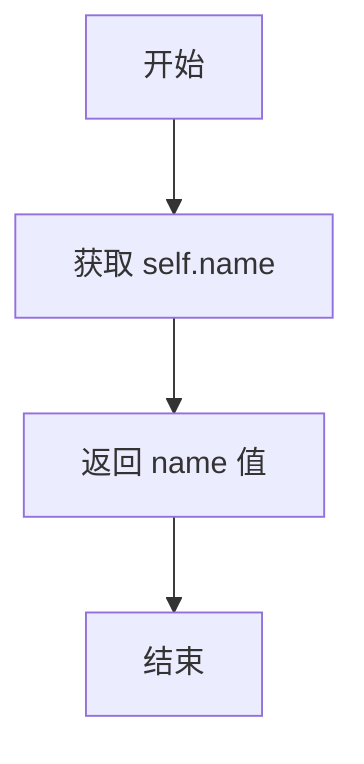

#### 带注释源码

```python
def get_name(self):
    """获取服务的名称
    
    Returns:
        str: 服务的名称字符串
    """
    return self.name
```


### Service.get_path

获取Service对象的路径信息，将内部存储的path属性格式化为标准的URL路径格式。如果path不为空，则返回以"/"开头的路径；否则返回空字符串。

参数：无（该方法不接受额外参数，self为隐式参数）

返回值：`str`，返回格式化后的路径字符串

#### 流程图

```mermaid
flowchart TD
    A[开始 get_path] --> B{self.path 是否为空}
    B -->|是| C[返回空字符串 ""]
    B -->|否| D[返回 "/" + self.path]
    C --> E[结束]
    D --> E
```

#### 带注释源码

```python
def get_path(self):
    """获取格式化后的路径字符串
    
    Returns:
        str: 如果path属性不为空，返回以'/'开头的路径；否则返回空字符串
    """
    # 如果self.path存在且不为空，则在前面加上"/"前缀
    # 否则返回空字符串
    return "/" + self.path if self.path else ""
```


### Service.explain

获取Service类的文档描述信息，用于返回该Service对象的说明文档。

参数：

- 无参数（除self外）

返回值：`str` 或 `None`，返回Service类的文档字符串（__doc__属性），如果类未定义文档字符串则返回None。

#### 流程图

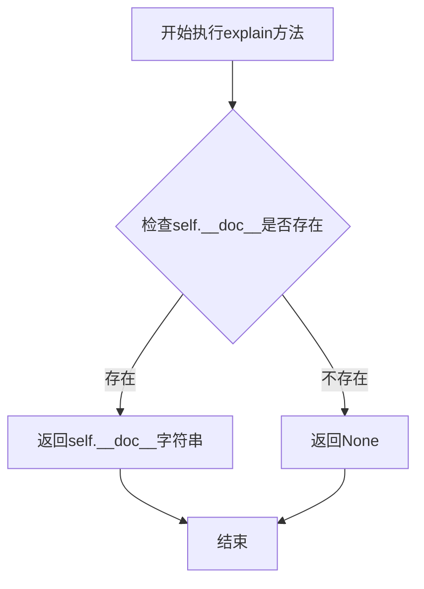

#### 带注释源码

```python
def explain(self):
    """
    获取Service类的文档描述
    
    该方法返回Service类或子类的__doc__属性，即类的文档字符串。
    如果类没有定义文档字符串，则返回None。
    
    通常用于获取漏洞或服务的描述信息，帮助生成报告或日志输出。
    
    Returns:
        str or None: 类的文档字符串，如果未定义则返回None
    """
    return self.__doc__
```


### `Vulnerability.get_vid`

获取漏洞ID（VID）的简单getter方法，用于返回存储在 Vulnerability 实例中的漏洞标识符。

参数：

- `self`：`Vulnerability` 类实例，表示当前的漏洞对象（隐式参数，无需显式传递）

返回值：`str`，返回存储的漏洞ID字符串，如果没有设置则返回默认字符串 "None"

#### 流程图

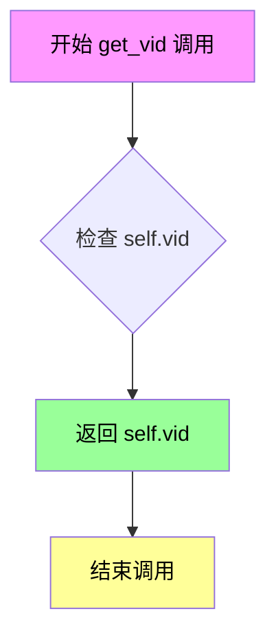

#### 带注释源码

```python
def get_vid(self):
    """
    获取漏洞的VID（漏洞标识符）
    
    Returns:
        str: 存储在self.vid中的漏洞标识符字符串
              默认为"None"（字符串类型），由__init__方法设置
    """
    return self.vid
```


### `Vulnerability.get_category`

获取漏洞的类别名称。如果漏洞对象存在 category 属性，则返回类别的名称；否则返回 None。

参数：

- 此方法无显式参数（仅包含隐式 `self` 参数）

返回值：`str`，返回漏洞的类别名称。如果 `category` 属性存在，则返回 `category.name`；否则返回 `None`（隐式返回）。

#### 流程图

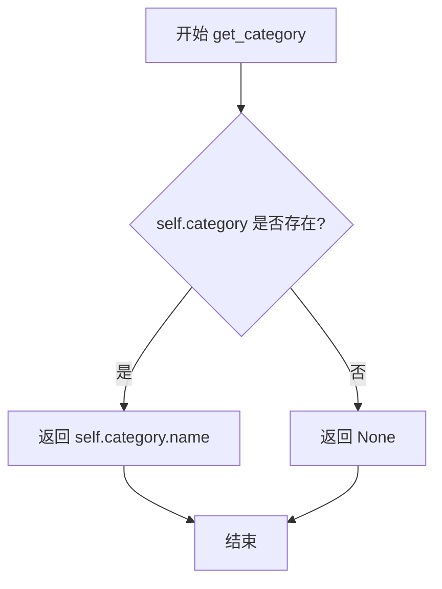

#### 带注释源码

```python
def get_category(self):
    """
    获取漏洞的类别名称
    
    Returns:
        str: 类别名称，如果 category 不存在则返回 None
    """
    # 检查 self.category 是否存在（不为 None）
    if self.category:
        # 如果 category 存在，返回其 name 属性
        return self.category.name
    # 如果 category 不存在，隐式返回 None
```


### `Vulnerability.get_name`

获取漏洞的名称。

参数： 无

返回值： `str`，返回漏洞的名称

#### 流程图

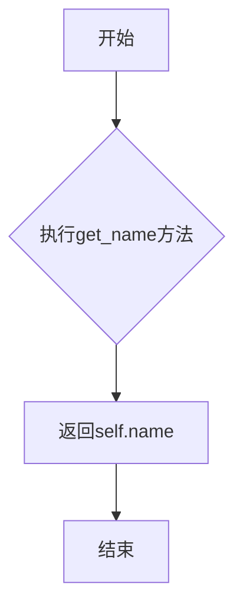

#### 带注释源码

```python
def get_name(self):
    """获取漏洞的名称"""
    return self.name
```


### Vulnerability.explain

该方法用于获取漏洞的描述信息，通过返回类或实例的文档字符串（`__doc__`）来实现。在子类中可以通过重写该方法并配合字符串格式化来提供更详细的漏洞描述。

参数： 无（仅包含隐含的 `self` 参数）

返回值：`str`，返回漏洞的文档描述字符串，如果类未定义文档字符串则返回 `None`

#### 流程图

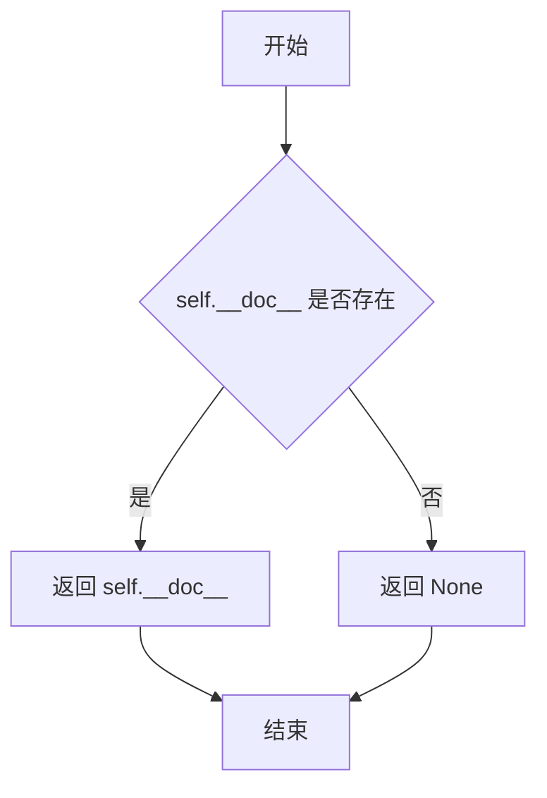

#### 带注释源码

```python
def explain(self):
    """获取漏洞描述信息
    
    该方法返回类或实例的文档字符串 (__doc__)。
    如果类没有定义文档字符串，则返回 None。
    子类可以重写此方法以提供更详细的描述信息，
    例如 K8sVersionDisclosure 类中就重写并格式化了该方法。
    
    Returns:
        str: 类的文档字符串，描述漏洞的相关信息
    """
    return self.__doc__
```


### `Vulnerability.get_severity`

获取漏洞的严重性级别，根据漏洞类别返回对应的严重性字符串，默认为"low"。

参数： 无

返回值：`str`，返回严重性级别字符串（如"high"、"medium"、"low"）

#### 流程图

```mermaid
flowchart TD
    A[开始 get_severity] --> B{self.category 是否在 severity 字典中}
    B -->|是| C[返回 severity[self.category]]
    B -->|否| D[返回默认值 "low"]
    C --> E[结束]
    D --> E
```

#### 带注释源码

```python
def get_severity(self):
    """
    获取漏洞的严重性级别
    
    Returns:
        str: 严重性级别字符串，默认为"low"
    """
    # 使用字典的get方法，如果category不存在则返回默认值"low"
    # severity字典是类属性，映射 Vulnerability.category 到严重性字符串
    return self.severity.get(self.category, "low")
```


### `NewHostEvent.cloud`

该属性用于获取 Kubernetes 集群部署的云类型。如果 `cloud_type` 未设置，则自动调用 `get_cloud()` 方法通过第三方服务查询云类型并缓存结果。

参数： 无（属性不接受任何参数）

返回值：`str`，返回云类型字符串（如 "Azure"、"AWS"、"GCP" 或 "NoCloud"）

#### 流程图

```mermaid
flowchart TD
    A[访问 cloud 属性] --> B{self.cloud_type 是否已设置?}
    B -->|是| C[直接返回 self.cloud_type]
    B -->|否| D[调用 self.get_cloud() 方法]
    D --> E{API 请求成功?}
    E -->|是| F[从响应中获取 cloud 值]
    E -->|否| G[返回 'NoCloud']
    F --> H[将结果赋值给 self.cloud_type]
    H --> C
    G --> C
```

#### 带注释源码

```python
@property
def cloud(self):
    """云类型属性
    
    如果 cloud_type 未设置，则自动调用 get_cloud() 方法获取云类型。
    这是一个延迟加载属性，只有在首次访问时才进行云类型检测。
    """
    # 检查 self.cloud_type 是否为 None 或空值
    if not self.cloud_type:
        # 调用 get_cloud() 方法进行云类型检测
        self.cloud_type = self.get_cloud()
    
    # 返回云类型字符串
    return self.cloud_type
```


### NewHostEvent.get_cloud

此方法通过调用第三方Azure API检测主机所在的云类型，如果无法连接或检测失败则返回"NoCloud"。

参数：

- 此方法无显式参数（`self` 为实例隐含参数）

返回值：`str`，返回云类型字符串（如 "Azure"、"AWS" 等）或 "NoCloud"（当无法检测时）

#### 流程图

```mermaid
flowchart TD
    A[开始 get_cloud] --> B[调用 Azure API https://api.azurespeed.com/api/region]
    B --> C{请求成功?}
    C -->|是| D[解析JSON响应]
    D --> E{cloud字段存在?}
    E -->|是| F[返回 result['cloud'] 或 'NoCloud']
    E -->|否| F
    C -->|否| G{ConnectionError?}
    G -->|是| H[记录info日志 - 连接失败]
    G -->|否| I[记录warning日志 - 其它异常]
    H --> J[返回 'NoCloud']
    I --> J
    F --> K[结束 - 返回云类型字符串]
    J --> K
```

#### 带注释源码

```python
def get_cloud(self):
    """检测主机所在的云类型"""
    try:
        # 记录调试日志，说明正在检测Azure云
        logger.debug("Checking whether the cluster is deployed on azure's cloud")
        
        # 调用第三方工具 AzureSpeed 的 API 进行云IP检测
        # 使用 requests 库发送 HTTP GET 请求
        # 参数 self.host 是主机地址或IP
        # 使用 config.network_timeout 设置超时时间
        result = requests.get(
            f"https://api.azurespeed.com/api/region?ipOrUrl={self.host}", timeout=config.network_timeout,
        ).json()
        
        # 从响应JSON中获取cloud字段
        # 如果cloud字段为空或不存在，返回 "NoCloud"
        return result["cloud"] or "NoCloud"
    
    # 处理网络连接错误
    except requests.ConnectionError:
        # 记录信息日志，说明无法连接到云类型检测服务
        logger.info(f"Failed to connect cloud type service", exc_info=True)
    
    # 处理所有其他异常（如JSON解析错误、超时等）
    except Exception:
        # 记录警告日志，说明无法检查主机的云类型
        logger.warning(f"Unable to check cloud of {self.host}", exc_info=True)
    
    # 无论何种异常，最终返回 "NoCloud" 作为默认值
    return "NoCloud"
```


### `NewHostEvent.__str__`

该方法为 `NewHostEvent` 类的字符串表示方法，返回主机的字符串形式，用于在需要将事件对象转换为字符串时调用（如打印日志、字符串拼接等场景）。

参数：无（仅包含隐式参数 `self`）

返回值：`str`，返回主机的字符串表示形式

#### 流程图

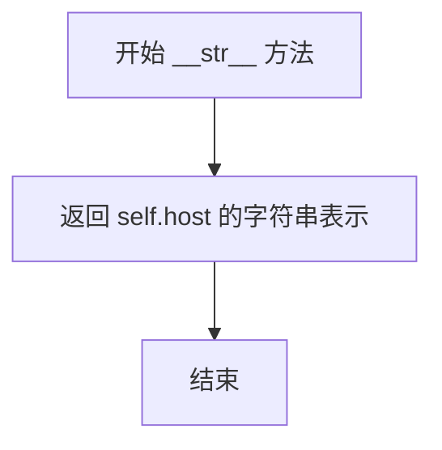

#### 带注释源码

```python
def __str__(self):
    """
    返回该事件的字符串表示形式
    
    Returns:
        str: 主机的字符串表示，等同于 self.host 的字符串化结果
    """
    return str(self.host)
```


### NewHostEvent.location

获取事件的逻辑位置，主要用于报告。

参数：无

返回值：`str`，返回事件的主机位置字符串，用于报告展示。

#### 流程图

```mermaid
flowchart TD
    A[开始 location] --> B{方法被调用}
    B --> C[返回 str(self.host)]
    C --> D[结束]
```

#### 带注释源码

```python
# Event's logical location to be used mainly for reports.
def location(self):
    return str(self.host)
```

**注释说明**：
- 此方法重写了父类 `Event` 的 `location` 方法
- 直接返回 `self.host` 的字符串表示形式，作为事件的逻辑位置
- 用于生成报告时展示目标主机信息
- 与父类 `Event.location()` 的实现不同：父类通过递归查找 `previous` 事件的位置，而此类直接返回主机字符串


### `OpenPortEvent.__str__`

该方法为 `OpenPortEvent` 类的字符串表示特殊方法（`__str__`），用于将 OpenPortEvent 对象转换为字符串形式，返回端口号的字符串表示。当对 OpenPortEvent 实例调用 `str()` 或 `print()` 时自动触发此方法。

参数：

- `self`：`OpenPortEvent`，隐式参数，代表当前 OpenPortEvent 实例对象本身

返回值：`str`，返回端口号的字符串表示形式。例如，若 `self.port` 为 `8080`，则返回字符串 `"8080"`。

#### 流程图

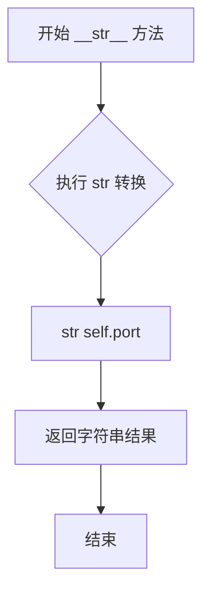

#### 带注释源码

```python
class OpenPortEvent(Event):
    def __init__(self, port):
        """
        初始化 OpenPortEvent 实例
        :param port: int/str, 端口号
        """
        self.port = port

    def __str__(self):
        """
        返回 OpenPortEvent 实例的字符串表示
        此方法在调用 str() 或 print() 时自动触发
        :return: str, 端口号的字符串形式
        """
        return str(self.port)  # 将 self.port 转换为字符串并返回
```


### `OpenPortEvent.location`

获取事件的逻辑位置信息，用于报告生成。如果事件包含主机信息，则返回"主机:端口"格式；否则仅返回端口信息。

参数：
- 无（仅包含隐式参数 `self`）

返回值：`str`，返回事件的逻辑位置字符串，格式为"主机:端口"或仅"端口"

#### 流程图

```mermaid
flowchart TD
    A[开始 location 方法] --> B{self.host 是否存在?}
    B -->|是| C[location = str(self.host) + ':' + str(self.port)]
    B -->|否| D[location = str(self.port)]
    C --> E[返回 location]
    D --> E
    E --> F[结束]
```

#### 带注释源码

```python
class OpenPortEvent(Event):
    def __init__(self, port):
        """初始化 OpenPortEvent，存储端口信息"""
        self.port = port

    def __str__(self):
        """返回端口的字符串表示"""
        return str(self.port)

    # Event's logical location to be used mainly for reports.
    def location(self):
        """获取事件的逻辑位置，用于报告生成"""
        if self.host:
            # 如果存在主机信息，组合成"主机:端口"格式
            location = str(self.host) + ":" + str(self.port)
        else:
            # 仅返回端口信息
            location = str(self.port)
        return location
```


### `K8sVersionDisclosure.explain`

该方法用于生成并返回 K8s 版本泄露漏洞的描述信息，通过格式化类文档字符串并附加额外信息来实现。

参数：
- 该方法无参数（仅包含 `self`）

返回值：`str`，返回格式化后的漏洞描述字符串，包含泄露端点和额外信息。

#### 流程图

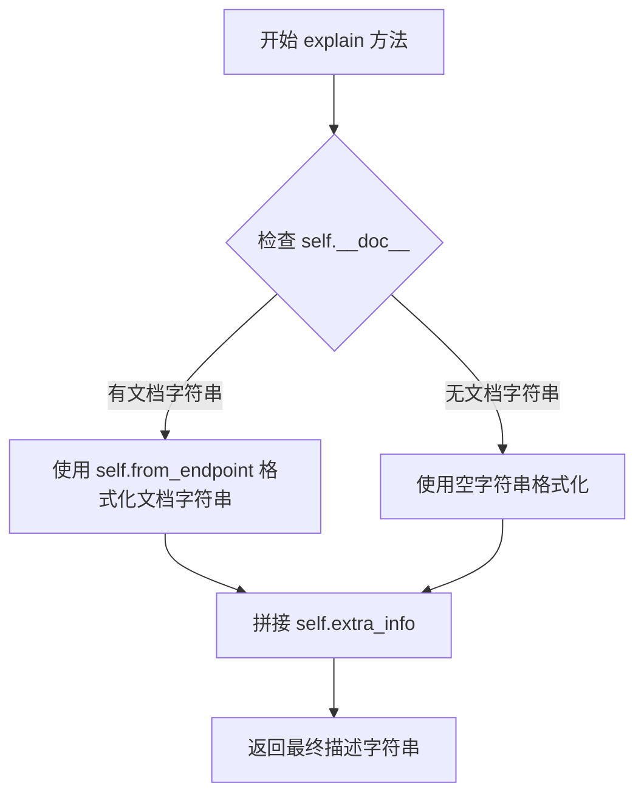

#### 带注释源码

```python
def explain(self):
    """
    生成 K8s 版本泄露漏洞的描述信息
    
    说明：
        - self.__doc__ 存储了类级别的文档字符串，格式为 "The kubernetes version could be obtained from the {} endpoint "
        - self.from_endpoint 表示获取版本信息的具体端点
        - self.extra_info 表示额外的补充信息
        - 方法通过字符串的 format() 方法将端点插入到文档字符串中
        - 最后与额外信息进行字符串拼接形成完整描述
    """
    # 使用 format 方法将 from_endpoint 插入到文档字符串的 {} 占位符中
    # 然后拼接 extra_info 形成完整描述
    return self.__doc__.format(self.from_endpoint) + self.extra_info
```

## 关键组件


### Event

事件系统基类，支持事件历史链式追溯和惰性属性加载。通过`__getattr__`实现动态属性查找，从事件历史链中按 newest-first 顺序查找属性；`history`属性提供从新到旧的事件历史列表。

### EventFilterBase

事件过滤器基类，定义事件处理的标准接口。`execute`方法默认返回原事件，可被子类重写以修改或丢弃事件。

### Vulnerability

漏洞基类，定义安全问题的通用结构和严重性分级。通过类级别`severity`字典映射漏洞类别到严重等级（high/medium/low），包含vid、component、category、name、evidence等核心属性。

### Service

Kubernetes服务抽象类，表示待检测的服务节点。包含name、path、secure标志和role属性，提供`get_name()`、`get_path()`和`explain()`方法。

### NewHostEvent

新主机发现事件，继承自Event。包含主机发现逻辑：通过第三方API（AzureSpeed）检测云类型，支持惰性加载cloud属性。使用线程锁保证事件ID的线程安全递增。

### OpenPortEvent

开放端口事件，表示在主机上发现的开放端口。包含port属性和`location()`方法，可组合host信息形成完整的位置字符串。

### K8sVersionDisclosure

Kubernetes版本泄露漏洞，继承自Vulnerability和Event双重身份。实现`explain()`方法格式化漏洞描述，支持从指定端点获取版本信息的证据记录。

### 全局同步机制

通过`event_id_count_lock`（threading.Lock）和`event_id_count`全局变量实现线程安全的事件ID生成，确保并发场景下事件ID的唯一性和顺序性。


## 问题及建议


### 已知问题

-   **全局变量声明位置错误**：`global event_id_count_lock` 声明在模块级别（函数外部），这是无效的Python语法，全局变量应在函数内部声明
-   **可变类变量风险**：`Vulnerability.severity` 使用可变字典作为类变量，所有实例共享同一字典，可能导致意外的跨实例修改
-   **重复计算的history属性**：每次访问 `Event.history` 都会重新遍历链表构建列表，复杂度O(n)，对于频繁访问的场景性能不佳
-   **同步网络阻塞**：`get_cloud()` 使用同步 `requests.get`，会阻塞调用线程，缺乏超时重试和异步支持
-   **日志信息不规范**：`logger.info(f"Failed to connect cloud type service", ...)` 缺少介词"to"，语句不够通顺
-   **多重继承MRO风险**：`K8sVersionDisclosure` 同时继承 `Vulnerability` 和 `Event`，两个父类没有共同的基类，可能导致方法解析顺序（Method Resolution Order）混乱
-   **魔法方法副作用**：`Event.__getattr__` 的实现会对任何不存在的属性返回None，可能隐藏真正的属性错误
-   **裸异常捕获**：`get_cloud()` 中 `except Exception` 过于宽泛，会捕获所有异常包括KeyboardInterrupt，可能掩盖真实问题
-   **docstring可能为None**：`explain()` 方法返回 `self.__doc__`，如果类没有文档字符串会返回None，导致后续字符串格式化可能出错

### 优化建议

-   将 `global event_id_count_lock` 移至需要使用它的函数（如 `__init__`）内部声明
-   将 `severity` 改为类方法或在 `__init__` 中初始化为实例变量
-   考虑缓存 `history` 属性结果或使用迭代器模式
-   改用 `aiohttp` 实现异步请求，或至少添加超时和重试机制
-   修正日志信息为 "Failed to connect to cloud type service"
-   考虑使用组合模式替代多重继承，或重构类层次结构避免菱形继承
-   在 `__getattr__` 中对特定属性添加白名单检查，避免过度通用的实现
-   改为捕获具体异常如 `requests.RequestException`
-   在 `explain()` 方法中添加 docstring 为空的默认处理逻辑
-   为关键类和方法添加类型注解提升代码可读性和IDE支持


## 其它


### 设计目标与约束

**设计目标**：
1. 提供一个灵活的事件驱动架构，用于收集和传递Kubernetes安全扫描过程中的信息
2. 支持漏洞的分类和严重性评级
3. 实现云环境类型自动检测功能
4. 为每个事件生成唯一标识符以支持追踪

**约束**：
1. 网络请求必须遵守config.network_timeout配置的超时设置
2. 云类型检测依赖第三方API (api.azurespeed.com)
3. 事件历史通过链表结构存储，过长的事件链可能影响性能

### 错误处理与异常设计

1. **网络请求异常处理**：
   - `requests.ConnectionError`: 记录info级别日志并返回"NoCloud"
   - 其他Exception: 记录warning级别日志并返回"NoCloud"
   
2. **属性访问异常处理**：
   - `__getattr__`方法中，当访问不存在的属性时返回None，避免抛出AttributeError

3. **事件过滤器设计**：
   - execute()方法返回None表示事件应被丢弃，返回原事件或新事件表示继续处理

### 数据流与状态机

**事件流**：
1. HuntStarted → NewHostEvent → OpenPortEvent → Vulnerability相关事件 → HuntFinished
2. 事件通过previous指针链接形成事件链(history)
3. ReportDispatched在报告生成时触发

**状态转换**：
- 初始状态：HuntStarted事件触发
- 扫描状态：NewHostEvent创建后进行云类型检测
- 端口发现：OpenPortEvent记录开放端口
- 漏洞发现：K8sVersionDisclosure等漏洞事件
- 结束状态：HuntFinished事件触发，触发ReportDispatched

### 外部依赖与接口契约

**外部依赖**：
1. `threading` - 用于线程安全的全局计数器
2. `requests` - 用于HTTP请求云类型检测API
3. `logging` - 用于日志记录
4. `kube_hunter.conf.config` - 配置对象，提供network_timeout参数
5. `kube_hunter.core.types` - 定义安全事件类型枚举

**接口契约**：
1. Event类需实现location()方法用于报告定位
2. Vulnerability类需实现get_severity()返回严重性字符串
3. Service/Vulnerability类需实现explain()返回文档字符串

### 模块职责边界

- **Event类体系**: 负责数据传递和历史追踪
- **Vulnerability类体系**: 负责漏洞建模和严重性评级
- **Service类**: 负责服务信息建模
- **EventFilterBase**: 负责事件过滤和修改的扩展点

### 并发与线程安全

- 使用threading.Lock保护全局event_id_count变量
- NewHostEvent.__init__中获取锁后递增计数器，确保事件ID唯一

### 可扩展性设计

1. EventFilterBase作为扩展点，允许自定义过滤器
2. Vulnerability的severity字典可扩展更多威胁类型
3. Event类支持通过__getattr__动态访问历史事件属性
4. 支持多事件类型继承（K8sVersionDisclosure同时继承Vulnerability和Event）

### 日志规范

- logger.debug: 调试信息（云类型检测开始）
- logger.info: 连接失败信息
- logger.warning: 无法检查云类型警告
- 使用exc_info=True记录异常堆栈信息
</think>

### 设计目标与约束

本模块作为kube-hunter的核心事件与漏洞模型层，设计目标是提供灵活的事件驱动架构用于安全扫描数据的收集与传递，同时实现漏洞的标准化分类与严重性评级。主要约束包括：网络请求必须遵守config.network_timeout配置、云类型检测依赖第三方API (api.azurespeed.com)、事件历史采用链表结构存储需注意过长链的性能影响。

### 错误处理与异常设计

网络请求异常处理分为两类：`requests.ConnectionError`被捕获后记录info级别日志并返回"NoCloud"，其他通用Exception被捕获后记录warning级别日志并同样返回"NoCloud"。属性访问方面，`__getattr__`方法对不存在的属性返回None而非抛出AttributeError。事件过滤器设计规定execute()方法返回None表示事件应被丢弃，返回原事件或新事件表示继续处理流程。

### 数据流与状态机

事件流遵循以下顺序：HuntStarted → NewHostEvent → OpenPortEvent → Vulnerability相关事件 → HuntFinished。事件通过previous指针链接形成事件链(history)，ReportDispatched在报告生成时触发。状态转换从初始状态HuntStarted开始，经过扫描状态(NewHostEvent创建后进行云类型检测)和端口发现状态(OpenPortEvent记录开放端口)，最终到达漏洞发现状态(K8sVersionDisclosure等漏洞事件)和结束状态HuntFinished，触发ReportDispatched。

### 外部依赖与接口契约

外部依赖包括：threading模块用于线程安全的全局计数器、requests模块用于HTTP请求云类型检测API、logging模块用于日志记录、kube_hunter.conf.config配置对象提供network_timeout参数、kube_hunter.core.types定义安全事件类型枚举。接口契约要求Event类实现location()方法用于报告定位、Vulnerability类实现get_severity()返回严重性字符串、Service/Vulnerability类实现explain()返回文档字符串。

### 模块职责边界

Event类体系负责数据传递和历史追踪，Vulnerability类体系负责漏洞建模和严重性评级，Service类负责服务信息建模，EventFilterBase负责事件过滤和修改的扩展点。

### 并发与线程安全

使用threading.Lock保护全局event_id_count变量，NewHostEvent.__init__中获取锁后递增计数器，确保事件ID全局唯一。

### 可扩展性设计

EventFilterBase作为扩展点允许自定义过滤器，Vulnerability的severity字典可扩展更多威胁类型，Event类支持通过__getattr__动态访问历史事件属性，支持多事件类型继承(K8sVersionDisclosure同时继承Vulnerability和Event)。

### 日志规范

使用logger.debug记录调试信息(如云类型检测开始)，logger.info记录连接失败信息，logger.warning记录无法检查云类型警告，所有日志使用exc_info=True记录异常堆栈信息便于问题排查。
    