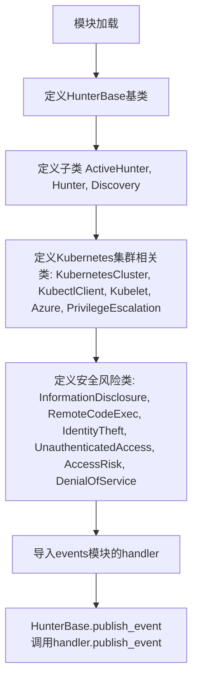
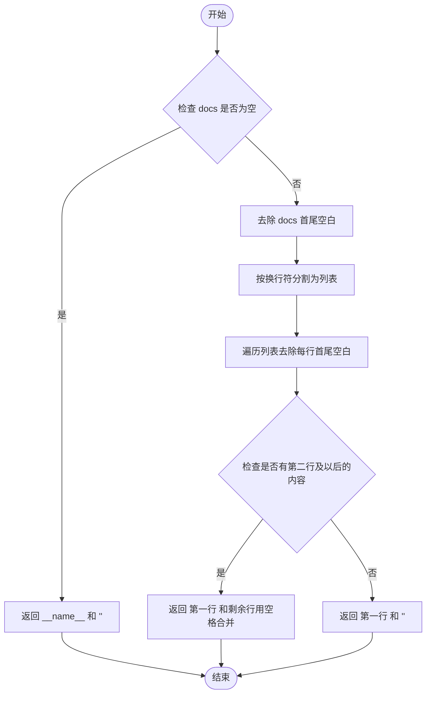
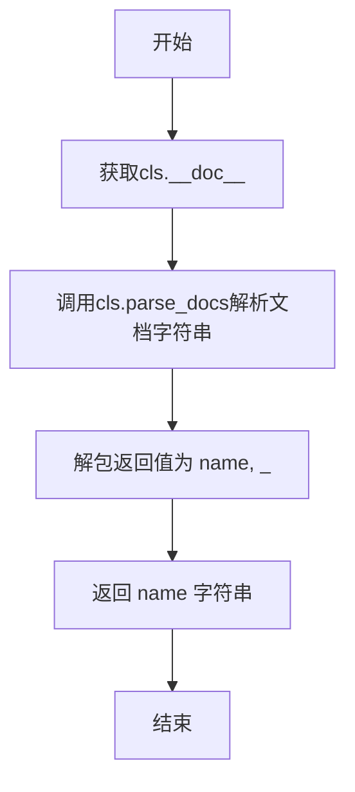
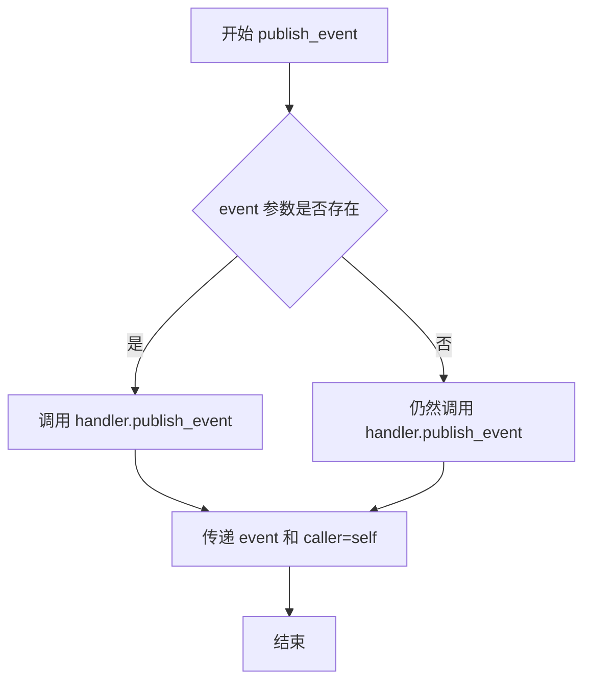
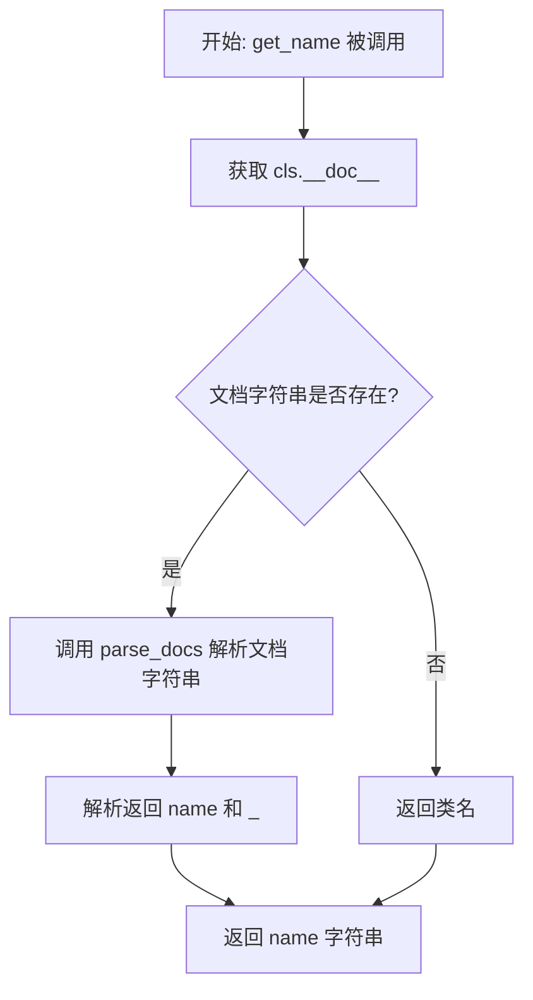
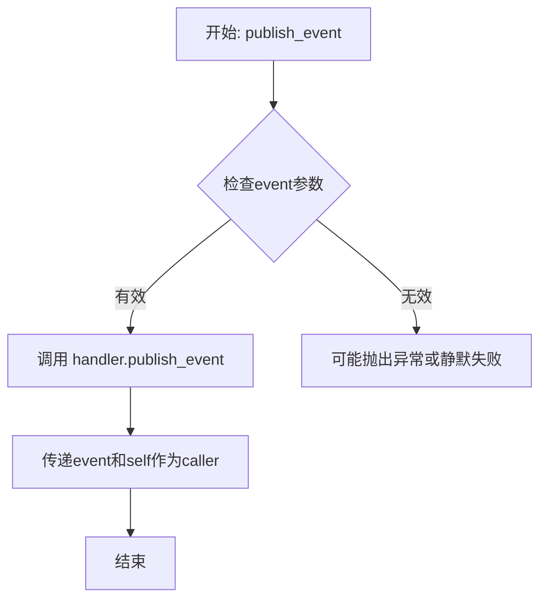

# `kubehunter\kube_hunter\core\types.py` 详细设计文档

该模块定义了一套用于安全漏洞狩猎（Vulnerability Hunting）的基础类框架，包括HunterBase基类及其子类ActiveHunter、Hunter、Discovery，以及一系列安全风险类别（如信息泄露、远程代码执行、身份盗窃等）和Kubernetes集群相关的组件类。

## 整体流程



## 类结构

```
HunterBase (基类)
├── ActiveHunter
├── Hunter
└── Discovery
KubernetesCluster (基类)
├── KubectlClient
├── Kubelet
├── Azure
└── PrivilegeEscalation
独立风险类
├── InformationDisclosure
├── RemoteCodeExec
├── IdentityTheft
├── UnauthenticatedAccess
├── AccessRisk
└── DenialOfService
```

## 全局变量及字段


### `HunterBase.publishedVulnerabilities`
    
计数器，记录已发布的漏洞数量

类型：`int`
    


### `KubernetesCluster.name`
    
Kubernetes集群的名称

类型：`str`
    


### `KubectlClient.name`
    
Kubectl客户端的名称或描述

类型：`str`
    


### `Kubelet.name`
    
Kubelet节点的名称

类型：`str`
    


### `Azure.name`
    
Azure集群的名称

类型：`str`
    


### `InformationDisclosure.name`
    
信息泄露风险的名称

类型：`str`
    


### `RemoteCodeExec.name`
    
远程代码执行风险的名称

类型：`str`
    


### `IdentityTheft.name`
    
身份盗窃风险的名称

类型：`str`
    


### `UnauthenticatedAccess.name`
    
未授权访问风险的名称

类型：`str`
    


### `AccessRisk.name`
    
访问风险的名称

类型：`str`
    


### `PrivilegeEscalation.name`
    
权限提升风险的名称

类型：`str`
    


### `DenialOfService.name`
    
拒绝服务风险的名称

类型：`str`
    
    

## 全局函数及方法


### `HunterBase.parse_docs`

该方法是一个静态方法，用于解析类文档字符串，提取第一行作为名称，剩余行合并为文档描述。

参数：

- `docs`：`str`，需要解析的文档字符串，如果为空则返回默认名称和提示信息

返回值：`Tuple[str, str]`，返回包含(名称, 文档描述)的元组

#### 流程图



#### 带注释源码

```python
@staticmethod
def parse_docs(docs):
    """returns tuple of (name, docs)"""
    # 检查文档字符串是否为空
    if not docs:
        # 如果为空，返回当前模块名称和默认提示文本
        return __name__, "<no documentation>"
    
    # 去除首尾空白并按换行符分割成列表
    docs = docs.strip().split("\n")
    
    # 遍历列表，去除每行的前后空格
    for i, line in enumerate(docs):
        docs[i] = line.strip()
    
    # 返回第一行作为名称，如果有剩余行则合并，否则返回默认提示
    return docs[0], " ".join(docs[1:]) if len(docs[1:]) else "<no documentation>"
```


### `HunterBase.get_name`

该方法是一个类方法，用于从类的文档字符串（`__doc__`）中解析并提取类的名称。

参数：

- `cls`：`type`，类方法的隐式参数，代表调用该方法的类本身

返回值：`str`，从类文档字符串中解析出的名称

#### 流程图



#### 带注释源码

```python
@classmethod
def get_name(cls):
    """获取类的名称"""
    # 调用类方法 parse_docs 解析类的文档字符串
    # parse_docs 返回 (name, docs) 元组
    name, _ = cls.parse_docs(cls.__doc__)
    # 返回解析出的名称，丢弃文档描述部分
    return name
```


### `HunterBase.publish_event`

该方法是将事件发布到事件处理器的核心方法，通过调用全局 handler 的 publish_event 方法将当前hunter实例作为调用者上下文传递给事件系统。

参数：

- `event`：任意类型，需要发布的事件对象

返回值：`None`，无返回值，仅执行事件发布操作

#### 流程图



#### 带注释源码

```python
def publish_event(self, event):
    """
    发布事件到事件处理器
    
    参数:
        event: 要发布的事件对象，可以是任意类型
    返回值:
        无返回值
    """
    # 调用全局 handler 对象的 publish_event 方法
    # 将当前 hunter 实例(self)作为调用者(caller)传递
    # 这样事件处理器可以知道是哪个 hunter 触发的事件
    handler.publish_event(event, caller=self)
```


### `HunterBase.parse_docs`

该方法是一个静态方法，用于解析文档字符串，提取第一行作为名称，剩余行拼接为文档描述，返回包含名称和文档的元组。

参数：

- `docs`：`str`，待解析的文档字符串，支持多行格式，第一行为名称，后续行为文档内容

返回值：`tuple`，返回 (name, docs) 元组，其中 name 为文档第一行（名称），docs 为剩余行拼接的字符串，空时返回 "<no documentation>"，若输入为空则返回 (__name__, "<no documentation>")

#### 流程图

```mermaid
flowchart TD
    A[开始 parse_docs] --> B{docs 是否为空}
    B -- 是 --> C[返回 __name__ 和 '<no documentation>']
    B -- 否 --> D[去除 docs 首尾空白]
    D --> E[按换行符分割为列表]
    F[遍历列表] --> G[去除每行前后空格]
    G --> H[返回第一行作为 name]
    H --> I{剩余行列表长度 > 0?}
    I -- 是 --> J[用空格拼接剩余行作为 docs]
    I -- 否 --> K[docs 设为 '<no documentation>']
    J --> L[返回 (name, docs) 元组]
    K --> L
```

#### 带注释源码

```python
@staticmethod
def parse_docs(docs):
    """returns tuple of (name, docs)"""
    # 检查输入文档字符串是否为空
    if not docs:
        # 空文档时返回当前模块名称和默认无文档标记
        return __name__, "<no documentation>"
    
    # 去除字符串首尾空白后按换行符分割成列表
    docs = docs.strip().split("\n")
    
    # 遍历列表，去除每行内容的前后空格
    for i, line in enumerate(docs):
        docs[i] = line.strip()
    
    # 返回第一行作为名称，若有剩余行则用空格拼接作为文档描述，否则使用默认标记
    return docs[0], " ".join(docs[1:]) if len(docs[1:]) else "<no documentation>"
```


### `HunterBase.get_name`

获取当前类的名称，通过解析类的文档字符串（`__doc__`）提取第一行作为类名。

参数：

- `cls`：`class`，类方法隐式传入的类本身参数，代表调用该方法的类

返回值：`str`，返回从类文档字符串中解析出的名称字符串

#### 流程图



#### 带注释源码

```python
@classmethod
def get_name(cls):
    """获取类的名称
    
    通过解析类的 __doc__ 属性来提取类名。
    该方法是一个类方法，可以被任何子类继承调用。
    
    Returns:
        str: 从类文档字符串第一行解析出的名称
    """
    # 使用类方法调用 parse_docs，传入当前类的文档字符串
    # parse_docs 返回一个元组 (name, docs)
    # 使用 _ 忽略第二个返回值（文档描述）
    name, _ = cls.parse_docs(cls.__doc__)
    
    # 返回解析出的类名
    return name
```

#### 相关依赖方法

该方法依赖 `HunterBase.parse_docs` 静态方法：

```python
@staticmethod
def parse_docs(docs):
    """returns tuple of (name, docs)"""
    if not docs:
        return __name__, "<no documentation>"
    docs = docs.strip().split("\n")
    for i, line in enumerate(docs):
        docs[i] = line.strip()
    return docs[0], " ".join(docs[1:]) if len(docs[1:]) else "<no documentation>"
```

#### 使用示例

```python
# 假设类定义如下:
class KubernetesCluster:
    """Kubernetes Cluster"""
    name = "Kubernetes Cluster"

# 调用 get_name
name = KubernetesCluster.get_name()
# 返回: "Kubernetes Cluster"
```


### `HunterBase.publish_event`

该方法负责将事件发布到事件处理器，它是 HunterBase 类的核心功能之一，用于通知系统有关漏洞或安全事件的发现。

参数：

- `self`：`HunterBase`，隐式参数，调用该方法的实例对象本身
- `event`：任意类型，表示待发布的事件对象，包含事件的相关数据和元信息

返回值：`None`（无返回值），该方法通过调用 `handler.publish_event` 来处理事件，不返回任何值

#### 流程图



#### 带注释源码

```python
def publish_event(self, event):
    """
    发布事件到事件处理器
    
    参数:
        event: 要发布的事件对象，包含漏洞或安全事件的相关信息
    
    返回值:
        无返回值，直接调用handler的publish_event方法
    """
    # 将事件和当前Hunter实例(caller)传递给事件处理器
    # handler是来自events模块的全局事件处理器实例
    # self参数用于标识事件的触发者，便于后续追踪和统计
    handler.publish_event(event, caller=self)
```

## 关键组件


### HunterBase

HunterBase类是整个模块的基类，提供了漏洞发布、文档解析和事件发布的核心功能。它包含类变量publishedVulnerabilities用于追踪已发布的漏洞数量，并定义了parse_docs静态方法用于解析文档字符串，以及get_name类方法和publish_event实例方法用于获取类名和发布事件。

### ActiveHunter

ActiveHunter类继承自HunterBase，是一个活跃的扫描器类，目前没有实现额外的方法，代表主动扫描器的基类实现。

### Hunter

Hunter类继承自HunterBase，代表通用的扫描器类，目前没有实现额外的方法，作为扫描器的抽象基类。

### Discovery

Discovery类继承自HunterBase，代表发现类扫描器，用于安全漏洞的发现工作，目前没有实现额外的方法。

### KubernetesCluster

KubernetesCluster类是Kubernetes集群的基类，表示Kubernetes集群这一基础设施组件，类属性name为"Kubernetes Cluster"。

### KubectlClient

KubectlClient类表示kubectl客户端工具，用于与Kubernetes集群进行交互，类属性name为"Kubectl Client"，继承自HunterBase。

### Kubelet

Kubelet类继承自KubernetesCluster，表示Kubernetes节点上的kubelet代理服务，是运行在每个节点上的主要"节点代理"，类属性name为"Kubelet"。

### Azure

Azure类继承自KubernetesCluster，表示Azure云平台上的Kubernetes集群，类属性name为"Azure"。

### InformationDisclosure

InformationDisclosure类表示信息泄露安全威胁类型，类属性name为"Information Disclosure"，继承自HunterBase。

### RemoteCodeExec

RemoteCodeExec类表示远程代码执行安全威胁类型，类属性name为"Remote Code Execution"，继承自HunterBase。

### IdentityTheft

IdentityTheft类表示身份盗窃安全威胁类型，类属性name为"Identity Theft"，继承自HunterBase。

### UnauthenticatedAccess

UnauthenticatedAccess类表示未授权访问安全威胁类型，类属性name为"Unauthenticated Access"，继承自HunterBase。

### AccessRisk

AccessRisk类表示访问风险安全威胁类型，类属性name为"Access Risk"，继承自HunterBase。

### PrivilegeEscalation

PrivilegeEscalation类继承自KubernetesCluster，表示权限提升安全威胁类型，类属性name为"Privilege Escalation"，这是一个跨类的设计，将威胁类型与基础设施组件关联。

### DenialOfService

DenialOfService类表示拒绝服务安全威胁类型，类属性name为"Denial of Service"，继承自HunterBase。

### handler (events模块导入)

从events模块导入的handler对象，用于发布事件，是事件处理的核心组件，与HunterBase的publish_event方法配合使用。


## 问题及建议


### 已知问题

- **不合理的类继承关系**：`Kubelet` 继承自 `KubernetesCluster`，`Azure` 继承自 `KubernetesCluster`，`PrivilegeEscalation` 继承自 `KubernetesCluster`，这些类之间的继承关系语义不通，Kubelet是节点代理、Azure是云提供商、PrivilegeEscalation是安全风险类别，它们与KubernetesCluster不存在is-a关系
- **空类设计问题**：`ActiveHunter`、`Hunter`、`Discovery` 继承自 `HunterBase` 但完全没有任何属性或方法扩展，成为纯粹的空类标记
- **职责混乱**：文件中混合了三种不同类型的类（Hunter系统基类、Kubernetes实体类、安全风险类型类），缺乏明确的模块职责划分
- **全局依赖隐式依赖**：`publish_event` 方法依赖于全局的 `handler` 对象，导入放在文件底部说明存在循环导入风险，这种隐式全局状态降低了代码的可测试性和可维护性
- **类型注解完全缺失**：所有方法参数、返回值、类字段都没有类型注解，影响代码可读性和IDE支持
- **命名规范不统一**：安全风险类使用驼峰命名（如 `RemoteCodeExec`），而实体类使用描述性名称（如 `KubernetesCluster`），且所有类都缺乏标准的枚举基类
- **类变量 vs 实例变量混淆**：`publishedVulnerabilities` 作为类变量被所有实例共享，可能导致状态意外共享问题
- **parse_docs 方法边界情况**：`parse_docs` 在 docs 为空时返回 `__name__`，对于类方法 `get_name` 可能返回非预期的模块名而非类名

### 优化建议

- **重构继承关系**：将 `KubernetesCluster`、`Kubelet`、`Azure` 改为组合关系或独立的类，可引入枚举或数据类定义；安全风险类型类应统一继承自一个基类（如 `RiskCategory`）或使用枚举
- **移除或实现空类**：如果 `ActiveHunter`、`Hunter`、`Discovery` 暂时不需要具体实现，应添加文档说明其用途或使用 `abc` 模块标记为抽象类
- **消除全局状态**：将 `handler` 作为参数传入 `publish_event` 方法，或通过依赖注入方式提供，提高可测试性
- **添加类型注解**：为所有字段和方法添加类型注解，使用 Python 3.10+ 的类型联合语法或 typing 模块
- **拆分模块**：将不同职责的类分离到独立模块，如 `hunters.py`（Hunter相关类）、`kubernetes.py`（K8s实体类）、`risks.py`（风险类型类）
- **调整变量作用域**：根据业务需求将 `publishedVulnerabilities` 改为实例变量或类方法
- **改进 parse_docs 逻辑**：在 `get_name` 方法中添加回退逻辑，当解析失败时使用 `cls.__name__`

## 其它


### 设计目标与约束

本代码定义了一个安全威胁/漏洞检测框架的类层次结构，通过HunterBase基类提供通用的漏洞发布机制，各类Hunter用于发现和报告安全威胁，威胁类型类（InformationDisclosure、RemoteCodeExec等）用于标识具体的安全风险类别。设计约束包括：Hunter类必须实现发布事件的功能，威胁类型类需要提供清晰的名称标识。

### 错误处理与异常设计

代码中错误处理机制较为薄弱，主要体现在：
1. `parse_docs`方法处理空文档时返回默认值的逻辑健壮性不足
2. 缺少对`handler.publish_event`调用失败时的异常捕获
3. 未定义自定义异常类来区分不同类型的错误场景
4. 建议添加异常处理：文档解析异常、事件发布失败异常、类文档为None时的处理

### 数据流与状态机

数据流如下：
1. 用户调用Hunter子类的实例方法触发安全检测
2. 检测到威胁后调用`publish_event`方法
3. `publish_event`将事件委托给`handler.publish_event`处理
4. `publishedVulnerabilities`计数器记录已发布的漏洞数量
状态机：Hunter实例初始化 → 检测威胁 → 发布事件 → 更新计数器

### 外部依赖与接口契约

1. **handler对象**：从`events`模块导入的全局事件处理器对象
   - 需实现`publish_event(event, caller=self)`方法
   - event参数应为可发布的事件对象
   - caller参数传递当前Hunter实例引用
2. **HunterBase.__doc__**：类文档字符串，用于动态获取类名称
3. **Python环境**：支持Python 3.x版本

### 类继承关系与职责

HunterBase：提供漏洞计数和事件发布的基础能力
ActiveHunter/Hunter/Discovery：继承基类，具体职责待实现
KubernetesCluster：Kubernetes相关威胁的基类
Kubelet/Azure：继承KubernetesCluster，表示具体组件
各类威胁类（InformationDisclosure等）：独立的威胁标识类，无父类

### 关键组件信息

HunterBase：漏洞发布框架的抽象基类
handler：全局事件处理器，负责实际的事件发布逻辑
publishedVulnerabilities：全局计数器，跟踪已发布的漏洞总数

### 潜在的技术债务或优化空间

1. **抽象程度不足**：HunterBase中的方法多为具体实现，缺少抽象方法定义
2. **类文档依赖**：get_name方法依赖类文档字符串，若文档格式不规范会导致不可预期行为
3. **硬编码耦合**：handler导入位置在文件底部，虽为避免循环依赖但增加了维护难度
4. **功能不完整**：大部分类为空的占位实现，实际功能未展开
5. **类型注解缺失**：无任何类型提示，影响代码可读性和IDE支持
6. **配置能力有限**：类属性多为硬编码，缺乏灵活的配置机制

### 其它项目

**命名规范一致性**：部分类使用名词短语（如KubernetesCluster），部分使用动作短语（如IdentityTheft），命名风格不统一
**文档字符串规范**：各威胁类均无文档字符串，不利于自动化文档生成
**扩展性考虑**：当前架构难以支持多租户、插件化检测器等高级特性
**测试覆盖**：代码缺少单元测试和集成测试


    