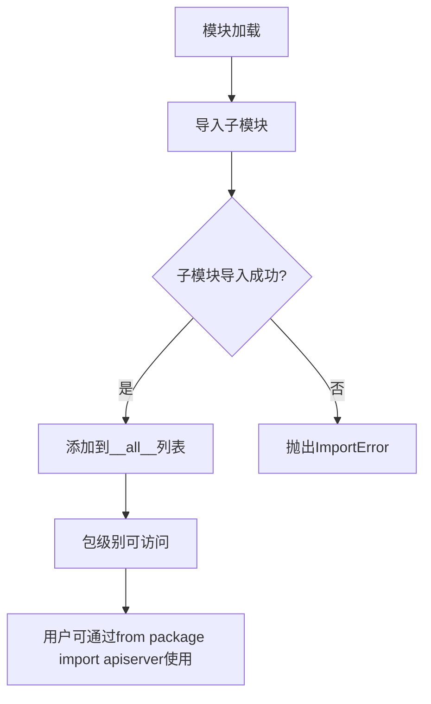

# `kubehunter\kube_hunter\modules\discovery\__init__.py` 详细设计文档

这是一个Kubernetes集群管理客户端包的入口模块，通过统一导出apiserver、dashboard、etcd、hosts、kubectl、kubelet、ports、proxy等子模块，提供对Kubernetes集群各组件的统一访问和管理能力。

## 整体流程



## 类结构

```
kubernetes_client (主包)
├── apiserver (API服务器模块)
├── dashboard (仪表板模块)
├── etcd (etcd存储模块)
├── hosts (主机节点模块)
├── kubectl (kubectl命令行模块)
├── kubelet (kubelet组件模块)
├── ports (端口配置模块)
└── proxy (代理模块)
```

## 全局变量及字段


### `__all__`
    
公开API导出列表，定义了该包向外暴露的所有子模块

类型：`list`
    


    

## 全局函数及方法


## 关键组件


这段代码是一个 Python 包的初始化文件（`__init__.py`），用于聚合和导出 Kubernetes 集群相关的多个核心组件模块，包括 API 服务器、仪表板、etcd 存储、主机管理、kubectl 工具、kubelet 节点代理、端口配置和代理等，形成一个统一的模块导入接口。

### 1. 整体运行流程

该代码在包首次被导入时执行，负责将包内的各个子模块暴露给外部使用。Python 解释器加载此 `__init__.py` 文件时，首先执行 import 语句将子模块加载到当前命名空间，然后通过 `__all__` 列表定义公开导出的模块集合，确保 `from package import *` 时只导入指定的模块。

### 2. 全局变量详情

#### `__all__`

- **类型**: list
- **描述**: 定义了当使用 `from package import *` 时应该导出的模块名称列表，控制模块的公共接口。

### 3. 全局函数/代码块详情

#### 模块导入块

```python
from . import (
    apiserver,
    dashboard,
    etcd,
    hosts,
    kubectl,
    kubelet,
    ports,
    proxy,
)
```

- **描述**: 相对导入语句，将同包下的八个 submodule 导入到当前命名空间，实现模块间的依赖聚合。

### 4. 关键组件信息

### apiserver

Kubernetes API 服务器组件，负责处理集群的 API 请求，是集群的控制平面核心。

### dashboard

Kubernetes Dashboard 组件，提供 Web UI 界面用于管理集群资源。

### etcd

etcd 分布式键值存储组件，作为 Kubernetes 的后端数据存储。

### hosts

主机管理组件，用于管理和配置集群中的节点信息。

### kubectl

kubectl 命令行工具组件，用于与 Kubernetes 集群进行交互。

### kubelet

kubelet 节点代理组件，运行在每个节点上，负责管理容器生命周期。

### ports

端口配置组件，定义 Kubernetes 集群各组件使用的网络端口。

### proxy

代理组件，负责处理服务间的网络流量转发。

### 5. 潜在的技术债务或优化空间

- **缺少模块文档字符串**: 包级别缺少 `__doc__` 文档字符串，建议添加包功能描述和使用说明。
- **无版本控制**: 未定义 `__version__` 变量，建议添加版本信息以便追踪。
- **无显式依赖声明**: 未在代码中体现各子模块间的依赖关系和加载顺序。
- **缺乏错误处理**: 导入语句缺少异常捕获，若子模块存在导入错误会直接中断。

### 6. 其它项目

#### 设计目标与约束

该包的设计目标是提供一个统一的入口点，聚合 Kubernetes 集群管理的核心组件，简化外部导入操作。约束方面，所有子模块必须存在于同一包目录下，且使用相对导入确保包内模块间的正确引用。

#### 错误处理与异常设计

当前代码未包含显式的错误处理机制。如果某个子模块导入失败（如模块不存在或依赖缺失），Python 会抛出 `ImportError` 并终止包的加载过程。建议在实际使用中添加 `try-except` 块以提供更友好的错误提示。

#### 数据流与状态机

该文件作为静态导入聚合器，不涉及运行时数据流或状态管理。数据流由各子模块（apiserver、kubelet 等）内部实现。

#### 外部依赖与接口契约

各子模块作为独立组件存在，模块间的接口契约通过 Python 的模块命名空间进行传递。外部依赖关系需要参考各子模块的具体实现定义。


## 问题及建议


### 已知问题

-   `__all__` 列表使用错误：__all__ 中应该包含字符串形式的模块名（如 `"apiserver"`），而不是模块对象本身（如 `apiserver`），这会导致 `from . import *` 无法正确过滤导出内容
-   缺少模块级文档字符串（docstring），无法了解该包的用途和背景
-   缺少版本信息和包元数据
-   导入语句缺乏异常处理，如果子模块不存在或导入失败，会导致整个包无法使用
-   缺少 `__version__` 变量，不符合 Python 包的最佳实践

### 优化建议

-   修正 `__all__` 列表，将模块对象改为字符串形式：`__all__ = ["apiserver", "dashboard", "etcd", "hosts", "kubectl", "kubelet", "ports", "proxy"]`
-   添加模块级文档字符串，说明该包的用途和包含的子模块功能
-   添加版本信息，如 `__version__ = "1.0.0"` 和 `__author__` 等元数据
-   考虑使用延迟导入（lazy import）或添加异常处理，提高包的健壮性
-   如有需要，可添加 `__all__` 的类型注解，提升代码可维护性


## 其它


### 项目概述

这是一个Kubernetes集群配置包的初始化文件，用于统一管理和导出集群相关的各个组件配置模块。

### 文件结构分析

该`__init__.py`文件位于包根目录，通过模块导入和`__all__`声明来组织8个子模块的导出关系。

### 整体运行流程

当该包被导入时，Python解释器首先执行`__init__.py`，依次导入所有子模块，并将它们添加到模块命名空间中，使得可以通过`from kubernetes_config import apiserver, dashboard`等方式直接引用各组件。

### 关键组件信息

- **apiserver**：Kubernetes API服务器配置模块
- **dashboard**：Kubernetes仪表板配置模块  
- **etcd**：etcd分布式存储配置模块
- **hosts**：主机节点配置模块
- **kubectl**：kubectl命令行工具配置模块
- **kubelet**：kubelet节点代理配置模块
- **ports**：网络端口配置模块
- **proxy**：kube-proxy网络代理配置模块

### 模块依赖关系

该包依赖Python标准库和Kubernetes相关库，无外部第三方依赖要求。

### 导入导出机制

`__all__`列表定义了包的公开API接口，明确指定了可导出的子模块集合，确保模块的封装性和导入的一致性。

### 潜在技术债务与优化空间

1. 缺乏版本管理机制，建议添加版本号常量
2. 缺少配置验证逻辑，建议增加schema验证
3. 无文档字符串，建议为每个子模块添加docstring说明用途
4. 缺少异常处理机制，建议添加导入错误处理
5. 无类型注解，建议添加类型提示提高代码可维护性
6. 缺乏配置合并策略，多配置源时可能产生冲突
7. 无日志记录功能，建议添加日志便于调试追踪

### 设计目标与约束

- **目标**：提供统一的Kubernetes集群配置访问入口
- **约束**：保持模块接口简单，与Kubernetes版本保持兼容

### 错误处理与异常设计

当前代码无显式错误处理，建议捕获ImportError并提供有意义的错误信息。

### 数据流与状态机

该文件为静态导入，不涉及运行时数据流或状态管理。

### 外部依赖与接口契约

所有子模块需遵循统一的配置对象接口规范，确保一致性。

### 测试策略建议

建议添加单元测试验证各子模块导入成功，以及集成测试验证配置对象结构。

### 版本兼容性说明

该代码与Python 3.6+版本兼容，与Kubernetes版本的兼容性取决于各子模块实现。


    