# `kubehunter\kube_hunter\modules\discovery\apiserver.py` 详细设计文档

该模块是kube-hunter安全扫描工具的核心组件,负责发现和分类Kubernetes集群中的API服务,包括普通API服务器和Metrics服务器,通过端口检测和行为分析来识别服务类型。

## 整体流程

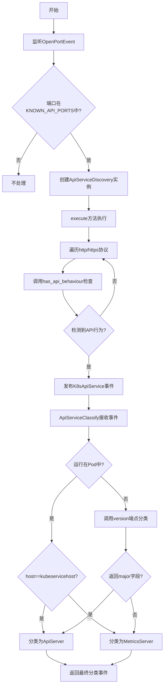

## 类结构

```
Event (事件基类)
├── Service (服务基类)
│   ├── K8sApiService
│   ├── ApiServer
│   └── MetricsServer
├── Discovery (发现基类)
│   └── ApiServiceDiscovery
└── EventFilterBase (事件过滤器基类)
    └── ApiServiceClassify
```

## 全局变量及字段


### `KNOWN_API_PORTS`
    
已知的Kubernetes API端口列表[443, 6443, 8080]

类型：`list`
    


### `logger`
    
模块级日志记录器

类型：`logging.Logger`
    


### `config`
    
kube-hunter全局配置对象(导入自kube_hunter.conf)

类型：`object`
    


### `K8sApiService.name`
    
服务名称

类型：`str`
    


### `K8sApiService.protocol`
    
通信协议(http/https)

类型：`str`
    


### `ApiServer.name`
    
服务名称为'API Server'

类型：`str`
    


### `ApiServer.protocol`
    
协议固定为https

类型：`str`
    


### `MetricsServer.name`
    
服务名称为'Metrics Server'

类型：`str`
    


### `MetricsServer.protocol`
    
协议固定为https

类型：`str`
    


### `ApiServiceDiscovery.event`
    
端口发现事件对象

类型：`OpenPortEvent`
    


### `ApiServiceDiscovery.session`
    
HTTP会话对象

类型：`requests.Session`
    


### `ApiServiceClassify.event`
    
API服务事件对象

类型：`K8sApiService`
    


### `ApiServiceClassify.classified`
    
是否已分类的标志

类型：`bool`
    


### `ApiServiceClassify.session`
    
HTTP会话对象

类型：`requests.Session`
    
    

## 全局函数及方法


### `logging.getLogger(__name__)` - 获取模块专属日志记录器

获取当前模块的日志记录器实例，用于记录该模块内的运行时信息和调试信息。`__name__` 是 Python 内置变量，自动填充为当前模块的完全限定名（如 `kube_hunter.core.discovery.apiservice`），从而实现模块级别的日志隔离。

参数：无（`__name__` 是 Python 内置变量，表示当前模块的完整路径，无需显式传参）

返回值：`logging.Logger`，返回该模块专属的日志记录器对象，可调用 debug、info、warning、error、critical 等方法记录不同级别的日志

#### 流程图

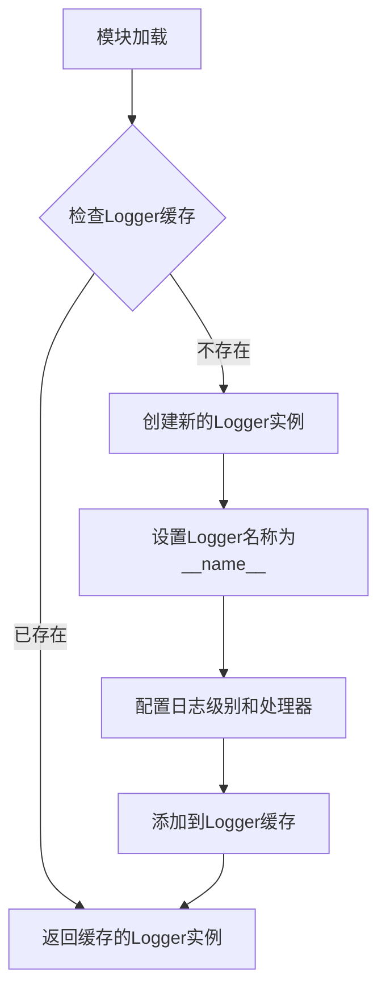

#### 带注释源码

```python
# 导入标准库的 logging 模块
import logging

# ... 其他导入 ...

# 获取当前模块的日志记录器
# __name__ 是 Python 内置变量，自动获取当前模块的完全限定名
# 例如：对于文件 kube_hunter/core/discovery/apiservice.py，__name__ 的值为
# 'kube_hunter.core.discovery.apiservice'
# 这使得日志可以追踪到具体的模块，便于问题定位和日志过滤
logger = logging.getLogger(__name__)
```

---

### 设计意图与约束

| 项目 | 说明 |
|------|------|
| **设计目标** | 实现模块级别的日志隔离，每个模块使用独立的 Logger 实例，便于按模块过滤日志和定位问题 |
| **约束条件** | `__name__` 必须正确反映模块路径，建议在包内使用相对导入以确保路径正确 |
| **日志级别** | 当前代码中主要使用 `logger.debug()` 进行调试信息输出，生产环境需配置合适的日志级别 |
| **线程安全** | `logging.getLogger()` 是线程安全的，内部实现了锁机制 |

### 技术债务与优化空间

1. **日志配置硬编码**：当前未显式配置日志级别和格式，建议通过配置文件统一管理
2. **异常日志冗余**：`exc_info=True` 参数在多处使用，可封装为工具函数减少重复代码
3. **Session 未复用**：`ApiServiceDiscovery` 和 `ApiServiceClassify` 各自创建 Session，可考虑提取为模块级共享 Session
4. **SSL 验证禁用**：`self.session.verify = False` 存在安全风险，生产环境应配置正确的证书


### `requests.Session()` - 创建HTTP会话用于API探测

`requests.Session()` 是 `requests` 库提供的函数，用于创建一个持久化的 HTTP 会话对象。在 kube-hunter 项目中，该会话被用于探测 Kubernetes API 服务的存在性以及进行服务分类操作。Session 对象允许跨请求保持连接池、Cookie 和配置，提供比单次请求更高效的网络通信能力。

参数：此函数为无参数构造函数。

返回值：`requests.Session`，返回一个会话对象实例，可用于发送 HTTP 请求。

#### 流程图

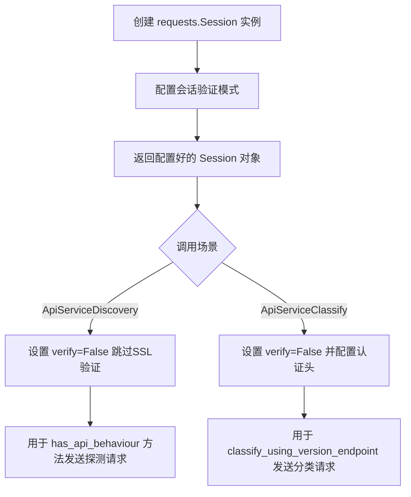

#### 带注释源码

```python
# requests.Session() 源码分析

# 1. 在 ApiServiceDiscovery 类中的使用
class ApiServiceDiscovery(Discovery):
    """API Service Discovery
    Checks for the existence of K8s API Services
    """

    def __init__(self, event):
        self.event = event
        # 创建 Session 对象用于维护持久连接
        # 避免每次请求都建立新的 TCP 连接，提高探测效率
        self.session = requests.Session()
        # 禁用 SSL 证书验证，因为探测目标可能是自签名证书或未配置 TLS 的内部服务
        self.session.verify = False

# 2. 在 ApiServiceClassify 类中的使用
class ApiServiceClassify(EventFilterBase):
    """API Service Classifier
    Classifies an API service
    """

    def __init__(self, event):
        self.event = event
        self.classified = False
        # 同样创建 Session 对象用于后续的版本探测请求
        self.session = requests.Session()
        self.session.verify = False
        # 使用认证令牌（如果可用），用于需要认证的 API 检查
        if self.event.auth_token:
            self.session.headers.update({"Authorization": f"Bearer {self.event.auth_token}"})

# Session 对象的核心方法调用
def has_api_behaviour(self, protocol):
    """使用 Session 发送探测请求"""
    try:
        # Session.get() 会复用连接池，提高性能
        r = self.session.get(
            f"{protocol}://{self.event.host}:{self.event.port}", 
            timeout=config.network_timeout
        )
        # 检查响应内容是否包含 Kubernetes API 特征
        if ("k8s" in r.text) or ('"code"' in r.text and r.status_code != 200):
            return True
    except requests.exceptions.SSLError:
        logger.debug(f"{[protocol]} protocol not accepted on {self.event.host}:{self.event.port}")
    except Exception:
        logger.debug(f"Failed probing {self.event.host}:{self.event.port}", exc_info=True)

def classify_using_version_endpoint(self):
    """使用 Session 访问 /version 端点进行服务分类"""
    try:
        endpoint = f"{self.event.protocol}://{self.event.host}:{self.event.port}/version"
        # 通过 Session 发送 GET 请求获取版本信息
        versions = self.session.get(endpoint, timeout=config.network_timeout).json()
        if "major" in versions:
            if versions.get("major") == "":
                self.event = MetricsServer()  # 无 major 版本号为 Metrics Server
            else:
                self.event = ApiServer()  # 有 major 版本号为 API Server
    except Exception:
        logging.warning("Could not access /version on API service", exc_info=True)
```

#### 关键组件信息

| 组件名称 | 一句话描述 |
|---------|-----------|
| `requests.Session` | HTTP 会话管理对象，支持连接池和持久化配置 |
| `session.verify = False` | 禁用 SSL 证书验证，允许探测自签名证书服务 |
| `session.headers` | 会话级别的 HTTP 请求头，可预置认证信息 |
| `session.get()` | 发起 GET 请求，复用底层 TCP 连接 |

#### 潜在的技术债务或优化空间

1. **SSL 验证禁用风险**：`session.verify = False` 存在安全风险，建议增加配置选项允许用户控制是否跳过验证
2. **超时配置硬编码**：超时值依赖全局 `config.network_timeout`，缺少针对不同场景的细粒度超时配置
3. **异常处理过于宽泛**：捕获 `Exception` 通用异常可能掩盖特定问题，建议分类处理不同异常类型
4. **连接复用未充分利用**：Session 对象在类中创建但未显式管理连接池生命周期
5. **缺乏重试机制**：网络请求失败时直接跳过，未实现指数退避重试逻辑


### `handler.subscribe(OpenPortEvent, predicate)`

该函数是kube-hunter事件处理系统的核心订阅方法，用于将`ApiServiceDiscovery`类注册为`OpenPortEvent`事件的处理器，并通过predicate过滤只处理已知Kubernetes API端口（443, 6443, 8080）的事件。

参数：

- `OpenPortEvent`：`Event`类型，订阅的目标事件类型，表示端口发现事件
- `predicate`：`Callable[[Event], bool]`类型的lambda函数，用于过滤事件，仅当事件的端口在`KNOWN_API_PORTS`列表中时才触发处理器

返回值：`Type[ApiServiceDiscovery]`，返回被装饰的类本身，完成订阅注册

#### 流程图

```mermaid
flowchart TD
    A[事件系统启动] --> B[调用handler.subscribe]
    B --> C[注册OpenPortEvent事件处理器]
    C --> D[设置predicate过滤条件: port in [443, 6443, 8080]]
    D --> E[返回ApiServiceDiscovery类]
    E --> F[当OpenPortEvent触发时]
    F --> G{predicate(x) = True?}
    G -->|是| H[实例化ApiServiceDiscovery]
    G -->|否| I[忽略该事件]
    H --> J[执行execute方法进行API服务发现]
```

#### 带注释源码

```python
# 导入事件处理器模块
from kube_hunter.core.events import handler

# 定义已知Kubernetes API端口列表
KNOWN_API_PORTS = [443, 6443, 8080]

# 使用handler.subscribe订阅OpenPortEvent事件
# predicate参数作为过滤条件，只有当事件的port属性在KNOWN_API_PORTS中时才触发
@handler.subscribe(OpenPortEvent, predicate=lambda x: x.port in KNOWN_API_PORTS)
class ApiServiceDiscovery(Discovery):
    """
    API Service Discovery
    检查是否存在K8s API服务
    """
    
    def __init__(self, event):
        self.event = event
        self.session = requests.Session()
        self.session.verify = False

    def execute(self):
        """执行API服务发现逻辑"""
        logger.debug(f"Attempting to discover an API service on {self.event.host}:{self.event.port}")
        protocols = ["http", "https"]
        for protocol in protocols:
            if self.has_api_behaviour(protocol):
                self.publish_event(K8sApiService(protocol))

    def has_api_behaviour(self, protocol):
        """检查指定协议下是否存在API行为特征"""
        try:
            r = self.session.get(f"{protocol}://{self.event.host}:{self.event.port}", timeout=config.network_timeout)
            # 检查响应中是否包含k8s关键字或包含code字段（HTTP状态码）
            if ("k8s" in r.text) or ('"code"' in r.text and r.status_code != 200):
                return True
        except requests.exceptions.SSLError:
            logger.debug(f"{[protocol]} protocol not accepted on {self.event.host}:{self.event.port}")
        except Exception:
            logger.debug(f"Failed probing {self.event.host}:{self.event.port}", exc_info=True)
```


### `handler.subscribe(K8sApiService)`

该函数是一个事件订阅装饰器，用于订阅 `K8sApiService` 事件并注册 `ApiServiceClassify` 类作为事件处理器，实现对 Kubernetes API 服务的分类（区分 Metrics Server 和 Api Server）。

参数：

- `K8sApiService`：`Type[Event]`，要订阅的事件类型，即 Kubernetes API 服务发现事件

返回值：`Callable`，返回被装饰的 `ApiServiceClassify` 类，用于处理 K8sApiService 事件

#### 流程图

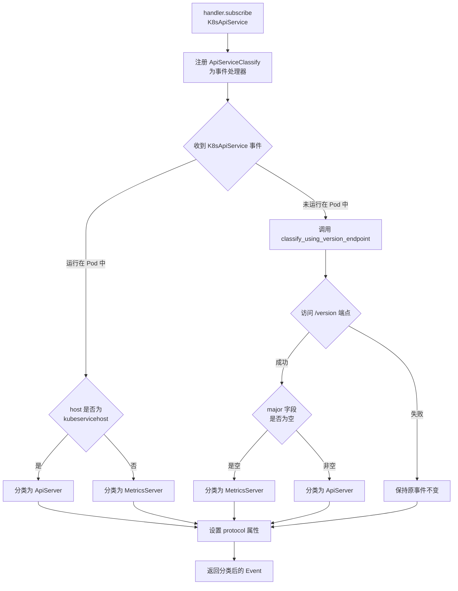

#### 带注释源码

```python
# 订阅 K8sApiService 事件，注册 ApiServiceClassify 作为处理器
@handler.subscribe(K8sApiService)
class ApiServiceClassify(EventFilterBase):
    """
    API Service Classifier
    对 API 服务进行分类（Metrics Server / Api Server）
    继承自 EventFilterBase，用作事件过滤器
    """
    
    def __init__(self, event):
        """
        初始化分类器
        
        参数：
        - event：K8sApiService 事件对象，包含发现的 API 服务信息
        """
        self.event = event
        self.classified = False  # 标记是否已分类
        self.session = requests.Session()  # 创建 HTTP 会话
        self.session.verify = False  # 禁用 SSL 验证
        
        # 如果存在认证 token，则添加到请求头
        if self.event.auth_token:
            self.session.headers.update({"Authorization": f"Bearer {self.event.auth_token}"})

    def classify_using_version_endpoint(self):
        """
        通过访问 /version 端点尝试分类服务
        - Api Server 响应包含 major 字段
        - Metrics Server 响应不包含 major 字段或 major 为空
        """
        try:
            # 构建 version 端点 URL
            endpoint = f"{self.event.protocol}://{self.event.host}:{self.event.port}/version"
            # 发送 GET 请求获取版本信息
            versions = self.session.get(endpoint, timeout=config.network_timeout).json()
            
            # 检查 major 字段是否存在
            if "major" in versions:
                if versions.get("major") == "":
                    # major 为空，分类为 Metrics Server
                    self.event = MetricsServer()
                else:
                    # major 存在且非空，分类为 Api Server
                    self.event = ApiServer()
        except Exception as e:
            # 访问失败时记录警告日志
            logging.warning("Could not access /version on API service", exc_info=True)

    def execute(self):
        """
        执行分类逻辑的主方法
        
        返回值：
        - Event：分类后的服务事件对象（ApiServer 或 MetricsServer 或原始事件）
        """
        discovered_protocol = self.event.protocol  # 记录原始协议
        
        # 判断是否运行在 Kubernetes Pod 中
        if self.event.kubeservicehost:
            # 运行在 Pod 中，可直接通过 kubeservicehost 判断
            if self.event.kubeservicehost == str(self.event.host):
                # host 与 kubeservicehost 相同，分类为 ApiServer
                self.event = ApiServer()
            else:
                # host 与 kubeservicehost 不同，分类为 MetricsServer
                self.event = MetricsServer()
        else:
            # 未运行在 Pod 中，通过 /version 端点分类
            self.classify_using_version_endpoint()

        # 无论如何都保留之前发现的协议
        self.event.protocol = discovered_protocol
        
        # 返回分类后的事件（可能被替换为新的 Service 事件）
        return self.event
```


### K8sApiService.__init__

该函数是 `K8sApiService` 类的构造函数，用于初始化一个 Kubernetes API 服务对象。它接受协议参数（默认为 "https"），设置服务名称为 "Unrecognized K8s API"，并保存协议类型供后续使用。

参数：

- `protocol`：`str`，协议类型，默认为 "https"，用于指定与 Kubernetes API 通信的协议（http 或 https）

返回值：`None`，无返回值（构造函数）

#### 流程图

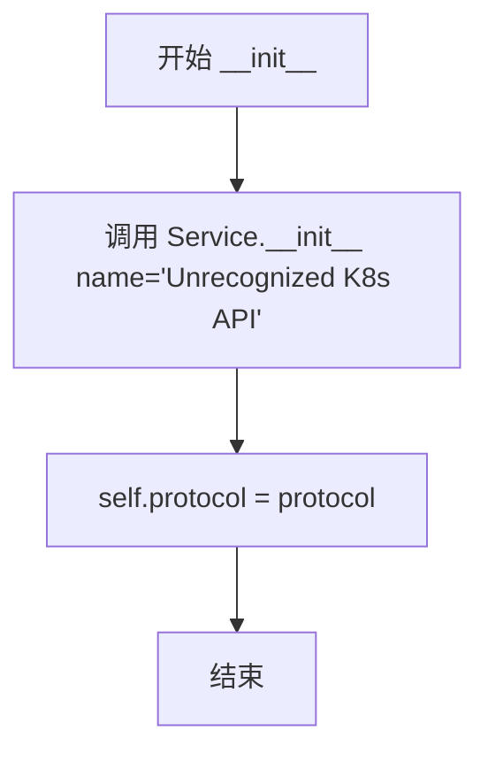

#### 带注释源码

```python
def __init__(self, protocol="https"):
    """
    初始化 K8s API 服务对象
    
    Args:
        protocol: 通信协议，默认为 "https"
    """
    # 调用父类 Service 的构造函数，初始化服务基础信息
    # 设置默认服务名称为 "Unrecognized K8s API"
    # 该名称可能会在后续的 ApiServiceClassify 中被更新为更具体的类型
    Service.__init__(self, name="Unrecognized K8s API")
    
    # 保存协议类型到实例变量，供后续发现和分类服务时使用
    # 例如在发送 HTTP 请求时会使用该协议
    self.protocol = protocol
```


### `ApiServer.__init__()`

初始化 ApiServer 服务对象，设置服务名称为 "API Server"，并默认使用 https 协议。

参数：

- `self`：`ApiServer` 类型，当前实例对象

返回值：`None`，无返回值（`__init__` 方法）

#### 流程图

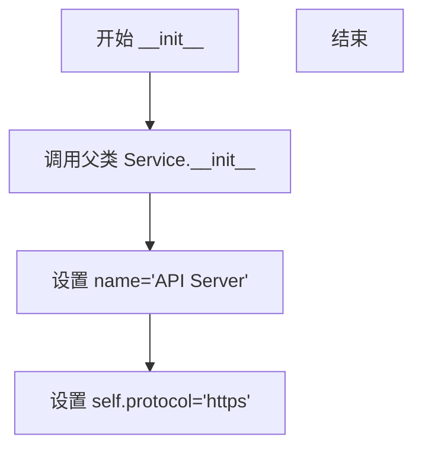

#### 带注释源码

```python
def __init__(self):
    """初始化 API 服务器服务"""
    # 调用父类 Service 的初始化方法，设置服务名称为 "API Server"
    Service.__init__(self, name="API Server")
    # 设置默认协议为 https
    self.protocol = "https"
```


### `MetricsServer.__init__`

初始化Metrics服务器服务，创建一个继承自Service和Event的MetricsServer实例，设置服务名称为"Metrics Server"并指定协议为HTTPS。

参数：
- 无（该方法不接受除self外的其他参数）

返回值：`None`，无返回值（Python初始化方法默认返回None）

#### 流程图

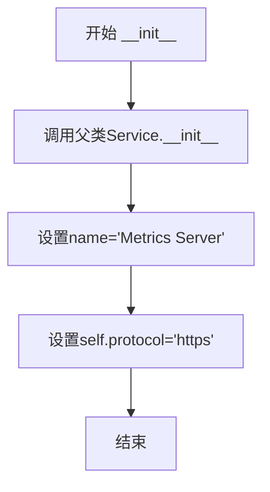

#### 带注释源码

```python
def __init__(self):
    """初始化Metrics服务器服务"""
    # 调用父类Service的初始化方法，设置服务名称为"Metrics Server"
    Service.__init__(self, name="Metrics Server")
    # 设置协议为HTTPS，用于安全的HTTPS通信
    self.protocol = "https"
```


### `ApiServiceDiscovery.__init__`

初始化 ApiServiceDiscovery 类，创建用于发现 Kubernetes API 服务的会话对象。

参数：

- `event`：`OpenPortEvent`，触发发现器的事件对象，包含目标主机的端口信息（host 和 port）

返回值：`None`，无返回值（`__init__` 方法自动返回 None）

#### 流程图

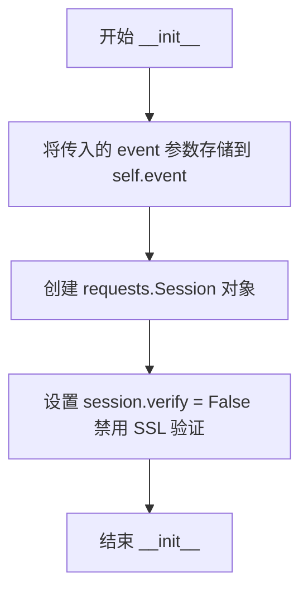

#### 带注释源码

```python
def __init__(self, event):
    """初始化发现器
    
    Args:
        event: OpenPortEvent 对象，包含目标主机的端口信息
    """
    # 将传入的事件对象存储为实例变量，供后续 execute() 方法使用
    self.event = event
    
    # 创建 requests.Session 对象用于 HTTP 请求
    # Session 对象可以复用 TCP 连接，提高性能
    self.session = requests.Session()
    
    # 禁用 SSL 证书验证
    # 这是因为在探测未知服务时，可能遇到自签名证书或无效证书
    # 避免因 SSL 验证失败而导致探测失败
    self.session.verify = False
```


### `ApiServiceDiscovery.execute()`

该方法执行 API 服务发现的主流程，遍历 HTTP 和 HTTPS 协议，通过向目标主机发送请求并检查响应内容是否包含 Kubernetes API 特征来判断是否为 Kubernetes API 服务，如确认则发布 K8sApiService 事件。

参数：

- `self`：隐式参数，类型为 `ApiServiceDiscovery` 实例，表示当前对象

返回值：`None`，无返回值，执行完成后即结束

#### 流程图

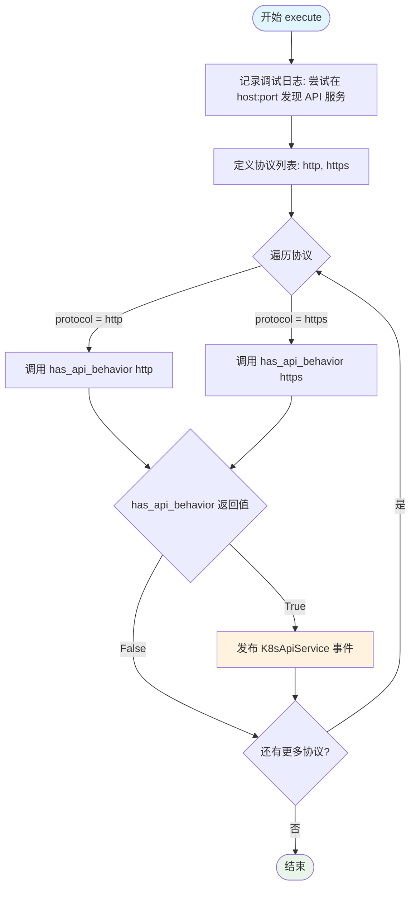

#### 带注释源码

```python
def execute(self):
    """执行 API 服务发现主流程
    
    遍历 HTTP 和 HTTPS 协议，尝试发现 Kubernetes API 服务，
    如发现则发布 K8sApiService 事件
    """
    # 记录调试日志，显示正在尝试发现 API 服务的主机和端口
    # self.event.host 和 self.event.port 来自 OpenPortEvent 事件
    logger.debug(f"Attempting to discover an API service on {self.event.host}:{self.event.port}")
    
    # 定义要尝试的协议列表，先尝试 HTTP，再尝试 HTTPS
    protocols = ["http", "https"]
    
    # 遍历每个协议进行检查
    for protocol in protocols:
        # 调用 has_api_behavior 方法检查该协议是否为 Kubernetes API
        # 如果返回 True 表示发现了 API 服务
        if self.has_api_behaviour(protocol):
            # 发布 K8sApiService 事件，通知其他组件发现了 API 服务
            # 传入 protocol 参数以便后续处理
            self.publish_event(K8sApiService(protocol))
```


### `ApiServiceDiscovery.has_api_behaviour`

该方法用于检测目标服务是否具有 Kubernetes API 行为特征，通过发送 HTTP/HTTPS 请求并分析响应内容来判断服务是否为 Kubernetes API。

#### 参数

- `protocol`：`str`，协议类型（"http" 或 "https"）

#### 返回值

`bool`，如果目标服务具有 Kubernetes API 行为特征返回 `True`，否则返回 `False`

#### 流程图

```mermaid
flowchart TD
    A[开始 has_api_behaviour] --> B[构建请求URL: protocol://host:port]
    B --> C[发起GET请求]
    C --> D{请求是否成功?}
    D -->|是| E{响应文本包含 'k8s'?}
    D -->|否| F{是否为SSL错误?}
    E -->|是| G[返回 True]
    E -->|否| H{响应包含 '"code' 且状态码 != 200?}
    H -->|是| G
    H -->|否| I[返回 False]
    F -->|是| J[记录调试日志]
    F -->|否| K[记录异常日志]
    J --> I
    K --> I
    I --> L[结束]
    G --> L
```

#### 带注释源码

```python
def has_api_behaviour(self, protocol):
    """
    检测给定协议下服务是否具有 Kubernetes API 行为特征
    
    参数:
        protocol: str, 协议类型 ("http" 或 "https")
    
    返回:
        bool: 如果具有 API 行为特征返回 True，否则返回 False
    """
    try:
        # 构建完整 URL 并发送 GET 请求
        # 使用类中维护的 session 发送请求，支持连接复用
        r = self.session.get(
            f"{protocol}://{self.event.host}:{self.event.port}", 
            timeout=config.network_timeout  # 使用配置的网络超时时间
        )
        
        # 检测方式1: 响应文本中包含 "k8s" 字符串
        # Kubernetes API 服务通常会在响应中包含 "kubernetes" 相关标识
        if ("k8s" in r.text) or (
            # 检测方式2: 响应包含 JSON 格式的 "code" 字段且 HTTP 状态码不是 200
            # Kubernetes API 在错误响应时会返回包含 "code" 字段的 JSON
            '"code"' in r.text and r.status_code != 200
        ):
            return True  # 满足任一条件则判定为 Kubernetes API
            
    except requests.exceptions.SSLError:
        # SSL 错误说明该协议不被接受（如 HTTPS 端口不接受 HTTPS 连接）
        logger.debug(
            f"{[protocol]} protocol not accepted on "
            f"{self.event.host}:{self.event.port}"
        )
    except Exception:
        # 其他所有异常（如连接超时、连接拒绝等）
        logger.debug(
            f"Failed probing {self.event.host}:{self.event.port}", 
            exc_info=True  # 记录完整堆栈信息用于调试
        )
    
    # 默认返回 False，未检测到 API 行为特征
    return False
```


### `ApiServiceClassify.__init__`

该方法用于初始化 API 服务分类器，创建 HTTP 会话并配置认证令牌。

参数：

- `event`：`K8sApiService`，待分类的 Kubernetes API 服务事件对象

返回值：`None`，`__init__` 方法不返回值

#### 流程图

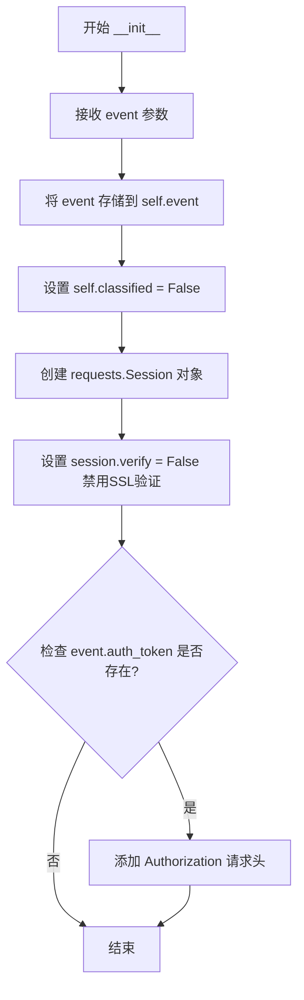

#### 带注释源码

```python
def __init__(self, event):
    """初始化 API 服务分类器
    
    Args:
        event: K8sApiService 类型的事件对象，包含待分类的 API 服务信息
    """
    # 保存传入的事件对象到实例变量，后续 execute 方法将使用此事件进行分类
    self.event = event
    
    # 初始化分类状态标志，默认为 False，表示尚未完成分类
    self.classified = False
    
    # 创建 HTTP 会话对象，用于后续向 API 服务发送 HTTP 请求进行分类判断
    self.session = requests.Session()
    
    # 禁用 SSL 证书验证，允许与自签名证书的 Kubernetes API 服务建立连接
    self.session.verify = False
    
    # 使用认证令牌（如果存在）用于需要认证的 API 端点访问
    # 常见场景：在 Pod 内运行时可以使用 ServiceAccount 的令牌进行身份验证
    if self.event.auth_token:
        self.session.headers.update({"Authorization": f"Bearer {self.event.auth_token}"})
```


### `ApiServiceClassify.classify_using_version_endpoint`

该方法通过访问 `/version` 端点来尝试对 Kubernetes API 服务进行分类。如果成功访问并获取版本信息，它会根据响应中 `major` 字段的值来判断是 API Server 还是 Metrics Server：如果 `major` 字段为空字符串，则判定为 Metrics Server，否则判定为 Api Server。如果访问失败，则记录警告日志并返回。

参数：
- 该方法无显式参数（仅包含 `self`）

返回值：`None`，该方法无返回值，但会修改 `self.event` 来更新服务类型

#### 流程图

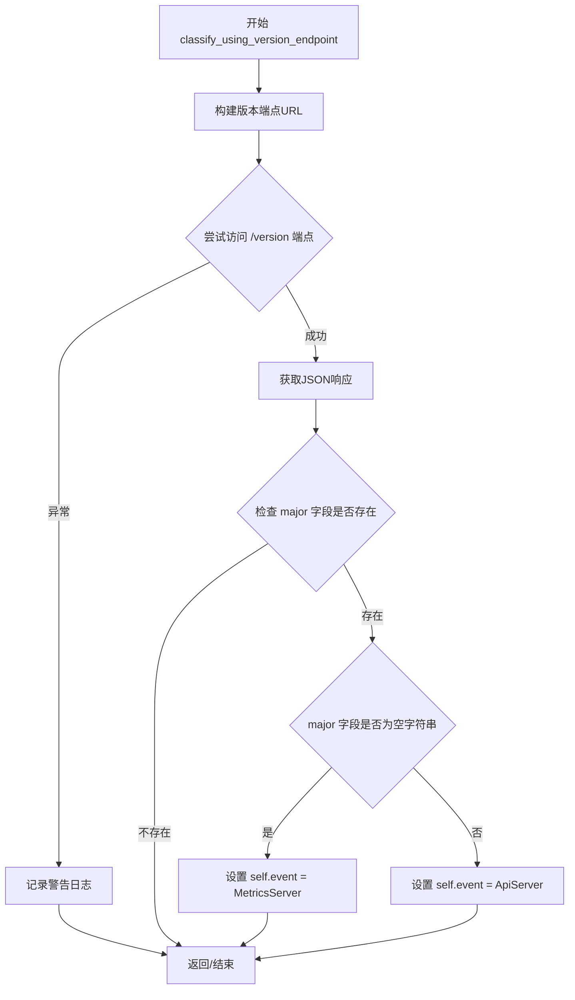

#### 带注释源码

```python
def classify_using_version_endpoint(self):
    """Tries to classify by accessing /version. if could not access succeded, returns"""
    # 尝试访问版本端点进行分类
    try:
        # 构建完整的版本端点URL，格式：{protocol}://{host}:{port}/version
        endpoint = f"{self.event.protocol}://{self.event.host}:{self.event.port}/version"
        
        # 发起GET请求获取版本信息，设置超时时间
        versions = self.session.get(endpoint, timeout=config.network_timeout).json()
        
        # 检查响应JSON中是否包含 major 字段
        if "major" in versions:
            # 如果 major 字段为空字符串，则为 Metrics Server
            if versions.get("major") == "":
                self.event = MetricsServer()
            # 否则为 Api Server
            else:
                self.event = ApiServer()
    except Exception:
        # 捕获所有异常，记录警告日志
        logging.warning("Could not access /version on API service", exc_info=True)
```


### `ApiServiceClassify.execute`

该方法用于对已发现的Kubernetes API服务进行分类，通过判断服务是否运行在Pod环境中或通过访问/version端点来区分ApiServer和MetricsServer，并返回最终分类的事件对象。

参数：

- `self`：`ApiServiceClassify`实例本身，包含事件、会话和分类标志等属性

返回值：`Event`，返回分类后的服务事件对象（ApiServer或MetricsServer实例）

#### 流程图

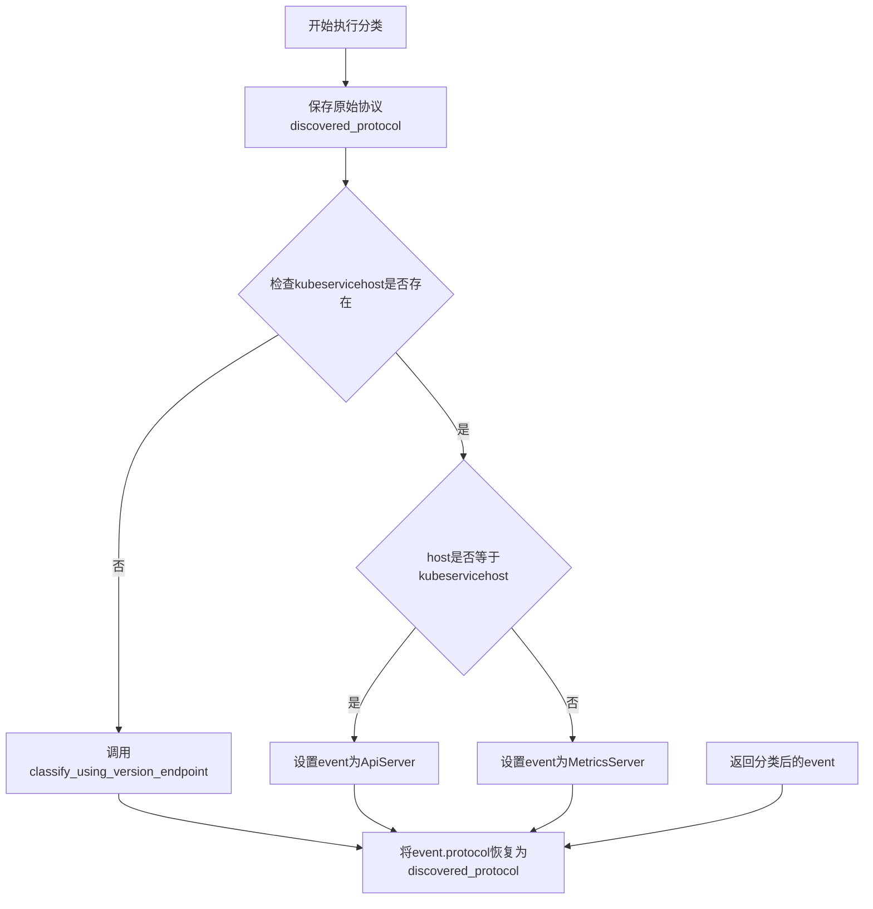

#### 带注释源码

```python
def execute(self):
    """执行分类逻辑并返回最终分类后的服务事件"""
    # 步骤1：保存原始发现的协议（http/https）
    discovered_protocol = self.event.protocol
    
    # 步骤2：判断是否以Pod形式运行
    if self.event.kubeservicehost:
        # 如果运行在Pod内，可以通过kubeservicehost判断服务类型
        # 情况1：host等于kubeservicehost，说明是API Server
        if self.event.kubeservicehost == str(self.event.host):
            self.event = ApiServer()
        # 情况2：host不等于kubeservicehost，说明是Metrics Server
        else:
            self.event = MetricsServer()
    # 步骤3：如果不是以Pod形式运行，则通过/version端点判断
    else:
        self.classify_using_version_endpoint()

    # 步骤4：恢复原始协议，确保分类后的服务保留原始协议信息
    self.event.protocol = discovered_protocol
    
    # 步骤5：返回分类后的事件对象
    # 此时event已被替换为具体的ApiServer或MetricsServer实例
    return self.event
```

## 关键组件


### K8sApiService

表示一个未分类的Kubernetes API服务，继承自Service和Event基类，用于在服务发现阶段封装检测到的API服务信息。

### ApiServer

表示已识别的Kubernetes API Server服务，继承自Service和Event，用于分类后的API服务器标识。

### MetricsServer

表示已识别的Kubernetes Metrics Server服务，继承自Service和Event，用于分类后的指标服务器标识。

### ApiServiceDiscovery

API服务发现类，负责发现Kubernetes API服务。订阅OpenPortEvent事件，遍历http/https协议尝试发现API服务，通过检查响应中是否包含"k8s"字符串或"code"字段来判断是否为Kubernetes API。

### ApiServiceClassify

API服务分类器，负责将发现的API服务分类为ApiServer或MetricsServer。订阅K8sApiService事件，根据运行环境（是否作为Pod运行）和/version端点的响应进行分类判断。

### KNOWN_API_PORTS

全局常量列表，定义了已知的Kubernetes API端口[443, 6443, 8080]，用于过滤待检测的端口。

### has_api_behaviour方法

用于判断服务是否具有Kubernetes API行为。向目标服务发送HTTP请求，检查响应文本中是否包含"k8s"或包含"code"字段且状态码不为200。

### classify_using_version_endpoint方法

通过访问/version端点来分类服务类型。如果响应JSON中包含"major"字段且值为空字符串，则判定为MetricsServer，否则判定为ApiServer。

### execute方法

ApiServiceClassify的执行入口，根据运行环境（Pod内或Pod外）采用不同策略分类服务，并确保保留原始发现的协议信息。


## 问题及建议


### 已知问题

-   **异常处理不当**：使用空`except Exception`块捕获所有异常并仅记录日志，可能隐藏真实错误；`SSLError`被单独捕获但未进行重试或降级处理
-   **SSL验证被禁用**：`self.session.verify = False`禁用了SSL证书验证，存在中间人攻击安全风险
-   **API行为检测逻辑脆弱**：`has_api_behaviour`方法中通过简单的字符串包含判断`"k8s"`和`"\"code\""`来识别API服务，容易产生误报
-   **日志记录不一致**：混用`logger.debug`和`logging.warning`，且异常信息可能泄露敏感主机信息
-   **类继承设计混乱**：`ApiServer`等类同时继承`Service`和`Event`，可能导致菱形继承问题；`ApiServer.__init__`中硬编码`protocol="https"`但之后又被覆盖
-   **事件对象状态修改**：`execute`方法中直接修改`self.event`对象而非返回新实例，破坏了事件流的不变性
-   **版本分类逻辑缺陷**：`classify_using_version_endpoint`中通过判断`versions.get("major") == ""`来区分Metrics Server和Api Server，该逻辑过于简单且不可靠
-   **缺少资源清理**：未实现`__del__`或上下文管理器来关闭`requests.Session`，可能导致连接泄漏

### 优化建议

-   **增强异常处理**：为不同类型的网络异常（超时、连接拒绝、SSL错误等）分别处理，实现重试机制和降级策略
-   **启用SSL验证**：移除`session.verify = False`，或使用自定义CA证书进行验证
-   **改进API识别逻辑**：使用更可靠的API发现方式，如检查特定的API路径、响应头或使用Kubernetes客户端库
-   **统一日志规范**：使用统一的日志级别，对敏感信息进行脱敏处理
-   **重构类继承结构**：使用组合代替多重继承，或通过接口明确职责
-   **实现不可变事件**：在分类器中创建新事件对象而非修改原对象，保持事件流的一致性
-   **改进版本分类**：结合多个端点（如`/metrics`、`/api/v1`）和响应特征进行更准确的分类
-   **添加资源管理**：实现上下文管理器或显式关闭会话，确保连接资源正确释放
-   **提取配置**：将`KNOWN_API_PORTS`等配置项移至配置文件，支持动态配置


## 其它


### 设计目标与约束

本模块的设计目标是实现对Kubernetes集群API服务的自动发现与分类，支持在容器化环境（Pod内）和非容器化环境下识别API Server和Metrics Server。约束条件包括：仅检测已知端口（443、6443、8080）、依赖网络请求库requests、不验证SSL证书、仅通过HTTP响应特征判断服务类型。

### 错误处理与异常设计

异常处理采用分级策略：网络请求层面的SSLError单独捕获并记录debug级别日志，其他异常统一捕获并记录exc_info=True的详细堆栈信息。分类失败时保留原始K8sApiService事件，确保下游处理不会因分类失败而中断。版本端点访问失败时仅记录warning，不影响服务发现流程。

### 数据流与状态机

数据流分为两个阶段：第一阶段ApiServiceDiscovery接收OpenPortEvent，遍历http/https协议尝试发现API服务，检测到响应包含"k8s"字符串或包含"code"字段时发布K8sApiService事件；第二阶段ApiServiceClassify接收K8sApiService，根据运行上下文（是否在Pod内）执行分类逻辑，在Pod内通过kubeservicehost比较直接分类，非Pod内通过访问/version端点根据major字段判断，最终将事件替换为ApiServer或MetricsServer。

### 外部依赖与接口契约

依赖外部模块包括：kube_hunter.core.events.handler（事件订阅发布机制）、kube_hunter.core.types.Discovery（发现器基类）、kube_hunter.core.events.types（事件类型定义）、kube_hunter.conf.config（配置对象，提供network_timeout参数）。输入契约要求OpenPortEvent包含host、port字段，K8sApiService包含protocol、host、port、auth_token、kubeservicehost字段。输出契约为分类后的Service子类事件（ApiServer或MetricsServer），保留原始protocol属性。

### 并发与线程安全考虑

每个类实例创建独立的requests.Session对象，无共享状态。事件处理为同步阻塞模式，不涉及多线程并发。Session对象verify=False的设置存在安全风险，但为匹配kube-hunter项目整体设计。

### 配置与可扩展性

KNOWN_API_PORTS列表硬编码，可考虑提取为配置项。分类逻辑目前仅支持ApiServer和MetricsServer，扩展新的服务类型需修改ApiServiceClassify.execute方法。has_api_behaviour的检测逻辑可通过插件机制扩展判断条件。

### 日志与可观测性

日志采用Python标准logging模块，debug级别记录探测尝试和失败原因，warning级别记录分类失败。日志信息包含目标主机、端口、协议等上下文，便于安全审计和问题排查。建议增加结构化日志或指标采集以便运维监控。

    