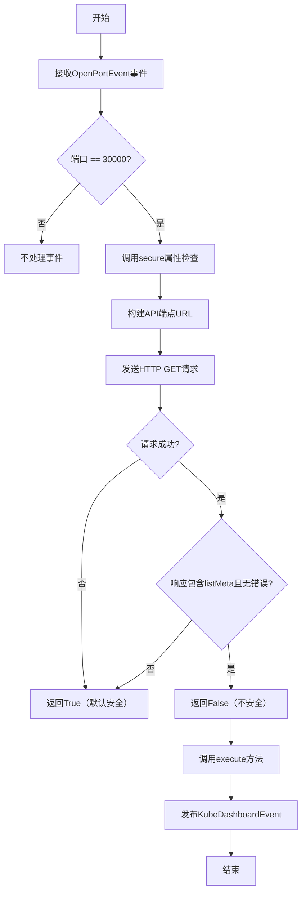
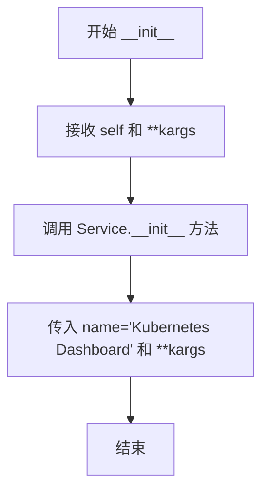
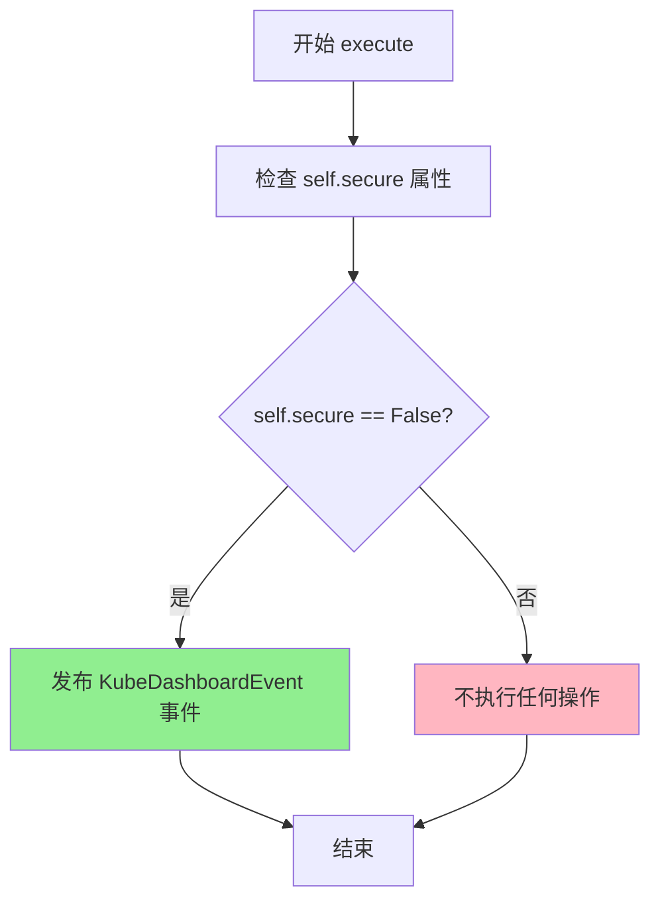

# `kubehunter\kube_hunter\modules\discovery\dashboard.py` 详细设计文档

该代码实现了一个Kubernetes Dashboard服务发现插件，通过检测端口30000上的服务，尝试访问Dashboard的API端点来判断服务是否安全（需要认证），并在发现不安全的服务时发布KubeDashboardEvent事件。

## 整体流程



## 类结构

```
Event (基类)
├── Service (服务事件基类)
│   └── KubeDashboardEvent
└── Discovery (发现基类)
    └── KubeDashboard
```

## 全局变量及字段


### `logger`
    
模块级日志记录器，用于记录调试和错误信息

类型：`logging.Logger`
    


### `config`
    
从kube_hunter.conf导入的配置对象，包含网络超时等设置

类型：`object`
    


### `handler`
    
事件处理器对象，用于订阅事件和发布事件

类型：`EventHandler`
    


### `KubeDashboard.event`
    
传入的事件对象，包含目标主机的端口信息，用于发现Kubernetes Dashboard

类型：`OpenPortEvent`
    
    

## 全局函数及方法


### `KubeDashboardEvent.__init__`

该方法是 `KubeDashboardEvent` 类的构造函数，用于初始化 Kubernetes Dashboard 服务事件对象。它继承自 `Service` 和 `Event` 类，通过调用父类 `Service` 的初始化方法来设置服务名称为 "Kubernetes Dashboard"，并传递任意关键字参数。

参数：

- `self`：`KubeDashboardEvent`，类的实例对象
- `**kargs`：`dict`，可变关键字参数，用于传递额外的配置参数

返回值：`None`，构造函数不返回任何值

#### 流程图



#### 带注释源码

```python
def __init__(self, **kargs):
    """
    初始化 KubeDashboardEvent 对象
    
    参数:
        **kargs: 可变关键字参数，会传递给父类 Service 的构造函数
                用于配置额外的服务属性
    
    返回:
        None: 构造函数不返回值，仅初始化对象状态
    """
    # 调用父类 Service 的构造函数，传入服务名称为 "Kubernetes Dashboard"
    # 并将所有关键字参数传递下去
    Service.__init__(self, name="Kubernetes Dashboard", **kargs)
```


### `KubeDashboard.secure`

该属性方法用于检测 Kubernetes Dashboard 是否处于安全状态（即是否不需要发布事件）。通过向 Dashboard 的 API 端点发送 HTTP 请求，检查响应中是否包含 "listMeta" 且 errors 数组为空，如果满足条件则返回 False（表示不安全/需要发布事件），否则返回 True（表示安全）。

参数：
- 无参数（该方法为属性方法，使用 `@property` 装饰器）

返回值：`bool`，返回 True 表示 Dashboard 是安全的（不需要发布事件），返回 False 表示 Dashboard 不安全（需要发布 KubeDashboardEvent）

#### 流程图

```mermaid
flowchart TD
    A[开始检查 secure 属性] --> B[构建 endpoint URL: http://{host}:{port}/api/v1/service/default]
    B --> C[发送 GET 请求到 endpoint]
    C --> D{请求是否成功?}
    D -->|是| E{响应中是否包含 'listMeta' 且 errors 长度为 0?}
    D -->|否/超时| F[记录调试日志]
    F --> G[返回 True - 默认认为安全]
    E -->|是| H[返回 False - Dashboard 不安全]
    E -->|否| G
```

#### 带注释源码

```python
@property
def secure(self):
    """检查 Kubernetes Dashboard 是否处于安全状态
    
    通过访问 Dashboard 的 API 端点来判断其安全性。
    如果 API 返回有效的服务列表（包含 listMeta 且无错误），
    则认为 Dashboard 不安全（未授权访问），返回 False。
    否则返回 True。
    
    返回:
        bool: True 表示安全（不需要发布事件），False 表示不安全
    """
    # 构建 Dashboard API 端点 URL，使用事件中的主机和端口
    endpoint = f"http://{self.event.host}:{self.event.port}/api/v1/service/default"
    
    # 记录调试信息，表明正在尝试发现用于访问 dashboard 的 API 服务器
    logger.debug("Attempting to discover an Api server to access dashboard")
    
    try:
        # 发送 HTTP GET 请求到 Dashboard API 端点
        # 使用配置的网络超时时间
        r = requests.get(endpoint, timeout=config.network_timeout)
        
        # 检查响应文本中是否包含 "listMeta" 关键字
        # 并且解析 JSON 响应，检查 errors 数组是否为空
        # 如果都满足，说明 Dashboard 可访问且返回了有效数据
        if "listMeta" in r.text and len(json.loads(r.text)["errors"]) == 0:
            # Dashboard 不安全，返回 False 以触发事件发布
            return False
    except requests.Timeout:
        # 处理请求超时异常，记录错误信息
        logger.debug(f"failed getting {endpoint}", exc_info=True)
    
    # 默认返回 True，认为 Dashboard 是安全的
    # 包括：请求失败、响应不符合条件、或其他异常情况
    return True
```


### `KubeDashboard.execute`

该方法用于执行 Kubernetes Dashboard 的发现逻辑，通过检查 Dashboard 是否安全（即是否可访问）来决定是否发布 `KubeDashboardEvent` 事件。

参数：
- 无（仅包含隐式参数 `self`）

返回值：`None`，无返回值（该方法通过发布事件产生副作用）

#### 流程图



#### 带注释源码

```python
def execute(self):
    """执行 Dashboard 发现逻辑
    
    该方法检查 Dashboard 是否不安全，如果不稳定则发布事件
    """
    # 检查 secure 属性，如果返回 False（不安全），则发布事件
    if not self.secure:
        # 发布 KubeDashboardEvent 事件，通知系统发现了不安全的 Dashboard
        self.publish_event(KubeDashboardEvent())
```

## 关键组件


### KubeDashboardEvent

Kubernetes Dashboard服务事件类，继承自Service和Event，用于表示发现的Kubernetes Dashboard服务，包含服务名称等信息。

### KubeDashboard

Kubernetes Dashboard发现器类，继承自Discovery，通过订阅30000端口的OpenPortEvent事件来发现Dashboard服务，并检查其是否安全（是否需要认证）。

### secure属性

安全检查属性，通过HTTP请求访问Dashboard的API端点，解析返回的JSON响应，判断是否存在未授权访问漏洞。如果返回内容包含"listMeta"且errors为空，则表示不安全（可访问）。

### execute方法

执行发现方法，判断Dashboard是否安全，如果不安全则发布KubeDashboardEvent事件，通知系统发现了可访问的Dashboard服务。


## 问题及建议


### 已知问题

-   **异常处理不完整**：`secure` 属性仅捕获 `requests.Timeout` 异常，未处理其他网络异常（如 `requests.ConnectionError`、`requests.RequestException`）和JSON解析异常（`json.loads` 可能抛出 `JSONDecodeError`）
-   **安全检测逻辑可能不准确**：通过检查 `/api/v1/service/default` 端点响应中是否包含 `"listMeta"` 且无 errors 字段来判断安全性，这种检测方式可能产生误判，该端点不一定能准确反映Dashboard的认证状态
-   **硬编码配置**：端口号 `30000` 和API路径 `/api/v1/service/default` 硬编码在代码中，缺乏灵活性
-   **使用HTTP而非HTTPS**：直接使用 `http://` 协议，在生产环境中可能存在安全隐患
-   **注释与实际功能不符**：类文档注释写的是"Checks for the existence of a Dashboard"，但实际是检测Dashboard是否安全（是否需要认证）

### 优化建议

-   扩大异常捕获范围，使用 `requests.RequestException` 捕获所有请求相关异常，并添加JSON解析的异常处理
-   重新评估安全检测逻辑，考虑更可靠的Dashboard安全状态检测方法，或添加多个检测点提高准确性
-   将端口和路径提取为配置参数，通过 `config` 对象注入，提高可维护性
-   考虑支持 HTTPS 端点检测，或在配置中指定协议
-   修正文档注释，使其准确描述功能
-   添加重试机制以处理临时性网络故障
-   增加更详细的日志记录，包括响应状态码和部分响应内容，便于问题排查

## 其它


### 设计目标与约束

**设计目标**：
- 自动发现运行在端口30000的Kubernetes Dashboard服务
- 判断Dashboard是否处于安全模式（即是否需要认证）
- 通过HTTP请求探测Dashboard的API端点来验证其安全性

**约束条件**：
- 依赖OpenPortEvent事件触发，仅处理端口30000的端口事件
- 需要网络连接才能进行安全检测
- 使用同步HTTP请求，存在一定的阻塞时间（由network_timeout控制）

### 错误处理与异常设计

**异常处理策略**：
- **requests.Timeout**: 记录调试日志，返回True（默认认为不安全）
- **requests.RequestException**: 捕获所有请求异常，记录调试日志并返回True
- **json.JSONDecodeError**: 虽然代码中使用了json.loads，但未显式处理JSON解析异常，可能导致未捕获异常

**错误传播机制**：
- 安全检查失败时默认返回True（认为不安全），确保不会漏报
- 只有明确检测到不安全状态时才发布KubeDashboardEvent事件

### 数据流与状态机

**数据流**：
```
OpenPortEvent (port=30000)
    ↓
KubeDashboard类订阅
    ↓
execute()方法调用
    ↓
secure属性检查
    ↓
HTTP GET请求到/api/v1/service/default
    ↓
解析JSON响应，检查errors字段
    ↓
判断返回False（不安全）→ 发布KubeDashboardEvent
    ↓
返回True（安全）→ 不发布事件
```

**状态转换**：
- Initial → Discovering → (Secure/Insecure) → Event Published/Terminated

### 外部依赖与接口契约

**外部依赖**：
- `requests`: HTTP客户端库，用于API调用
- `kube_hunter.conf.config`: 全局配置对象，提供network_timeout配置
- `kube_hunter.core.events.handler`: 事件订阅和发布机制
- `kube_hunter.core.events.types`: Event和Service基类
- `kube_hunter.core.types.Discovery`: 发现器基类

**接口契约**：
- 订阅OpenPortEvent，端口必须为30000
- execute()方法无返回值，通过publish_event()发布发现结果
- secure属性返回布尔值，False表示不安全，True表示安全

### 性能考虑

- HTTP请求使用config.network_timeout控制超时时间
- 每次发现都会发起HTTP请求，可能增加网络延迟
- 未实现缓存机制，重复检测相同端点会重复发起请求

### 安全性考虑

- 使用HTTP而非HTTPS，可能存在中间人攻击风险
- 未实现身份验证机制
- 端点URL固定，可能被攻击者伪造响应

### 配置管理

- 依赖全局config对象中的network_timeout参数
- 硬编码端口30000和API路径/api/v1/service/default
- 硬编码检查逻辑中的"listMeta"和"errors"字段

### 测试策略建议

- 单元测试：模拟OpenPortEvent，验证secure属性的不同返回值
- 集成测试：测试实际的HTTP请求响应解析
- 异常测试：模拟超时、网络错误、JSON解析错误等场景

### 部署注意事项

- 需要确保网络访问权限以检测Dashboard
- 需要安装requests库依赖
- 应与kube-hunter其他组件配合使用

    