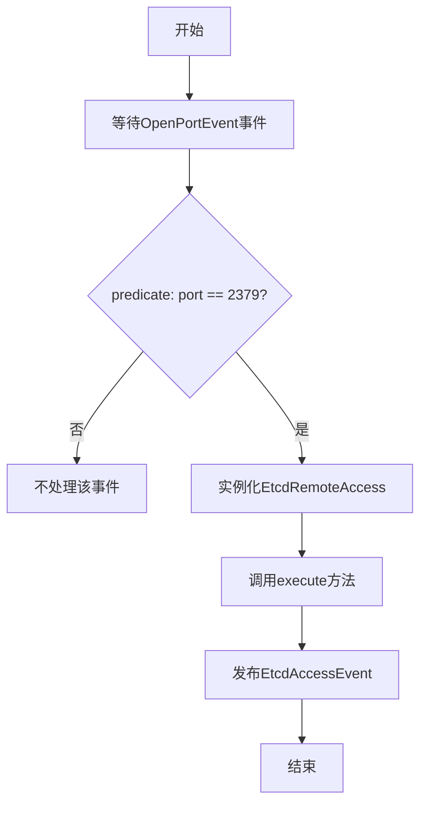
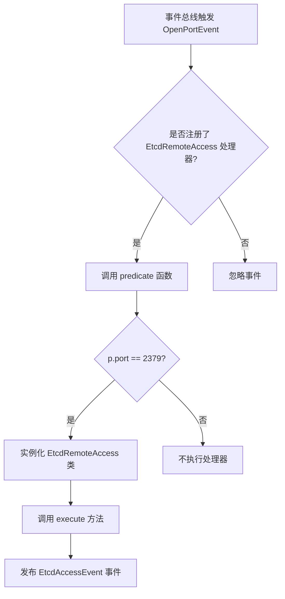
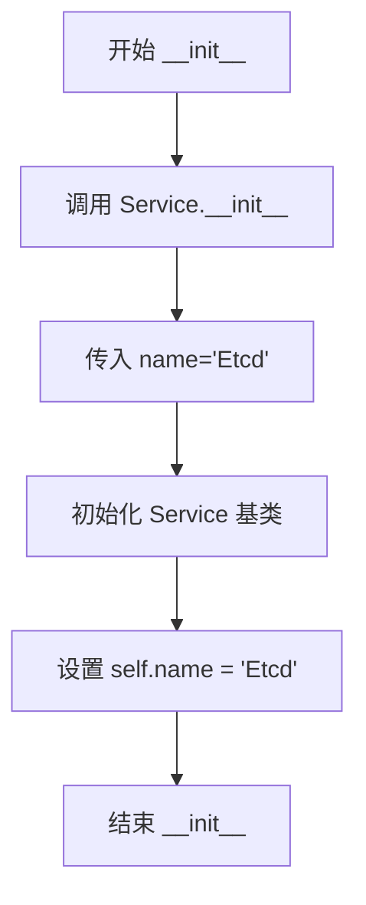
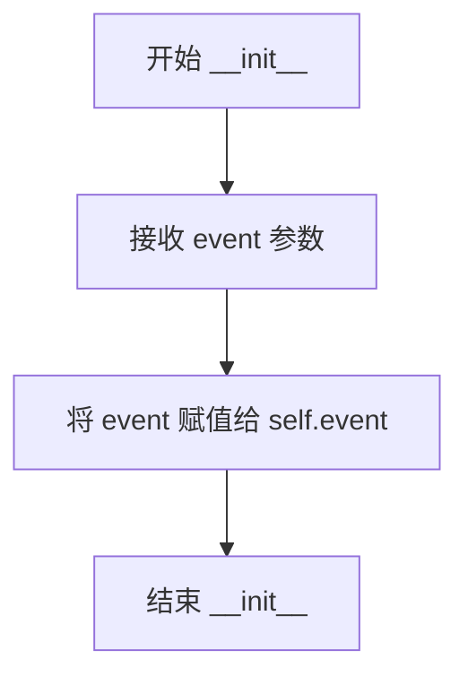
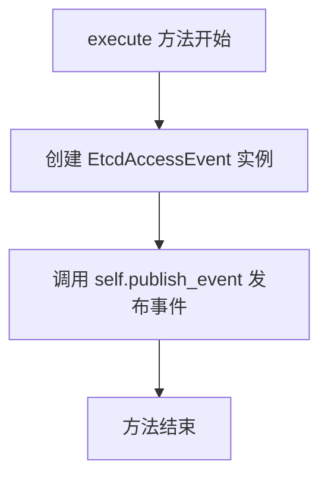
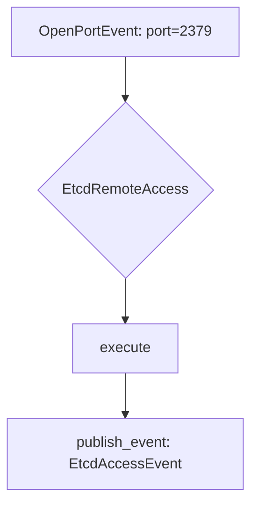

# `kubehunter\kube_hunter\modules\discovery\etcd.py` 详细设计文档

这是一个kube-hunter插件模块，用于发现Kubernetes集群中暴露的Etcd服务。该模块通过订阅2379端口（Etcd默认端口）的OpenPortEvent事件，检测Etcd服务的存在性，并在发现时发布EtcdAccessEvent事件，以供后续的安全漏洞检测和分析。

## 整体流程



## 类结构

```
Event (基类)
├── Service (继承自Event)
│   └── EtcdAccessEvent
└── Discovery (基类)
    └── EtcdRemoteAccess
```

## 全局变量及字段


### `handler`
    
事件处理器实例，用于订阅和发布事件

类型：`EventHandler`
    


### `Event`
    
事件基类，定义事件的通用接口和属性

类型：`class`
    


### `OpenPortEvent`
    
开放端口事件类，表示检测到开放端口的事件

类型：`class`
    


### `Service`
    
服务事件类，表示发现的服务

类型：`class`
    


### `Discovery`
    
发现者基类，用于实现各种发现逻辑的基类

类型：`class`
    


### `EtcdAccessEvent.name`
    
服务名称，初始化为'Etcd'

类型：`str`
    


### `EtcdRemoteAccess.event`
    
触发发现的端口事件对象

类型：`OpenPortEvent`
    
    

## 全局函数及方法


### `handler.subscribe`

事件订阅装饰器，用于注册 `OpenPortEvent` 事件处理器，并通过 `predicate` 参数过滤仅处理端口为 2379 的事件。

参数：

- `event_class`：`Type[Event]`（具体为 `OpenPortEvent`），要订阅的事件类型
- `predicate`：`Callable[[OpenPortEvent], bool]`，可选的过滤函数，用于筛选符合条件的事件

返回值：无返回值，返回装饰器函数

#### 流程图



#### 带注释源码

```python
# 导入事件处理器模块
from kube_hunter.core.events import handler
# 导入事件类型：Event 基类、OpenPortEvent（开放端口事件）、Service（服务事件）
from kube_hunter.core.events.types import Event, OpenPortEvent, Service
# 导入发现类型基类
from kube_hunter.core.types import Discovery


class EtcdAccessEvent(Service, Event):
    """Etcd 访问事件，表示发现了 etcd 服务"""
    
    def __init__(self):
        # 初始化服务名称为 Etcd
        Service.__init__(self, name="Etcd")


# 使用装饰器订阅 OpenPortEvent 事件
# predicate 参数：lambda 表达式作为过滤条件，只处理端口为 2379 的事件
@handler.subscribe(OpenPortEvent, predicate=lambda p: p.port == 2379)
class EtcdRemoteAccess(Discovery):
    """Etcd 远程访问发现器
    检查 etcd 服务的存在性
    """
    
    def __init__(self, event):
        # 存储传入的事件对象（包含端口信息）
        self.event = event
    
    def execute(self):
        # 当端口为 2379 时，发布 EtcdAccessEvent 事件
        self.publish_event(EtcdAccessEvent())
```


### `EtcdAccessEvent.__init__`

该方法是 EtcdAccessEvent 类的构造函数，负责初始化继承自 Service 的 Etcd 服务信息，将服务名称设置为 "Etcd"。

参数：

- 无显式参数（self 为隐式参数）

返回值：`None`，无返回值描述

#### 流程图



#### 带注释源码

```python
def __init__(self):
    """初始化 EtcdAccessEvent 实例
    
    该方法继承自 Service 类,用于标识发现的是 Etcd 服务
    Etcd 是用于存储集群配置和状态信息的数据库
    """
    Service.__init__(self, name="Etcd")  # 调用父类 Service 的初始化方法,并将服务名称设置为 "Etcd"
```


### `EtcdRemoteAccess.__init__`

这是 EtcdRemoteAccess 类的初始化方法，用于接收并存储触发该发现插件的外部事件对象，建立插件与事件处理框架的连接。

参数：

- `event`：`Event`，触发此发现插件的事件对象，具体为满足条件的 `OpenPortEvent`（端口为 2379）

返回值：`None`，构造方法不返回值，仅用于初始化实例状态

#### 流程图



#### 带注释源码

```python
def __init__(self, event):
    """
    初始化 EtcdRemoteAccess 实例
    
    参数:
        event: 触发此发现插件的事件对象,应为满足 predicate 条件的 OpenPortEvent
               (即端口为 2379 的开放端口事件)
    """
    self.event = event  # 将传入的事件对象存储为实例属性,供 execute 方法使用
```


### `EtcdRemoteAccess.execute`

执行发现逻辑，发布EtcdAccessEvent事件，用于标识发现了Etcd服务。

参数：

- 该方法无显式参数（`self` 为实例引用）

返回值：`None`，无返回值，该方法通过发布事件来传递结果

#### 流程图



#### 带注释源码

```python
def execute(self):
    """执行发现逻辑，发布 EtcdAccessEvent 事件"""
    # 创建 EtcdAccessEvent 事件实例并发布
    # 该事件标识在目标系统中发现了 Etcd 服务
    self.publish_event(EtcdAccessEvent())
```

## 关键组件


### EtcdAccessEvent

EtcdAccessEvent是一个事件类，继承自Service和Event，用于表示Etcd服务的存在和可访问性。

**类字段**:
- name: str - 服务名称，值为"Etcd"

**类方法**:
- __init__(self): 初始化EtcdAccessEvent实例，设置服务名称为"Etcd"

### EtcdRemoteAccess

EtcdRemoteAccess是一个发现类，通过订阅OpenPortEvent来检测2379端口（Etcd默认端口）是否开放，从而发现集群中的Etcd服务。

**类字段**:
- event: OpenPortEvent - 接收的OpenPortEvent事件对象

**类方法**:
- __init__(self, event): 构造函数，接收OpenPortEvent事件
- execute(self): 执行发现逻辑，发布EtcdAccessEvent事件

**mermaid流程图**:


**带注释源码**:
```python
@handler.subscribe(OpenPortEvent, predicate=lambda p: p.port == 2379)
class EtcdRemoteAccess(Discovery):
    """Etcd service
    check for the existence of etcd service
    """

    def __init__(self, event):
        self.event = event

    def execute(self):
        self.publish_event(EtcdAccessEvent())
```

### predicate过滤逻辑

predicate是一个lambda函数，用于过滤OpenPortEvent事件，只处理端口为2379的事件，这是Etcd服务的默认端口。

**全局变量/函数**:
- predicate: Callable - lambda函数，过滤条件为port == 2379

### Event/Service继承体系

代码使用了kube-hunter的事件驱动架构，通过继承Event和Service类来创建自定义事件类型。

**全局变量/函数**:
- Event: class - 基础事件类
- Service: class - 服务事件基类，继承自Event
- handler: object - 事件处理器，负责订阅和发布事件
- Discovery: class - 发现插件基类

### 关键组件信息

1. **EtcdAccessEvent** - Etcd服务事件，表示发现Etcd服务
2. **EtcdRemoteAccess** - Etcd服务发现类，检测2379端口
3. **Event/Service体系** - 事件驱动架构的基础类
4. **handler** - 事件订阅和发布的装饰器

### 潜在的技术债务或优化空间

1. **缺乏认证检查** - 当前只检测Etcd服务是否存在，未检查是否启用了认证
2. **缺乏详细枚举** - 未枚举Etcd中存储的具体数据（如secret、configmap）
3. **错误处理缺失** - execute方法未包含异常处理逻辑
4. **硬编码端口** - 2379端口硬编码在lambda中，可配置化

### 设计目标与约束

- **设计目标**: 发现Kubernetes集群中未受保护的Etcd服务
- **约束**: 仅检测2379端口的开放情况

### 错误处理与异常设计

- 当前代码未包含try-except块，依赖上层框架处理异常

### 数据流与状态机

- OpenPortEvent → predicate过滤 → EtcdRemoteAccess.execute() → EtcdAccessEvent

### 外部依赖与接口契约

- 依赖kube-hunter核心框架
- 订阅OpenPortEvent，发布EtcdAccessEvent


## 问题及建议


### 已知问题

-   **单一端口检测**：只检测2379端口，etcd可能同时监听2380等其它端口，导致漏检
-   **缺少错误处理**：`execute`方法中没有try-except捕获异常，如果`publish_event`失败会导致整个检测流程中断
-   **未使用Event基类**：继承`Event`但未使用其特性，代码可读性较低
-   **无类型提示**：参数和返回值缺少类型注解，影响代码可维护性和IDE支持
-   **lambda predicate可读性差**：内联lambda函数缺少文档注释，未来难以理解和维护

### 优化建议

-   **扩展端口检测**：将端口号参数化，支持检测2379和2380端口，或改为端口范围检测
-   **添加异常处理**：在execute方法中添加try-except，捕获并记录可能的发布失败
-   **清理继承**：移除不必要的`Event`继承，仅保留`Service`以减少类层级复杂度
-   **添加类型注解**：为`__init__`参数和`execute`返回值添加类型提示
-   **提取predicate**：将lambda表达式提取为模块级函数并添加文档字符串，提高可读性和可测试性

## 其它


### 设计目标与约束

该模块的设计目标是发现集群中开放的etcd服务（默认监听2379端口），通过被动监听OpenPortEvent事件来识别可能存在的etcd服务暴露风险。设计约束包括：只能检测2379端口的etcd服务，不支持自定义端口检测；依赖于kube-hunter的事件处理框架； predicate函数使用lambda表达式进行端口过滤。

### 错误处理与异常设计

代码本身较为简单，主要依赖框架的事件处理机制。潜在的异常情况包括：Event对象属性访问异常、handler订阅失败、事件发布失败等。框架级别会捕获大部分异常，但建议在execute方法中添加try-except块以处理publish_event可能抛出的异常。

### 数据流与状态机

数据流：OpenPortEvent（端口2379） → EtcdRemoteAccess.subscribe → execute() → EtcdAccessEvent。状态机较为简单：Idle（等待事件） → Active（检测到目标端口） → Publish（发布事件）。

### 外部依赖与接口契约

主要依赖：kube_hunter.core.events.handler（事件订阅和发布）、kube_hunter.core.events.types.Event和Service（事件基类）、kube_hunter.core.types.Discovery（发现器基类）。接口契约：Discovery类需实现execute方法，Event类需支持事件发布机制，predicate函数需返回布尔值。

### 安全性考虑

该模块为发现模块，不直接进行安全测试。潜在安全考虑：etcd端口暴露可能泄露集群敏感信息，建议在文档中说明etcd未授权访问的风险。

### 性能考量

使用lambda作为predicate进行过滤，避免了不必要的execute调用。模块本身轻量，对性能影响极小。

### 兼容性说明

依赖kube-hunter框架，需要与core.events和core.types模块配合使用。适用于kube-hunter 0.6.x及以上版本。

### 测试策略

建议添加单元测试：测试predicate函数对不同端口的过滤行为、测试execute方法调用publish_event的次数和参数、测试类实例化。

### 部署要求

作为kube-hunter插件部署，需要确保core.events.handler已正确初始化。模块需在kube-hunter启动时加载。

### 监控和日志

框架级别已实现日志机制，可通过kube-hunter配置调整日志级别。建议在execute方法中添加日志记录以便调试。


    