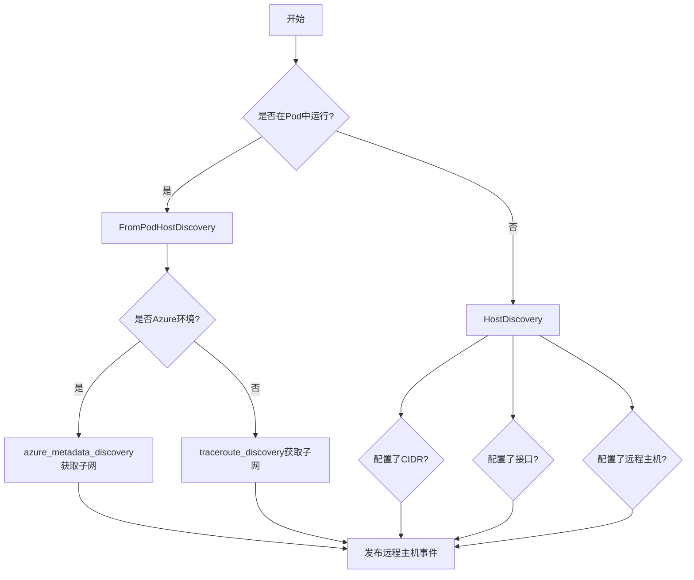
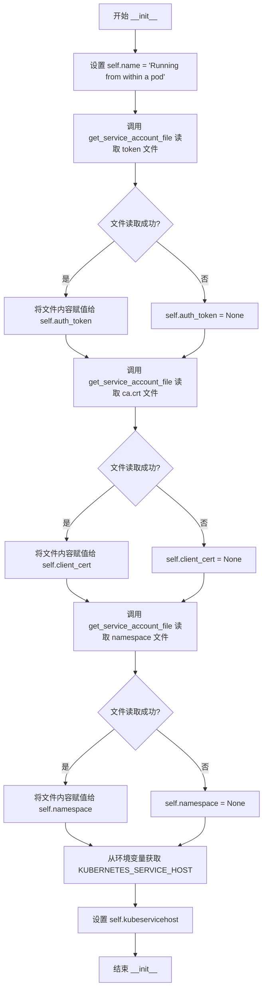
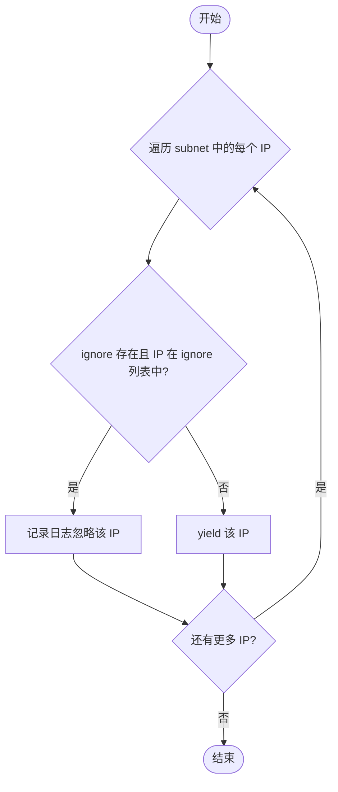
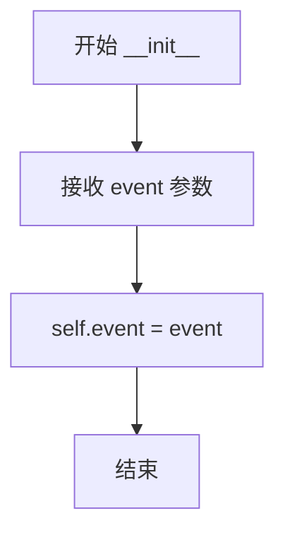
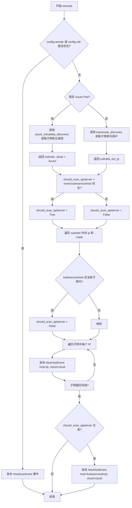
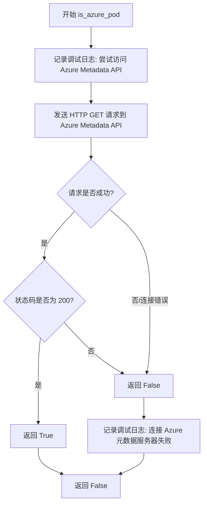
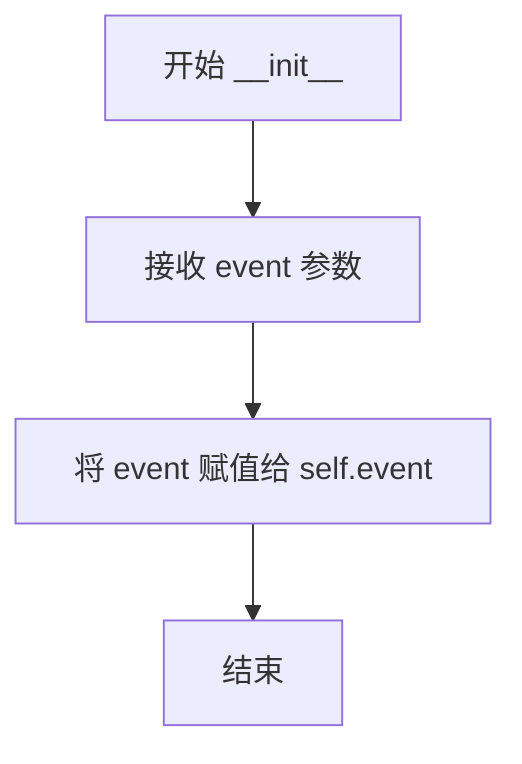
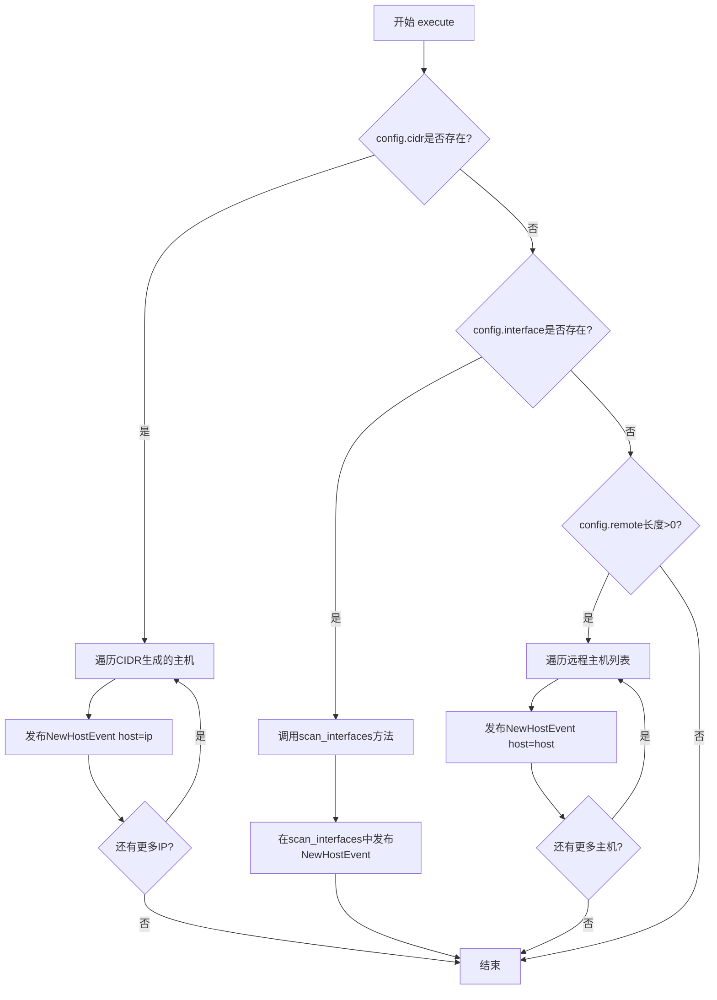
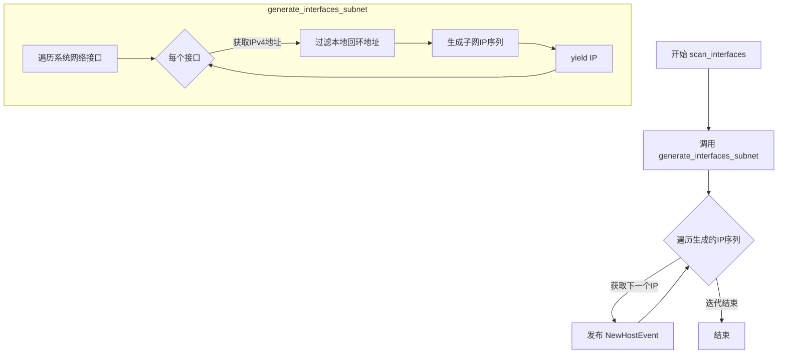

# `kubehunter\kube_hunter\modules\discovery\hosts.py` 详细设计文档

Kubernetes集群主机发现模块，负责识别待扫描的目标主机，支持从Pod内部、Azure云环境、预定义CIDR范围、网络接口等多种方式进行主机发现，并生成NewHostEvent事件供后续漏洞扫描使用。

## 整体流程



## 类结构

```
Event (基类)
├── RunningAsPodEvent
├── HostScanEvent
└── AzureMetadataApi (Vulnerability + Event)
Discovery (基类)
├── FromPodHostDiscovery
└── HostDiscovery
HostDiscoveryHelpers (辅助类)
InterfaceTypes (枚举类)
```

## 全局变量及字段


### `logger`
    
模块日志记录器

类型：`Logger`
    


### `RunningAsPodEvent.name`
    
事件名称

类型：`str`
    


### `RunningAsPodEvent.auth_token`
    
Kubernetes服务账户令牌

类型：`str`
    


### `RunningAsPodEvent.client_cert`
    
客户端证书

类型：`str`
    


### `RunningAsPodEvent.namespace`
    
命名空间

类型：`str`
    


### `RunningAsPodEvent.kubeservicehost`
    
Kubernetes服务主机IP

类型：`str`
    


### `AzureMetadataApi.cidr`
    
子网CIDR

类型：`str`
    


### `AzureMetadataApi.evidence`
    
漏洞证据

类型：`str`
    


### `HostScanEvent.active`
    
是否主动扫描

类型：`bool`
    


### `HostScanEvent.predefined_hosts`
    
预定义主机列表

类型：`list`
    


### `FromPodHostDiscovery.event`
    
传入事件

类型：`RunningAsPodEvent`
    


### `HostDiscovery.event`
    
传入事件

类型：`HostScanEvent`
    


### `InterfaceTypes.LOCALHOST`
    
本地主机前缀

类型：`str`
    
    

## 全局函数及方法


### `RunningAsPodEvent.__init__`

这是 `RunningAsPodEvent` 类的构造函数，用于初始化在 Kubernetes Pod 环境中运行时的相关属性，包括从服务账号文件中读取认证令牌、客户端证书和命名空间信息，以及获取 Kubernetes 服务主机地址。

参数：

- `self`：实例对象本身，无需显式传递

返回值：`None`，该方法为构造函数，不返回任何值，仅初始化实例属性

#### 流程图



#### 带注释源码

```python
def __init__(self):
    # 设置事件的名称描述，表明当前代码运行在 Pod 内部
    self.name = "Running from within a pod"
    
    # 从服务账号目录读取认证令牌，用于与 Kubernetes API 通信的身份验证
    # 文件路径: /var/run/secrets/kubernetes.io/serviceaccount/token
    self.auth_token = self.get_service_account_file("token")
    
    # 从服务账号目录读取 CA 证书，用于验证 Kubernetes API 服务器的证书
    # 文件路径: /var/run/secrets/kubernetes.io/serviceaccount/ca.crt
    self.client_cert = self.get_service_account_file("ca.crt")
    
    # 从服务账号目录读取当前 Pod 所在的命名空间
    # 文件路径: /var/run/secrets/kubernetes.io/serviceaccount/namespace
    self.namespace = self.get_service_account_file("namespace")
    
    # 从环境变量获取 Kubernetes API 服务器的主机地址
    # 如果环境变量不存在，则返回 None
    self.kubeservicehost = os.environ.get("KUBERNETES_SERVICE_HOST", None)
```


### `RunningAsPodEvent.location`

该方法用于获取当前事件发生位置的逻辑位置信息，主要用于报告生成。如果环境变量中存在HOSTNAME，则将其附加到位置描述中返回。

参数：
- （无参数）

返回值：`str`，返回位置描述字符串，格式为"Local to Pod"或"Local to Pod (hostname)"

#### 流程图

```mermaid
flowchart TD
    A[开始] --> B[初始化 location = 'Local to Pod']
    B --> C{获取 HOSTNAME 环境变量}
    C -->|存在| D[location += f' ({hostname})']
    C -->|不存在| E[跳过]
    D --> F[返回 location]
    E --> F
```

#### 带注释源码

```python
# Event's logical location to be used mainly for reports.
def location(self):
    # 初始化位置为本地Pod的默认描述
    location = "Local to Pod"
    # 获取HOSTNAME环境变量，用于标识具体的Pod名称
    hostname = os.getenv("HOSTNAME")
    # 如果成功获取到hostname，则将其附加到位置描述中
    if hostname:
        location += f" ({hostname})"

    # 返回完整的位置描述信息
    return location
```


### RunningAsPodEvent.get_service_account_file

该方法用于从Kubernetes Pod的服务账号目录中读取指定文件的内容。它尝试打开并读取`/var/run/secrets/kubernetes.io/serviceaccount/`路径下的文件（如token、ca.crt、namespace等），如果读取失败则返回None。

参数：

- `file`：`str`，要读取的服务账号文件名（如"token"、"ca.crt"、"namespace"）

返回值：`Optional[str]`，成功读取时返回文件内容字符串，读取失败时返回None

#### 流程图

```mermaid
flowchart TD
    A[开始 get_service_account_file] --> B[构建文件路径: /var/run/secrets/kubernetes.io/serviceaccount/{file}]
    C[尝试打开并读取文件] --> D{文件读取成功?}
    D -->|是| E[返回文件内容 f.read()]
    D -->|否 IOError| F[捕获异常并 pass]
    F --> G[隐式返回 None]
    E --> H[结束]
    G --> H
```

#### 带注释源码

```python
def get_service_account_file(self, file):
    """
    读取Pod服务账号目录下的指定文件
    :param file: 文件名，如 'token', 'ca.crt', 'namespace'
    :return: 文件内容字符串，读取失败时返回None
    """
    try:
        # 构造完整的文件路径，Kubernetes会将服务账号信息挂载到该目录
        with open(f"/var/run/secrets/kubernetes.io/serviceaccount/{file}") as f:
            # 读取并返回文件全部内容
            return f.read()
    except IOError:
        # 如果文件不存在或无权限读取，捕获异常并静默返回None
        # 这允许调用者处理缺失的认证信息
        pass
```


### AzureMetadataApi.__init__

该方法是 `AzureMetadataApi` 类的构造函数，用于初始化 Azure 元数据暴露漏洞的检测对象。它接收一个 CIDR 参数，调用父类 `Vulnerability` 的初始化方法设置漏洞类型为 Azure 信息泄露，并保存 CIDR 信息作为证据。

参数：

- `cidr`：`str`，表示要检测的 CIDR 网络范围，用于构建漏洞证据

返回值：`None`，构造函数不返回任何值

#### 流程图

```mermaid
flowchart TD
    A[开始 __init__] --> B[调用 Vulnerability.__init__]
    B --> C[设置漏洞类别: Azure]
    B --> D[设置漏洞名称: Azure Metadata Exposure]
    B --> E[设置类别: InformationDisclosure]
    B --> F[设置vid: KHV003]
    C --> G[保存cidr到实例变量 self.cidr]
    G --> H[构建证据字符串: cidr: {cidr}]
    H --> I[保存证据到 self.evidence]
    I --> J[结束]
```

#### 带注释源码

```python
def __init__(self, cidr):
    """初始化 AzureMetadataApi 漏洞检测对象
    
    Args:
        cidr: CIDR 格式的网络地址，如 "10.0.0.0/24"
    """
    # 调用父类 Vulnerability 的初始化方法，设置漏洞元数据
    Vulnerability.__init__(
        self,                          # 传递 self 实例
        Azure,                         # 漏洞类型：Azure
        "Azure Metadata Exposure",    # 漏洞名称
        category=InformationDisclosure,  # 漏洞类别：信息泄露
        vid="KHV003",                  # 漏洞 ID 标识
    )
    
    # 保存传入的 CIDR 网络范围到实例变量
    self.cidr = cidr
    
    # 构建并保存漏洞证据，格式为 "cidr: {cidr值}"
    self.evidence = "cidr: {}".format(cidr)
```


### HostScanEvent.__init__

这是`HostScanEvent`类的初始化方法，用于创建一个主机扫描事件对象，接收扫描模式（主动/被动）和预定义主机列表等参数，并将其存储为实例属性。

参数：

- `pod`：`bool`，可选参数，表示是否以Pod模式运行（默认值为`False`）
- `active`：`bool`，可选参数，表示是否执行主动扫描（默认值为`False`）
- `predefined_hosts`：`list`（实际接收任意可迭代类型或`None`），可选参数，表示预定义的主机列表（默认值为`None`）

返回值：`None`（Python中`__init__`方法隐式返回`None`）

#### 流程图

```mermaid
flowchart TD
    A[开始 __init__] --> B{检查 predefined_hosts}
    B -->|为 None 或假值| C[使用空列表 []]
    B -->|有值| D[使用传入的 predefined_hosts]
    C --> E[赋值 self.active = active]
    D --> E
    E --> F[赋值 self.predefined_hosts = 处理后的值]
    F --> G[结束]
```

#### 带注释源码

```python
class HostScanEvent(Event):
    def __init__(self, pod=False, active=False, predefined_hosts=None):
        # flag to specify whether to get actual data from vulnerabilities
        # 参数 active: 布尔标志，表示是否执行主动扫描（获取实际漏洞数据）
        # 参数 pod: 布尔标志，表示是否在Pod环境中运行
        # 参数 predefined_hosts: 可选的主机列表，用于指定要扫描的主机
        
        # 将 active 参数存储为实例属性，用于后续判断扫描模式
        self.active = active
        
        # 将 predefined_hosts 存储为实例属性
        # 使用 or [] 处理 None 或空值的情况，确保 self.predefined_hosts 始终为列表
        # 如果传入 None 或其他假值，则使用空列表作为默认值
        self.predefined_hosts = predefined_hosts or []
```


### `HostDiscoveryHelpers.filter_subnet`

该方法是一个静态生成器函数，用于根据给定的子网生成 IP 地址，并在可选的忽略列表过滤掉需要跳过的 IP 地址。

参数：

- `subnet`：`iterable`，要遍历的子网对象，通常是 `IPNetwork` 对象
- `ignore`：`list`，可选参数，默认为 None，用于指定需要忽略的子网列表

返回值：`generator`，返回过滤后的 IP 地址生成器

#### 流程图



#### 带注释源码

```python
@staticmethod
def filter_subnet(subnet, ignore=None):
    """生成器，根据给定的子网生成 IP，并可选地忽略某些 IP
    
    参数:
        subnet: 可迭代对象，包含要处理的 IP 地址
        ignore: 可选的子网列表，用于指定需要跳过的 IP 范围
    
    返回:
        生成器，逐个产出过滤后的 IP 地址
    """
    # 遍历子网中的每个 IP 地址
    for ip in subnet:
        # 检查是否存在忽略列表，并且当前 IP 位于某个忽略子网中
        if ignore and any(ip in s for s in ignore):
            # 记录调试日志，说明该 IP 被忽略
            logger.debug(f"HostDiscoveryHelpers.filter_subnet ignoring {ip}")
        else:
            # IP 不在忽略列表中，将其产出
            yield ip
```


### `HostDiscoveryHelpers.generate_hosts`

该方法是一个静态工具方法，用于根据用户提供的CIDR列表生成要扫描的IP地址迭代器。它支持两种模式的CIDR：以`!`开头的表示排除的网段，其他表示要扫描的网段。最终通过`itertools.chain`将所有扫描网段的IP地址合并成一个统一的迭代器返回。

参数：

- `cidrs`：`List[str]`，要扫描的CIDR列表，支持以`!`开头的CIDR表示排除的网段

返回值：`Iterator[IPAddress]`，返回一个IP地址迭代器，包含所有要扫描的主机IP（已排除忽略的IP段）

#### 流程图

```mermaid
flowchart TD
    A[开始 generate_hosts] --> B[初始化空列表 ignore 和 scan]
    B --> C{遍历 cidrs 中的每个 cidr}
    C --> D{检查 cidr 是否以 ! 开头}
    D -->|是| E[取 cidr[1:] 作为要排除的网段]
    D -->|否| F[将 cidr 作为要扫描的网段]
    E --> G[尝试解析为 IPNetwork 对象]
    F --> G
    G --> H{解析是否成功}
    H -->|失败| I[抛出 ValueError 异常]
    H -->|成功| J{cidr 是否以 ! 开头}
    J -->|是| K[将解析结果添加到 ignore 列表]
    J -->|否| L[将解析结果添加到 scan 列表]
    K --> C
    L --> C
    C --> M{所有 cidr 处理完毕}
    M --> N[调用 filter_subnet 对每个扫描网段进行过滤]
    N --> O[使用 itertools.chain.from_iterable 合并所有结果]
    O --> P[返回 IP 地址迭代器]
```

#### 带注释源码

```python
@staticmethod
def generate_hosts(cidrs):
    """根据CIDR列表生成要扫描的IP地址迭代器
    
    参数:
        cidrs: CIDR列表，支持以!开头的CIDR表示排除的网段
        
    返回:
        IP地址迭代器，包含所有要扫描的主机IP
    """
    # 初始化两个列表：ignore用于存储要排除的网段，scan用于存储要扫描的网段
    ignore = list()
    scan = list()
    
    # 遍历传入的每个CIDR
    for cidr in cidrs:
        try:
            # 如果CIDR以!开头，表示该网段需要排除
            if cidr.startswith("!"):
                # 将!后面的网段解析为IPNetwork并添加到ignore列表
                ignore.append(IPNetwork(cidr[1:]))
            else:
                # 正常网段，解析为IPNetwork并添加到scan列表
                scan.append(IPNetwork(cidr))
        except AddrFormatError as e:
            # 解析失败时抛出ValueError，保留原始异常信息
            raise ValueError(f"Unable to parse CIDR {cidr}") from e

    # 使用itertools.chain.from_iterable将所有扫描网段的IP合并成一个迭代器
    # 对每个网段调用filter_subnet进行过滤（排除ignore列表中的IP）
    return itertools.chain.from_iterable(HostDiscoveryHelpers.filter_subnet(sb, ignore=ignore) for sb in scan)
```


### `FromPodHostDiscovery.__init__`

该方法是 `FromPodHostDiscovery` 类的构造函数，负责初始化从 Pod 内运行时的主机发现功能。它接收一个事件对象并将其存储为实例属性，以便在后续的 `execute` 方法中使用该事件的数据（如 Kubernetes 服务主机信息）。

参数：

- `event`：`RunningAsPodEvent`，触发此发现处理器的事件对象，包含 Pod 运行时获取的服务账号令牌、CA 证书、命名空间以及 Kubernetes 服务主机地址等信息

返回值：`None`，`__init__` 方法不返回值，仅用于初始化对象状态

#### 流程图



#### 带注释源码

```
def __init__(self, event):
    # 参数 event: RunningAsPodEvent 类型
    # 该事件包含从 Pod 服务账号获取的认证信息和 Kubernetes 环境变量
    # 例如：auth_token、client_cert、namespace、kubeservicehost 等
    
    # 将传入的事件对象存储为实例属性
    # 供后续 execute 方法中访问事件携带的数据使用
    self.event = event
```


### FromPodHostDiscovery.execute

在 Kubernetes Pod 环境中执行主机发现扫描，根据配置的用户指定主机或通过 Azure 元数据 API/Traceroute 方式自动发现集群子网，并发布待扫描的 NewHostEvent 事件。

参数：

- `self`：隐式参数，FromPodHostDiscovery 实例本身

返回值：`None`，该方法通过发布事件来传递结果，不直接返回值

#### 流程图



#### 带注释源码

```python
def execute(self):
    """
    在 Pod 环境中执行主机发现扫描
    根据配置决定扫描用户指定主机或自动发现集群子网
    """
    # 判断是否配置了远程主机或 CIDR 范围
    if config.remote or config.cidr:
        # 用户指定了扫描目标，直接发布 HostScanEvent 事件
        # 后续由 HostDiscovery 类处理具体扫描逻辑
        self.publish_event(HostScanEvent())
    else:
        # 未指定扫描目标，需要自动发现集群子网
        cloud = None  # 初始化云类型为 None
        
        # 判断是否运行在 Azure 环境中
        if self.is_azure_pod():
            # 通过 Azure Metadata API 获取子网信息
            # 返回格式: ([(address, prefix), ...], 'Azure')
            subnets, cloud = self.azure_metadata_discovery()
        else:
            # 非 Azure 环境，使用 Traceroute 方式发现子网
            # 返回格式: ([(internal_ip, '24')], external_ip)
            subnets, ext_ip = self.traceroute_discovery()

        # 检查是否需要扫描 API Server
        # 默认假设需要扫描，除非 API Server IP 在发现的子网内
        should_scan_apiserver = False
        if self.event.kubeservicehost:
            # 存在 Kubernetes Service Host 环境变量
            should_scan_apiserver = True
            
        # 遍历所有发现的子网
        for ip, mask in subnets:
            # 构建 CIDR 格式的子网字符串
            subnet_cidr = f"{ip}/{mask}"
            
            # 检查 Kubernetes Service Host 是否在当前子网内
            # 如果在子网内，则不需要单独扫描 API Server
            if self.event.kubeservicehost and self.event.kubeservicehost in IPNetwork(subnet_cidr):
                should_scan_apiserver = False
                
            # 记录调试日志
            logger.debug(f"From pod scanning subnet {subnet_cidr}")
            
            # 遍历子网中的每个 IP 地址
            for ip in IPNetwork(subnet_cidr):
                # 为每个 IP 发布发现事件
                self.publish_event(NewHostEvent(host=ip, cloud=cloud))
        
        # 如果需要扫描 API Server 且其不在已发现的子网内
        if should_scan_apiserver:
            # 单独发布 API Server 主机的发现事件
            self.publish_event(NewHostEvent(
                host=IPAddress(self.event.kubeservicehost), 
                cloud=cloud
            ))
```


### FromPodHostDiscovery.is_azure_pod

该方法用于检测当前运行的 Pod 是否在 Azure Kubernetes Service (AKS) 环境中。它通过向 Azure 元数据服务 API 发送 HTTP 请求并检查响应状态码来判断是否在 Azure 环境中运行。

参数：
- 该方法无显式参数（仅使用 self 实例）

返回值：`bool`，如果当前 Pod 运行在 Azure 环境中返回 True，否则返回 False

#### 流程图



#### 带注释源码

```python
def is_azure_pod(self):
    """
    检测当前 Pod 是否运行在 Azure (AKS) 环境中
    
    原理：Azure 提供元数据服务端点 169.254.169.254，仅可从 Azure VM/Pod 内部访问
    通过向该端点发送请求并检查响应，可判断是否在 Azure 环境中
    
    Returns:
        bool: True 表示在 Azure 环境中运行, False 表示不在 Azure 环境中
    """
    try:
        # 记录调试信息，便于排查问题
        logger.debug("From pod attempting to access Azure Metadata API")
        
        # 向 Azure 元数据服务发送 HTTP 请求
        # 169.254.169.254 是 Azure VM/Pod 的元数据服务地址
        # api-version 指定使用的 API 版本
        # headers 中的 "Metadata": "true" 是 Azure 元数据服务的必需头
        if (
            requests.get(
                "http://169.254.169.254/metadata/instance?api-version=2017-08-01",
                headers={"Metadata": "true"},
                timeout=config.network_timeout,  # 使用配置的网络超时时间
            ).status_code
            == 200
        ):
            # 如果返回 200 状态码，说明可以成功访问 Azure 元数据服务
            # 表示当前运行在 Azure 环境中
            return True
    except requests.exceptions.ConnectionError:
        # 如果连接失败，说明不在 Azure 环境中（或网络不可达）
        # 记录调试日志并返回 False
        logger.debug("Failed to connect Azure metadata server")
        return False
    # 注意：其他异常未处理，可能导致调用方收到异常
```


### FromPodHostDiscovery.traceroute_discovery

用于 Pod 扫描的 traceroute 主机发现方法，通过获取外部 IP 判断是否为云集群，并利用 ICMP TTL=1 技术获取节点内部 IP 地址，最后返回内部子网信息和外部 IP。

参数：

- `self`：隐式参数，`FromPodHostDiscovery` 类实例，表示当前发现器对象

返回值：`tuple[list[list[str]], str]`，返回元组，第一个元素是包含节点内部 IP 和子网掩码的二维列表，第二个元素是外部 IP 地址字符串

#### 流程图

```mermaid
flowchart TD
    A[开始 traceroute_discovery] --> B[发送HTTP请求获取外部IP]
    B --> C{是否成功获取}
    C -->|失败| D[抛出异常]
    C -->|成功| E[解析外部IP文本]
    E --> F[构造ICMP包: Ether/IP/ICMP]
    F --> G[设置目标地址1.1.1.1, TTL=1]
    G --> H[发送包并接收响应]
    H --> I[从响应中提取源IP地址]
    I --> J[构建返回结果: [[node_internal_ip, '24'], external_ip]]
    J --> K[结束]
```

#### 带注释源码

```python
# for pod scanning
def traceroute_discovery(self):
    # 获取外部 IP，用于确定是否是云集群
    # 通过访问 canhazip.com 服务获取本节点的公网出口 IP
    external_ip = requests.get("https://canhazip.com", timeout=config.network_timeout).text

    # 使用 Scapy 发送 ICMP 包进行 traceroute 探测
    # 原理：发送 TTL=1 的 ICMP 包到 1.1.1.1，第一跳路由器会返回 ICMP Time Exceeded
    # 从而我们可以获取到本节点出接口的 IP 地址（即节点内部 IP）
    node_internal_ip = srp1(
        Ether() / IP(dst="1.1.1.1", ttl=1) / ICMP(), verbose=0, timeout=config.network_timeout,
    )[IP].src
    
    # 返回子网信息和外部 IP
    # 子网格式：[[内部IP, 子网掩码]]，使用 /24 作为默认子网掩码
    return [[node_internal_ip, "24"]], external_ip
```


### FromPodHostDiscovery.azure_metadata_discovery

该方法用于在 Azure 环境下的 Pod 中运行时，通过查询 Azure 元数据 API (169.254.169.254) 来发现集群网络子网信息。它向 Azure Instance Metadata Service 发送请求，获取当前 Pod 所在节点的网络接口信息（包括 IPv4 地址和子网前缀），并将发现的子网信息发布为安全事件，最终返回子网列表和云提供商标识。

参数：

- 无显式参数（仅包含 self）

返回值：`Tuple[List[List[str]], str]`，返回子网列表（如 `[["10.0.0.0", "24"]]`）和云提供商标识字符串 `"Azure"`

#### 流程图

```mermaid
flowchart TD
    A[开始 azure_metadata_discovery] --> B[记录调试日志 'From pod attempting to access azure's metadata']
    B --> C[向 Azure 元数据 API 发送 GET 请求]
    C --> D[解析 JSON 响应获取 machine_metadata]
    E[初始化空列表 subnets] --> F[遍历 network.interface 列表]
    F --> G{当前接口是否有 IPv4 子网信息}
    G -->|是| H[提取 address 和 subnet prefix]
    G -->|否| F
    H --> I{config.quick 是否为 True}
    I -->|是| J[设置 subnet 为 '24']
    I -->|否| K[保留原始 subnet 值]
    J --> L[记录调试日志 'From pod discovered subnet {address}/{subnet}']
    K --> L
    L --> M[将子网信息添加到 subnets 列表]
    M --> N[发布 AzureMetadataApi 事件]
    N --> F
    F --> O{遍历完成?}
    O -->|否| F
    O -->|是| P[返回 subnets 和 'Azure']
    P --> Q[结束]
```

#### 带注释源码

```python
def azure_metadata_discovery(self):
    """
    Azure 元数据发现方法
    仅在 Azure 环境下的 Pod 中运行有效
    通过访问 Azure Instance Metadata Service 获取网络配置信息
    """
    # 记录调试信息，表明正在尝试访问 Azure 元数据服务
    logger.debug("From pod attempting to access azure's metadata")
    
    # 向 Azure 元数据 API 端点发送 HTTP GET 请求
    # 169.254.169.254 是 Azure Instance Metadata Service 的_link-local_ 地址
    # 需要设置 'Metadata: true' 头部以符合 Azure API 要求
    # 使用配置的网络超时时间
    machine_metadata = requests.get(
        "http://169.254.169.254/metadata/instance?api-version=2017-08-01",
        headers={"Metadata": "true"},
        timeout=config.network_timeout,
    ).json()  # 直接获取 JSON 响应体
    
    # 初始化变量用于存储当前接口的地址和子网
    address, subnet = "", ""
    # 存储所有发现的子网信息列表
    subnets = list()
    
    # 遍历元数据中的所有网络接口
    # Azure VM 可能包含多个网络接口 (NIC)
    for interface in machine_metadata["network"]["interface"]:
        # 从每个接口的 IPv4 配置中提取第一个子网信息
        # Azure 可能为每个接口配置多个子网，此处只取第一个
        address, subnet = (
            interface["ipv4"]["subnet"][0]["address"],      # 子网网络地址
            interface["ipv4"]["subnet"][0]["prefix"],       # 子网前缀长度 (如 24)
        )
        
        # 如果配置了快速扫描模式 (config.quick)，则强制使用 /24 子网
        # 这可以减少扫描范围，提高扫描速度
        subnet = subnet if not config.quick else "24"
        
        # 记录发现的子网信息用于调试
        logger.debug(f"From pod discovered subnet {address}/{subnet}")
        
        # 将子网信息添加到待扫描列表
        # 格式: [子网地址, 前缀长度]
        subnets.append([address, subnet if not config.quick else "24"])
        
        # 发布 Azure 元数据暴露事件
        # 用于记录安全发现：Azure 元数据 API 可访问
        self.publish_event(AzureMetadataApi(cidr=f"{address}/{subnet}"))

    # 返回发现的子网列表和云提供商标识
    # 调用方可以根据此信息进行进一步的 host 扫描
    return subnets, "Azure"
```


### HostDiscovery.__init__

初始化 HostDiscovery 类，接受一个事件对象并将其存储为实例属性，用于后续的主机发现扫描操作。

参数：

- `event`：`HostScanEvent` 类型，触发主机扫描的事件对象，包含扫描配置信息（如是否为主动扫描、预定义主机列表等）

返回值：`None`，无返回值（`__init__` 方法不返回值）

#### 流程图



#### 带注释源码

```python
def __init__(self, event):
    """
    初始化 HostDiscovery 实例
    
    参数:
        event: HostScanEvent 类型的事件对象，包含扫描配置
               - active: 是否执行主动扫描
               - predefined_hosts: 预定义的主机列表
    """
    self.event = event  # 将传入的事件对象存储为实例属性，供 execute() 方法使用
```


### HostDiscovery.execute

该方法是主机发现的核心执行逻辑，根据配置信息（CIDR、网络接口或远程主机列表）生成待扫描的主机IP列表并发布NewHostEvent事件。

参数：

- `self`：HostDiscovery实例，隐式参数

返回值：`None`，该方法无返回值，通过发布事件传递发现的主机

#### 流程图



#### 带注释源码

```python
def execute(self):
    """
    执行主机发现逻辑
    根据配置选择不同的发现方式：
    1. CIDR范围扫描
    2. 本地网络接口扫描
    3. 预定义远程主机列表扫描
    """
    # 方式1：如果配置了CIDR范围，从CIDR生成主机列表
    if config.cidr:
        # 使用HostDiscoveryHelpers生成所有IP并发布事件
        for ip in HostDiscoveryHelpers.generate_hosts(config.cidr):
            self.publish_event(NewHostEvent(host=ip))
    
    # 方式2：如果配置了接口扫描，扫描本地网络接口
    elif config.interface:
        self.scan_interfaces()
    
    # 方式3：如果配置了远程主机列表，直接使用
    elif len(config.remote) > 0:
        for host in config.remote:
            self.publish_event(NewHostEvent(host=host))
```


### HostDiscovery.scan_interfaces

该方法是HostDiscovery类的成员方法，用于扫描本地网络接口并生成可扫描的IP地址列表。它调用内部方法`generate_interfaces_subnet`遍历系统所有网络接口，提取IPv4地址并生成相应的子网IP序列，最后为每个IP发布`NewHostEvent`事件以触发后续的漏洞扫描流程。

参数：
- （无参数，仅使用实例成员 `self`）

返回值：`None`，该方法通过发布事件而非返回值传递结果

#### 流程图



#### 带注释源码

```python
# for normal scanning
def scan_interfaces(self):
    """扫描本地网络接口并发布新主机发现事件"""
    # 调用内部方法generate_interfaces_subnet获取需要扫描的IP列表
    # 该方法返回一个生成器，遍历系统所有网络接口的IPv4子网
    for ip in self.generate_interfaces_subnet():
        # 为每个生成的IP地址发布NewHostEvent事件
        # 订阅该事件的处理器将执行实际的漏洞扫描
        handler.publish_event(NewHostEvent(host=ip))
```


### HostDiscovery.generate_interfaces_subnet

该方法用于从所有内部网络接口生成子网 IP 地址列表，通过遍历本地网络接口并获取其 IPv4 地址，然后根据指定的子网掩码生成待扫描的 IP 列表。

参数：

- `sn`：`str`，子网掩码长度，默认为 "24"

返回值：`Generator[IPAddress, None, None]`，生成器，逐个返回子网中的 IP 地址

#### 流程图

```mermaid
flowchart TD
    A[开始 generate_interfaces_subnet] --> B[设置默认子网掩码 sn='24']
    B --> C[遍历所有网络接口 interfaces()]
    C --> D{当前是否存在下一个接口}
    D -->|是| E[获取当前接口的 IPv4 地址列表]
    D -->|否| M[结束]
    E --> F{当前是否存在下一个 IP}
    F -->|是| G{event.localhost 为真或 IP 不包含本地回环}
    G -->|是| H[跳过本地回环地址]
    G -->|否| I[构造 IPNetwork 对象]
    H --> F
    I --> J[遍历 IPNetwork 中的所有 IP]
    J --> K[yield 当前 IP]
    K --> J
    J -->|遍历完成| F
```

#### 带注释源码

```python
# 生成所有内部网络接口的子网
# 参数 sn: 子网前缀长度，默认为 "24" (如 192.168.1.0/24)
def generate_interfaces_subnet(self, sn="24"):
    # 遍历本机所有网络接口名称
    for ifaceName in interfaces():
        # 获取当前接口的 IPv4 地址列表
        # ifaddresses() 返回包含所有地址的字典
        # setdefault(AF_INET, []) 确保即使没有 IPv4 地址也不会报错
        for ip in [i["addr"] for i in ifaddresses(ifaceName).setdefault(AF_INET, [])]:
            # 如果 event.localhost 为 False 且 IP 包含本地回环标识 "127"
            # 则跳过该地址，不将其加入扫描列表
            if not self.event.localhost and InterfaceTypes.LOCALHOST.value in ip.__str__():
                continue
            # 将 IP 与子网掩码组合成 CIDR 格式
            # 例如: "192.168.1.10" + "/24" => "192.168.1.0/24"
            # IPNetwork 会展开为该子网中的所有 IP 地址
            for ip in IPNetwork(f"{ip}/{sn}"):
                # 逐个 yield 子网中的 IP 地址
                # 返回给调用者用于扫描
                yield ip
```

## 关键组件


### RunningAsPodEvent

用于检测当前是否在Kubernetes Pod中运行的事件类，通过读取serviceaccount文件和环境变量获取Pod元数据

### AzureMetadataApi

Azure元数据API暴露漏洞类，检测对Azure云元数据API的访问，属于信息泄露类漏洞

### HostScanEvent

主机扫描事件类，携带扫描参数（是否主动扫描、预定义主机列表等）

### HostDiscoveryHelpers

主机发现辅助工具类，提供CIDR子网过滤和IP生成功能，使用生成器实现惰性加载

### FromPodHostDiscovery

从Pod内部进行主机发现的类，通过Azure元数据API或traceroute方式发现集群子网

### HostDiscovery

普通主机发现类，支持从CIDR、网络接口或远程主机列表生成待扫描主机

### InterfaceTypes

本地环回接口类型枚举，用于过滤本地回环地址

### 张量索引与惰性加载

代码使用生成器（yield）实现惰性加载，包括`filter_subnet`方法遍历子网IP、`generate_interfaces_subnet`方法逐个生成接口IP，避免一次性加载所有IP到内存

### 反量化支持

通过`azure_metadata_discovery`方法查询Azure实例元数据接口，获取网络接口信息，支持云环境识别

### 量化策略

通过`config.quick`选项控制子网掩码快速扫描策略，将子网前缀统一设为"24"减少扫描范围


## 问题及建议


### 已知问题

- 异常处理不完整：`RunningAsPodEvent.get_service_account_file` 捕获 `IOError` 后直接返回 `None`，没有任何日志记录或错误提示，可能导致后续使用时出现难以追踪的空值问题
- 元数据请求重复：`is_azure_pod()` 和 `azure_metadata_discovery()` 方法都向 Azure Metadata API 发送相同请求，未能复用已获取的信息
- 变量覆盖问题：`azure_metadata_discovery` 方法中循环覆盖 `address` 和 `subnet` 变量，只保留最后一个网络接口的配置，可能导致其他接口信息丢失
- 双重循环变量名冲突：`generate_interfaces_subnet` 方法中内外层循环都使用了 `ip` 变量名，内层循环覆盖了外层循环的变量
- 解包风险：`traceroute_discovery` 方法中 `srp1()` 返回的结果直接解包 `[IP].src`，未检查返回是否为 `None`，可能在超时或网络异常时崩溃
- 魔法数字硬编码：子网掩码 "24"、本地主机前缀 "127"、API 版本 "2017-08-01" 等多处硬编码，缺乏配置化管理
- 缺少类型注解：所有方法和变量均无类型提示，降低了代码可维护性和 IDE 支持
- KeyError 风险：`azure_metadata_discovery` 解析 JSON 时直接使用 `machine_metadata["network"]["interface"]` 等嵌套键，未做异常处理
- 网络超时配置不统一：部分请求使用 `config.network_timeout`，但 `traceroute_discovery` 中外部 IP 请求未设置超时

### 优化建议

- 统一 Azure Metadata API 调用逻辑，在 `is_azure_pod()` 成功后缓存响应数据供后续方法使用，避免重复请求
- 为 `get_service_account_file` 添加日志记录，并在 `RunningAsPodEvent.__init__` 中设置合理的默认值或显式标记未运行在 Pod 中
- 修复变量名冲突问题，将内层循环变量改为 `host` 或 `ip_addr` 以区分外层变量
- 在 `srp1()` 解包前添加 `if node_internal_ip is None:` 的空值检查
- 将魔法数字提取为常量或配置文件，使用 `Enum` 类管理网络相关常量（如 `SubnetMask`、`LoopbackPrefix` 等）
- 为关键方法添加类型注解，提高代码可读性和静态分析能力
- 解析 JSON 时使用 `.get()` 方法或 try-except 包装，防止 KeyError 导致程序崩溃
- 所有网络请求统一使用带超时的 `requests.get()`，包括外部 IP 获取请求
- 考虑添加重试机制和降级策略，提高在网络不稳定环境下的鲁棒性

## 其它


### 设计目标与约束

本模块是kube-hunter的核心主机发现模块，负责在Kubernetes集群环境中发现待扫描的目标主机IP地址。设计目标包括：1）支持两种运行模式：从Pod内运行和从集群外运行；2）支持多种主机发现方式（CIDR指定、接口扫描、预设主机列表、Azure元数据API、traceroute）；3）能够识别云服务类型（Azure）并获取集群网络信息；4）遵循kube-hunter的事件驱动架构。约束条件包括依赖特定的网络库（scapy、netifaces、netaddr）和Kubernetes环境文件路径。

### 错误处理与异常设计

代码中主要采用以下异常处理策略：1）IOError处理：RunningAsPodEvent.get_service_account_file方法捕获读取服务账号文件时的IOError并返回None；2）AddrFormatError处理：HostDiscoveryHelpers.generate_hosts方法捕获CIDR格式错误并抛出ValueError；3）ConnectionError处理：is_azure_pod方法捕获Azure元数据API连接失败并返回False；4）requests异常处理：使用timeout参数防止网络请求无限等待，使用status_code检查响应状态；5）日志记录：所有异常和边界情况都通过logger.debug进行记录，不影响主流程执行。

### 数据流与状态机

主机发现模块的数据流如下：1）启动阶段：订阅RunningAsPodEvent或HostScanEvent事件；2）RunningAsPodEvent触发：从Pod内读取服务账号信息（token、证书、namespace），获取KUBERNETES_SERVICE_HOST环境变量；3）HostScanEvent触发：根据配置决定发现方式（CIDR/接口/预设主机）；4）Azure检测：尝试访问Azure元数据API（169.254.169.254），成功则使用azure_metadata_discovery，否则使用traceroute_discovery；5）子网处理：对每个子网生成IP地址，发布NewHostEvent事件；6）结束：扫描器接收NewHostEvent进行漏洞扫描。

### 外部依赖与接口契约

本模块依赖以下外部依赖：1）netaddr库：提供IPNetwork和IPAddress类用于IP地址和CIDR处理；2）netifaces库：提供interfaces()和ifaddresses()函数获取本地网络接口信息；3）scapy.all库：提供Ether、IP、ICMP和srp1函数进行网络数据包发送和接收；4）requests库：用于HTTP请求（Azure元数据API、canhazip.com）；5）kube_hunter内部模块：config配置对象、events模块（handler、Event、Subscription）、types模块（Discovery、Vulnerability、InformationDisclosure、Azure）。接口契约方面：Event类定义事件基类，Discovery类是发现器基类，publish_event方法发布事件到事件队列，配置通过config对象访问（remote、cidr、interface、network_timeout、quick等属性）。

### 性能考虑与优化空间

当前实现存在以下性能问题：1）IPNetwork迭代：在generate_hosts和generate_interfaces_subnet方法中直接迭代IPNetwork对象，当子网较大时（如/16）会产生大量IP对象，建议使用批量生成或范围过滤；2）网络请求阻塞：traceroute_discovery方法同步发送ICMP包并等待响应，可能超时；3）重复事件发布：azure_metadata_discovery方法在循环中每次都发布AzureMetadataApi事件；4）字符串拼接：多处使用f-string进行字符串拼接，可考虑优化。优化建议：1）实现IP范围批量处理；2）使用异步IO处理网络请求；3）添加缓存机制避免重复发现；4）考虑使用logging的格式化字符串延迟求值。

### 安全考虑

本模块涉及以下安全考量：1）凭证读取：从/var/run/secrets/kubernetes.io/serviceaccount/路径读取Pod的服务账号凭证（token、ca.crt、namespace），这些文件具有适当的权限控制；2）网络访问：访问Azure元数据API（169.254.169.254）和外部IP查询服务（canhazip.com），在扫描过程中可能暴露kube-hunter的存在；3）ICMP包发送：使用scapy发送ICMP包进行traceroute，可能被防火墙阻止或触发安全告警；4）日志敏感信息：虽然当前日志级别为debug，但应避免在日志中输出敏感信息。

### 配置文件与参数说明

本模块使用的配置参数（来自config对象）：1）config.remote：预设的目标主机列表；2）config.cidr：待扫描的CIDR范围列表；3）config.interface：是否扫描本地网络接口；4）config.network_timeout：网络请求超时时间（秒）；5）config.quick：快速扫描模式，子网前缀固定为24；6）config.localhost：是否包含本地主机地址。环境变量：1）KUBERNETES_SERVICE_HOST：Kubernetes API Server服务IP；2）HOSTNAME：Pod所在的节点名称。

### 测试策略建议

针对本模块的测试建议包括：1）单元测试：测试HostDiscoveryHelpers.filter_subnet和generate_hosts方法的CIDR解析和过滤逻辑；2）集成测试：测试在真实Kubernetes环境中的主机发现流程；3）Mock测试：使用mock对象模拟requests、scapy等外部依赖，测试异常处理分支；4）边界测试：测试空CIDR列表、单IPCIDR、/8、/16等大范围子网的处理；5）Azure环境测试：模拟Azure元数据API响应测试azure_metadata_discovery方法。

### 部署和运行要求

运行要求包括：1）操作系统：Linux（需要访问/proc/net/tcp等文件）；2）权限：需要读取Pod服务账号文件（/var/run/secrets/kubernetes.io/serviceaccount/）的权限，发送ICMP包可能需要root或CAP_NET_RAW权限；3）Python版本：Python 3.x；4）网络要求：能够访问169.254.169.254（Azure元数据API）、canhazip.com（外部IP查询）、目标扫描网络；5）Kubernetes版本：与Kubernetes版本无关，但需要Pod具有服务账号挂载。


    