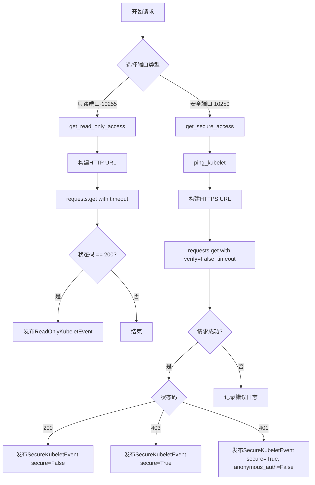
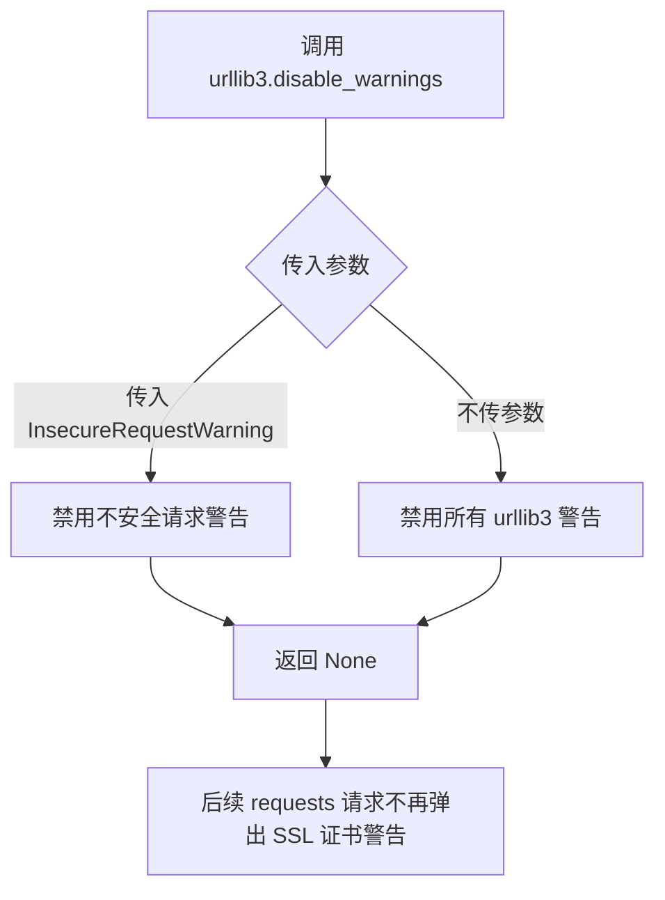
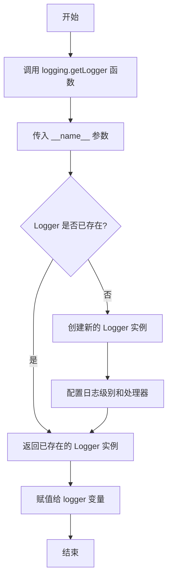
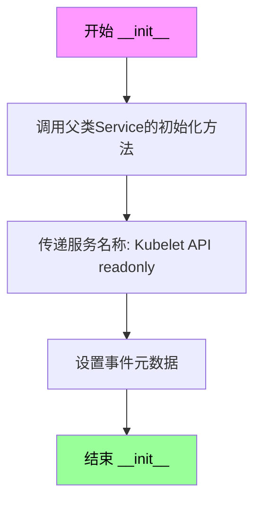
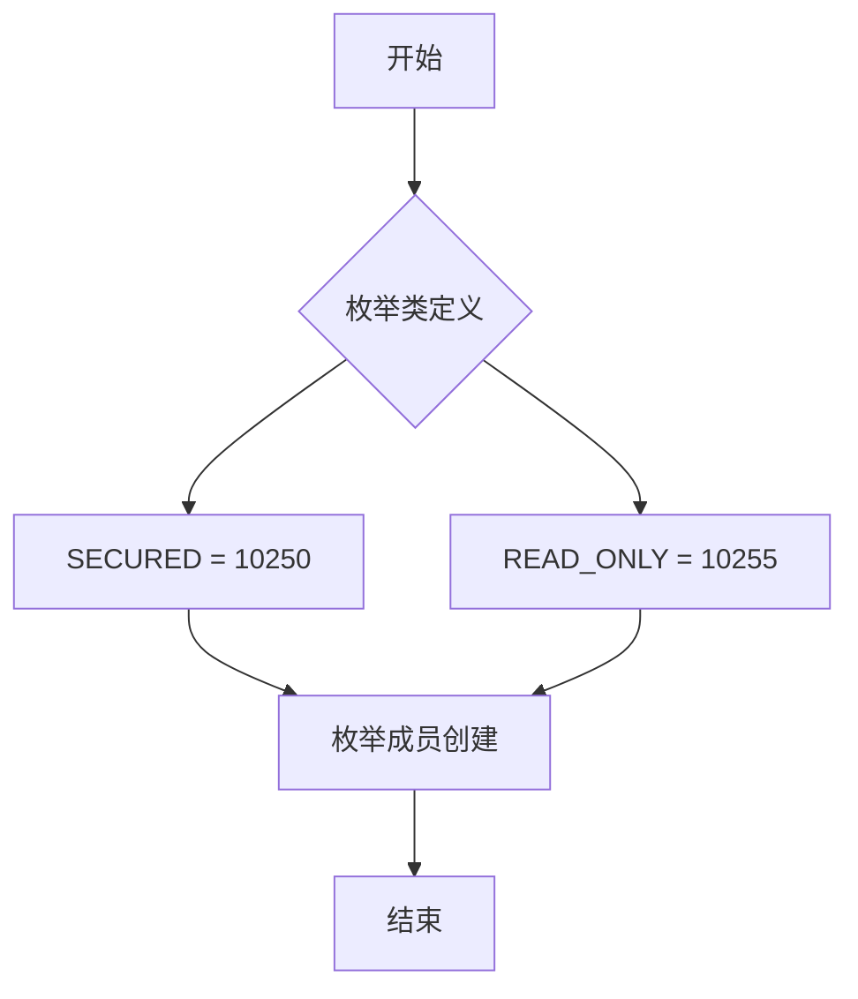
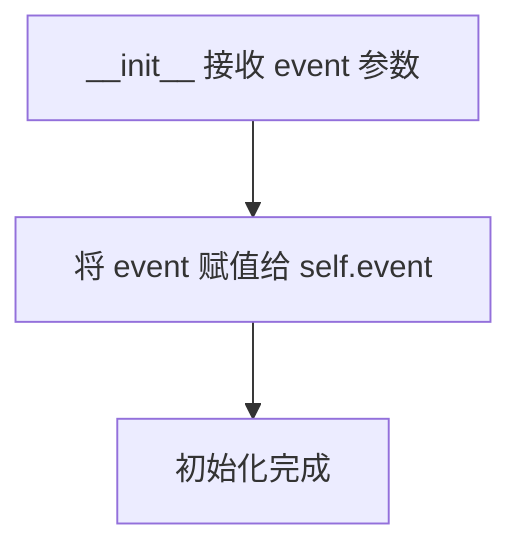
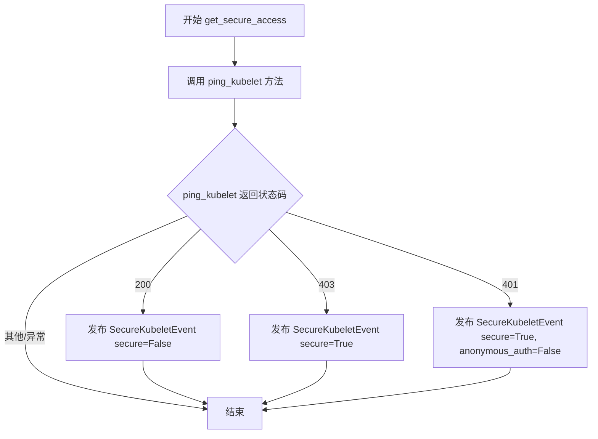
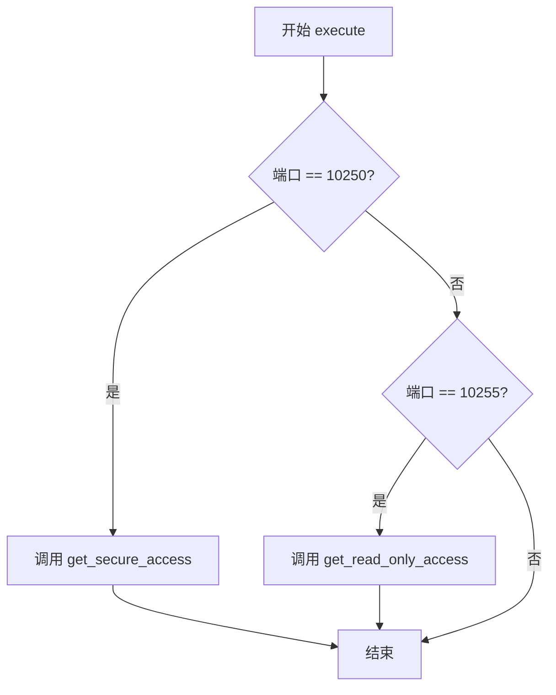

# `kubehunter\kube_hunter\modules\discovery\kubelet.py` 详细设计文档

该模块是kube-hunter的安全扫描插件，用于发现Kubernetes集群中的Kubelet服务。它通过检测10250（安全端口）和10255（只读端口）两个端口，尝试访问Kubelet API并发布相应的事件，以识别Kubelet服务的存在及其配置信息（是否启用匿名认证、是否需要认证等）。

## 整体流程

```mermaid
graph TD
    A[开始: 接收OpenPortEvent] --> B{端口是10250?}
    B -- 是 --> C[调用get_secure_access]
    B -- 否 --> D{端口是10255?}
    D -- 是 --> E[调用get_read_only_access]
    D -- 否 --> F[结束]
    C --> G[ping_kubelet: 尝试HTTPS访问]
    G --> H{返回状态码}
    H -->|200| I[发布SecureKubeletEvent(secure=False)]
    H -->|403| J[发布SecureKubeletEvent(secure=True)]
    H -->|401| K[发布SecureKubeletEvent(secure=True, anonymous_auth=False)]
    H -->|其他| L[不发布事件]
    E --> M[get_read_only_access: 尝试HTTP访问]
    M --> N{状态码200?}
    N -->|是| O[发布ReadOnlyKubeletEvent]
    N -->|否| P[不发布事件]
```

## 类结构

```
Event (抽象基类)
├── Service
│   ├── ReadOnlyKubeletEvent
│   └── SecureKubeletEvent
└── Discovery (抽象基类)
    └── KubeletDiscovery
```

## 全局变量及字段


### `logger`
    
模块日志记录器

类型：`logging.Logger`
    


### `config`
    
kube-hunter全局配置对象

类型：`object`
    


### `KubeletPorts.SECURED`
    
安全端口号10250

类型：`int`
    


### `KubeletPorts.READ_ONLY`
    
只读端口号10255

类型：`int`
    


### `ReadOnlyKubeletEvent.name`
    
事件名称，值为'Kubelet API (readonly)'

类型：`str`
    


### `SecureKubeletEvent.cert`
    
是否使用证书认证

类型：`bool`
    


### `SecureKubeletEvent.token`
    
是否使用令牌认证

类型：`bool`
    


### `SecureKubeletEvent.anonymous_auth`
    
是否允许匿名访问

类型：`bool`
    


### `SecureKubeletEvent.name`
    
事件名称，值为'Kubelet API'

类型：`str`
    


### `KubeletPorts.SECURED`
    
安全端口号10250

类型：`int`
    


### `KubeletPorts.READ_ONLY`
    
只读端口号10255

类型：`int`
    


### `KubeletDiscovery.event`
    
接收到的开放端口事件

类型：`OpenPortEvent`
    
    

## 全局函数及方法


### `handler.subscribe` / `EventHandler.subscribe`

该方法用于订阅 `OpenPortEvent` 事件，并使用 predicate 过滤器筛选端口为 10250 或 10255 的事件。当事件满足条件时，触发 `KubeletDiscovery` 类的执行。

参数：

-  `event`：`type` (OpenPortEvent 类)，要订阅的事件类型
-  `predicate`：`Callable[[Event], bool]` (lambda 函数)，事件过滤谓词，用于筛选符合条件的事件

返回值：`Callable`，返回装饰器函数，用于装饰事件处理类

#### 流程图

```mermaid
flowchart TD
    A[开始订阅] --> B[注册事件类型: OpenPortEvent]
    B --> C[注册Predicate过滤器: x.port in [10250, 10255]]
    C --> D[将KubeletDiscovery类作为回调处理]
    D --> E{事件发生}
    E -->|是| F{端口是否匹配}
    F -->|10250或10255| G[执行KubeletDiscovery.execute]
    F -->|不匹配| H[不执行]
    E -->|否| I[等待事件]
```

#### 带注释源码

```python
# 导入事件处理器
from kube_hunter.core.events import handler
# 导入事件类型
from kube_hunter.core.events.types import OpenPortEvent

# 使用装饰器语法订阅事件
# 参数1: OpenPortEvent - 要订阅的事件类型
# 参数2: predicate=lambda x: x.port in [10250, 10255] - 过滤条件，只处理端口为10250或10255的事件
@handler.subscribe(OpenPortEvent, predicate=lambda x: x.port in [10250, 10255])
class KubeletDiscovery(Discovery):
    """
    KubeletDiscovery 类
    继承自 Discovery，用于发现 Kubelet 服务及其开放端口
    当 OpenPortEvent 事件发生且端口为 10250 或 10255 时触发
    """
    
    def __init__(self, event):
        self.event = event  # 存储传入的事件对象

    def execute(self):
        """执行发现逻辑，根据端口类型调用不同的访问方法"""
        if self.event.port == KubeletPorts.SECURED.value:  # 10250
            self.get_secure_access()
        elif self.event.port == KubeletPorts.READ_ONLY.value:  # 10255
            self.get_read_only_access()
```


### `requests.get()`

发送HTTP/HTTPS请求以获取Kubelet API响应，用于探测Kubelet服务的只读端口（10255）和安全端口（10250）是否可访问，并根据响应状态码发布相应的事件。

参数：

- `url`（或`endpoint`）：`str`，请求的目标URL地址，格式为`http(s)://{host}:{port}/pods`
- `timeout`：`int/float`，请求超时时间，由`config.network_timeout`配置指定
- `verify`：`bool`（可选），是否验证SSL证书，默认为`True`，在安全端口检测时设置为`False`以忽略证书验证

返回值：`requests.Response`，HTTP响应对象，包含`status_code`属性用于判断请求结果（200=成功，403=禁止，401=未授权）

#### 流程图



#### 带注释源码

```python
# 获取只读访问（HTTP端口10255）
def get_read_only_access(self):
    # 构建只读端口的HTTP端点URL
    endpoint = f"http://{self.event.host}:{self.event.port}/pods"
    logger.debug(f"Trying to get kubelet read access at {endpoint}")
    # 发送HTTP GET请求到Kubelet只读端口
    r = requests.get(endpoint, timeout=config.network_timeout)
    # 如果返回状态码为200，表示只读端口可访问
    if r.status_code == 200:
        self.publish_event(ReadOnlyKubeletEvent())

# 获取安全访问（HTTPS端口10250）
def ping_kubelet(self):
    # 构建安全端口的HTTPS端点URL
    endpoint = f"https://{self.event.host}:{self.event.port}/pods"
    logger.debug("Attempting to get pods info from kubelet")
    try:
        # 发送HTTPS GET请求，禁用证书验证（verify=False）
        # timeout参数防止请求长时间挂起
        return requests.get(endpoint, verify=False, timeout=config.network_timeout).status_code
    except Exception:
        # 捕获所有异常并记录调试日志
        logger.debug(f"Failed pinging https port on {endpoint}", exc_info=True)
```


### `urllib3.disable_warnings()`

该函数用于禁用 urllib3 发出的不安全请求警告，通常在需要忽略 SSL 证书验证警告的场景中使用，以确保请求不会因为证书问题而失败。

参数：

- `category`：`urllib3.exceptions.InsecureRequestWarning`，要禁用的警告类别，默认为 `InsecureRequestWarning`，用于忽略 SSL 证书验证警告

返回值：`None`，无返回值，该函数直接修改 urllib3 的全局警告配置

#### 流程图



#### 带注释源码

```python
# 禁用 urllib3 发出不安全请求警告（SSL 证书验证失败警告）
# 这里传入 InsecureRequestWarning 类别，专门禁用不安全请求警告
urllib3.disable_warnings(urllib3.exceptions.InsecureRequestWarning)
```

---

**说明**：该函数调用位于代码第10行，在导入 urllib3 模块后立即执行，目的是防止后续使用 `requests` 库（基于 urllib3）发起 HTTPS 请求时因证书验证失败而弹出警告。在后续代码第61行可以看到 `requests.get(endpoint, verify=False, ...)` 使用了 `verify=False` 跳过证书验证，此时 `disable_warnings()` 能有效避免警告信息干扰输出。


### `logging.getLogger(__name__)` - 获取模块日志记录器

该函数是 Python 标准库 logging 模块的核心方法，用于获取或创建一个与当前模块关联的日志记录器实例。通过传入模块的 `__name__` 属性，可以实现按模块级别的日志管理，便于追踪日志来源和进行分级控制。

参数：

- `name`：`str`（字符串），日志记录器的名称，通常传入 `__name__` 以获取当前模块的完全限定名

返回值：`logging.Logger`，返回一个新的或已存在的 Logger 对象，用于记录日志

#### 流程图



#### 带注释源码

```python
# 导入 logging 标准库模块
import logging

# 获取当前模块的日志记录器
# __name__ 是 Python 的内置变量，表示当前模块的完全限定名
# 例如：当此文件作为主程序运行时，__name__ 的值为 "__main__"
# 当作为模块导入时，__name__ 的值为 "kube_hunter.discovery.kubelet" 等
logger = logging.getLogger(__name__)

# 作用说明：
# 1. 如果该名称的 Logger 不存在，则创建新的 Logger 实例
# 2. 如果已存在，则返回已有的 Logger 实例（避免重复创建）
# 3. 通过模块名区分不同文件的日志，便于过滤和管理
# 4. 日志输出时会显示模块名，便于定位问题
```

#### 额外说明

| 项目 | 描述 |
|------|------|
| **日志级别** | 默认级别为 WARNING，可通过 `logger.setLevel()` 调整 |
| **处理器** | 默认无处理器，需添加 Handler（如 StreamHandler、FileHandler） |
| **格式化** | 可通过 `logging.Formatter` 自定义日志格式 |
| **模块实践** | 在每个模块顶部声明 logger 是 Python 日志最佳实践 |


### `ReadOnlyKubeletEvent.__init__`

该方法为只读Kubelet事件的构造函数，初始化一个只读的Kubelet服务事件，用于表示Kubernetes节点上只读端口（10255）的Kubelet API服务。

参数：

- `self`：`ReadOnlyKubeletEvent`，当前正在初始化的只读Kubelet事件实例

返回值：`None`，构造函数不返回任何值，仅初始化对象状态

#### 流程图



#### 带注释源码

```python
def __init__(self):
    """初始化只读Kubelet事件
    
    该构造函数继承自Service和Event类，用于表示Kubelet的只读端口服务。
    只读端口10255提供健康检查端点，是Kubernetes组件依赖的重要接口。
    
    Args:
        self: ReadOnlyKubeletEvent实例本身
        
    Returns:
        None: 构造函数不返回值，通过父类初始化完成对象构建
    """
    # 调用Service类的__init__方法，传入服务名称参数
    # Service类继承自Event类，会自动设置事件的name、metadata等属性
    Service.__init__(self, name="Kubelet API (readonly)")
    
    # 父类Service.__init__会完成以下工作：
    # 1. 设置self.name = "Kubelet API (readonly)"
    # 2. 继承Event类的属性初始化
    # 3. 将当前事件注册到事件处理器中
```

#### 详细说明

| 属性 | 值 |
|------|-----|
| 类名 | ReadOnlyKubeletEvent |
| 方法名 | __init__ |
| 父类 | Service, Event |
| 调用父类 | Service.__init__(self, name="Kubelet API (readonly)") |
| 服务名称 | Kubelet API (readonly) |
| 端口常量 | 10255 (KubeletPorts.READ_ONLY) |
| 事件类型 | Service, Event |


### `SecureKubeletEvent.__init__`

描述：初始化 `SecureKubeletEvent` 类的实例，用于表示一个安全的 Kubelet 服务事件。该方法设置 Kubelet 的认证相关属性（证书、令牌、匿名访问），并将服务名称等参数传递给父类 `Service` 进行初始化。

参数：

- `self`：实例对象，自身引用。
- `cert`：`bool`（布尔型），默认值为 `False`。描述：标记是否启用或需要客户端证书（Certificate）认证。
- `token`：`bool`（布尔型），默认值为 `False`。描述：标记是否启用或需要令牌（Token）认证。
- `anonymous_auth`：`bool`（布尔型），默认值为 `True`。描述：标记是否允许匿名（Anonymous）访问。
- `**kwargs`：关键字参数（字典），传递给父类 `Service` 的额外参数，例如 `secure`（用于标记端口是否安全受限）。

返回值：`None`（无返回值），`__init__` 方法用于初始化对象，不返回任何数据。

#### 流程图

```mermaid
graph TD
    A([Start __init__]) --> B{Input: cert, token, anonymous_auth, kwargs}
    B --> C[设置 self.cert = cert]
    C --> D[设置 self.token = token]
    D --> E[设置 self.anonymous_auth = anonymous_auth]
    E --> F[调用 Service.__init__(name='Kubelet API', **kwargs)]
    F --> G([End])
```

#### 带注释源码

```python
def __init__(self, cert=False, token=False, anonymous_auth=True, **kwargs):
    # 实例属性赋值：将传入的 cert 参数存储为实例的 cert 属性，表示证书认证状态
    self.cert = cert
    # 实例属性赋值：将传入的 token 参数存储为实例的 token 属性，表示令牌认证状态
    self.token = token
    # 实例属性赋值：将传入的 anonymous_auth 参数存储为实例的 anonymous_auth 属性，表示匿名访问是否允许
    self.anonymous_auth = anonymous_auth
    # 调用父类 Service 的构造函数，传入服务名称 "Kubelet API" 以及其他额外关键字参数 (如 secure)
    Service.__init__(self, name="Kubelet API", **kwargs)
```


### `KubeletPorts`

这是一个 Kubernetes 枚举类，用于定义 Kubelet 服务的两个关键端口常量：SECURED（10250）和 READ_ONLY（10255），分别对应 Kubelet 的安全端口和只读端口。

参数：

- `value`：整数类型，枚举成员的数值，默认为 0
- `names`：字符串或字典类型，枚举成员的名称
- `module`：字符串类型，定义枚举的模块名
- `qualname`：字符串类型，定义枚举的限定名
- `type`：类型，枚举值的类型，默认为 None
- `start`：整数类型，枚举值的起始值，默认为 1

返回值：`KubeletPorts`，返回枚举成员实例

#### 流程图



#### 带注释源码

```python
class KubeletPorts(Enum):
    """
    Kubelet 端口枚举类
    定义了 Kubernetes Kubelet 服务的两个标准端口
    """
    
    # 安全端口 (10250)：用于安全的 Kubelet API 通信，需要认证
    SECURED = 10250
    
    # 只读端口 (10255)：用于只读的 Kubelet API 访问，无需认证
    READ_ONLY = 10255
```


### `KubeletDiscovery.__init__`

初始化 KubeletDiscovery 发现器，接收一个 OpenPortEvent 事件对象，并将其存储为实例属性，供后续发现 kubelet 服务时使用。

参数：

- `event`：`OpenPortEvent`，触发发现器执行的端口事件对象，包含目标主机地址（host）和端口（port）信息，用于确定要探测的 kubelet 端点

返回值：`None`，`__init__` 方法不返回任何值，仅完成实例属性的初始化

#### 流程图



#### 带注释源码

```python
def __init__(self, event):
    """初始化 KubeletDiscovery 发现器

    Args:
        event: OpenPortEvent 对象，包含目标主机的地址和端口信息
               该事件由端口扫描器触发，当发现 10250 或 10255 端口开放时传递
    """
    self.event = event  # 存储事件对象，用于后续方法访问主机和端口信息
```


### `KubeletDiscovery.get_read_only_access`

尝试访问Kubelet只读端口（10255）的/pods端点，如果返回200状态码则发布ReadOnlyKubeletEvent事件，用于发现集群中配置了只读端口的Kubelet服务。

参数：该方法无显式参数（除self外）

返回值：`None`，无返回值

#### 流程图

```mermaid
flowchart TD
    A[开始 get_read_only_access] --> B[构建endpoint URL]
    B --> C[使用requests.get发送HTTP GET请求到 http://{host}:{port}/pods]
    C --> D{检查响应状态码}
    D -->|status_code == 200| E[发布ReadOnlyKubeletEvent事件]
    D -->|status_code != 200| F[不发布事件]
    E --> G[结束]
    F --> G
```

#### 带注释源码

```python
def get_read_only_access(self):
    """尝试访问Kubelet只读端口并发布事件"""
    # 构建目标URL，格式为 http://{host}:{port}/pods
    # 其中host和port来自OpenPortEvent事件
    endpoint = f"http://{self.event.host}:{self.event.port}/pods"
    
    # 记录调试日志，包含目标endpoint信息
    logger.debug(f"Trying to get kubelet read access at {endpoint}")
    
    # 发送HTTP GET请求到kubelet只读端口的/pods端点
    # 使用全局配置的网络超时时间
    r = requests.get(endpoint, timeout=config.network_timeout)
    
    # 检查HTTP响应状态码
    if r.status_code == 200:
        # 如果返回200，表示只读端口可访问
        # 发布ReadOnlyKubeletEvent事件通知其他订阅者
        self.publish_event(ReadOnlyKubeletEvent())
```


### `KubeletDiscovery.get_secure_access`

该方法尝试通过 HTTPS 安全端口（10250）访问 Kubelet API，根据 ping 请求的 HTTP 状态码发布不同类型的 `SecureKubeletEvent` 事件，用于标识 Kubelet 的安全访问状态（如是否需要认证、是否启用匿名认证等）。

参数：
- 该方法没有显式参数，但隐式依赖 `self.event`（`OpenPortEvent` 实例），包含目标主机和端口信息。

返回值：`None`，该方法无返回值，通过发布事件来传递结果。

#### 流程图



#### 带注释源码

```python
def get_secure_access(self):
    """尝试通过安全端口访问 Kubelet API 并发布相应事件"""
    logger.debug("Attempting to get kubelet secure access")
    # 调用 ping_kubelet 方法尝试获取 Kubelet 的 /pods 端点状态
    ping_status = self.ping_kubelet()
    
    # 根据返回的 HTTP 状态码判断访问权限和安全配置
    if ping_status == 200:
        # 状态码 200 表示成功访问，可能无需认证
        self.publish_event(SecureKubeletEvent(secure=False))
    elif ping_status == 403:
        # 状态码 403 表示禁止访问，确认需要认证
        self.publish_event(SecureKubeletEvent(secure=True))
    elif ping_status == 401:
        # 状态码 401 表示未授权，明确指出匿名认证被禁用
        self.publish_event(SecureKubeletEvent(secure=True, anonymous_auth=False))
```


### `KubeletDiscovery.ping_kubelet`

ping Kubelet API获取状态码，用于检测Kubelet服务的安全端口(10250)是否可访问。

参数：此方法无显式参数（`self` 为隐式参数）

返回值：`int`，返回HTTP响应状态码，如果请求失败则返回 `None`

#### 流程图

```mermaid
graph TD
    A[开始 ping_kubelet] --> B[构建endpoint: https://{host}:{port}/pods]
    B --> C[记录调试日志: Attempting to get pods info from kubelet]
    C --> D[发送GET请求: requests.get endpoint, verify=False, timeout=config.network_timeout]
    D --> E{请求是否成功}
    E -->|成功| F[返回status_code]
    E -->|异常| G[捕获Exception]
    G --> H[记录错误日志: Failed pinging https port on {endpoint}]
    H --> I[返回None]
    F --> J[结束]
    I --> J
```

#### 带注释源码

```python
def ping_kubelet(self):
    """Ping Kubelet API获取状态码
    
    向Kubelet的安全端口(10250)发送HTTPS请求，
    获取HTTP响应状态码，用于判断服务可访问性
    
    Returns:
        int: HTTP响应状态码(200/401/403等)，请求失败时返回None
    """
    # 构建完整的URL端点，使用HTTPS协议
    endpoint = f"https://{self.event.host}:{self.event.port}/pods"
    
    # 记录调试日志，便于排查问题
    logger.debug("Attempting to get pods info from kubelet")
    
    try:
        # 发送GET请求到Kubelet API
        # verify=False: 跳过SSL证书验证(因为是自签名证书)
        # timeout: 使用配置的网络超时时间
        return requests.get(endpoint, verify=False, timeout=config.network_timeout).status_code
    except Exception:
        # 捕获所有异常，记录错误日志并返回None
        # exc_info=True 会记录完整的堆栈信息
        logger.debug(f"Failed pinging https port on {endpoint}", exc_info=True)
```


### `KubeletDiscovery.execute()`

执行Kubelet服务的发现逻辑，根据端口号判断是安全端口（10250）还是只读端口（10255），并调用相应的访问方法获取Kubelet信息。

参数：
- 该方法无显式参数（隐式参数 `self` 为 `KubeletDiscovery` 实例）

返回值：`None`，无返回值，仅执行副作用操作（发布事件）

#### 流程图



#### 带注释源码

```python
def execute(self):
    """
    执行Kubelet服务发现逻辑的入口方法。
    根据event中的端口号判断Kubelet类型，并调用对应的访问方法。
    """
    # 判断是否为安全端口（10250）
    if self.event.port == KubeletPorts.SECURED.value:
        # 尝试获取安全Kubelet访问权限
        # 可能发布SecureKubeletEvent事件
        self.get_secure_access()
    # 判断是否为只读端口（10255）
    elif self.event.port == KubeletPorts.READ_ONLY.value:
        # 尝试获取只读Kubelet访问权限
        # 可能发布ReadOnlyKubeletEvent事件
        self.get_read_only_access()
```

## 关键组件


### KubeletDiscovery

Kubelet服务发现类，负责检测Kubelet服务的存在性及其开放端口，通过订阅OpenPortEvent事件触发discovery逻辑

### ReadOnlyKubeletEvent

只读端口事件类，继承自Service和Event，用于发布只读Kubelet端口（10255）发现的事件

### SecureKubeletEvent

安全端口事件类，继承自Service和Event，用于发布安全Kubelet端口（10250）发现的事件，包含认证状态信息

### KubeletPorts

Kubelet端口枚举类，定义Kubelet的两个标准端口：SECURED（10250）和READ_ONLY（10255）

### get_read_only_access

获取只读访问权限的方法，尝试通过HTTP访问只读端口的/pods端点，成功时发布ReadOnlyKubeletEvent

### get_secure_access

获取安全访问权限的方法，通过ping_kubelet结果判断认证状态，发布不同安全级别的SecureKubeletEvent

### ping_kubelet

Ping Kubelet的方法，通过HTTPS请求/pods端点获取响应状态码，用于判断Kubelet的可访问性和认证配置


## 问题及建议


### 已知问题

-   **异常处理过于宽泛**：`ping_kubelet`方法中使用`except Exception`捕获所有异常，无法区分不同类型的错误（如连接超时、SSL错误、主机不可达等），不利于问题定位和针对性处理
-   **SSL验证被禁用**：`requests.get`调用时使用`verify=False`，禁用了SSL证书验证，存在中间人攻击安全风险
-   **参数传递不一致**：`get_secure_access`方法中根据不同的ping状态调用`SecureKubeletEvent`时，`secure`参数与`anonymous_auth`参数的逻辑组合存在混乱，可能导致事件状态不准确
-   **重复的代码逻辑**：构建`/pods`端点URL的代码在`get_read_only_access`和`ping_kubelet`中重复出现，未提取为公共方法
-   **潜在的未处理返回值**：`ping_kubelet`方法在异常发生时返回`None`，调用方未对`None`情况进行处理，可能导致后续逻辑判断错误
-   **枚举使用不完整**：`KubeletPorts`枚举定义完整但在实际`predicate`中仍使用硬编码的数字 `[10250, 10255]`，未充分利用枚举
-   **日志信息不够丰富**：失败时仅记录debug级别日志且信息有限，不利于生产环境问题排查

### 优化建议

-   **细化异常处理**：为`ping_kubelet`方法分别捕获`requests.exceptions.Timeout`、`requests.exceptions.ConnectionError`、`requests.exceptions.SSLError`等具体异常，提供更精确的错误日志
-   **增加SSL验证选项**：引入配置项控制是否跳过SSL验证，默认应保持验证开启，仅在明确场景下允许禁用
-   **统一事件参数逻辑**：梳理`SecureKubeletEvent`的参数语义，明确`secure`、`anonymous_auth`参数的含义和组合规则，避免逻辑混乱
-   **提取公共方法**：创建私有方法`_build_pods_url(protocol)`来统一构建URL，减少代码重复
-   **完善返回值处理**：在`ping_kubelet`返回`None`时添加明确注释，或返回明确的错误码（如-1）供调用方判断
-   **使用枚举替代硬编码**：将`predicate`改为`predicate=lambda x: x.port in [KubeletPorts.SECURED.value, KubeletPorts.READ_ONLY.value]`，提高代码可维护性
-   **增强日志记录**：在关键失败点使用`logger.warning`或`logger.error`，并包含更多上下文信息（如完整URL、响应状态码等）
-   **添加重试机制**：对于网络请求可增加重试逻辑，提高在不稳定网络环境下的发现成功率


## 其它


### 设计目标与约束

设计目标：自动发现Kubernetes集群中的Kubelet服务，识别其开放端口（10250安全端口和10255只读端口），并根据认证情况发布相应的事件供后续漏洞检测使用。约束：仅处理指定的端口（10250、10255），依赖网络请求获取服务信息，超时时间由config.network_timeout控制。

### 错误处理与异常设计

网络请求使用try-except捕获异常，异常时仅记录debug级别日志并返回None，不抛出异常中断执行。HTTP响应状态码用于判断访问权限类型：200表示可无认证访问，403表示需要认证，401表示匿名访问被禁用。

### 数据流与状态机

数据流：OpenPortEvent → KubeletDiscovery.execute() → 根据端口类型调用get_secure_access()或get_read_only_access() → 发送HTTP请求 → 根据响应状态码发布SecureKubeletEvent或ReadOnlyKubeletEvent。状态机：初始状态→端口判断→安全访问检测/只读访问检测→事件发布。

### 外部依赖与接口契约

依赖：requests库用于HTTP请求，kube_hunter.conf.config提供network_timeout配置，kube_hunter.core.events.handler提供事件订阅和发布机制，kube_hunter.core.events.types提供事件基类。接口契约：subscribe装饰器确保仅处理端口为10250或10255的OpenPortEvent，publish_event方法发布Service类型的子事件。

### 安全性考虑

对只读端口使用HTTP而非HTTPS，存在中间人攻击风险。安全端口检测时使用verify=False跳过证书验证，可能接受恶意证书。匿名认证检测依赖于HTTP 401响应码判断。

### 性能考量

网络请求设置timeout防止无限等待，单线程顺序执行请求，每个端口最多一次HTTP请求。config.network_timeout需根据目标环境网络状况合理配置。

### 并发与线程安全

事件处理器通过装饰器注册，不涉及多线程共享状态。requests库默认不保持连接，无连接池竞争问题。

### 配置管理

network_timeout配置项控制所有HTTP请求超时时间，在kube_hunter.conf模块中定义。端口号通过KubeletPorts枚举集中定义，便于统一修改。

### 日志与监控

使用logging模块记录debug级别日志，包含目标endpoint和失败信息。日志内容包括：尝试访问的URL路径、HTTP响应状态码、异常堆栈信息。

### 测试策略建议

应包含单元测试验证端口过滤逻辑、状态码与事件发布的对应关系、异常情况下的处理逻辑。集成测试应模拟不同HTTP响应状态码验证事件发布正确性。

### 兼容性考虑

代码兼容Python 3.x环境，requests库版本需支持verify参数和timeout参数。Kubelet端口号与Kubernetes官方文档保持一致，适配不同版本的Kubernetes集群。

    