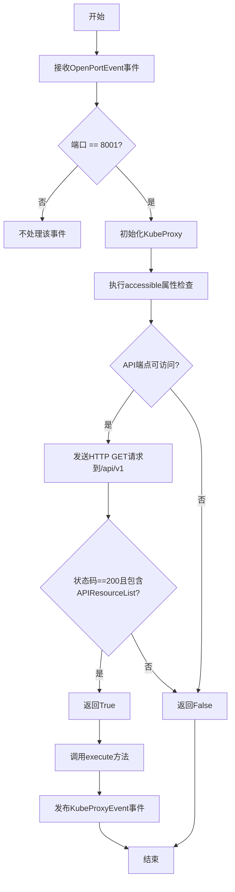
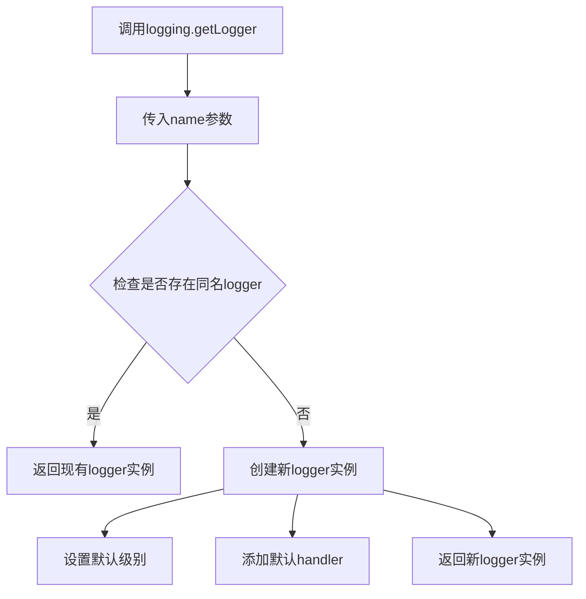
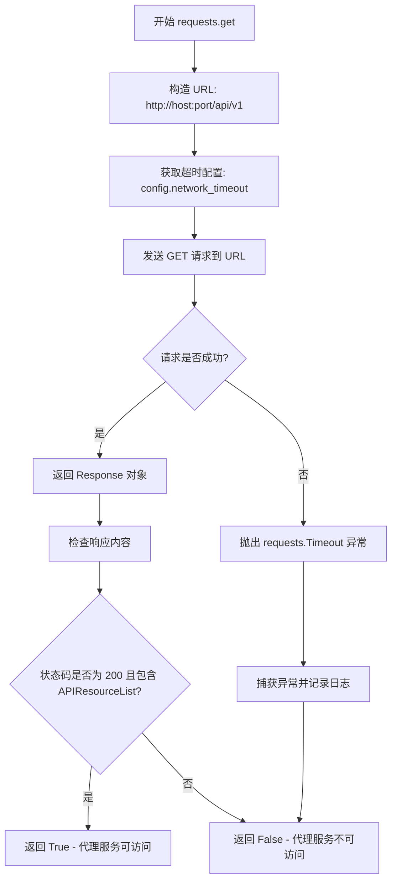
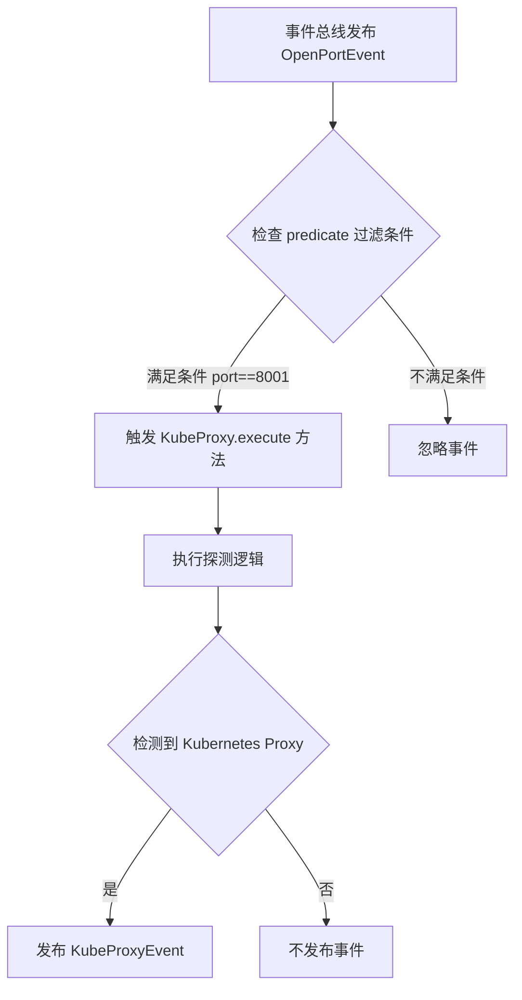
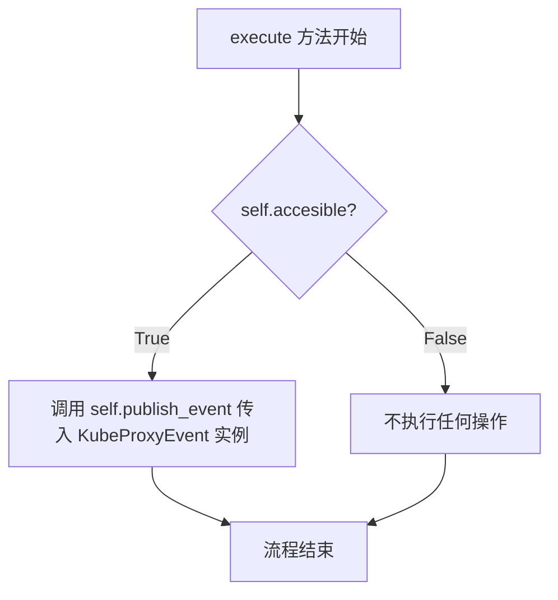
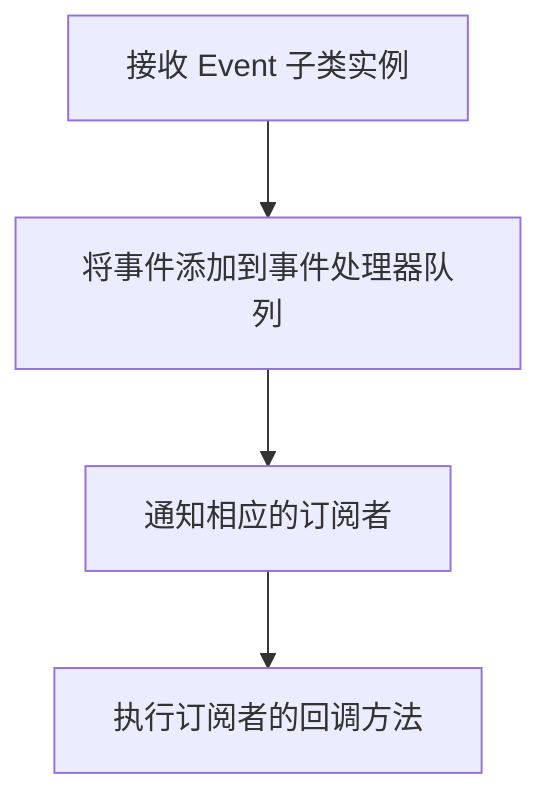
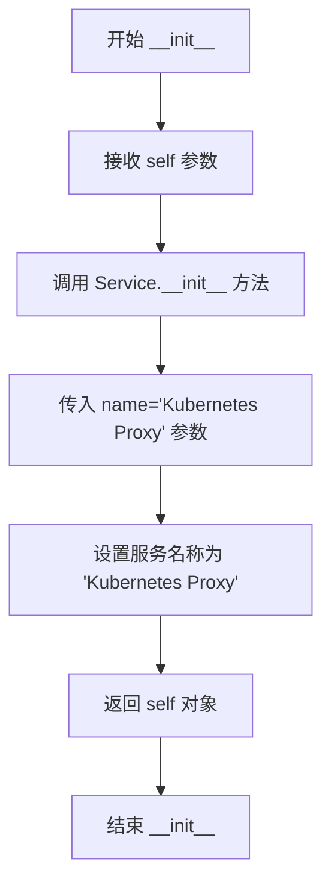
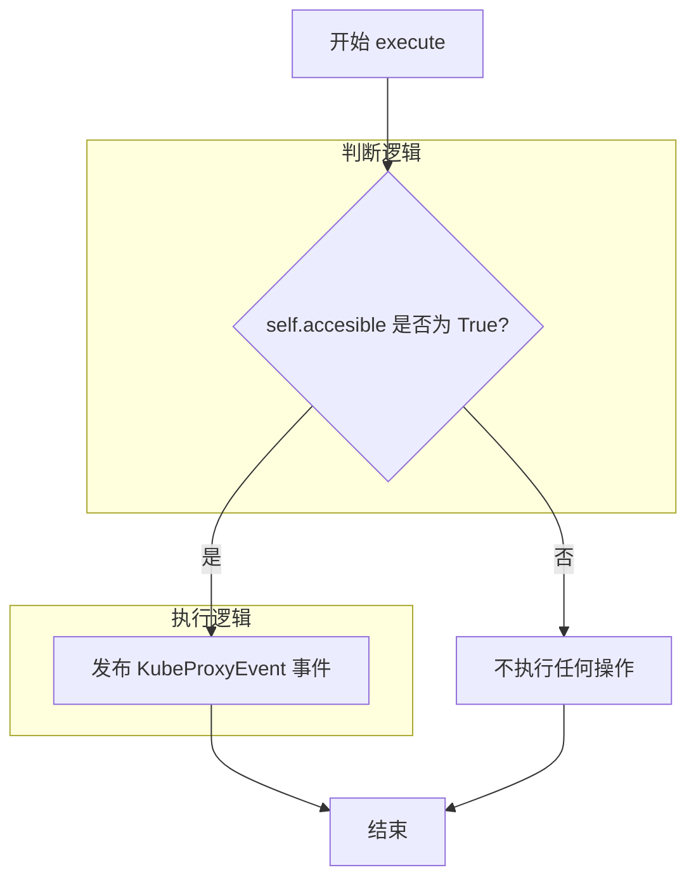

# `kubehunter\kube_hunter\modules\discovery\proxy.py` 详细设计文档

该代码是kube-hunter项目中的一个发现插件，用于检测Kubernetes API代理服务是否存在于目标主机的8001端口，通过HTTP请求验证API端点是否可访问，并发布相应的事件通知。

## 整体流程



## 类结构

```
Event (基类)
├── Service
└── KubeProxyEvent
Discovery (基类)
└── KubeProxy
```

## 全局变量及字段


### `logger`
    
模块级日志记录器，用于记录调试和错误信息

类型：`logging.Logger`
    


### `config`
    
kube-hunter全局配置对象，包含网络超时等配置

类型：`Any (from kube_hunter.conf)`
    


### `handler`
    
事件处理器，用于订阅和发布事件

类型：`EventHandler (from kube_hunter.core.events)`
    


### `KubeProxyEvent.name`
    
服务名称，继承自Service类，值为'Kubernetes Proxy'

类型：`str`
    


### `KubeProxy.event`
    
触发发现事件的OpenPortEvent对象

类型：`OpenPortEvent`
    


### `KubeProxy.host`
    
目标主机地址，从event.host获取

类型：`str`
    


### `KubeProxy.port`
    
目标端口，默认为8001或从event.port获取

类型：`int`
    


### `KubeProxy.accesible`
    
属性，检查Kubernetes API代理是否可访问，通过HTTP请求验证

类型：`bool`
    
    

## 全局函数及方法


### `logging.getLogger`

获取指定名称的日志记录器实例，用于记录应用程序的运行日志。

参数：

- `name`：`str`，日志记录器的名称，通常使用 `__name__` 变量，表示当前模块的完全限定名称

返回值：`Logger`，返回一个日志记录器对象，用于记录应用程序的日志信息

#### 流程图



#### 带注释源码

```python
logger = logging.getLogger(__name__)
# logging.getLogger: 获取指定名称的日志记录器
# __name__: Python内置变量，代表当前模块的名称
#   - 在kube_hunter/pro发现/kube_proxy.py中，__name__的值为"kube_hunter.pro发现.kube_proxy"
# 返回值: Logger对象，用于在该模块中记录日志
#   - 可以调用logger.debug(), logger.info(), logger.warning(), logger.error()等方法
#   - 日志级别从配置中读取，默认会向上传播到根logger
```


### `requests.get`

`requests.get` 是 Python `requests` 库中的 HTTP GET 请求函数，用于向指定的 URL 发送 GET 请求并获取响应。在该代码中，它用于探测 Kubernetes API 代理服务是否可访问，通过请求 `/api/v1` 端点并检查返回的响应内容来确认代理是否存在。

参数：

- `url`：`str`，要请求的完整 URL，在该代码中为 `http://{self.host}:{self.port}/api/v1` 格式的 Kubernetes API 端点地址
- `timeout`：`float`，请求超时时间，在该代码中取值为 `config.network_timeout`（配置文件中的网络超时设置）

返回值：`requests.Response`，HTTP 响应对象，包含状态码、响应文本等信息。在该代码中用于检查 `r.status_code == 200` 和 `"APIResourceList" in r.text` 以判断代理服务是否可用

#### 流程图



#### 带注释源码

```python
# requests.get 函数调用分析
# 以下代码位于 KubeProxy 类的 accesible 属性中

# 1. 构造 Kubernetes API 代理端点 URL
#    格式: http://{主机地址}:{端口}/api/v1
endpoint = f"http://{self.host}:{self.port}/api/v1"

# 2. 记录调试日志
logger.debug("Attempting to discover a proxy service")

# 3. 尝试发送 GET 请求
try:
    # 使用 requests.get 发送 HTTP GET 请求
    # 参数:
    #   - endpoint: 目标 URL (Kubernetes API 端点)
    #   - timeout: 请求超时时间 (从配置中读取)
    # 返回: requests.Response 对象
    r = requests.get(endpoint, timeout=config.network_timeout)
    
    # 4. 检查响应是否成功
    #    - 状态码为 200 (HTTP OK)
    #    - 响应文本中包含 "APIResourceList" (Kubernetes API 资源列表标识)
    if r.status_code == 200 and "APIResourceList" in r.text:
        return True  # 代理服务可访问
except requests.Timeout:
    # 5. 处理请求超时异常
    #    记录错误日志，包含异常详情
    logger.debug(f"failed to get {endpoint}", exc_info=True)

# 6. 默认返回 False (代理服务不可访问)
return False
```


### `handler.subscribe`

该函数是一个事件订阅装饰器，用于将事件处理器（类）注册到事件总线中。它接收一个事件类型和一个可选的 predicate 过滤函数，只有当事件满足过滤条件时，处理器才会被调用。

参数：

- `event`：`<class 'OpenPortEvent'>`，要订阅的事件类型，表示监听开放端口事件
- `predicate`：`<function>`，过滤谓词函数，用于筛选特定条件的事件（此处为 `lambda x: x.port == 8001`，即仅处理端口为 8001 的事件）

返回值：`<class>`，返回装饰后的类（`KubeProxy`），用于将事件处理器注册到事件总线的回调列表中

#### 流程图



#### 带注释源码

```python
# 导入事件处理器装饰器
from kube_hunter.core.events import handler

# 使用 subscribe 装饰器订阅 OpenPortEvent 事件
# 参数说明：
#   - 第一个参数 OpenPortEvent: 要订阅的事件类型，表示监听开放端口事件
#   - predicate 参数: 过滤谓词函数 lambda x: x.port == 8001
#     只有当事件的 port 属性等于 8001 时，才会触发 KubeProxy 类的执行
#   - 返回值是装饰后的 KubeProxy 类本身，用于将事件处理器注册到事件总线
@handler.subscribe(OpenPortEvent, predicate=lambda x: x.port == 8001)
class KubeProxy(Discovery):
    """Proxy Discovery
    Checks for the existence of a an open Proxy service
    """
```


### KubeProxy.execute

该方法通过检查指定端口（默认为 8001）上的 Kubernetes API 端点是否可访问，如果可访问则发布一个 KubeProxyEvent 事件，用于通知系统发现了 Kubernetes 代理服务。

参数：此方法无显式参数（使用类实例的属性 `self.event`、`self.host`、`self.port`）

返回值：`None`，无返回值

#### 流程图



#### 带注释源码

```python
def execute(self):
    """执行代理服务发现"""
    # 检查 accessible 属性（通过 API 端点验证代理是否可用）
    if self.accesible:
        # 如果代理可访问，发布 KubeProxyEvent 事件
        # publish_event 是从父类继承的方法，用于将事件发布到事件总线
        self.publish_event(KubeProxyEvent())
```

---

### self.publish_event 方法信息

由于 `publish_event` 方法在代码中没有直接定义（是从父类 `Discovery` 或相关基类继承而来），以下是基于其使用方式推断的信息：

#### 流程图



#### 推断的带注释源码

```python
def publish_event(self, event):
    """发布事件到事件总线
    
    参数:
        event: Event 子类的实例，如 KubeProxyEvent
        
    返回值:
        None，无返回值
    """
    # 将事件传递给事件处理器，由 handler.add_event() 或类似机制处理
    handler.add_event(event)
```


### `KubeProxyEvent.__init__`

该方法是 `KubeProxyEvent` 类的构造函数，用于初始化 Kubernetes Proxy 事件对象。它继承自 `Event` 和 `Service` 类，通过调用父类 `Service` 的初始化方法，设置服务名称为 "Kubernetes Proxy"，使该事件对象具备服务类型的基本属性。

参数：

- `self`：`KubeProxyEvent`，当前正在初始化的 KubeProxyEvent 实例对象

返回值：`None`，该方法不返回任何值，仅进行对象初始化操作

#### 流程图



#### 带注释源码

```python
def __init__(self):
    """
    初始化 KubeProxyEvent 实例
    
    该方法继承自 Event 和 Service 类，
    主要功能是调用父类 Service 的初始化方法，
    设置服务名称为 'Kubernetes Proxy'
    """
    # 调用父类 Service 的 __init__ 方法
    # 传入命名关键字参数 name，值为 "Kubernetes Proxy"
    # 用于标识该服务为 Kubernetes 代理服务
    Service.__init__(self, name="Kubernetes Proxy")
```


### `KubeProxy.execute`

该方法是 KubeProxy 类的核心执行方法，用于检测 Kubernetes API Server 的代理服务是否可访问，如果可访问则发布 KubeProxyEvent 事件。

参数：此方法无显式参数（隐式接收 self 实例）

返回值：`None`，无返回值，仅通过事件发布机制传递发现结果

#### 流程图



#### 带注释源码

```python
def execute(self):
    """执行代理服务发现流程
    
    检查当前主机上的 Kubernetes API 代理服务是否可访问，
    如果可访问则发布 KubeProxyEvent 事件通知其他组件。
    """
    # 判断属性 accesible（通过 property 装饰器计算）
    # 内部会尝试请求 http://{host}:{port}/api/v1 端点
    if self.accesible:
        # 当代理服务可访问时，创建并发布 KubeProxyEvent 事件
        # 该事件会被其他订阅者接收，处理发现的代理服务
        self.publish_event(KubeProxyEvent())
    # else: 如果不可访问，则不执行任何操作，符合静默失败的探测原则
```

## 关键组件


### KubeProxyEvent

事件类，继承自Event和Service，用于表示发现了一个Kubernetes API代理服务。当代理服务被成功发现时，会发布此事件。

### KubeProxy

主要的代理发现类，继承自Discovery，订阅OpenPortEvent事件。通过predicate筛选8001端口，尝试访问API端点来确认是否存在Kubernetes代理服务。

### accesible属性

通过HTTP请求检查代理服务是否可访问的属性方法。访问/api/v1端点，验证返回内容中是否包含"APIResourceList"来确认代理服务的可用性。

### execute方法

执行发现逻辑的方法。如果代理服务可访问，则发布KubeProxyEvent事件，通知系统发现了Kubernetes代理服务。


## 问题及建议


### 已知问题

-   拼写错误：`accesible`属性名应为`accessible`，影响代码可读性和维护性
-   异常处理不全面：仅捕获`requests.Timeout`，网络不稳定时可能抛出未处理的`requests.ConnectionError`、`requests.RequestException`等异常导致程序崩溃
-   资源未正确释放：`requests.get()`未使用上下文管理器或显式关闭连接，可能导致连接泄漏
-   重复网络请求：`accesible`作为@property每次访问都会发起HTTP请求，execute方法中如果多次访问该属性会造成重复探测
-   硬编码端口：虽然有默认值8001，但端口值缺乏配置灵活性
-   日志级别不当：请求超时时仅记录debug级别日志，可能导致关键错误信息丢失

### 优化建议

-   修正拼写错误：将`accesible`重命名为`accessible`
-   完善异常处理：捕获更广泛的异常类型，如`requests.exceptions.RequestException`
-   使用with语句或显式关闭：使用`requests.get(..., stream=False)`或确保响应对象被正确关闭
-   缓存探测结果：将`accesible`改为在`__init__`或首次访问时计算并缓存结果，避免重复请求
-   提取配置：将端口和超时时间等参数提取到配置模块，支持自定义
-   改进日志记录：考虑将超时错误提升为warning或info级别，并包含更多上下文信息
-   添加重试机制：对于临时性网络故障，可考虑添加简单的重试逻辑提高探测可靠性


## 其它


### 设计目标与约束

本模块的设计目标是通过检测8001端口（Kubernetes API代理常用端口）的开放情况，识别可能被利用的Kubernetes代理服务，以发现潜在的横向移动和权限提升风险。设计约束包括：仅检测特定端口（8001），不进行暴力破解或深度渗透，保持被动扫描特性，遵循kube-hunter的事件驱动架构。

### 错误处理与异常设计

代码采用静默失败策略，主要通过try-except捕获requests.Timeout异常，记录调试日志后返回False。对于其他可能的网络异常（如连接错误、SSL错误等）未做显式处理，会向上传播。KubeProxyEvent的创建在execute()内部，不抛出异常。整体错误处理粒度较粗，建议增加更细粒度的异常分类处理。

### 数据流与状态机

数据流为：OpenPortEvent(端口8001) → KubeProxy.__init__() → 访问性检查(accesible属性) → 判断结果 → 发布KubeProxyEvent()。状态机较简单，包含两个状态：初始状态（等待事件）和发现状态（检测到代理）。流程为：事件触发 → 检测执行 → 结果发布。

### 外部依赖与接口契约

外部依赖包括：requests库（HTTP请求）、logging模块（日志记录）、kube_hunter.conf.config（配置对象，提供network_timeout）、kube_hunter.core.events.handler（事件处理器）、kube_hunter.core.events.types（事件类型定义）、kube_hunter.core.types.Discovery（发现器基类）。接口契约：handler.subscribe装饰器注册OpenPortEvent监听，predicate指定端口8001过滤条件，execute()方法返回None，通过publish_event()发布结果事件。

### 安全性考虑

代码仅执行只读HTTP GET请求，不会对目标系统造成修改风险。使用config.network_timeout防止长时间挂起。日志记录避免敏感信息泄露，但需注意endpoint URL可能出现在日志中。建议增加User-Agent伪装，避免被简单识别。

### 性能考虑

请求使用timeout参数防止无限等待。accesible属性每次调用都会发起网络请求，如果多次访问会造成重复探测，建议缓存检测结果。仅在检测到8001端口开放时才触发，减少不必要的网络开销。

### 配置信息

主要配置项为config.network_timeout，控制HTTP请求超时时间，默认值由kube-hunter框架提供。该配置影响所有网络探测行为，过短可能导致误报，过长会影响扫描效率。

### 日志与监控

使用Python标准logging模块，日志级别为debug。成功检测时会发布KubeProxyEvent事件，可被其他模块订阅处理。失败时仅记录debug级别日志，不影响主流程。日志消息包含endpoint信息便于调试。

### 测试相关建议

建议补充的测试用例包括：模拟8001端口返回有效API响应、模拟8001端口返回无效响应、模拟超时异常、模拟非8001端口不触发检测、测试event对象属性传递正确性。可使用unittest.mock模拟requests.get返回值。

### 兼容性考虑

代码依赖Kubernetes API的/api/v1端点返回APIResourceList字段，这是标准Kubernetes API行为，兼容1.x版本系列。requests库支持Python 3.6+。对不同Kubernetes发行版（OpenShift等）的兼容性取决于API兼容性，整体兼容 性较好。

### 潜在的扩展方向

可扩展方向包括：支持更多代理端口检测、支持HTTPS检测、支持认证信息检测、集成CVE数据库进行版本漏洞关联、支持发现结果导出为多种格式、添加深度探测获取更多集群信息等。


    