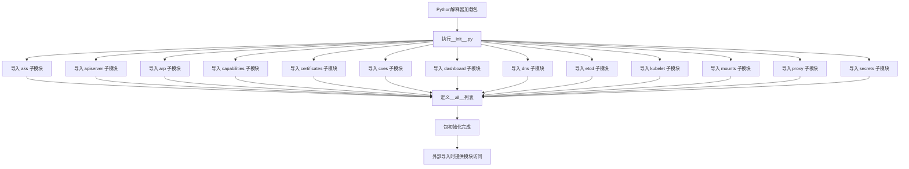

# `kubehunter\kube_hunter\modules\hunting\__init__.py` 详细设计文档

这是一个Kubernetes安全审计工具包的入口模块，通过统一导入和导出方式整合了13个核心安全检查子模块，包括AKS、API Server、ARP、Pod能力、证书、CVE漏洞、Dashboard、DNS、Etcd、Kubelet、挂载、代理和密钥等安全检查功能，为用户提供一站式的Kubernetes集群安全评估能力。

## 整体流程



## 类结构

```
k8s_audit_tool (主包)
├── __init__.py (入口模块)
├── aks (AKS安全检查模块)
├── apiserver (API Server安全检查模块)
├── arp (ARP安全检查模块)
├── capabilities (Pod能力检查模块)
├── certificates (证书安全检查模块)
├── cves (CVE漏洞检查模块)
├── dashboard (Dashboard安全检查模块)
├── dns (DNS安全检查模块)
├── etcd (Etcd安全检查模块)
├── kubelet (Kubelet安全检查模块)
├── mounts (挂载安全检查模块)
├── proxy (代理安全检查模块)
└── secrets (密钥安全检查模块)
```

## 全局变量及字段


### `__all__`
    
定义模块公开导出的子模块列表，包含13个安全检查模块

类型：`list`
    


    

## 全局函数及方法


## 关键组件


### 核心功能概述

该代码是一个Python包（cluster_handlers）的初始化文件，通过导入并公开暴露一系列子模块来提供Kubernetes集群安全审计和配置检查功能，涵盖API服务器、网络、身份认证、容器运行时、系统监控等核心集群组件。

### 文件整体运行流程

1. Python包导入时，首先执行`__init__.py`
2. 从当前包导入所有子模块（aks, apiserver, arp, capabilities, certificates, cves, dashboard, dns, etcd, kubelet, mounts, proxy, secrets）
3. 定义`__all__`列表，指定公开导出的模块
4. 外部代码可通过`from cluster_handlers import *`导入所有公开模块

### 关键组件信息

### aks

Azure Kubernetes Service (AKS) 相关功能模块，用于检查和验证AKS集群的配置与安全性。

### apiserver

Kubernetes API服务器模块，负责集群的API端点配置、安全策略和访问控制检查。

### arp

地址解析协议模块，用于验证网络层面的安全配置和ARP相关设置。

### capabilities

容器能力模块，检查容器的Linux capabilities配置，确保遵循最小权限原则。

### certificates

证书管理模块，验证集群中TLS证书的有效性和配置正确性。

### cves

公共漏洞披露模块，检测已知安全漏洞和风险。

### dashboard

Kubernetes Dashboard模块，检查Web UI界面的安全配置和访问控制。

### dns

域名服务模块，验证集群DNS配置的正确性和安全性。

### etcd

分布式键值存储模块，检查etcd数据存储的安全配置和加密设置。

### kubelet

节点代理模块，验证kubelet配置、认证授权和通信安全。

### mounts

挂载点模块，检查主机路径挂载和卷配置的安全性。

### proxy

代理模块，验证kube-proxy配置和网络代理规则。

### secrets

密钥管理模块，检查敏感信息存储和加密配置。

### 潜在的技术债务或优化空间

1. **模块组织方式**: 当前采用星号导入（import *），建议明确指定导入内容以提高代码可读性和 IDE 支持
2. **缺少错误处理**: 子模块导入时缺乏异常捕获机制，任一模块加载失败将导致整个包不可用
3. **文档缺失**: 各子模块的具体功能和返回值未在包级别进行文档化
4. **类型注解缺失**: 未使用类型提示（Type Hints）标注模块接口

### 其它项目

**设计目标与约束**: 提供统一的Kubernetes集群安全审计接口，模块化设计便于扩展新检查项

**错误处理与异常设计**: 当前无显式错误处理，建议为每个子模块添加导入失败时的友好错误信息

**外部依赖与接口契约**: 依赖Kubernetes Python客户端库（kubernetes-client），各子模块需遵循统一的检查接口规范


## 问题及建议


### 已知问题

-   **__all__ 赋值错误**：`__all__` 列表中直接引用了模块对象（变量），而非字符串形式。`__all__` 应包含模块名称的字符串列表，例如 `__all__ = ["aks", "apiserver", ...]`，而非直接引用模块对象。这会导致 `from . import *` 无法正确控制导出内容。
-   **重复定义维护性差**：导入列表和 `__all__` 列表内容完全相同但分别定义，增加维护成本。若新增模块，需在两处同时添加，容易遗漏。
-   **缺乏包文档**：该 `__init__.py` 缺少模块级文档字符串（docstring），无法说明该包的用途和组成。
-   **无版本信息**：未定义 `__version__` 或 `__author__` 等元数据字段。
-   **无异常处理**：直接导入所有子模块，若任意子模块导入失败，会导致整个包无法加载，缺乏容错机制。
-   **无延迟加载**：所有子模块均被立即导入，即使只使用部分功能也会触发全量导入，增加启动时间。

### 优化建议

-   修正 `__all__` 定义为字符串列表：使用字符串模块名填充 `__all__`，确保符合 Python 规范。
-   使用单一数据源：通过代码动态生成 `__all__`，避免重复定义，例如在导入时自动收集子模块名称。
-   添加包级文档字符串：描述该包的职责（如"Kubernetes 安全检查相关模块集合"）和主要功能。
-   考虑延迟加载：对于大型模块集合，可采用延迟导入策略，仅在访问时才加载对应子模块，提升导入性能。
-   添加错误处理：使用 try-except 包装导入语句，捕获并记录特定模块的导入错误，避免因单个模块问题导致整个包崩溃。
-   添加类型注解和版本信息：定义 `__version__` 并为包添加类型标注，提高可维护性和 IDE 支持。


## 其它


### 设计目标与约束

该代码是一个Kubernetes安全审计工具的模块集合，旨在对AKS、API Server、ARP、Pod能力、证书、CVE漏洞、Dashboard、DNS、Etcd、Kubelet、挂载、代理和Secret等核心组件进行安全检查。设计约束包括：1）模块化架构，每个子模块负责特定组件的检查；2）统一接口规范，所有检查模块遵循相同的调用模式；3）无外部运行时依赖，仅使用Python标准库。

### 错误处理与异常设计

该初始化文件本身不涉及复杂的错误处理逻辑。子模块应遵循以下异常设计原则：1）检查失败时返回结构化的错误对象而非抛出异常；2）使用自定义异常类区分不同类型的检查失败；3）所有公开方法应包含错误捕获机制，确保单个模块的失败不影响整体检查流程。

### 数据流与状态机

该模块作为入口点，通过__init__.py统一导出所有检查子模块。数据流为：导入子模块 → 调用各模块的安全检查方法 → 汇总检查结果。状态机表现为：初始化状态（导入模块）→ 就绪状态（模块可用）→ 执行状态（调用检查）→ 完成状态（返回结果）。

### 外部依赖与接口契约

该代码的外部依赖为Python标准库和同包内的子模块。接口契约包括：1）所有子模块必须实现安全检查接口；2）__all__列表定义了公开API，使用from包名import *时仅导入列表中的模块；3）子模块应提供一致的返回值格式，建议返回包含检查项、状态、详细信息的字典对象。

### 安全性考虑

该代码作为安全审计工具，自身安全性设计包括：1）最小化导入，仅暴露必要的子模块；2）使用__all__控制公开接口，防止内部实现泄露；3）子模块应避免敏感信息日志记录；4）处理Secrets等敏感组件时应采用只读方式，不进行实际修改操作。

### 性能考虑

初始化文件的性能影响主要在于首次导入时的模块加载时间。优化建议：1）采用延迟加载（lazy import）策略，仅在首次使用时加载子模块；2）如果性能是关键因素，可使用importlib进行动态导入；3）子模块的检查逻辑应支持并发执行以提升大规模集群的检查效率。

### 兼容性要求

该代码应保持Python 3.6+的兼容性，确保在各种Linux发行版和Kubernetes环境中运行。子模块应避免使用过于激进的语言特性，并考虑与主流Kubernetes版本的兼容性。

    