# `kubehunter\kube_hunter\modules\hunting\apiserver.py` 详细设计文档

这是一个Kubernetes安全漏洞检测模块，通过被动和主动两种方式探测API Server的安全风险。被动扫描检测API Server的可访问性、信息泄露（如命名空间、Pod、角色列表），主动扫描则尝试创建、修改、删除各种Kubernetes资源（命名空间、Pod、角色、集群角色）来验证潜在的攻击面和漏洞利用可能性。

## 整体流程

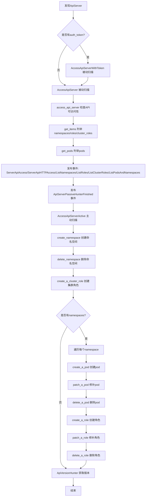
```mermaid
graph TD
    A[发现ApiServer] --> B{是否有auth_token?}
    B -- 否 --> C[AccessApiServer 被动扫描]
    B -- 是 --> D[AccessApiServerWithToken 被动扫描]
    C --> E[access_api_server 检查API可访问性]
    E --> F[get_items 列举namespaces/roles/cluster_roles]
    F --> G[get_pods 列举pods]
    G --> H[发布事件: ServerApiAccess/ServerApiHTTPAccess/ListNamespaces/ListRoles/ListClusterRoles/ListPodsAndNamespaces]
    H --> I[发布ApiServerPassiveHunterFinished事件]
    D --> C
    I --> J[AccessApiServerActive 主动扫描]
    J --> K[create_namespace 创建命名空间]
    K --> L[delete_namespace 删除命名空间]
    L --> M[create_a_cluster_role 创建集群角色]
    M --> N{是否有namespaces?}
    N -- 是 --> O[遍历每个namespace]
    O --> P[create_a_pod 创建pod]
    P --> Q[patch_a_pod 修补pod]
    Q --> R[delete_a_pod 删除pod]
    R --> S[create_a_role 创建角色]
    S --> T[patch_a_role 修补角色]
    T --> U[delete_a_role 删除角色]
    N -- 否 --> V[ApiVersionHunter 获取版本]
    V --> W[结束]
    U --> V
```

## 类结构

```
Event (基类)
├── Vulnerability
│   ├── ServerApiAccess
│   ├── ServerApiHTTPAccess
│   ├── ApiInfoDisclosure
│   │   ├── ListPodsAndNamespaces
 │   │   ├── ListNamespaces
 │   │   ├── ListRoles
 │   │   └── ListClusterRoles
 │   ├── CreateANamespace
 │   ├── DeleteANamespace
 │   ├── CreateARole
 │   ├── CreateAClusterRole
 │   ├── PatchARole
 │   ├── PatchAClusterRole
 │   ├── DeleteARole
 │   ├── DeleteAClusterRole
 │   ├── CreateAPod
 │   ├── CreateAPrivilegedPod
 │   ├── PatchAPod
 │   └── DeleteAPod
└── ApiServerPassiveHunterFinished
Hunter (基类)
├── AccessApiServer
│   └── AccessApiServerWithToken
├── AccessApiServerActive
└── ApiVersionHunter
```

## 全局变量及字段


### `logger`
    
Logger instance for the current module, used for logging debug and error messages

类型：`logging.Logger`
    


### `config`
    
Configuration object from kube_hunter.conf module, contains network_timeout and other settings

类型：`Config`
    


### `handler`
    
Event handler from kube_hunter.core.events, used for subscribing to and publishing events

类型：`EventHandler`
    


### `ServerApiAccess.evidence`
    
Evidence or data collected during the vulnerability check

类型：`Any`
    


### `ServerApiAccess.name`
    
Name of the vulnerability (e.g., 'Access to API using service account token' or 'Unauthenticated access to API')

类型：`str`
    


### `ServerApiAccess.category`
    
Category of vulnerability, either InformationDisclosure or UnauthenticatedAccess

类型：`Category`
    


### `ServerApiAccess.vid`
    
Vulnerability identifier, fixed as 'KHV005'

类型：`str`
    


### `ServerApiHTTPAccess.evidence`
    
Evidence or data collected during the vulnerability check

类型：`Any`
    


### `ServerApiHTTPAccess.name`
    
Name of the vulnerability, fixed as 'Insecure (HTTP) access to API'

类型：`str`
    


### `ServerApiHTTPAccess.category`
    
Category of vulnerability, UnauthenticatedAccess

类型：`Category`
    


### `ServerApiHTTPAccess.vid`
    
Vulnerability identifier, fixed as 'KHV006'

类型：`str`
    


### `ApiInfoDisclosure.evidence`
    
Evidence or data collected during the information disclosure check

类型：`Any`
    


### `ApiInfoDisclosure.name`
    
Name of the information disclosure vulnerability

类型：`str`
    


### `ApiInfoDisclosure.category`
    
Category of vulnerability, InformationDisclosure

类型：`Category`
    


### `ApiInfoDisclosure.vid`
    
Vulnerability identifier, fixed as 'KHV007'

类型：`str`
    


### `ListPodsAndNamespaces.evidence`
    
Evidence or data containing list of pods and their namespaces

类型：`Any`
    


### `ListPodsAndNamespaces.name`
    
Name of the vulnerability, fixed as 'Listing pods'

类型：`str`
    


### `ListPodsAndNamespaces.category`
    
Category of vulnerability, InformationDisclosure

类型：`Category`
    


### `ListPodsAndNamespaces.vid`
    
Vulnerability identifier, fixed as 'KHV007'

类型：`str`
    


### `ListNamespaces.evidence`
    
Evidence or data containing list of namespaces

类型：`Any`
    


### `ListNamespaces.name`
    
Name of the vulnerability, fixed as 'Listing namespaces'

类型：`str`
    


### `ListNamespaces.category`
    
Category of vulnerability, InformationDisclosure

类型：`Category`
    


### `ListNamespaces.vid`
    
Vulnerability identifier, fixed as 'KHV007'

类型：`str`
    


### `ListRoles.evidence`
    
Evidence or data containing list of roles

类型：`Any`
    


### `ListRoles.name`
    
Name of the vulnerability, fixed as 'Listing roles'

类型：`str`
    


### `ListRoles.category`
    
Category of vulnerability, InformationDisclosure

类型：`Category`
    


### `ListRoles.vid`
    
Vulnerability identifier, fixed as 'KHV007'

类型：`str`
    


### `ListClusterRoles.evidence`
    
Evidence or data containing list of cluster roles

类型：`Any`
    


### `ListClusterRoles.name`
    
Name of the vulnerability, fixed as 'Listing cluster roles'

类型：`str`
    


### `ListClusterRoles.category`
    
Category of vulnerability, InformationDisclosure

类型：`Category`
    


### `ListClusterRoles.vid`
    
Vulnerability identifier, fixed as 'KHV007'

类型：`str`
    


### `CreateANamespace.evidence`
    
Evidence or data about the created namespace

类型：`Any`
    


### `CreateANamespace.name`
    
Name of the vulnerability, fixed as 'Created a namespace'

类型：`str`
    


### `CreateANamespace.category`
    
Category of vulnerability, AccessRisk

类型：`Category`
    


### `CreateANamespace.vid`
    
Vulnerability identifier inherited from Vulnerability base class

类型：`str`
    


### `DeleteANamespace.evidence`
    
Evidence or data about the deleted namespace

类型：`Any`
    


### `DeleteANamespace.name`
    
Name of the vulnerability, fixed as 'Delete a namespace'

类型：`str`
    


### `DeleteANamespace.category`
    
Category of vulnerability, AccessRisk

类型：`Category`
    


### `DeleteANamespace.vid`
    
Vulnerability identifier inherited from Vulnerability base class

类型：`str`
    


### `CreateARole.evidence`
    
Evidence or data about the created role

类型：`Any`
    


### `CreateARole.name`
    
Name of the vulnerability, fixed as 'Created a role'

类型：`str`
    


### `CreateARole.category`
    
Category of vulnerability, AccessRisk

类型：`Category`
    


### `CreateARole.vid`
    
Vulnerability identifier inherited from Vulnerability base class

类型：`str`
    


### `CreateAClusterRole.evidence`
    
Evidence or data about the created cluster role

类型：`Any`
    


### `CreateAClusterRole.name`
    
Name of the vulnerability, fixed as 'Created a cluster role'

类型：`str`
    


### `CreateAClusterRole.category`
    
Category of vulnerability, AccessRisk

类型：`Category`
    


### `CreateAClusterRole.vid`
    
Vulnerability identifier inherited from Vulnerability base class

类型：`str`
    


### `PatchARole.evidence`
    
Evidence or data about the patched role

类型：`Any`
    


### `PatchARole.name`
    
Name of the vulnerability, fixed as 'Patched a role'

类型：`str`
    


### `PatchARole.category`
    
Category of vulnerability, AccessRisk

类型：`Category`
    


### `PatchARole.vid`
    
Vulnerability identifier inherited from Vulnerability base class

类型：`str`
    


### `PatchAClusterRole.evidence`
    
Evidence or data about the patched cluster role

类型：`Any`
    


### `PatchAClusterRole.name`
    
Name of the vulnerability, fixed as 'Patched a cluster role'

类型：`str`
    


### `PatchAClusterRole.category`
    
Category of vulnerability, AccessRisk

类型：`Category`
    


### `PatchAClusterRole.vid`
    
Vulnerability identifier inherited from Vulnerability base class

类型：`str`
    


### `DeleteARole.evidence`
    
Evidence or data about the deleted role

类型：`Any`
    


### `DeleteARole.name`
    
Name of the vulnerability, fixed as 'Deleted a role'

类型：`str`
    


### `DeleteARole.category`
    
Category of vulnerability, AccessRisk

类型：`Category`
    


### `DeleteARole.vid`
    
Vulnerability identifier inherited from Vulnerability base class

类型：`str`
    


### `DeleteAClusterRole.evidence`
    
Evidence or data about the deleted cluster role

类型：`Any`
    


### `DeleteAClusterRole.name`
    
Name of the vulnerability, fixed as 'Deleted a cluster role'

类型：`str`
    


### `DeleteAClusterRole.category`
    
Category of vulnerability, AccessRisk

类型：`Category`
    


### `DeleteAClusterRole.vid`
    
Vulnerability identifier inherited from Vulnerability base class

类型：`str`
    


### `CreateAPod.evidence`
    
Evidence or data about the created pod

类型：`Any`
    


### `CreateAPod.name`
    
Name of the vulnerability, fixed as 'Created A Pod'

类型：`str`
    


### `CreateAPod.category`
    
Category of vulnerability, AccessRisk

类型：`Category`
    


### `CreateAPod.vid`
    
Vulnerability identifier inherited from Vulnerability base class

类型：`str`
    


### `CreateAPrivilegedPod.evidence`
    
Evidence or data about the created privileged pod

类型：`Any`
    


### `CreateAPrivilegedPod.name`
    
Name of the vulnerability, fixed as 'Created A PRIVILEGED Pod'

类型：`str`
    


### `CreateAPrivilegedPod.category`
    
Category of vulnerability, AccessRisk

类型：`Category`
    


### `CreateAPrivilegedPod.vid`
    
Vulnerability identifier inherited from Vulnerability base class

类型：`str`
    


### `PatchAPod.evidence`
    
Evidence or data about the patched pod

类型：`Any`
    


### `PatchAPod.name`
    
Name of the vulnerability, fixed as 'Patched A Pod'

类型：`str`
    


### `PatchAPod.category`
    
Category of vulnerability, AccessRisk

类型：`Category`
    


### `PatchAPod.vid`
    
Vulnerability identifier inherited from Vulnerability base class

类型：`str`
    


### `DeleteAPod.evidence`
    
Evidence or data about the deleted pod

类型：`Any`
    


### `DeleteAPod.name`
    
Name of the vulnerability, fixed as 'Deleted A Pod'

类型：`str`
    


### `DeleteAPod.category`
    
Category of vulnerability, AccessRisk

类型：`Category`
    


### `DeleteAPod.vid`
    
Vulnerability identifier inherited from Vulnerability base class

类型：`str`
    


### `ApiServerPassiveHunterFinished.namespaces`
    
List of namespace names discovered from the API server

类型：`List[str]`
    


### `AccessApiServer.event`
    
The ApiServer event that triggered this hunter

类型：`ApiServer`
    


### `AccessApiServer.path`
    
Full URL path to the API server (e.g., https://host:port)

类型：`str`
    


### `AccessApiServer.headers`
    
HTTP headers to use for API requests, initially empty

类型：`Dict[str, str]`
    


### `AccessApiServer.with_token`
    
Boolean flag indicating whether a service account token is being used

类型：`bool`
    


### `AccessApiServerWithToken.event`
    
The ApiServer event that triggered this hunter

类型：`ApiServer`
    


### `AccessApiServerWithToken.path`
    
Full URL path to the API server (e.g., https://host:port)

类型：`str`
    


### `AccessApiServerWithToken.headers`
    
HTTP headers including Authorization Bearer token

类型：`Dict[str, str]`
    


### `AccessApiServerWithToken.with_token`
    
Boolean flag indicating token is being used, always True

类型：`bool`
    


### `AccessApiServerWithToken.category`
    
Category of vulnerability, InformationDisclosure

类型：`Category`
    


### `AccessApiServerActive.event`
    
Event containing namespaces discovered by the passive hunter

类型：`ApiServerPassiveHunterFinished`
    


### `AccessApiServerActive.path`
    
Full URL path to the API server (e.g., https://host:port)

类型：`str`
    


### `ApiVersionHunter.event`
    
The ApiServer event that triggered this hunter

类型：`ApiServer`
    


### `ApiVersionHunter.path`
    
Full URL path to the API server (e.g., https://host:port)

类型：`str`
    


### `ApiVersionHunter.session`
    
HTTP session with SSL verification disabled and optional auth token

类型：`requests.Session`
    
    

## 全局函数及方法


### `logging.getLogger`

获取或创建一个与指定名称关联的 Logger 对象，用于记录日志。

参数：

- `name`：`str`，日志记录器的名称，通常使用 `__name__` 变量（当前模块的完整路径），用于标识日志来源

返回值：`logging.Logger`，返回一个 Logger 对象实例，用于记录日志消息

#### 流程图

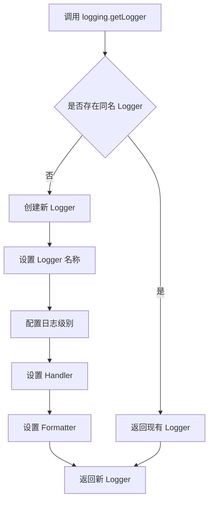
```mermaid
flowchart TD
    A[调用 logging.getLogger] --> B{是否存在同名 Logger}
    B -->|是| C[返回现有 Logger]
    B -->|否| D[创建新 Logger]
    D --> E[设置 Logger 名称]
    E --> F[配置日志级别]
    F --> G[设置 Handler]
    G --> H[设置 Formatter]
    H --> I[返回新 Logger]
    C --> I
```

#### 带注释源码

```python
# 导入 logging 模块以使用日志功能
import logging

# 使用 logging.getLogger(__name__) 获取当前模块的 Logger 实例
# 参数 __name__ 是 Python 内置变量，代表当前模块的全路径（如 'kube_hunter.modules.discovery.apiserver'）
# 这样做的好处是：
# 1. 可以根据模块名区分不同来源的日志
# 2. Logger 会继承根 Logger 的配置
# 3. 避免重复创建同名的 Logger，提高性能
logger = logging.getLogger(__name__)

# 后续代码中使用 logger.debug(), logger.error() 等方法记录不同级别的日志
# 例如：
# logger.debug(f"Passive Hunter is attempting to access the API at {self.path}")
# logger.error(f"Created pod {pod_name} in namespace {namespace} but unable to delete it")
```

#### 详细说明

| 属性 | 值 |
|------|-----|
| 函数名 | `logging.getLogger` |
| 所属模块 | `logging` (Python 标准库) |
| 参数名 | `name` |
| 参数类型 | `str` |
| 参数描述 | 日志记录器的名称，通常传入 `__name__` 来获取当前模块的 Logger |
| 返回值类型 | `logging.Logger` |
| 返回值描述 | 返回一个 Logger 对象，用于记录日志 |

#### 使用场景

在 kube-hunter 项目中，`logger` 全局变量用于：
1. 调试信息记录（`logger.debug`）- 如访问 API 的尝试
2. 错误信息记录（`logger.error`）- 如删除资源失败的情况
3. 通过统一的日志格式输出，便于问题排查和安全审计


### AccessApiServer.get_items

该方法用于从 Kubernetes API 服务器获取资源列表（如命名空间、角色等），通过调用 `json.loads` 将 API 响应的 JSON 字符串解析为 Python 字典对象。

参数：

- `path`：`str`，API 端点的完整路径，用于指定要查询的资源类型和位置

返回值：`list` 或 `None`，成功时返回资源名称列表，失败时返回 `None`

#### 流程图

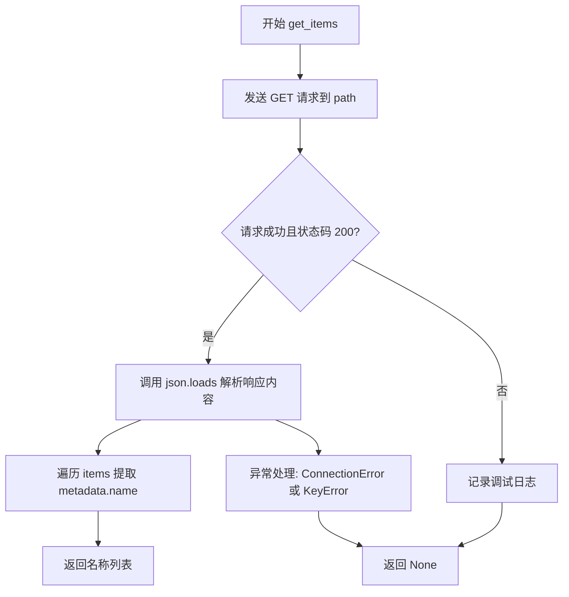
```mermaid
flowchart TD
    A[开始 get_items] --> B[发送 GET 请求到 path]
    B --> C{请求成功且状态码 200?}
    C -->|是| D[调用 json.loads 解析响应内容]
    D --> E[遍历 items 提取 metadata.name]
    E --> F[返回名称列表]
    C -->|否| G[记录调试日志]
    G --> H[返回 None]
    D --> I[异常处理: ConnectionError 或 KeyError]
    I --> H
```

#### 带注释源码

```python
def get_items(self, path):
    try:
        items = []
        # 发送 GET 请求到指定的 API 路径
        r = requests.get(path, headers=self.headers, verify=False, timeout=config.network_timeout)
        if r.status_code == 200:
            # 关键：使用 json.loads 将响应内容（字节）解析为 Python 字典
            resp = json.loads(r.content)
            for item in resp["items"]:
                items.append(item["metadata"]["name"])
            return items
        logger.debug(f"Got HTTP {r.status_code} respone: {r.text}")
    except (requests.exceptions.ConnectionError, KeyError):
        logger.debug(f"Failed retrieving items from API server at {path}")

    return None
```

---

### AccessApiServer.get_pods

该方法用于获取 Kubernetes 集群中的 Pod 列表，通过调用 `json.loads` 将 API 响应的 JSON 字符串解析为 Python 字典对象，并提取 Pod 的名称和命名空间信息。

参数：

- `namespace`：`str` 或 `None`，可选参数，指定要查询的命名空间，为 `None` 时查询所有命名空间的 Pod

返回值：`list` 或 `None`，成功时返回包含 `{"name": str, "namespace": str}` 的字典列表，失败时返回 `None`

#### 流程图

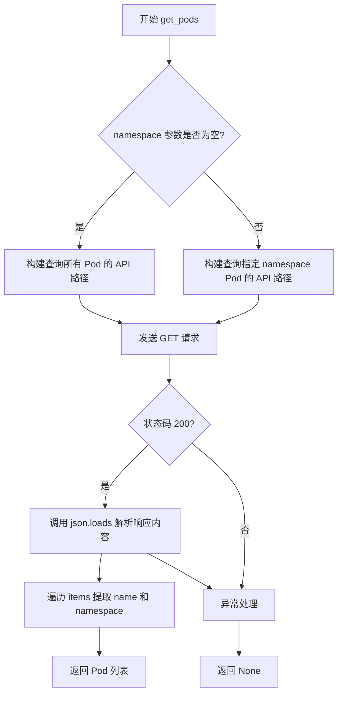
```mermaid
flowchart TD
    A[开始 get_pods] --> B{namespace 参数是否为空?}
    B -->|是| C[构建查询所有 Pod 的 API 路径]
    B -->|否| D[构建查询指定 namespace Pod 的 API 路径]
    C --> E[发送 GET 请求]
    D --> E
    E --> F{状态码 200?}
    F -->|是| G[调用 json.loads 解析响应内容]
    G --> H[遍历 items 提取 name 和 namespace]
    H --> I[返回 Pod 列表]
    F -->|否| J[异常处理]
    J --> K[返回 None]
    G --> J
```

#### 带注释源码

```python
def get_pods(self, namespace=None):
    pods = []
    try:
        if not namespace:
            # 查询所有命名空间的 Pod
            r = requests.get(
                f"{self.path}/api/v1/pods", headers=self.headers, verify=False, timeout=config.network_timeout,
            )
        else:
            # 查询指定命名空间的 Pod
            r = requests.get(
                f"{self.path}/api/v1/namespaces/{namespace}/pods",
                headers=self.headers,
                verify=False,
                timeout=config.network_timeout,
            )
        if r.status_code == 200:
            # 关键：使用 json.loads 将响应内容解析为 Python 字典
            resp = json.loads(r.content)
            for item in resp["items"]:
                # 提取 Pod 名称并进行 ASCII 编码处理
                name = item["metadata"]["name"].encode("ascii", "ignore")
                namespace = item["metadata"]["namespace"].encode("ascii", "ignore")
                pods.append({"name": name, "namespace": namespace})
            return pods
    except (requests.exceptions.ConnectionError, KeyError):
        pass
    return None
```

---

### AccessApiServerActive.create_item

该方法用于在 Kubernetes API 服务器上创建资源（如 Pod、Namespace、Role 等），通过调用 `json.loads` 将创建操作的响应 JSON 字符串解析为 Python 字典对象，以提取新创建资源的元数据名称。

参数：

- `path`：`str`，API 端点路径，指定要创建的资源类型和位置
- `data`：`str`，要创建的资源的 JSON 格式数据

返回值：`str` 或 `None`，成功时返回新创建资源的名称，失败时返回 `None`

#### 流程图

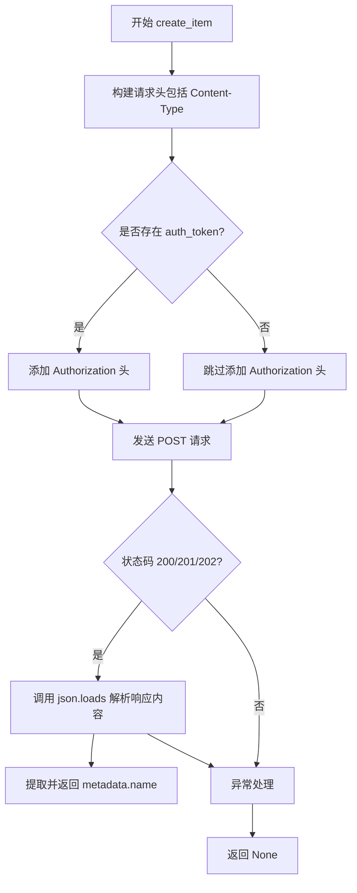
```mermaid
flowchart TD
    A[开始 create_item] --> B[构建请求头包括 Content-Type]
    B --> C{是否存在 auth_token?}
    C -->|是| D[添加 Authorization 头]
    C -->|否| E[跳过添加 Authorization 头]
    D --> F[发送 POST 请求]
    E --> F
    F --> G{状态码 200/201/202?}
    G -->|是| H[调用 json.loads 解析响应内容]
    H --> I[提取并返回 metadata.name]
    G -->|否| J[异常处理]
    J --> K[返回 None]
    H --> J
```

#### 带注释源码

```python
def create_item(self, path, data):
    headers = {"Content-Type": "application/json"}
    if self.event.auth_token:
        headers["Authorization"] = f"Bearer {self.event.auth_token}"

    try:
        # 发送 POST 请求创建资源
        res = requests.post(path, verify=False, data=data, headers=headers, timeout=config.network_timeout)
        if res.status_code in [200, 201, 202]:
            # 关键：使用 json.loads 解析创建操作响应的 JSON 内容
            parsed_content = json.loads(res.content)
            return parsed_content["metadata"]["name"]
    except (requests.exceptions.ConnectionError, KeyError):
        pass
    return None
```

---

### AccessApiServerActive.patch_item

该方法用于对 Kubernetes API 服务器上的资源进行 PATCH 操作，通过调用 `json.loads` 将 PATCH 操作的响应 JSON 字符串解析为 Python 字典对象，以提取资源的命名空间信息。

参数：

- `path`：`str`，API 端点路径，指定要修补的资源
- `data`：`str`，PATCH 操作的 JSON 数据

返回值：`str` 或 `None`，成功时返回资源的命名空间，失败时返回 `None`

#### 流程图

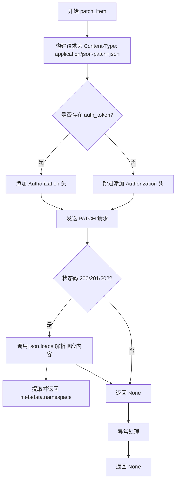
```mermaid
flowchart TD
    A[开始 patch_item] --> B[构建请求头 Content-Type: application/json-patch+json]
    B --> C{是否存在 auth_token?}
    C -->|是| D[添加 Authorization 头]
    C -->|否| E[跳过添加 Authorization 头]
    D --> F[发送 PATCH 请求]
    E --> F
    F --> G{状态码 200/201/202?}
    G -->|是| H[调用 json.loads 解析响应内容]
    H --> I[提取并返回 metadata.namespace]
    G -->|否| J[返回 None]
    H --> J
    J --> K[异常处理]
    K --> L[返回 None]
```

#### 带注释源码

```python
def patch_item(self, path, data):
    headers = {"Content-Type": "application/json-patch+json"}
    if self.event.auth_token:
        headers["Authorization"] = f"Bearer {self.event.auth_token}"
    try:
        # 发送 PATCH 请求修补资源
        res = requests.patch(path, headers=headers, verify=False, data=data, timeout=config.network_timeout)
        if res.status_code not in [200, 201, 202]:
            return None
        # 关键：使用 json.loads 解析 PATCH 操作响应的 JSON 内容
        parsed_content = json.loads(res.content)
        # TODO is there a patch timestamp we could use?
        return parsed_content["metadata"]["namespace"]
    except (requests.exceptions.ConnectionError, KeyError):
        pass
    return None
```

---

### AccessApiServerActive.delete_item

该方法用于删除 Kubernetes API 服务器上的资源，通过调用 `json.loads` 将删除操作的响应 JSON 字符串解析为 Python 字典对象，以提取资源的删除时间戳信息。

参数：

- `path`：`str`，API 端点路径，指定要删除的资源的完整路径

返回值：`str` 或 `None`，成功时返回资源的 `deletionTimestamp`，失败时返回 `None`

#### 流程图

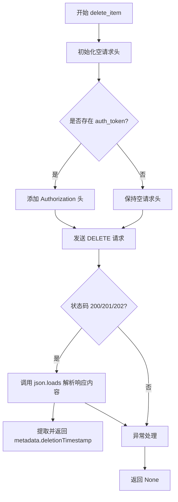
```mermaid
flowchart TD
    A[开始 delete_item] --> B[初始化空请求头]
    B --> C{是否存在 auth_token?}
    C -->|是| D[添加 Authorization 头]
    C -->|否| E[保持空请求头]
    D --> F[发送 DELETE 请求]
    E --> F
    F --> G{状态码 200/201/202?}
    G -->|是| H[调用 json.loads 解析响应内容]
    H --> I[提取并返回 metadata.deletionTimestamp]
    G -->|否| J[异常处理]
    J --> K[返回 None]
    H --> J
```

#### 带注释源码

```python
def delete_item(self, path):
    headers = {}
    if self.event.auth_token:
        headers["Authorization"] = f"Bearer {self.event.auth_token}"
    try:
        # 发送 DELETE 请求删除资源
        res = requests.delete(path, headers=headers, verify=False, timeout=config.network_timeout)
        if res.status_code in [200, 201, 202]:
            # 关键：使用 json.loads 解析删除操作响应的 JSON 内容
            parsed_content = json.loads(res.content)
            return parsed_content["metadata"]["deletionTimestamp"]
    except (requests.exceptions.ConnectionError, KeyError):
        pass
    return None
```

---

### 汇总信息

`json.loads` 在该代码中一共使用了 **5 次**，主要用于以下场景：

| 方法 | 使用位置 | 解析对象 | 提取字段 |
|------|----------|----------|----------|
| `AccessApiServer.get_items` | 第 217 行 | API 列表响应 | `items[].metadata.name` |
| `AccessApiServer.get_pods` | 第 233 行 | Pod 列表响应 | `items[].metadata.name/namespace` |
| `AccessApiServerActive.create_item` | 第 317 行 | 资源创建响应 | `metadata.name` |
| `AccessApiServerActive.patch_item` | 第 329 行 | 资源修补响应 | `metadata.namespace` |
| `AccessApiServerActive.delete_item` | 第 342 行 | 资源删除响应 | `metadata.deletionTimestamp` |

**潜在技术债务**：
- 重复的 `json.loads` 调用逻辑可以考虑封装为通用的响应解析方法
- 错误处理中使用 `pass` 静默吞异常，不利于问题排查
- `patch_item` 中的 `TODO` 注释表明有功能未完成


### `json.dumps`

将 Python 对象序列化为 JSON 格式的字符串。在 kube-hunter 代码中用于将 Python 字典序列化为 JSON 字符串，以便通过 HTTP 请求发送给 Kubernetes API Server。

参数：

- `obj`：任意 Python 对象，要序列化为 JSON 的对象（通常是字典）
- `skipkeys`：布尔值，是否跳过非基本类型（如果为 True，则非基本类型的键将被跳过而不是抛出异常）
- `ensure_ascii`：布尔值，是否对非 ASCII 字符进行转义
- `indent`：整数或字符串，用于缩进的空格数或字符串
- `separators`：元组，用于分隔键值对的分隔符
- `sort_keys`：布尔值，是否按键排序输出

返回值：`str`，JSON 格式的字符串表示

#### 流程图

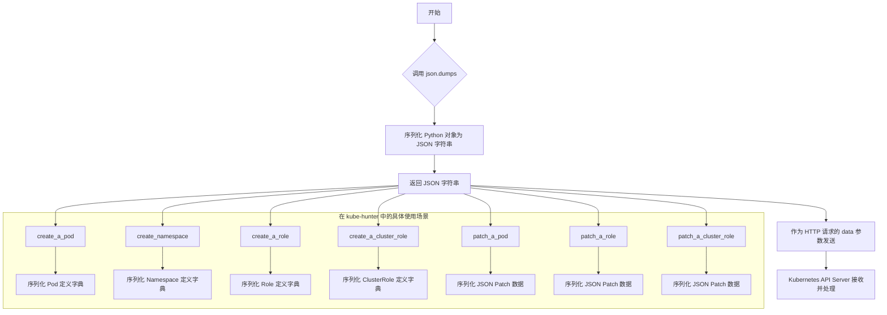
```mermaid
flowchart TD
    A[开始] --> B{调用 json.dumps}
    B --> C[序列化 Python 对象为 JSON 字符串]
    C --> D[返回 JSON 字符串]
    D --> E[作为 HTTP 请求的 data 参数发送]
    E --> F[Kubernetes API Server 接收并处理]
    
    subgraph "在 kube-hunter 中的具体使用场景"
    G[create_a_pod] --> H[序列化 Pod 定义字典]
    I[create_namespace] --> J[序列化 Namespace 定义字典]
    K[create_a_role] --> L[序列化 Role 定义字典]
    M[create_a_cluster_role] --> N[序列化 ClusterRole 定义字典]
    O[patch_a_pod] --> P[序列化 JSON Patch 数据]
    Q[patch_a_role] --> R[序列化 JSON Patch 数据]
    S[patch_a_cluster_role] --> T[序列化 JSON Patch 数据]
    end
    
    D --> G
    D --> I
    D --> K
    D --> M
    D --> O
    D --> Q
    D --> S
```

#### 带注释源码

```
# json.dumps 是 Python 标准库 json 模块中的函数
# 用于将 Python 对象序列化为 JSON 格式的字符串

# 在 kube-hunter 中，json.dumps 主要用于以下场景：

# 1. 创建 Pod 时序列化 Pod 定义
pod = {
    "apiVersion": "v1",
    "kind": "Pod",
    "metadata": {"name": random_name},
    "spec": {
        "containers": [
            {"name": random_name, "image": "nginx:1.7.9", "ports": [{"containerPort": 80}], **privileged_value}
        ]
    },
}
# 将 Python 字典序列化为 JSON 字符串，作为 HTTP POST 请求的 body
return self.create_item(path=f"{self.path}/api/v1/namespaces/{namespace}/pods", data=json.dumps(pod))

# 2. 创建 Namespace 时序列化 Namespace 定义
data = {
    "kind": "Namespace",
    "apiVersion": "v1",
    "metadata": {"name": random_name, "labels": {"name": random_name}},
}
return self.create_item(path=f"{self.path}/api/v1/namespaces", data=json.dumps(data))

# 3. 创建 Role 时序列化 Role 定义
role = {
    "kind": "Role",
    "apiVersion": "rbac.authorization.k8s.io/v1",
    "metadata": {"namespace": namespace, "name": name},
    "rules": [{"apiGroups": [""], "resources": ["pods"], "verbs": ["get", "watch", "list"]}],
}
return self.create_item(
    path=f"{self.path}/apis/rbac.authorization.k8s.io/v1/namespaces/{namespace}/roles", data=json.dumps(role),
)

# 4. 创建 ClusterRole 时序列化 ClusterRole 定义
cluster_role = {
    "kind": "ClusterRole",
    "apiVersion": "rbac.authorization.k8s.io/v1",
    "metadata": {"name": name},
    "rules": [{"apiGroups": [""], "resources": ["pods"], "verbs": ["get", "watch", "list"]}],
}
return self.create_item(
    path=f"{self.path}/apis/rbac.authorization.k8s.io/v1/clusterroles", data=json.dumps(cluster_role),
)

# 5. Patch 操作时序列化 JSON Patch 数据（RFC 6902）
data = [{"op": "add", "path": "/hello", "value": ["world"]}]
return self.patch_item(
    path=f"{self.path}/api/v1/namespaces/{namespace}/pods/{pod_name}", data=json.dumps(data),
)
```


### `requests.get`

用于向Kubernetes API Server发送GET请求，获取API资源信息。

参数：

-  `url`：`str`，请求的URL地址，例如 `f"{self.path}/api"` 或 `f"{self.path}/api/v1/pods"`
-  `headers`：`dict`，HTTP请求头，用于传递认证信息（如Bearer token）
-  `verify`：`bool`，是否验证SSL证书，此处设置为`False`
-  `timeout`：`int`，请求超时时间，从`config.network_timeout`获取

返回值：`requests.Response`，HTTP响应对象，包含状态码和响应内容

#### 流程图

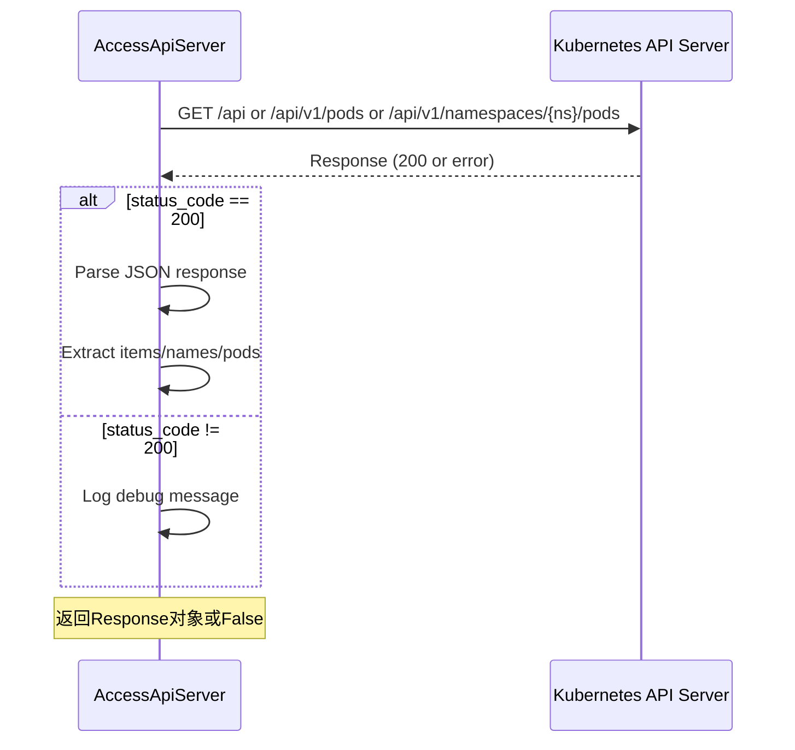
```mermaid
sequenceDiagram
    participant Client as AccessApiServer
    participant API as Kubernetes API Server
    
    Client->>API: GET /api or /api/v1/pods or /api/v1/namespaces/{ns}/pods
    API-->>Client: Response (200 or error)
    
    alt status_code == 200
        Client->>Client: Parse JSON response
        Client->>Client: Extract items/names/pods
    else status_code != 200
        Client->>Client: Log debug message
    end
    
    Note over Client: 返回Response对象或False
```

#### 带注释源码

```python
# 在 AccessApiServer 类的 access_api_server 方法中
def access_api_server(self):
    """尝试访问API Server的/api端点"""
    logger.debug(f"Passive Hunter is attempting to access the API at {self.path}")
    try:
        # 发送GET请求到API端点
        # 参数说明：
        # - url: API路径 (例如 https://kubernetes:6443/api)
        # - headers: 请求头（可能包含认证Token）
        # - verify: False表示不验证SSL证书（用于测试环境）
        # - timeout: 网络超时时间
        r = requests.get(f"{self.path}/api", headers=self.headers, verify=False, timeout=config.network_timeout)
        
        # 检查响应状态码和内容
        if r.status_code == 200 and r.content:
            return r.content  # 返回API响应内容
    except requests.exceptions.ConnectionError:
        pass  # 连接失败时静默处理
    return False  # 返回False表示访问失败


# 在 AccessApiServer 类的 get_items 方法中
def get_items(self, path):
    """获取Kubernetes资源列表（如namespaces, roles等）"""
    try:
        items = []
        # 发送GET请求获取资源列表
        r = requests.get(path, headers=self.headers, verify=False, timeout=config.network_timeout)
        
        if r.status_code == 200:
            # 解析JSON响应
            resp = json.loads(r.content)
            # 提取每个资源的metadata.name
            for item in resp["items"]:
                items.append(item["metadata"]["name"])
            return items  # 返回资源名称列表
        
        # 记录非200状态码的响应
        logger.debug(f"Got HTTP {r.status_code} respone: {r.text}")
    except (requests.exceptions.ConnectionError, KeyError):
        # 连接错误或JSON解析错误时记录日志
        logger.debug(f"Failed retrieving items from API server at {path}")

    return None  # 失败时返回None


# 在 AccessApiServer 类的 get_pods 方法中
def get_pods(self, namespace=None):
    """获取Pod列表，可指定namespace"""
    pods = []
    try:
        if not namespace:
            # 获取所有namespaces的pods
            r = requests.get(
                f"{self.path}/api/v1/pods", headers=self.headers, verify=False, timeout=config.network_timeout,
            )
        else:
            # 获取指定namespace的pods
            r = requests.get(
                f"{self.path}/api/v1/namespaces/{namespace}/pods",
                headers=self.headers,
                verify=False,
                timeout=config.network_timeout,
            )
        
        if r.status_code == 200:
            # 解析JSON响应
            resp = json.loads(r.content)
            # 提取每个pod的name和namespace
            for item in resp["items"]:
                name = item["metadata"]["name"].encode("ascii", "ignore")
                namespace = item["metadata"]["namespace"].encode("ascii", "ignore")
                pods.append({"name": name, "namespace": namespace})
            return pods  # 返回pod列表
    
    except (requests.exceptions.ConnectionError, KeyError):
        pass  # 静默处理错误
    
    return None  # 失败时返回None
```


### `requests.post`

`requests.post` 是 Python `requests` 库中的函数，用于发送 HTTP POST 请求。在此代码中，它被用于向 Kubernetes API Server 发送创建资源（如 Pod、Namespace、Role 等）的请求。

参数：

- `url`：`str`，请求的目标 URL，在代码中为 Kubernetes API 路径（如 `{self.path}/api/v1/namespaces`）
- `data`：`str`，要发送的请求体数据，通常为 JSON 格式的字符串
- `headers`：`dict`，请求头，包含 Content-Type、Authorization 等信息
- `verify`：`bool`，是否验证 SSL 证书，代码中设为 `False`
- `timeout`：`float`，请求超时时间，从 `config.network_timeout` 获取

返回值：`requests.Response`，服务器响应对象，包含状态码和响应内容

#### 流程图

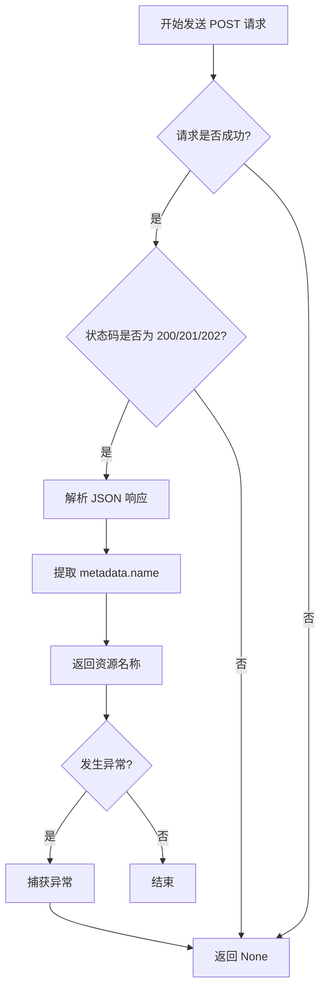
```mermaid
flowchart TD
    A[开始发送 POST 请求] --> B{请求是否成功?}
    B -->|是| C{状态码是否为 200/201/202?}
    B -->|否| D[返回 None]
    C -->|是| E[解析 JSON 响应]
    C -->|否| D
    E --> F[提取 metadata.name]
    F --> G[返回资源名称]
    G --> H{发生异常?}
    H -->|是| I[捕获异常]
    I --> D
    H -->|否| J[结束]
```

#### 带注释源码

```python
# 在 AccessApiServerActive 类中定义的方法
def create_item(self, path, data):
    # 设置默认请求头 Content-Type 为 JSON
    headers = {"Content-Type": "application/json"}
    
    # 如果存在认证令牌，则添加到请求头中
    if self.event.auth_token:
        headers["Authorization"] = f"Bearer {self.event.auth_token}"

    try:
        # 发送 POST 请求到指定的 API 路径
        # 参数说明：
        #   path: Kubernetes API 端点 URL
        #   verify=False: 不验证 SSL 证书（用于测试环境）
        #   data: JSON 格式的请求体数据
        #   headers: 包含 Content-Type 和 Authorization 的请求头
        #   timeout: 网络请求超时时间
        res = requests.post(
            path, 
            verify=False, 
            data=data, 
            headers=headers, 
            timeout=config.network_timeout
        )
        
        # 检查响应状态码是否为成功状态 (200, 201, 或 202)
        if res.status_code in [200, 201, 202]:
            # 解析响应内容为 JSON
            parsed_content = json.loads(res.content)
            # 返回创建的资源的名称（从 metadata 中提取）
            return parsed_content["metadata"]["name"]
    except (requests.exceptions.ConnectionError, KeyError):
        # 捕获连接错误和 JSON 解析错误
        pass
    
    # 如果请求失败或发生异常，返回 None
    return None
```


### `AccessApiServerActive.patch_item`

该方法是`AccessApiServerActive`类中的一个核心方法，负责通过HTTP PATCH请求向Kubernetes API Server发送JSON Patch数据，以测试是否能够修改集群中的资源（如Pod、Role等）。它构建请求头，发送PATCH请求，并根据响应状态码返回操作结果。

参数：

- `path`：`str`，目标API端点的完整URL路径
- `data`：`str`，JSON格式的Patch数据，用于描述要进行的修改操作

返回值：`Optional[str]`，如果PATCH请求成功（状态码为200/201/202），则返回被修改资源的namespace；否则返回`None`

#### 流程图

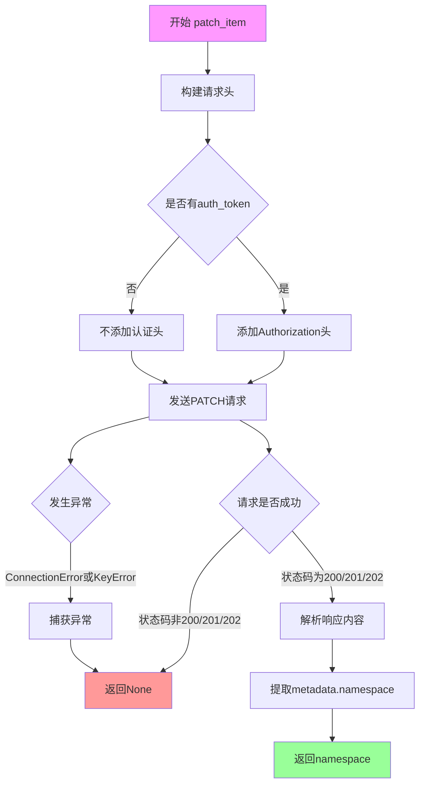
```mermaid
flowchart TD
    A[开始 patch_item] --> B[构建请求头]
    B --> C{是否有auth_token}
    C -->|是| D[添加Authorization头]
    C -->|否| E[不添加认证头]
    D --> F[发送PATCH请求]
    E --> F
    F --> G{请求是否成功}
    G -->|状态码非200/201/202| H[返回None]
    G -->|状态码为200/201/202| I[解析响应内容]
    I --> J[提取metadata.namespace]
    J --> K[返回namespace]
    
    F --> L{发生异常}
    L -->|ConnectionError或KeyError| M[捕获异常]
    M --> H
    
    style A fill:#f9f,color:#333
    style K fill:#9f9,color:#333
    style H fill:#f99,color:#333
```

#### 带注释源码

```python
def patch_item(self, path, data):
    """
    向Kubernetes API Server发送PATCH请求以修改资源
    
    参数:
        path: str - 目标API端点URL
        data: str - JSON格式的Patch数据
    
    返回:
        Optional[str] - 成功时返回namespace，失败时返回None
    """
    # 设置请求内容类型为JSON Patch格式
    headers = {"Content-Type": "application/json-patch+json"}
    
    # 如果存在认证令牌，则添加Authorization头
    if self.event.auth_token:
        headers["Authorization"] = f"Bearer {self.event.auth_token}"
    
    try:
        # 发送PATCH请求到指定的API端点
        # verify=False 禁用SSL证书验证（用于测试目的）
        # timeout=config.network_timeout 设置网络超时时间
        res = requests.patch(path, headers=headers, verify=False, data=data, timeout=config.network_timeout)
        
        # 检查响应状态码是否在成功范围内
        if res.status_code not in [200, 201, 202]:
            return None
        
        # 解析响应内容为JSON格式
        parsed_content = json.loads(res.content)
        
        # TODO is there a patch timestamp we could use?
        # 从响应中提取并返回被修改资源的namespace
        return parsed_content["metadata"]["namespace"]
    
    # 捕获可能的网络连接错误和JSON解析错误
    except (requests.exceptions.ConnectionError, KeyError):
        # 发生异常时静默失败，返回None
        pass
    
    return None
```


### `AccessApiServerActive.delete_item`

该方法用于通过 HTTP DELETE 请求删除 Kubernetes 集群中的指定资源（如命名空间、Pod、角色等），并返回资源的删除时间戳。

参数：

- `path`：`str`，要删除的 Kubernetes API 路径（如 `/api/v1/namespaces/{namespace}`）
- `headers`：`dict`，HTTP 请求头，包含可选的 Authorization 头（Bearer token）
- `verify`：`bool`，是否验证 SSL 证书，此处设为 `False`
- `timeout`：`int`，网络请求超时时间，从 `config.network_timeout` 获取

返回值：`Optional[str]`，如果删除成功返回资源的 `deletionTimestamp`；如果请求失败或发生异常则返回 `None`

#### 流程图

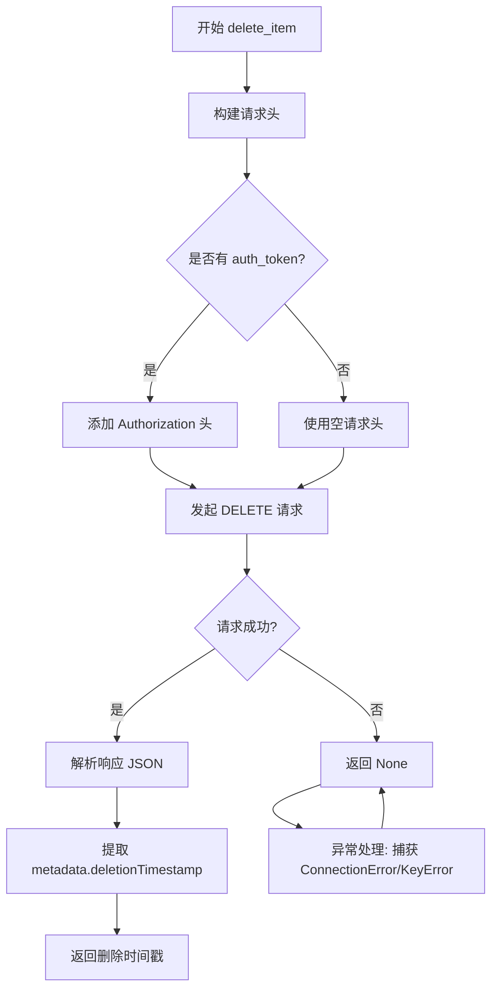
```mermaid
flowchart TD
    A[开始 delete_item] --> B[构建请求头]
    B --> C{是否有 auth_token?}
    C -->|是| D[添加 Authorization 头]
    C -->|否| E[使用空请求头]
    D --> F[发起 DELETE 请求]
    E --> F
    F --> G{请求成功?}
    G -->|否| H[返回 None]
    G -->|是| I[解析响应 JSON]
    I --> J[提取 metadata.deletionTimestamp]
    J --> K[返回删除时间戳]
    H --> L[异常处理: 捕获 ConnectionError/KeyError]
    L --> H
```

#### 带注释源码

```python
def delete_item(self, path):
    """
    向 Kubernetes API 发送 DELETE 请求删除指定资源
    
    Args:
        path: 要删除的资源的完整 API 路径
    
    Returns:
        如果删除成功返回 deletionTimestamp 字符串，否则返回 None
    """
    # 初始化空请求头
    headers = {}
    
    # 如果存在认证 token，则在请求头中添加 Bearer token
    if self.event.auth_token:
        headers["Authorization"] = f"Bearer {self.event.auth_token}"
    
    try:
        # 发起 DELETE 请求，不验证 SSL 证书，使用配置的超时时间
        res = requests.delete(path, headers=headers, verify=False, timeout=config.network_timeout)
        
        # 检查 HTTP 状态码是否为成功状态（200, 201, 202）
        if res.status_code in [200, 201, 202]:
            # 解析响应内容为 JSON
            parsed_content = json.loads(res.content)
            # 返回资源的删除时间戳
            return parsed_content["metadata"]["deletionTimestamp"]
    except (requests.exceptions.ConnectionError, KeyError):
        # 捕获连接错误和 JSON 解析键错误
        pass
    
    # 请求失败或发生异常时返回 None
    return None
```


### `uuid.uuid4`

uuid.uuid4 是一个用于生成随机UUID（通用唯一标识符）的函数，常用于在Kubernetes集群中创建随机且唯一的资源名称。

参数： 无

返回值：`uuid.UUID`，返回一个随机生成的UUID对象，通常用于生成唯一的标识符

#### 流程图

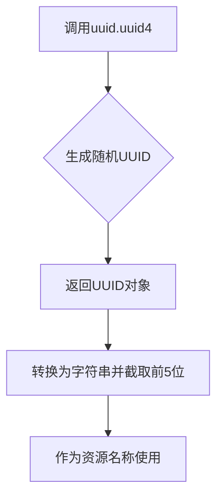
```mermaid
flowchart TD
    A[调用uuid.uuid4] --> B{生成随机UUID}
    B --> C[返回UUID对象]
    C --> D[转换为字符串并截取前5位]
    D --> E[作为资源名称使用]
```

#### 带注释源码

```python
# uuid.uuid4() 使用说明：
# Python标准库uuid模块中的uuid4函数用于生成随机UUID
# 在kube-hunter项目中，此函数被用于生成随机的Kubernetes资源名称
# 以避免命名冲突并确保每次创建的资源都有唯一标识

# 示例用法（在代码中的实际使用方式）：
random_name = str(uuid.uuid4())[0:5]  # 生成随机UUID并取前5个字符作为资源名称
# 例如：uuid.uuid4()可能返回 '6ba7b810-9dad-11d1-80b4-00c04fd430c8'
# 截取后得到 '6ba7b'

# 具体使用场景：
# 1. create_a_pod: 生成随机的Pod名称
# 2. create_namespace: 生成随机的Namespace名称  
# 3. create_a_role: 生成随机的Role名称
# 4. create_a_cluster_role: 生成随机的ClusterRole名称
```


### `config.network_timeout`

全局变量，用于设置网络请求的超时时间（秒），以防止请求无限期等待响应。

类型：`int`（秒）

描述：控制 kube-hunter 在进行 HTTP 请求时等待服务器响应的最长时间，超过该时间将抛出超时异常。

参数：不适用（全局变量）

返回值：不适用（全局变量）

#### 流程图

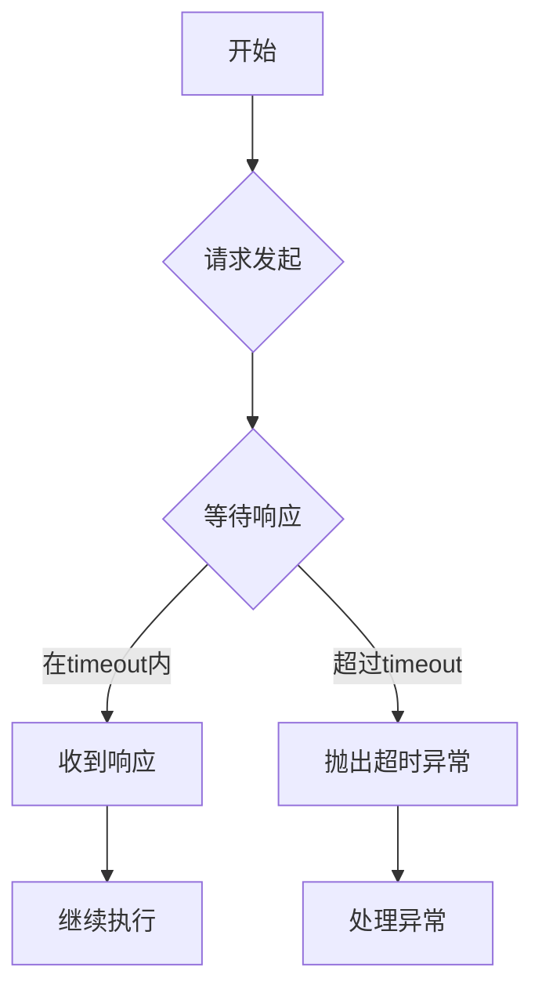
```mermaid
graph TD
    A[开始] --> B{请求发起}
    B --> C{等待响应}
    C -->|在timeout内| D[收到响应]
    C -->|超过timeout| E[抛出超时异常]
    D --> F[继续执行]
    E --> G[处理异常]
```

#### 带注释源码

```python
# 全局配置变量定义（位于 kube_hunter/conf 模块中）
# config.network_timeout = 5  # 示例值，表示5秒超时

# 使用方式：在进行 HTTP 请求时作为 timeout 参数传入
r = requests.get(url, timeout=config.network_timeout)
```

---

根据代码分析，`config.network_timeout` 被以下多个方法使用，作为 `requests` 库的 `timeout` 参数：

1. `AccessApiServer.access_api_server()` - 访问 API 服务器
2. `AccessApiServer.get_items()` - 获取资源列表
3. `AccessApiServer.get_pods()` - 获取 Pod 列表
4. `AccessApiServerActive.create_item()` - 创建资源
5. `AccessApiServerActive.patch_item()` - 修补资源
6. `AccessApiServerActive.delete_item()` - 删除资源
7. `ApiVersionHunter.execute()` - 获取 API 服务器版本

这些方法都通过 `timeout=config.network_timeout` 传入超时设置，确保所有网络请求都受到统一的时间限制。


### ServerApiAccess.__init__

该方法是ServerApiAccess类的构造函数，用于初始化API Server访问漏洞事件对象。根据传入的`using_token`参数区分是否使用服务账户令牌访问，并设置相应的漏洞名称和类别。

参数：

- `evidence`：`任意类型`，表示API Server访问的证据，通常是API返回的内容
- `using_token`：`bool`，表示是否使用服务账户令牌访问API Server

返回值：`None`，构造函数无返回值

#### 流程图

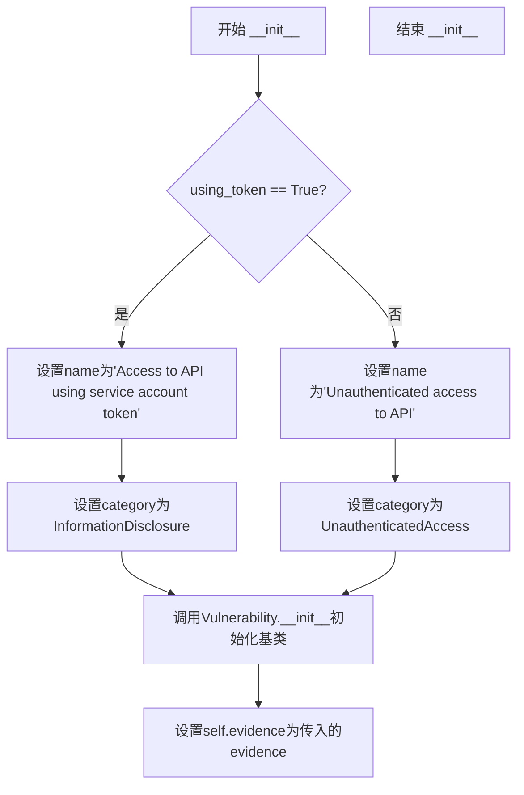
```mermaid
flowchart TD
    A[开始 __init__] --> B{using_token == True?}
    B -->|是| C[设置name为'Access to API using service account token']
    B -->|否| D[设置name为'Unauthenticated access to API']
    C --> E[设置category为InformationDisclosure]
    D --> F[设置category为UnauthenticatedAccess]
    E --> G[调用Vulnerability.__init__初始化基类]
    F --> G
    G --> H[设置self.evidence为传入的evidence]
    I[结束 __init__]
```

#### 带注释源码

```python
def __init__(self, evidence, using_token):
    # 根据是否使用token来决定漏洞名称和类别
    if using_token:
        # 使用服务账户令牌访问API的情况
        name = "Access to API using service account token"
        category = InformationDisclosure
    else:
        # 未认证访问API的情况
        name = "Unauthenticated access to API"
        category = UnauthenticatedAccess
    
    # 调用父类Vulnerability的初始化方法
    # 传入KubernetesCluster作为目标类型，设置漏洞名称、类别和VID
    Vulnerability.__init__(
        self, KubernetesCluster, name=name, category=category, vid="KHV005",
    )
    
    # 保存访问证据到实例属性
    self.evidence = evidence
```


### `ServerApiHTTPAccess.__init__`

该方法为 `ServerApiHTTPAccess` 类的构造函数，用于初始化一个表示"API Server 通过不安全的 HTTP 协议可访问"的安全漏洞事件。当检测到 Kubernetes API Server 允许通过未加密的 HTTP 协议访问时，会创建并发布此漏洞事件。

参数：

- `evidence`：`Any`（实际传入为 `requests.get` 返回的响应内容 `r.content`），用于记录发现漏洞时的证据，通常是 API 响应内容

返回值：`None`，构造函数无返回值，仅初始化对象状态

#### 流程图

```mermaid
flowchart TD
    A[__init__ 被调用] --> B[定义漏洞名称: 'Insecure (HTTP) access to API']
    B --> C[定义漏洞类别: UnauthenticatedAccess]
    C --> D[调用父类 Vulnerability.__init__ 初始化基础属性]
    D --> E[设置 self.evidence = evidence]
    E --> F[返回初始化完成的实例]
```

#### 带注释源码

```python
def __init__(self, evidence):
    """
    初始化 ServerApiHTTPAccess 漏洞事件
    
    当检测到 Kubernetes API Server 通过不安全的 HTTP 协议可访问时，
    会创建此漏洞事件。该漏洞属于未认证访问类别（UnauthenticatedAccess），
    因为 HTTP 协议不提供任何加密或身份验证机制。
    
    Args:
        evidence: 从 API Server 获取的响应内容，作为发现此漏洞的证据
    """
    # 定义漏洞名称，清晰描述安全问题
    name = "Insecure (HTTP) access to API"
    
    # 定义漏洞类别为未认证访问
    category = UnauthenticatedAccess
    
    # 调用父类 Vulnerability 的初始化方法
    # 传入目标类型为 KubernetesCluster，漏洞ID为 KHV006
    Vulnerability.__init__(
        self, KubernetesCluster, name=name, category=category, vid="KHV006",
    )
    
    # 保存发现漏洞时的证据（API 响应内容）
    self.evidence = evidence
```


### `ApiInfoDisclosure.__init__`

该方法用于初始化 API 信息泄露漏洞事件，根据是否使用服务账号令牌来调整漏洞名称，并将相关信息存储为事件属性。

参数：

- `self`：`ApiInfoDisclosure`，类的实例本身
- `evidence`：`Any`，从 API 服务器获取的证据或响应内容，用于证明漏洞存在
- `using_token`：`bool`，标识是否使用了服务账号令牌进行 API 访问，True 表示使用令牌，False 表示匿名访问
- `name`：`str`，基础漏洞名称，会根据 using_token 参数添加后缀

返回值：`None`，该方法直接修改对象状态，不返回任何值

#### 流程图

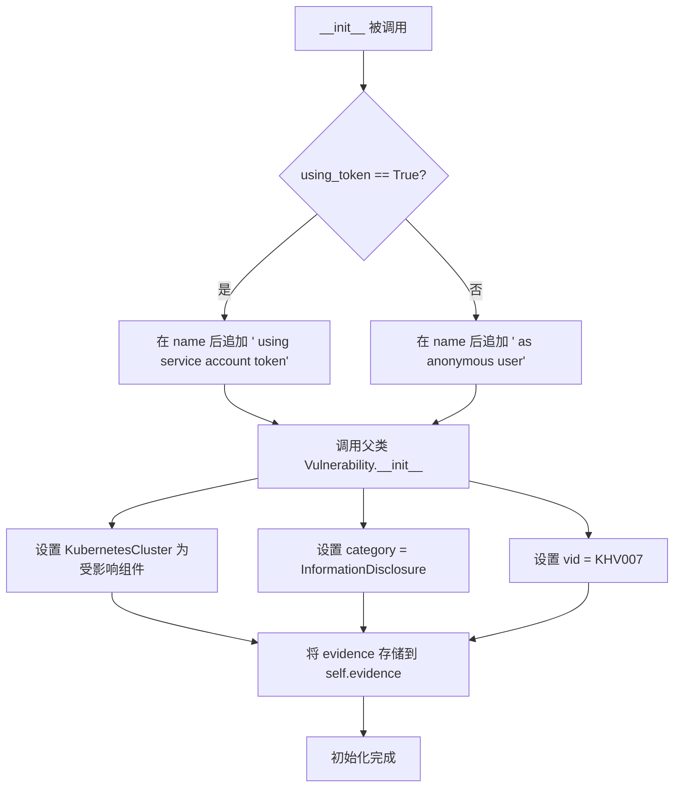
```mermaid
flowchart TD
    A[__init__ 被调用] --> B{using_token == True?}
    B -->|是| C[在 name 后追加 ' using service account token']
    B -->|否| D[在 name 后追加 ' as anonymous user']
    C --> E[调用父类 Vulnerability.__init__]
    D --> E
    E --> F[设置 KubernetesCluster 为受影响组件]
    E --> G[设置 category = InformationDisclosure]
    E --> H[设置 vid = KHV007]
    I[将 evidence 存储到 self.evidence]
    F --> I
    G --> I
    H --> I
    I --> J[初始化完成]
```

#### 带注释源码

```python
class ApiInfoDisclosure(Vulnerability, Event):
    """API 信息泄露漏洞事件类，继承自 Vulnerability 和 Event，用于表示 Kubernetes API 服务器信息泄露问题"""

    def __init__(self, evidence, using_token, name):
        """
        初始化 API 信息泄露漏洞事件对象

        参数:
            evidence: 从 API 服务器获取的响应内容或证据
            using_token: 布尔值，标识是否使用服务账号令牌
            name: 基础漏洞名称

        返回值:
            None
        """
        # 根据是否使用令牌修改漏洞名称，提供更详细的描述信息
        if using_token:
            name += " using service account token"  # 使用令牌访问时的描述
        else:
            name += " as anonymous user"  # 匿名访问时的描述

        # 调用父类 Vulnerability 的初始化方法，设置漏洞的元数据信息
        Vulnerability.__init__(
            self,                                    # 传递 self 实例
            KubernetesCluster,                       # 设置受影响的目标类型为 Kubernetes 集群
            name=name,                               # 设置漏洞名称（已包含访问方式后缀）
            category=InformationDisclosure,         # 设置漏洞类别为信息泄露
            vid="KHV007",                            # 设置漏洞唯一标识符
        )

        # 存储从 API 服务器获取的证据，用于后续报告或展示
        self.evidence = evidence
```


### `ListPodsAndNamespaces.__init__`

初始化 `ListPodsAndNamespaces` 漏洞事件对象，用于表示通过 API Server 列举 Pods 产生的 InformationDisclosure 风险。

参数：

-  `evidence`：`Any`，从 API Server 获取的 Pods 列表证据数据
-  `using_token`：`bool`，标识是否使用了服务账号令牌进行访问

返回值：`None`，构造函数无返回值，通过调用父类构造函数完成对象初始化

#### 流程图

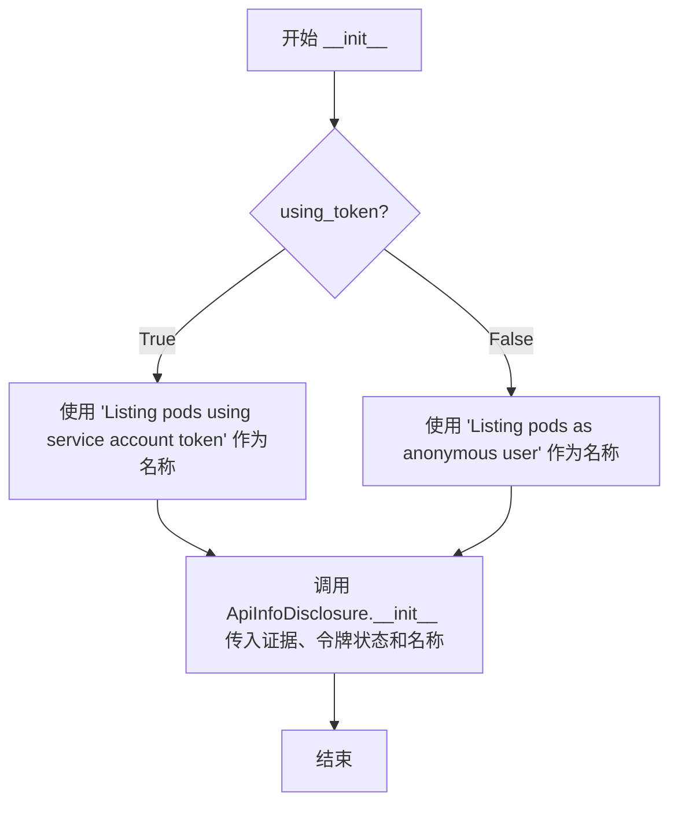
```mermaid
flowchart TD
    A[开始 __init__] --> B{using_token?}
    B -->|True| C[使用 'Listing pods using service account token' 作为名称]
    B -->|False| D[使用 'Listing pods as anonymous user' 作为名称]
    C --> E[调用 ApiInfoDisclosure.__init__ 传入证据、令牌状态和名称]
    D --> E
    E --> F[结束]
```

#### 带注释源码

```python
def __init__(self, evidence, using_token):
    # 调用父类 ApiInfoDisclosure 的构造函数，传入以下参数：
    # - evidence: 获取到的 Pods 列表证据数据
    # - using_token: 布尔值，标识是否使用服务账号令牌
    # - "Listing pods": 基础操作名称，会根据 using_token 值追加后缀
    ApiInfoDisclosure.__init__(self, evidence, using_token, "Listing pods")
```


### `ListNamespaces.__init__`

该方法是 `ListNamespaces` 类的构造函数，用于初始化一个列出Kubernetes命名空间的漏洞事件。它继承自 `ApiInfoDisclosure` 类，并根据是否使用令牌来设置事件名称。

参数：

- `evidence`：`Any`，从API服务器获取的命名空间列表证据
- `using_token`：`bool`，标识是否使用服务账号令牌进行API访问

返回值：`None`，构造函数不返回值

#### 流程图

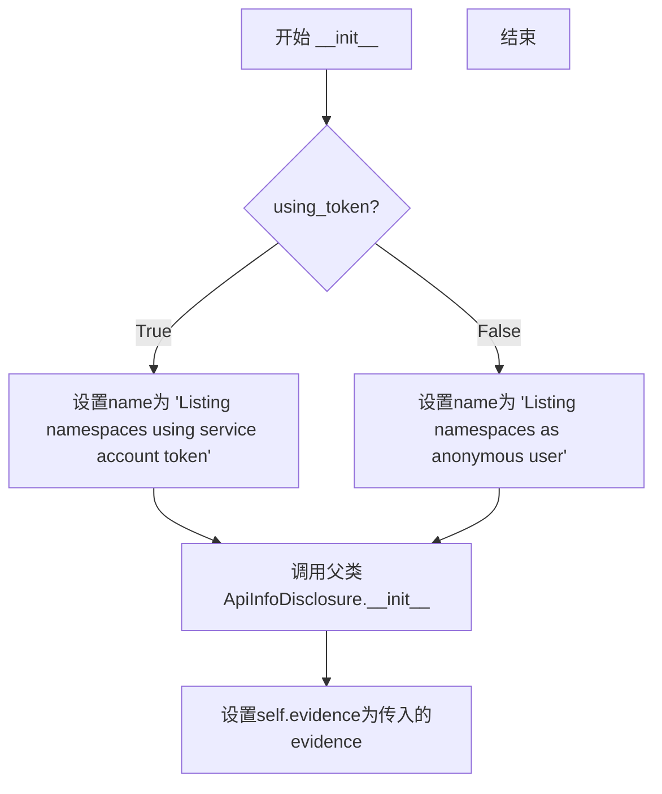
```mermaid
flowchart TD
    A[开始 __init__] --> B{using_token?}
    B -->|True| C[设置name为 'Listing namespaces using service account token']
    B -->|False| D[设置name为 'Listing namespaces as anonymous user']
    C --> E[调用父类ApiInfoDisclosure.__init__]
    D --> E
    E --> F[设置self.evidence为传入的evidence]
    G[结束]
```

#### 带注释源码

```python
def __init__(self, evidence, using_token):
    """
    初始化ListNamespaces事件
    
    Args:
        evidence: 从API服务器获取的命名空间列表数据
        using_token: 布尔值，标识是否使用了服务账号令牌进行API访问
    """
    # 调用父类ApiInfoDisclosure的构造函数，传入证据、令牌使用标志和基础名称
    # 父类会根据using_token的值追加后缀信息
    ApiInfoDisclosure.__init__(self, evidence, using_token, "Listing namespaces")
```


### `ListRoles.__init__`

用于初始化 `ListRoles` 类实例的构造函数，继承自 `ApiInfoDisclosure`，用于检测并报告 Kubernetes 集群中角色（Roles）信息泄露的漏洞。

参数：

- `self`：`ListRoles`，当前类实例
- `evidence`：`List[str]`，从 API Server 获取的角色列表数据，包含角色名称
- `using_token`：`bool`，标识是否使用 Service Account Token 访问 API Server（True 表示使用了 token，False 表示匿名访问）

返回值：`None`，构造函数无返回值

#### 流程图

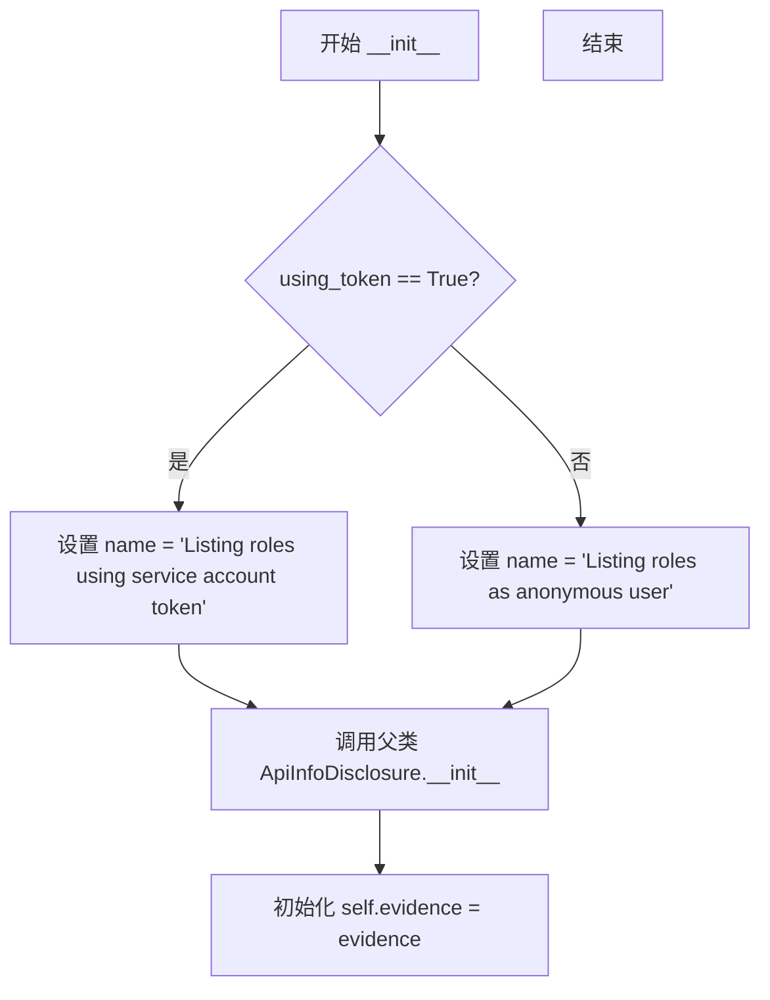
```mermaid
flowchart TD
    A[开始 __init__] --> B{using_token == True?}
    B -->|是| C[设置 name = 'Listing roles using service account token']
    B -->|否| D[设置 name = 'Listing roles as anonymous user']
    C --> E[调用父类 ApiInfoDisclosure.__init__]
    D --> E
    E --> F[初始化 self.evidence = evidence]
    G[结束]
```

#### 带注释源码

```python
class ListRoles(ApiInfoDisclosure):
    """ Accessing roles might give an attacker valuable information """

    def __init__(self, evidence, using_token):
        """
        构造函数，初始化 ListRoles 漏洞事件对象
        
        参数:
            evidence: 从 API Server 获取的角色列表（role names）
            using_token: 是否使用 service account token 进行 API 访问
        """
        # 调用父类 ApiInfoDisclosure 的构造函数
        # 根据是否使用 token 来决定名称和类别
        ApiInfoDisclosure.__init__(self, evidence, using_token, "Listing roles")
```


### ListClusterRoles.__init__

该方法是 `ListClusterRoles` 类的构造函数，用于初始化一个表示"访问集群角色"信息泄露风险的漏洞事件对象。它继承自 `ApiInfoDisclosure`，根据是否使用 service account token 动态设置事件名称，并将获取到的集群角色证据保存到事件对象中。

参数：

- `evidence`：List[str]，从 API Server 获取的集群角色名称列表，作为发现该漏洞的证据
- `using_token`：bool，表示访问 API Server 时是否使用了 service account token（True 表示已认证，False 表示匿名访问）

返回值：`None`，构造函数不返回任何值

#### 流程图

```mermaid
flowchart TD
    A[开始 __init__] --> B{using_token == True?}
    B -->|是| C[名称 = 'Listing cluster roles using service account token']
    B -->|否| D[名称 = 'Listing cluster roles as anonymous user']
    C --> E[调用 ApiInfoDisclosure.__init__]
    D --> E
    E --> F[设置 category = InformationDisclosure]
    F --> G[设置 vid = KHV007]
    G --> H[self.evidence = evidence]
    H --> I[结束]
```

#### 带注释源码

```python
def __init__(self, evidence, using_token):
    """
    初始化 ListClusterRoles 事件对象
    
    Args:
        evidence: 从 API Server 获取的集群角色名称列表
        using_token: 是否使用 service account token 进行认证
    """
    # 根据是否使用 token 构建不同的名称字符串
    if using_token:
        # 如果使用了 service account token，名称表明已认证访问
        name += " using service account token"
    else:
        # 如果未使用 token，名称表明是匿名用户访问
        name += " as anonymous user"
    
    # 调用父类 ApiInfoDisclosure 的构造函数
    # 设置漏洞类别为 InformationDisclosure（信息泄露）
    # 设置漏洞 ID 为 KHV007
    Vulnerability.__init__(
        self, KubernetesCluster, name=name, category=InformationDisclosure, vid="KHV007",
    )
    
    # 保存从 API Server 获取的集群角色列表作为证据
    self.evidence = evidence
```


### `CreateANamespace.__init__`

该方法是 `CreateANamespace` 类的构造函数，用于初始化一个表示"创建命名空间"漏洞的事件对象。它继承自 `Vulnerability` 和 `Event`，在初始化时设置漏洞名称、类别和相关证据信息。

参数：

- `evidence`：`str`，表示创建命名空间的证据信息（如新创建的命名空间名称）

返回值：`None`，无返回值（构造函数）

#### 流程图

```mermaid
flowchart TD
    A[开始 __init__] --> B[调用 Vulnerability.__init__]
    B --> C[设置 name='Created a namespace']
    C --> D[设置 category=AccessRisk]
    D --> E[设置 self.evidence = evidence]
    E --> F[结束]
```

#### 带注释源码

```python
def __init__(self, evidence):
    """
    初始化 CreateANamespace 漏洞事件对象
    
    参数:
        evidence: 表示创建命名空间的证据信息（如新创建的命名空间名称）
    """
    # 调用父类 Vulnerability 的构造函数，设置漏洞基本信息
    # target=KubernetesCluster: 表示该漏洞影响 Kubernetes 集群
    # name='Created a namespace': 漏洞名称
    # category=AccessRisk: 漏洞类别为访问风险
    Vulnerability.__init__(
        self, KubernetesCluster, name="Created a namespace", category=AccessRisk,
    )
    # 保存证据信息到实例变量
    self.evidence = evidence
```


### `DeleteANamespace.__init__`

该方法是 `DeleteANamespace` 类的构造函数，用于初始化一个表示“删除命名空间”漏洞的事件对象。它继承自 `Vulnerability` 和 `Event` 类，设置漏洞名称为“Delete a namespace”，类别为 `AccessRisk`，并将删除操作的证据存储在实例属性中。

参数：

- `evidence`：`str`，表示删除命名空间的证据，通常是删除操作返回的时间戳信息

返回值：`None`，`__init__` 方法不返回任何值，仅用于初始化对象状态

#### 流程图

```mermaid
flowchart TD
    A[开始 __init__] --> B[调用 Vulnerability.__init__ 初始化基类]
    B --> C[设置漏洞名称为 'Delete a namespace']
    C --> D[设置类别为 AccessRisk]
    D --> E[设置 vid 为 KHV...（继承自 Vulnerability）]
    E --> F[将 evidence 参数存储到 self.evidence]
    F --> G[结束 __init__]
```

#### 带注释源码

```python
def __init__(self, evidence):
    """初始化 DeleteANamespace 漏洞事件对象
    
    Args:
        evidence: 删除命名空间的证据，通常是 API 返回的删除时间戳等信息
    """
    # 调用基类 Vulnerability 的初始化方法
    # 设置漏洞影响的系统类型为 KubernetesCluster
    # 漏洞名称为 "Delete a namespace"
    # 漏洞类别为 AccessRisk（访问风险）
    Vulnerability.__init__(
        self, KubernetesCluster, name="Delete a namespace", category=AccessRisk,
    )
    # 将传入的证据信息存储到实例属性中
    # 该证据用于描述删除命名空间操作的具体结果
    self.evidence = evidence
```


### CreateARole.__init__

这是一个用于记录创建角色漏洞事件的初始化方法，当攻击者成功创建 Kubernetes Role 时触发此事件，用于安全审计和风险评估。

参数：

- `self`：隐式参数，CreateARole 实例本身
- `evidence`：`str`，包含创建角色的证据信息，通常为角色名称和命名空间等详细信息的字符串描述

返回值：`None`，该方法为构造函数，不返回任何值

#### 流程图

```mermaid
flowchart TD
    A[开始 __init__] --> B[接收 evidence 参数]
    B --> C[调用 Vulnerability.__init__ 初始化基类]
    C --> D[设置 name = 'Created a role']
    D --> E[设置 category = AccessRisk]
    E --> F[设置 self.evidence = evidence]
    F --> G[结束 __init__]
```

#### 带注释源码

```python
class CreateARole(Vulnerability, Event):
    """ Creating a role might give an attacker the option to harm the normal behavior of newly created pods
     within the specified namespaces.
    """

    def __init__(self, evidence):
        # 调用 Vulnerability 基类的初始化方法，设置漏洞相关属性
        # KubernetesCluster 表示该漏洞影响 Kubernetes 集群
        # name="Created a role" 表示漏洞名称为"创建了角色"
        # category=AccessRisk 表示该漏洞属于访问风险类别
        Vulnerability.__init__(self, KubernetesCluster, name="Created a role", category=AccessRisk)
        
        # 保存证据信息，包含创建角色的具体细节（如角色名、命名空间等）
        self.evidence = evidence
```


### `CreateAClusterRole.__init__`

这是一个用于表示"创建 ClusterRole"漏洞事件的类初始化方法。该类继承自 `Vulnerability` 和 `Event`，用于在 kube-hunter 框架中发布创建集群角色的安全风险事件。

参数：

- `evidence`：`str`，证据信息，包含创建的 ClusterRole 名称等细节

返回值：`None`，`__init__` 方法不返回任何值

#### 流程图

```mermaid
flowchart TD
    A[__init__ 被调用] --> B[调用 Vulnerability.__init__ 初始化基类]
    B --> C[设置漏洞名称: Created a cluster role]
    B --> D[设置类别: AccessRisk]
    B --> E[设置目标: KubernetesCluster]
    B --> F[设置漏洞ID: KHV005]
    F --> G[保存 evidence 到 self.evidence]
    G --> H[返回 None]
```

#### 带注释源码

```python
class CreateAClusterRole(Vulnerability, Event):
    """
    Creating a cluster role might give an attacker the option to harm the normal behavior of newly created pods
    across the whole cluster
    """

    def __init__(self, evidence):
        # 调用 Vulnerability 类的初始化方法，设置漏洞的基本属性
        Vulnerability.__init__(
            self,                          # 传递 self 作为第一个参数
            KubernetesCluster,             # 目标类型：Kubernetes 集群
            name="Created a cluster role", # 漏洞名称
            category=AccessRisk,           # 风险类别：访问风险
            # vid="KHV005",                # 漏洞 ID（注释掉的字段）
        )
        # 保存传入的证据信息，用于后续事件发布时展示具体细节
        self.evidence = evidence
```


### `PatchARole.__init__`

该方法是 `PatchARole` 类的构造函数，用于初始化一个表示"修补角色"漏洞的事件对象。它继承自 `Vulnerability` 和 `Event` 类，并设置漏洞的名称、类别、目标集群以及相关证据信息。

参数：

- `self`：隐式的实例自身参数
- `evidence`：`str`，表示修补角色的证据信息，通常包含角色名称、命名空间和修补结果等详细信息

返回值：`None`，构造函数没有返回值

#### 流程图

```mermaid
flowchart TD
    A[开始 __init__] --> B[调用 Vulnerability.__init__]
    B --> C[设置主机为 KubernetesCluster]
    C --> D[设置漏洞名称为 'Patched a role']
    D --> E[设置漏洞类别为 AccessRisk]
    E --> F[设置 self.evidence = evidence]
    F --> G[结束 __init__]
```

#### 带注释源码

```python
def __init__(self, evidence):
    """
    初始化 PatchARole 漏洞事件对象
    
    参数:
        evidence: 修补角色的证据信息，包含角色名、命名空间和修补结果等
    """
    # 调用父类 Vulnerability 的构造函数，初始化漏洞基本信息
    # 设置目标为 KubernetesCluster 类型的集群
    # 漏洞名称为 'Patched a role'
    # 漏洞类别为 AccessRisk（访问风险）
    Vulnerability.__init__(
        self, KubernetesCluster, name="Patched a role", category=AccessRisk,
    )
    # 保存修补角色的证据信息
    self.evidence = evidence
```


### `PatchAClusterRole.__init__`

该方法是`PatchAClusterRole`类的构造函数，用于初始化一个表示"修补集群角色"漏洞的事件对象。它继承自`Vulnerability`和`Event`类，并设置相关的元数据信息。

**参数：**

- `self`：隐式参数，`PatchAClusterRole`类的实例对象
- `evidence`：`str`，表示修补集群角色的证据信息，包含集群角色名称和修补证据

**返回值：** `None`，该方法为构造函数，不返回任何值（Python中`__init__`方法隐式返回`None`）

#### 流程图

```mermaid
flowchart TD
    A[开始 __init__] --> B[调用 Vulnerability.__init__ 初始化父类]
    B --> C[设置 name = 'Patched a cluster role']
    C --> D[设置 category = AccessRisk]
    D --> E[设置 vid = 'KHV???'] 
    E --> F[设置 evidence = 传入的证据参数]
    F --> G[结束 __init__]
```

#### 带注释源码

```python
def __init__(self, evidence):
    # 调用父类 Vulnerability 的初始化方法
    # 参数: 
    #   - KubernetesCluster: 表示该漏洞影响的目标类型为 Kubernetes 集群
    #   - name: 漏洞名称，标识为 "Patched a cluster role"（修补了集群角色）
    #   - category: 漏洞类别，标识为 AccessRisk（访问风险）
    #   - vid: 漏洞ID，此处应为 'KHVXXX' 格式（代码中未显式提供 vid）
    Vulnerability.__init__(
        self, KubernetesCluster, name="Patched a cluster role", category=AccessRisk,
    )
    # 将传入的证据信息存储为实例属性
    # evidence 参数包含具体的集群角色名称和修补操作的证据
    self.evidence = evidence
```


### DeleteARole.__init__

该方法是 `DeleteARole` 类的构造函数，用于初始化一个表示“删除角色”安全漏洞的事件对象，继承自 `Vulnerability` 和 `Event` 基类。

参数：

- `self`：实例对象，隐含参数，表示当前类的实例
- `evidence`：`Any`（任意类型），用于记录删除角色的证据信息

返回值：`None`，构造函数不返回值，仅初始化对象状态

#### 流程图

```mermaid
flowchart TD
    A[开始 __init__] --> B[调用 Vulnerability.__init__]
    B --> C[设置 name='Deleted a role']
    C --> D[设置 category=AccessRisk]
    D --> E[设置 vid='KHV???']:::placeholder
    F[将 evidence 赋值给 self.evidence]
    E --> F
    G[结束 __init__]
    
    classDef placeholder fill:#f9f,stroke:#333,stroke-width:4px;
```

#### 带注释源码

```python
class DeleteARole(Vulnerability, Event):
    """ 删除角色可能会允许攻击者影响命名空间中资源的访问权限"""
    
    def __init__(self, evidence):
        """
        初始化 DeleteARole 漏洞事件对象
        
        参数:
            evidence: 用于记录删除角色的证据信息（如角色名称、命名空间等）
        """
        # 调用基类 Vulnerability 的初始化方法，设置漏洞元数据
        Vulnerability.__init__(
            self, 
            KubernetesCluster,     # 所属目标类型：Kubernetes 集群
            name="Deleted a role", # 漏洞名称
            category=AccessRisk,   # 漏洞类别：访问风险
            # vid="KHV???",        # 漏洞ID（代码中未显式设置，需补充）
        )
        # 将证据信息存储为实例属性，供后续处理使用
        self.evidence = evidence
```


### `DeleteAClusterRole.__init__`

该方法是 `DeleteAClusterRole` 类的构造函数，用于初始化删除集群角色漏洞事件。它继承自 `Vulnerability` 和 `Event`，设置漏洞名称为"Deleted a cluster role"，类别为 `AccessRisk`，并将传入的证据信息存储在实例属性中。

参数：

- `evidence`：任意类型，表示删除集群角色的证据信息（如时间戳、角色名等）

返回值：`None`，无显式返回值

#### 流程图

```mermaid
graph TD
    A[开始 __init__] --> B[调用 Vulnerability.__init__]
    B --> C[设置 name='Deleted a cluster role']
    B --> D[设置 category=AccessRisk]
    B --> E[设置 vid='KHVxxx' (继承自Vulnerability)]
    C --> F[self.evidence = evidence]
    F --> G[结束]
```

#### 带注释源码

```python
class DeleteAClusterRole(Vulnerability, Event):
    """ Deleting a cluster role might allow an attacker to affect access to resources in the cluster"""

    def __init__(self, evidence):
        # 调用父类 Vulnerability 的初始化方法
        # 设置漏洞相关的元数据信息
        Vulnerability.__init__(
            self,                          # 传递 self 实例
            KubernetesCluster,             # 漏洞影响的目标类型
            name="Deleted a cluster role", # 漏洞名称
            category=AccessRisk,          # 漏洞类别为访问风险
            # vid 参数在 Vulnerability 基类中定义
        )
        # 将传入的证据信息存储为实例属性
        # evidence 通常包含删除操作的时间戳或角色名等详细信息
        self.evidence = evidence
```


### CreateAPod.__init__

这是 kube-hunter 项目中的一个事件类，用于表示在 Kubernetes 集群中创建 Pod 的漏洞发现。当主动 hunter 成功在集群中创建 Pod 时，会触发此事件，标记为一种访问风险（AccessRisk）。

参数：

- `self`：隐式参数，CreateAPod 实例本身
- `evidence`：`str`（字符串），表示创建 Pod 的证据，包含 Pod 名称和命名空间等信息

返回值：`None`，该方法没有返回值，初始化完成后直接结束

#### 流程图

```mermaid
flowchart TD
    A[开始 __init__] --> B[调用 Vulnerability.__init__ 初始化基础属性]
    B --> C[设置 name='Created A Pod']
    B --> D[设置 category=AccessRisk]
    B --> E[设置 vid='KHV???'] 
    B --> F[设置 evidence 属性为传入的参数]
    F --> G[结束]
```

#### 带注释源码

```python
class CreateAPod(Vulnerability, Event):
    """ Creating a new pod allows an attacker to run custom code"""

    def __init__(self, evidence):
        # 调用父类 Vulnerability 的初始化方法
        # 参数说明：
        #   self: 实例本身
        #   KubernetesCluster: 受影响的 Kubernetes 集群
        #   name: 漏洞名称 'Created A Pod'
        #   category: 漏洞类别为 AccessRisk（访问风险）
        Vulnerability.__init__(
            self, KubernetesCluster, name="Created A Pod", category=AccessRisk,
        )
        # 将传入的证据信息存储为实例属性
        # evidence 包含创建 Pod 的具体信息，如 Pod 名称和命名空间
        self.evidence = evidence
```


### `CreateAPrivilegedPod.__init__`

该方法是 `CreateAPrivilegedPod` 类的构造函数，用于初始化一个表示创建了特权 Pod 的漏洞事件。构造函数调用父类 `Vulnerability` 的初始化方法，设置漏洞名称为"Created A PRIVILEGED Pod"，分类为 `AccessRisk`，并关联到 `KubernetesCluster` 目标。

参数：

- `evidence`：`str`，用于记录创建特权 Pod 的证据信息，例如 Pod 名称和命名空间

返回值：`None`，`__init__` 方法不返回任何值

#### 流程图

```mermaid
flowchart TD
    A[开始 __init__] --> B[调用 Vulnerability.__init__]
    B --> C[设置 name='Created A PRIVILEGED Pod']
    B --> D[设置 category=AccessRisk]
    B --> E[设置 vid='KHV005' 或默认]
    B --> F[设置 host=KubernetesCluster]
    C --> G[设置 self.evidence = evidence]
    G --> H[结束 __init__]
```

#### 带注释源码

```python
class CreateAPrivilegedPod(Vulnerability, Event):
    """ Creating a new PRIVILEGED pod would gain an attacker FULL CONTROL over the cluster"""

    def __init__(self, evidence):
        # 调用父类 Vulnerability 的初始化方法
        # 参数: host=KubernetesCluster, 表示该漏洞影响整个 Kubernetes 集群
        # name: 漏洞名称，明确标识为创建了特权 Pod
        # category: 漏洞分类为 AccessRisk，表示存在访问风险
        Vulnerability.__init__(
            self, KubernetesCluster, name="Created A PRIVILEGED Pod", category=AccessRisk,
        )
        # 保存传入的证据信息，如 "Pod Name: xxx Namespace: yyy"
        self.evidence = evidence
```


### `PatchAPod.__init__`

这是 `PatchAPod` 类的构造函数，用于初始化一个表示"修补（Patch）Pod"漏洞的事件对象。该类继承自 `Vulnerability` 和 `Event`，用于在 Kubernetes 集群安全评估中记录成功修补 Pod 的行为。

参数：

- `self`：隐式参数，类实例本身
- `evidence`：`str`，用于记录漏洞发现的证据信息，例如 Pod 名称、命名空间和修补结果

返回值：`None`，构造函数无返回值

#### 流程图

```mermaid
graph TD
    A[开始 __init__] --> B[调用 Vulnerability.__init__ 初始化基类]
    B --> C[设置漏洞名称为 'Patched A Pod']
    C --> D[设置类别为 AccessRisk]
    C --> E[设置 vid 为 KHV008]
    E --> F[将 evidence 存储到实例变量 self.evidence]
    F --> G[结束 __init__]
```

#### 带注释源码

```python
class PatchAPod(Vulnerability, Event):
    """ Patching a pod allows an attacker to compromise and control it """

    def __init__(self, evidence):
        # 调用父类 Vulnerability 的构造函数，初始化漏洞基本信息
        Vulnerability.__init__(
            self,                           # 传递 self 实例
            KubernetesCluster,              # 漏洞影响的目标类型为 Kubernetes 集群
            name="Patched A Pod",           # 漏洞名称：表示成功修补了一个 Pod
            category=AccessRisk,           # 漏洞类别：访问风险
        )
        # 将传入的证据信息存储到实例变量中，用于后续报告或日志记录
        self.evidence = evidence
```


### DeleteAPod.__init__

该方法是 `DeleteAPod` 类的构造函数，用于初始化一个表示“删除Pod”漏洞的事件对象。它继承自 `Vulnerability` 和 `Event` 类，设置漏洞名称为 "Deleted A Pod"，分类为 `AccessRisk`，并将传入的证据信息存储在实例属性中。

参数：

- `evidence`：`str`，表示删除Pod的证据信息，包含Pod名称和删除时间等详细信息

返回值：`None`，构造函数不返回任何值

#### 流程图

```mermaid
flowchart TD
    A[开始 __init__] --> B[调用 Vulnerability.__init__]
    B --> C[设置 name='Deleted A Pod']
    C --> D[设置 category=AccessRisk]
    D --> E[设置 vid='KHV???']
    E --> F[设置 self.evidence = evidence]
    F --> G[结束]
```

#### 带注释源码

```python
class DeleteAPod(Vulnerability, Event):
    """ Deleting a pod allows an attacker to disturb applications on the cluster """

    def __init__(self, evidence):
        # 调用父类 Vulnerability 的初始化方法
        # 设置漏洞的严重级别为 KubernetesCluster
        # 漏洞名称为 "Deleted A Pod"
        # 分类为 AccessRisk（访问风险）
        Vulnerability.__init__(
            self, KubernetesCluster, name="Deleted A Pod", category=AccessRisk,
        )
        # 将传入的证据信息存储为实例属性
        # evidence 是一个字符串，包含被删除的 Pod 名称和删除时间等信息
        self.evidence = evidence
```


### `ApiServerPassiveHunterFinished.__init__`

该方法是 `ApiServerPassiveHunterFinished` 类的构造函数，用于初始化一个事件对象，该事件在被动Hunter完成API服务器命名空间发现后触发，携带发现的命名空间列表供主动Hunter使用。

参数：

- `namespaces`：`List[str]` 或 `None`，从API服务器获取的Kubernetes命名空间名称列表

返回值：`None`，构造函数无返回值

#### 流程图

```mermaid
graph TD
    A[开始 __init__] --> B[接收 namespaces 参数]
    B --> C[将 namespaces 赋值给 self.namespaces]
    C --> D[结束]
```

#### 带注释源码

```python
def __init__(self, namespaces):
    """
    初始化 ApiServerPassiveHunterFinished 事件对象
    
    该事件在 ApiServer 的被动Hunter完成对API服务器的
    命名空间列表获取后触发，用于通知主动Hunter可以开始
    对已知命名空间进行进一步的安全测试（创建、删除资源等）
    
    参数:
        namespaces: 从API服务器 /api/v1/namespaces 端点获取的
                   命名空间名称列表，如果获取失败则为 None
    """
    # 将获取到的命名空间列表存储为实例属性
    # 供 AccessApiServerActive (主动Hunter) 在 execute 方法中使用
    self.namespaces = namespaces
```


### AccessApiServer.access_api_server

该方法是`AccessApiServer`类的核心方法，用于被动探测Kubernetes API Server是否可访问。它通过向API Server的`/api`端点发送HTTP GET请求来检测服务是否在线，并根据响应状态码和内容判断是否成功获取API信息。

参数：

- 该方法无显式参数（除self外）

返回值：`bool`或`bytes`，成功访问API时返回响应内容（bytes类型），失败时返回False

#### 流程图

```mermaid
flowchart TD
    A[开始访问API Server] --> B[构建请求URL: {path}/api]
    B --> C[发送GET请求到API端点]
    C --> D{请求是否成功<br/>状态码200且有内容?}
    D -->|是| E[返回响应内容bytes]
    D -->|否| F{是否连接错误?}
    F -->|是| G[记录日志并继续]
    F -->|否| H[返回False]
    G --> H
```

#### 带注释源码

```python
def access_api_server(self):
    """
    被动Hunter尝试访问API Server
    用于检测API Server是否可访问
    """
    # 记录调试日志，显示正在尝试访问的API路径
    logger.debug(f"Passive Hunter is attempting to access the API at {self.path}")
    
    try:
        # 发送GET请求到API Server的/api端点
        # 使用self.headers（可能包含认证令牌）
        # verify=False: 跳过SSL证书验证（用于测试环境）
        # timeout: 网络超时时间从配置中读取
        r = requests.get(
            f"{self.path}/api", 
            headers=self.headers, 
            verify=False, 
            timeout=config.network_timeout
        )
        
        # 检查响应状态码是否为200且有内容返回
        if r.status_code == 200 and r.content:
            # 返回API响应内容（bytes类型）
            return r.content
    except requests.exceptions.ConnectionError:
        # 处理连接错误（如服务不可达）
        # 静默处理，不抛出异常
        pass
    
    # 所有失败情况返回False
    return False
```


### AccessApiServer.get_items

该方法用于从Kubernetes API Server获取指定资源项（如namespace、role等）的名称列表，通过发送HTTP GET请求并解析返回的JSON响应。

参数：

- `path`：`str`，API端点路径，用于指定要查询的Kubernetes资源路径（如/api/v1/namespaces）

返回值：`Optional[List[str]]`，返回资源名称列表，如果请求失败则返回None

#### 流程图

```mermaid
flowchart TD
    A[开始 get_items] --> B[初始化空列表 items]
    B --> C[发送HTTP GET请求到path]
    C --> D{响应状态码是否为200}
    D -->|是| E[解析JSON响应]
    E --> F[遍历items数组]
    F --> G[提取每个item的metadata.name]
    G --> H[添加到items列表]
    H --> I[返回items列表]
    D -->|否| J[记录调试日志]
    J --> K[返回None]
    C --> L[捕获ConnectionError或KeyError]
    L --> K
    I --> M[结束]
    K --> M
```

#### 带注释源码

```python
def get_items(self, path):
    """获取Kubernetes API资源项的名称列表
    
    Args:
        path: API端点路径，如/api/v1/namespaces
        
    Returns:
        资源名称列表，如果失败返回None
    """
    try:
        items = []
        # 使用requests库发送HTTP GET请求
        # headers: 包含认证令牌（如果有）
        # verify=False: 禁用SSL证书验证
        # timeout: 网络超时时间
        r = requests.get(path, headers=self.headers, verify=False, timeout=config.network_timeout)
        
        # 检查HTTP响应状态码
        if r.status_code == 200:
            # 解析JSON响应内容
            resp = json.loads(r.content)
            
            # 遍历响应中的items数组
            for item in resp["items"]:
                # 提取每个资源的metadata.name字段
                items.append(item["metadata"]["name"])
            
            # 返回提取的资源名称列表
            return items
        
        # HTTP状态码非200时记录调试日志
        logger.debug(f"Got HTTP {r.status_code} respone: {r.text}")
        
    except (requests.exceptions.ConnectionError, KeyError):
        # 捕获连接错误和JSON解析KeyError异常
        logger.debug(f"Failed retrieving items from API server at {path}")

    # 请求失败或发生异常时返回None
    return None
```


### `AccessApiServer.get_pods`

获取Kubernetes集群中的Pod列表，支持获取所有命名空间的Pod或特定命名空间的Pod

参数：

- `namespace`：`Optional[str]`，目标命名空间。如果为`None`，则获取所有命名空间下的Pod；否则获取指定命名空间下的Pod

返回值：`Optional[List[Dict[str, bytes]]]`，返回Pod列表，每个元素包含`name`和`namespace`字段；如果请求失败则返回`None`

#### 流程图

```mermaid
flowchart TD
    A[开始 get_pods] --> B{namespace参数是否存在?}
    B -->|否| C[构建请求URL: /api/v1/pods]
    B -->|是| D[构建请求URL: /api/v1/namespaces/{namespace}/pods]
    C --> E[发送GET请求]
    D --> E
    E --> F{响应状态码 == 200?}
    F -->|否| G[记录调试日志]
    F -->|是| H[解析JSON响应]
    G --> I[返回None]
    H --> I
    H --> J[遍历items数组]
    J --> K[提取pod名称和命名空间]
    K --> L[转换为ASCII编码]
    L --> M[构建字典并添加到pods列表]
    M --> N{pods列表处理完成?}
    N -->|否| J
    N -->|是| O[返回pods列表]
    I --> P[结束]
    O --> P
    
    style A fill:#f9f,stroke:#333
    style O fill:#9f9,stroke:#333
    style I fill:#f99,stroke:#333
```

#### 带注释源码

```python
def get_pods(self, namespace=None):
    """获取Kubernetes集群中的Pod列表
    
    Args:
        namespace: 目标命名空间。如果为None，则获取所有命名空间的Pod
        
    Returns:
        包含pod名称和命名空间的字典列表，失败时返回None
    """
    pods = []  # 初始化空列表用于存储Pod信息
    try:
        # 判断是否需要指定命名空间
        if not namespace:
            # 获取所有命名空间的Pod
            r = requests.get(
                f"{self.path}/api/v1/pods",  # API路径：获取所有Pod
                headers=self.headers,          # 请求头（可能包含认证token）
                verify=False,                   # 跳过SSL证书验证
                timeout=config.network_timeout  # 网络超时配置
            )
        else:
            # 获取指定命名空间的Pod
            r = requests.get(
                f"{self.path}/api/v1/namespaces/{namespace}/pods",  # API路径：获取指定命名空间的Pod
                headers=self.headers,
                verify=False,
                timeout=config.network_timeout,
            )
        
        # 检查HTTP响应状态码
        if r.status_code == 200:
            # 解析JSON响应内容
            resp = json.loads(r.content)
            
            # 遍历响应中的每个Pod项
            for item in resp["items"]:
                # 提取Pod元数据
                name = item["metadata"]["name"].encode("ascii", "ignore")      # 获取Pod名称并转换为ASCII
                namespace = item["metadata"]["namespace"].encode("ascii", "ignore")  # 获取命名空间并转换为ASCII
                
                # 构建Pod信息字典并添加到列表
                pods.append({"name": name, "namespace": namespace})
            
            # 返回Pod列表
            return pods
            
    # 异常处理：捕获连接错误和JSON解析错误
    except (requests.exceptions.ConnectionError, KeyError):
        # 静默处理异常，记录调试日志
        logger.debug(f"Failed retrieving pods from API server")
    
    # 请求失败或发生异常时返回None
    return None
```


### `AccessApiServer.execute`

该方法是 kube-hunter 工具中用于被动探测 Kubernetes API Server 可访问性的核心执行方法。它首先尝试访问 API Server 的 /api 端点以确认可访问性，然后依次获取并发布命名空间、角色、集群角色和 Pod 列表等信息到事件处理系统。

参数：
- 无显式参数（方法在类内部调用，隐式使用 self 实例属性）

返回值：`None`，该方法通过发布事件（publish_event）来传递发现的结果，不直接返回数据

#### 流程图

```mermaid
flowchart TD
    A[开始执行 execute] --> B{访问 API Server}
    B --> C{是否可访问}
    C -->|是| D{协议是 HTTP?}
    C -->|否| E[继续后续检查]
    D -->|是| F[发布 ServerApiHTTPAccess 事件]
    D -->|否| G[发布 ServerApiAccess 事件]
    F --> E
    G --> E
    E --> H[获取命名空间列表]
    H --> I{获取成功?}
    I -->|是| J[发布 ListNamespaces 事件]
    I -->|否| K[继续后续检查]
    J --> L[获取 Roles 列表]
    K --> L
    L --> M{获取成功?}
    M -->|是| N[发布 ListRoles 事件]
    M -->|否| O[继续后续检查]
    N --> P[获取 ClusterRoles 列表]
    O --> P
    P --> Q{获取成功?}
    Q -->|是| R[发布 ListClusterRoles 事件]
    Q -->|否| S[继续后续检查]
    R --> T[获取 Pods 列表]
    S --> T
    T --> U{获取成功?}
    U -->|是| V[发布 ListPodsAndNamespaces 事件]
    U -->|否| W[继续后续检查]
    V --> X[发布 ApiServerPassiveHunterFinished 事件]
    W --> X
    X --> Z[结束]
```

#### 带注释源码

```python
def execute(self):
    """
    被动 Hunter 的主执行方法
    执行 API Server 的信息收集和信息泄露检测
    """
    # 1. 尝试访问 API Server 的 /api 端点
    api = self.access_api_server()
    if api:
        # 2. 根据协议类型发布不同的漏洞事件
        if self.event.protocol == "http":
            # HTTP 协议访问，发布不安全访问事件
            self.publish_event(ServerApiHTTPAccess(api))
        else:
            # HTTPS 协议访问，发布访问事件（带 token 标识）
            self.publish_event(ServerApiAccess(api, self.with_token))

    # 3. 获取命名空间列表并发布事件
    # 使用 .format() 格式化路径（注意：这里有冗余的 format 调用）
    namespaces = self.get_items("{path}/api/v1/namespaces".format(path=self.path))
    if namespaces:
        self.publish_event(ListNamespaces(namespaces, self.with_token))

    # 4. 获取 RBAC Roles 列表并发布事件
    roles = self.get_items(f"{self.path}/apis/rbac.authorization.k8s.io/v1/roles")
    if roles:
        self.publish_event(ListRoles(roles, self.with_token))

    # 5. 获取 ClusterRoles 列表并发布事件
    cluster_roles = self.get_items(f"{self.path}/apis/rbac.authorization.k8s.io/v1/clusterroles")
    if cluster_roles:
        self.publish_event(ListClusterRoles(cluster_roles, self.with_token))

    # 6. 获取所有命名空间的 Pods 并发布事件
    pods = self.get_pods()
    if pods:
        self.publish_event(ListPodsAndNamespaces(pods, self.with_token))

    # 7. 发布被动 Hunter 完成事件，传递命名空间列表供 Active Hunter 使用
    # 注意：如果有 service account token，此事件会被触发两次（有 token 和无 token）
    self.publish_event(ApiServerPassiveHunterFinished(namespaces))
```


### AccessApiServerWithToken.__init__

该方法是 `AccessApiServerWithToken` 类的构造函数，用于在使用服务账号令牌访问 API Server 时初始化相关配置。它继承自 `AccessApiServer` 类，并在父类基础上添加了令牌认证支持。

参数：

- `event`：`Event` 类型，具体为 `ApiServer` 事件对象，包含 API Server 的主机地址、端口、协议等信息以及可选的认证令牌

返回值：`None`，`__init__` 方法不返回值

#### 流程图

```mermaid
flowchart TD
    A[开始 __init__] --> B[调用父类构造函数 super.__init__event]
    B --> C[断言 event.auth_token 存在]
    C --> D[构建 Authorization 头: Bearer {token}]
    D --> E[设置 self.headers 为认证头]
    E --> F[设置 self.category = InformationDisclosure]
    F --> G[设置 self.with_token = True]
    G --> H[结束]
```

#### 带注释源码

```python
def __init__(self, event):
    """
    初始化 AccessApiServerWithToken
    该类用于在使用服务账号令牌访问 API Server 时进行检测
    
    参数:
        event: ApiServer 事件对象，包含 API Server 的连接信息和认证令牌
    """
    # 调用父类 AccessApiServer 的构造函数
    # 父类会初始化 self.event, self.path, self.headers, self.with_token 等属性
    super(AccessApiServerWithToken, self).__init__(event)
    
    # 断言确保传入的 event 包含 auth_token
    # 该类仅在 predicate=lambda x: x.auth_token 为真时才会被实例化
    assert self.event.auth_token
    
    # 设置 HTTP 请求头，添加 Bearer Token 认证
    # 用于后续所有 API 请求的认证
    self.headers = {"Authorization": f"Bearer {self.event.auth_token}"}
    
    # 设置类别为信息泄露
    # 表示该漏洞属于信息泄露类风险
    self.category = InformationDisclosure
    
    # 标记已使用令牌进行认证
    # 区别于无认证的被动扫描
    self.with_token = True
```


### `AccessApiServerActive.create_item`

该方法用于通过Kubernetes API Server创建资源（如Pod、Namespace、Role等），支持使用服务账户令牌进行身份验证，并返回所创建资源的名称。

参数：
- `path`：`str`，Kubernetes API端点路径，指定要创建资源的完整URL
- `data`：`str`，JSON格式的请求体数据，包含要创建的Kubernetes资源定义

返回值：`Optional[str]`，成功创建资源时返回资源的元数据名称（`metadata.name`），失败或发生异常时返回`None`

#### 流程图

```mermaid
flowchart TD
    A[开始 create_item] --> B[构建请求头]
    B --> C{是否持有 auth_token?}
    C -->|是| D[添加 Authorization: Bearer token]
    C -->|否| E[不添加 Authorization 头]
    D --> F[发送 POST 请求]
    E --> F
    F --> G{请求成功?}
    G -->|状态码 200/201/202| H[解析响应 JSON]
    G -->|其他| I[返回 None]
    H --> J{解析成功?}
    J -->|是| K[返回 metadata.name]
    J -->|否| I
    K --> L[结束]
    I --> L
    F -.->|连接错误/KeyError| I
```

#### 带注释源码

```python
def create_item(self, path, data):
    """
    通过 Kubernetes API 创建资源
    
    参数:
        path: Kubernetes API 端点路径
        data: JSON 格式的资源定义
    
    返回:
        成功返回资源名称, 失败返回 None
    """
    # 构建基础请求头，指定内容类型为 JSON
    headers = {"Content-Type": "application/json"}
    
    # 如果事件中包含认证令牌，则添加到请求头
    # 这允许使用被攻击Pod的服务账户令牌进行身份验证
    if self.event.auth_token:
        headers["Authorization"] = f"Bearer {self.event.auth_token}"

    try:
        # 发送 POST 请求到 Kubernetes API Server
        # verify=False: 跳过 SSL 证书验证（用于测试环境）
        # data: 请求体数据
        # timeout: 网络超时时间
        res = requests.post(
            path, 
            verify=False, 
            data=data, 
            headers=headers, 
            timeout=config.network_timeout
        )
        
        # 检查 HTTP 状态码是否表示成功
        # 200: OK, 201: Created, 202: Accepted
        if res.status_code in [200, 201, 202]:
            # 解析响应的 JSON 内容
            parsed_content = json.loads(res.content)
            
            # 从响应中提取资源的 metadata.name 字段并返回
            return parsed_content["metadata"]["name"]
    
    # 捕获连接错误（如无法连接到 API Server）
    # 和 KeyError（如响应中不存在 metadata 字段）
    except (requests.exceptions.ConnectionError, KeyError):
        # 静默失败，返回 None
        pass
    
    # 发生任何异常或请求失败都返回 None
    return None
```


### `AccessApiServerActive.patch_item`

该方法用于向Kubernetes API Server发送PATCH请求，以修改指定的资源（如Pod、Role等），返回修改后资源的namespace，失败时返回None。

参数：

- `path`：`str`，API路径，指向要修改的Kubernetes资源端点
- `data`：`str`，JSON Patch格式的请求数据，用于描述具体的修改操作

返回值：`Optional[str]`，成功时返回修改资源的namespace，失败时返回None

#### 流程图

```mermaid
flowchart TD
    A[开始 patch_item] --> B[构建请求头]
    B --> C{是否有认证令牌?}
    C -->|是| D[添加Authorization头]
    C -->|否| E[不添加Authorization头]
    D --> F[发送PATCH请求]
    E --> F
    F --> G{响应状态码是否为200/201/202?}
    G -->|否| H[返回None]
    G -->|是| I[解析响应JSON]
    I --> J[提取metadata.namespace]
    J --> K[返回namespace]
    F --> L[异常处理]
    L --> H
```

#### 带注释源码

```python
def patch_item(self, path, data):
    """向API Server发送PATCH请求修改资源
    
    Args:
        path: API端点路径
        data: JSON Patch格式的请求数据
    
    Returns:
        成功返回namespace，失败返回None
    """
    # 设置Content-Type为JSON Patch格式
    headers = {"Content-Type": "application/json-patch+json"}
    
    # 如果存在认证令牌，添加Authorization头
    if self.event.auth_token:
        headers["Authorization"] = f"Bearer {self.event.auth_token}"
    
    try:
        # 发送PATCH请求到指定的API路径
        # verify=False 禁用SSL证书验证（安全风险）
        # timeout=config.network_timeout 网络超时配置
        res = requests.patch(
            path, 
            headers=headers, 
            verify=False, 
            data=data, 
            timeout=config.network_timeout
        )
        
        # 检查HTTP响应状态码是否表示成功
        if res.status_code not in [200, 201, 202]:
            return None
        
        # 解析响应内容为JSON
        parsed_content = json.loads(res.content)
        
        # TODO: 注释中提到是否可以使用patch时间戳
        # 从响应中提取metadata.namespace并返回
        return parsed_content["metadata"]["namespace"]
    
    # 捕获连接错误和JSON解析错误
    except (requests.exceptions.ConnectionError, KeyError):
        pass
    
    # 发生任何异常都返回None
    return None
```


### `AccessApiServerActive.delete_item`

该方法用于通过 Kubernetes API 删除指定的资源（如 Pod、Namespace、Role 等），并返回资源的删除时间戳。如果删除成功，返回 `deletionTimestamp`；否则返回 `None`。

参数：

- `path`：`str`，要删除的 Kubernetes 资源路径（例如 `/api/v1/namespaces/{namespace}/pods/{pod_name}`）

返回值：`Optional[str]`，返回删除时间戳（`deletionTimestamp`）或 `None`

#### 流程图

```mermaid
flowchart TD
    A[开始 delete_item] --> B{self.event.auth_token 存在?}
    B -->|是| C[设置 Authorization header]
    B -->|否| D[headers 为空字典]
    C --> E[发送 DELETE 请求到 path]
    D --> E
    E --> F{请求成功?}
    F -->|否| G[返回 None]
    F -->|是| H{状态码 200/201/202?}
    H -->|否| G
    H -->是 --> I[解析 JSON 响应]
    I --> J[提取 metadata.deletionTimestamp]
    J --> K[返回 deletionTimestamp]
```

#### 带注释源码

```python
def delete_item(self, path):
    """删除 Kubernetes 资源并返回删除时间戳
    
    Args:
        path: 要删除的 Kubernetes 资源路径
        
    Returns:
        如果删除成功返回资源的 deletionTimestamp，否则返回 None
    """
    # 初始化请求头字典
    headers = {}
    
    # 如果存在认证令牌（从被攻陷的 Pod 获取），则添加到请求头
    if self.event.auth_token:
        headers["Authorization"] = f"Bearer {self.event.auth_token}"
    
    try:
        # 发送 DELETE 请求到 Kubernetes API Server
        # verify=False 跳过 SSL 证书验证（用于测试环境）
        res = requests.delete(path, headers=headers, verify=False, timeout=config.network_timeout)
        
        # 检查 HTTP 状态码是否表示成功（200/201/202）
        if res.status_code in [200, 201, 202]:
            # 解析响应内容为 JSON
            parsed_content = json.loads(res.content)
            # 返回资源的 deletionTimestamp（删除时间戳）
            return parsed_content["metadata"]["deletionTimestamp"]
    except (requests.exceptions.ConnectionError, KeyError):
        # 连接错误或 JSON 解析错误时静默失败
        pass
    
    # 删除失败时返回 None
    return None
```


### `AccessApiServerActive.create_a_pod`

在Kubernetes集群中创建一个新的Pod，允许攻击者运行自定义代码。该方法根据`is_privileged`参数决定是否创建特权Pod，特权Pod可以获得对集群的完全控制权。

参数：

- `namespace`：`str`，Kubernetes命名空间，用于指定在哪个命名空间中创建Pod
- `is_privileged`：`bool`，是否创建特权Pod（True为特权Pod，可获得集群完全控制权；False为普通Pod）

返回值：`str | None`，成功创建Pod时返回Pod名称，失败时返回None

#### 流程图

```mermaid
flowchart TD
    A[开始 create_a_pod] --> B{is_privileged?}
    B -->|True| C[设置 privileged_value: securityContext.privileged: true]
    B -->|False| D[设置 privileged_value: {}]
    C --> E
    D --> E
    E[生成随机名称: uuid前5位] --> F[构建Pod对象]
    F --> G[调用 create_item 方法]
    G --> H{请求成功?}
    H -->|200/201/202| I[返回 Pod 名称]
    H -->|其他| J[返回 None]
```

#### 带注释源码

```python
def create_a_pod(self, namespace, is_privileged):
    # 根据 is_privileged 参数决定是否添加特权安全上下文
    # 特权容器可以访问宿主机的所有设备，拥有完全控制权
    privileged_value = {"securityContext": {"privileged": True}} if is_privileged else {}
    
    # 生成随机的 Pod 名称（UUID 前5位），避免命名冲突
    random_name = str(uuid.uuid4())[0:5]
    
    # 构建 Kubernetes Pod 对象规范
    # 使用 nginx:1.7.9 镜像作为测试容器
    pod = {
        "apiVersion": "v1",
        "kind": "Pod",
        "metadata": {"name": random_name},
        "spec": {
            "containers": [
                # **privileged_value 会根据 is_privileged 展开为空字典或安全上下文
                {"name": random_name, "image": "nginx:1.7.9", "ports": [{"containerPort": 80}], **privileged_value}
            ]
        },
    }
    
    # 调用 create_item 方法向 Kubernetes API 发送 POST 请求创建 Pod
    # 路径格式: /api/v1/namespaces/{namespace}/pods
    return self.create_item(path=f"{self.path}/api/v1/namespaces/{namespace}/pods", data=json.dumps(pod))
```


### `AccessApiServerActive.delete_a_pod`

该方法用于删除指定命名空间中的指定 Pod，通过调用 `delete_item` 方法向 Kubernetes API Server 发送 DELETE 请求，实现对目标 Pod 的删除操作，并返回删除操作的时间戳（如果成功）或 None（如果失败）。

参数：

- `namespace`：`str`，目标 Pod 所在的命名空间名称
- `pod_name`：`str`，要删除的 Pod 的名称

返回值：`str` 或 `None`，成功删除时返回删除操作的时间戳字符串，失败时返回 `None`

#### 流程图

```mermaid
graph TD
    A[开始 delete_a_pod] --> B[构建删除Pod的API路径]
    B --> C{调用 delete_item 方法}
    C --> D{delete_timestamp 是否为 None?}
    D -->|是| E[记录错误日志: 无法删除Pod]
    D -->|否| F[返回 delete_timestamp]
    E --> G[返回 None]
    
    style A fill:#f9f,stroke:#333
    style F fill:#9f9,stroke:#333
    style G fill:#f99,stroke:#333
```

#### 带注释源码

```python
def delete_a_pod(self, namespace, pod_name):
    """
    删除指定命名空间中的指定 Pod
    
    Args:
        namespace: str, 目标 Pod 所在的命名空间名称
        pod_name: str, 要删除的 Pod 的名称
    
    Returns:
        str or None: 成功删除时返回删除操作的时间戳字符串，失败时返回 None
    """
    # 构建删除 Pod 的 API 路径，格式: /api/v1/namespaces/{namespace}/pods/{pod_name}
    # 调用 delete_item 方法执行实际的 HTTP DELETE 请求
    delete_timestamp = self.delete_item(f"{self.path}/api/v1/namespaces/{namespace}/pods/{pod_name}")
    
    # 如果删除操作失败（delete_timestamp 为 None），记录错误日志
    if not delete_timestamp:
        logger.error(f"Created pod {pod_name} in namespace {namespace} but unable to delete it")
    
    # 返回删除时间戳（成功）或 None（失败）
    return delete_timestamp
```


### `AccessApiServerActive.patch_a_pod`

该方法用于通过 Kubernetes API Patch 操作修改指定命名空间中的 Pod，添加一个测试性的路径（`/hello`），用于验证对目标 Pod 的写权限。

参数：

- `namespace`：`str`，目标 Pod 所在的 Kubernetes 命名空间名称
- `pod_name`：`str`，要修改的 Pod 的名称

返回值：`Optional[str]`，如果补丁操作成功（HTTP 状态码为 200/201/202），返回被修改资源的命名空间；如果失败或发生异常，返回 `None`

#### 流程图

```mermaid
flowchart TD
    A[开始 patch_a_pod] --> B[构建 JSON Patch 数据]
    B --> C[调用 patch_item 方法]
    C --> D{请求是否成功?}
    D -->|是| E[返回 namespace 字符串]
    D -->|否| F[返回 None]
    
    subgraph patch_item 内部
        C1[设置请求头 Content-Type: application/json-patch+json]
        C2{是否有 auth_token?}
        C2 -->|是| C3[添加 Authorization 头]
        C2 -->|否| C4[不使用认证]
        C3 --> C5[发送 PATCH 请求]
        C4 --> C5
        C5 --> C6{状态码 200/201/202?}
        C6 -->|是| C7[解析响应 JSON]
        C6 -->|否| C8[返回 None]
        C7 --> C9[返回 namespace]
        C8 --> C10[异常处理返回 None]
    end
```

#### 带注释源码

```python
def patch_a_pod(self, namespace, pod_name):
    """修改指定命名空间中的 Pod
    
    Args:
        namespace: 目标 Pod 所在的命名空间
        pod_name: 要修改的 Pod 名称
        
    Returns:
        成功时返回被修改资源的命名空间名称，失败时返回 None
    """
    # 构建 JSON Patch 数据，使用 add 操作添加一个测试路径 /hello
    # 这是一种探测性的攻击，用于验证是否具有对该 Pod 的写权限
    data = [{"op": "add", "path": "/hello", "value": ["world"]}]
    
    # 调用 patch_item 方法执行实际的 HTTP PATCH 请求
    # 构造完整的 API 路径: /api/v1/namespaces/{namespace}/pods/{pod_name}
    return self.patch_item(
        path=f"{self.path}/api/v1/namespaces/{namespace}/pods/{pod_name}",
        data=json.dumps(data),
    )
```


### `AccessApiServerActive.create_namespace`

该方法用于在 Kubernetes API Server 上动态创建一个随机名称的命名空间（Namespace），并返回创建的命名空间名称。

参数： 无

返回值： `str` 或 `None`，成功时返回创建的命名空间名称（字符串），失败时返回 `None`

#### 流程图

```mermaid
flowchart TD
    A[开始 create_namespace] --> B[生成随机名称: 取UUID前5位]
    B --> C[构造Namespace JSON数据]
    C --> D[调用 create_item 方法]
    D --> E{是否创建成功?}
    E -->|成功| F[返回 namespace 名称]
    E -->|失败| G[返回 None]
    F --> H[结束]
    G --> H
```

#### 带注释源码

```python
def create_namespace(self):
    # 生成一个随机的 UUID 并取前5个字符作为命名空间名称
    random_name = (str(uuid.uuid4()))[0:5]
    
    # 构造 Kubernetes Namespace 资源的 JSON 数据
    # 包含 kind、apiVersion 和 metadata（包含名称和标签）
    data = {
        "kind": "Namespace",
        "apiVersion": "v1",
        "metadata": {"name": random_name, "labels": {"name": random_name}},
    }
    
    # 调用 create_item 方法向 API Server 发送 POST 请求创建命名空间
    # 路径为 /api/v1/namespaces
    return self.create_item(path=f"{self.path}/api/v1/namespaces", data=json.dumps(data))
```


### `AccessApiServerActive.delete_namespace`

该方法用于通过 Kubernetes API 删除指定的命名空间（Namespace），并在删除失败时记录错误日志。

参数：

- `namespace`：`str`，要删除的 Kubernetes 命名空间的名称

返回值：`Optional[str]`，删除操作的时间戳（ISO 格式字符串），如果删除失败则返回 `None`

#### 流程图

```mermaid
flowchart TD
    A[开始 delete_namespace] --> B[构建删除URL: /api/v1/namespaces/{namespace}]
    B --> C{调用 delete_item 方法}
    C -->|成功| D[获取 deletionTimestamp]
    C -->|失败| E[记录错误日志: Created namespace {namespace} but failed to delete it]
    D --> F[返回 delete_timestamp]
    E --> F
    F[结束]
```

#### 带注释源码

```python
def delete_namespace(self, namespace):
    """删除指定的 Kubernetes 命名空间
    
    Args:
        namespace: 要删除的命名空间名称
        
    Returns:
        删除时间戳字符串，如果删除失败则返回 None
    """
    # 调用 delete_item 方法，构造 API 路径并执行 DELETE 请求
    # 路径格式: {protocol}://{host}:{port}/api/v1/namespaces/{namespace}
    delete_timestamp = self.delete_item(f"{self.path}/api/v1/namespaces/{namespace}")
    
    # 如果 delete_item 返回 None，说明删除操作失败
    if delete_timestamp is None:
        # 记录错误日志，包含失败的命名空间名称
        logger.error(f"Created namespace {namespace} but failed to delete it")
    
    # 返回删除时间戳（可能为 None）
    return delete_timestamp
```


### `AccessApiServerActive.create_a_role`

该方法用于在指定的 Kubernetes 命名空间中创建一个只读 Role（角色），该角色仅拥有对 Pod 资源的 get、watch、list 权限。这是 Active Hunter 的一部分，用于测试在目标集群中创建 RBAC 角色的能力。

参数：

- `namespace`：`str`，目标 Kubernetes 命名空间的名称，在该命名空间中创建 Role

返回值：`Optional[str]`，成功时返回创建的角色名称（UUID 前 5 位），失败时返回 `None`

#### 流程图

```mermaid
flowchart TD
    A[开始 create_a_role] --> B[生成随机名称]
    B --> C[构建 Role JSON 对象]
    C --> D[调用 create_item 方法]
    D --> E{请求是否成功}
    E -->|成功| F[解析响应获取角色名称]
    E -->|失败| G[返回 None]
    F --> H[返回角色名称]
    G --> H
```

#### 带注释源码

```python
def create_a_role(self, namespace):
    """
    在指定的 Kubernetes 命名空间中创建一个只读 Role
    
    参数:
        namespace: 目标命名空间名称
        
    返回:
        创建成功返回角色名称，否则返回 None
    """
    # 使用 UUID 生成一个短随机名称，避免与现有角色冲突
    name = str(uuid.uuid4())[0:5]
    
    # 构建符合 Kubernetes RBAC API 的 Role 对象
    # 该角色只授予对 pods 的只读权限 (get, watch, list)
    role = {
        "kind": "Role",                           # 资源类型为 Role（命名空间级别）
        "apiVersion": "rbac.authorization.k8s.io/v1",  # RBAC API 版本
        "metadata": {
            "namespace": namespace,                # 指定目标命名空间
            "name": name                           # 随机生成的角色名称
        },
        "rules": [
            {
                "apiGroups": [""],                 # 空字符串表示核心 API 组
                "resources": ["pods"],             # 资源类型为 pods
                "verbs": ["get", "watch", "list"]  # 只授予只读权限
            }
        ]
    }
    
    # 调用通用的 create_item 方法执行 HTTP POST 请求
    # API 路径: /apis/rbac.authorization.k8s.io/v1/namespaces/{namespace}/roles
    return self.create_item(
        path=f"{self.path}/apis/rbac.authorization.k8s.io/v1/namespaces/{namespace}/roles",
        data=json.dumps(role),  # 将 Role 对象序列化为 JSON 字符串
    )
```


### `AccessApiServerActive.create_a_cluster_role`

该方法用于在 Kubernetes 集群中创建一个随机的 ClusterRole 对象，通过调用 Kubernetes API Server 的 RBAC 接口来验证当前凭证是否具有创建集群角色的权限。

参数： 无

返回值：`Optional[str]`，返回创建的 ClusterRole 名称，如果创建失败则返回 `None`。

#### 流程图

```mermaid
flowchart TD
    A[开始 create_a_cluster_role] --> B[生成随机名称<br>name = uuid.uuid4()[:5]]
    B --> C[构建 ClusterRole JSON 对象<br>kind: ClusterRole<br>apiVersion: rbac.authorization.k8s.io/v1<br>rules: pods get/watch/list]
    C --> D{调用 create_item}
    D -->|成功| E[返回 metadata.name]
    D -->|失败| F[返回 None]
    E --> G[结束]
    F --> G
```

#### 带注释源码

```python
def create_a_cluster_role(self):
    """创建一个 ClusterRole 并返回其名称"""
    # 生成一个随机的 UUID 并取前5位作为名称
    name = str(uuid.uuid4())[0:5]
    
    # 构建 ClusterRole 的 JSON 定义
    # - kind: 资源类型为 ClusterRole
    # - apiVersion: 使用 RBAC API v1 版本
    # - metadata: 包含随机生成的名称
    # - rules: 授予对 pods 的 get, watch, list 权限
    cluster_role = {
        "kind": "ClusterRole",
        "apiVersion": "rbac.authorization.k8s.io/v1",
        "metadata": {"name": name},
        "rules": [{"apiGroups": [""], "resources": ["pods"], "verbs": ["get", "watch", "list"]}],
    }
    
    # 调用 create_item 方法向 API Server 发送 POST 请求
    # 路径: /apis/rbac.authorization.k8s.io/v1/clusterroles
    return self.create_item(
        path=f"{self.path}/apis/rbac.authorization.k8s.io/v1/clusterroles", data=json.dumps(cluster_role),
    )
```


### `AccessApiServerActive.delete_a_role`

该方法用于删除 Kubernetes 集群中指定命名空间下的 Role 资源，通过调用 API Server 的 RBAC API 端点实现角色删除操作。

参数：

- `namespace`：`str`，目标命名空间名称，用于指定要删除角色所在的命名空间
- `name`：`str`，要删除的 Role 资源名称

返回值：`Optional[str]`，如果删除成功返回删除时间戳（deletionTimestamp），如果删除失败返回 `None`

#### 流程图

```mermaid
flowchart TD
    A[开始 delete_a_role] --> B[构建删除路径]
    B --> C[调用 delete_item 方法]
    C --> D{删除是否成功}
    D -->|成功| E[返回 deletionTimestamp]
    D -->|失败| F[记录错误日志]
    F --> G[返回 None]
    
    subgraph delete_item
    H[准备请求头] --> I{是否有认证令牌}
    I -->|是| J[添加 Authorization 头]
    I -->|否| K[使用空头]
    J --> L[发送 DELETE 请求]
    K --> L
    L --> M{响应状态码是否为 200/201/202}
    M -->|是| N[解析响应 JSON]
    M -->|否| O[返回 None]
    N --> P[返回 metadata.deletionTimestamp]
    P --> O
    end
```

#### 带注释源码

```python
def delete_a_role(self, namespace, name):
    """
    删除指定命名空间下的 Role 资源
    
    参数:
        namespace: str - Kubernetes 命名空间名称
        name: str - 要删除的 Role 资源名称
    
    返回:
        Optional[str]: 删除时间戳如果成功,否则返回 None
    """
    # 调用 delete_item 方法执行实际的删除操作
    # 构建完整的 API 路径: /apis/rbac.authorization.k8s.io/v1/namespaces/{namespace}/roles/{name}
    delete_timestamp = self.delete_item(
        f"{self.path}/apis/rbac.authorization.k8s.io/v1/namespaces/{namespace}/roles/{name}"
    )
    
    # 如果删除操作失败（返回 None），记录错误日志
    if delete_timestamp is None:
        logger.error(f"Created role {name} in namespace {namespace} but unable to delete it")
    
    # 返回删除时间戳或 None
    return delete_timestamp
```


### `AccessApiServerActive.delete_a_cluster_role`

该方法用于删除指定的 Kubernetes 集群角色（ClusterRole），通过调用 Kubernetes API Server 的 `DELETE` 接口实现。如果删除成功，返回删除时间戳；如果删除失败（例如角色不存在或无权限），返回 `None` 并记录错误日志。

参数：

- `name`：`str`，要删除的集群角色的名称

返回值：`Optional[str]`，删除时间戳（ISO 格式字符串），如果删除失败则返回 `None`

#### 流程图

```mermaid
flowchart TD
    A[开始 delete_a_cluster_role] --> B[构建删除路径]
    B --> C{是否有认证令牌}
    C -->|是| D[在请求头中添加 Authorization]
    C -->|否| E[不添加认证头]
    D --> F[发送 DELETE 请求到 API Server]
    E --> F
    F --> G{响应状态码是否为 200/201/202}
    G -->|是| H[解析响应 JSON]
    G -->|否| I[返回 None]
    H --> J[提取 metadata.deletionTimestamp]
    J --> K[返回删除时间戳]
    I --> L{删除时间戳是否为空}
    L -->|是| M[记录错误日志]
    M --> K
    K --> N[结束]
```

#### 带注释源码

```python
def delete_a_cluster_role(self, name):
    """
    删除指定的集群角色（ClusterRole）
    
    参数:
        name (str): 要删除的集群角色的名称
    
    返回:
        Optional[str]: 删除时间戳，如果删除失败则返回 None
    """
    # 构建完整的删除路径，使用 Kubernetes RBAC API
    # 路径格式: /apis/rbac.authorization.k8s.io/v1/clusterroles/{name}
    delete_timestamp = self.delete_item(
        f"{self.path}/apis/rbac.authorization.k8s.io/v1/clusterroles/{name}"
    )
    
    # 如果 delete_item 返回 None，说明删除失败
    if delete_timestamp is None:
        # 记录错误日志，记录被尝试删除的集群角色名称
        logger.error(f"Created cluster role {name} but unable to delete it")
    
    # 返回删除时间戳（可能为 None）
    return delete_timestamp
```


### `AccessApiServerActive.patch_a_role`

该方法通过向 Kubernetes API Server 发送 PATCH 请求来修补（修改）指定命名空间中的 Role，用于验证攻击者是否具有修改角色的权限。如果修补成功，该方法会返回角色所在的命名空间名称。

参数：

- `namespace`：`str`，目标 Role 所在的 Kubernetes 命名空间
- `role`：`str`，要修补的 Role 的名称

返回值：`Optional[str]`，成功修补则返回命名空间名称，失败则返回 `None`

#### 流程图

```mermaid
flowchart TD
    A[开始 patch_a_role] --> B[构建 PATCH 数据]
    B --> C[构建 PATCH 请求路径]
    C --> D[调用 patch_item 方法]
    D --> E{请求是否成功}
    E -->|成功| F[返回 namespace]
    E -->|失败| G[返回 None]
```

#### 带注释源码

```python
def patch_a_role(self, namespace, role):
    """Patch a Role in a specific namespace to test if an attacker can modify roles.
    
    Args:
        namespace: The Kubernetes namespace where the role exists.
        role: The name of the role to patch.
        
    Returns:
        The namespace if successful, None otherwise.
    """
    # 构建 PATCH 请求的数据，使用 JSON Patch 格式添加一个测试路径 /hello
    data = [{"op": "add", "path": "/hello", "value": ["world"]}]
    
    # 调用 patch_item 方法执行 PATCH 请求
    # API 路径格式: /apis/rbac.authorization.k8s.io/v1/namespaces/{namespace}/roles/{role}
    return self.patch_item(
        path=f"{self.path}/apis/rbac.authorization.k8s.io/v1/namespaces/{namespace}/roles/{role}",
        data=json.dumps(data),
    )
```


### AccessApiServerActive.patch_a_cluster_role

该函数是 ActiveHunter 类型的 `AccessApiServerActive` 类中的一个方法，用于通过 API Server 对指定的 ClusterRole 执行 PATCH 操作，以测试是否能够修改集群范围内的 RBAC 角色，从而验证攻击者是否具有修改集群关键安全配置的潜力。

参数：

- `cluster_role`：`str`，要执行的 ClusterRole 名称，用于定位要 patch 的具体集群角色资源

返回值：`Optional[str]`，成功时返回被修改 ClusterRole 所在的 namespace（对于 ClusterRole 通常返回空或 None），失败时返回 `None`

#### 流程图

```mermaid
flowchart TD
    A[开始 patch_a_cluster_role] --> B[构建 JSON Patch 数据]
    B --> C[调用 patch_item 方法]
    C --> D{请求是否成功}
    D -->|状态码 200/201/202| E[解析响应内容]
    D -->|其他状态码| F[返回 None]
    E --> G{解析是否成功}
    G -->|成功| H[返回 namespace]
    G -->|失败| I[捕获异常]
    I --> F
```

#### 带注释源码

```python
def patch_a_cluster_role(self, cluster_role):
    """对指定的 ClusterRole 执行 PATCH 操作，验证是否能修改集群级别的 RBAC 角色
    
    Args:
        cluster_role: str, 要 patch 的 ClusterRole 名称
        
    Returns:
        str or None: 成功时返回解析出的 namespace，失败时返回 None
    """
    # 构建 JSON Patch 格式的请求数据
    # 使用 add 操作尝试向 ClusterRole 添加一个测试路径 /hello
    data = [{"op": "add", "path": "/hello", "value": ["world"]}]
    
    # 调用通用的 patch_item 方法执行 HTTP PATCH 请求
    # 目标路径为 Kubernetes RBAC API 的 clusterroles 端点
    return self.patch_item(
        path=f"{self.path}/apis/rbac.authorization.k8s.io/v1/clusterroles/{cluster_role}", 
        data=json.dumps(data),
    )
```

---

## 补充文档信息

### 核心功能概述

该代码文件属于 kube-hunter 项目，是一个 Kubernetes 安全漏洞扫描工具。`AccessApiServerActive` 类作为一个 ActiveHunter，通过尝试在 Kubernetes 集群中执行各种高权限操作（如创建、修改、删除 Pod、Namespace、Role、ClusterRole 等）来验证攻击者可能获取的权限和造成的危害。

### 所属类详细信息

**类名：** `AccessApiServerActive`

**父类：** `ActiveHunter`

**类功能：** 主动型 API Server 攻击者，尝试在集群中执行高危操作以检测安全风险

**类字段：**

| 字段名 | 类型 | 描述 |
|--------|------|------|
| `event` | `Event` | 传入的事件对象，包含 API Server 连接信息和已发现的命名空间列表 |
| `path` | `str` | API Server 的访问地址，格式为 `{protocol}://{host}:{port}` |

### 全局函数/方法调用关系

| 方法名 | 描述 |
|--------|------|
| `patch_item` | 底层通用 PATCH 请求方法，处理认证头和错误处理 |
| `execute` | 主执行方法，按顺序尝试创建、patch、删除各类 Kubernetes 资源 |

### 关键技术细节

1. **JSON Patch 格式**：使用 RFC 6902 定义的 JSON Patch 格式进行资源修改
2. **认证处理**：自动附加 Bearer Token（如果可用）用于认证
3. **无副作用验证**：操作后会尝试删除创建的资源以保持最小影响

### 潜在优化空间

1. **错误处理**：捕获异常后仅返回 `None`，缺少详细的错误日志记录
2. **资源清理**：ClusterRole 资源被 patch 后未进行删除操作，可能留下修改痕迹
3. **重试机制**：网络请求失败时缺乏重试逻辑
4. **时间戳验证**：代码中 TODO 注释提到可以考虑使用 patch 时间戳作为证据


### AccessApiServerActive.execute

该方法是ActiveHunter类的执行函数，用于对Kubernetes API Server进行主动攻击测试。它通过创建、修改和删除各类Kubernetes资源（命名空间、集群角色、Pod、角色等）来验证API Server的访问控制是否正确配置，并发布相应的安全事件。

参数：

- `self`：隐式参数，AccessApiServerActive类的实例

返回值：`None`，该方法无返回值，通过publish_event发布事件来输出结果

#### 流程图

```mermaid
graph TD
    A[开始 execute] --> B[创建命名空间]
    B --> C{namespace成功?}
    C -->|是| D[发布CreateANamespace事件]
    D --> E[删除命名空间]
    E --> F{delete_timestamp存在?}
    F -->|是| G[发布DeleteANamespace事件]
    F -->|否| H[创建ClusterRole]
    C -->|否| H
    G --> H
    H --> I{cluster_role成功?}
    I -->|是| J[发布CreateAClusterRole事件]
    J --> K[patch_a_cluster_role]
    K --> L{patch_evidence成功?}
    L -->|是| M[发布PatchAClusterRole事件]
    L -->|否| N[delete_a_cluster_role]
    M --> N
    I -->|否| O{event.namespaces存在?}
    N --> O
    O -->|是| P[遍历 namespaces]
    O -->|是| END[结束]
    P --> Q[创建特权Pod is_privileged=True]
    Q --> R{pod_name成功?}
    R -->|是| S[发布CreateAPrivilegedPod事件]
    S --> T[delete_a_pod]
    R -->|否| U[创建非特权Pod is_privileged=False]
    T --> U
    U --> V{pod_name成功?}
    V -->|是| W[发布CreateAPod事件]
    V -->|否| X[创建Role]
    W --> Y[patch_a_pod]
    Y --> Z{patch_evidence成功?}
    Z -->|是| AA[发布PatchAPod事件]
    Z -->|否| AB[delete_a_pod]
    AA --> AB
    AB --> X
    X --> AC{role成功?}
    AC -->|是| AD[发布CreateARole事件]
    AD --> AE[patch_a_role]
    AE --> AF{patch_evidence成功?}
    AF -->|是| AG[发布PatchARole事件]
    AF -->|否| AH[delete_a_role]
    AG --> AH
    AH --> AI[继续下一个namespace]
    AC -->|否| AI
    AI --> AJ{还有更多namespace?}
    AJ -->|是| P
    AJ -->|否| END
```

#### 带注释源码

```python
def execute(self):
    # 尝试创建集群级别的对象（命名空间）
    namespace = self.create_namespace()
    if namespace:
        # 发布创建命名空间的事件
        self.publish_event(CreateANamespace(f"new namespace name: {namespace}"))
        # 尝试删除刚才创建的命名空间
        delete_timestamp = self.delete_namespace(namespace)
        if delete_timestamp:
            # 发布删除命名空间的事件
            self.publish_event(DeleteANamespace(delete_timestamp))

    # 尝试创建集群角色
    cluster_role = self.create_a_cluster_role()
    if cluster_role:
        # 发布创建集群角色的事件
        self.publish_event(CreateAClusterRole(f"Cluster role name: {cluster_role}"))

        # 尝试修改集群角色
        patch_evidence = self.patch_a_cluster_role(cluster_role)
        if patch_evidence:
            # 发布修改集群角色的事件
            self.publish_event(
                PatchAClusterRole(f"Patched Cluster Role Name: {cluster_role}  Patch evidence: {patch_evidence}")
            )

        # 尝试删除集群角色
        delete_timestamp = self.delete_a_cluster_role(cluster_role)
        if delete_timestamp:
            # 发布删除集群角色的事件
            self.publish_event(DeleteAClusterRole(f"Cluster role {cluster_role} deletion time {delete_timestamp}"))

    # 尝试攻击所有已知的命名空间
    if self.event.namespaces:
        # 遍历每个命名空间
        for namespace in self.event.namespaces:
            # 尝试创建和删除特权Pod
            pod_name = self.create_a_pod(namespace, True)
            if pod_name:
                # 发布创建特权Pod的事件
                self.publish_event(CreateAPrivilegedPod(f"Pod Name: {pod_name} Namespace: {namespace}"))
                delete_time = self.delete_a_pod(namespace, pod_name)
                if delete_time:
                    # 发布删除Pod的事件
                    self.publish_event(DeleteAPod(f"Pod Name: {pod_name} Deletion time: {delete_time}"))

            # 尝试创建、修改和删除非特权Pod
            pod_name = self.create_a_pod(namespace, False)
            if pod_name:
                # 发布创建非特权Pod的事件
                self.publish_event(CreateAPod(f"Pod Name: {pod_name} Namespace: {namespace}"))

                # 尝试修改Pod
                patch_evidence = self.patch_a_pod(namespace, pod_name)
                if patch_evidence:
                    # 发布修改Pod的事件
                    self.publish_event(
                        PatchAPod(
                            f"Pod Name: {pod_name} " f"Namespace: {namespace} " f"Patch evidence: {patch_evidence}"
                        )
                    )

                # 尝试删除Pod
                delete_time = self.delete_a_pod(namespace, pod_name)
                if delete_time:
                    # 发布删除Pod的事件
                    self.publish_event(
                        DeleteAPod(
                            f"Pod Name: {pod_name} " f"Namespace: {namespace} " f"Delete time: {delete_time}"
                        )
                    )

            # 尝试创建、修改和删除角色
            role = self.create_a_role(namespace)
            if role:
                # 发布创建角色的事件
                self.publish_event(CreateARole(f"Role name: {role}"))

                # 尝试修改角色
                patch_evidence = self.patch_a_role(namespace, role)
                if patch_evidence:
                    # 发布修改角色的事件
                    self.publish_event(
                        PatchARole(
                            f"Patched Role Name: {role} "
                            f"Namespace: {namespace} "
                            f"Patch evidence: {patch_evidence}"
                        )
                    )

                # 尝试删除角色
                delete_time = self.delete_a_role(namespace, role)
                if delete_time:
                    # 发布删除角色的事件
                    self.publish_event(
                        DeleteARole(
                            f"Deleted role: {role} " f"Namespace: {namespace} " f"Delete time: {delete_time}"
                        )
                    )

        # 注意：不会绑定任何角色或集群角色，因为在某些情况下可能会影响集群中正在运行的Pod
```


### `ApiVersionHunter.__init__`

该方法是 `ApiVersionHunter` 类的构造函数，负责初始化版本探测所需的会话对象、API路径以及认证信息。

参数：

- `event`：`Event` 类型，来自 `ApiServer` 事件的参数，包含 `protocol`、`host`、`port` 和可选的 `auth_token`，用于构建 API 访问路径和认证头

返回值：`None`，`__init__` 方法无返回值，用于初始化对象状态

#### 流程图

```mermaid
flowchart TD
    A[开始 __init__] --> B[接收 event 参数]
    B --> C[保存 self.event = event]
    C --> D[构建 self.path = f'{protocol}://{host}:{port}']
    D --> E[创建 self.session = requests.Session]
    E --> F[设置 self.session.verify = False]
    F --> G{event.auth_token 是否存在?}
    G -->|是| H[添加 Authorization header]
    G -->|否| I[结束]
    H --> I
```

#### 带注释源码

```python
def __init__(self, event):
    """初始化 ApiVersionHunter，配置会话和认证信息
    
    Args:
        event: ApiServer 事件对象，包含 protocol, host, port 和可选的 auth_token
    """
    # 保存事件对象，供 execute 方法使用
    self.event = event
    
    # 构建 API Server 访问路径，格式如 https://kubernetes:6443
    self.path = f"{self.event.protocol}://{self.event.host}:{self.event.port}"
    
    # 创建 requests 会话对象，用于后续 HTTP 请求
    self.session = requests.Session()
    
    # 禁用 SSL 证书验证（用于测试环境或自签名证书场景）
    self.session.verify = False
    
    # 如果事件中包含服务账号 token，则添加到请求头用于认证
    if self.event.auth_token:
        self.session.headers.update({"Authorization": f"Bearer {self.event.auth_token}"})
```


### `ApiVersionHunter.execute`

该方法是一个被动Hunter（Passive Hunter），通过向Kubernetes API Server的/version端点发送GET请求来获取服务器的版本信息，并根据是否具有服务账号令牌（auth_token）选择使用匿名访问或令牌认证访问，最后将获取到的版本信息发布为K8sVersionDisclosure事件。

参数： 无（仅包含self参数）

返回值： `None`（无返回值，该方法通过publish_event发布事件）

#### 流程图

```mermaid
flowchart TD
    A[开始 execute] --> B{self.event.auth_token 是否存在?}
    B -->|是| C[记录日志: 使用服务账号令牌访问版本端点]
    B -->|否| D[记录日志: 匿名访问版本端点]
    C --> E[向 /version 端点发送 GET 请求]
    D --> E
    E --> F[解析响应获取 gitVersion]
    F --> G[记录日志: 发现 API 服务器版本]
    G --> H[发布 K8sVersionDisclosure 事件]
    H --> I[结束]
```

#### 带注释源码

```python
def execute(self):
    # 判断是否存在认证令牌
    if self.event.auth_token:
        # 如果存在令牌，记录调试日志，表明使用Pod的服务账号令牌访问版本端点
        logger.debug(
            "Trying to access the API server version endpoint using pod's"
            f" service account token on {self.event.host}:{self.event.port} \t"
        )
    else:
        # 如果不存在令牌，记录调试日志，表明匿名访问版本端点
        logger.debug("Trying to access the API server version endpoint anonymously")
    
    # 发送GET请求到API Server的/version端点，获取版本信息
    # 使用session发送请求，timeout为配置的网络超时时间
    version = self.session.get(f"{self.path}/version", timeout=config.network_timeout).json()["gitVersion"]
    
    # 记录调试日志，显示发现的API Server版本
    logger.debug(f"Discovered version of api server {version}")
    
    # 发布K8sVersionDisclosure事件，包含版本信息和来源端点
    self.publish_event(K8sVersionDisclosure(version=version, from_endpoint="/version"))
```

## 关键组件


### AccessApiServer (被动Hunter)

通过HTTP/HTTPS协议尝试无认证访问Kubernetes API Server，收集集群基本信息如命名空间、角色和Pod列表

### AccessApiServerWithToken (被动Hunter)

利用从被攻陷Pod获取的服务账号令牌访问API Server，验证认证后的信息泄露风险

### AccessApiServerActive (主动Hunter)

执行主动攻击测试，包括创建/删除命名空间、Pod、Role、ClusterRole以及Patch操作，验证攻击者可能造成的危害

### ApiVersionHunter (被动Hunter)

直接从API Server的/version端点获取Kubernetes版本信息，用于版本漏洞检测

### ServerApiAccess / ServerApiHTTPAccess (漏洞事件)

分别表示通过认证令牌和无认证HTTP方式访问API Server的漏洞事件

### ApiInfoDisclosure (漏洞事件基类)

信息泄露类漏洞的基类，封装了通过不同认证方式访问API Server的通用信息泄露逻辑

### ListPodsAndNamespaces / ListNamespaces / ListRoles / ListClusterRoles (漏洞事件)

表示列举Pod、命名空间、Role、ClusterRole等信息泄露漏洞的事件类型

### CreateANamespace / DeleteANamespace / CreateARole / CreateAClusterRole / PatchARole / PatchAClusterRole / DeleteARole / DeleteAClusterRole (漏洞事件)

表示攻击者可创建、删除、Patch命名空间和角色的风险漏洞事件

### CreateAPod / CreateAPrivilegedPod / PatchAPod / DeleteAPod (漏洞事件)

表示攻击者可创建、修改、删除Pod的访问风险漏洞事件

### ApiServerPassiveHunterFinished (事件)

被动Hunter完成事件，用于触发主动Hunter执行攻击性测试

### get_items / get_pods / create_item / patch_item / delete_item (工具方法)

分别用于从API Server获取资源列表、获取Pod列表、创建资源、Patch资源、删除资源的HTTP请求封装方法

### create_a_pod / create_namespace / create_a_role / create_a_cluster_role (主动攻击方法)

主动Hunter用于在目标集群中创建Pod、命名空间、Role、ClusterRole的测试方法

### delete_a_pod / delete_namespace / delete_a_role / delete_a_cluster_role (清理方法)

主动Hunter用于清理测试过程中创建的资源的删除方法，确保测试后不留下持久性工件


## 问题及建议


### 已知问题

- **异常处理不完整**：`execute` 方法中直接调用 `.json()` 而未处理可能的 `json.JSONDecodeError` 或 `requests.exceptions.RequestException`；`get_items` 和 `get_pods` 方法只捕获 `ConnectionError` 和 `KeyError`，遗漏了其他可能的异常类型
- **SSL验证被禁用**：多处使用 `verify=False` 禁用SSL证书验证，在生产环境中存在安全风险
- **代码重复**：多个Hunter类中重复实现路径构建逻辑；`create_item`、`patch_item`、`delete_item` 方法结构高度相似但未抽象
- **硬编码魔法值**：HTTP状态码（200/201/202）被重复硬编码；镜像版本 "nginx:1.7.9" 硬编码在代码中
- **不安全的随机命名**：使用 `str(uuid.uuid4())[0:5]` 生成资源名称，该方式不适合安全敏感的命名场景
- **错误处理不一致**：`delete_namespace`、`delete_a_pod` 等方法在删除失败时仅记录错误日志，缺乏重试机制或更高级别的告警
- **资源清理可能失败**：主动Hunter创建的资源（namespace、pod、role等）在删除失败时不会回滚，可能在集群中遗留测试资源
- **继承设计混乱**：多个类多重继承自 `Vulnerability` 和 `Event`，职责边界不清晰
- **日志级别不当**：大量使用 `logger.debug` 而非更高级别，导致关键操作（如权限提升尝试）在默认配置下不可见
- **性能考量缺失**：每次请求都创建新的 `requests.Session` 或 `requests.get/post` 调用，未使用连接池复用

### 优化建议

- 完善异常处理，捕获更广泛的异常类型，或使用装饰器/上下文管理器统一处理
- 考虑添加SSL验证选项，或在文档中明确说明禁用验证的风险
- 提取公共逻辑到基类或工具函数，如路径构建、HTTP请求封装、资源创建/删除模板
- 将魔法值提取为常量类或配置文件
- 使用 `secrets` 模块或更安全的随机命名方式
- 实现资源清理的补偿机制，如使用 try-finally 或上下文管理器确保资源释放
- 重新设计类继承结构，考虑使用组合而非继承
- 调整日志策略，关键安全操作使用 `logger.info` 或 `logger.warning`
- 复用 `requests.Session` 对象以提升性能，实现连接池

## 其它


### 设计目标与约束

设计目标：实现一个Kubernetes集群安全漏洞检测工具，通过主动和被动探测方式发现API服务器的可访问性、信息泄露、权限配置等安全风险。

设计约束：
- 需兼容Kubernetes API v1版本
- 网络请求超时时间由config.network_timeout控制
- 使用HTTP/HTTPS协议访问API Server
- 遵循kube-hunter的事件订阅机制

### 错误处理与异常设计

错误处理机制：
- 网络请求使用try-except捕获ConnectionError和KeyError
- HTTP响应状态码非200/201/202时返回None
- JSON解析失败时捕获异常并记录日志
- 使用logger.debug()记录失败信息，便于调试

异常设计：
- 继承自Vulnerability和Event类定义安全事件
- 继承自Hunter和ActiveHunter类实现检测逻辑
- 使用断言assert self.event.auth_token确保token存在

### 数据流与状态机

数据流：
1. ApiServer事件触发 -> AccessApiServer被动Hunter执行 -> 发布ServerApiAccess/ListNamespaces等事件
2. 若存在auth_token -> AccessApiServerWithToken执行 -> 使用token访问API
3. ApiServerPassiveHunterFinished事件触发 -> AccessApiServerActive主动Hunter执行 -> 执行创建/删除/patch操作
4. ApiServer事件触发 -> ApiVersionHunter执行 -> 获取版本信息

状态转换：
- 无token访问 -> InformationDisclosure/UnauthenticatedAccess
- 有token访问 -> InformationDisclosure
- HTTP访问 -> ServerApiHTTPAccess
- 主动Hunter执行 -> AccessRisk类别漏洞事件

### 外部依赖与接口契约

外部依赖：
- requests库：用于HTTP请求
- logging模块：用于日志记录
- json模块：用于JSON解析
- uuid模块：用于生成随机名称
- kube_hunter.conf.config：配置对象
- kube_hunter.core.events.handler：事件处理器
- kube_hunter.core.events.types：事件类型定义

接口契约：
- Hunter类需实现execute()方法
- 事件类需继承Event或Vulnerability
- handler.subscribe()注册事件订阅者
- predicate参数用于条件过滤

### 安全性考虑

安全风险：
- 主动Hunter会实际创建/删除资源，可能影响集群
- 使用verify=False跳过SSL验证
- 未验证用户输入的namespace/pod_name

防护措施：
- 创建资源后尝试删除，确保清理
- 使用随机生成的短UUID作为资源名称
- 记录操作日志便于审计

### 性能与扩展性

性能考虑：
- 使用session复用HTTP连接
- 设置timeout防止请求阻塞
- 主动Hunter逐个namespace执行

扩展性：
- 事件驱动架构便于添加新检测
- 继承模式便于扩展Hunter
- Vulnerability类可快速定义新漏洞类型

    