# `kubehunter\kube_hunter\modules\hunting\arp.py` 详细设计文档

该代码是kube-hunter项目中的一个主动漏洞探测模块，通过ARP扫描检测Kubernetes集群中是否存在ARP欺骗攻击的可能性，具体通过扫描局域网ARP响应并检测是否安装了L3网络插件来判断Pod是否可能遭受MITM攻击。

## 整体流程

```mermaid
graph TD
    A[开始] --> B[订阅CapNetRawEnabled事件]
    B --> C[ArpSpoofHunter初始化]
    C --> D[获取本机IP: sr1(IP(dst='1.1.1.1', ttl=1)/ICMP())]
    D --> E[ARP扫描局域网: srp(Ether/ARP(pdst=self_ip/24))]
    E --> F{ARP响应数量 > 1?}
    F -- 否 --> G[结束 - 不发布漏洞]
    F -- 是 --> H[调用detect_l3_on_host检测L3插件]
    H --> I{L3插件是否存在?}
    I -- 是 --> J[结束 - 不发布漏洞]
    I -- 否 --> K[发布PossibleArpSpoofing漏洞事件]
    K --> L[结束]
```

## 类结构

```
Event (抽象基类 - 事件基类)
├── Vulnerability (继承Event - 漏洞事件基类)
│   └── PossibleArpSpoofing (ARP欺骗漏洞事件)
ActiveHunter (抽象基类 - 主动 hunter 基类)
└── ArpSpoofHunter (ARP欺骗猎人 - 主动探测实现)
CapNetRawEnabled (能力检测事件 - 被订阅的触发事件)
```

## 全局变量及字段


### `logger`
    
模块级日志记录器

类型：`logging.Logger`
    


### `config`
    
从kube_hunter.conf导入的配置对象

类型：`Config`
    


### `handler`
    
从core.events导入的事件处理器

类型：`EventHandler`
    


### `CapNetRawEnabled`
    
从modules.hunting.capabilities导入的能力检测类

类型：`Type[Event]`
    


### `ActiveHunter`
    
从core.types导入的主动hunter基类

类型：`Type[ActiveHunter]`
    


### `KubernetesCluster`
    
从core.types导入的集群类型

类型：`Type[KubernetesCluster]`
    


### `IdentityTheft`
    
从core.types导入的身份盗窃类型

类型：`Type[IdentityTheft]`
    


### `Event`
    
从core.events.types导入的事件基类

类型：`Type[Event]`
    


### `Vulnerability`
    
从core.events.types导入的漏洞基类

类型：`Type[Vulnerability]`
    


### `PossibleArpSpoofing.category`
    
漏洞类别

类型：`IdentityTheft`
    


### `PossibleArpSpoofing.vid`
    
漏洞ID

类型：`str`
    


### `PossibleArpSpoofing.name`
    
漏洞名称

类型：`str`
    


### `PossibleArpSpoofing.target`
    
目标集群

类型：`KubernetesCluster`
    


### `ArpSpoofHunter.event`
    
触发事件对象

类型：`CapNetRawEnabled`
    
    

## 全局函数及方法


### sr1

发送ARP请求并等待单个响应（来自scapy.all库）

参数：

- `packet`：`scapy.packet.Packet` 或 `scapy.layers.inet.IP`，要发送的数据包
- `timeout`：`int`，等待响应的超时时间（秒），默认值为None（无限等待）
- `verbose`：`int` 或 `bool`，详细输出级别，0或False表示静默模式，默认值为True
- `iface`：可选参数，指定网络接口
- `retry`：可选参数，失败重试次数
- `chain`：可选参数，是否在响应中返回请求包

返回值：`scapy.packet.Packet` 或 `None`，返回收到的响应包，如果没有收到响应则返回None

#### 流程图

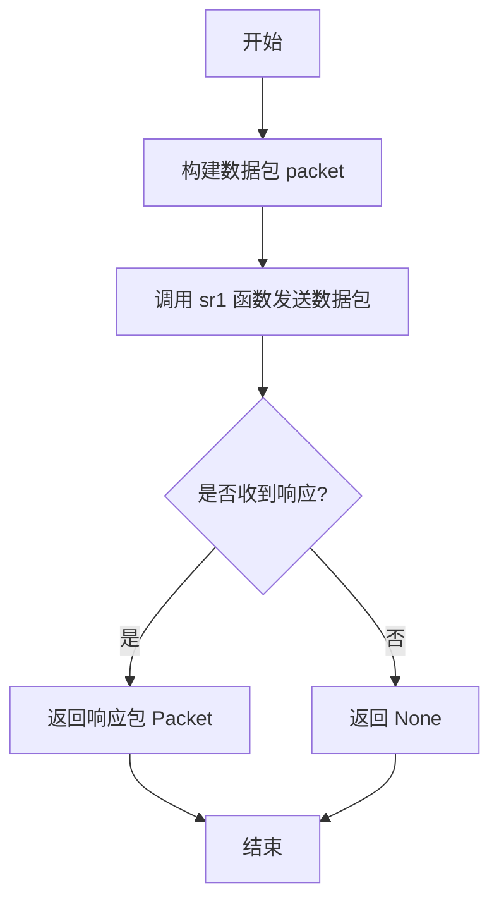

#### 带注释源码

```python
# sr1 函数源码分析（基于scapy库）

# 函数签名：
# sr1(packets, timeout=None, verbose=True, iface=None, retry=2, chain=False)

def sr1(packets, timeout=None, verbose=True, iface=None, retry=2, chain=False):
    """
    发送数据包并等待单个响应
    
    参数:
        packets: 要发送的数据包（ARP, IP/ICMP等）
        timeout: 超时时间（秒）
        verbose: 详细输出级别
        iface: 网络接口
        retry: 重试次数
        chain: 是否返回请求包
    
    返回:
        第一个响应包，如果没有响应则返回None
    """
    
    # 1. 解析数据包
    # 将传入的数据包转换为Scapy的Packet对象
    
    # 2. 发送数据包
    # 使用底层socket发送数据包到网络
    
    # 3. 监听响应
    # 在指定timeout时间内等待响应
    
    # 4. 处理结果
    # 如果收到响应，解析并返回第一个响应包
    # 如果超时，返回None
```

#### 在代码中的实际使用示例

```python
# 使用方式1：在 try_getting_mac 方法中获取MAC地址
ans = sr1(ARP(op=1, pdst=ip), timeout=config.network_timeout, verbose=0)
# 发送ARP请求包（op=1表示ARP请求）
# timeout设置网络超时时间
# verbose=0表示静默模式，不输出详细信息
# 返回值是响应包，包含ARP响应中的MAC地址

# 使用方式2：在 execute 方法中获取本机IP
self_ip = sr1(IP(dst="1.1.1.1", ttl=1) / ICMP(), verbose=0, timeout=config.network_timeout)[IP].dst
# 发送IP/ICMP数据包（TTL=1）
# 通过接收的响应包提取源IP地址作为本机IP
```


### `srp` (from scapy.all)

描述：Scapy 库中的 srp (Send and Receive Packets) 函数，用于发送数据包并捕获网络上的多个响应。该函数发送以太网帧（包含ARP请求）到指定的网络范围，并返回所有接收到的响应，常用于局域网主机发现和MAC地址收集。

参数：

- `x`：`Packet` 或 `PacketSuite`，要发送的数据包（这里是 `Ether(dst="ff:ff:ff:ff:ff:ff") / ARP(op=1, pdst=f"{self_ip}/24")`）
- `timeout`：`float`，等待响应的超时时间（秒），默认值为 None（无限等待）
- `iface`：`str`，可选，指定发送和接收的网络接口
- `iface_hint`：`str`，可选，用于解析目标网络的接口提示
- `filter`：`str`，可选，BPF 过滤器表达式
- `prn`：`callable`，可选，对每个捕获的包调用的回调函数
- `store`：`bool`，可选，是否存储捕获的包，默认为 True
- `quiet`：`bool`，可选，是否抑制 Scapy 的输出消息
- `verbose`：`int` 或 `bool`，详细输出级别，0 或 False 表示静默模式

返回值：`tuple`，返回两个列表组成的元组：
- 第一个列表：发送的数据包及其元数据
- 第二个列表：接收到的响应包列表（这里是 `arp_responses`）

#### 流程图

```mermaid
flowchart TD
    A[开始调用 srp 函数] --> B[构建网络请求包]
    B --> C{设置参数}
    C --> D[通过指定网卡发送数据包]
    D --> E[监听网络响应]
    E --> F{是否收到响应?}
    F -->|是| G[收集所有响应包]
    F -->|否| H{是否超时?}
    H -->|否| E
    H -->|是| I[返回空响应]
    G --> J[返回 (发送包列表, 响应包列表) 元组]
    I --> J
```

#### 带注释源码

```python
# 使用 Scapy 的 srp 函数发送 ARP 请求并获取多个响应
# 源码来自 kube-hunter 项目的 ArpSpoofHunter.execute() 方法

# 构建 ARP 请求包
# Ether: 以太网帧头，dst="ff:ff:ff:ff:ff:ff" 为广播地址
# ARP: 地址解析协议，op=1 表示 ARP 请求（ARPOP_REQUEST）
# pdst: 目标 IP 地址，f"{self_ip}/24" 表示当前 IP 所在的 /24 子网
arp_request = Ether(dst="ff:ff:ff:ff:ff:ff") / ARP(op=1, pdst=f"{self_ip}/24")

# 调用 srp 函数发送请求并等待响应
# 参数说明：
# - arp_request: 要发送的 ARP 请求包
# - timeout: 超时时间，从配置中读取（注意：代码中有个拼写错误 config.netork_timeout）
# - verbose=0: 静默模式，不输出 Scapy 的详细信息
arp_responses, _ = srp(
    arp_request, 
    timeout=config.netork_timeout, 
    verbose=0,
)

# 返回值说明：
# - arp_responses: 接收到的响应包列表，每个元素是 (发送包, 响应包) 的元组
# - _: 未被使用的发送包确认列表（用 _ 表示忽略）

# 响应包的结构：
# - response[ARP].hwsrc: 响应包中的源 MAC 地址（ARP 响应者的 MAC）
# - response[ARP].psrc: 响应包中的源 IP 地址（ARP 响应者的 IP）

# 示例：提取所有响应者的 MAC 地址
unique_macs = list(set(response[ARP].hwsrc for _, response in arp_responses))
```


### `try_getting_mac` 中的 ARP 数据包构造

该函数用于构造并发送ARP请求包，以获取指定IP地址对应的MAC地址。它通过Scapy的ARP类构建ARP请求（op=1表示ARP请求），然后使用sr1函数发送并等待响应。

参数：

- `self`：隐式参数，类型为`ArpSpoofHunter`实例，表示调用该方法的类实例本身
- `ip`：类型为`str`，目标主机的IP地址，用于填充ARP请求包中的pdst字段

返回值：`Optional[str]`，返回目标主机的MAC地址，如果未收到响应则返回`None`

#### 流程图

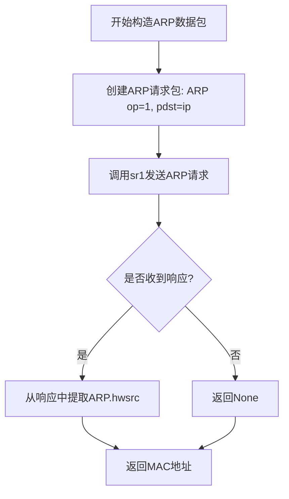

#### 带注释源码

```python
def try_getting_mac(self, ip):
    # 构造ARP请求包
    # op=1 表示ARP请求（ARP请求为1，ARP响应为2）
    # pdst=ip 设置目标IP地址字段
    ans = sr1(ARP(op=1, pdst=ip), timeout=config.network_timeout, verbose=0)
    # 检查是否收到响应
    return ans[ARP].hwsrc if ans else None
    # 如果收到响应，从ARP层提取硬件源地址（MAC地址）并返回
    # 如果未收到响应（ans为None），返回None
```

---

### `execute` 方法中的 ARP 扫描包构造

该方法用于在本地子网（/24）进行ARP扫描，构造广播ARP请求包以发现同一网络中的活跃主机。

参数：

- `self`：隐式参数，类型为`ArpSpoofHunter`实例

返回值：`None`，该方法通过`publish_event`发布事件，不直接返回数据

#### 流程图

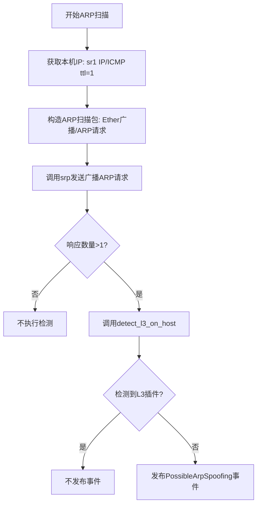

#### 带注释源码

```python
def execute(self):
    # 通过发送TTL=1的ICMP包获取本机IP地址（路由跳转前的源IP）
    self_ip = sr1(IP(dst="1.1.1.1", ttl=1) / ICMP(), verbose=0, timeout=config.network_timeout)[IP].dst
    
    # 构造ARP扫描包
    # Ether(dst="ff:ff:ff:ff:ff:ff") - 以太网广播地址（MAC层）
    # ARP(op=1, pdst=f"{self_ip}/24") - ARP请求包，目标为整个子网
    # 使用srp在第二层发送广播包
    arp_responses, _ = srp(
        Ether(dst="ff:ff:ff:ff:ff:ff") / ARP(op=1, pdst=f"{self_ip}/24"), timeout=config.netork_timeout, verbose=0,
    )

    # 检查ARP响应数量（活跃主机数量）
    # arp enabled on cluster and more than one pod on node
    if len(arp_responses) > 1:
        # L3 plugin not installed
        # 如果未检测到L3网络插件，则发布可能存在ARP欺骗风险的事件
        if not self.detect_l3_on_host(arp_responses):
            self.publish_event(PossibleArpSpoofing())
```


### `scapy.all.IP`

描述：scapy库中的IP数据包构造类，用于创建和操作IP层数据包，可设置源/目的地址、TTL、协议等参数。在kube-hunter项目中用于构造探测包以获取本机IP地址。

参数：

- `dst`：`str`，目标目的地址（可选），指定IP包的目的IP
- `src`：`str`，源地址（可选），指定IP包的源IP（默认自动填充）
- `ttl`：`int`，生存时间（可选），设置IP包的TTL值
- `proto`：`int`，协议号（可选），指定上层协议（如ICMP为1）
- `**kwargs`：`dict`，其他IP头部字段（如id、flags、tos等）

返回值：`scapy.packet.Packet`，返回构造的IP数据包对象，可进一步嵌套其他层协议

#### 流程图

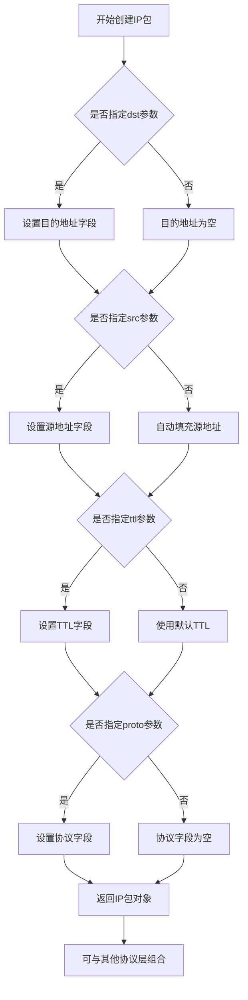

#### 带注释源码

```
# 在 kube-hunter 代码中的实际使用场景 1：
# 构造一个ICMP探测包用于获取本机IP地址
# dst="1.1.1.1" - 目的地址（使用外部可达地址）
# ttl=1 - 设置TTL为1，用于触发路由路径记录
# / ICMP() - 使用/操作符将ICMP层附加到IP层

packet = IP(dst="1.1.1.1", ttl=1) / ICMP()

# 发送数据包并获取响应
response = sr1(packet, verbose=0, timeout=config.network_timeout)

# 从响应中提取目标地址
self_ip = response[IP].dst


# 在 kube-hunter 代码中的实际使用场景 2：
# 构造ARP请求包（虽然主要使用ARP层，但IP层也参与构造）
# srp()函数中构造ARP扫描包
# op=1 表示ARP请求（ARP operation 1 = request）
# pdst=f"{self_ip}/24" 表示扫描的目标网段

arp_responses, _ = srp(
    Ether(dst="ff:ff:ff:ff:ff:ff") / ARP(op=1, pdst=f"{self_ip}/24"), 
    timeout=config.netork_timeout, 
    verbose=0,
)

# IP类关键特性：
# 1. 自动计算校验和（checksum）
# 2. 自动计算长度（len）
# 3. 自动填充ID字段
# 4. 支持分片（fragment参数）
# 5. 支持选项字段（options参数）
# 6. 可通过索引访问上层协议：packet[IP].src, packet[IP].dst
```


### ICMP数据包构造

这是scapy库中用于构造ICMP数据包的类，用于在网络探测中发送ICMP请求包。

参数：

- `type`：`int`，ICMP类型（默认0表示Echo Reply）
- `code`：`int`，ICMP代码（默认0）
- `chksum`：`int`，校验和（可选，Scapy会自动计算）
- `id`：`int`，标识符，用于匹配请求和响应
- `seq`：`int`，序列号

返回值：`scapy.layers.inet.ICMP`，返回一个ICMP数据包对象，可与其他协议层组合使用

#### 流程图

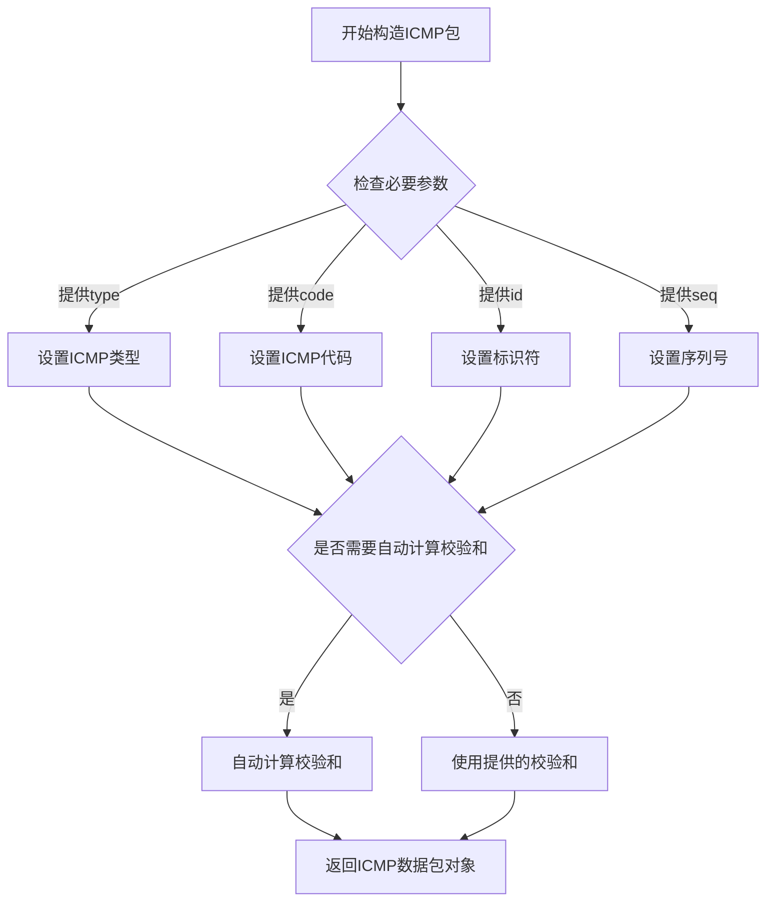

#### 带注释源码

```python
# 在kube-hunter代码中的使用方式：
# 构造一个ICMP数据包用于网络探测

# 方法1：基本ICMP包（Echo Request）
icmp_packet = ICMP()

# 方法2：带参数的ICMP包
# type=8 表示Echo Request（请求回显）
# code=0 
# id=1 标识符
# seq=1 序列号
icmp_packet = ICMP(type=8, code=0, id=1, seq=1)

# 在实际代码中的使用（来自execute方法）
# 结合IP层构造完整的ICMP请求包
# IP(dst="1.1.1.1", ttl=1) 创建IP包，TTL设为1
# / ICMP() 使用Scapy的/操作符将ICMP层叠加到IP层上
response = sr1(
    IP(dst="1.1.1.1", ttl=1) / ICMP(),  # 构造ICMP请求包
    verbose=0,  # 禁用详细输出
    timeout=config.network_timeout  # 超时时间
)

# 提取响应中的源IP地址
self_ip = response[IP].dst
```

#### 补充说明

**设计目标**：通过构造ICMP包来探测网络路径和可达性，是网络发现和漏洞探测的基础技术之一。

**在代码中的作用**：
- 用于检测主机是否可达
- 结合TTL=1的IP包可以探测网络路径的第一跳
- 配合ARP探测实现网络拓扑发现

**潜在技术债务**：
- 硬编码目标IP地址"1.1.1.1"（Cloudflare DNS），可能不够隐蔽
- 缺少对ICMP响应包的详细错误处理
- 没有对构造数据包过程的日志记录


### `Ether` (scapy.all)

Ether 是 scapy 库中的一个类，用于构造和解析以太网帧。该类允许创建以太网头部，包含目标 MAC 地址、源 MAC 地址和 EtherType 字段。

参数：

- `dst`：`str`，目标 MAC 地址，默认为 "ff:ff:ff:ff:ff:ff"（广播地址）
- `src`：`str`，源 MAC 地址，默认为 "00:00:00:00:00:00"
- `type`：`int`，上层协议类型，默认为 0x0800（IPv4），常用值包括 0x0806（ARP）、0x86DD（IPv6）

返回值：`scapy.layers.l2.Ether`，返回一个以太网帧对象，可与其他 scapy 数据包层（如 IP、ARP）通过 `/` 操作符组合

#### 流程图

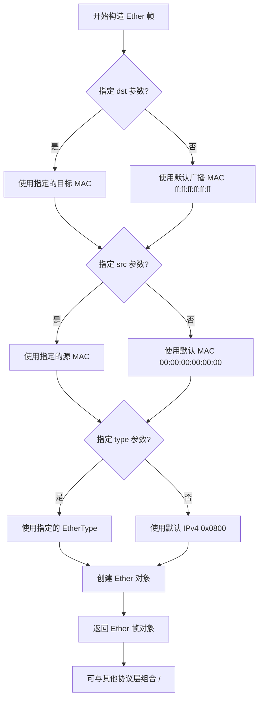

#### 带注释源码

```python
# Ether 类简化实现原理（基于 scapy 库）
class Ether(Packet):
    """以太网帧构造类"""
    
    name = "Ethernet"
    fields_desc = [
        # 目标 MAC 地址字段 (6 字节)
        DestMACField("dst"),
        # 源 MAC 地址字段 (6 字节)
        SourceMACField("src"),
        # EtherType 字段 (2 字节)，标识上层协议
        XShortEnumField("type", 0x0800, ETHER_TYPES),
    ]
    
    def __init__(self, dst="ff:ff:ff:ff:ff:ff", src="00:00:00:00:00:00", type=0x0800, _pkt=b"", post_transform=None, **fields):
        """
        构造以太网帧
        
        参数:
            dst: 目标 MAC 地址，默认广播地址
            src: 源 MAC 地址
            type: 上层协议类型，默认 IPv4 (0x0800)
        """
        super().__init__(_pkt, post_transform, **fields)
        # 设置目标 MAC
        self.dst = dst
        # 设置源 MAC
        self.src = src
        # 设置协议类型
        self.type = type

# 使用示例（在 kube-hunter 代码中）
# Ether(dst="ff:ff:ff:ff:ff:ff") / ARP(op=1, pdst=f"{self_ip}/24")
# 构造一个以太网广播帧，里面封装 ARP 请求
# ff:ff:ff:ff:ff:ff 是以太网广播 MAC 地址，用于发送 ARP 请求到整个子网
```


### `handler.subscribe`

事件订阅装饰器，用于将事件处理类（Hunter）注册到指定事件类型的订阅列表中。当该类型的事件被发布时，触发对应的处理类执行。

参数：

- `event_type`：`Type[Event]`，要订阅的事件类型（如 `CapNetRawEnabled`），表示当前处理类希望接收并处理该类型的事件

返回值：`Callable[[Type[T]], Type[T]]`，返回装饰器函数，接收事件处理类作为参数，返回装饰后的类

#### 流程图

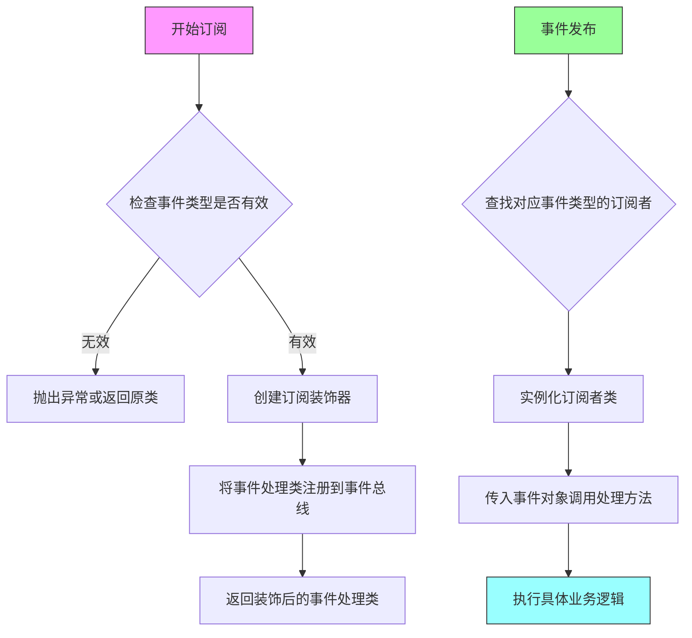

#### 带注释源码

```python
# 事件订阅装饰器的典型实现（位于 core.events 模块）

class EventHandler:
    """事件处理器，负责管理事件订阅和发布"""
    
    def __init__(self):
        # 存储事件类型到订阅者列表的映射
        # 结构: {EventType: [SubscriberClass1, SubscriberClass2, ...]}
        self.subscribers = {}
    
    def subscribe(self, event_type: Type[Event]) -> Callable[[Type[T]], Type[T]]:
        """
        事件订阅装饰器
        
        参数:
            event_type: 要订阅的事件类型，必须是 Event 的子类
            
        返回:
            装饰器函数，用于装饰事件处理类
        """
        def decorator(handler_class: Type[T]) -> Type[T]:
            """
            实际的装饰器实现
            
            参数:
                handler_class: 要注册的事件处理类（通常是 Hunter 子类）
                
            返回:
                装饰后的类，保持原类不变
            """
            # 初始化该事件类型的订阅者列表（如果不存在）
            if event_type not in self.subscribers:
                self.subscribers[event_type] = []
            
            # 将处理类添加到订阅者列表
            # 注意：这里存储的是类本身，而不是实例
            if handler_class not in self.subscribers[event_type]:
                self.subscribers[event_type].append(handler_class)
            
            # 返回原类，不改变其行为
            return handler_class
        
        return decorator
    
    def publish(self, event: Event) -> None:
        """
        发布事件给所有订阅者
        
        参数:
            event: 要发布的事件实例
        """
        event_type = type(event)
        
        # 查找该事件类型的所有订阅者
        for handler_class in self.subscribers.get(event_type, []):
            # 实例化处理类
            handler_instance = handler_class(event)
            
            # 如果处理类有 execute 方法，则调用执行
            if hasattr(handler_instance, 'execute'):
                handler_instance.execute()


# 使用示例 - 代码中的实际用法
@handler.subscribe(CapNetRawEnabled)  # 订阅 CapNetRawEnabled 事件
class ArpSpoofHunter(ActiveHunter):
    """
    当 CapNetRawEnabled 事件被发布时，
    ArpSpoofHunter 类会被实例化并执行
    """
    def __init__(self, event):
        self.event = event
    
    def execute(self):
        # 执行 ARP 欺骗检测逻辑
        pass
```

#### 补充说明

| 项目 | 说明 |
|------|------|
| **设计模式** | 观察者模式（Observer Pattern） |
| **核心作用** | 解耦事件生产者和消费者，Hunter 类只需要声明感兴趣的事件类型，无需关心事件如何触发 |
| **事件流程** | 1. 某处发布 `CapNetRawEnabled` 事件 → 2. 事件总线查找订阅者 → 3. 实例化 `ArpSpoofHunter` → 4. 调用 `execute()` 方法 |
| **与代码关联** | 在 `ArpSpoofHunter` 类中，通过 `self.event` 可以访问发布的事件对象，获取事件携带的数据 |


### `ActiveHunter.publish_event`

该方法继承自 `ActiveHunter` 基类，用于发布检测到的漏洞事件，将安全发现发布到事件系统中供后续处理或报告使用。

参数：

- `vulnerability`：`Vulnerability` 或 `PossibleArpSpoofing`，需要发布的漏洞事件对象，包含漏洞的详细信息

返回值：`None`，无返回值（方法直接发布事件到事件处理器）

#### 流程图

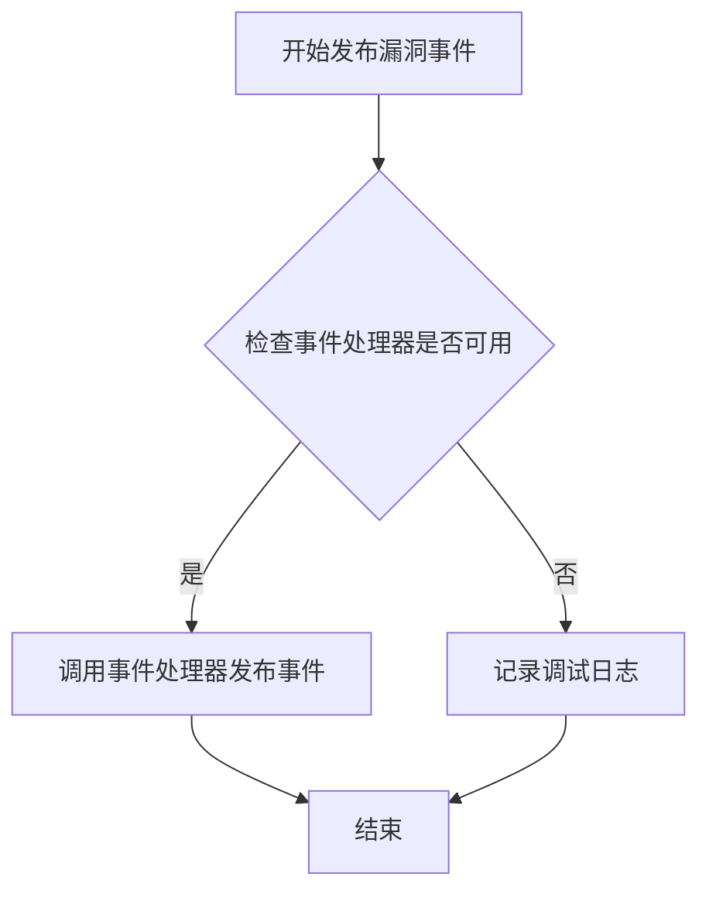

#### 带注释源码

```python
def publish_event(self, vulnerability):
    """
    发布漏洞事件到事件系统
    
    参数:
        vulnerability: Vulnerability类型，漏洞事件对象，包含漏洞的详细信息
                     例如: PossibleArpSpoofing() 实例
    
    返回:
        无返回值
    
    说明:
        该方法继承自ActiveHunter基类，负责将检测到的安全漏洞
        发布到kube-hunter的事件处理系统中，供后续的订阅者处理
        或生成最终的安全报告使用。
    """
    # 调用事件处理器的publish方法将漏洞事件发布出去
    # 事件处理器(handler)会根据订阅关系通知相应的处理模块
    handler.publish(vulnerability)
```


### `PossibleArpSpoofing.__init__`

构造函数，初始化PossibleArpSpoofing漏洞类，继承Vulnerability和Event基类，设置漏洞名称为"Possible Arp Spoof"，关联KubernetesCluster目标，分类为IdentityTheft，并设置漏洞ID为KHV020。

参数：

- `self`： PossibleArpSpoofing，隐式参数，表示当前类的实例对象

返回值：无（`None`），构造函数不显式返回值

#### 流程图

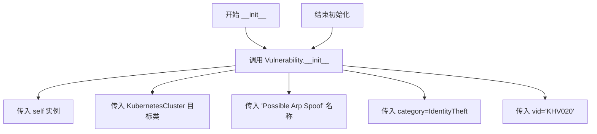

#### 带注释源码

```python
def __init__(self):
    """初始化 PossibleArpSpoofing 漏洞类
    
    该构造函数继承自 Vulnerability 类，用于描述一个可能的 ARP 欺骗漏洞。
    攻击者可能在集群中运行恶意 Pod 并执行 ARP 欺骗攻击，
    从而在节点上的 Pod 之间执行中间人攻击（MITM）。
    """
    # 调用父类 Vulnerability 的构造函数
    # 参数说明：
    # - self: 当前实例
    # - KubernetesCluster: 漏洞目标类型，表示该漏洞影响 Kubernetes 集群
    # - "Possible Arp Spoof": 漏洞显示名称
    # - category=IdentityTheft: 漏洞分类为身份盗窃
    # - vid="KHV020": 漏洞唯一标识符
    Vulnerability.__init__(
        self, KubernetesCluster, "Possible Arp Spoof", category=IdentityTheft, vid="KHV020",
    )
```


### `ArpSpoofHunter.__init__`

构造函数，接收触发事件，初始化ARP欺骗检测器对象，将事件绑定到实例属性以便后续处理。

参数：

- `self`：隐式参数，ArpSpoofHunter实例本身，当前对象实例
- `event`：Event类型，来自事件系统的触发事件，表示CapNetRawEnabled能力已被启用，作为狩猎任务的触发条件

返回值：`None`，构造函数无返回值，仅初始化实例状态

#### 流程图

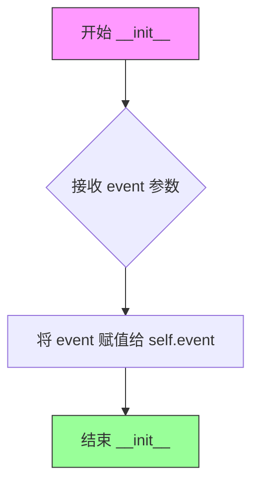

#### 带注释源码

```
def __init__(self, event):
    """ARP欺骗hunter的构造函数
    
    接收事件系统触发的CapNetRawEnabled事件，
    初始化hunter实例并保存事件引用用于后续处理。
    
    参数:
        event: Event类型，来自@subscribe(CapNetRawEnabled)装饰器
               传递的触发事件，表示网络能力已启用
    """
    # 将传入的事件对象保存为实例属性
    # 后续execute方法会使用此事件进行ARP spoofing检测
    self.event = event
```


### `ArpSpoofHunter.try_getting_mac`

该方法通过向指定IP发送ARP请求包（ARP Who-Who请求）来获取目标主机的MAC地址，利用Scapy库发送请求并等待响应，若成功获取响应则返回MAC地址，否则返回None。

参数：

- `ip`：`str`，目标主机的IP地址，用于构造ARP请求包的目的地址字段（pdst）

返回值：`Optional[str]`，若成功收到ARP响应则返回目标主机的MAC地址（字符串格式），否则返回None表示未获取到MAC地址

#### 流程图

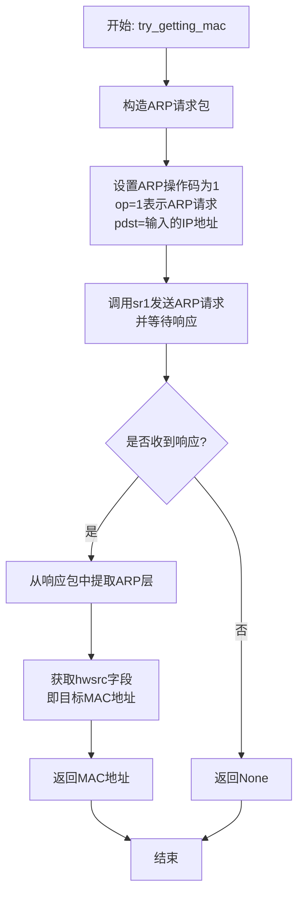

#### 带注释源码

```python
def try_getting_mac(self, ip):
    """
    尝试通过ARP请求获取指定IP对应的MAC地址
    
    该方法构造一个ARP请求包（ARP Who-Has请求），
    发送给目标IP并等待响应，从响应包中提取发送方的MAC地址
    
    参数:
        ip: 目标主机的IP地址字符串
    
    返回:
        若成功获取MAC地址则返回字符串格式的MAC地址（如'00:11:22:33:44:55'）
        若ARP请求超时或无响应则返回None
    """
    # 使用scapy的sr1函数发送ARP请求并等待单个响应包
    # ARP(op=1) 表示ARP请求包（ARP Who-Has）
    # pdst=ip 设置目标IP地址字段
    # timeout=config.network_timeout 从配置获取网络超时时间
    # verbose=0 静默模式，不输出详细信息
    ans = sr1(ARP(op=1, pdst=ip), timeout=config.network_timeout, verbose=0)
    
    # 判断是否收到响应（ans不为None表示收到响应）
    # 如果收到响应，从响应包中提取ARP层的hwsrc字段（源硬件地址，即MAC地址）
    # 如果未收到响应（ans为None），返回None
    return ans[ARP].hwsrc if ans else None
```


### `ArpSpoofHunter.detect_l3_on_host`

检测是否存在L3网络插件的成员方法。该方法通过分析ARP响应中的MAC地址唯一性，结合外部IP的MAC地址比对，来判断当前主机是否使用了L3网络插件（如NAT模式）。如果整个LAN和外部地址都返回相同的MAC地址，则说明存在L3网络插件。

参数：

- `self`：`ArpSpoofHunter`，当前ArpSpoofHunter类的实例对象
- `arp_responses`：`List[Tuple]` 或 `List`，Scapy库发送ARP请求后收到的响应列表，每个元素为(发送包, 响应包)的元组，可迭代对象

返回值：`bool`，返回True表示检测到L3网络插件的存在；返回False表示未检测到L3网络插件

#### 流程图

```mermaid
flowchart TD
    A[开始检测L3插件] --> B[从arp_responses提取唯一MAC地址列表]
    B --> C{唯一MAC数量 == 1?}
    C -->|否| D[返回False - 存在多个不同MAC]
    C -->|是| E[尝试获取外部IP 1.1.1.1的MAC地址]
    E --> F[调用try_getting_mac方法]
    F --> G{外部MAC == 唯一MAC[0]?}
    G -->|是| H[返回True - 检测到L3插件]
    G -->|否| I[返回False - 未检测到L3插件]
```

#### 带注释源码

```python
def detect_l3_on_host(self, arp_responses):
    """
    检测是否存在L3网络插件
    通过比较LAN内MAC地址和外部IP MAC地址来判断是否为L3插件（如NAT模式）
    
    参数:
        arp_responses: Scapy的srp/sr1返回的ARP响应列表，
                      包含(发送包, 响应包)元组，可迭代
    
    返回:
        bool: True表示存在L3网络插件，False表示不存在
    """
    
    # 记录调试日志，表明正在进行L3插件检测
    logger.debug("Attempting to detect L3 network plugin using ARP")
    
    # 从ARP响应中提取所有唯一的MAC地址
    # 使用集合推导式提取[ARP].hwsrc（硬件源地址，即MAC地址）
    # 然后转为列表去重
    unique_macs = list(set(response[ARP].hwsrc for _, response in arp_responses))
    
    # 判断条件1：LAN内MAC地址是否唯一（只有1个唯一MAC说明所有主机共享同一MAC）
    if len(unique_macs) == 1:
        
        # 尝试获取局域网外IP（1.1.1.1）的MAC地址
        # 这是一个外部公共DNS地址，用于测试是否通过NAT/网关访问
        outside_mac = self.try_getting_mac("1.1.1.1")
        
        # 判断条件2：外部IP的MAC是否与LAN内MAC相同
        # 如果相同，说明所有流量都通过同一个MAC（可能是网关/NAT设备）转发
        # 这表明存在L3网络插件（如kube-proxy的NAT模式）
        if outside_mac == unique_macs[0]:
            return True  # 检测到L3插件
    
    # 默认返回False：未检测到L3网络插件
    # 情况包括：1) 存在多个不同MAC地址；2) 外部MAC与LAN MAC不同
    return False
```


### `ArpSpoofHunter.execute`

执行ARP欺骗检测主流程，通过发送ICMP和ARP请求分析本地网络环境，判断是否存在ARP欺骗漏洞。

参数：

- `self`：`ArpSpoofHunter`，类的实例，隐式参数，代表当前检测器对象

返回值：`None`，无返回值，该方法通过发布事件的方式报告检测结果

#### 流程图

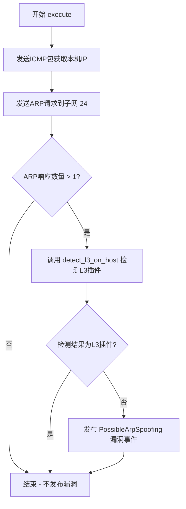

#### 带注释源码

```python
def execute(self):
    # 通过发送TTL=1的ICMP包到公网IP 1.1.1.1，获取本机IP地址
    # 利用scapy的sr1函数发送数据包并等待单个响应
    self_ip = sr1(IP(dst="1.1.1.1", ttl=1) / ICMP(), verbose=0, timeout=config.network_timeout)[IP].dst
    
    # 构造以太网广播帧和ARP请求包，扫描本地子网所有主机
    # op=1 表示ARP请求（ARP Request），pdst为目标IP段
    # srp函数发送数据包并接收所有响应
    arp_responses, _ = srp(
        Ether(dst="ff:ff:ff:ff:ff:ff") / ARP(op=1, pdst=f"{self_ip}/24"), 
        timeout=config.netork_timeout, 
        verbose=0,
    )

    # 判断条件：集群启用了ARP且节点上运行超过一个Pod
    if len(arp_responses) > 1:
        # L3网络插件未安装，存在ARP欺骗风险
        if not self.detect_l3_on_host(arp_responses):
            # 发布ARP欺骗漏洞事件，通知系统存在身份盗窃风险
            self.publish_event(PossibleArpSpoofing())
```

## 关键组件


### PossibleArpSpoofing

漏洞事件类，继承自Vulnerability和Event，用于表示集群中可能存在的ARP欺骗攻击漏洞，类别为IdentityTheft（身份盗窃）。

### ArpSpoofHunter

主动狩猎者类，继承自ActiveHunter，负责检测Kubernetes集群中是否存在ARP欺骗攻击的可能性，通过订阅CapNetRawEnabled事件触发检测流程。

### try_getting_mac

网络探测方法，通过发送ARP请求获取指定IP地址对应的MAC地址，返回MAC地址字符串或None。

### detect_l3_on_host

L3网络插件检测方法，通过分析ARP响应判断是否存在L3网络插件，返回布尔值表示是否检测到L3插件。

### execute

主执行方法，负责初始化扫描、获取本机IP、执行ARP扫描并判断是否发布PossibleArpSpoofing漏洞事件。

### CapNetRawEnabled

事件订阅标记，表示该Hunter订阅了CapNetRawEnabled事件，即当系统检测到CAP_NET_RAW能力启用时触发。

### config

全局配置对象，提供网络超时等配置参数，从kube_hunter.conf模块导入。


## 问题及建议


### 已知问题

- **typo错误**：第61行 `config.netork_timeout` 应为 `config.network_timeout`，会导致配置读取失败
- **空值异常处理缺失**：`try_getting_mac` 方法中 `sr1()` 可能返回 `None`，但代码直接访问 `ans[ARP].hwsrc` 会引发 `TypeError`；`execute` 方法中 `sr1()` 返回 `None` 时访问 `[IP].dst` 同样会导致异常
- **Scapy返回值处理错误**：`arp_responses` 是 `srp()` 返回的元组 `(sent_packets, received_packets)`，第48行直接遍历 `arp_responses` 而非 `arp_responses[1]` 或解包后的 `received_packets`
- **硬编码网络参数**：DNS地址 `1.1.1.1` 和子网掩码 `/24` 硬编码，缺乏灵活性
- **网络超时配置不一致**：第52行使用 `config.network_timeout`，第61行使用错误的 `config.netork_timeout`

### 优化建议

- 修复 typo：`config.netork_timeout` 改为 `config.network_timeout`
- 为 `try_getting_mac` 和 `execute` 方法添加空值检查，防止 `None` 访问导致的异常
- 修正 Scapy 返回值处理：使用 `arp_responses, _ = srp(...)` 正确解包，或遍历 `arp_responses[1]`
- 将硬编码的网络参数提取为可配置选项
- 添加网络操作的重试机制和更详细的日志记录
- 考虑使用 `logging.DEBUG` 级别记录更多调试信息，便于排查网络相关问题

## 其它


### 设计目标与约束

本模块的设计目标是检测Kubernetes集群中是否存在ARP欺骗攻击的可能性。通过订阅CapNetRawEnabled事件，验证在集群节点上运行的Pod是否能够执行ARP欺骗攻击，从而评估中间人攻击（MITM）的风险。设计约束包括：依赖Scapy库进行网络包处理，使用kube-hunter框架的事件订阅机制，仅在支持原始套接字（CAP_NET_RAW）的环境中运行，对网络扫描设置超时限制以避免长时间阻塞。

### 错误处理与异常设计

代码中的错误处理主要包括：网络操作超时处理（config.network_timeout和config.netork_timeout），通过try_getting_mac方法返回None来处理无法获取MAC地址的情况，execute方法中使用数组索引访问响应时假设响应不为空但实际可能存在IndexError风险。异常处理的设计缺陷：代码中存在typo（config.netork_timeout应为config.network_timeout），execute方法中对sr1返回值直接进行索引操作可能导致AttributeError或IndexError，缺乏对网络不可达或权限不足等情况的处理。

### 数据流与状态机

数据流流程为：1）订阅CapNetRawEnabled事件触发ArpSpoofHunter初始化；2）execute方法首先获取本机IP地址（通过ICMP ttl=1追踪路由）；3）执行ARP扫描获取同一网段的所有设备；4）调用detect_l3_on_host方法检测是否存在L3网络插件；5）如果网段内有多于一个设备且未检测到L3插件，则发布PossibleArpSpoofing漏洞事件。状态机相对简单：初始状态→扫描状态→分析状态→结果状态（发布漏洞或无操作）。

### 外部依赖与接口契约

外部依赖包括：scapy.all（ARP、IP、ICMP、Ether、sr1、srp网络操作），kube_hunter.conf.config（配置对象，提供network_timeout配置），kube_hunter.core.events.handler（事件订阅装饰器），kube_hunter.core.events.types（Event和Vulnerability基类），kube_hunter.core.types（ActiveHunter、KubernetesCluster、IdentityTheft类），kube_hunter.modules.hunting.capabilities.CapNetRawEnabled（触发事件）。接口契约：handler.subscribe(CapNetRawEnabled)注册事件监听器，publish_event方法发布漏洞事件，detect_l3_on_host方法接收(发送包, 响应包)元组列表返回布尔值。

### 安全性考虑

本模块涉及网络安全扫描，需要考虑：1）ARP扫描可能被检测或触发安全告警；2）使用1.1.1.1作为探测地址可能被某些网络环境阻止；3）/24网段扫描可能产生大量网络流量；4）对外部IP（1.1.1.1）的探测可能违反某些组织的网络安全策略；5）代码需要CAP_NET_RAW权限才能运行原始套接字操作。

### 性能考虑

性能优化点包括：1）/24网段扫描可能耗时较长，可考虑限制扫描范围；2）使用srp而非sr时序函数可以进行异步优化；3）unique_macs列表推导式可以优化为生成器以减少内存占用；4）网络超时设置需要权衡准确性和响应时间；5）可以考虑缓存已获取的MAC地址避免重复查询。

### 兼容性考虑

兼容性问题包括：1）代码依赖Scapy库，需要目标环境支持；2）ARP欺骗检测在Windows平台可能行为不同；3）某些Kubernetes网络插件（如Cilium、Calico）可能对ARP响应产生不同结果；4）在某些受限容器环境中可能无法获取正确的网络信息；5）IPv6环境下ARP被NDP替代，代码仅支持IPv4。

### 配置管理

配置依赖通过config对象统一管理，包括：config.network_timeout（网络操作超时时间），config.netork_timeout（代码中的typo，应为network_timeout）。配置建议：应该添加扫描网段范围配置（当前硬编码为/24），添加外部探测IP配置（当前硬编码为1.1.1.1），添加是否启用L3插件检测的开关，添加日志级别配置以控制debug输出。

### 日志与监控

日志使用：仅在detect_l3_on_host方法中使用logger.debug输出调试信息，记录尝试检测L3网络插件的操作。监控建议：应该记录扫描结果统计信息（扫描设备数量、响应时间），记录漏洞发布事件以追踪检测结果，添加性能指标监控（扫描耗时、超时率），考虑集成到kube-hunter的统一报告机制。

### 测试策略

测试应该包括：单元测试（try_getting_mac方法的mock测试，detect_l3_on_host方法的参数化测试），集成测试（完整的ARP扫描流程测试），模拟测试（模拟不同网络环境：单设备、多设备、有/无L3插件）。测试用例应覆盖：正常情况检测到ARP欺骗风险，未检测到风险（多设备+L3插件），网络超时处理，响应为空处理，IP获取失败处理。

    