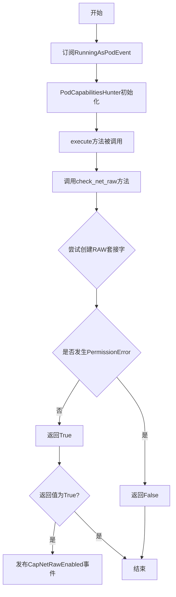
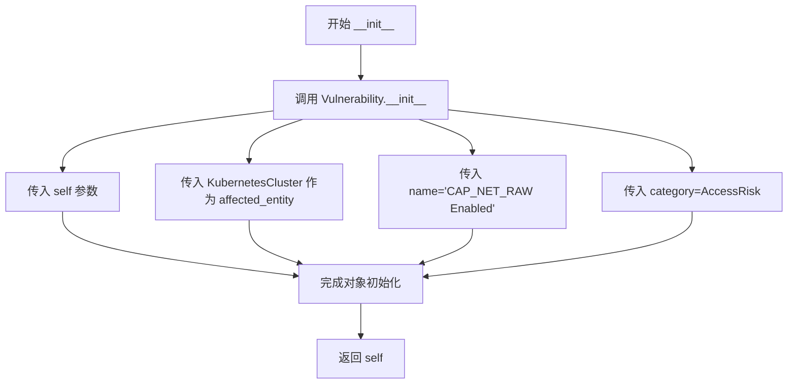
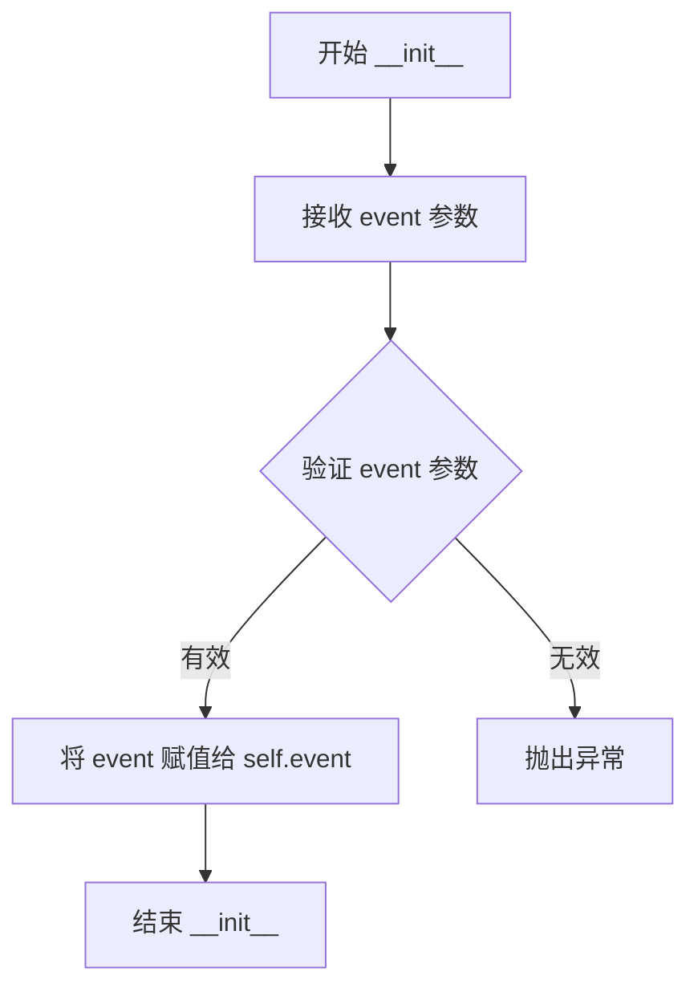
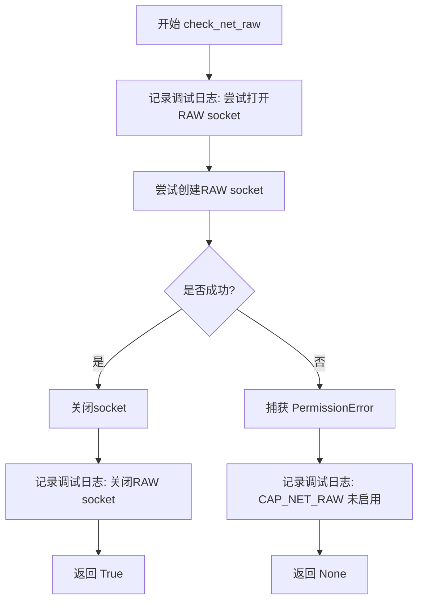
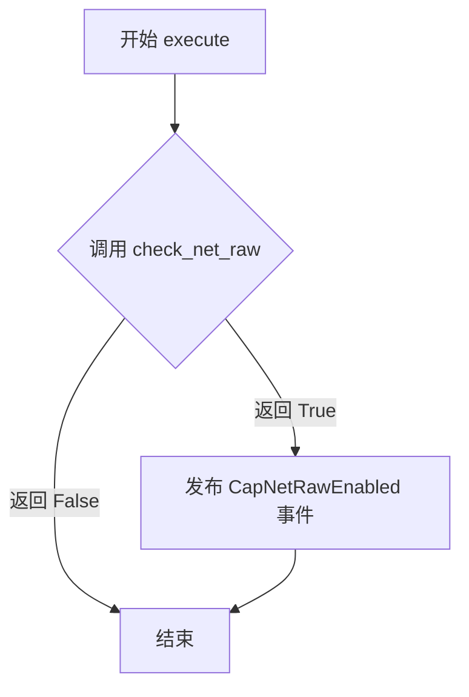

# `kubehunter\kube_hunter\modules\hunting\capabilities.py` 详细设计文档

该模块是一个Kubernetes安全检测插件，通过尝试创建RAW套接字来检测Pod是否默认启用了CAP_NET_RAW能力，从而识别潜在的网络安全风险。

## 整体流程



## 类结构

```
Event (基类)
├── Vulnerability (Event子类)
│   └── CapNetRawEnabled
Hunter (基类)
│   └── PodCapabilitiesHunter
```

## 全局变量及字段


### `logger`
    
用于记录模块日志的Logger实例

类型：`logging.Logger`
    


### `PodCapabilitiesHunter.event`
    
从事件订阅器接收的Pod运行事件，包含当前Pod的上下文信息

类型：`RunningAsPodEvent`
    
    

## 全局函数及方法


### `CapNetRawEnabled.__init__`

该方法是 `CapNetRawEnabled` 类的构造函数，用于初始化一个表示 Kubernetes 集群中 CAP_NET_RAW 漏洞的事件对象。它继承自 `Event` 和 `Vulnerability` 类，并通过调用父类的初始化方法设置漏洞名称为"CAP_NET_RAW Enabled"，分类为访问风险（AccessRisk），影响的目标为 KubernetesCluster。

参数：

- `self`：`CapNetRawEnabled`，隐式参数，指向当前类的实例对象

返回值：`None`，无返回值（构造函数）

#### 流程图



#### 带注释源码

```python
def __init__(self):
    """初始化 CapNetRawEnabled 漏洞事件对象
    
    该构造函数继承自 Event 和 Vulnerability 类,
    用于创建一个表示 CAP_NET_RAW 能力已启用 的安全漏洞事件。
    CAP_NET_RAW 是 Kubernetes Pod 默认启用的能力,
    攻击者可能利用此能力对同一节点上的其他 Pod 进行网络攻击。
    """
    # 调用父类 Vulnerability 的 __init__ 方法进行初始化
    # 参数说明:
    #   self: 当前实例对象
    #   KubernetesCluster: 受影响的实体类型,表示该漏洞影响整个 Kubernetes 集群
    #   name: 漏洞名称,显示为 'CAP_NET_RAW Enabled'
    #   category: 漏洞分类,使用 AccessRisk (访问风险) 类别
    Vulnerability.__init__(
        self,                        # 传递当前实例
        KubernetesCluster,           # affected_entity: 受影响的实体类型
        name="CAP_NET_RAW Enabled",  # name: 漏洞的名称
        category=AccessRisk,         # category: 漏洞所属的安全风险类别
    )
```


### PodCapabilitiesHunter.__init__

这是 PodCapabilitiesHunter 类的构造函数，负责初始化实例，将传入的事件对象存储为实例属性。

参数：

- `event`：`RunningAsPodEvent`，从 RunningAsPodEvent 订阅的事件对象，包含 Pod 运行时的上下文信息

返回值：`None`，构造函数不返回任何值

#### 流程图



#### 带注释源码

```python
def __init__(self, event):
    """PodCapabilitiesHunter 类的初始化方法
    
    参数:
        event: RunningAsPodEvent 实例，包含 Pod 运行时的上下文信息
    """
    # 将传入的事件对象存储为实例属性，供类中其他方法使用
    self.event = event
```


### `PodCapabilitiesHunter.check_net_raw`

该方法用于检测 Kubernetes Pod 是否启用了 CAP_NET_RAW 能力。它通过尝试创建一个原始 RAW 套接字来判断——如果成功则表示 CAP_NET_RAW 已启用（返回 True），如果抛出 PermissionError 则表示未启用。

参数：

- 该方法无参数（除隐含的 `self`）

返回值：`bool` 或 `None`，成功创建 RAW socket 时返回 `True`，触发 PermissionError 时隐式返回 `None`

#### 流程图



#### 带注释源码

```python
def check_net_raw(self):
    """检测 Pod 是否启用了 CAP_NET_RAW 能力
    
    原理：尝试创建原始套接字(SOCK_RAW)。在 Linux 系统中，
    创建 RAW socket 需要 CAP_NET_RAW 权限。如果未启用该能力，
    系统会抛出 PermissionError。
    
    返回值:
        bool: 如果成功创建 RAW socket 返回 True，表示 CAP_NET_RAW 已启用
        None: 如果抛出 PermissionError，返回 None，表示 CAP_NET_RAW 未启用
    """
    # 记录调试信息，表明当前正在尝试打开 RAW socket
    logger.debug("Passive hunter's trying to open a RAW socket")
    
    try:
        # 尝试创建一个 RAW 类型的 socket
        # AF_INET: IPv4 协议
        # SOCK_RAW: 原始套接字，允许直接访问底层协议
        # IPPROTO_RAW: 原始 IP 协议，让系统自动选择传输协议
        s = socket.socket(socket.AF_INET, socket.SOCK_RAW, socket.IPPROTO_RAW)
        
        # 成功创建后关闭 socket，释放资源
        s.close()
        
        # 记录成功关闭 RAW socket 的调试信息
        logger.debug("Passive hunter's closing RAW socket")
        
        # 返回 True 表示 CAP_NET_RAW 能力已启用
        return True
        
    except PermissionError:
        # 如果发生权限错误，说明当前 Pod 没有 CAP_NET_RAW 能力
        # 这是预期的行为，因为我们要检测的就是该能力是否启用
        logger.debug("CAP_NET_RAW not enabled")
        
        # 隐式返回 None，无需显式返回
```


### `PodCapabilitiesHunter.execute`

该方法用于检测当前 Pod 是否启用了 CAP_NET_RAW 能力。如果检测到该能力已启用，则发布安全漏洞事件 CapNetRawEnabled，提示攻击者可能利用此能力对同一节点上的其他 Pod 进行网络攻击。

参数： 无

返回值：`None`，无显式返回值，通过发布事件的方式输出结果

#### 流程图



#### 带注释源码

```
def execute(self):
    """执行 CAP_NET_RAW 能力检测
    
    该方法是 PodCapabilitiesHunter 的核心执行方法，通过调用 check_net_raw
    方法尝试打开原始套接字来检测 CAP_NET_RAW 能力是否启用。如果能力已启用，
    则发布 CapNetRawEnabled 安全漏洞事件。
    """
    # 调用 check_net_raw 方法检查 CAP_NET_RAW 是否启用
    if self.check_net_raw():
        # 如果 CAP_NET_RAW 已启用，发布安全漏洞事件
        self.publish_event(CapNetRawEnabled())
```

## 关键组件


### CapNetRawEnabled

继承自Event和Vulnerability的漏洞事件类，用于表示CAP_NET_RAW能力启用这一安全风险。当检测到目标Pod默认启用了CAP_NET_RAW能力时，会发布此漏洞事件。

### PodCapabilitiesHunter

Hunter类型检测器类，通过订阅RunningAsPodEvent事件来检测运行中的Pod是否启用了CAP_NET_RAW能力。核心方法是check_net_raw尝试创建原始套接字，若成功则表明该能力已启用。

### check_net_raw方法

通过尝试创建原始套接字（SOCK_RAW）来被动检测CAP_NET_RAW能力是否启用。如果成功创建套接字说明能力已启用，返回True；若抛出PermissionError则说明能力未启用，返回None。

### execute方法

检测流程的入口方法，调用check_net_raw进行能力检测，若结果为True则通过publish_event发布CapNetRawEnabled漏洞事件。

### RunningAsPodEvent订阅

通过@handler.subscribe(RunningAsPodEvent)装饰器实现的事件订阅机制，使PodCapabilitiesHunter能够接收并处理来自主机发现模块的Pod运行事件。


## 问题及建议


### 已知问题

-   异常处理不全面：只捕获PermissionError，但socket.socket()可能抛出其他异常（如socket.error、OSError等），未处理的异常会导致程序崩溃
-   资源泄漏风险：socket对象在异常情况下可能未被正确关闭，应使用上下文管理器确保资源释放
-   Socket操作无超时设置：原始套接字创建操作可能阻塞，没有设置超时时间可能导致检测线程挂起
-   无实际作用的self.event：execute方法未使用self.event参数，传入的事件对象被忽略
-   日志逻辑冗余：成功和失败的debug日志分散在try和except块中，可合并简化

### 优化建议

-   使用with语句管理socket资源，确保异常情况下也能正确关闭
-   添加socket.settimeout()设置合理的超时时间（如5秒）
-   扩大异常捕获范围，使用except Exception或except (socket.error, OSError)并根据具体错误类型做不同处理
-   考虑将检测结果通过self.event传递或移除未使用的event参数，保持接口一致性
-   简化日志逻辑，统一在方法外部记录检测结果
-   添加单元测试用例，测试各种异常场景下的行为
-   考虑将socket检测逻辑抽取为独立函数，提高可测试性和可复用性


## 其它


### 设计目标与约束

设计目标：检测Kubernetes集群中Pod是否默认启用了CAP_NET_RAW能力，该能力允许Pod创建原始网络套接字，可能被攻击者利用进行网络攻击。设计约束：依赖kube-hunter的事件驱动框架，仅在Pod运行环境中有效，需要CAP_NET_RAW权限才能执行检测。

### 错误处理与异常设计

代码中仅捕获了PermissionError异常，当CAP_NET_RAW未启用时捕获并返回False。对于其他socket异常（如OSError、socket.error）未做处理，可能导致程序中断。建议增加通用的异常捕获逻辑，记录详细错误信息并返回False，保证检测流程的稳定性。

### 数据流与状态机

数据流：订阅RunningAsPodEvent事件 → 初始化PodCapabilitiesHunter → 执行execute方法 → 调用check_net_raw检测 → 若返回True则发布CapNetRawEnabled事件。状态机：初始状态(等待事件) → 检测中(尝试创建原始套接字) → 结果状态(发布事件或静默结束)。

### 外部依赖与接口契约

依赖kube-hunter框架的events模块（handler.subscribe、publish_event）、types模块（Hunter、Vulnerability、Event）、discovery模块（RunningAsPodEvent）。接口契约：subscribe方法接收Event类型，publish_event方法发布Vulnerability类型事件，check_net_raw方法返回布尔值。

### 安全性考虑

该模块本身不引入安全风险，但检测逻辑可能被恶意利用。建议增加检测频率限制，防止被用于高频探测；考虑添加权限验证，确保仅授权组件可执行检测。

### 性能要求与优化

当前实现使用同步socket操作，检测时间取决于系统响应。建议：对于大规模集群检测，考虑异步IO或超时控制；添加检测结果缓存，避免重复检测；设置合理的socket超时时间（如1-2秒）。

### 兼容性考虑

代码依赖Python标准库socket和kube-hunter框架。兼容性：Python 3.x版本；适用于Linux内核系统（CAP_NET_RAW为Linux特定权限）；kube-hunter框架版本兼容性需确认。

### 测试策略建议

单元测试：测试check_net_raw方法在有/无CAP_NET_RAW权限时的返回值；测试异常处理逻辑。集成测试：模拟RunningAsPodEvent事件触发，验证CapNetRawEnabled事件正确发布。边界测试：socket创建超时情况、网络权限被拒绝情况。

### 部署与配置说明

部署位置：kube-hunter插件目录modules/hunters/。配置项：无独立配置参数，依赖主框架的日志级别配置。依赖条件：需在Kubernetes Pod内运行才能触发有效检测。

### 日志与监控建议

当前使用logger.debug记录检测过程。建议增加info级别日志用于检测次数统计；增加warning级别日志用于检测失败情况；考虑添加指标导出（检测次数、发现漏洞数等）。

    