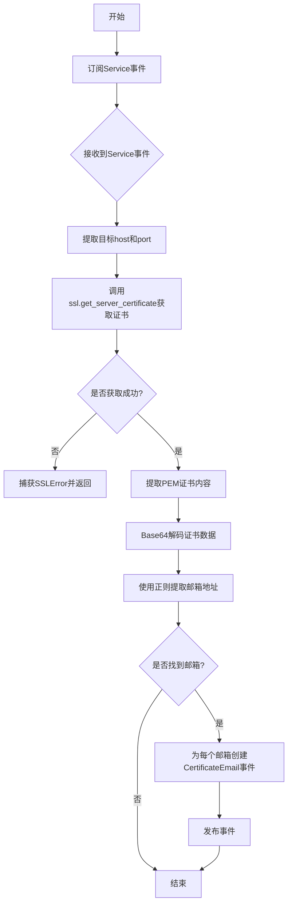
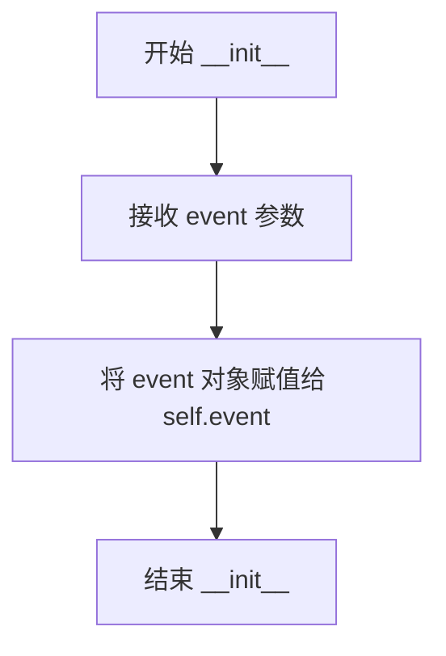

# `kubehunter\kube_hunter\modules\hunting\certificates.py` 详细设计文档

kube-hunter的一个被动hunter模块，用于发现Kubernetes集群中SSL证书内嵌的电子邮件地址，通过订阅Service事件获取目标服务信息，尝试获取SSL证书并使用正则表达式提取其中的邮箱地址，最终发布CertificateEmail漏洞事件以报告信息泄露风险。

## 整体流程



## 类结构

```
Vulnerability (core.events.types)
├── CertificateEmail
Hunter (core.types)
└── CertificateDiscovery
```

## 全局变量及字段


### `logger`
    
模块级日志记录器，用于记录调试和信息日志

类型：`logging.Logger`
    


### `email_pattern`
    
邮箱地址正则表达式模式，用于从证书数据中提取邮箱地址

类型：`re.Pattern`
    


### `CertificateEmail.email`
    
提取到的邮箱地址

类型：`str`
    


### `CertificateEmail.evidence`
    
证据字符串，格式为'email: {email}'

类型：`str`
    


### `CertificateDiscovery.event`
    
接收到的Service事件，包含host和port信息

类型：`Service`
    
    

## 全局函数及方法


### `CertificateEmail.__init__`

该方法用于初始化证书邮件漏洞事件类，接收邮箱地址作为参数，设置漏洞相关元数据（类别、ID、名称）并生成证据字符串。

参数：

- `email`：`str`，要记录的邮箱地址，用于标识在Kubernetes SSL证书中发现的电子邮件联系人

返回值：`None`，该方法仅进行对象属性的初始化，不返回任何值

#### 流程图

```mermaid
flowchart TD
    A[开始 __init__] --> B[调用 Vulnerability.__init__ 初始化基类]
    B --> C[设置漏洞类型: KubernetesCluster]
    C --> D[设置漏洞名称: Certificate Includes Email Address]
    D --> E[设置类别: InformationDisclosure]
    E --> F[设置漏洞ID: KHV021]
    F --> G[保存 email 参数到 self.email]
    G --> H[生成证据字符串: email: {email}]
    H --> I[保存证据到 self.evidence]
    I --> J[结束]
```

#### 带注释源码

```python
def __init__(self, email):
    # 调用父类 Vulnerability 的构造函数，初始化漏洞基本信息
    # 参数: KubernetesCluster - 表示该漏洞影响Kubernetes集群
    #       "Certificate Includes Email Address" - 漏洞名称
    #       category=InformationDisclosure - 漏洞类别为信息泄露
    #       khv="KHV021" - kube-hunter 漏洞编号
    Vulnerability.__init__(
        self, KubernetesCluster, "Certificate Includes Email Address", category=InformationDisclosure, khv="KHV021",
    )
    # 将传入的 email 参数保存为实例属性
    self.email = email
    # 生成并保存证据字符串，格式为 "email: {邮箱地址}"
    # 该证据用于后续报告或日志输出
    self.evidence = "email: {}".format(self.email)
```


### `CertificateDiscovery.__init__`

这是 CertificateDiscovery 类的构造函数，用于初始化证书发现hunter的实例，保存传入的 Kubernetes Service 事件对象，以便后续执行证书分析和邮件地址发现操作。

参数：

- `event`：`Service`，Kubernetes 服务事件对象，包含服务的主机地址（host）和端口（port）信息

返回值：`None`，构造函数不返回任何值，仅初始化实例属性

#### 流程图



#### 带注释源码

```python
def __init__(self, event):
    """CertificateDiscovery 类的初始化方法
    
    参数:
        event: Service 类型的事件对象，包含目标服务的 host 和 port 信息
    """
    # 将传入的 Service 事件对象保存为实例属性
    # 供后续 execute 方法中使用，以获取目标服务的连接信息
    self.event = event
```


### `CertificateDiscovery.execute()`

该方法执行证书邮件发现逻辑，通过获取 Kubernetes 集群中 SSL 证书的信息，解析证书内容中的电子邮件地址，并发布发现的事件。

参数：

- `self`：`CertificateDiscovery`，隐式参数，表示类的实例本身

返回值：`None`，无返回值，该方法通过发布事件来传递发现的结果

#### 流程图

```mermaid
flowchart TD
    A[开始 execute] --> B[记录调试日志]
    B --> C[构建目标地址 addr = (host, port)]
    C --> D{尝试获取服务器证书}
    D -->|成功| E[提取证书数据]
    D -->|SSL错误| F[返回并结束]
    E --> G[解码Base64证书数据]
    G --> H[正则匹配邮箱地址]
    H --> I{是否存在邮箱}
    I -->|是| J[遍历每个邮箱]
    I -->|否| K[结束]
    J --> L[创建CertificateEmail事件]
    L --> M[发布事件]
    M --> J
    J --> K
```

#### 带注释源码

```python
def execute(self):
    """
    执行证书邮件发现逻辑
    尝试获取目标服务的SSL证书并从中提取电子邮件地址
    """
    try:
        logger.debug("Passive hunter is attempting to get server certificate")
        # 构建目标地址元组，包含主机和端口
        addr = (str(self.event.host), self.event.port)
        # 获取服务器的SSL证书（PEM格式）
        cert = ssl.get_server_certificate(addr)
    except ssl.SSLError:
        # 如果服务器在该端口不提供SSL连接，则捕获异常并直接返回
        # 这是预期的正常情况，不代表扫描失败
        return
    
    # 移除PEM格式证书的头部和尾部标记
    c = cert.strip(ssl.PEM_HEADER).strip(ssl.PEM_FOOTER)
    # 对Base64编码的证书数据进行解码，得到DER格式的原始证书数据
    certdata = base64.decodebytes(c)
    # 使用预定义的正则表达式模式在证书数据中查找所有邮箱地址
    emails = re.findall(email_pattern, certdata)
    
    # 遍历发现的每个邮箱地址
    for email in emails:
        # 为每个邮箱创建CertificateEmail漏洞事件对象
        # 并通过发布事件机制通知系统
        self.publish_event(CertificateEmail(email=email))
```

## 关键组件


### CertificateEmail

继承自Vulnerability和Event的漏洞事件类，用于表示SSL证书中包含电子邮件地址这一信息泄露问题。该类封装了邮箱地址和证据信息，并在实例化时指定了漏洞类别为InformationDisclosure，ID为KHV021。

### CertificateDiscovery

继承自Hunter的发现者类，订阅Service事件并执行被动式证书邮件地址扫描。该类通过SSL协议获取目标服务的证书，解析证书数据并使用正则表达式提取其中的邮件地址，最终发布CertificateEmail事件。

### email_pattern

预编译的正则表达式对象，用于从证书数据中匹配标准的电子邮件地址格式。

### ssl.get_server_certificate

Python标准库函数，用于获取指定地址（主机名+端口）的SSL证书。在本代码中用于被动获取Kubernetes集群中各服务的证书信息。


## 问题及建议


### 已知问题

-   **异常处理不全面**：仅捕获`ssl.SSLError`，未处理`socket.timeout`、`ConnectionRefusedError`等其他网络异常，可能导致程序意外中断
-   **编码兼容性问题**：`base64.decodebytes()`返回bytes类型，但`email_pattern`正则表达式是str类型，直接使用`re.findall`可能在某些Python版本中出现问题，应使用`base64.b64decode()`或进行编码转换
-   **缺少连接超时**：未对SSL连接设置超时参数，可能导致扫描器在某些场景下长时间阻塞
-   **日志记录不足**：捕获异常后直接return，未记录任何日志信息，难以排查问题
-   **空值风险**：直接访问`self.event.host`和`self.event.port`，未验证event属性是否存在
-   **证书解析健壮性**：使用简单的strip方法解析PEM证书，未处理可能的畸形证书格式

### 优化建议

-   添加更全面的异常捕获，包括`socket.timeout`、`OSError`等网络相关异常
-   使用`base64.b64decode()`替代`base64.decodebytes()`以提高兼容性，并对解码后的数据进行适当的编码处理
-   为`ssl.get_server_certificate()`添加超时参数，使用`ssl.SSLContext`配置超时时间
-   在捕获异常时添加`logger.warning()`或`logger.debug()`记录失败原因
-   在方法开始处添加对`self.event.host`和`self.event.port`的空值检查
-   添加对证书解析结果的验证，确保`certdata`不为空后再进行正则匹配

## 其它


### 设计目标与约束

该模块作为kube-hunter的被动发现模块，目标是在不产生大量网络流量的情况下，从Kubernetes集群的SSL证书中提取可能泄露的邮箱地址信息。约束包括：仅支持PEM格式证书，仅监听Service事件，需要目标支持SSL连接。

### 错误处理与异常设计

主要异常处理包括：ssl.SSLError用于处理目标端口不支持SSL的情况，函数直接返回而不抛出异常；base64.decodebytes可能抛出binascii.Error但代码中未捕获；正则匹配失败返回空列表不会抛异常。

### 数据流与状态机

数据流：Service事件触发→建立SSL连接→获取服务器证书→base64解码→正则匹配邮箱→发布CertificateEmail事件。状态机包含：初始状态→SSL连接状态→证书解析状态→事件发布状态。

### 外部依赖与接口契约

外部依赖：ssl标准库用于SSL连接，base64标准库用于证书解码，re标准库用于正则匹配，kube-hunter核心框架（Hunter基类、Vulnerability/Event类型、handler订阅器）。接口契约：接收Service类型事件，发布CertificateEmail类型事件。

### 性能考虑

每次检测都会建立新的SSL连接，没有连接复用机制；正则表达式在每次调用时重新编译（email_pattern模块级编译已优化）；大证书数据base64解码可能有性能开销。

### 安全考虑

证书数据解码后存储在内存中，未做敏感数据脱敏；日志输出debug级别可能记录敏感信息；未验证证书链有效性，存在中间人攻击风险。

### 配置参数

无显式配置参数，完全依赖传入的Service事件中的host和port信息。

### 测试策略建议

应包含单元测试验证邮箱正则匹配准确性，集成测试验证对真实SSL证书的解析，异常场景测试（无SSL支持端口、无效证书格式、空证书等）。

### 兼容性说明

依赖Python 3标准库，兼容Python 3.6+；ssl.get_server_certificate在Python 2.7中可用但base64.decodebytes在Python 2.7中名为base64.decodestring。

    