# `kubehunter\kube_hunter\modules\hunting\cves.py` 详细设计文档

该模块是kube-hunter安全扫描工具的CVE（通用漏洞披露）检测模块，通过订阅Kubernetes集群版本泄露事件和kubectl客户端发现事件，对比已知漏洞的修复版本列表，判断目标系统是否存在已知安全漏洞，并发布相应的漏洞事件。

## 整体流程

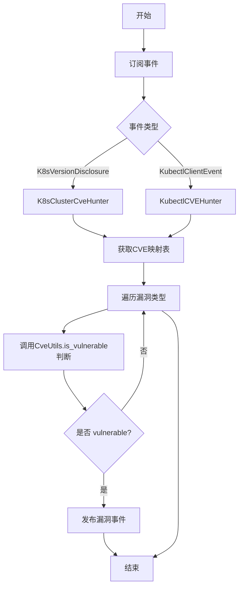

## 类结构

```
Vulnerability (基类)
├── ServerApiVersionEndPointAccessPE
├── ServerApiVersionEndPointAccessDos
├── PingFloodHttp2Implementation
├── ResetFloodHttp2Implementation
├── ServerApiClusterScopedResourcesAccess
├── IncompleteFixToKubectlCpVulnerability
└── KubectlCpVulnerability
Hunter (基类)
├── K8sClusterCveHunter
└── KubectlCVEHunter
CveUtils (工具类)
```

## 全局变量及字段


### `logger`
    
Logger instance for the current module

类型：`logging.Logger`
    


### `ServerApiVersionEndPointAccessPE.evidence`
    
Evidence of the vulnerability found

类型：`str`
    


### `ServerApiVersionEndPointAccessPE.name`
    
Name of the vulnerability (inherited from Vulnerability)

类型：`str`
    


### `ServerApiVersionEndPointAccessPE.category`
    
Category of the vulnerability (inherited from Vulnerability)

类型：`PrivilegeEscalation`
    


### `ServerApiVersionEndPointAccessPE.vid`
    
Vulnerability ID (inherited from Vulnerability)

类型：`str`
    


### `ServerApiVersionEndPointAccessDos.evidence`
    
Evidence of the vulnerability found

类型：`str`
    


### `ServerApiVersionEndPointAccessDos.name`
    
Name of the vulnerability (inherited from Vulnerability)

类型：`str`
    


### `ServerApiVersionEndPointAccessDos.category`
    
Category of the vulnerability (inherited from Vulnerability)

类型：`DenialOfService`
    


### `ServerApiVersionEndPointAccessDos.vid`
    
Vulnerability ID (inherited from Vulnerability)

类型：`str`
    


### `PingFloodHttp2Implementation.evidence`
    
Evidence of the vulnerability found

类型：`str`
    


### `PingFloodHttp2Implementation.name`
    
Name of the vulnerability (inherited from Vulnerability)

类型：`str`
    


### `PingFloodHttp2Implementation.category`
    
Category of the vulnerability (inherited from Vulnerability)

类型：`DenialOfService`
    


### `PingFloodHttp2Implementation.vid`
    
Vulnerability ID (inherited from Vulnerability)

类型：`str`
    


### `ResetFloodHttp2Implementation.evidence`
    
Evidence of the vulnerability found

类型：`str`
    


### `ResetFloodHttp2Implementation.name`
    
Name of the vulnerability (inherited from Vulnerability)

类型：`str`
    


### `ResetFloodHttp2Implementation.category`
    
Category of the vulnerability (inherited from Vulnerability)

类型：`DenialOfService`
    


### `ResetFloodHttp2Implementation.vid`
    
Vulnerability ID (inherited from Vulnerability)

类型：`str`
    


### `ServerApiClusterScopedResourcesAccess.evidence`
    
Evidence of the vulnerability found

类型：`str`
    


### `ServerApiClusterScopedResourcesAccess.name`
    
Name of the vulnerability (inherited from Vulnerability)

类型：`str`
    


### `ServerApiClusterScopedResourcesAccess.category`
    
Category of the vulnerability (inherited from Vulnerability)

类型：`PrivilegeEscalation`
    


### `ServerApiClusterScopedResourcesAccess.vid`
    
Vulnerability ID (inherited from Vulnerability)

类型：`str`
    


### `IncompleteFixToKubectlCpVulnerability.binary_version`
    
Version of the kubectl binary

类型：`str`
    


### `IncompleteFixToKubectlCpVulnerability.evidence`
    
Evidence containing kubectl version string

类型：`str`
    


### `IncompleteFixToKubectlCpVulnerability.name`
    
Name of the vulnerability (inherited from Vulnerability)

类型：`str`
    


### `IncompleteFixToKubectlCpVulnerability.category`
    
Category of the vulnerability (inherited from Vulnerability)

类型：`RemoteCodeExec`
    


### `IncompleteFixToKubectlCpVulnerability.vid`
    
Vulnerability ID (inherited from Vulnerability)

类型：`str`
    


### `KubectlCpVulnerability.binary_version`
    
Version of the kubectl binary

类型：`str`
    


### `KubectlCpVulnerability.evidence`
    
Evidence containing kubectl version string

类型：`str`
    


### `KubectlCpVulnerability.name`
    
Name of the vulnerability (inherited from Vulnerability)

类型：`str`
    


### `KubectlCpVulnerability.category`
    
Category of the vulnerability (inherited from Vulnerability)

类型：`RemoteCodeExec`
    


### `KubectlCpVulnerability.vid`
    
Vulnerability ID (inherited from Vulnerability)

类型：`str`
    


### `K8sClusterCveHunter.event`
    
The K8s version disclosure event

类型：`K8sVersionDisclosure`
    


### `KubectlCVEHunter.event`
    
The kubectl client event

类型：`KubectlClientEvent`
    
    

## 全局函数及方法


### `ServerApiVersionEndPointAccessPE.__init__`

这是 `ServerApiVersionEndPointAccessPE` 类的初始化方法，用于设置与 CVE-2018-1002105（Critical Privilege Escalation）相关的漏洞事件元数据，包括漏洞名称、类别、VID 以及传入的证据信息。

参数：

-  `evidence`：`Any`，用于存储漏洞的证据信息，可能包含版本号或其他相关证据

返回值：`None`，无返回值（`__init__` 方法）

#### 流程图

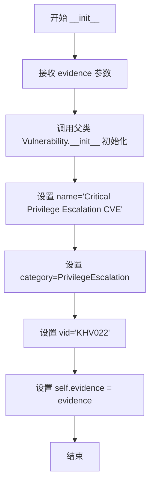

#### 带注释源码

```python
def __init__(self, evidence):
    """
    初始化 ServerApiVersionEndPointAccessPE 漏洞事件
    
    参数:
        evidence: 漏洞证据信息，通常为版本号或相关证据数据
    """
    # 调用父类 Vulnerability 的初始化方法，设置漏洞的基础属性
    # 第一个参数 self 自动传递，第二个参数为漏洞所属的集群类型
    Vulnerability.__init__(
        self,                      # 当前实例
        KubernetesCluster,         # 漏洞所属目标类型：Kubernetes 集群
        name="Critical Privilege Escalation CVE",  # 漏洞名称
        category=PrivilegeEscalation,  # 漏洞类别：权限提升
        vid="KHV022",              # 漏洞唯一标识符
    )
    # 将传入的证据信息存储为实例属性
    self.evidence = evidence
```


### `ServerApiVersionEndPointAccessDos.__init__`

该方法是 `ServerApiVersionEndPointAccessDos` 类的构造函数，用于初始化一个 DoS（拒绝服务）漏洞事件对象。该漏洞对应 CVE-2019-1002100，攻击者可以通过特制的 json-patch 请求导致 Kubernetes API Server 拒绝服务。

参数：

- `evidence`：`str`，Kubernetes 版本信息，用于判断是否存在漏洞

返回值：`None`，该方法为构造函数，不返回任何值

#### 流程图

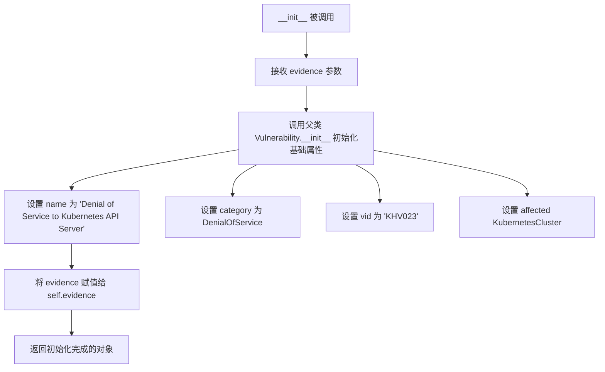

#### 带注释源码

```python
def __init__(self, evidence):
    """
    初始化 ServerApiVersionEndPointAccessDos 漏洞事件
    
    参数:
        evidence: Kubernetes API Server 版本信息，用于漏洞检测判断
    """
    # 调用父类 Vulnerability 的构造函数，初始化漏洞基础信息
    # 设置受影响的目标为 KubernetesCluster（Kubernetes 集群）
    # 漏洞名称：Denial of Service to Kubernetes API Server
    # 漏洞类别：DenialOfService（拒绝服务）
    # 漏洞 ID：KHV023（CVE-2019-1002100）
    Vulnerability.__init__(
        self,
        KubernetesCluster,
        name="Denial of Service to Kubernetes API Server",
        category=DenialOfService,
        vid="KHV023",
    )
    # 保存传入的证据信息（版本号），用于后续漏洞判定
    self.evidence = evidence
```


### PingFloodHttp2Implementation.__init__

这是 `PingFloodHttp2Implementation` 类的构造函数，用于初始化一个表示 CVE-2019-9512 漏洞（HTTP/2 ping flood 攻击）的脆弱性事件对象。该方法继承自 `Vulnerability` 和 `Event` 类，设置漏洞的名称、类别、VID 并保存攻击证据。

参数：

- `evidence`：`Any`，表示攻击者发送的恶意 HTTP 请求证据或相关日志信息

返回值：`None`，该方法仅初始化对象状态，不返回任何值

#### 流程图

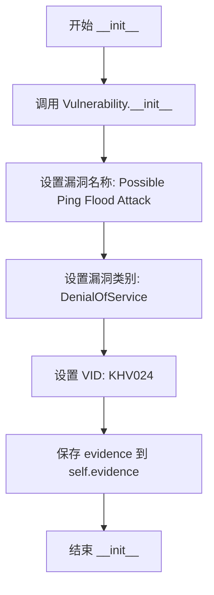

#### 带注释源码

```python
def __init__(self, evidence):
    """初始化 PingFloodHttp2Implementation 漏洞事件
    
    该方法创建一个表示 CVE-2019-9512 漏洞的事件对象。
    CVE-2019-9512 是一种 HTTP/2 拒绝服务漏洞，攻击者通过发送
    特殊构造的 ping 帧可导致服务端资源耗尽。
    
    参数:
        evidence: 攻击证据，通常是版本信息或相关日志数据
    """
    # 调用父类 Vulnerability 的构造函数，初始化漏洞基本属性
    # category=KubernetesCluster 表示该漏洞影响 Kubernetes 集群组件
    # name="Possible Ping Flood Attack" 是漏洞的显示名称
    # category=DenialOfService 表示漏洞类型为拒绝服务
    # vid="KHV024" 是 kube-hunter 项目的漏洞唯一标识符
    Vulnerability.__init__(
        self, 
        KubernetesCluster, 
        name="Possible Ping Flood Attack", 
        category=DenialOfService, 
        vid="KHV024",
    )
    
    # 保存攻击证据到实例属性，供后续分析或报告使用
    self.evidence = evidence
```


### ResetFloodHttp2Implementation.__init__

这是一个用于表示CVE-2019-9514漏洞的类初始化方法，该漏洞允许攻击者通过发送特制的HTTP请求导致拒绝服务。

参数：

- `self`：`ResetFloodHttp2Implementation`，类的实例自身
- `evidence`：`任意类型`（通常为字符串），漏洞证据或版本信息，用于记录触发此漏洞的Kubernetes版本

返回值：`None`，构造函数没有返回值

#### 流程图

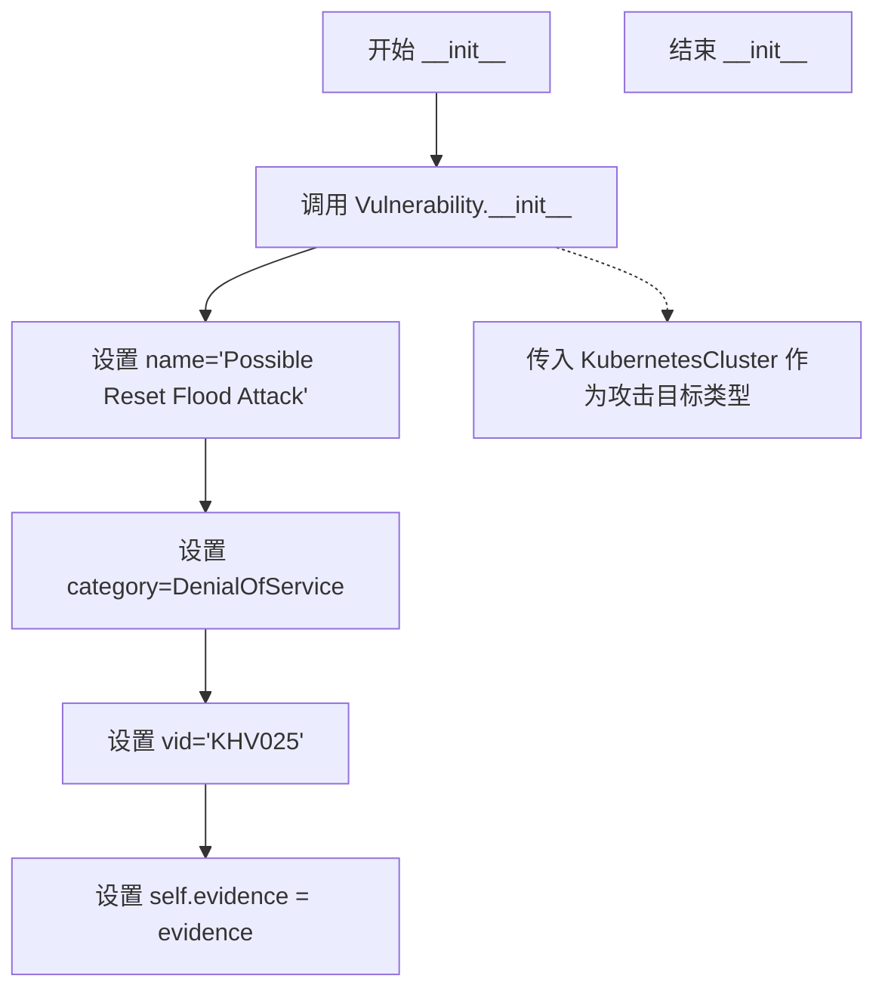

#### 带注释源码

```python
class ResetFloodHttp2Implementation(Vulnerability, Event):
    """Node not patched for CVE-2019-9514. an attacker could cause a
    Denial of Service by sending specially crafted HTTP requests."""

    def __init__(self, evidence):
        # 调用父类 Vulnerability 的初始化方法，设置漏洞基本信息
        Vulnerability.__init__(
            self, 
            KubernetesCluster,  # 攻击目标类型：Kubernetes 集群
            name="Possible Reset Flood Attack",  # 漏洞名称
            category=DenialOfService,  # 漏洞类别：拒绝服务
            vid="KHV025",  # 漏洞唯一标识符
        )
        # 保存漏洞证据（通常为 Kubernetes 版本信息）
        self.evidence = evidence
```


### `ServerApiClusterScopedResourcesAccess.__init__`

该方法是 `ServerApiClusterScopedResourcesAccess` 类的构造函数，用于初始化一个 CVE-2019-11247 漏洞事件。该漏洞允许通过错误的 scope 访问自定义资源，从而实现权限提升。方法接收漏洞证据作为参数，调用父类 `Vulnerability` 的初始化方法设置漏洞元数据（名称、类别、VID等），并将证据存储在实例属性中。

参数：

- `evidence`：任意类型，漏洞的证据信息，用于记录和展示该漏洞的具体细节

返回值：`None`，构造函数不返回任何值

#### 流程图

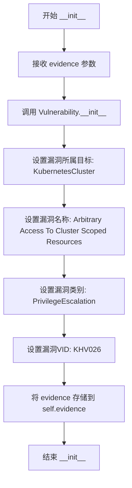

#### 带注释源码

```python
def __init__(self, evidence):
    """
    初始化 ServerApiClusterScopedResourcesAccess 漏洞事件
    
    该漏洞为 CVE-2019-11247，API Server 未修复此漏洞，
    允许通过错误的 scope 访问集群范围内的自定义资源
    """
    # 调用父类 Vulnerability 的初始化方法
    # 参数1: self - 实例本身
    # 参数2: KubernetesCluster - 漏洞影响的目标类型
    # 参数3: name - 漏洞名称
    # 参数4: category - 漏洞类别（权限提升）
    # 参数5: vid - 漏洞唯一标识符
    Vulnerability.__init__(
        self,
        KubernetesCluster,
        name="Arbitrary Access To Cluster Scoped Resources",
        category=PrivilegeEscalation,
        vid="KHV026",
    )
    
    # 将传入的证据信息存储到实例属性中
    # evidence 可以是任何类型的证据数据，用于后续的漏洞报告和展示
    self.evidence = evidence
```


### `IncompleteFixToKubectlCpVulnerability.__init__`

该方法是 `IncompleteFixToKubectlCpVulnerability` 类的构造函数，用于初始化一个表示 kubectl 客户端 CVE-2019-11246 漏洞的脆弱性事件对象。该漏洞允许攻击者在客户端机器上执行任意代码。

参数：

- `binary_version`：字符串，kubectl 二进制版本号，用于记录存在漏洞的 kubectl 版本

返回值：`None`，构造函数不返回值，仅初始化对象状态

#### 流程图

```mermaid
flowchart TD
    A[开始 __init__] --> B[调用父类 Vulnerability.__init__]
    B --> C[设置漏洞类别: KubectlClient]
    C --> D[设置漏洞名称: Kubectl Vulnerable To CVE-2019-11246]
    D --> E[设置漏洞类别: RemoteCodeExec]
    E --> F[设置漏洞ID: KHV027]
    F --> G[将传入的 binary_version 赋值给 self.binary_version]
    G --> H[生成证据字符串: kubectl version: {binary_version}]
    H --> I[赋值给 self.evidence]
    I --> J[结束 __init__]
```

#### 带注释源码

```python
def __init__(self, binary_version):
    """
    初始化 IncompleteFixToKubectlCpVulnerability 漏洞事件对象
    
    该漏洞为 CVE-2019-11246，kubectl cp 命令存在目录遍历漏洞，
    攻击者可利用该漏洞在客户端执行任意代码
    """
    # 调用父类 Vulnerability 的初始化方法
    # 参数: 
    #   - self: 当前实例
    #   - KubectlClient: 漏洞所属的 Kubernetes 组件类型
    #   - "Kubectl Vulnerable To CVE-2019-11246": 漏洞名称
    #   - category=RemoteCodeExec: 漏洞类别为远程代码执行
    #   - vid="KHV027": kube-hunter 内部的漏洞 ID
    Vulnerability.__init__(
        self, KubectlClient, "Kubectl Vulnerable To CVE-2019-11246", category=RemoteCodeExec, vid="KHV027",
    )
    
    # 保存传入的 kubectl 二进制版本号
    # 用于后续版本比较和证据记录
    self.binary_version = binary_version
    
    # 生成漏洞证据字符串，格式为 "kubectl version: {版本号}"
    # 该证据将在漏洞报告中展示
    self.evidence = "kubectl version: {}".format(self.binary_version)
```


### `KubectlCpVulnerability.__init__`

该方法为 `KubectlCpVulnerability` 类的构造函数，用于初始化一个 CVE-2019-1002101 漏洞检测事件。该漏洞允许攻击者在 kubectl 客户端机器上执行任意代码。构造函数调用父类 `Vulnerability` 的初始化方法，设置漏洞的名称、类别为远程代码执行（RemoteCodeExec）、VID 为 KHV028，并保存 kubectl 二进制版本信息用于证据记录。

参数：

- `self`：`KubectlCpVulnerability`，类的实例本身
- `binary_version`：`str`，kubectl 客户端的版本号字符串，用于判断版本是否 vulnerable 并记录在 evidence 中

返回值：`None`，构造函数无返回值

#### 流程图

```mermaid
flowchart TD
    A[__init__ 调用] --> B{传入 binary_version}
    B --> C[调用 Vulnerability.__init__ 初始化父类]
    C --> D[设置 name: Kubectl Vulnerable To CVE-2019-1002101]
    D --> E[设置 category: RemoteCodeExec]
    E --> F[设置 vid: KHV028]
    F --> G[设置 self.binary_version = binary_version]
    G --> H[生成 evidence 字符串: kubectl version: {binary_version}]
    H --> I[初始化完成]
```

#### 带注释源码

```python
class KubectlCpVulnerability(Vulnerability, Event):
    """The kubectl client is vulnerable to CVE-2019-1002101,
    an attacker could potentially execute arbitrary code on the client's machine"""

    def __init__(self, binary_version):
        # 调用 Vulnerability 父类的初始化方法
        # 参数说明：
        # - self: 实例本身
        # - KubectlClient: 漏洞影响的组件类型（kubectl 客户端）
        # - "Kubectl Vulnerable To CVE-2019-1002101": 漏洞名称
        # - category=RemoteCodeExec: 漏洞类别为远程代码执行
        # - vid="KHV028": 漏洞的唯一标识符
        Vulnerability.__init__(
            self, KubectlClient, "Kubectl Vulnerable To CVE-2019-1002101", category=RemoteCodeExec, vid="KHV028",
        )
        
        # 将传入的二进制版本保存为实例属性
        # 用于后续版本比较和漏洞判断
        self.binary_version = binary_version
        
        # 生成证据字符串，记录具体版本号
        # 格式: "kubectl version: {版本号}"
        self.evidence = "kubectl version: {}".format(self.binary_version)
```


### `CveUtils.get_base_release`

该函数用于从完整版本号中提取基础发布版本（主版本号和次版本号），支持处理标准版本和遗留版本两种格式，以便进行版本比较和漏洞判定。

参数：

- `full_ver`：`version.Version` 或 `version.LegacyVersion`，完整版本号对象

返回值：`version.Version`，解析后的基础版本对象（仅包含主版本号和次版本号）

#### 流程图

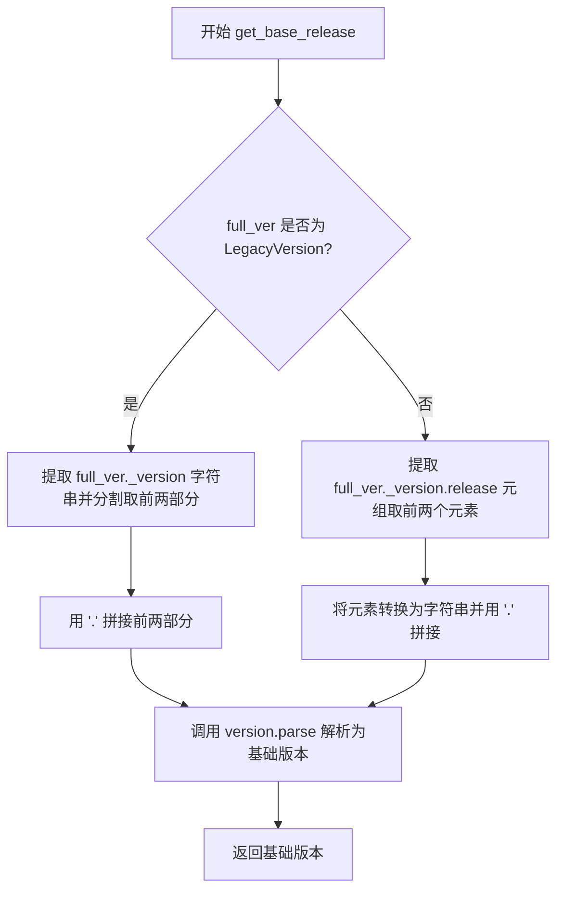

#### 带注释源码

```python
@staticmethod
def get_base_release(full_ver):
    # 如果是遗留版本（LegacyVersion），手动转换为基础版本
    if type(full_ver) == version.LegacyVersion:
        # 从遗留版本中获取版本字符串，按 '.' 分割并取前两部分（如 '1.12.3' -> '1.12'）
        return version.parse(".".join(full_ver._version.split(".")[:2]))
    
    # 对于标准版本，从 release 元组中获取主版本号和次版本号
    # release 是一个整数元组，如 (1, 13, 10) 表示 1.13.10
    return version.parse(".".join(map(str, full_ver._version.release[:2])))
```


### `CveUtils.to_legacy`

该方法用于将完整的版本对象转换为 `LegacyVersion` 对象，以便在版本比较中处理兼容性问题。

参数：

- `full_ver`：`Any`（通常为 `version.Version` 或 `version.LegacyVersion` 对象），完整的版本对象，包含 `_version.release` 属性

返回值：`version.LegacyVersion`，返回转换后的 LegacyVersion 对象

#### 流程图

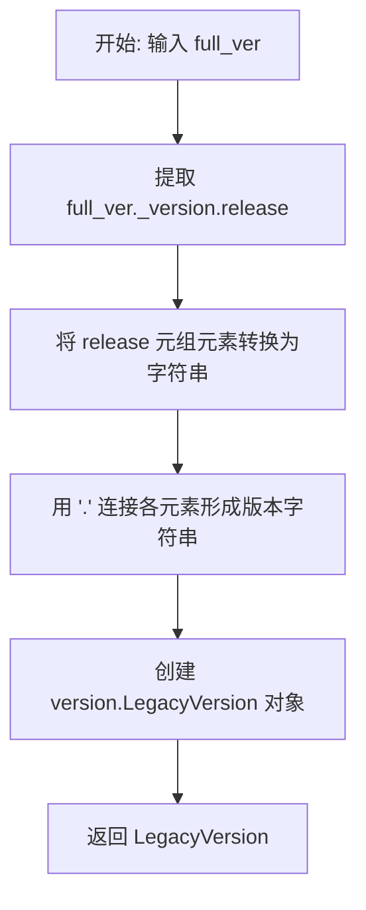

#### 带注释源码

```python
@staticmethod
def to_legacy(full_ver):
    # converting version to version.LegacyVersion
    # 将完整版本转换为 LegacyVersion 以便进行版本比较
    return version.LegacyVersion(".".join(map(str, full_ver._version.release)))
```

---

### 补充说明

**技术细节：**

- 该方法是 `CveUtils` 类的静态方法
- `full_ver._version.release` 是一个整数元组（如 `(1, 13, 10)`），表示版本号的发布部分
- 该方法将版本号转换为字符串格式（如 "1.13.10"），然后包装为 `LegacyVersion` 对象
- 主要用于处理无法被 `packaging.version.parse()` 正确解析的版本字符串，将其统一转换为可比较的格式


### `CveUtils.to_raw_version`

该方法用于将 `packaging.version.Version` 或 `packaging.version.LegacyVersion` 对象转换为字符串形式或原始版本对象，以便进行版本比较操作。如果输入是标准版本对象，则返回其发布号组成的字符串；如果是遗留版本对象，则直接返回其内部版本对象。

参数：

- `v`：`version.Version` 或 `version.LegacyVersion`，需要转换的版本对象

返回值：`str` 或 `version._version`，返回版本对象的原始发布号字符串（标准版本）或原始版本对象（遗留版本）

#### 流程图

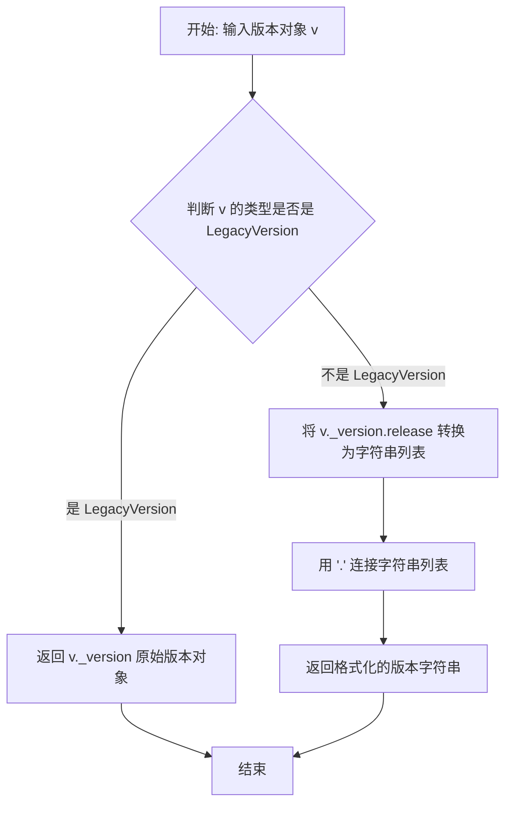

#### 带注释源码

```python
@staticmethod
def to_raw_version(v):
    """
    将版本对象转换为原始格式
    如果是标准版本，返回形如 '1.2.3' 的字符串
    如果是遗留版本，返回其内部的 _version 对象
    """
    # 检查输入版本对象是否为 LegacyVersion 类型
    if type(v) != version.LegacyVersion:
        # 标准版本：提取 release 元组并转换为字符串
        # 例如：Version('1.2.3')._version.release -> (1, 2, 3)
        # join 后得到 '1.2.3'
        return ".".join(map(str, v._version.release))
    # 遗留版本：直接返回内部 _version 对象
    return v._version
```


### `CveUtils.version_compare`

该静态方法用于比较两个版本号，处理了从标准版本到LegacyVersion的转换，以统一比较方式，避免因版本格式差异导致的比较错误。

参数：

- `v1`：版本对象（`version.Version` 或 `version.LegacyVersion`），需要比较的第一个版本
- `v2`：版本对象（`version.Version` 或 `version.LegacyVersion`），需要比较的第二个版本

返回值：`int`，返回比较结果：-1（v1 < v2）、0（v1 == v2）、1（v1 > v2）

#### 流程图

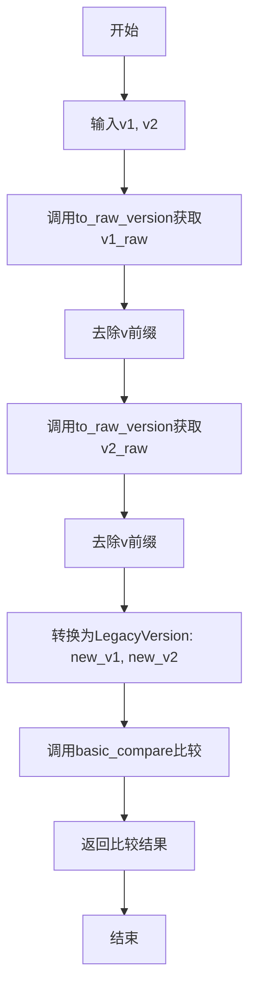

#### 带注释源码

```python
@staticmethod
def version_compare(v1, v2):
    """Function compares two versions, handling differences with conversion to LegacyVersion"""
    # 获取原始版本字符串，并去除可能存在的'v'前缀
    # 这样可以安全地比较两个版本字符串
    v1_raw = CveUtils.to_raw_version(v1).strip("v")
    v2_raw = CveUtils.to_raw_version(v2).strip("v")
    
    # 将两个版本转换为LegacyVersion对象
    # 以统一比较方式，处理不同版本格式的差异
    new_v1 = version.LegacyVersion(v1_raw)
    new_v2 = version.LegacyVersion(v2_raw)

    # 调用basic_compare进行实际比较
    # 返回-1表示v1<v2, 0表示相等, 1表示v1>v2
    return CveUtils.basic_compare(new_v1, new_v2)
```


### `CveUtils.basic_compare`

该函数用于比较两个版本对象的大小关系，返回一个整数来表示比较结果（1 表示 v1 > v2，0 表示相等，-1 表示 v1 < v2）。

参数：

- `v1`：版本对象（`version.LegacyVersion` 或其他可比较的版本类型），要比较的第一个版本
- `v2`：版本对象（`version.LegacyVersion` 或其他可比较的版本类型），要比较的第二个版本

返回值：`int`，返回比较结果：1 表示 v1 > v2，0 表示 v1 == v2，-1 表示 v1 < v2

#### 流程图

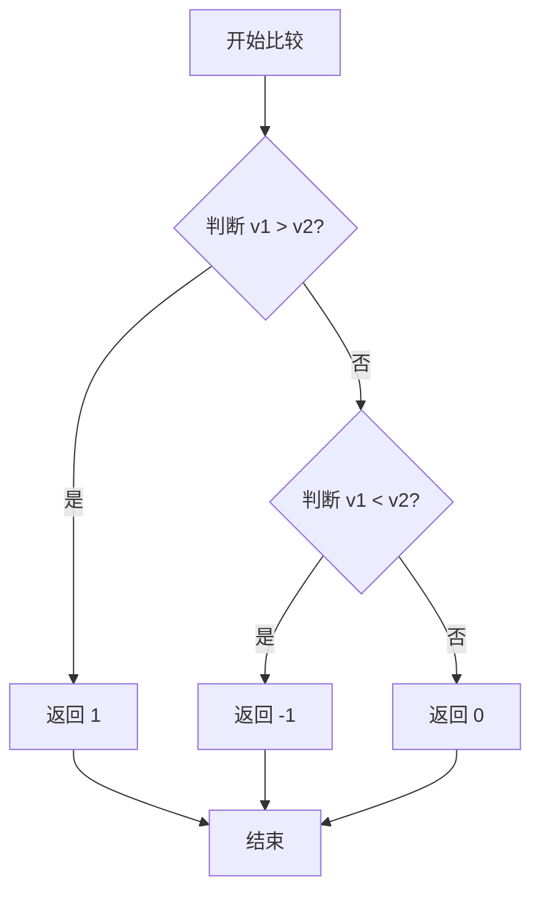

#### 带注释源码

```python
@staticmethod
def basic_compare(v1, v2):
    """
    比较两个版本对象的大小关系
    
    参数:
        v1: 版本对象，要比较的第一个版本
        v2: 版本对象，要比较的第二个版本
    
    返回:
        int: 1 表示 v1 > v2，0 表示相等，-1 表示 v1 < v2
    """
    # 使用布尔值相减的技巧来返回比较结果
    # (v1 > v2) 返回 True (1) 或 False (0)
    # (v1 < v2) 返回 True (1) 或 False (0)
    # 例如: v1 > v2 时，返回 1 - 0 = 1
    #       v1 < v2 时，返回 0 - 1 = -1
    #       v1 == v2 时，返回 0 - 0 = 0
    return (v1 > v2) - (v1 < v2)
```


### `CveUtils.is_downstream_version`

该静态方法用于判断给定的版本字符串是否为下游版本（即包含预发布或构建元数据标识符），通过检查版本字符串中是否包含 `+`、`-` 或 `~` 这三个特殊字符来判断。

参数：

- `version`：`str`，需要检查的版本字符串，用于判断是否为下游版本

返回值：`bool`，如果版本字符串中包含 `+`、`-` 或 `~` 任意一个字符则返回 `True`，表示该版本为下游版本；否则返回 `False`

#### 流程图

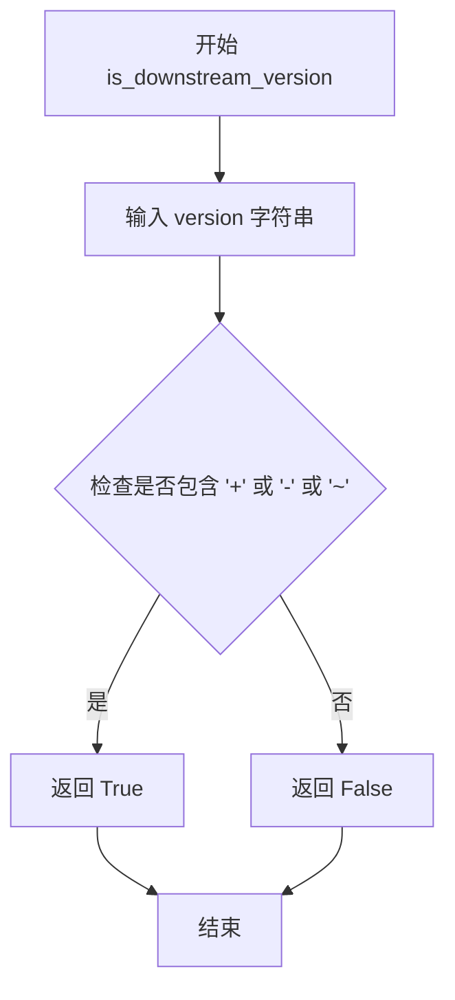

#### 带注释源码

```python
@staticmethod
def is_downstream_version(version):
    """
    判断版本字符串是否为下游版本
    
    下游版本通常包含预发布标识符或构建元数据，
    通过检查版本字符串中是否包含特定字符来判断。
    
    参数:
        version: str - 要检查的版本字符串
        
    返回:
        bool - 如果版本字符串包含 '+'、'-' 或 '~' 任意字符返回 True，否则返回 False
    """
    # 使用 any() 检查版本字符串中是否包含任何指定的特殊字符
    # '+' 通常表示构建元数据（如 1.20.1+build.123）
    # '-' 通常表示预发布版本（如 1.20.0-beta.1）
    # '~' 通常表示兼容版本（如 ~1.20.0）
    return any(c in version for c in "+-~")
```


### `CveUtils.is_vulnerable`

该函数用于判断给定版本是否易受攻击，通过与提供的修复版本列表按基础版本进行比较来确定漏洞状态。

参数：

- `fix_versions`：`List[str]`，需要检查的修复版本列表
- `check_version`：`str`，需要检查是否存在漏洞的版本号
- `ignore_downstream`：`bool`，是否忽略下游版本（如包含 +、-、~ 的版本）

返回值：`bool`，如果版本存在漏洞返回 True，否则返回 False

#### 流程图

```mermaid
flowchart TD
    A[开始 is_vulnerable] --> B{ignore_downstream 且<br/>is_downstream_version(check_version)?}
    B -->|是| C[返回 False]
    B -->|否| D[解析 check_version]
    D --> E[获取 base_check_v]
    E --> F{check_version 是<br/>LegacyVersion?}
    F -->|是| G[使用 version_compare 函数]
    F -->|否| H[使用 basic_compare 函数]
    G --> I
    H --> I{check_version 不在<br/>fix_versions 中?}
    I -->|是| J[遍历每个 fix_v]
    J --> K[解析 fix_v 并获取 base_fix_v]
    K --> L{base_check_v == base_fix_v?}
    L -->|否| J
    L -->|是| M{version_compare_func<br/>(check_v, fix_v) == -1?}
    M -->|是| N[vulnerable = True, 跳出循环]
    M -->|否| J
    I -->|否| O{version_compare_func<br/>(check_v, fix_versions[0]) == -1?}
    N --> O
    O -->|是| P[vulnerable = True]
    O -->|否| Q[vulnerable = False]
    C --> R[返回 vulnerable]
    P --> R
    Q --> R
```

#### 带注释源码

```python
@staticmethod
def is_vulnerable(fix_versions, check_version, ignore_downstream=False):
    """Function determines if a version is vulnerable,
    by comparing to given fix versions by base release"""
    
    # 如果忽略下游版本且检查版本为下游版本，则返回 False
    # 下游版本通常包含 +, -, ~ 等字符
    if ignore_downstream and CveUtils.is_downstream_version(check_version):
        return False

    vulnerable = False
    
    # 解析需要检查的版本
    check_v = version.parse(check_version)
    # 获取检查版本的基础发布版本（如 1.12.3 -> 1.12）
    base_check_v = CveUtils.get_base_release(check_v)

    # 默认使用经典比较函数，除非 check_version 是 LegacyVersion
    version_compare_func = CveUtils.basic_compare
    if type(check_v) == version.LegacyVersion:
        # 如果是遗留版本，使用自定义比较函数处理版本差异
        version_compare_func = CveUtils.version_compare

    # 如果检查版本不在修复版本列表中
    if check_version not in fix_versions:
        # 遍历每个修复版本进行比较
        for fix_v in fix_versions:
            fix_v = version.parse(fix_v)
            # 获取修复版本的基础发布版本
            base_fix_v = CveUtils.get_base_release(fix_v)

            # 如果检查版本和当前修复版本具有相同的基础发布版本
            if base_check_v == base_fix_v:
                # 当 check_version 是遗留版本时，使用自定义比较函数处理版本差异
                if version_compare_func(check_v, fix_v) == -1:
                    # 如果版本更小且基础版本相同，则判定为存在漏洞
                    vulnerable = True
                    break

    # 如果在修复版本列表中未找到匹配项，检查版本是否小于第一个修复版本
    if not vulnerable and version_compare_func(check_v, version.parse(fix_versions[0])) == -1:
        vulnerable = True

    return vulnerable
```


### `K8sClusterCveHunter.__init__`

初始化 K8sClusterCveHunter 类的实例，接收并存储事件对象，以便后续执行 CVE 检查操作。

参数：

- `event`：`Event` 类型，来自 `K8sVersionDisclosure` 事件的实例，包含 Kubernetes 版本信息，用于后续与已知 CVE 修复版本进行对比。

返回值：`None`，构造函数无返回值。

#### 流程图

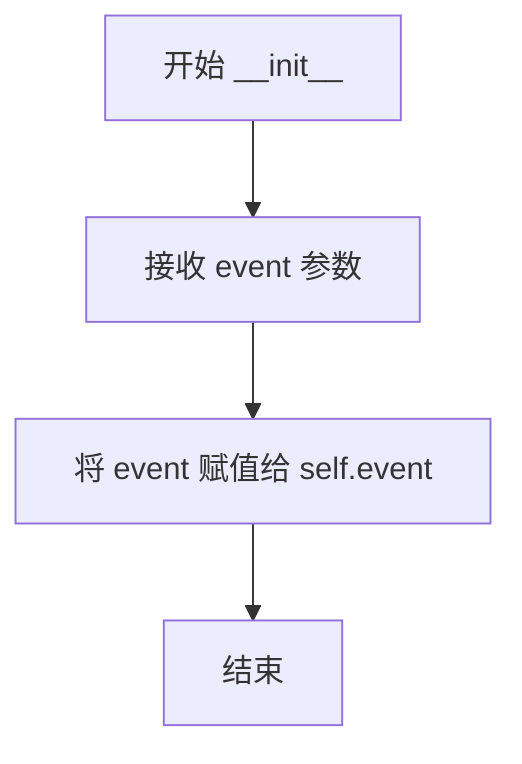

#### 带注释源码

```python
def __init__(self, event):
    """
    初始化 K8sClusterCveHunter 实例
    
    参数:
        event: Event 类型，来自 K8sVersionDisclosure 事件的实例，
               包含了 Kubernetes 集群的版本信息，用于后续漏洞检测
    """
    self.event = event  # 将传入的事件对象存储为实例属性，供 execute 方法使用
```


### `K8sClusterCveHunter.execute`

该方法是一个Kubernetes CVE漏洞检测器，用于在接收到Kubernetes版本披露事件后，遍历预定义的CVE映射表，通过版本比较逻辑判断当前集群版本是否受已知CVE影响，若存在漏洞则发布相应的漏洞事件。

参数：无（仅包含self隐式参数）

返回值：`None`，无返回值（通过`self.publish_event`发布事件）

#### 流程图

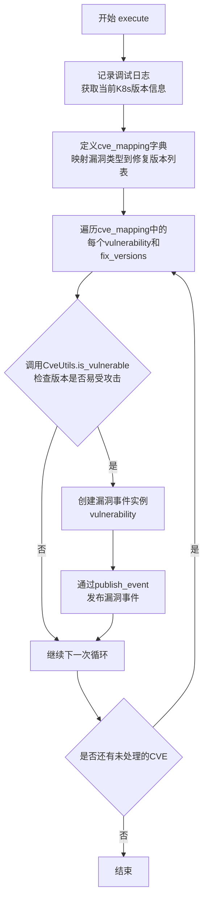

#### 带注释源码

```python
@handler.subscribe_once(K8sVersionDisclosure)
class K8sClusterCveHunter(Hunter):
    """K8s CVE Hunter
    Checks if Node is running a Kubernetes version vulnerable to
    specific important CVEs
    """

    def __init__(self, event):
        self.event = event

    def execute(self):
        # 记录调试日志，输出正在检查的K8s API版本信息
        logger.debug(f"Checking known CVEs for k8s API version: {self.event.version}")
        
        # 定义CVE映射表：键为漏洞类，值为该漏洞的修复版本列表
        cve_mapping = {
            ServerApiVersionEndPointAccessPE: ["1.10.11", "1.11.5", "1.12.3"],  # CVE-2018-1002105 权限提升
            ServerApiVersionEndPointAccessDos: ["1.11.8", "1.12.6", "1.13.4"],   # CVE-2019-1002100 DoS
            ResetFloodHttp2Implementation: ["1.13.10", "1.14.6", "1.15.3"],      # CVE-2019-9514 HTTP/2 Reset Flood
            PingFloodHttp2Implementation: ["1.13.10", "1.14.6", "1.15.3"],       # CVE-2019-9512 HTTP/2 Ping Flood
            ServerApiClusterScopedResourcesAccess: ["1.13.9", "1.14.5", "1.15.2"], # CVE-2019-11247 集群作用域资源访问
        }
        
        # 遍历每个CVE映射项
        for vulnerability, fix_versions in cve_mapping.items():
            # 调用CveUtils.is_vulnerable判断当前版本是否易受该CVE影响
            # 参数：修复版本列表、当前版本、是否忽略已打补丁的版本（取反config配置）
            if CveUtils.is_vulnerable(fix_versions, self.event.version, not config.include_patched_versions):
                # 如果易受攻击，创建漏洞事件实例并发布
                # 传入当前版本作为evidence
                self.publish_event(vulnerability(self.event.version))
```


### `KubectlCVEHunter.__init__`

该方法为 `KubectlCVEHunter` 类的构造函数，用于初始化 CVE hunter 实例，接收并存储 kubectl 客户端事件对象，以便后续在 `execute` 方法中检查该客户端版本是否受特定 CVE 影响。

参数：

- `event`：`KubectlClientEvent`，从 `kube_hunter.modules.discovery.kubectl` 导入的 kubectl 客户端事件对象，包含客户端版本信息（`version` 属性）

返回值：`None`，构造函数无返回值，仅进行实例属性初始化

#### 流程图

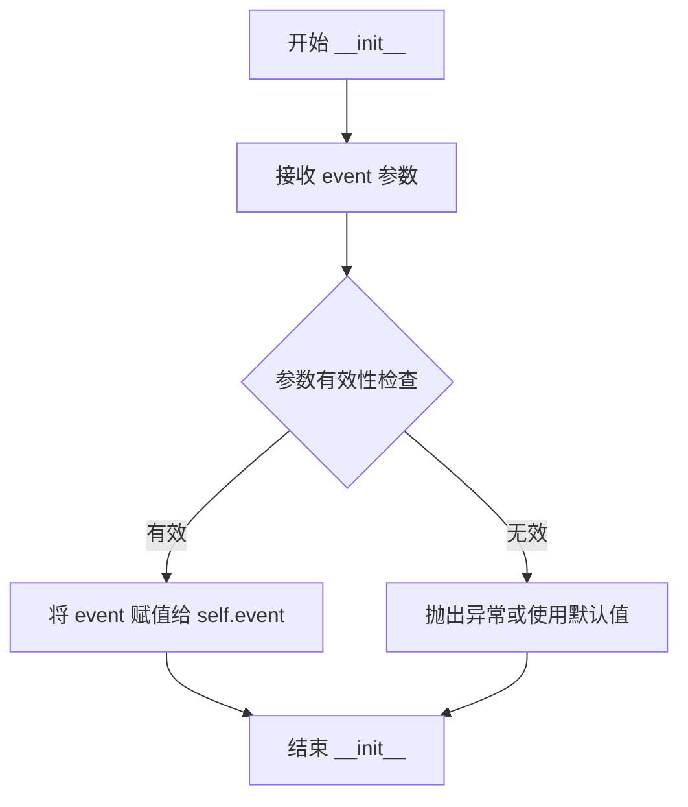

#### 带注释源码

```python
@handler.subscribe(KubectlClientEvent)  # 订阅 KubectlClientEvent 事件，当 kubectl 客户端事件触发时调用此类
class KubectlCVEHunter(Hunter):  # 继承自 Hunter 基类，用于检测 kubectl 客户端 CVE
    """Kubectl CVE Hunter
    Checks if the kubectl client is vulnerable to specific important CVEs
    """

    def __init__(self, event):
        # 参数：event - KubectlClientEvent 类型，包含 kubectl 客户端的版本信息
        # 功能：初始化实例，将传入的事件对象存储为实例属性，供 execute 方法使用
        self.event = event
```


### KubectlCVEHunter.execute

该方法用于检测kubectl客户端是否存在已知CVE漏洞，通过遍历预定义的CVE映射表，对比当前kubectl版本与安全修复版本，判断是否存在漏洞并发布相应事件。

参数：

- `self`：隐式参数，Hunter类实例本身

返回值：`None`，该方法通过发布事件产生副作用，无显式返回值

#### 流程图

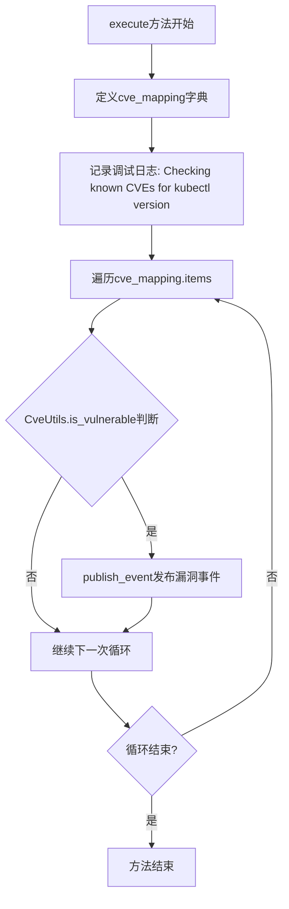

#### 带注释源码

```python
@handler.subscribe(KubectlClientEvent)
class KubectlCVEHunter(Hunter):
    """Kubectl CVE Hunter
    Checks if the kubectl client is vulnerable to specific important CVEs
    """

    def __init__(self, event):
        self.event = event

    def execute(self):
        # 定义CVE映射表: 漏洞类 -> 修复版本列表
        cve_mapping = {
            KubectlCpVulnerability: ["1.11.9", "1.12.7", "1.13.5", "1.14.0"],  # CVE-2019-1002101
            IncompleteFixToKubectlCpVulnerability: ["1.12.9", "1.13.6", "1.14.2"],  # CVE-2019-11246
        }
        
        # 记录调试日志,显示当前检查的kubectl版本
        logger.debug(f"Checking known CVEs for kubectl version: {self.event.version}")
        
        # 遍历所有已知CVE及其修复版本
        for vulnerability, fix_versions in cve_mapping.items():
            # 使用CveUtils.is_vulnerable判断版本是否 vulnerable
            # not config.include_patched_versions: 若配置包含已修复版本,则取反使其不跳过下游版本
            if CveUtils.is_vulnerable(fix_versions, self.event.version, not config.include_patched_versions):
                # 若版本存在漏洞,发布漏洞事件
                self.publish_event(vulnerability(binary_version=self.event.version))
```

## 关键组件


### ServerApiVersionEndPointAccessPE

该类对应CVE-2018-1002105，用于检测Kubernetes API服务器的权限提升漏洞。

### ServerApiVersionEndPointAccessDos

该类对应CVE-2019-1002100，用于检测可能导致API服务器拒绝服务的漏洞。

### PingFloodHttp2Implementation

该类对应CVE-2019-9512，用于检测HTTP/2实现的ping洪水攻击漏洞。

### ResetFloodHttp2Implementation

该类对应CVE-2019-9514，用于检测HTTP/2实现的重置洪水攻击漏洞。

### ServerApiClusterScopedResourcesAccess

该类对应CVE-2019-11247，用于检测API服务器对集群范围资源的错误访问漏洞。

### IncompleteFixToKubectlCpVulnerability

该类对应CVE-2019-11246，用于检测kubectl客户端的不完整修复漏洞，可能导致客户端执行任意代码。

### KubectlCpVulnerability

该类对应CVE-2019-1002101，用于检测kubectl copy命令的远程代码执行漏洞。

### CveUtils

该类包含静态方法，用于版本比较和处理，包括将版本转换为基线版本、遗留版本，以及判断版本是否易受攻击。

### K8sClusterCveHunter

该类继承自Hunter，订阅K8sVersionDisclosure事件，用于检测Kubernetes集群的CVE漏洞。

### KubectlCVEHunter

该类继承自Hunter，订阅KubectlClientEvent事件，用于检测kubectl客户端的CVE漏洞。

## 问题及建议


### 已知问题

-   **硬编码的CVE版本数据**: 修复版本号硬编码在`execute()`方法中，难以维护和更新，新增CVE需要修改源码
-   **重复代码结构**: `K8sClusterCveHunter`和`KubectlCVEHunter`类结构高度相似，存在代码重复
-   **类型检查方式不当**: 使用`type(x) == version.LegacyVersion`而非`isinstance()`进行类型检查
-   **版本解析重复计算**: `CveUtils.is_vulnerable`方法中多次调用`version.parse()`和`CveUtils.get_base_release()`，未进行缓存
-   **缺少异常处理**: 版本解析过程中没有try-except捕获，可能导致程序崩溃
-   **参数命名不一致**: 部分漏洞类使用`evidence`参数，部分使用`binary_version`参数
-   **逻辑可读性差**: `not config.include_patched_versions`的否定逻辑不够直观
-   **无输入验证**: 对传入的版本字符串没有进行有效性验证

### 优化建议

-   将CVE修复版本数据迁移到配置文件或外部数据源，支持运行时更新
-   提取公共逻辑到基类或使用策略模式减少重复代码
-   改用`isinstance()`进行类型检查
-   添加版本解析缓存机制，使用functools.lru_cache装饰器
-   添加版本解析的异常处理，处理无效版本字符串
-   统一漏洞类的构造函数参数命名规范
-   简化配置逻辑，使用更清晰的布尔标志如`skip_patched_versions`
-   在版本比较前添加输入验证，确保版本字符串格式正确
-   优化`is_vulnerable`方法的循环逻辑，减少不必要的迭代


## 其它


### 设计目标与约束

该模块旨在检测Kubernetes集群组件（API Server）和kubectl客户端的已知CVE漏洞，支持版本比较逻辑以判断是否存在安全风险。设计约束包括：仅支持通过事件订阅机制触发检测，依赖packaging库进行版本解析，需配合kube-hunter框架的事件处理器工作。

### 错误处理与异常设计

代码中主要通过版本解析异常处理（version.LegacyVersion与version.Version的转换）来应对不同格式的版本号。当版本比较失败或解析异常时，is_vulnerable方法会返回False。日志记录使用Python标准logging模块，通过logger.debug输出调试信息，错误不会抛出而是记录后跳过该CVE检查。

### 数据流与状态机

数据流主要遵循事件驱动模式：K8sVersionDisclosure事件触发K8sClusterCveHunter执行，KubectlClientEvent事件触发KubectlCVEHunter执行。状态机转换：初始状态（等待事件）→事件接收→版本解析→CVE映射查询→漏洞判定→发布新事件。状态转换由框架的handler.subscribe和handler.subscribe_once装饰器控制。

### 外部依赖与接口契约

主要依赖包括：packaging库用于版本解析和比较，kube_hunter.conf.config提供配置选项，kube_hunter.core.events用于事件发布/订阅，kube_hunter.core.events.types定义Vulnerability和Event基类，kube_hunter.core.types定义Hunter和漏洞类型。接口契约：Hunter类需实现execute方法，Vulnerability类需继承Vulnerability和Event基类并提供vid、name、category等属性。

### 安全性考虑

该模块为漏洞检测工具，不引入额外安全风险。但需注意：版本比较逻辑中的字符串处理（strip("v")）可能存在边界情况，日志输出版本信息可能泄露敏感数据。设计时应确保只发布必要的漏洞信息，避免详细版本号暴露。

### 性能考虑

版本比较使用字典映射O(1)查找，整体复杂度为O(n*m)其中n为CVE数量，m为修复版本列表长度。is_vulnerable方法中对每个修复版本进行解析，建议缓存解析结果以提高性能。对于大量CVE检测场景，可考虑预编译版本比较函数。

### 可维护性

CVE映射采用硬编码字典方式，每次新增CVE需修改代码。建议将CVE配置外部化到配置文件或数据库。version_compare和basic_compare函数设计合理，体现了良好的抽象。类名命名遵循CVE命名规范，易于理解和追踪。

### 配置说明

主要配置项：config.include_patched_versions控制是否包含已修复版本的检测。当设为True时，会检测所有版本包括已修复版本；当设为False时，会忽略下游版本（包含+-~字符的版本）。

### 测试策略

建议测试场景包括：正常版本比较测试（漏洞版本vs修复版本），边界版本测试（相同版本、大于版本、小于版本），LegacyVersion格式测试，下游版本测试（带+-~字符），空版本和无效版本测试，以及事件订阅和发布的集成测试。

### 版本兼容性

代码支持Python 3.x，需要packaging库支持。版本比较逻辑已处理LegacyVersion和标准Version两种格式，兼容性较好。但需注意packaging库版本差异可能导致行为不一致。

### 日志记录

使用模块级logger（logger = logging.getLogger(__name__)），记录级别为debug，主要输出CVE检测过程中的版本信息和检测结果。日志格式遵循kube-hunter框架统一规范，便于问题排查和审计跟踪。

### 监控与指标

建议添加的监控指标包括：检测到的CVE数量统计、各CVE类型分布、版本解析失败次数、检测耗时统计。可以通过框架的指标收集机制导出Prometheus格式的指标数据。


    