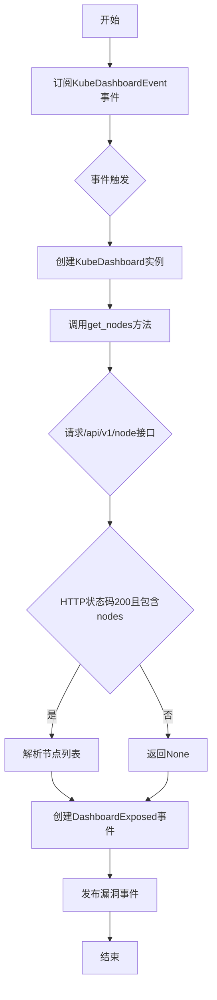
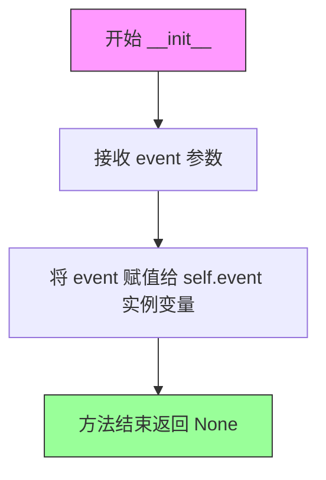
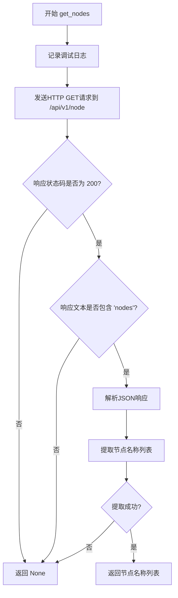
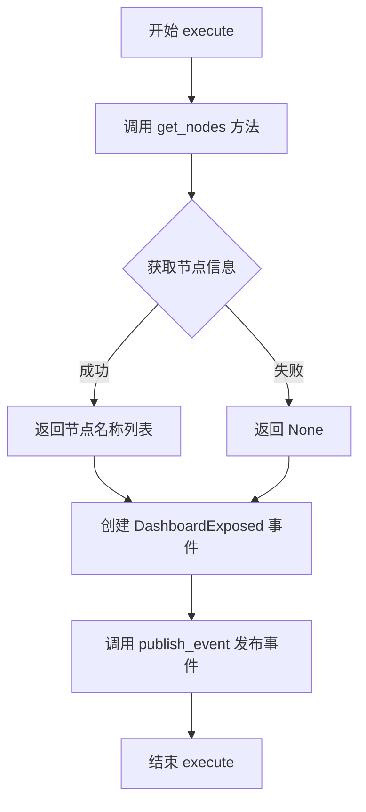

# `kubehunter\kube_hunter\modules\hunting\dashboard.py` 详细设计文档

这是一个Kubernetes安全漏洞扫描模块，用于检测Kubernetes Dashboard是否暴露在集群外部，并通过Dashboard API接口获取集群节点信息，当发现Dashboard暴露时发布漏洞事件。

## 整体流程



## 类结构

```
Vulnerability (基类)
├── DashboardExposed
Event (基类)
├── DashboardExposed
Hunter (基类)
└── KubeDashboard
```

## 全局变量及字段


### `logger`
    
模块级日志记录器，用于记录调试和错误信息

类型：`logging.Logger`
    


### `DashboardExposed.evidence`
    
节点信息字符串，格式为'nodes: node1 node2 ...'

类型：`str`
    


### `KubeDashboard.event`
    
存储传入的事件对象，包含Dashboard的host和port信息

类型：`KubeDashboardEvent`
    
    

## 全局函数及方法


### `DashboardExposed.__init__`

初始化 DashboardExposed 漏洞对象，接收节点列表参数，设置漏洞的基本信息（包括名称、类别、VID等），并根据节点列表生成证据字符串。

参数：

- `nodes`：`list`，节点名称列表，用于记录哪些节点暴露了Dashboard

返回值：`None`，`__init__` 方法不返回值

#### 流程图

```mermaid
flowchart TD
    A[开始 __init__] --> B[调用父类 Vulnerability.__init__]
    B --> C[设置漏洞名称: Dashboard Exposed]
    B --> D[设置目标类型: KubernetesCluster]
    B --> E[设置漏洞类别: RemoteCodeExec]
    B --> F[设置漏洞ID: KHV029]
    C --> G{检查 nodes 是否有值}
    G -->|有值| H[格式化节点列表为字符串]
    H --> I[设置 self.evidence = "nodes: {节点列表}"]
    G -->|无值| J[设置 self.evidence = None]
    I --> K[结束 __init__]
    J --> K
```

#### 带注释源码

```python
def __init__(self, nodes):
    """
    初始化 DashboardExposed 漏洞对象
    
    参数:
        nodes: 节点名称列表，用于记录暴露Dashboard的节点信息
    """
    # 调用父类 Vulnerability 的初始化方法，设置漏洞的元数据信息
    # 参数说明：
    #   - KubernetesCluster: 表示该漏洞影响的目标类型为 Kubernetes 集群
    #   - "Dashboard Exposed": 漏洞的显示名称
    #   - category=RemoteCodeExec: 漏洞类别为远程代码执行
    #   - vid="KHV029": 漏洞的唯一标识符
    Vulnerability.__init__(
        self, KubernetesCluster, "Dashboard Exposed", category=RemoteCodeExec, vid="KHV029",
    )
    
    # 根据节点列表生成证据字符串
    # 如果节点列表有值，则格式化为 "nodes: node1 node2 node3" 的形式
    # 如果节点列表为空或None，则设置为 None
    self.evidence = "nodes: {}".format(" ".join(nodes)) if nodes else None
```


### `KubeDashboard.__init__`

初始化 Hunter 对象，接收事件参数并存储为实例变量，用于后续处理 Kubernetes Dashboard 相关的发现结果。

参数：

-  `event`：`KubeDashboardEvent`，从事件总线接收的 Dashboard 发现事件，包含目标主机的连接信息（host 和 port）

返回值：`None`，无返回值（Python 方法默认返回 None）

#### 流程图



#### 带注释源码

```python
def __init__(self, event):
    """初始化 KubeDashboard 猎手模块
    
    接收 KubeDashboardEvent 事件，该事件包含被发现的 Dashboard 目标信息
    （主机地址和端口），用于后续执行节点信息获取和漏洞发布操作。
    
    Args:
        event: KubeDashboardEvent 实例，包含发现到的 Dashboard 主机信息
    """
    # 将传入的事件对象存储为实例变量
    # 后续在 execute 方法中会通过 self.event.host 和 self.event.port 访问目标地址
    self.event = event
```


### `KubeDashboard.get_nodes`

该方法通过向Kubernetes Dashboard发送HTTP GET请求，获取集群节点列表信息，解析返回的JSON数据提取节点名称，最终返回节点名称列表或None。

参数：此方法无参数

返回值：`Optional[List[str]]`，返回节点名称列表，解析失败或请求失败时返回None

#### 流程图



#### 带注释源码

```python
def get_nodes(self):
    """
    获取Kubernetes集群节点列表
    通过Dashboard API端点获取节点信息并解析节点名称
    """
    # 记录调试日志，表明正在尝试获取集群节点类型
    logger.debug("Passive hunter is attempting to get nodes types of the cluster")
    
    # 向Dashboard API发送GET请求获取节点列表
    # URL格式: http://{host}:{port}/api/v1/node
    # 使用配置的网络超时时间
    r = requests.get(
        f"http://{self.event.host}:{self.event.port}/api/v1/node", 
        timeout=config.network_timeout
    )
    
    # 检查HTTP响应状态码为200且响应内容包含节点信息
    if r.status_code == 200 and "nodes" in r.text:
        # 解析JSON响应体，提取所有节点的objectMeta.name字段
        # 返回格式: ["node1", "node2", ...]
        return [node["objectMeta"]["name"] for node in json.loads(r.text)["nodes"]]
    
    # 请求失败或响应不符合预期时返回None
    # （隐式返回）
```


### `KubeDashboard.execute()`

执行漏洞检测流程，调用 get_nodes 方法获取 Kubernetes 集群中的节点信息，并将检测结果封装为 DashboardExposed 事件进行发布。

参数：

- 此方法无参数（仅包含隐式参数 `self`）

返回值：`None`，无返回值。该方法通过 `publish_event` 事件发布机制将检测结果发送出去，而非通过返回值传递。

#### 流程图



#### 带注释源码

```python
def execute(self):
    """
    执行漏洞检测流程
    
    该方法是 KubeDashboard 类的核心执行入口，负责：
    1. 调用 get_nodes() 方法获取集群中的节点信息
    2. 将获取到的节点信息封装到 DashboardExposed 事件对象中
    3. 通过事件发布机制将漏洞事件广播给订阅者
    """
    # 调用 get_nodes() 方法获取节点列表，然后将其作为参数传递给 DashboardExposed 事件构造函数
    # 并通过 publish_event 方法发布该事件
    self.publish_event(DashboardExposed(nodes=self.get_nodes()))
```

## 关键组件


### DashboardExposed

一个继承自Vulnerability和Event的漏洞类，用于表示Kubernetes集群中Dashboard暴露的安全风险，包含节点信息作为证据。

### KubeDashboard

一个继承自Hunter的检测类，通过订阅KubeDashboardEvent事件来发现集群中暴露的Dashboard，并获取节点类型信息。

### get_nodes

获取集群中节点列表的方法，通过调用Dashboard的API端点获取节点元数据信息。

### execute

执行Dashboard暴露检测的方法，调用get_nodes获取节点信息并发布DashboardExposed事件。

### handler.subscribe(KubeDashboardEvent)

事件订阅机制，用于监听Dashboard发现事件并触发KubeDashboard检测器。


## 问题及建议


### 已知问题

- **异常处理缺失**：`get_nodes`方法中的`requests.get`调用没有try-except包装，无法处理网络超时、连接错误等异常情况
- **日志记录不完整**：`get_nodes`只在方法开始记录debug日志，成功或失败时均无日志；`execute`方法完全没有日志记录
- **JSON解析风险**：直接使用`json.loads(r.text)`解析响应，未处理可能的`JSONDecodeError`异常
- **类型提示缺失**：所有方法和字段均缺少类型注解，影响代码可维护性和IDE支持
- **硬编码协议**：代码中硬编码使用`http://`，未考虑HTTPS Dashboard的场景
- **返回类型不一致**：`get_nodes`方法可能返回`list`或`None`，调用方需要额外的类型检查
- **错误传播机制缺失**：当API请求失败时，`execute`方法仍会调用`publish_event`并传递`None`或空列表，可能导致下游处理异常
- **依赖外部配置未验证**：`config.network_timeout`的使用未做有效性验证

### 优化建议

- 为`requests.get`调用添加完整的异常处理（捕获`requests.RequestException`及其子类），并在异常情况下记录warning日志后返回空列表或`None`
- 为`json.loads`调用添加异常处理，防止无效JSON导致程序崩溃
- 在`execute`方法中添加必要的日志记录，记录节点获取的结果和事件发布状态
- 为所有方法添加类型提示（`-> List[str]`、`-> None`等），明确输入输出类型
- 考虑支持HTTPS协议，可通过配置或检测响应自动判断
- 统一`get_nodes`方法的返回类型，建议始终返回列表（空列表表示无数据）
- 在`execute`方法中检查`get_nodes`返回值，若为`None`或空列表则跳过事件发布或记录info日志
- 在类初始化时验证`config.network_timeout`的有效性，提供合理的默认值


## 其它


### 设计目标与约束

设计目标：自动发现并报告Kubernetes Dashboard的暴露风险，获取集群节点信息用于安全评估。约束：依赖Kubernetes API访问权限，仅在Dashboard可访问时生效，使用被动探测方式避免触发告警。

### 错误处理与异常设计

网络请求异常：捕获requests异常并记录debug级别日志，返回None。JSON解析异常：捕获json.JSONDecodeError，记录错误日志并返回None。超时处理：使用config.network_timeout控制请求超时时间。状态码非200处理：仅在状态码为200且响应包含nodes字段时解析数据。

### 数据流与状态机

数据流：KubeDashboardEvent触发 -> KubeDashboard.get_nodes() -> requests请求Dashboard API -> 解析响应获取节点列表 -> 发布DashboardExposed事件。状态机：初始状态(等待事件) -> 执行状态(获取节点) -> 完成状态(发布事件)。

### 外部依赖与接口契约

外部依赖：requests库用于HTTP请求，json库用于解析响应，kube_hunter.conf.config提供配置，kube_hunter.core.events用于事件处理。接口契约：get_nodes()返回节点名称列表或None，execute()发布DashboardExposed事件，__init__接收KubeDashboardEvent类型的event参数。

### 性能考虑

请求超时限制：使用config.network_timeout防止请求阻塞。单次请求：仅发起一次API请求获取节点信息。无循环：执行一次后立即返回，避免资源浪费。

### 安全性考虑

信息泄露风险：节点名称会被包含在漏洞事件中发布。凭证要求：依赖Dashboard的访问凭证配置。网络隔离：仅在Dashboard可访问的内网环境执行。

### 测试策略

单元测试：mock requests.get测试不同响应场景(200/404/500/超时)，测试JSON解析异常处理。集成测试：测试与KubeDashboardEvent的事件订阅和发布流程。边界测试：测试nodes为空或不存在的情况。

### 日志策略

debug级别：记录get_nodes()的执行尝试和请求URL。info级别：无。warning级别：无。error级别：记录在异常处理中捕获的错误。

### 监控与可观测性

事件指标：跟踪DashboardExposed事件发布次数。时间指标：记录请求耗时(可通过requests的elapsed属性获取)。成功/失败指标：统计get_nodes()成功返回和返回None的次数。

### 配置项依赖

network_timeout：控制HTTP请求超时时间，由kube_hunter.conf.config提供。Dashboard地址：通过KubeDashboardEvent的host和port属性获取。

### 并发与线程安全

单线程执行：无并发操作，无需线程同步。事件驱动：依赖kube-hunter的事件处理框架。

### 错误恢复机制

请求失败：返回None而非抛出异常，确保主流程继续。解析失败：返回None，允许调用方处理空值情况。

### 资源清理

无资源需要显式清理：requests.Response对象会被自动垃圾回收。无文件句柄、网络连接需要关闭。

### 兼容性考虑

Kubernetes版本：API路径/api/v1/node兼容多数版本。Dashboard版本：假设Dashboard支持v1 API，旧版本可能不兼容。

### 扩展性设计

模块化设计：Hunter基类便于扩展新的发现模块。事件系统：便于添加新的漏洞类型或与其他模块集成。

### 代码质量

单一职责：KubeDashboard类专注于Dashboard发现。清晰的命名：方法名(get_nodes/execute)清晰表达功能。文档完善：类和方法均有docstring说明。


    