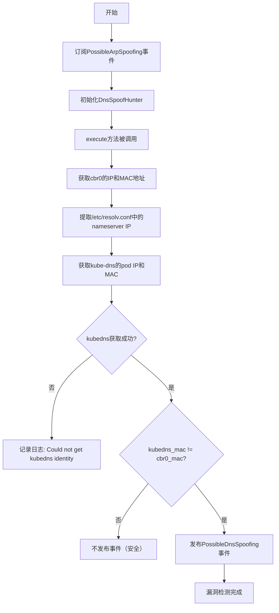
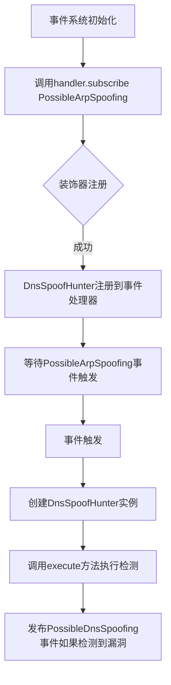
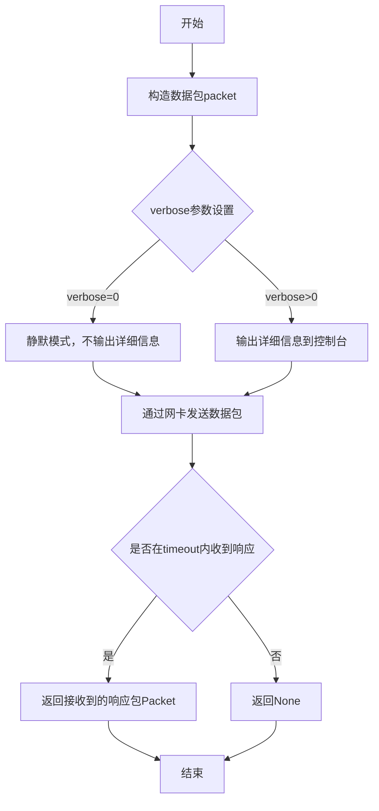
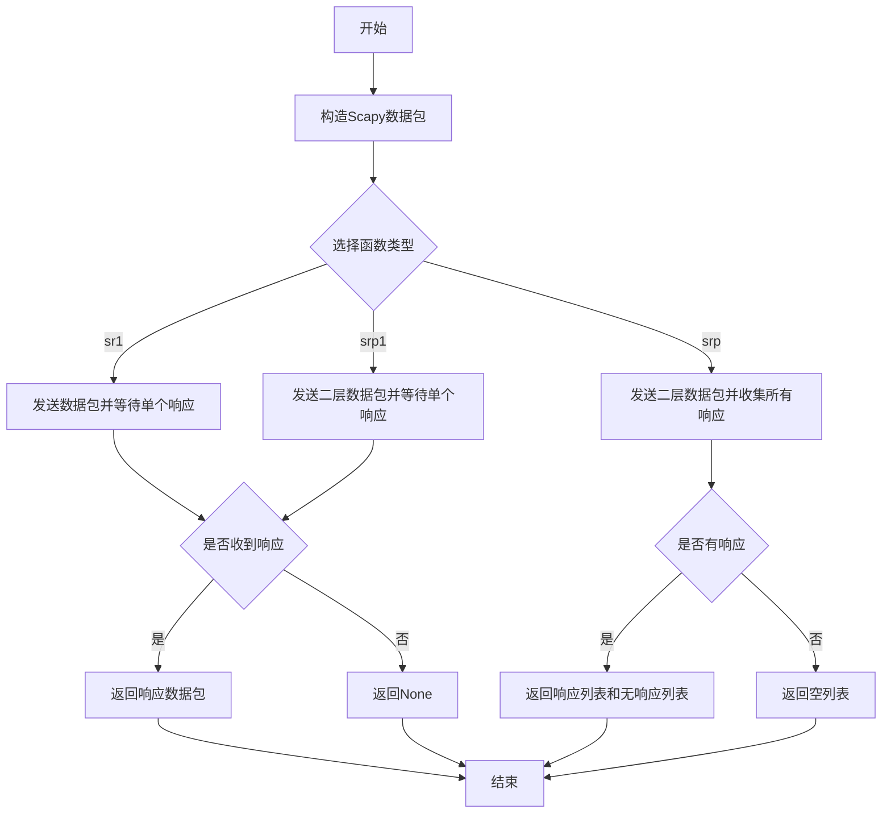
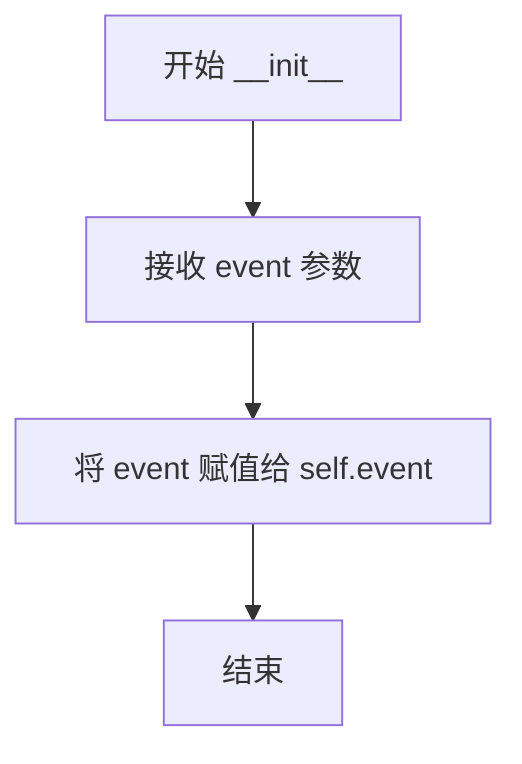
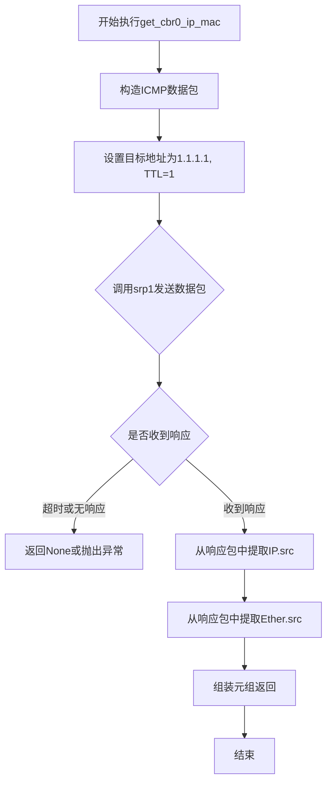
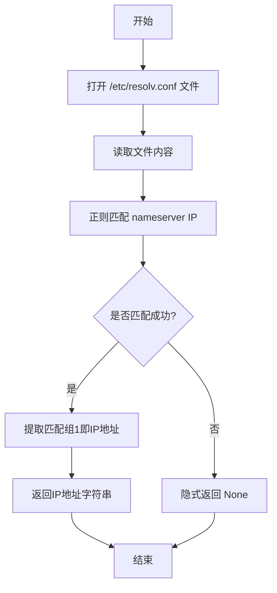
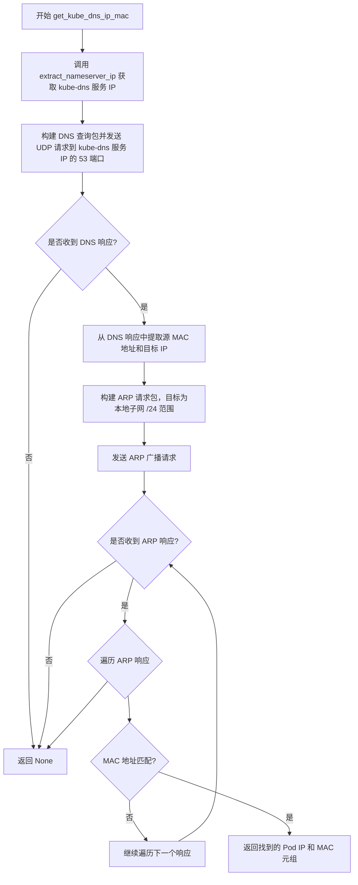
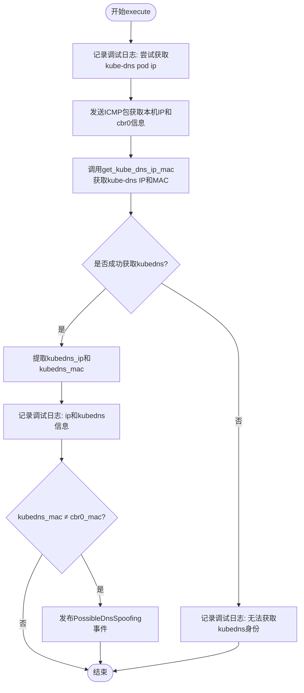

# `kubehunter\kube_hunter\modules\hunting\dns.py` 详细设计文档

这是一个Kubernetes集群安全检测模块，通过分析网络流量和ARP表，检测集群内是否存在DNS欺骗（DNS Spoofing）攻击的可能性，主要通过比较kube-dns pod的MAC地址与cbr0网桥的MAC地址来判断是否存在MITM攻击风险。

## 整体流程



## 类结构

```
Event (基类)
├── Vulnerability (继承Event)
│   └── PossibleDnsSpoofing
ActiveHunter (基类)
└── DnsSpoofHunter
```

## 全局变量及字段


### `logger`
    
模块级日志记录器，用于记录DnsSpoofHunter模块的运行日志

类型：`logging.Logger`
    


### `config`
    
kube-hunter配置对象，通过外部导入获取，包含网络超时等配置参数

类型：`module`
    


### `handler`
    
事件处理器模块，通过外部导入用于订阅和发布事件

类型：`module`
    


### `PossibleDnsSpoofing.kubedns_pod_ip`
    
kube-dns pod的IP地址，用于标识可能存在DNS欺骗风险的Pod

类型：`str`
    


### `PossibleDnsSpoofing.evidence`
    
证据字符串，包含kube-dns地址信息，用于记录检测到的DNS服务地址

类型：`str`
    


### `DnsSpoofHunter.event`
    
接收的ARP欺骗事件，作为触发DNS欺骗检测的输入事件

类型：`PossibleArpSpoofing`
    
    

## 全局函数及方法


### `handler.subscribe(PossibleArpSpoofing)`

事件订阅装饰器，用于监听 `PossibleArpSpoofing` 事件并注册 `DnsSpoofHunter` 类作为该事件的处理器。当集群中检测到可能的 ARP 欺骗攻击时，触发 DNS 欺骗漏洞检测。

参数：

-  `PossibleArpSpoofing`：`type`，事件类型参数，指定要监听的事件类（即 `PossibleArpSpoofing` 事件，当该事件发生时触发 `DnsSpoofHunter` 的执行）

返回值：`Callable`，返回装饰器函数，将 `DnsSpoofHunter` 类注册到事件处理系统中

#### 流程图



#### 带注释源码

```python
# 导入事件处理模块
from kube_hunter.core.events import handler

# 使用handler.subscribe装饰器订阅PossibleArpSpoofing事件
# 当PossibleArpSpoofing事件被发布时，DnsSpoofHunter类的execute方法会被调用
@handler.subscribe(PossibleArpSpoofing)
class DnsSpoofHunter(ActiveHunter):
    """DNS Spoof Hunter
    Checks for the possibility for a malicious pod to compromise DNS requests of the cluster
    (results are based on the running node)
    """
    
    def __init__(self, event):
        # 初始化方法，接收事件对象
        # 参数: event - PossibleArpSpoofing事件实例，包含触发该事件的相关数据
        self.event = event
    
    def get_cbr0_ip_mac(self):
        # 获取cbr0网桥的IP和MAC地址
        # 通过发送ICMP包到1.1.1.1并设置TTL=1来触发路由从而获取本地网桥信息
        res = srp1(Ether() / IP(dst="1.1.1.1", ttl=1) / ICMP(), verbose=0, timeout=config.network_timeout)
        return res[IP].src, res.src
    
    def extract_nameserver_ip(self):
        # 从/etc/resolv.conf文件中提取第一个 nameserver 的IP地址
        with open("/etc/resolv.conf") as f:
            # 使用正则表达式匹配 nameserver 后面的IP地址
            match = re.search(r"nameserver (\d+.\d+.\d+.\d+)", f.read())
            if match:
                return match.group(1)
    
    def get_kube_dns_ip_mac(self):
        # 获取kube-dns服务的实际Pod IP和MAC地址
        # 步骤1: 获取集群DNS服务的IP地址
        kubedns_svc_ip = self.extract_nameserver_ip()
        
        # 步骤2: 发送DNS查询获取DNS响应的源MAC地址（即为kube-dns pod的MAC）
        dns_info_res = srp1(
            Ether() / IP(dst=kubedns_svc_ip) / UDP(dport=53) / DNS(rd=1, qd=DNSQR()),
            verbose=0,
            timeout=config.network_timeout,
        )
        kubedns_pod_mac = dns_info_res.src
        self_ip = dns_info_res[IP].dst
        
        # 步骤3: 通过ARP扫描找到对应MAC地址的IP地址
        arp_responses, _ = srp(
            Ether(dst="ff:ff:ff:ff:ff:ff") / ARP(op=1, pdst=f"{self_ip}/24"), 
            timeout=config.network_timeout, 
            verbose=0,
        )
        for _, response in arp_responses:
            if response[Ether].src == kubedns_pod_mac:
                return response[ARP].psrc, response.src
    
    def execute(self):
        """主执行方法，当PossibleArpSpoofing事件触发时被调用"""
        logger.debug("Attempting to get kube-dns pod ip")
        
        # 步骤1: 发送ICMP包获取本机IP地址
        self_ip = sr1(IP(dst="1.1.1.1", ttl=1) / ICMP(), verbose=0, timeout=config.netork_timeout)[IP].dst
        
        # 步骤2: 获取cbr0网桥的IP和MAC地址
        cbr0_ip, cbr0_mac = self.get_cbr0_ip_mac()
        
        # 步骤3: 获取kube-dns的IP和MAC地址
        kubedns = self.get_kube_dns_ip_mac()
        
        if kubedns:
            kubedns_ip, kubedns_mac = kubedns
            logger.debug(f"ip={self_ip} kubednsip={kubedns_ip} cbr0ip={cbr0_ip}")
            
            # 步骤4: 比较kube-dns的MAC与cbr0的MAC
            # 如果不同，说明当前Pod与kube-dns Pod在同一子网，存在DNS欺骗风险
            if kubedns_mac != cbr0_mac:
                # 发布PossibleDnsSpoofing漏洞事件
                self.publish_event(PossibleDnsSpoofing(kubedns_pod_ip=kubedns_ip))
        else:
            logger.debug("Could not get kubedns identity")
```


### `re.search`

这是 Python 标准库中的正则表达式搜索函数，用于在字符串中查找第一个匹配的子串。在 `DnsSpoofHunter.extract_nameserver_ip` 方法中，该函数被用来从 `/etc/resolv.conf` 文件中提取第一个 nameserver 的 IP 地址。

参数：

- `pattern`：`str`，正则表达式模式，描述要匹配的字符串格式。这里是 `r"nameserver (\d+.\d+.\d+.\d+)"`，用于匹配 "nameserver" 后跟的 IPv4 地址，并将 IP 地址部分捕获为第一个分组。
- `string`：`str`，要在其中进行搜索的字符串。这里是 `f.read()` 的结果，即读取的 `/etc/resolv.conf` 文件内容。

返回值：`Optional[Match[str]]`，如果找到匹配则返回 `re.Match` 对象（包含匹配信息和捕获组），如果未找到匹配则返回 `None`。

#### 流程图

```mermaid
flowchart TD
    A[开始 re.search] --> B{检查 pattern 是否匹配 string}
    B -->|匹配成功| C[返回 Match 对象]
    B -->|匹配失败| D[返回 None]
    C --> E{检查 match 是否为真}
    E -->|是| F[调用 match.group(1) 提取捕获的 IP]
    E -->|否| G[返回 None]
    F --> H[返回提取的 IP 地址字符串]
    G --> H
```

#### 带注释源码

```python
def extract_nameserver_ip(self):
    """
    从 /etc/resolv.conf 文件中提取第一个 nameserver 的 IP 地址
    
    Returns:
        str or None: 第一个 nameserver 的 IP 地址，如果未找到则返回 None
    """
    with open("/etc/resolv.conf") as f:
        # finds first nameserver in /etc/resolv.conf
        # re.search 在字符串中查找第一个匹配的子串
        # pattern 解释:
        #   nameserver - 匹配字面字符串 "nameserver"
        #   (\d+.\d+.\d+.\d+) - 捕获组，匹配 IPv4 地址格式
        #       \d+ - 匹配一个或多个数字
        #       . - 匹配任意字符（这里实际上是匹配 IP 地址的点号，但在正则中 . 需要转义）
        #       注意: 当前正则中 . 没有转义，应该使用 \. 才是正确的
        match = re.search(r"nameserver (\d+.\d+.\d+.\d+)", f.read())
        
        # re.search 返回 None 如果没有匹配，否则返回 Match 对象
        # Match 对象在布尔上下文中为真，None 为假
        if match:
            # match.group(1) 返回第一个捕获组的内容，即 IP 地址
            return match.group(1)
        
        # 如果没有找到匹配，返回 None
        return None
```


### `srp1`

Scapy的`srp1`函数用于发送一个数据包并等待接收单个响应包，常用于网络探测和漏洞扫描场景。该函数会构造并发送指定的网络数据包，然后阻塞等待接收响应，如果在超时时间内没有收到响应则返回None。

#### 参数

- `packet`：`Packet`类型，要发送的Scapy数据包对象（如`Ether() / IP() / ICMP()`等组合）
- `timeout`：`int`类型，可选参数，等待响应的超时时间（秒），默认根据Scapy配置
- `verbose`：`int`或`bool`类型，可选参数，输出详细程度，0表示静默模式
- `**kwargs`：其他可选参数，如`iface`（网络接口）等Scapy支持的参数

#### 返回值

- `Packet`或`None`：返回接收到的响应数据包对象，如果没有响应则返回`None`

#### 流程图



#### 带注释源码

```python
# srp1函数是Scapy库的核心函数之一
# 位置：scapy/sendrecv.py

def srp1(x, promisc=None, iface=None, iface_hint=None, 
         timeout=None, verbose=None, **kargs):
    """
    发送数据包并等待单个响应
    
    参数:
        x: 要发送的Packet或PacketList对象
        promisc: 混杂模式设置
        iface: 指定网络接口
        iface_hint: 接口提示信息
        timeout: 超时时间（秒）
        verbose: 输出详细程度
        **kargs: 其他传递给sr和send接受的口
    
    返回:
        第一个接收到的响应包，如果没有响应则返回None
    """
    # 内部调用sr函数，expectone=True表示只等待一个响应
    ans, unans = sr(x, promisc=promisc, iface=iface, 
                    iface_hint=iface_hint, timeout=timeout, 
                    verbose=verbose, expectOne=True, **kargs)
    
    # 如果有响应返回第一个响应包，否则返回None
    if ans:
        return ans[0][1]
    return None
```

---

### 代码中的实际调用示例

#### 调用点1：`get_cbr0_ip_mac`方法

```python
def get_cbr0_ip_mac(self):
    # 发送ICMP包探测本机IP和MAC地址
    # Ether()构造以太网帧，/操作符layer组合包
    res = srp1(
        Ether() / IP(dst="1.1.1.1", ttl=1) / ICMP(),  # 构造数据包：MAC/IP/ICMP
        verbose=0,    # 静默模式，不输出详细信息
        timeout=config.network_timeout  # 从配置读取超时时间
    )
    # 返回源IP和源MAC地址
    return res[IP].src, res.src
```

#### 调用点2：`get_kube_dns_ip_mac`方法

```python
def get_kube_dns_ip_mac(self):
    # 构造DNS查询包获取kube-dns的MAC地址
    dns_info_res = srp1(
        Ether() / IP(dst=kubedns_svc_ip) / UDP(dport=53) / DNS(rd=1, qd=DNSQR()),
        verbose=0,
        timeout=config.network_timeout,
    )
    # 从响应中提取DNS服务MAC地址
    kubedns_pod_mac = dns_info_res.src
```

#### 调用点3：`execute`方法

```python
def execute(self):
    # 发送ICMP包探测本机IP地址
    # 注意：此处代码存在typo，使用了config.netork_timeout而非config.network_timeout
    self_ip = sr1(IP(dst="1.1.1.1", ttl=1) / ICMP(), 
                  verbose=0, 
                  timeout=config.netork_timeout)[IP].dst
```

---

### 技术债务与优化空间

1. **typo错误**：`execute`方法中使用了`config.netork_timeout`（应为`config.network_timeout`），这可能导致运行时错误
2. **异常处理缺失**：多处调用`srp1`未检查返回值是否为`None`，直接访问可能导致`TypeError`
3. **超时配置不一致**：`get_cbr0_ip_mac`使用`config.network_timeout`，而`execute`使用了错误的配置键名


### `sr1` / `srp1` / `srp`

Scapy函数，用于发送网络数据包并接收响应。`sr1`发送单个数据包并返回第一个响应，`srp1`发送二层数据包并返回第一个响应，`srp`发送二层数据包并收集所有响应。

参数：

- `x`：`Packet`（数据包），构造的Scapy数据包对象
- `timeout`：`int`（超时时间），等待响应的秒数
- `verbose`：`int`（详细输出级别），0表示静默模式

返回值：

- `sr1`/`srp1`：`Packet`或`None`，返回第一个响应的数据包，如果没有响应则返回None
- `srp`：`tuple`（响应列表和无响应列表），返回两个列表，第一个包含收到的响应，第二个包含未收到响应的请求

#### 流程图



#### 带注释源码

```python
# 在 DnsSpoofHunter.get_cbr0_ip_mac() 方法中使用 srp1
# 发送ICMP包到1.1.1.1获取本机IP和MAC地址
res = srp1(
    Ether() / IP(dst="1.1.1.1", ttl=1) / ICMP(),  # 构造以太网帧+IP包+ICMP包
    verbose=0,   # 关闭详细输出
    timeout=config.network_timeout  # 设置超时时间
)
# 返回: (源IP, 源MAC)
return res[IP].src, res.src

# 在 DnsSpoofHunter.get_kube_dns_ip_mac() 方法中使用 srp1
# 发送DNS查询包获取kube-dns的MAC地址
dns_info_res = srp1(
    Ether() / IP(dst=kubedns_svc_ip) / UDP(dport=53) / DNS(rd=1, qd=DNSQR()),
    verbose=0,
    timeout=config.network_timeout
)
# 返回: DNS响应包，从中提取MAC地址

# 在 DnsSpoofHunter.get_kube_dns_ip_mac() 方法中使用 srp
# 发送ARP请求扫描子网寻找kube-dns pod
arp_responses, _ = srp(
    Ether(dst="ff:ff:ff:ff:ff:ff") / ARP(op=1, pdst=f"{self_ip}/24"),  # 广播ARP请求
    timeout=config.network_timeout,
    verbose=0
)
# 返回: (响应列表, 无响应列表)

# 在 DnsSpoofHunter.execute() 方法中使用 sr1
# 发送ICMP包获取本机IP地址（注意：代码中有typo，config.netork_timeout应为config.network_timeout）
self_ip = sr1(
    IP(dst="1.1.1.1", ttl=1) / ICMP(),
    verbose=0,
    timeout=config.netork_timeout  # 应该是 config.network_timeout
)[IP].dst
```


### `PossibleDnsSpoofing.__init__`

初始化DNS欺骗漏洞事件对象，用于表示集群中可能存在的DNS欺骗攻击风险。

参数：

- `kubedns_pod_ip`：`str`，kube-dns服务的Pod IP地址，用于标识DNS服务位置

返回值：`None`，无返回值（`__init__`方法用于初始化对象状态）

#### 流程图

```mermaid
flowchart TD
    A[开始初始化 PossibleDnsSpoofing] --> B[接收 kubedns_pod_ip 参数]
    B --> C[调用父类 Vulnerability.__init__ 初始化]
    C --> D[设置攻击类型为 Possible DNS Spoof]
    C --> E[设置分类为 IdentityTheft]
    C --> F[设置漏洞ID为 KHV030]
    D --> G[保存 kubedns_pod_ip 到实例属性]
    G --> H[生成证据字符串: kube-dns at: {kubedns_pod_ip}]
    H --> I[结束]
```

#### 带注释源码

```python
def __init__(self, kubedns_pod_ip):
    """
    初始化 PossibleDnsSpoofing 漏洞事件对象
    
    参数:
        kubedns_pod_ip: str, kube-dns 服务的 Pod IP 地址
    """
    # 调用父类 Vulnerability 的初始化方法，设置漏洞元数据
    # - KubernetesCluster: 表示该漏洞影响 Kubernetes 集群
    # - "Possible DNS Spoof": 漏洞名称
    # - category=IdentityTheft: 漏洞分类为身份盗窃
    # - vid="KHV030": 漏洞唯一标识符
    Vulnerability.__init__(
        self, KubernetesCluster, "Possible DNS Spoof", category=IdentityTheft, vid="KHV030",
    )
    
    # 保存传入的 kube-dns Pod IP 地址到实例属性
    # 用于后续事件处理和报告生成
    self.kubedns_pod_ip = kubedns_pod_ip
    
    # 生成证据字符串，包含 DNS 服务的 IP 地址
    # 格式: "kube-dns at: {IP}"
    # 用于在报告中展示漏洞的具体证据信息
    self.evidence = "kube-dns at: {}".format(self.kubedns_pod_ip)
```


### `DnsSpoofHunter.__init__`

该方法为 DNS Spoof Hunter 的初始化方法，接收一个 PossibleArpSpoofing 事件对象作为参数，并将该事件存储为实例变量，以便后续在 execute 方法中访问 ARP 欺骗检测的结果信息。

参数：

- `event`：`PossibleArpSpoofing`，触发该 hunter 的事件对象，包含 ARP 欺骗检测的相关信息

返回值：`None`，__init__ 方法不返回任何值

#### 流程图



#### 带注释源码

```python
def __init__(self, event):
    """初始化 DnsSpoofHunter
    
    参数:
        event: PossibleArpSpoofing 事件对象，包含 ARP 欺骗检测的结果
               该事件由 arp.py 模块中的 PossibleArpSpoofing 事件类产生
    """
    # 将传入的 PossibleArpSpoofing 事件对象存储为实例变量
    # 以便在后续的 execute 方法中访问其包含的网络信息
    self.event = event
```


### `DnsSpoofHunter.get_cbr0_ip_mac`

获取cbr0网桥（Kubernetes节点上的桥接网络接口）的IP地址和MAC地址。该方法通过向外部IP（1.1.1.1）发送一个TTL为1的ICMP包，利用返回的响应包来提取本地网桥的IP和MAC信息。

参数：无（仅包含self参数）

返回值：`tuple`，返回包含IP地址和MAC地址的元组 `(ip_address: str, mac_address: str)`

#### 流程图



#### 带注释源码

```python
def get_cbr0_ip_mac(self):
    """
    获取cbr0网桥的IP和MAC地址
    
    原理：通过发送一个TTL=1的ICMP包到公网IP(1.1.1.1)，
    由于TTL=1，包会在第一跳（本地网关/cbr0桥）被丢弃并返回ICMP超时响应，
    从而可以获取到本地网桥的IP和MAC地址。
    """
    # 构造ICMP包：Ether()用于二层头部，IP()设置三层头部，ICMP()设置四层头部
    # dst="1.1.1.1" 是目标地址，ttl=1 确保包在第一跳被丢弃
    # verbose=0 关闭scapy的详细输出
    # timeout=config.network_timeout 设置网络超时时间
    res = srp1(Ether() / IP(dst="1.1.1.1", ttl=1) / ICMP(), verbose=0, timeout=config.network_timeout)
    
    # 从响应包中提取IP地址和MAC地址
    # res[IP].src 是响应包的源IP地址（即本地网桥IP）
    # res.src 是响应包的源MAC地址（即本地网桥MAC）
    return res[IP].src, res.src
```


### `DnsSpoofHunter.extract_nameserver_ip`

从 `/etc/resolv.conf` 文件中提取第一个 nameserver 的 IP 地址，并返回字符串格式的 IP。

参数：

- `self`：`DnsSpoofHunter`，类实例本身

返回值：`str`，从 `/etc/resolv.conf` 中提取的第一个 nameserver IP 地址字符串（格式如 "x.x.x.x"），若未找到则返回 `None`

#### 流程图



#### 带注释源码

```python
def extract_nameserver_ip(self):
    """从 /etc/resolv.conf 中提取第一个 nameserver IP 地址"""
    with open("/etc/resolv.conf") as f:
        # 使用正则表达式查找 nameserver 行并提取 IP 地址
        # 正则模式: 匹配 "nameserver " 后跟 IP 地址格式 (x.x.x.x)
        match = re.search(r"nameserver (\d+.\d+.\d+.\d+)", f.read())
        if match:
            # 返回第一个捕获组（即 IP 地址部分）
            return match.group(1)
```


### `DnsSpoofHunter.get_kube_dns_ip_mac`

该方法通过DNS查询获取kube-dns服务的响应包MAC地址，然后在本地子网进行ARP扫描以找到对应MAC地址的Pod IP，从而实现获取kube-dns Pod的真实IP地址和MAC地址。

参数：该方法没有显式参数（隐式使用self实例属性）

返回值：`tuple`，返回kube-dns Pod的IP地址和MAC地址的元组 `(ip, mac)`，如果获取失败则返回 `None`

#### 流程图



#### 带注释源码

```python
def get_kube_dns_ip_mac(self):
    """
    获取 kube-dns Pod 的 IP 地址和 MAC 地址
    
    实现原理：
    1. 从 /etc/resolv.conf 获取 kube-dns 服务的 Cluster IP
    2. 向该 IP 发送 DNS 查询请求，从响应包中获取源 MAC 地址（即 kube-dns Pod 的 MAC）
    3. 在本地子网进行 ARP 扫描，根据 MAC 地址匹配找到对应的 Pod IP
    
    返回:
        tuple: (pod_ip, pod_mac) 元组，如果获取失败返回 None
    """
    
    # 步骤1: 从 /etc/resolv.conf 提取 nameserver IP (kube-dns service IP)
    kubedns_svc_ip = self.extract_nameserver_ip()

    # 步骤2: 发送 DNS 查询以获取 kube-dns pod 的 MAC 地址
    # 构建以太网层 + IP层 + UDP层 + DNS层的完整数据包
    # 目标端口为 53 (DNS)，rd=1 表示递归查询，qd=DNSQR() 构建空白查询记录
    dns_info_res = srp1(
        Ether() / IP(dst=kubedns_svc_ip) / UDP(dport=53) / DNS(rd=1, qd=DNSQR()),
        verbose=0,
        timeout=config.network_timeout,
    )
    
    # 从 DNS 响应中提取:
    # - src: 发送方的 MAC 地址 (kube-dns pod 的 MAC)
    # - dst: 响应目标 IP (本 Pod 的 IP)
    kubedns_pod_mac = dns_info_res.src
    self_ip = dns_info_res[IP].dst

    # 步骤3: 在本 Pod 所在子网进行 ARP 扫描
    # 构建广播 ARP 请求包 (ARP op=1 表示 ARP 请求)
    # pdst 设置为目标网络范围 (本 Pod IP/24)
    arp_responses, _ = srp(
        Ether(dst="ff:ff:ff:ff:ff:ff") / ARP(op=1, pdst=f"{self_ip}/24"), 
        timeout=config.network_timeout, 
        verbose=0,
    )
    
    # 遍历所有 ARP 响应，查找 MAC 地址匹配的设备
    for _, response in arp_responses:
        # response[Ether].src 表示响应者的 MAC 地址
        # 如果匹配到 kube-dns pod 的 MAC，则返回其 IP 地址 (psrc) 和 MAC
        if response[Ether].src == kubedns_pod_mac:
            return response[ARP].psrc, response.src
```


### `DnsSpoofHunter.execute`

该方法是DNS欺骗检测的核心执行逻辑，通过获取本机网络信息与kube-dns服务的IP和MAC地址进行比对，判断是否存在DNS欺骗风险。

参数：

- `self`：`DnsSpoofHunter` 类实例，代表当前hunter对象

返回值：`None`，该方法无返回值，主要通过发布事件来报告检测结果

#### 流程图



#### 带注释源码

```python
def execute(self):
    """
    执行DNS欺骗检测主逻辑
    通过比对kube-dns pod的MAC地址与cbr0网桥的MAC地址，
    判断是否存在DNS欺骗风险
    """
    # 记录调试日志，表明开始尝试获取kube-dns pod IP
    logger.debug("Attempting to get kube-dns pod ip")
    
    # 发送TTL为1的ICMP包到1.1.1.1，触发路由返回从而获取本机IP
    # 注意：这里有个typo，config.netork_timeout 应该是 config.network_timeout
    self_ip = sr1(IP(dst="1.1.1.1", ttl=1) / ICMP(), verbose=0, timeout=config.netork_timeout)[IP].dst
    
    # 获取cbr0网桥的IP和MAC地址
    cbr0_ip, cbr0_mac = self.get_cbr0_ip_mac()

    # 调用方法获取kube-dns的IP和MAC地址
    kubedns = self.get_kube_dns_ip_mac()
    
    # 判断是否成功获取kube-dns信息
    if kubedns:
        # 解包获取kube-dns的IP和MAC
        kubedns_ip, kubedns_mac = kubedns
        
        # 记录详细的IP信息用于调试
        logger.debug(f"ip={self_ip} kubednsip={kubedns_ip} cbr0ip={cbr0_ip}")
        
        # 核心检测逻辑：比较kube-dns的MAC与cbr0的MAC
        # 如果不同，说明可能存在DNS欺骗风险（kube-dns pod与本机在同一子网）
        if kubedns_mac != cbr0_mac:
            # 发布PossibleDnsSpoofing漏洞事件
            self.publish_event(PossibleDnsSpoofing(kubedns_pod_ip=kubedns_ip))
    else:
        # 获取kube-dns信息失败，记录调试日志
        logger.debug("Could not get kubedns identity")
```

## 关键组件


### PossibleDnsSpoofing

继承自 Vulnerability 和 Event 的漏洞事件类，用于表示 Kubernetes 集群中可能的 DNS 欺骗攻击。当检测到恶意 Pod 可能通过 ARP 欺骗实施中间人攻击并篡改 DNS 响应时触发此漏洞。

### DnsSpoofHunter

继承自 ActiveHunter 的主动猎杀类，负责检测集群中的 DNS 欺骗可能性。该类通过与 PossibleArpSpoofing 事件关联，验证在同一子网中运行恶意 Pod 是否能对集群的 DNS 请求进行 MITM 攻击。

### get_cbr0_ip_mac()

通过发送 ICMP 数据包到 1.1.1.1 获取本地主机的 cbr0 网桥 IP 地址和 MAC 地址，用于后续与 kube-dns Pod 的 MAC 地址进行比较以判断是否在同一子网。

### extract_nameserver_ip()

读取 /etc/resolv.conf 文件，使用正则表达式提取第一个 nameserver 的 IP 地址，用于获取 Kubernetes 集群中配置的 DNS 服务地址。

### get_kube_dns_ip_mac()

通过发送 DNS 查询包获取 kube-dns Pod 的 MAC 地址，然后利用 ARP 扫描在本地子网中查找对应的 IP 地址，实现对 Kubernetes DNS 服务实际 Pod IP 的发现。

### execute()

主执行方法，协调整个 DNS 欺骗检测流程：获取本机 IP、通过 ICMP 获取 cbr0 信息、发现 kube-dns 的 IP 和 MAC、比较 MAC 地址以判断是否存在 DNS 欺骗风险。

### 关键组件信息

**PossibleDnsSpoofing (漏洞类)** - 继承自 Vulnerability 和 Event 的安全漏洞事件类，包含 kubedns_pod_ip 字段和 evidence 证据信息

**DnsSpoofHunter (猎杀类)** - 继承自 ActiveHunter 的主动检测类，包含 event 字段和四个核心方法

**Scapy 网络库** - 使用 srp1、srp 函数发送和接收原始网络数据包进行 ARP 扫描和 DNS 查询

**ARP 扫描机制** - 通过对比 kubedns pod MAC 和 cbr0 MAC 判断是否处于同一子网

**配置文件依赖** - 通过 kube_hunter.conf.config 获取 network_timeout 网络超时配置

### 潜在的技术债务或优化空间

1. **错误处理不足**: execute() 方法中直接使用 [IP] 索引访问返回结果，没有进行 None 检查，可能导致 IndexError 异常
2. **typo 错误**: config.netork_timeout 应为 config.network_timeout（第91行）
3. **正则表达式效率**: 每次调用 extract_nameserver_ip() 都重新打开文件，可考虑缓存
4. **ARP 扫描范围**: 使用 /24 子网扫描可能产生较多广播流量，对于大型集群效率较低
5. **硬编码依赖**: 依赖特定网络接口名称 cbr0，可能不适用于所有 Kubernetes 部署环境

### 其它项目

**设计目标与约束**: 基于 ARP 欺骗检测结果，进一步验证 DNS 欺骗可能性，仅在 Pod 运行环境（RunningAsPod）下触发检测

**错误处理与异常设计**: 主要依赖 Scapy 的 timeout 参数处理网络超时，缺乏主动的异常捕获和重试机制

**数据流与状态机**: 事件驱动架构，通过 @handler.subscribe(PossibleArpSpoofing) 订阅 ARP 欺骗事件触发 DNS 欺骗检测流程

**外部依赖与接口契约**: 依赖 scapy.all 进行原始数据包操作，依赖 /etc/resolv.conf 获取集群 DNS 配置，依赖 kube-hunter 框架的事件系统和配置模块


## 问题及建议


### 已知问题

-   **拼写错误**：在 `execute()` 方法中使用了 `config.netork_timeout`，正确应为 `config.network_timeout`，这会导致 `NameError` 或属性错误
-   **空值访问风险**：`get_cbr0_ip_mac()` 方法中，`sr1()` 可能返回 `None`（如超时），直接访问 `res[IP].src` 会抛出 `TypeError`
-   **空值访问风险**：`execute()` 方法中 `sr1(IP(dst="1.1.1.1", ttl=1) / ICMP(), ...)` 可能返回 `None`，未做检查直接访问 `[IP].dst`
-   **空值访问风险**：`get_kube_dns_ip_mac()` 中 `dns_info_res` 可能为 `None`，`extract_nameserver_ip()` 可能返回 `None`，均未做防御性检查
-   **逻辑错误**：`execute()` 中获取 `self_ip` 的方式不可靠，通过 ICMP ttl=1 追踪路由返回的源 IP 并非一定是本机 cbr0 接口 IP
-   **空值处理缺失**：`get_kube_dns_ip_mac()` 方法在获取失败时返回 `None`，但调用方未做判断就直接解包赋值 `kubedns_ip, kubedns_mac = kubedns`
-   **硬编码网络参数**：硬编码测试 IP "1.1.1.1" 和子网掩码 "/24"，缺乏灵活性
-   **过度网络扫描**：ARP 扫描整个 /24 网段 (254个地址)，效率低下且易产生网络噪声

### 优化建议

-   修复拼写错误：`netork_timeout` -> `network_timeout`
-   为所有 `sr1/srp1/srp` 调用添加空值检查和 try-except 异常处理
-   改进 `self_ip` 获取逻辑，可通过读取网络接口配置或使用更可靠的方式
-   将硬编码的 IP 和子网掩码提取为配置参数
-   优化 ARP 扫描范围，可先通过 ARP 获取网关或特定 IP，避免全网段扫描
-   为 `extract_nameserver_ip()` 和 `get_kube_dns_ip_mac()` 添加详细的日志记录，便于调试
-   考虑使用上下文管理器更明确地处理资源，并添加超时异常处理
-   对 `kubedns_svc_ip` 为 `None` 的情况提前进行校验

## 其它


### 设计目标与约束

本模块的设计目标是在Kubernetes集群中检测可能的DNS欺骗攻击，识别恶意Pod可能对集群DNS请求进行中间人攻击的风险。约束条件包括：仅在以Pod方式运行时触发、需要网络扫描权限、需要访问/etc/resolv.conf文件。

### 错误处理与异常设计

代码中使用了try-except处理网络超时（config.network_timeout），对于无法获取kube-dns身份的情况仅记录debug级别日志并返回None。异常处理策略：网络请求失败返回None而不是抛出异常，使检测流程能够优雅降级；文件读取异常未做处理可能导致程序中断。

### 数据流与状态机

数据流：订阅PossibleArpSpoofing事件 -> 获取本机IP和MAC -> 读取nameserver配置 -> 发送DNS请求获取kube-dns MAC -> ARP扫描获取kube-dns IP -> 比较MAC地址 -> 发布PossibleDnsSpoofing事件或记录日志。状态机包含：初始状态 -> 网络探测状态 -> 数据分析状态 -> 事件发布状态。

### 外部依赖与接口契约

外部依赖包括：scapy.all（网络包处理）、re（正则表达式）、logging（日志）、kube_hunter配置和事件系统。接口契约：subscribe(PossibleArpSpoofing)表示订阅ARP欺骗事件；publish_event(PossibleDnsSpoofing)表示发布DNS欺骗漏洞事件；config.network_timeout和config.netork_timeout（注意代码中存在typo）为网络超时配置。

### 关键组件信息

PossibleDnsSpoofing：继承Vulnerability和Event的漏洞事件类，用于描述DNS欺骗漏洞的详细信息。DnsSpoofHunter：继承ActiveHunter的主动检测类，实现具体的DNS欺骗检测逻辑。scapy网络操作函数：srp1、srp、sr1分别用于发送和接收单个或多个网络包。

### 潜在技术债务与优化空间

1. 代码第70行存在typo：config.netork_timeout应为config.network_timeout；2. extract_nameserver_ip方法未处理文件不存在或无权限的情况；3. get_cbr0_ip_mac和execute方法中重复发送ICMP包（可以复用）；4. 缺少对IPv6的支持；5. 硬编码了1.1.1.1作为测试地址，应使用配置；6. ARP扫描使用/24网段可能效率低下。

### 线程安全与并发考虑

代码本身为单线程执行，但网络操作为阻塞IO。多个Hunter实例可能并发执行，需要确保事件发布的线程安全性。当前实现中每个Hunter实例维护自己的event状态，无共享状态修改。

### 测试与可观测性

日志使用logging模块，debug级别用于流程追踪，缺少结构化日志。缺少单元测试和集成测试。未暴露Prometheus指标。

### 性能考量

ARP扫描使用/24网段可能产生255个包，在大型网络中性能较差。多次网络请求未做并行化处理。可以考虑：使用更精确的ARP扫描而非全网段扫描、并行执行独立的网络请求、添加超时控制和重试机制。

    